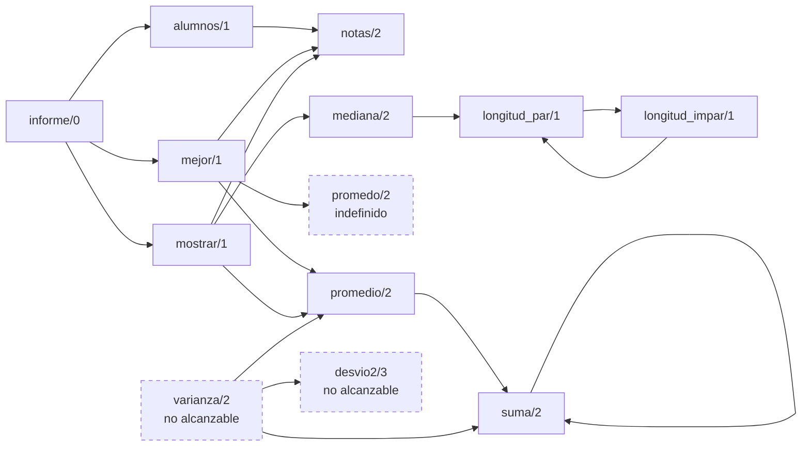

# Capítulo 59 — Proyecto: análisis de programas

Un programa Prolog es un conjunto de términos, y un programa que lee términos
puede leer otro programa. Leído así, sin ejecutarlo, un programa responde
preguntas sobre su propia estructura: qué predicado llama a cuál, cuáles se
llaman sin estar definidos, cuáles no se usan desde ningún punto de entrada,
cuáles son recursivos, solos o en grupo, y dónde el código se aparta de las
convenciones del curso. Ejecutado por un intérprete propio, responde además
cuántas veces se llama cada predicado en una ejecución concreta.



El grafo de llamadas del programa `notas` de la
[sección 59.1](#591-el-grafo-de-llamadas), sin los predicados predefinidos:
un arco de P a Q si una cláusula de P llama a Q. El análisis lee en él lo
que el programa tiene de defectuoso, con borde punteado: `promedo/2` se
llama y nadie lo define, y `varianza/2` y `desvio2/3` no se alcanzan desde
`informe/0`, el punto de entrada. Los ciclos son la recursión: `suma/2` se
llama a sí mismo, y `longitud_par/1` y `longitud_impar/1` se llaman
mutuamente.

El proyecto crece en cinco versiones. La primera recibe el programa como una
lista de cláusulas y arma el grafo de llamadas, con las construcciones de
control y las metallamadas. La segunda pregunta al grafo, con
`library(ugraphs)`, por los predicados indefinidos, los no usados y los
recursivos, y escribe el árbol de llamadas. La tercera lee el programa de sus
archivos, con módulos, directivas y gramáticas. La cuarta revisa el estilo, y
la quinta ejecuta el programa con un intérprete que cuenta las llamadas. El
programa terminado, `analisis.pl`, carga la cuarta versión, que carga las
anteriores, y escribe un informe sobre un conjunto de archivos. Aplicado a
*Inscripciones*, el proyecto de la parte II en la forma que tenía en el
[capítulo 31](../capitulo-31-ejecutables-y-distribucion/index.md), encuentra dos predicados que ningún punto de entrada alcanza:

<!-- ejemplo: capitulo-59/analisis.pl fragmento: :- ensure_loaded(revision) .. :- ensure_loaded(revision) -->
```prolog
:- ensure_loaded(revision).
```

```prolog
?- informe(inscripciones).
Programa: 11 archivos, 225 cláusulas, 98 predicados, 120 llamadas entre ellos
Indefinidos: ninguno
No alcanzables desde los puntos de entrada:
    legajo/2 (api.pl:155)
    resultado_json/3 (api.pl:134)
Recursivos:
    bucle/1
    palabras/3
    requisito/2
Avisos de estilo: ninguno
true.

?- referencias(inscripciones, inscripcion_posible/3).
inscripcion_posible/3 (reglas.pl:54)
    llama a: [alumno/4,materia/3,aprobada/3,cursa/2,correlativa/2,vacantes/2]
    lo llaman: [inscribir/3,puede_inscribirse/2]
true.
```

Los dos predicados no son código muerto: se llaman dentro del argumento de
`responder/1`, que los ejecuta como meta sin declararlo. La
[sección 59.3](#593-el-programa-leido-de-sus-archivos) explica por qué ningún análisis que lee el programa
los encuentra, y el [ejercicio 7](#ejercicios) infiere la declaración que falta.

El proyecto parte de *Prolog for Programmers* de Feliks Kluźniak y
Stanisław Szpakowicz, del apéndice «Three Useful Programs», que reúne tres
herramientas escritas en Prolog para su propio intérprete: un editor de
cláusulas, un rastreador primitivo y un analizador de la estructura de un
programa que se aplica a sí mismo. Del analizador, el capítulo toma el árbol
de llamadas numerado, que remite al número de un predicado ya listado en
lugar de repetirlo, la marca de los predicados indefinidos, la omisión de los
predefinidos y el examen de los argumentos de las metallamadas; del
rastreador, los predicados espiados, que escriben `+` al tener éxito y `-` al
fallar. Los programas del libro dependen de primitivas de aquel intérprete,
y el código del capítulo es propio. La comparación final es con
`library(prolog_xref)`, la biblioteca de referencias cruzadas de SWI-Prolog.

El capítulo usa el recorrido de términos del [capítulo 32](../capitulo-32-inspeccion-de-terminos/index.md), los intérpretes
del [capítulo 33](../capitulo-33-introspeccion-y-metainterpretes/index.md), las gramáticas del [capítulo 21](../capitulo-21-gramaticas-dcg/index.md), los módulos del
[capítulo 24](../capitulo-24-modulos-y-organizacion/index.md) y la lectura de términos del [capítulo 27](../capitulo-27-archivos-streams-y-formatos/index.md), y presenta
`library(ugraphs)`, que el [capítulo 22](../capitulo-22-estructuras-de-datos-de-la-biblioteca/index.md) no incluyó. Amplía lo que la
[sección 26.7](../capitulo-26-pruebas-y-depuracion/index.md#267-check0-list_undefined0-y-gxref0) mostró con `check/0` y `gxref/0`: aquí el análisis es un
programa que se puede leer y cambiar. La primera versión y el intérprete que
cuenta corren en SWISH; las demás leen archivos o cargan otros archivos, y se
ejecutan localmente.

## Objetivos del capítulo

Al terminar el capítulo, el lector puede:

- recorrer el cuerpo de una cláusula y obtener las metas que llama, a través
  de las construcciones de control y de los argumentos de las metallamadas;
- armar el grafo de llamadas de un programa con `library(ugraphs)` y obtener
  de él los predicados indefinidos, los no alcanzables desde los puntos de
  entrada y los grupos de predicados mutuamente recursivos;
- leer los archivos de un programa con `read_term/3`, con la posición, los
  nombres de las variables y los comentarios de cada término, y convertir
  directivas, módulos y reglas de gramática en cláusulas y puntos de entrada;
- distinguir lo que el análisis sabe del programa de lo que necesita saber
  del sistema y de sus bibliotecas, y reconocer los falsos positivos que
  produce la falta de ese conocimiento;
- revisar el estilo de un programa: variables singulares, cláusulas
  separadas y encabezados que faltan;
- contar las llamadas de una ejecución con un metaintérprete, y comparar el
  análisis con `library(prolog_xref)`.

!!! info "Tiempo estimado"
    Leer el capítulo, ejecutar sus ejemplos y hacer las actividades: **1:40 h**.
    Resolver los 5 ejercicios marcados con ★: **1:50 h**.
    Resolver los 12 ejercicios del final: **3:25 h**.

## 59.1 El grafo de llamadas

La primera versión, `llamadas.pl`, recibe el programa como datos: una lista
de términos `Cabeza :- Cuerpo`, o `Cabeza` para un hecho. `clausulas/2` da
esa lista por el nombre del programa, como en la [sección 38.1](../capitulo-38-semantica-de-los-programas-logicos/index.md#381-modelos-y-consecuencia-logica). El
programa de ejemplo, `notas`, calcula promedios y medianas de las notas de
unos alumnos, y tiene defectos a propósito: llama a `promedo/2`, que no
existe, y nadie llama a `varianza/2`. Un fragmento:

<!-- ejemplo: capitulo-59/llamadas.pl fragmento: ( mejor(A) :- .. D is (N - P) ** 2 -->
```prolog
    ( mejor(A) :-
        notas(A, Ns),
        promedio(Ns, P),
        \+ ( notas(B, Ms),
             B \== A,
             promedo(Ms, Q),
             Q > P ) ),
    ( varianza(Ns, V) :-
        promedio(Ns, P),
        maplist(desvio2(P), Ns, Ds),
        suma(Ds, S),
        length(Ns, L),
        V is S / L ),
    ( desvio2(P, N, D) :-
        D is (N - P) ** 2 )
```

Las metas que llama un cuerpo no son sus subtérminos: la conjunción, la
disyunción, el condicional y la negación son construcciones de control, que
se atraviesan, y una metallamada como `forall/2` es una meta que a su vez
ejecuta sus argumentos. `metas_de//1` describe con una gramática la lista de
las metas de un cuerpo, en el orden en que aparecen:

<!-- ejemplo: capitulo-59/llamadas.pl predicado: metas_de//1 -->
```prolog
%!  metas_de(+Cuerpo)// is det.
%
%   Describe la lista de las metas que llama Cuerpo.
metas_de(G) -->
    { var(G) },
    !.
metas_de(true) -->
    !.
metas_de((A, B)) -->
    !,
    metas_de(A),
    metas_de(B).
metas_de((A ; B)) -->
    !,
    metas_de(A),
    metas_de(B).
metas_de((A -> B)) -->
    !,
    metas_de(A),
    metas_de(B).
metas_de((A *-> B)) -->
    !,
    metas_de(A),
    metas_de(B).
metas_de(\+ A) -->
    !,
    metas_de(A).
metas_de(_:G) -->
    !,
    metas_de(G).
metas_de(G) -->
    [G],
    { findall(A, llamado_por_meta(G, A), As) },
    metas_de_lista(As).
```

```prolog
?- metas((a, (b -> c ; \+ d), findall(X, e(X), _)), Ms).
Ms = [a, b, c, d, findall(X, e(X), _), e(_)].
```

La última cláusula agrega la meta y después las que ejecuta:
`llamado_por_meta/2` consulta la tabla `meta_argumento/3`, que dice qué
argumento de cada metallamada es una meta y cuántos argumentos le agrega.
`maplist(mostrar, As)` llama a `mostrar/1`, y `foldl/4` agrega tres
argumentos a su clausura:

<!-- ejemplo: capitulo-59/llamadas.pl predicado: extra/3 -->
```prolog
%!  extra(?Nombre, +N:integer, ?Extra:integer) is nondet.
%
%   Una metallamada Nombre con N argumentos después del primero llama a su
%   primer argumento con Extra argumentos más. N debe llegar instanciado:
%   las cláusulas de maplist y foldl lo comparan con >=/2.
extra(call, N, N).
extra(maplist, N, N) :-
    N >= 1.
extra(foldl, N, N) :-
    N >= 3.
extra(include, 2, 1).
extra(exclude, 2, 1).
extra(partition, 3, 1).
```

Una meta que el programa calcula durante la ejecución, como `call(G)` con `G`
libre, no aporta nada: la lectura del programa no puede saber qué llamará.
`llamadas_de/3` reúne, para un predicado, los indicadores de lo que llaman
sus cláusulas, sin repetidos, y `llama_de/3` es el arco del grafo, que se
consulta en los dos sentidos. Cada análisis del capítulo tiene dos formas,
como los evaluadores del [capítulo 38](../capitulo-38-semantica-de-los-programas-logicos/index.md): la que termina en `_de` recibe la
lista de cláusulas y hace el trabajo; la otra, como `llamadas/3` y
`llama/3`, recibe el nombre del programa, obtiene sus cláusulas con
`clausulas/2` y llama a la primera:

<!-- ejemplo: capitulo-59/llamadas.pl predicado: llamadas_de/3 llama_de/3 llamadas/3 -->
```prolog
%!  llamadas_de(+Clausulas:list, ?P, -Qs:list) is nondet.
%
%   P es un predicado definido en Clausulas y Qs son los predicados que sus
%   cláusulas llaman, en el orden en que aparecen y sin repetidos. Con P
%   ligado hay una respuesta o ninguna.
llamadas_de(Clausulas, P, Qs) :-
    definidos(Clausulas, Ps),
    (   ground(P)
    ->  memberchk(P, Ps)
    ;   member(P, Ps)
    ),
    findall(Q, ( member(C, Clausulas),
                 cabeza_cuerpo(C, H, B),
                 indicador(H, P),
                 metas(B, Ms),
                 member(M, Ms),
                 indicador(M, Q) ),
            Qs0),
    list_to_set(Qs0, Qs).

%!  llama_de(+Clausulas:list, ?P, ?Q) is nondet.
%
%   El predicado P, definido en Clausulas, llama a Q: el arco P-Q del grafo
%   de llamadas.
llama_de(Clausulas, P, Q) :-
    llamadas_de(Clausulas, P, Qs),
    member(Q, Qs).

%!  llamadas(+Programa, ?P, -Qs:list) is nondet.
%
%   llamadas_de/3 sobre las cláusulas del programa llamado Programa.
llamadas(Programa, P, Qs) :-
    clausulas(Programa, Clausulas),
    llamadas_de(Clausulas, P, Qs).
```

```prolog
?- llamadas(notas, mostrar/1, Qs).
Qs = [notas/2, promedio/2, mediana/2, format/2].

?- llama(notas, P, promedio/2).
P = mejor/1 ;
P = mostrar/1 ;
P = varianza/2 ;
false.
```

!!! question "Actividad"
    Antes de ejecutarla, predecir la respuesta de
    `llamadas(notas, informe/0, Qs)`: qué predicados
    aparecen y en qué orden, sabiendo que `informe/0` llama a `mejor/1` solo
    dentro de `forall/2`. Comprobarlo, y explicar qué cambiaría si
    `meta_argumento/3` no tuviera las dos cláusulas de `forall/2`.

## 59.2 Lo que el grafo dice del programa

`library(ugraphs)` representa un grafo dirigido como una lista ordenada de
pares `Vertice-Sucesores`, con los sucesores también ordenados. Seis
predicados alcanzan para esta versión:

| Predicado | Qué hace |
|---|---|
| `vertices_edges_to_ugraph(Vs, Arcos, G)` | arma el grafo con los vértices `Vs` y los arcos `A-B` |
| `vertices(G, Vs)`, `edges(G, Arcos)` | los vértices y los arcos de `G` |
| `neighbours(V, G, Ss)` | los sucesores de `V` |
| `reachable(V, G, Rs)` | los vértices que se alcanzan desde `V`, incluido `V` |
| `transitive_closure(G, C)` | el grafo con un arco `A-B` cada vez que hay un camino de `A` a `B` |

En `problemas.pl`, `grafo/2` arma el grafo de llamadas sin los predicados
predefinidos, que `predefinido/1` enumera en una tabla, como la de
Kluźniak y Szpakowicz. Un predicado que el programa define es suyo aunque el
sistema tenga otro del mismo nombre:

<!-- ejemplo: capitulo-59/problemas.pl predicado: propio/2 grafo/2 -->
```prolog
%!  propio(+Ds:list, +Q) is semidet.
%
%   Q es un predicado del programa: está entre sus definidos Ds, o no es
%   predefinido y el programa debería definirlo. Un predicado que el
%   programa define es suyo aunque el sistema tenga otro con ese nombre.
propio(Ds, Q) :-
    (   ord_memberchk(Q, Ds)
    ->  true
    ;   \+ predefinido(Q)
    ).

%!  grafo(+Clausulas:list, -Grafo) is det.
%
%   Grafo es el grafo de llamadas de Clausulas en la representación de
%   library(ugraphs), sin los predicados predefinidos.
grafo(Clausulas, Grafo) :-
    definidos(Clausulas, Ds),
    arcos(Clausulas, Arcos0),
    include(arco_propio(Ds), Arcos0, Arcos),
    vertices_edges_to_ugraph(Ds, Arcos, Grafo).
```

Un grafo pequeño muestra lo que calculan los predicados de la tabla:

```prolog
?- vertices_edges_to_ugraph([a, b, c, d], [a-b, b-c, c-b], G), reachable(a, G, R), transitive_closure(G, C).
G = [a-[b], b-[c], c-[b], d-[]],
R = [a, b, c],
C = [a-[b, c], b-[b, c], c-[b, c], d-[]].
```

En la clausura, `b` y `c` son sus propios sucesores: están en un ciclo.
Sobre el grafo de llamadas, un predicado
**indefinido** es un vértice que no está entre los definidos, y uno **no
usado** es uno definido que no se alcanza desde ningún punto de entrada.
`no_usados/2`, la forma que recibe el nombre del programa, toma los puntos
de entrada de `raices/2`: el programa de notas se usa desde `informe/0`.

<!-- ejemplo: capitulo-59/problemas.pl predicado: indefinidos_de/2 no_usados_de/3 no_usados/2 consulta: no_usados(notas, Ps). -->
```prolog
%!  indefinidos_de(+Clausulas:list, -Ps:list) is det.
%
%   Ps son los predicados que Clausulas llama y no define, sin contar los
%   predefinidos.
indefinidos_de(Clausulas, Ps) :-
    grafo(Clausulas, Grafo),
    vertices(Grafo, Vs),
    definidos(Clausulas, Ds),
    ord_subtract(Vs, Ds, Ps).

%!  no_usados_de(+Clausulas:list, +Raices:list, -Ps:list) is det.
%
%   Ps son los predicados definidos en Clausulas que no se alcanzan desde
%   ninguno de los puntos de entrada Raices.
no_usados_de(Clausulas, Raices, Ps) :-
    definidos(Clausulas, Ds),
    alcanzables(Clausulas, Raices, As),
    ord_subtract(Ds, As, Ps).

%!  no_usados(+Programa, -Ps:list) is det.
%
%   no_usados_de/3 sobre las cláusulas y los puntos de entrada del programa
%   llamado Programa.
no_usados(Programa, Ps) :-
    clausulas(Programa, Clausulas),
    raices(Programa, Raices),
    no_usados_de(Clausulas, Raices, Ps).
```

```prolog
?- indefinidos(notas, Ps).
Ps = [promedo/2].

?- no_usados(notas, Ps).
Ps = [desvio2/3, varianza/2].
```

`desvio2/3` tiene quien lo llame, `varianza/2`, pero ninguno de los dos se
alcanza desde `informe/0`. «Nadie lo llama» y «no se usa» son preguntas
distintas, y el [ejercicio 3](#ejercicios) las compara. Un predicado es **recursivo** si
está entre sus propios sucesores en la clausura transitiva, y dos predicados
son **mutuamente recursivos** si cada uno alcanza al otro. Los grupos de
predicados que se alcanzan entre sí son las **componentes fuertemente
conexas** del grafo; las que tienen algún ciclo son las que interesan aquí:

<!-- ejemplo: capitulo-59/problemas.pl predicado: componentes_de/2 consulta: componentes(notas, Grupos). -->
```prolog
%!  componentes_de(+Clausulas:list, -Grupos:list(list)) is det.
%
%   Grupos son las componentes fuertemente conexas del grafo que tienen
%   algún ciclo: cada una es la lista ordenada de los predicados que se
%   alcanzan mutuamente, y un predicado recursivo por sí solo forma una
%   componente de uno.
componentes_de(Clausulas, Grupos) :-
    grafo(Clausulas, Grafo),
    transitive_closure(Grafo, Clausura),
    findall(Grupo, ( member(P-SP, Clausura),
                     ord_memberchk(P, SP),
                     findall(Q, ( member(Q, SP),
                                  neighbours(Q, Clausura, SQ),
                                  ord_memberchk(P, SQ) ),
                             Grupo) ),
            Grupos0),
    sort(Grupos0, Grupos).
```

```prolog
?- componentes(notas, Grupos).
Grupos = [[longitud_impar/1, longitud_par/1], [suma/2]].
```

El mismo cálculo, sobre el grafo de dependencias de un programa con
negación, decide si es estratificado: la [sección 38.4](../capitulo-38-semantica-de-los-programas-logicos/index.md#384-estratificacion) lo
hace con su propio recorrido.

### El árbol de llamadas

El analizador de Kluźniak y Szpakowicz escribe el árbol de llamadas desde un
predicado: cada predicado recibe un número la primera vez que aparece, y
las siguientes apariciones remiten a ese número en lugar de repetir su
subárbol, lo que además corta los ciclos. `arbol/3` calcula las líneas del
árbol con una gramática que lleva como estado la tabla de los predicados ya
numerados, un `library(assoc)`, y el próximo número; `escribir_arbol/2` las
escribe:

<!-- ejemplo: capitulo-59/problemas.pl predicado: nodo//6 -->
```prolog
%!  nodo(+Clausulas, +Ds, +Nivel, +P, +Estado0, -Estado)// is det.
%
%   Describe las líneas del subárbol de P en el nivel Nivel. El estado es
%   Vistos-N: la tabla de los predicados ya numerados y el próximo número.
nodo(Clausulas, Ds, Nivel, P, Vistos0-N0, Estado) -->
    (   { get_assoc(P, Vistos0, K) }
    ->  [linea(-, Nivel, P, ver(K))],
        { Estado = Vistos0-N0 }
    ;   { put_assoc(P, Vistos0, N0, Vistos),
          N is N0 + 1 },
        (   { ord_memberchk(P, Ds) }
        ->  [linea(N0, Nivel, P, ninguna)],
            { llamadas_de(Clausulas, P, Qs0),
              include(propio(Ds), Qs0, Qs),
              Nivel1 is Nivel + 1 },
            hijos(Qs, Clausulas, Ds, Nivel1, Vistos-N, Estado)
        ;   [linea(N0, Nivel, P, indefinido)],
            { Estado = Vistos-N }
        )
    ).
```

```prolog
?- escribir_arbol(notas, informe/0).
   1 informe/0
   2    alumnos/1
   3       notas/2
   4    mostrar/1
           notas/2 (ver 3)
   5       promedio/2
   6          suma/2
                 suma/2 (ver 6)
   7       mediana/2
   8          longitud_par/1
   9             longitud_impar/1
                    longitud_par/1 (ver 8)
  10    mejor/1
           notas/2 (ver 3)
           promedio/2 (ver 5)
  11       promedo/2 (indefinido)
true.
```

Las líneas `(ver 6)` y `(ver 8)` marcan los ciclos: `suma/2` se llama a sí
mismo, y `longitud_par/1` vuelve a aparecer debajo de `longitud_impar/1`.
`varianza/2` y `desvio2/3` no aparecen: el árbol muestra exactamente lo que
se alcanza desde la raíz.

## 59.3 El programa leído de sus archivos

Un programa real no llega como una lista: está en archivos, con módulos,
directivas, reglas de gramática y comentarios. `leer_archivo/2`, en
`leer.pl`, lee cada término con `read_term/3`, sin cargarlo, con cuatro
opciones: `variable_names/1`, los nombres de las variables;
`term_position/1`, la posición donde empieza el término, de la que
`stream_position_data/3` obtiene la línea; `comments/1`, los comentarios que
lo preceden; y `module/1`, el módulo cuyos operadores se usan para leer:

<!-- ejemplo: capitulo-59/leer.pl predicado: leer_terminos/3 -->
```prolog
%!  leer_terminos(+Stream, +Base:atom, -Leidos:list) is det.
%
%   Leidos son los términos que quedan en Stream.
leer_terminos(Stream, Base, Leidos) :-
    read_term(Stream, Termino,
              [ module(externo),
                variable_names(Nombres),
                term_position(Posicion),
                comments(Comentarios0)
              ]),
    (   Termino == end_of_file
    ->  Leidos = []
    ;   stream_position_data(line_count, Posicion, Linea),
        findall(Texto, member(_-Texto, Comentarios0), Comentarios),
        preparar_lectura(Termino),
        Leidos = [leido(Termino, Base:Linea, Nombres, Comentarios)|Resto],
        leer_terminos(Stream, Base, Resto)
    ).
```

`termino_leido/2` da, uno por vez, los términos de un archivo, que recibe
como una ruta o como una especificación, como `inscripciones(datos)`:

```prolog
?- termino_leido(inscripciones(datos), leido((nota_minima(N) :- C), P, Ns, _)).
C = setting(nota_minima, N),
P = 'datos.pl':92,
Ns = ['N'=N] ;
false.
```

`programa/3` convierte lo leído en la lista de cláusulas de las versiones
anteriores y en la lista de los **puntos de entrada**. Una regla de gramática
se traduce con `dcg_translate_rule/2`, la misma traducción que hace el
sistema al cargarla. Cada directiva se convierte en una cláusula de
`'<carga>'/0`, un predicado que representa la carga del archivo; una
directiva `initialization/1,2`, en una cláusula que llama a su meta. Los
puntos de entrada son `'<carga>'/0`, lo que exporta cada módulo y las
cláusulas escritas para otro módulo, como `prolog:message//1` de `datos.pl`,
que llama el sistema. Una declaración `dynamic` cuenta como una definición
sin cláusulas:

<!-- ejemplo: capitulo-59/leer.pl predicado: traducir/3 -->
```prolog
%!  traducir(+Termino, -Clausulas:list, -Raices:list) is det.
%
%   Clausulas son las cláusulas que el término aporta al programa, y
%   Raices los puntos de entrada que declara.
traducir(:- module(_, Exportados), [], Raices) :-
    !,
    convlist(exportado, Exportados, Raices).
traducir(:- encoding(_), [], []) :-
    !.
traducir(:- Declaracion, Clausulas, []) :-
    declaracion_dinamica(Declaracion, Especificaciones),
    !,
    lista_de_especificaciones(Especificaciones, PIs),
    maplist(cabeza_declarada, PIs, Clausulas).
traducir(:- use_module(library(B)), [('<carga>' :- Directiva)], Raices) :-
    !,
    Directiva = use_module(library(B)),
    findall(PI, gancho(B, PI), Raices).
traducir(:- initialization(Meta), [('<carga>' :- Meta)], []) :-
    !.
traducir(:- initialization(Meta, _), [('<carga>' :- Meta)], []) :-
    !.
traducir(:- Directiva, [('<carga>' :- Directiva)], []) :-
    !.
traducir((Cabeza --> Cuerpo), [Clausula], Raices) :-
    !,
    dcg_translate_rule((Cabeza --> Cuerpo), Clausula0),
    sin_modulo(Clausula0, Clausula, Raices).
traducir(Clausula0, [Clausula], Raices) :-
    sin_modulo(Clausula0, Clausula, Raices).
```

```prolog
?- programa([leido((:- initialization(main)), a:1, [], []), leido((p(X) --> [a], q(X)), a:2, [], [])], Cs, Rs).
Cs = [('<carga>':-main), (p(X, _A, _B):-_A=[a|_C], q(X, _C, _B))],
Rs = ['<carga>'/0].
```

### Lo que el análisis necesita saber del sistema

La tabla de predefinidos de la primera versión no alcanza para un programa
real: *Inscripciones* usa decenas de predicados de las bibliotecas. `leer.pl`
agrega cláusulas a las dos tablas de la primera versión, que las declara
`multifile`, y las responde con lo que el sistema informa. Cada directiva
que importa una biblioteca la carga en `externo`, un módulo vacío cuya base
es `system`, declarada con `set_module(externo:base(system))`, de modo que no
hereda los predicados del analizador. Un
predicado es predefinido si está definido en `externo`, lo que incluye los
del sistema, los que se autocargan y los de las bibliotecas importadas; y
una metallamada es lo que declara su `meta_predicate`
([sección 24.4](../capitulo-24-modulos-y-organizacion/index.md#244-meta_predicate-y-los-modulos)). Cargar la biblioteca también le da a `externo` sus
operadores, como `#=` de `library(clpfd)`, que `horarios.pl` necesita para
leerse:

<!-- ejemplo: capitulo-59/leer.pl predicado: meta_argumento/3 meta_tipo/4 -->
```prolog
%!  meta_argumento(+Meta, -G, -Extra:integer) is nondet.
%
%   Cláusulas agregadas: lo que dice la declaración meta_predicate del
%   predicado de Meta, y lo que las bibliotecas llaman sin que una
%   declaración lo diga: http_handler/3 llama a su manejador con el pedido
%   como un argumento más.
meta_argumento(Meta, G, Extra) :-
    callable(Meta),
    predicate_property(externo:Meta, meta_predicate(Declaracion)),
    arg(I, Declaracion, Tipo),
    arg(I, Meta, G0),
    meta_tipo(Tipo, G0, G, Extra).
meta_argumento(http_handler(_, G, _), G, 1).

%!  meta_tipo(+Tipo, +G0, -G, -Extra:integer) is semidet.
%
%   Un argumento de tipo Tipo en una declaración meta_predicate, con valor
%   G0, es la meta G llamada con Extra argumentos más: un entero dice
%   cuántos, ^ admite variables cuantificadas, // es un cuerpo de gramática.
meta_tipo(N, G, G, N) :-
    integer(N).
meta_tipo(^, G0, G, 0) :-
    sin_cuantificar(G0, G).
meta_tipo(//, G, G, 2) :-
    \+ is_list(G).
```

```prolog
?- metas(setup_call_cleanup(abrir, usar, cerrar), Ms).
Ms = [setup_call_cleanup(abrir, usar, cerrar), abrir, usar, cerrar].
```

Con eso, el análisis de los once archivos de *Inscripciones* no encuentra
indefinidos. Encuentra, en cambio, dieciséis predicados no alcanzables, y
ninguno es código muerto. Seis son los manejadores de `api.pl`, que
`http_handler/3` registra y el servidor llama con el pedido como argumento
más; su declaración dice `http_handler(+, :, +)`, y `:` no dice cuántos
argumentos se agregan. Cuatro más son auxiliares que solo se alcanzan desde
esos manejadores. `main/1` lo llama `library(main)`, y `main/1` llama a
`correr/3`; la misma biblioteca consulta `opt_type/3` y `opt_help/2` por su
nombre. Lo que las bibliotecas llaman sin
una declaración tiene que decirse, y `leer.pl` lo dice en dos entradas: la
cláusula de `meta_argumento/3` para `http_handler/3` y la tabla
`gancho/2`, que da los predicados que una biblioteca llama por su nombre:

<!-- ejemplo: capitulo-59/leer.pl predicado: gancho/2 -->
```prolog
% gancho(B, PI): la biblioteca B llama por su nombre al predicado PI del
% programa que la importa.
gancho(main, main/1).
gancho(main, opt_type/3).
gancho(main, opt_help/2).
gancho(main, opt_meta/2).
```

`archivos/2` da los once archivos del programa `inscripciones`, y `leer.pl`
agrega a `clausulas/2` y a `raices/2` una cláusula que los lee con
`leer_programa/3`: los análisis de las versiones anteriores reciben el
programa por su nombre, como el de notas.

```prolog
?- indefinidos(inscripciones, Is), no_usados(inscripciones, Us).
Is = [],
Us = [legajo/2, resultado_json/3].

?- componentes(inscripciones, Grupos).
Grupos = [[bucle/1], [palabras/3], [requisito/2]].
```

Los dos que quedan son el hallazgo del informe del comienzo. `responder/1`,
en `api.pl`, recibe una meta y la ejecuta dentro de `catch/3`, y los
manejadores le pasan conjunciones que llaman a `legajo/2` y a
`resultado_json/3`. Sin una declaración `meta_predicate responder(0)`,
nada en el texto del programa indica que ese argumento es una meta. El
curso agregó después esa declaración al `api.pl` del
[capítulo 31](../capitulo-31-ejecutables-y-distribucion/index.md); para conservar el caso, `archivos/2` lee una copia de los
archivos anterior al cambio, en `ejemplos/capitulo-59/caso/`.

!!! question "Actividad"
    `leer_archivo/2` carga en `externo` las bibliotecas que el archivo
    importa antes de leer el término siguiente. Predecir qué ocurre al leer
    `horarios.pl` si la carga se hace recién después de leer el archivo
    entero, y comprobarlo cambiando `preparar_lectura/1` en una copia.

## 59.4 Revisiones de estilo

La lectura con posiciones, nombres y comentarios permite revisar lo que el
sistema advierte al cargar, y también las convenciones del curso. `revisar/2`,
en `revision.pl`, produce avisos `aviso(Posicion, Tipo, Detalle)` de cinco
tipos: `singular`, una variable con nombre que aparece una vez; `repetida`,
una variable que empieza con `_`, lo que anuncia que aparece una vez, y
aparece más; `separadas`, un predicado cuyas cláusulas no están juntas;
`sin_encabezado`, un predicado con alguna regla y sin comentario `%!`; y
`sin_comentario`, un predicado de hechos sin comentario. Las dos últimas son
la convención de documentación del curso, el criterio C1 de la
[sección 14.8](../capitulo-14-estilo-y-documentacion/index.md#148-criterios-de-calidad),
y la pauta de Covington, Bagnara, O'Keefe, Wielemaker y Price de empezar
cada predicado con un comentario de presentación.

Contar las apariciones de cada variable es un recorrido genérico de un
término, como los de la [sección 32.4](../capitulo-32-inspeccion-de-terminos/index.md#324-recorrer-cualquier-termino): `ocurrencias//1` describe la lista de
las variables de un término, una vez por cada lugar donde aparecen:

<!-- ejemplo: capitulo-59/revision.pl predicado: ocurrencias//1 singulares/3 -->
```prolog
%!  ocurrencias(+Termino)// is det.
%
%   Describe la lista de las variables de Termino, una vez por cada lugar
%   donde aparecen, de izquierda a derecha.
ocurrencias(T) -->
    (   { var(T) }
    ->  [T]
    ;   { compound(T) }
    ->  { compound_name_arguments(T, _, Argumentos) },
        ocurrencias_lista(Argumentos)
    ;   []
    ).

%!  singulares(+Termino, +Nombres:list, -Avisos:list) is det.
%
%   Avisos son los avisos de las variables de Termino, que se llaman como
%   dice Nombres: singular para una variable con nombre que aparece una
%   sola vez, repetida para una que empieza con _ y aparece más. La
%   posición de cada aviso queda libre.
singulares(Termino, Nombres, Avisos) :-
    phrase(ocurrencias(Termino), Ocurrencias),
    findall(aviso(_, Tipo, Nombre),
            ( member(Nombre = V, Nombres),
              veces(Ocurrencias, V, N),
              tipo_de_variable(Nombre, N, Tipo) ),
            Avisos).
```

`texto/2` da programas escritos como texto, por su nombre; el borrador es
uno con defectos. `revisar_texto_de/2` lee un texto de un stream sobre la
cadena, con `open_string/2`, y `revisar_texto/2` recibe el nombre del texto:

```prolog
?- revisar_texto(borrador, Avisos).
Avisos = [aviso(texto:4, sin_encabezado, promedio/2), aviso(texto:4, singular, 'L'), aviso(texto:4, singular, 'Largo'), aviso(texto:13, separadas, notas/2), aviso(texto:14, repetida, '_S0'), aviso(texto:14, separadas, suma/2)].
```

Cargar el mismo texto con `load_files/2` produce las advertencias del
sistema, que coinciden con cinco de los seis avisos; el encabezado es una
convención del curso, y el sistema no la conoce:

```text
Warning: borrador:4:
Warning:    Singleton variables: [L,Largo]
Warning: borrador:13:
Warning:    Clauses of notas/2 are not together in the source-file
Warning:    Earlier definition at borrador:2
Warning:    Current predicate: suma/2
Warning:    Use :- discontiguous notas/2. to suppress this message
Warning: borrador:14:
Warning:    Clauses of suma/2 are not together in the source-file
Warning:    Earlier definition at borrador:12
Warning:    Current predicate: notas/2
Warning:    Use :- discontiguous suma/2. to suppress this message
Warning: borrador:14:
Warning:    Singleton-marked variable appears more than once: _S0
```

Las pruebas de `revision.plt` comparan además las variables singulares con
las que informa la opción `singletons/1` de `read_term/3`, y verifican que
los once archivos de *Inscripciones* no producen ningún aviso. Como el
sistema, la revisión no advierte las cláusulas separadas de un predicado
declarado `discontiguous`, `multifile` o `dynamic`, y trata como un hecho
una regla de gramática cuyo cuerpo es solo una lista de terminales.

## 59.5 Un intérprete que cuenta

El análisis de las secciones anteriores no ejecuta nada. La página
[Un intérprete que cuenta](perfil.md#un-interprete-que-cuenta) ejecuta el
programa con un metaintérprete como el de la [sección 33.6](../capitulo-33-introspeccion-y-metainterpretes/index.md#336-un-depurador-en-prolog), que cuenta
cada llamada a cada predicado, también las de las ramas que fallan. Sobre
dos maneras de invertir una lista, la cuenta coincide con la fórmula: la
inversa ingenua de 30 elementos hace 465 llamadas a la concatenación, la
del acumulador, 31. Los predicados espiados escriben `+` y la meta al tener
éxito, y `-` y la llamada al fallar, como en el rastreador de Kluźniak y
Szpakowicz.

## 59.6 Comparación con `library(prolog_xref)`

SWI-Prolog incluye su propio analizador, `library(prolog_xref)`. La página
[Comparación con prolog_xref](xref.md#comparacion-con-libraryprolog_xref)
pregunta a los dos análisis por los predicados de *Inscripciones* que no son
puntos de entrada y que ningún otro predicado llama: los dos responden
`legajo/2` y `resultado_json/3`, y por la misma razón. `prolog_xref` conoce
las metallamadas de las bibliotecas por los ganchos que cada una define, y
solo si está cargada; sin ellas, informa siete predicados más, falsos
positivos del mismo origen que los que explicó la
[sección 59.3](#593-el-programa-leido-de-sus-archivos).

## 59.7 Un editor de cláusulas

El primero de los tres programas del apéndice de Kluźniak y Szpakowicz es un
editor de las cláusulas de un predicado, con un cursor y comandos para
moverlo, listar, borrar e insertar. La página
[Un editor de cláusulas](editor.md#un-editor-de-clausulas) lo escribe con lo
que SWI-Prolog ofrece hoy: el estado del editor es un término, cada comando
es una relación pura entre dos estados, los comandos se leen con
`read_term/3`, las cláusulas se escriben con `portray_clause/1`, y cada
cambio se guarda en la base con `transaction/1`, que reemplaza todas las
cláusulas del predicado a la vez o ninguna.

!!! success "Criterios de calidad"
    | Criterio | En este capítulo |
    |---|---|
    | C1 | cada predicado declara modos y determinación; la revisión de estilo de la cuarta versión verifica el encabezado de cada predicado, y los once archivos de *Inscripciones* y los del capítulo pasan sin avisos |
    | C4 | `llamadas_de/3` con el predicado ligado no deja alternativas pendientes: usa `memberchk/2` en lugar de `member/2`, y las pruebas sin `nondet` lo verifican |
    | C6 | los análisis que terminan en `_de` son puros sobre listas de cláusulas y de términos leídos, y las formas que reciben el nombre del programa solo agregan `clausulas/2` y `raices/2`; leen archivos solo `leer_archivo/2` y `leer_programa/3`, escriben solo `escribir_arbol_de/2`, `informe_de/1` y `referencias_de/2`, y solo el intérprete de `perfil.pl` y `grabar/1` del editor modifican la base de datos; los comandos del editor son puros sobre su estado |
    | C7 | 137 pruebas en trece archivos, más una prueba de carga por cada archivo de la copia de *Inscripciones*; cada resultado se compara con otra fuente: el intérprete con la fórmula $n(n+1)/2$, las variables singulares con `read_term/3`, los predicados sin llamadas con `prolog_xref` |

## Ejercicios

Las soluciones están en [la página de soluciones](soluciones.md). La dificultad
va de 1 (se resuelve consultando el capítulo) a 3 (requiere elaboración propia).
Los marcados con ★ son los que no conviene saltear: cubren lo que el capítulo
tiene de propio.

1. ★ **(1)** Con `llamadas.pl` cargado, predecir la respuesta de cada
   consulta, cuántas respuestas tiene y si termina en `.` o en `false.`, y
   comprobarlo: `llamadas(notas, mejor/1, Qs).` ·
   `llama(notas, P, notas/2).` · `llamadas(notas, notas/2, Qs).`
2. **(1)** Agregar a `meta_argumento/3`, en otro archivo, las metallamadas
   `with_output_to/2`, `setup_call_cleanup/3`, `call_cleanup/2` y `not/1`, y
   comprobar con `metas/2` que sus argumentos aparecen entre las metas.
3. ★ **(2)** Escribir `sin_llamadas_de(+Clausulas, +Raices, -Ps)`, los
   predicados definidos que no están en `Raices` y que ningún otro predicado
   llama, y su forma `sin_llamadas(+Programa, -Ps)`. Aplicarlo al programa de
   notas y explicar por qué `desvio2/3` no aparece y sí aparece en
   `no_usados/2`. Mostrar que borrar una y otra vez
   los predicados sin llamadas termina en los no usados, y dar un programa
   en el que ese borrado repetido no encuentra todos los no usados.
4. **(1)** Escribir el árbol de llamadas de `ejecutar/2` de *Inscripciones*
   y explicar cada línea `(ver N)`: cuál es un ciclo y cuál una repetición.
5. ★ **(2)** Un encabezado puede describir otro predicado, porque se copió
   o porque cambió la aridad. Escribir
   `encabezados_ajenos_de(+Leidos, -Avisos)`, que avisa cuando ninguna línea `%!` antes de la primera cláusula de un
   predicado declara ese nombre y esa aridad. Tener en cuenta los no
   terminales (`palabras(-Ps)//`), los predicados de otro módulo
   (`prolog:message(+M)//`) y las líneas que continúan la anterior.
6. **(2)** `informes.pl` declara `:- meta_predicate informe(2, +, -)`.
   Escribir `declarar_metas(+Leidos)`, que declara en el módulo `externo`
   cada declaración `meta_predicate` del programa, y mostrar con un programa
   pequeño que un predicado llamado solo a través de una metallamada propia
   deja de ser no alcanzable.
7. ★ **(3)** Inferir las declaraciones que faltan: escribir
   `metaargumentos(+Clausulas, +PI, -Declaracion)`, que marca con un entero
   cada argumento de la cabeza que alguna cláusula de `PI` llama como meta,
   directamente, dentro de una construcción de control o como argumento de
   una metallamada. Aplicarlo a *Inscripciones*, declarar lo que se infiere
   y verificar que ya no quedan predicados no alcanzables.
8. **(1)** Con `inversa/2` espiado, predecir las líneas que escribe
   `perfil(inversa([a, b], R), X, _)` y en qué orden, y comprobarlo.
9. ★ **(3)** Escribir una variante del intérprete de `perfil.pl` que anote
   cada arco `Llamador-Llamado` que la ejecución recorre, y
   `sin_recorrer(+Meta, +PIs, -Arcos)`, los arcos del grafo que
   `llamadas.pl` calcula sobre las cláusulas de `PIs` y la ejecución de
   `Meta` no recorre. Explicar el resultado para `inversa([a], _)`.
10. **(2)** Los ejemplos del curso declaran sus consultas en comentarios
    `%?-`. Escribir `raices_consultadas_de(+Leidos, -Raices)`, los predicados
    que llaman esas consultas, y usarlos como puntos de entrada para
    analizar `ejemplos/capitulo-33/experto.pl`, que no es un módulo.
11. **(3)** `top_sort/2` de `library(ugraphs)` falla con un grafo que tiene
    ciclos. Escribir `capas_de(+Clausulas, -Capas)`, las componentes
    fuertemente conexas en un orden en que cada una llama solo a las que
    vienen después, condensando el grafo: un vértice por componente.
12. **(1)** El editor del libro tiene un comando que inserta después del
    cursor las cláusulas de un archivo. Escribir
    `insertar_archivo(+Archivo, +Estado0, -Estado)` con `comando/3` y
    `grabar/1` del editor, y explicar cómo se agrega a la sesión como el
    comando `f(Archivo)`.

## Resumen

| | |
|---|---|
| **programa como datos** | una lista de cláusulas `Cabeza :- Cuerpo`, o de términos leídos con su posición, sus nombres de variables y sus comentarios |
| **metas de un cuerpo** | se atraviesan las construcciones de control y se entra en los argumentos de las metallamadas, con los argumentos que cada una agrega |
| **grafo de llamadas** | un arco `P-Q` si una cláusula de `P` llama a `Q`; en `library(ugraphs)`, pares `Vertice-Sucesores` |
| **indefinido** | se llama, no se define y no es predefinido |
| **no usado** | definido y no alcanzable desde los puntos de entrada; distinto de «nadie lo llama» |
| **componente fuertemente conexa** | los predicados que se alcanzan entre sí; con un ciclo, recursión propia o mutua |
| **puntos de entrada** | lo que exporta cada módulo, las directivas como `'<carga>'/0`, las cláusulas para otro módulo y los ganchos de las bibliotecas |
| **conocimiento del sistema** | predefinidos y metallamadas, primero como tablas y después según el módulo `externo`; lo que falta produce falsos positivos |
| **árbol de llamadas** | preorden desde una raíz, un número por predicado y `(ver N)` para las repeticiones |
| **revisión de estilo** | singulares, repetidas, cláusulas separadas, encabezados y comentarios |
| **perfil** | un metaintérprete que cuenta las llamadas y escribe las de los predicados espiados |
| **dos formas de cada análisis** | la que termina en `_de` recibe la lista de cláusulas; la otra, el nombre del programa, y obtiene sus cláusulas y sus puntos de entrada con `clausulas/2` y `raices/2` |
| `metas/2`, `llamadas_de/3`, `llama_de/3`, `arcos/2` | la primera versión |
| `grafo/2`, `indefinidos_de/2`, `no_usados_de/3`, `componentes_de/2`, `arbol/3` | la segunda |
| `leer_archivo/2`, `programa/3`, `leer_programa/3`, `termino_leido/2` | la tercera |
| `revisar/2`, `revisar_archivos/2`, `revisar_texto_de/2` | la cuarta |
| `perfil/3`, `espiar/1`, `no_espiar/1` | la quinta |
| `informe_de/1`, `referencias_de/2` | el programa terminado |
| `vertices_edges_to_ugraph/3`, `vertices/2`, `edges/2`, `neighbours/3`, `reachable/3`, `transitive_closure/2`, `top_sort/2` | `library(ugraphs)` |
| `read_term/3`, `stream_position_data/3`, `dcg_translate_rule/2`, `open_string/2`, `set_module/1` | leer un programa sin cargarlo, y el módulo `externo` |
| `xref_source/2`, `xref_defined/3`, `xref_exported/2`, `xref_called/3` | `library(prolog_xref)` |
| `comando/3`, `grabar/1`, `editar/1` | el editor de cláusulas: el estado y sus comandos, la base y la sesión |
| `xref_clean/1` | descarta lo que `xref_source/2` registró de un archivo; en las pruebas |

## Temas que se retoman

| Tema | Se retoma en |
|---|---|
| Un intérprete de Prolog sobre una máquina con pila de metas y puntos de elección, que ejecuta los programas que este capítulo lee | [capítulo 61](../capitulo-61-proyecto-maquina-prolog/index.md) |
| El grafo de dependencias de un programa Datalog y sus componentes, para evaluarlo por estratos | [capítulo 85](../capitulo-85-proyecto-motor-datalog/index.md) |

## Referencias

- Feliks Kluźniak y Stanisław Szpakowicz, con Janusz S. Bień, *Prolog for
  Programmers*, Academic Press, 1985 — apéndice «Three Useful Programs»:
  «A simple editor», «A Primitive Tracing Tool» y «A Program Structure
  Analyser with Analyser Analysed».
  [Edición en línea en el sitio del coautor](https://www.site.uottawa.ca/~szpak/pub/P4P/Prolog_for_Programmers_neat.pdf).
  El capítulo toma del analizador el árbol de llamadas numerado con
  referencias a los predicados ya listados, la marca de los indefinidos, la
  omisión de los predefinidos con una tabla y el examen de los argumentos de
  las metallamadas, y la idea de aplicar el analizador a un programa real;
  del rastreador, los predicados espiados que escriben `+` al tener éxito y
  `-` al fallar. El analizador del libro guarda los predicados en una cola
  abierta, una lista con la cola libre, en la que busca linealmente; el
  capítulo la reemplaza por `library(assoc)` y `library(ugraphs)`. Del
  editor, la [sección 59.7](#597-un-editor-de-clausulas) toma el cursor, sus
  comandos, la inserción hasta `end.` y la instancia anidada que relee el
  predicado al volver.
- *SWI-Prolog Reference Manual* —
  «[library(prolog_xref): Prolog cross-referencer data collection](https://www.swi-prolog.org/pldoc/man?section=prologxref)»,
  «[library(ugraphs): Graph manipulation library](https://www.swi-prolog.org/pldoc/man?section=ugraphs)»,
  «[read_term/2](https://www.swi-prolog.org/pldoc/doc_for?object=read_term/2)»
  y la documentación de
  «[prolog_codewalk.pl: Prolog code walker](https://www.swi-prolog.org/pldoc/doc/_SWI_/library/prolog_codewalk.pl)».
  La comparación de la [sección 59.6](#596-comparacion-con-libraryprolog_xref) usa `xref_source/2`, `xref_defined/3`,
  `xref_exported/2` y `xref_called/3`, y distingue ese análisis del de
  `check/0`, que recorre el código cargado con `library(prolog_codewalk)`;
  la segunda versión usa los predicados de `library(ugraphs)`, y la
  tercera, las opciones de lectura.
- Stephen Warshall, «A theorem on Boolean matrices», *Journal of the ACM*
  9(1), 1962, págs. 11–12. DOI [10.1145/321105.321107](https://doi.org/10.1145/321105.321107).
  `transitive_closure/2` de `library(ugraphs)` calcula la clausura
  transitiva con este algoritmo, y la
  [sección 59.2](#592-lo-que-el-grafo-dice-del-programa) obtiene de ella los
  predicados recursivos y las componentes fuertemente conexas.
- Michael A. Covington, Roberto Bagnara, Richard A. O'Keefe, Jan Wielemaker
  y Simon Price, «Coding guidelines for Prolog», *Theory and Practice of
  Logic Programming* 12(6), 2012, págs. 889–927 — sección 4,
  «Documentation». [Edición libre en arXiv](https://arxiv.org/abs/0911.2899).
  Las revisiones de la [sección 59.4](#594-revisiones-de-estilo) son la
  forma automática de algunas de sus pautas: un comentario de presentación
  para cada predicado, las cláusulas juntas y las variables con nombre que
  aparecen una vez.

El código del capítulo es propio, escrito para el curso: los programas del
apéndice dependen de primitivas del intérprete Toy-Prolog del libro, y se
tomaron de ellos las ideas y el formato del árbol de llamadas, no el código.
