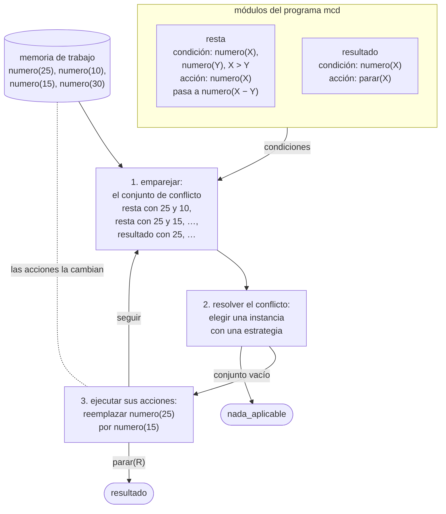
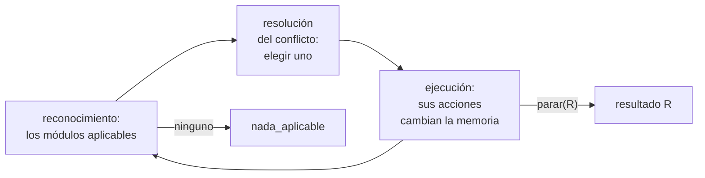

# Capítulo 60 — Proyecto: un intérprete dirigido por patrones

En un programa dirigido por patrones ningún módulo llama a otro. Cada módulo
tiene una **condición**, un patrón que describe una situación, y una
**acción**, que cambia esa situación. Los módulos comparten una colección de
hechos, la **memoria de trabajo**; un intérprete busca en cada ciclo un
módulo cuya condición se cumple en la memoria, ejecuta su acción y vuelve a
empezar. Lo que ocurre después depende de lo que la acción dejó en la
memoria, no de un orden de llamadas escrito de antemano. Agregar un módulo o
quitarlo no obliga a cambiar los demás: el programa sigue funcionando, quizá
por otro camino.



El ciclo de reconocimiento y acción, con los tres pasos con que lo describe
Bratko, sobre la memoria del máximo común divisor de la
[sección 60.2](#602-modulos-dirigidos-por-patrones): `resta` reemplaza el
mayor de dos números por su diferencia, y `resultado` devuelve un número.
Ninguno de los dos llama al otro: el intérprete compara sus condiciones con
la memoria que comparten. Varias instancias se pueden aplicar a la vez;
cuál se ejecuta lo decide la estrategia, y el ciclo termina cuando un módulo
ejecuta `parar` o cuando ninguno se puede aplicar.

Este capítulo construye ese intérprete en seis versiones. La primera guarda
la memoria en la base de datos dinámica; la segunda la pasa como argumento,
y con eso recupera el retroceso: puede enumerar todas las ejecuciones de un
programa. La tercera reúne el **conjunto de conflicto**, todas las maneras de
aplicar algún módulo, y elige una con una **estrategia**: el orden del
programa, el hecho más reciente o el módulo más específico. La cuarta es un
programa dirigido por patrones que demuestra fórmulas de la lógica
proposicional por resolución, la quinta vigila que la ejecución termine, y
la sexta indexa la memoria y parte el programa en fases.
Los ejemplos son el máximo común divisor de varios números, un ordenamiento
por intercambios y el demostrador.

El proyecto parte del capítulo «Pattern-directed Programming» de
*Prolog Programming for Artificial Intelligence* de Ivan Bratko. De él vienen
la arquitectura, el ciclo de tres pasos —encontrar los módulos aplicables,
resolver el conflicto, ejecutar—, la lectura de un programa de Prolog como un
sistema dirigido por patrones, el máximo común divisor de varios números
escrito con dos módulos, el demostrador por resolución que registra lo que ya
hizo para no repetirlo, y las observaciones finales: la resolución de
conflictos programable, la memoria como argumento, que Bratko propone como
proyecto y que aquí es la versión 2, y el índice de la memoria y las
metarreglas, que aquí son la versión 6. El ordenamiento por intercambios, el
conjunto de conflicto con estrategias, la vigilancia de la terminación y el
código son propios.

El capítulo reutiliza los operadores y las reglas como datos del
[capítulo 19](../capitulo-19-operadores-y-reglas-como-datos/index.md), la
base dinámica del [capítulo 20](../capitulo-20-base-de-datos-dinamica/index.md)
—cuyo encadenamiento hacia adelante solo agrega hechos; aquí también se
quitan y se reemplazan— y la idea de intérprete del
[capítulo 33](../capitulo-33-introspeccion-y-metainterpretes/index.md).
Cumple el anuncio del
[capítulo 55](../capitulo-55-proyecto-dialogos-plantillas/index.md#temas-que-se-retoman):
reglas de condición y acción sobre una base de datos. Cada versión carga la
anterior o el archivo de programas, y por eso los archivos del capítulo se
ejecutan en una instalación local, no en SWISH.

## Objetivos del capítulo

Al terminar el capítulo, el lector puede:

- escribir un programa como una lista de módulos de condición y acción, con
  operadores propios, y verificar que está bien formado;
- escribir el ciclo de reconocimiento y acción sobre una memoria de trabajo
  guardada en la base dinámica o pasada como argumento, y comparar las dos;
- enumerar con el retroceso todas las ejecuciones de un programa, y mostrar
  por qué hace falta resolver los conflictos;
- reunir el conjunto de conflicto y elegir una instancia con una estrategia
  expresada como clave de orden;
- escribir un demostrador pequeño por resolución como un programa dirigido
  por patrones;
- justificar que un programa termina con una medida que decrece, y detectar
  con un límite o con las memorias ya vistas los que no terminan;
- indexar la memoria por el nombre y la aridad de los hechos, y partir un
  programa en fases con una metarregla de transición.

!!! info "Tiempo estimado"
    Leer el capítulo, ejecutar sus ejemplos y hacer las actividades: **1:45 h**.
    Resolver los 5 ejercicios marcados con ★: **1:35 h**.
    Resolver los 13 ejercicios del final: **3:35 h**.

## 60.1 El programa terminado

El programa terminado se carga con `swipl ejemplos/capitulo-60/resolucion.pl`.
`trazar_demostracion/3` recibe una fórmula y una estrategia, pasa la negación
de la fórmula a cláusulas, las pone en la memoria y ejecuta el programa de
resolución escribiendo una línea por ciclo. La fórmula es la de Bratko: si
`b` se sigue de `a` y `c` de `b`, entonces `c` se sigue de `a`:

<!-- ejemplo: capitulo-60/resolucion.pl predicado: trazar_demostracion/3 -->
```prolog
%!  trazar_demostracion(+Formula, +Estrategia, -Veredicto) is det.
%
%   Como demostrar/3, y escribe la traza de los ciclos.
trazar_demostracion(Formula, Estrategia, Veredicto) :-
    memoria_inicial(Formula, Memoria),
    trazar(resolucion, Estrategia, Memoria, _, Resultado),
    veredicto(Resultado, Veredicto).
```

```prolog
?- trazar_demostracion((a ==> b) & (b ==> c) ==> (a ==> c), primera, V).
1: resolver de 7, con [clausula([a]),clausula([b,-a])]
2: resolver de 7, con [clausula([b]),clausula([c,-b])]
3: resolver de 7, con [clausula([c]),clausula([-c])]
4: contradiccion de 6, con [clausula([])]
V = teorema.
```

Cada línea dice qué módulo se aplicó, entre cuántas maneras posibles de
aplicar alguno, y con qué hechos de la memoria. Los tres primeros ciclos
agregan los resolventes `[b]`, `[c]` y la cláusula vacía `[]`; el cuarto
encuentra la cláusula vacía y termina: la negación es contradictoria, y la
fórmula, un teorema. Nada en el programa dice en qué orden se aplican los
módulos: lo decide en cada ciclo el contenido de la memoria.

| Versión | Archivo | Agrega | Lo que no puede hacer todavía |
|---|---|---|---|
| — | `programas.pl` | el lenguaje de los módulos y los programas de ejemplo | — |
| 1 | `dinamico.pl` | el ciclo con la memoria en la base dinámica | retroceder, o elegir entre módulos por otra cosa que su orden |
| 2 | `ciclo.pl` | la memoria como argumento; todas las ejecuciones | elegir con un criterio que no sea el orden |
| 3 | `conflictos.pl` | el conjunto de conflicto, tres estrategias y la traza | detectar un programa que no termina |
| 4 | `resolucion.pl` | el demostrador por resolución, un programa para la versión 3 | demostrar fórmulas con variables ([capítulo 62](../capitulo-62-proyecto-demostrador-teoremas/index.md)) |
| 5 | `terminacion.pl` | un límite de ciclos y la detección de memorias repetidas | — |

## 60.2 Módulos dirigidos por patrones

Un módulo se escribe `Nombre :: Condiciones ---> Acciones`, con dos
operadores propios, como los del
[capítulo 19](../capitulo-19-operadores-y-reglas-como-datos/index.md):

```prolog
:- op(850, xfx, ::).
:- op(800, xfx, --->).
```

`::` tiene más precedencia que `--->`, de modo que `n :: C ---> A` es
`::(n, --->(C, A))`, y las dos son menores que 999, de modo que un módulo
se puede escribir como elemento de una lista sin paréntesis. Un **programa**
es una lista de módulos, guardada con un nombre en `programa/2`. El máximo
común divisor de Bratko tiene dos: si hay dos números distintos, el mayor se
reemplaza por la diferencia; si hay un número, es el resultado:

<!-- ejemplo: capitulo-60/programas.pl fragmento: %!  programa(?Nombre .. ]). -->
```prolog
%!  programa(?Nombre, ?Modulos:list) is nondet.
%
%   Modulos es la lista de módulos del programa Nombre, en el orden en que
%   se escribieron.
programa(mcd,
    [ resta :: [numero(X), numero(Y), {X > Y}]
           ---> [{Z is X - Y}, reemplazar(numero(X), numero(Z))],
      resultado :: [numero(X)]
           ---> [parar(X)]
    ]).
```

{ style="background-color: white" }

El algoritmo de Euclides en su forma original, la de los *Elementos*
(libro VII, proposición 2): CD se resta de AB mientras cabe, y lo que sobra,
EF, se resta de CD; EF cabe exactamente en CD, y es la mayor medida común
de los dos segmentos. El módulo `resta` hace lo mismo con números: reemplaza
el mayor por la diferencia. Imagen: Drini,
[CC BY-SA 4.0](https://creativecommons.org/licenses/by-sa/4.0/deed.es), vía
[Wikimedia Commons](https://commons.wikimedia.org/wiki/File:Algoritmo_de_Euclides_geom%C3%A9trico.svg).

Las condiciones se comparan con la memoria de trabajo, una lista de hechos
sin variables, y las acciones la cambian:

| Condición | Se cumple si | | Acción | Efecto |
|---|---|---|---|---|
| `F` | algún hecho unifica con `F` | | `agregar(F)` | agrega el hecho `F` |
| `no(F)` | ningún hecho unifica con `F` | | `quitar(F)` | quita un hecho que unifica con `F` |
| `{Meta}` | `Meta` se prueba con Prolog | | `reemplazar(F, G)` | quita `F` y agrega `G` |
| | | | `{Meta}` | ejecuta `Meta`, para un cálculo |
| | | | `parar(R)` | termina el ciclo con el resultado `R` |

Las llaves separan lo que se prueba contra la memoria de lo que se prueba
con Prolog, como en las gramáticas del
[capítulo 21](../capitulo-21-gramaticas-dcg/index.md). Las condiciones se
prueban de izquierda a derecha, y las variables que liga una quedan ligadas
para las siguientes y para las acciones: en `resta`, `{X > Y}` compara los
números de los dos hechos, y `Z is X - Y` calcula el reemplazo.

Un programa es un término, y se puede examinar antes de ejecutarlo.
`bien_formado/1` verifica la forma de un módulo, con una condición o una
acción reconocida en cada elemento de sus listas; `patron/1` excluye de los
hechos las variables y los términos `{_}` y `no(_)`, que tienen otro
significado:

<!-- ejemplo: capitulo-60/programas.pl predicado: bien_formado/1 condicion_valida/1 -->
```prolog
%!  bien_formado(+Modulo) is semidet.
%
%   Modulo tiene la forma Nombre :: Condiciones ---> Acciones, con un átomo
%   por nombre y listas de condiciones y de acciones reconocidas.
bien_formado(Nombre :: Condiciones ---> Acciones) :-
    atom(Nombre),
    is_list(Condiciones),
    maplist(condicion_valida, Condiciones),
    is_list(Acciones),
    maplist(accion_valida, Acciones).

%!  condicion_valida(+Condicion) is semidet.
%
%   Condicion es una prueba {Meta}, una negación no(F) o un patrón de hecho.
condicion_valida({Meta}) :-
    callable(Meta).
condicion_valida(no(F)) :-
    patron(F).
condicion_valida(F) :-
    patron(F).
```

```prolog
?- bien_formado(m :: [a] ---> [borrar(a)]).
false.
```

La memoria del ordenamiento tiene un hecho `pos(I, X)` por elemento, con su
posición; `posiciones/2` la construye desde una lista, y `valores/2` hace el
camino inverso:

```prolog
?- posiciones([c, a, b], Hechos).
Hechos = [pos(1, c), pos(2, a), pos(3, b)].
```

El programa `ordenar` tiene un solo módulo: si un elemento está antes que
otro menor, se intercambian. Cuando ningún par está invertido, ningún módulo
se aplica y el ciclo termina:

<!-- ejemplo: capitulo-60/programas.pl fragmento: programa(ordenar, .. ]). -->
```prolog
programa(ordenar,
    [ intercambio :: [pos(I, X), pos(J, Y), {I < J, X > Y}]
           ---> [reemplazar(pos(I, X), pos(I, Y)),
                 reemplazar(pos(J, Y), pos(J, X))]
    ]).
```

**El ciclo.** Bratko describe la ejecución en tres pasos que se repiten:



**Prolog como sistema dirigido por patrones.** La misma arquitectura
describe a Prolog: cada cláusula es un módulo cuya condición es la cabeza, la
memoria es la lista de metas pendientes, un módulo se aplica si su cabeza
unifica con la primera meta, y su acción reemplaza esa meta por el cuerpo. El
conflicto entre varias cláusulas aplicables se resuelve por el orden del
programa, y el retroceso prueba las demás, como lo muestran el intérprete
vainilla de la
[sección 33.2](../capitulo-33-introspeccion-y-metainterpretes/index.md#332-el-interprete-vainilla)
y la resolución SLD del
[capítulo 38](../capitulo-38-semantica-de-los-programas-logicos/resolucion.md#resolucion-sld).

!!! question "Actividad"
    Predecir qué módulos del programa `mcd` se pueden aplicar a la memoria
    `[numero(12), numero(8)]`, y de cuántas maneras cada uno. Predecir
    después la memoria después de cada ciclo hasta que el programa para, y
    el resultado. Comprobarlo en la
    [sección 60.5](#605-version-3-el-conjunto-de-conflicto) con `trazar/5`.

## 60.3 Versión 1: la memoria en la base dinámica

La primera versión sigue a Bratko: la memoria es el predicado dinámico
`hecho/1`, y las acciones son `assertz/1` y `retract/1`. `ejecutar/4` carga
la memoria inicial, ejecuta el ciclo y devuelve la memoria final:

<!-- ejemplo: capitulo-60/dinamico.pl predicado: ejecutar/4 ciclo/2 -->
```prolog
%!  ejecutar(+Programa, +Hechos0:list, -Hechos:list, -Resultado) is semidet.
%
%   Ejecuta el Programa con la memoria inicial Hechos0. Hechos es la
%   memoria al terminar, y Resultado el término de parar/1, o
%   nada_aplicable si el ciclo terminó porque ningún módulo se aplicaba.
%   Falla si falla una acción del módulo elegido.
ejecutar(Programa, Hechos0, Hechos, Resultado) :-
    programa(Programa, Modulos),
    retractall(hecho(_)),
    forall(member(F, Hechos0), assertz(hecho(F))),
    ciclo(Modulos, Resultado),
    findall(F, hecho(F), Hechos).

%!  ciclo(+Modulos:list, -Resultado) is semidet.
%
%   Aplica el primer módulo de Modulos cuyas condiciones se cumplen, y
%   repite hasta que un módulo para o ninguno se puede aplicar. Falla si
%   falla una acción del módulo elegido.
ciclo(Modulos, Resultado) :-
    (   member(Modulo, Modulos),
        copy_term(Modulo, _ :: Condiciones ---> Acciones),
        satisface(Condiciones)
    ->  acciones(Acciones, Fin),
        (   Fin = parar(R)
        ->  Resultado = R
        ;   ciclo(Modulos, Resultado)
        )
    ;   Resultado = nada_aplicable
    ).
```

`ciclo/2` recorre los módulos en orden con `member/2`, renombra las
variables de cada uno con `copy_term/2` —el mismo módulo se aplica muchas
veces, con hechos distintos— y se queda con el primero cuyas condiciones se
cumplen: el si-entonces descarta los demás. Cada condición es una consulta
a `hecho/1`:

<!-- ejemplo: capitulo-60/dinamico.pl predicado: condicion/1 accion/1 -->
```prolog
%!  condicion(+Condicion) is nondet.
%
%   La memoria cumple Condicion: {Meta} se prueba con Prolog, no(F) pide
%   que ningún hecho unifique con F, y un patrón F, un hecho que unifique.
condicion({Meta}) :-
    call(Meta).
condicion(no(F)) :-
    \+ hecho(F).
condicion(F) :-
    patron(F),
    hecho(F).

%!  accion(+Accion) is semidet.
%
%   Ejecuta una acción que no es parar/1 sobre la memoria. Falla si
%   quitar/1 o reemplazar/2 no encuentran el hecho, o si la prueba de
%   {Meta} falla.
accion({Meta}) :-
    once(Meta).
accion(agregar(F)) :-
    assertz(hecho(F)).
accion(quitar(F)) :-
    once(retract(hecho(F))).
accion(reemplazar(F, G)) :-
    once(retract(hecho(F))),
    assertz(hecho(G)).
```

Por eso `ciclo/2` y `ejecutar/4` son `semidet` y no `det`: fallan cuando
falla una acción del módulo elegido, porque `quitar/1` o `reemplazar/2` no
encuentran el hecho o porque una prueba `{Meta}` no se cumple.

Con los números de la figura de Bratko, 25, 10, 15 y 30, la memoria termina
con cuatro cincos, y el resultado es 5:

```prolog
?- ejecutar(mcd, [numero(25), numero(10), numero(15), numero(30)], M, R).
M = [numero(5), numero(5), numero(5), numero(5)],
R = 5.
```

El programa calcula el máximo común divisor de cualquier cantidad de
números, aunque se escribió pensando en dos: cada resta conserva el máximo
común divisor del conjunto, y la memoria deja de cambiar cuando todos los
números son iguales.

**Lo que falta.** La memoria es global. Lo que una ejecución agrega no se
deshace al retroceder, y queda en la base después de terminar, como advierte
la [sección 20.8](../capitulo-20-base-de-datos-dinamica/index.md#208-cuando-no-usarla):

```prolog
?- ejecutar(mcd, [numero(4), numero(6)], _, R), hecho(F).
R = 2,
F = numero(2) ;
R = 2,
F = numero(2).
```

Tampoco se pueden explorar otras ejecuciones: el si-entonces de `ciclo/2`
elige un módulo y no hay vuelta atrás. Bratko lo señala al final de su
capítulo y propone como proyecto pasar la memoria como argumento.

## 60.4 Versión 2: la memoria como argumento

En la versión 2 la memoria es una lista que el ciclo recibe y devuelve, del
hecho más reciente al más antiguo. `ejecutar/4` tiene los mismos argumentos
que en la versión 1, y es ahora una relación entre la memoria inicial, la
final y el resultado:

<!-- ejemplo: capitulo-60/ciclo.pl predicado: ciclo/4 seguir/5 -->
```prolog
%!  ciclo(+Modulos:list, +Memoria0:list, -Memoria:list, -Resultado) is semidet.
%
%   Aplica el primer módulo de Modulos que se puede aplicar a Memoria0, y
%   repite con la memoria que resulta. Falla si falla una acción del
%   módulo elegido.
ciclo(Modulos, Memoria0, Memoria, Resultado) :-
    (   member(Modulo, Modulos),
        copy_term(Modulo, _ :: Condiciones ---> Acciones),
        satisface(Condiciones, Memoria0, _)
    ->  acciones(Acciones, Memoria0, Memoria1, Fin),
        seguir(Fin, Modulos, Memoria1, Memoria, Resultado)
    ;   Memoria = Memoria0,
        Resultado = nada_aplicable
    ).

%!  seguir(+Fin, +Modulos:list, +Memoria0:list, -Memoria:list, -Resultado)
%!      is semidet.
%
%   Termina con el resultado R si Fin es parar(R), o sigue el ciclo si Fin
%   es seguir. Falla si falla el ciclo que sigue.
seguir(parar(R), _, Memoria, Memoria, R).
seguir(seguir, Modulos, Memoria0, Memoria, Resultado) :-
    ciclo(Modulos, Memoria0, Memoria, Resultado).
```

Como en la versión 1, `ciclo/4` y `ejecutar/4` son `semidet`: fallan si
falla una acción del módulo elegido.

`satisface/3` prueba las condiciones sobre la lista, y devuelve además las
posiciones de los hechos que usó, que la versión 3 necesita. Un patrón se
busca con `nth0/3`, que da la posición de cada hecho que unifica:

<!-- ejemplo: capitulo-60/ciclo.pl predicado: satisface/3 condicion/4 -->
```prolog
%!  satisface(+Condiciones:list, +Memoria:list, -Posiciones:list(integer))
%!      is nondet.
%
%   Memoria cumple todas las Condiciones. Posiciones son las posiciones en
%   Memoria, contadas desde 0, de los hechos que cumplen los patrones, en el
%   orden de las condiciones.
satisface([], _, []).
satisface([C|Cs], Memoria, Posiciones) :-
    condicion(C, Memoria, Posiciones, Resto),
    satisface(Cs, Memoria, Resto).

%!  condicion(+Condicion, +Memoria:list, -Posiciones:list, ?Resto:list)
%!      is nondet.
%
%   Memoria cumple Condicion. Posiciones es Resto precedida por la posición
%   del hecho que cumple un patrón; una prueba y una negación no agregan
%   ninguna.
condicion({Meta}, _, Resto, Resto) :-
    call(Meta).
condicion(no(F), Memoria, Resto, Resto) :-
    \+ memberchk(F, Memoria).
condicion(F, Memoria, [I|Resto], Resto) :-
    patron(F),
    nth0(I, Memoria, F).
```

```prolog
?- satisface([numero(X), numero(Y), {X > Y}], [numero(3), numero(5), numero(4)], P).
X = 5,
Y = 3,
P = [1, 0] ;
X = 5,
Y = 4,
P = [1, 2] ;
X = 4,
Y = 3,
P = [2, 0] ;
false.
```

Las acciones construyen la memoria nueva. Un hecho agregado va al principio,
como el más reciente, y `quitar/1` quita la primera aparición:

<!-- ejemplo: capitulo-60/ciclo.pl predicado: accion/3 -->
```prolog
%!  accion(+Accion, +Memoria0:list, -Memoria:list) is semidet.
%
%   Memoria es Memoria0 después de una acción que no es parar/1. Un hecho
%   agregado va al principio, como el más reciente; quitar un hecho quita
%   la primera aparición que unifica con él. Falla si quitar/1 o
%   reemplazar/2 no encuentran el hecho, o si la prueba de {Meta} falla.
accion({Meta}, Memoria, Memoria) :-
    once(Meta).
accion(agregar(F), Memoria, [F|Memoria]).
accion(quitar(F), Memoria0, Memoria) :-
    selectchk(F, Memoria0, Memoria).
accion(reemplazar(F, G), Memoria0, [G|Memoria]) :-
    selectchk(F, Memoria0, Memoria).
```

```prolog
?- ejecutar(mcd, [numero(25), numero(10), numero(15), numero(30)], M, R).
M = [numero(5), numero(5), numero(5), numero(5)],
R = 5.
```

**Todas las ejecuciones.** Con la memoria en un argumento, el retroceso
vuelve a funcionar. `ejecucion/4` es `ejecutar/4` sin el si-entonces: en cada
ciclo aplica cualquier módulo aplicable, con cualquiera de los hechos que
cumplen sus condiciones, y el retroceso recorre todas las elecciones:

<!-- ejemplo: capitulo-60/ciclo.pl predicado: ciclo_libre/4 -->
```prolog
%!  ciclo_libre(+Modulos:list, +Memoria0:list, -Memoria:list, -Resultado)
%!      is nondet.
%
%   Aplica a Memoria0 uno cualquiera de los módulos aplicables, y repite.
ciclo_libre(Modulos, Memoria0, Memoria, Resultado) :-
    (   aplicable(Modulos, Memoria0)
    ->  member(Modulo, Modulos),
        copy_term(Modulo, _ :: Condiciones ---> Acciones),
        satisface(Condiciones, Memoria0, _),
        acciones(Acciones, Memoria0, Memoria1, Fin),
        (   Fin = parar(R)
        ->  Memoria = Memoria1,
            Resultado = R
        ;   ciclo_libre(Modulos, Memoria1, Memoria, Resultado)
        )
    ;   Memoria = Memoria0,
        Resultado = nada_aplicable
    ).
```

Ordenar `[3, 2, 1]` se puede hacer de cinco maneras, según el par que se
intercambia primero, y todas terminan en la misma lista ordenada; el
ordenamiento no necesita que se resuelva ningún conflicto:

```prolog
?- posiciones([3, 2, 1], H), aggregate_all(count, ejecucion(ordenar, H, _, _), N).
H = [pos(1, 3), pos(2, 2), pos(3, 1)],
N = 5.
```

El máximo común divisor, en cambio, sí lo necesita. Si `resultado` se puede
aplicar en cualquier ciclo, cualquier número que pase por la memoria puede
ser la respuesta:

```prolog
?- setof(R, M^ejecucion(mcd, [numero(25), numero(10)], M, R), Rs).
Rs = [5, 10, 15, 25].
```

De las ocho ejecuciones, solo las que aplican `resultado` cuando `resta` ya
no se puede aplicar dan 5. El programa es correcto solo con una regla de
elección: la versión 1 la tenía escondida en el orden de la lista de
módulos.

**Base dinámica o argumento.** Las dos versiones se midieron con `time/1`
sobre dos entradas: ordenar la lista de 30 elementos en orden inverso y el
máximo común divisor de 60, 120, …, 720.

| Entrada | Versión | Ciclos | Inferencias |
|---|---|---|---|
| ordenar 30 | 1, base dinámica | 133 | 168 015 |
| ordenar 30 | 2, argumento | 435 | 530 124 |
| máximo común divisor | 1, base dinámica | 67 | 21 847 |
| máximo común divisor | 2, argumento | 67 | 8 889 |

Por ciclo, el ordenamiento cuesta lo mismo en las dos: unas 1 250
inferencias. La diferencia está en la cantidad de ciclos, y la causa es el
orden de la memoria: `assertz/1` agrega al final y la lista agrega al
principio, de modo que las dos versiones examinan los hechos en otro orden
y eligen otros pares. La lista invertida tiene 435 inversiones; la versión 2
las quita de a una, en 435 intercambios, y la versión 1 las quita en 133,
porque sus intercambios, entre elementos más separados, corrigen varias de
una vez. El orden en que el intérprete examina la memoria es, sin que el
programa lo diga, parte de la estrategia. En el máximo común divisor los
ciclos son los mismos, y la lista cuesta menos de la mitad de las
inferencias que la base.

!!! question "Actividad"
    Predecir cuántas ejecuciones tiene `ejecucion(ordenar, H, M, R)` para la
    lista `[2, 1, 3]` y para `[1, 2, 3]`, y si alguna termina con `parar/1`.
    Comprobarlo con `aggregate_all/3`, y explicar por qué el resultado de
    todas es `nada_aplicable`.

**Lo que falta.** La elección sigue siendo el orden: el primer módulo, y
dentro de él, los primeros hechos. Si el orden de los módulos cambia, el
resultado cambia.

## 60.5 Versión 3: el conjunto de conflicto

La versión 3 separa los tres pasos del ciclo. El reconocimiento reúne el
**conjunto de conflicto**: una instancia por cada módulo y cada manera de
cumplir sus condiciones. Cada instancia guarda el nombre del módulo, su
cantidad de condiciones, las posiciones de los hechos que usa y sus acciones
ya instanciadas:

<!-- ejemplo: capitulo-60/conflictos.pl predicado: conflicto/3 -->
```prolog
%!  conflicto(+Modulos:list, +Memoria:list, -Instancias:list) is det.
%
%   Instancias es el conjunto de conflicto: un término
%   instancia(Nombre, Condiciones, Posiciones, Acciones) por cada módulo y
%   cada manera de cumplir sus condiciones en Memoria, en el orden del
%   programa y, dentro de un módulo, en el orden de la memoria.
conflicto(Modulos, Memoria, Instancias) :-
    findall(instancia(Nombre, N, Posiciones, Acciones),
            ( member(Modulo, Modulos),
              copy_term(Modulo, Nombre :: Condiciones ---> Acciones),
              length(Condiciones, N),
              satisface(Condiciones, Memoria, Posiciones)
            ),
            Instancias).
```

Una **estrategia** elige una instancia. Cada estrategia se escribe como una
clave de orden, y `elegir/4` ordena el conjunto por la clave con
`keysort/2`, que conserva el orden original entre las instancias de igual
clave. `primera` da a todas la misma clave, y elige por el orden del
programa; `reciente` prefiere la instancia que usa el hecho más reciente, el
de menor posición; `especifica` prefiere el módulo con más condiciones, el
que describe una situación más particular. La recencia y la especificidad
son los criterios que McDermott y Forgy describen para los sistemas de
producción OPS, en el libro de Waterman y Hayes-Roth que Bratko recomienda:

<!-- ejemplo: capitulo-60/conflictos.pl predicado: elegir/4 clave/4 -->
```prolog
%!  elegir(+Estrategia, +Memoria:list, +Instancias:list, -Elegida) is det.
%
%   Elegida es la instancia de Instancias, que no es vacía, con la menor
%   clave según la Estrategia; entre dos de igual clave, la que aparece
%   antes en Instancias, porque keysort/2 conserva el orden de los empates.
elegir(Estrategia, Memoria, Instancias, Elegida) :-
    length(Memoria, Largo),
    map_list_to_pairs(clave(Estrategia, Largo), Instancias, Pares),
    keysort(Pares, [_-Elegida|_]).

%!  clave(+Estrategia, +Largo:integer, +Instancia, -Clave) is det.
%
%   Clave ordena la Instancia según la Estrategia, en una memoria de Largo
%   hechos: una clave menor se prefiere. Con primera todas empatan; con
%   reciente, la clave es la posición del hecho más reciente que usa la
%   instancia, o Largo si no usa ninguno; con especifica, la cantidad de
%   condiciones del módulo, con el signo cambiado.
clave(primera, _, _, 0).
clave(reciente, Largo, instancia(_, _, Posiciones, _), Clave) :-
    min_list([Largo|Posiciones], Clave).
clave(especifica, _, instancia(_, N, _, _), Clave) :-
    Clave is -N.
```

El ciclo cuenta los ciclos y, si se le pide, los escribe; como en las
versiones anteriores, `ejecutar/5` y `trazar/5` fallan si falla una acción
de la instancia elegida. `trazar/5` muestra
la ejecución del máximo común divisor de la versión 1:

```prolog
?- trazar(mcd, primera, [numero(25), numero(10), numero(15), numero(30)], M, R).
1: resta de 10, con [numero(25),numero(10)]
2: resta de 9, con [numero(15),numero(10)]
3: resta de 10, con [numero(10),numero(5)]
4: resta de 9, con [numero(15),numero(5)]
5: resta de 9, con [numero(10),numero(5)]
6: resta de 7, con [numero(30),numero(5)]
7: resta de 7, con [numero(25),numero(5)]
8: resta de 7, con [numero(20),numero(5)]
9: resta de 7, con [numero(15),numero(5)]
10: resta de 7, con [numero(10),numero(5)]
11: resultado de 4, con [numero(5)]
M = [numero(5), numero(5), numero(5), numero(5)],
R = 5.
```

En el primer ciclo hay diez instancias: seis de `resta`, una por par de
números distintos, y cuatro de `resultado`, una por número. `primera` elige
siempre `resta` mientras quede alguna, porque `resta` está escrito antes.

**El orden de los módulos.** `mcd_invertido` es el mismo programa con los
módulos en el otro orden. Con `primera`, `resultado` gana en el primer ciclo
y la respuesta es el primer número; con `especifica`, gana `resta`, que
tiene tres condiciones contra una, y la respuesta vuelve a ser la correcta
sin importar el orden:

```prolog
?- ejecutar(mcd_invertido, primera, [numero(25), numero(10)], _, R).
R = 25.

?- ejecutar(mcd_invertido, especifica, [numero(25), numero(10)], _, R).
R = 5.
```

La especificidad es el criterio de las excepciones: un módulo que describe
un caso particular, con más condiciones, se aplica antes que el caso
general, dondequiera que esté escrito.

**Otra estrategia, otra ejecución.** En el ordenamiento, cada instancia es
un par invertido, y el tamaño del conjunto de conflicto es la cantidad de
inversiones de la lista:

```prolog
?- posiciones([4, 3, 2, 1], H), trazar(ordenar, primera, H, M, R).
1: intercambio de 6, con [pos(1,4),pos(2,3)]
2: intercambio de 5, con [pos(2,4),pos(3,2)]
3: intercambio de 4, con [pos(3,4),pos(4,1)]
4: intercambio de 3, con [pos(2,2),pos(3,1)]
5: intercambio de 2, con [pos(1,3),pos(3,2)]
6: intercambio de 1, con [pos(1,2),pos(2,1)]
H = [pos(1, 4), pos(2, 3), pos(3, 2), pos(4, 1)],
M = [pos(2, 2), pos(1, 1), pos(3, 3), pos(4, 4)],
R = nada_aplicable.
```

Cada intercambio quita al menos una inversión, y un intercambio entre
elementos lejanos puede quitar varias. La cantidad de ciclos depende de la
estrategia:

```prolog
?- posiciones([4, 5, 1, 3, 2], H), ciclos(ordenar, primera, H, P), ciclos(ordenar, reciente, H, R).
H = [pos(1, 4), pos(2, 5), pos(3, 1), pos(4, 3), pos(5, 2)],
P = 7,
R = 5.
```

La lista tiene siete inversiones: `primera` quita una por ciclo, y
`reciente`, que vuelve sobre los elementos que acaba de mover, termina en
cinco. Con la permutación de 20 elementos de las pruebas de
`conflictos.plt`, `primera` hace 58 ciclos y `reciente`, 42.

**El costo.** Reunir el conjunto entero en cada ciclo cuesta: ordenar la
lista invertida de 30 elementos lleva 2 849 968 inferencias, contra 530 124
de la versión 2, que se detiene en la primera instancia; el máximo común
divisor de 60, …, 720 lleva 73 859, contra 8 889. Cada ciclo vuelve a
comparar todos los patrones con toda la memoria, aunque el ciclo anterior
cambió uno o dos hechos. El
[capítulo 64](../capitulo-64-proyecto-algoritmo-rete/index.md) conserva
entre ciclos lo que ya se comparó.

!!! question "Actividad"
    Predecir el conjunto de conflicto del programa `mcd` para la memoria
    `[numero(9), numero(6), numero(3)]`: cuántas instancias hay y de qué
    módulos. Predecir cuál elige cada estrategia en el primer ciclo, y
    comprobarlo con `conflicto/3` y `elegir/4`.

## 60.6 Versión 4: un demostrador por resolución

Una fórmula es un **teorema** si es verdadera cualquiera que sea el valor de
sus átomos. El método de resolución lo prueba por el absurdo: pasa la
negación de la fórmula a **cláusulas** —disyunciones de átomos y de átomos
negados— y combina dos cláusulas con literales opuestos, `P` y `-P`, en un
**resolvente** que reúne los demás literales, hasta obtener la cláusula
vacía, que ninguna asignación satisface. `resolucion.pl` lo escribe como un
programa de cuatro módulos sobre hechos `clausula(C)`, con cada cláusula
como una lista ordenada de literales:

<!-- ejemplo: capitulo-60/resolucion.pl fragmento: programa(resolucion, .. ]). -->
```prolog
programa(resolucion,
    [ contradiccion :: [clausula([])]
           ---> [parar(contradiccion)],
      tautologia :: [clausula(C), {tautologica(C)}]
           ---> [quitar(clausula(C))],
      resolver :: [clausula(C1), clausula(C2),
                   {resolvente(C1, C2, R), \+ tautologica(R)},
                   no(clausula(R))]
           ---> [agregar(clausula(R))],
      agotado :: []
           ---> [parar(sin_contradiccion)]
    ]).
```

`contradiccion` termina al aparecer la cláusula vacía, `tautologia` quita
las cláusulas que tienen un literal y su opuesto, y `resolver` agrega un
resolvente que todavía no está en la memoria; esa condición,
`no(clausula(R))`, cumple el papel del registro de Bratko de los pares ya
resueltos. `agotado`, sin condiciones, va al final:

```prolog
?- demostrar((p ==> q) ==> (q ==> p), primera, V).
V = no_teorema.
```

La página [Un demostrador por resolución](resolucion.md#un-demostrador-por-resolucion)
desarrolla la versión: la forma clausal, el paso de resolución, el efecto
de la estrategia sobre la cantidad de ciclos y los límites de un demostrador
tan pequeño, que el
[capítulo 62](../capitulo-62-proyecto-demostrador-teoremas/index.md)
supera.

**Lo que falta.** Los tres programas de ejemplo terminan, pero nada en el
intérprete lo garantiza: un módulo mal escrito puede hacer que el ciclo no
termine nunca.

## 60.7 Versión 5: la terminación

Un programa dirigido por patrones termina si cada ciclo reduce una medida
que no puede decrecer para siempre, como pide el
[Patrón 56](../capitulo-43-proyecto-resolver-ecuaciones/index.md#433-version-2-reglas-de-reescritura-y-coleccion),
«Medida que decrece»: la suma de los números en el máximo común divisor, la
cantidad de inversiones en el ordenamiento. Cuando la medida no existe, la
memoria puede crecer sin fin o volver a un estado por el que ya pasó.
`vigilar/6` ejecuta el ciclo de la versión 3 con un límite de ciclos y un
registro de las memorias vistas, y detecta los dos casos. `mcd_mal`, el
máximo común divisor con `>=` en lugar de `>`, cae en el segundo: las dos
condiciones `numero(X)` y `numero(Y)` pueden usar el mismo hecho, la resta
de un número consigo mismo da 0, y desde ahí `0 - 0` deja la memoria igual:

<!-- ejemplo: capitulo-60/terminacion.pl predicado: vigilar/6 -->
```prolog
%!  vigilar(+Programa, +Estrategia, +Limite:integer, +Memoria0:list,
%!          -Memoria:list, -Resultado) is semidet.
%
%   Como ejecutar/5, con dos resultados más: limite(N) si el programa hizo
%   Limite ciclos sin terminar, y repetida(K, N) si la memoria después de
%   N ciclos es la misma, como colección de hechos, que después de K.
%   Falla si falla una acción de la instancia elegida.
vigilar(Programa, Estrategia, Limite, Memoria0, Memoria, Resultado) :-
    programa(Programa, Modulos),
    empty_assoc(Vistas),
    vigilado(Modulos, Estrategia, Limite, 0, Vistas, Memoria0, Memoria,
             Resultado).
```

```prolog
?- vigilar(mcd_mal, primera, 100, [numero(25), numero(10)], M, R).
M = [numero(0), numero(10)],
R = repetida(1, 2).
```

La página [La terminación](terminacion.md#la-terminacion) desarrolla la
versión: las medidas de los tres programas, el registro de memorias vistas,
los programas `luz` y `contador`, el análisis de `mcd_mal` y lo que la
vigilancia no puede detectar, con una actividad.

**Lo que falta.** En cada ciclo, cada patrón se compara con toda la lista de
hechos, aunque solo pueda unificar con los de un nombre y una aridad; y en
el máximo común divisor el programa depende de que la estrategia prefiera
`resta` a `resultado`, que se puede aplicar siempre.

## 60.8 Versión 6: índices y metarreglas

Bratko cierra su capítulo con dos maneras de que el emparejamiento no
recorra toda la memoria: indexar los hechos y partir los módulos en grupos
que se activan y desactivan con «una especie de metarreglas». La versión 6,
`indices.pl`, escribe las dos. La **memoria indexada** guarda los hechos en
un `library(assoc)` por su nombre y su aridad, cada uno con una **marca de
tiempo** que reemplaza a la posición en la lista para la estrategia
`reciente`; `ejecutar_indexado/5` da la misma memoria y el mismo resultado
que `ejecutar/5` con todos los programas y estrategias del capítulo. Un
**programa por fases** es una lista de pares `Fase-Modulos`; en cada ciclo
solo compiten los módulos de la fase activa, y una **metarregla**, una regla
sobre las reglas, pasa a la fase siguiente cuando ninguno se puede aplicar:

<!-- ejemplo: capitulo-60/indices.pl fragmento: programa_fases(mcd_fases, .. ]). -->
```prolog
programa_fases(mcd_fases,
    [ calcular - [ resta :: [numero(X), numero(Y), {X > Y}]
                        ---> [{Z is X - Y},
                              reemplazar(numero(X), numero(Z))] ],
      informar - [ resultado :: [numero(X)]
                        ---> [parar(X)] ]
    ]).
```

Con `mcd_invertido` y la estrategia `primera`, la versión 3 responde el
primer número; con las fases, `resultado` no se considera hasta que `resta`
deja de aplicarse, y el orden de los módulos y la estrategia dejan de
importar:

```prolog
?- ejecutar(mcd_invertido, primera, [numero(25), numero(10)], M, R).
M = [numero(25), numero(10)],
R = 25.

?- ejecutar_fases_de(mcd_fases, primera, [numero(25), numero(10)], M, R).
M = [numero(5), numero(5)],
R = 5.
```

La página [Índices y metarreglas](indices.md#indices-y-metarreglas)
desarrolla la versión: la memoria indexada y sus marcas, el conjunto de
conflicto sobre ella, las fases y lo que cuesta cada versión con 100 hechos
que ningún módulo usa, con una actividad.

!!! success "Criterios de calidad"
    | Criterio | En este capítulo |
    |---|---|
    | C1 | cada predicado declara modos y determinación; los ciclos son `semidet`, porque fallan si falla una acción, `satisface/3` y `ejecucion/4` son `nondet`, y `bien_formado/1` es `semidet` |
    | C2 | los programas son datos: `bien_formado/1` los examina antes de ejecutarlos, y los hechos de la memoria no pueden ser variables ni términos `{_}` o `no(_)`, que tienen otro significado |
    | C4 | los ciclos eligen con un si-entonces, `acciones/4` distingue `parar/1` con otro, y las cláusulas de `fnn/2` y `fnc/2` empiezan por el átomo para que la indexación no deje alternativas; las pruebas, que fallan si queda una alternativa pendiente, lo confirman |
    | C6 | desde la versión 2 la memoria viaja en argumentos; la versión 1 usa la base dinámica para mostrar lo que se pierde, y la traza es la única salida |
    | C7 | 103 pruebas en siete archivos: cada programa en cada versión, una acción que falla, las tres estrategias con sus empates, la cantidad de ejecuciones, la traza como texto, los teoremas y los no teoremas, y los tres modos de no terminar; la versión 6 se compara con la 3 en todos los programas y estrategias, y una prueba mide que el índice no paga los hechos que ningún módulo usa |

## Ejercicios

Las soluciones están en [la página de soluciones](soluciones.md). La dificultad
va de 1 (se resuelve consultando el capítulo) a 3 (requiere elaboración propia).
Los marcados con ★ son los que no conviene saltear: cubren lo que el capítulo
tiene de propio. Los ejercicios extienden los programas: cada solución es un
archivo que carga los del capítulo, sin modificarlos.

1. ★ **(1)** Predecir la traza de `trazar(mcd, primera, [numero(18),
   numero(12), numero(8)], M, R)`: cuántos ciclos hay, cuántas instancias
   tiene el conjunto de conflicto en cada uno y cuál es el resultado.
   Comprobarlo.
2. **(1)** Escribir el programa `maximo`, que quita de la memoria todo
   número menor que otro y para con el que queda. Ejecutarlo con la versión
   2 sobre 25, 10, 15 y 30.
3. ★ **(2)** Escribir el programa `criba`, que parte de los hechos
   `numero(2)`, …, `numero(N)` y quita todo número múltiplo de otro, de modo
   que la memoria termina con los primos. Dar una medida que decrece en cada
   ciclo y comprobar el resultado para N = 30.
4. **(2)** Escribir el programa `burbuja`, que solo intercambia elementos
   vecinos. Comparar con `ciclos/4` la cantidad de ciclos de `burbuja` y de
   `ordenar` para la lista invertida de 10 elementos y para `[4, 5, 1, 3, 2]`,
   con las estrategias `primera` y `reciente`, y explicar las diferencias.
5. ★ **(2)** Agregar a `clave/4`, desde otro archivo, la estrategia
   `lejana`, que al ordenar prefiere el intercambio entre las posiciones
   más separadas de la lista; la clave puede leerlas en las acciones ya
   instanciadas de la instancia. Contar los ciclos de `ordenar` con
   `lejana` para la lista invertida de 20 elementos, y explicar el
   resultado.
6. **(1)** Predecir cuántas ejecuciones tiene el programa `mcd` con
   `ejecucion/4` desde `[numero(12), numero(8)]`, y qué resultados dan.
   Comprobarlo con `aggregate_all/3` y `setof/3`.
7. **(2)** Escribir el programa `escrutinio`, que parte de hechos
   `voto(Candidato)` y termina con un hecho `total(Candidato, N)` por
   candidato, sin votos. Usar `no/1` para el primer voto de cada candidato.
8. ★ **(3)** Agregar al demostrador un módulo que quite una cláusula cuando
   otra, distinta, contiene solo literales suyos: `[a]` hace inútil a
   `[a, b]`. Escribirlo como un programa nuevo, `resolucion_subsuncion`,
   verificar con `vigilar/6` que termina —un resolvente quitado puede
   volver a agregarse— y comparar sus ciclos con los de `resolucion` en las
   fórmulas de las pruebas.
9. ★ **(2)** Predecir qué ocurre si se quita del módulo `resolver` la
   condición `no(clausula(R))`, con la fórmula `(p v q) ==> p`, que no es
   un teorema, y con la fórmula de Bratko. Escribir ese programa,
   `resolucion_sin_control`, y comprobar la predicción con `vigilar/6` y un
   límite de 50 ciclos. Explicar por qué la vigilancia no informa una
   memoria repetida.
10. **(2)** Escribir `historia(+Programa, +Estrategia, +Memoria0,
    -Historia, -Resultado)`, que devuelve la traza como una lista de
    términos `ciclo(N, Nombre, Cantidad, Hechos)`, uno por ciclo, en lugar
    de escribirla, y `escribir_historia/1`, que la escribe con el formato
    de `trazar/5`.
11. **(2)** Agregar a la memoria del máximo común divisor 100 hechos
    `ruido(I)` que ningún módulo usa, y medir con `time/1` cuántas
    inferencias cuesta con la versión 2 y con la versión 3. Explicar el
    aumento a partir de `condicion/4`.
12. **(2)** Escribir el programa `luz_limitada`, que cambia la luz como
    `luz` pero lleva la cuenta de los cambios en un hecho `cambios(N)` y
    para después de un número dado de cambios. Indicar la medida que
    decrece.
13. **(2)** La metarregla de `ejecutar_fases/5` trata las fases como
    etapas: una fase terminada no vuelve a activarse. Escribir
    `ejecutar_prioridades/5`, con la metarregla que en cada ciclo activa la
    primera fase que tiene algún módulo aplicable, y un programa por fases,
    `contador_fases`, en el que las dos metarreglas dejan memorias
    distintas. Comprobar que con `mcd_fases` dan el mismo resultado.

## Resumen

| | |
|---|---|
| **módulo dirigido por patrones** | `Nombre :: Condiciones ---> Acciones`; ningún módulo llama a otro, la memoria decide cuál se aplica |
| **memoria de trabajo** | la colección de hechos sin variables que las condiciones examinan y las acciones cambian |
| **condiciones** | un patrón (algún hecho unifica), `no(F)` (ninguno unifica) y `{Meta}` (una prueba de Prolog) |
| **acciones** | `agregar/1`, `quitar/1`, `reemplazar/2`, `{Meta}` y `parar/1` |
| **ciclo** | reconocimiento, resolución del conflicto y ejecución, hasta `parar/1` o hasta que ningún módulo se aplica; es `semidet`: falla si falla una acción |
| **conjunto de conflicto** | todas las instancias aplicables: cada módulo con cada manera de cumplir sus condiciones |
| **estrategia** | una clave de orden sobre el conjunto de conflicto: `primera`, `reciente`, `especifica` |
| **memoria como argumento** | recupera el retroceso: `ejecucion/4` enumera todas las ejecuciones |
| **resolución** | combinar dos cláusulas con literales opuestos; la cláusula vacía prueba que la negación es contradictoria |
| **terminación** | una medida que decrece en cada ciclo; el límite y las memorias repetidas detectan los programas que no terminan |
| **memoria indexada** | los hechos agrupados por nombre y aridad, con marcas de tiempo; cada patrón examina solo los de su clave |
| **metarregla** | una regla sobre las reglas: decide qué fase del programa está activa |
| `programas.pl` | el lenguaje de los módulos y los programas de ejemplo |
| `dinamico.pl`, `ciclo.pl` | el ciclo con la base dinámica y con la memoria como argumento |
| `conflictos.pl` | el conjunto de conflicto, las estrategias y la traza |
| `resolucion.pl`, `terminacion.pl` | el demostrador y la vigilancia de la terminación |
| `indices.pl` | la memoria indexada y los programas por fases |

## Temas que se retoman

| Tema | Se retoma en |
|---|---|
| La resolución general, con la lógica de predicados, la forma clausal completa y refutaciones que se verifican | [capítulo 62](../capitulo-62-proyecto-demostrador-teoremas/index.md) |
| Un sistema de producción sobre una memoria de trabajo: encadenamiento hacia adelante, resolución de conflictos por recencia y especificidad, marcos | [capítulo 63](../capitulo-63-proyecto-sistema-produccion/index.md) |
| La comparación incremental de los patrones con la memoria, sin repetirla en cada ciclo | [capítulo 64](../capitulo-64-proyecto-algoritmo-rete/index.md) |

## Referencias

- Ivan Bratko, *Prolog Programming for Artificial Intelligence*,
  Addison-Wesley, 1986 — capítulo «Pattern-directed Programming», con sus
  apartados «Pattern-directed architecture», «A simple interpreter for
  pattern-directed programs», «A simple theorem prover» y «Concluding
  remarks». No tiene una edición en línea de acceso libre. El capítulo toma
  de allí la arquitectura de módulos de condición y acción sobre una base de
  datos, el ciclo de tres pasos con el conjunto de conflicto, la lectura de
  Prolog como un sistema dirigido por patrones, el máximo común divisor de
  varios números con dos módulos, el demostrador proposicional por
  resolución con su registro de lo ya hecho, y las propuestas finales: una
  resolución de conflictos programable, la memoria como argumento, para
  recuperar el retroceso, y el índice de la base y los grupos de módulos
  activados por metarreglas, que son la versión 6. Las referencias del capítulo de Bratko son las
  dos que siguen, para los sistemas dirigidos por patrones, y el libro de
  Nilsson *Principles of Artificial Intelligence* (Tioga, 1980), para la
  demostración por resolución.
- D. A. Waterman y Frederick Hayes-Roth (eds.), *Pattern-Directed Inference
  Systems*, Academic Press, 1978, y en él John McDermott y Charles Forgy,
  «Production system conflict resolution strategies», págs. 177–199; una
  versión anterior es el informe técnico de Carnegie Mellon de 1976,
  DOI [10.21236/ADA037771](https://doi.org/10.21236/ADA037771). Bratko
  presenta el libro como la obra clásica sobre los sistemas dirigidos por
  patrones. El capítulo toma del artículo las estrategias `reciente` y
  `especifica` de la [sección 60.5](#605-version-3-el-conjunto-de-conflicto).
- John Alan Robinson, «A machine-oriented logic based on the resolution
  principle», *Journal of the ACM* 12(1), 1965, págs. 23–41.
  DOI [10.1145/321250.321253](https://doi.org/10.1145/321250.321253). Es el
  origen del principio de resolución que la versión 4 aplica a la lógica
  proposicional, en la [sección 60.6](#606-version-4-un-demostrador-por-resolucion).
- William F. Clocksin y Christopher S. Mellish, *Programming in Prolog*,
  Springer, 5.ª edición, 2003 — capítulo «The Relation of Prolog to Logic»
  y apéndice «Clausal Form Program Listings», que Bratko cita para el paso
  a forma clausal; `clausulas/2` hace la misma transformación, restringida
  a la lógica proposicional, con código propio.
- Drini, imagen «Algoritmo de Euclides geométrico.svg», Wikimedia Commons,
  CC BY-SA 4.0.

El código del capítulo es propio, escrito para el curso: el lenguaje de los
módulos, los intérpretes, las estrategias, el ordenamiento, la vigilancia de
la terminación, el demostrador, la memoria indexada y las fases son nuevos,
y del libro se toman las ideas y los ejemplos, no el código.
