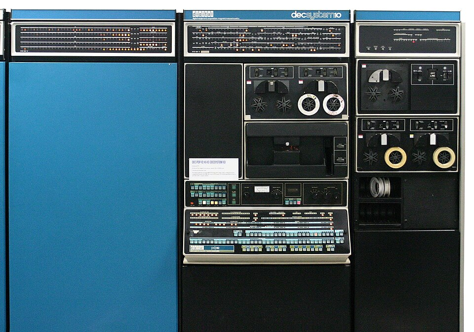
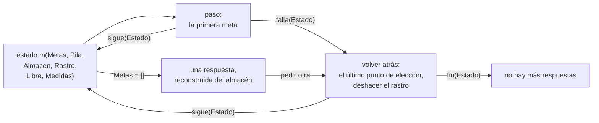

# Capítulo 61 — Proyecto: una máquina de Prolog

El intérprete vainilla de la [sección 33.2](../capitulo-33-introspeccion-y-metainterpretes/index.md#332-el-interprete-vainilla) prueba un programa en tres
cláusulas porque deja casi todo el trabajo a Prolog: la unificación, la
elección de la cláusula, la vuelta atrás y la memoria de lo que falta
probar. Es un [intérprete que absorbe](../patrones.md#45-interprete-que-absorbe). Este capítulo hace el camino
inverso y escribe una **máquina de Prolog**: un programa que ejecuta otro
programa Prolog con todo ese trabajo a la vista, como datos que se pueden
examinar y medir. La resolvente es una lista de metas; las alternativas, una
pila de **puntos de elección**; las variables del programa ejecutado,
celdas numeradas en un **almacén**; la unificación, un predicado escrito en
el capítulo; y la vuelta atrás, un **rastro** de las ligaduras que hay que
deshacer. Con esas piezas se agregan el corte y la indexación por el primer
argumento, y cada versión mide lo que cambia: pasos, cabezas intentadas,
largo de la resolvente, puntos de elección, entradas del rastro y celdas.



Una DECsystem-10 (PDP-10, unidad central KI10), de la década de 1970. En
una máquina de esta familia funcionó DEC-10 Prolog, el compilador con el que
David H. D. Warren mostró en 1977 que Prolog se puede ejecutar con
pilas, puntos de elección y un rastro, las mismas piezas que este capítulo
escribe en Prolog.
Imagen: Gah4, [CC BY-SA 4.0](https://creativecommons.org/licenses/by-sa/4.0/),
vía [Wikimedia Commons](https://commons.wikimedia.org/wiki/File:DEC_PDP-10_(from_ca._1970_named_decsystem-10)_mainframe_computer_system,_1970s_(edited,_white_background).jpg).

La máquina crece en siete versiones, una por sección. La primera hace de la
resolvente un dato y deja la elección de la cláusula a Prolog; la segunda
convierte la búsqueda en un ciclo sobre una pila de alternativas; la tercera
reemplaza las variables de Prolog por celdas y agrega los puntos de elección
y el rastro; la cuarta, el corte; la quinta, la indexación; la sexta
**compila** el programa a instrucciones, y la séptima agrega la negación y
el manejo de errores. Una segunda página,
[Los programas de otros capítulos](archivos.md), ejecuta en la máquina
archivos de otros capítulos, leídos con el lector del [capítulo 59](../capitulo-59-proyecto-analisis-programas/index.md). El capítulo usa la medición del [capítulo 16](../capitulo-16-rendimiento/index.md), los
árboles AVL de `library(assoc)` del [capítulo 22](../capitulo-22-estructuras-de-datos-de-la-biblioteca/index.md) para el almacén, la inspección de
términos del [capítulo 32](../capitulo-32-inspeccion-de-terminos/index.md) y un diccionario incompleto del [capítulo 34](../capitulo-34-estructuras-incompletas-y-listas-diferencia/index.md). Cumple
los anuncios de los capítulos [45](../capitulo-45-proyecto-compilador/index.md) (la compilación de Prolog a las
instrucciones de una máquina), [57](../capitulo-57-proyecto-interprete-funcional/index.md) (una máquina con una pila explícita, un paso más abajo
que un evaluador recursivo) y [59](../capitulo-59-proyecto-analisis-programas/index.md) (un intérprete con pila de metas y puntos
de elección que ejecuta los programas que ese capítulo lee). Todas las
versiones cargan otros archivos, así que se ejecutan en una instalación
local y no en SWISH.

El proyecto parte de dos libros. De *An Introduction to Logic Programming
through Prolog* de Michael Spivey vienen la búsqueda en profundidad escrita
primero como una lista de resolventes y después como una pila de marcos con
las cláusulas que faltan probar, el punto de elección como el lugar al que
vuelve la búsqueda y al que corta el corte, la representación de las
sustituciones por ligaduras que se deshacen con un rastro, las variables
**críticas** que el rastro anota, el renombrado de cláusulas guardadas con
sus variables numeradas, la unificación sin prueba de ocurrencia y la
indexación por el primer argumento. De *Prolog for Programmers* de Feliks
Kluźniak y Stanisław Szpakowicz vienen la distinción entre compartir la
estructura de los términos y copiarla, los registros de punto de falla
separados de los marcos de activación, y, del intérprete Toy, el corte que
quita puntos de elección y purga el rastro. La sección [Referencias](#referencias)
da el detalle; el código es propio.

## Objetivos del capítulo

Al terminar el capítulo, el lector puede:

- representar el estado de una demostración como datos: la resolvente, la
  pila de puntos de elección, el almacén de ligaduras y el rastro;
- explicar por qué copiar cada alternativa completa cuesta un tiempo
  cuadrático, y cómo un punto de elección perezoso lo evita;
- escribir la unificación sobre términos sin variables de Prolog, con las
  variables como celdas, y deshacer sus ligaduras con un rastro;
- implementar el corte como una altura de la pila de puntos de elección, y
  la indexación por el primer argumento como un filtro de cláusulas;
- compilar las cabezas y los cuerpos de las cláusulas a instrucciones, y
  medir lo que se gana al no examinarlas en cada uso;
- medir con la máquina los efectos que el [capítulo 16](../capitulo-16-rendimiento/index.md) observó desde afuera:
  alternativas pendientes, recursión de cola e indexación.

!!! info "Tiempo estimado"
    Leer el capítulo, ejecutar sus ejemplos y hacer las actividades: **1:40 h**.
    Resolver los 5 ejercicios marcados con ★: **1:50 h**.
    Resolver los 12 ejercicios del final: **4:05 h**.

## 61.1 La máquina terminada

`maquina.pl` carga las seis versiones, cada una en su módulo, y el lector
del [capítulo 59](../capitulo-59-proyecto-analisis-programas/index.md):

<!-- ejemplo: capitulo-61/maquina.pl fragmento: :- use_module(programas). .. :- ensure_loaded('../capitulo-59/leer'). -->
```prolog
:- use_module(programas).
:- use_module(resolvente, []).
:- use_module(alternativas, []).
:- use_module(almacen, []).
:- use_module(corte, []).
:- use_module(indice, []).
:- use_module(compilado, []).
:- ensure_loaded('../capitulo-59/leer').
```

Los programas que la máquina ejecuta, los **programas objeto**, están en
`programas.pl`, como listas de cláusulas con un nombre: `familia` (padres,
abuelos y antepasados), `listas` (concatenar, invertir, sumar, contar),
`maximo` y `corte`, estos dos con cortes. `resolver/3` recibe la versión, el
nombre del programa y la consulta:

```prolog
?- resolver(indice, familia, abuelo(juan, N)).
N = luis ;
false.

?- resolver(indice, maximo, maximo(4, 3, M)).
M = 4.
```

`tabla_de_medidas/1` ejecuta cada consulta hasta agotar sus respuestas y
escribe lo que midió la versión indicada: los pasos (metas tomadas de la
resolvente), las cabezas de cláusula intentadas, y los máximos de la
resolvente, de la pila de puntos de elección y del rastro; `celdas` es la
cantidad de variables creadas:

```prolog
?- tabla_de_medidas([almacen-listas-suma_hasta(200, _), indice-listas-suma_hasta(200, _), corte-corte-suma_hasta(200, _), almacen-listas-longitud_hasta(200, _), indice-listas-longitud_hasta(200, _)]).
version  programa consulta                pasos intentos metas elecciones rastro celdas
almacen  listas   suma_hasta(200,A)        1006      807     4        201    202   1814
indice   listas   suma_hasta(200,A)        1006      406     4          1      2   1814
corte    corte    suma_hasta(200,A)        1405      406     5          1      1   1812
almacen  listas   longitud_hasta(200,A)    1005      806   201          2    203   1611
indice   listas   longitud_hasta(200,A)    1005      405   201          1      2   1611
true.
```

La suma con acumulador deja 201 puntos de elección en la versión 3; con
cortes (versión 4) o con indexación (versión 5), uno solo. La longitud sin
acumulador llega a 201 metas pendientes en todas las versiones, porque cada
llamada deja una suma por hacer; la suma con acumulador, a 4. Las celdas no
cambian: ninguna versión recupera la memoria de las variables que ya no se
usan. Las secciones que siguen explican cada columna.

## 61.2 La resolvente como una lista de metas

En el intérprete vainilla, lo que falta probar después de una meta está en
la pila de llamadas de Prolog: `resolver((A, B))` prueba `A` y al volver
prueba `B`. La primera versión, `resolvente.pl`, guarda eso en una lista, la
**resolvente**, que es el objeto de la resolución SLD de la
[sección 38.2](../capitulo-38-semantica-de-los-programas-logicos/index.md#382-resolucion-sld). `programas.pl` define qué clase de meta es cada término,
con un functor por clase (una [representación limpia](../patrones.md#44-representacion-limpia)), y ejecuta los
predicados predefinidos, que la máquina no define con cláusulas:

<!-- ejemplo: capitulo-61/programas.pl predicado: clase/2 -->
```prolog
%!  clase(+Meta, -Clase) is det.
%
%   Clase describe la meta Meta con un functor por cada clase: verdad,
%   conjuncion(A, B), corte, predefinida(Meta) o usuario(Meta). Una meta
%   que es una variable produce un error de instanciación.
clase(Meta, Clase) :-
    (   var(Meta)
    ->  instantiation_error(Meta)
    ;   Meta == true
    ->  Clase = verdad
    ;   Meta = (A, B)
    ->  Clase = conjuncion(A, B)
    ;   Meta == !
    ->  Clase = corte
    ;   predefinida(Meta)
    ->  Clase = predefinida(Meta)
    ;   Clase = usuario(Meta)
    ).
```

Un paso toma la primera meta y la reemplaza según su clase. Para una meta
del programa, `member/2` elige una cláusula y `copy_term/2` la renombra, de
modo que cada uso tiene variables propias:

<!-- ejemplo: capitulo-61/resolvente.pl predicado: resolver_metas/2 paso/4 -->
```prolog
%!  resolver_metas(+Metas:list, +Clausulas:list) is nondet.
%
%   Las Metas, la resolvente, se prueban con las Clausulas.
resolver_metas([], _).
resolver_metas([Meta|Metas], Clausulas) :-
    clase(Meta, Clase),
    paso(Clase, Metas, Clausulas, Metas1),
    resolver_metas(Metas1, Clausulas).

%!  paso(+Clase, +Metas:list, +Clausulas:list, -Metas1:list) is nondet.
%
%   Metas1 es la resolvente que queda después de probar una meta de la
%   Clase dada, seguida de Metas: una alternativa por cada cláusula que
%   sirve.
paso(verdad, Metas, _, Metas).
paso(conjuncion(A, B), Metas, _, [A, B|Metas]).
paso(corte, Metas, _, Metas).
paso(predefinida(Meta), Metas, _, Metas) :-
    ejecutar(Meta).
paso(usuario(Meta), Metas, Clausulas, [Cuerpo|Metas]) :-
    member(Clausula, Clausulas),
    copy_term(Clausula, (Meta :- Cuerpo)).
```

`resolver_metas/2` es recursivo de cola: la pila de llamadas de Prolog no
crece con la profundidad de la demostración, porque la continuación ya es un
dato. Las respuestas son las de Prolog, en el mismo orden:

```prolog
?- resolver(familia, abuelo(juan, N)).
N = luis ;
false.
```

Las alternativas, en cambio, siguen siendo de Prolog: son los puntos de
elección de `member/2`, y la máquina no los ve. Por eso no puede cortarlos.
El programa `maximo` tiene un corte rojo, como el de la
[sección 9.5](../capitulo-09-backtracking-y-corte/index.md#95-corte-verde-y-corte-rojo), y la versión 1 lo ejecuta como `true`:

```prolog
?- resolver(maximo, maximo(4, 3, M)).
M = 4 ;
M = 3.
```

La segunda respuesta es incorrecta. Para que el corte sea posible, las
alternativas tienen que pasar a ser datos de la máquina.

## 61.3 Una pila de alternativas

La segunda versión, `alternativas.pl`, deja de usar los puntos de elección
de Prolog: la búsqueda es un ciclo sobre una pila de alternativas, cada una
una resolvente completa con su propia copia de las variables, como en el
primer planteo de Spivey. Las alternativas pasan a ser datos, pero cada una
copia la resolvente entera, y el costo total crece con el cuadrado del
largo de la lista que se suma: `suma_hasta(8000, S)` tarda 6,7 segundos en
esta versión y 1,8 en la versión 5. La sección, con el código, las medidas
y una actividad, está en una página propia:
[Una pila de alternativas](alternativas.md).

## 61.4 Celdas, almacén y rastro

La tercera versión, `almacen.pl`, resuelve las dos cosas a la vez. Un punto de
elección no guarda las resolventes que se derivan de una meta, sino la meta
con las cláusulas que faltan probar: la resolución se hace cuando la
búsqueda vuelve a ese punto, y no antes. Y para que guardar la resolvente no
obligue a copiarla, las variables del programa objeto dejan de ser variables
de Prolog: la variable número `N` es el término `'$v'(N)`, una **celda**, y
un término del programa objeto es un término de Prolog sin variables, que se
puede compartir sin riesgo. El valor de las celdas ligadas está en el
**almacén**, un árbol AVL de `library(assoc)`.

Cada cláusula se traduce una sola vez, antes de ejecutar nada: sus
variables se numeran desde 0 y el cuerpo pasa a ser una lista de metas.
`compilar/2` guarda las cláusulas de cada predicado en una tabla, en el orden
del programa:

```prolog
?- compilar_clausula((concatenar([X|Xs], L, [X|Ys]) :- concatenar(Xs, L, Ys)), P).
P = concatenar/3-cl(4, concatenar(['$v'(0)|'$v'(1)], '$v'(2), ['$v'(0)|'$v'(3)]), [concatenar('$v'(1), '$v'(2), '$v'(3))]).
```

Usar la cláusula es sumar a cada celda la primera celda libre, con
`renombrar/3`: la cláusula traducida es un esqueleto que se comparte, y cada
uso recibe `K` celdas nuevas. La unificación trabaja sobre esos términos.
`desreferenciar/3` sigue las ligaduras de una celda hasta un valor que no es
una celda ligada; después, dos términos iguales unifican, una celda libre se
liga al otro término, y dos términos compuestos con el mismo nombre y la
misma aridad unifican argumento por argumento:

<!-- ejemplo: capitulo-61/almacen.pl predicado: unificar/5 ligar/5 -->
```prolog
%!  unificar(+X, +Y, +Marca:integer, +Estado0, -Estado) is semidet.
%
%   Unifica X e Y. Estado, un par Almacen-Rastro, agrega a Estado0 las
%   ligaduras necesarias; las de las celdas anteriores a Marca quedan
%   anotadas en el rastro. Falla si X e Y no unifican. No hace la prueba
%   de ocurrencia.
unificar(X0, Y0, Marca, Estado0, Estado) :-
    Estado0 = Almacen-_,
    desreferenciar(X0, Almacen, X),
    desreferenciar(Y0, Almacen, Y),
    (   X == Y
    ->  Estado = Estado0
    ;   X = '$v'(N)
    ->  ligar(N, Y, Marca, Estado0, Estado)
    ;   Y = '$v'(N)
    ->  ligar(N, X, Marca, Estado0, Estado)
    ;   compound(X),
        compound(Y),
        compound_name_arity(X, Nombre, Aridad),
        compound_name_arity(Y, Nombre, Aridad),
        compound_name_arguments(X, Nombre, Xs),
        compound_name_arguments(Y, Nombre, Ys),
        foldl(unificar_argumento(Marca), Xs, Ys, Estado0, Estado)
    ).

%!  ligar(+N:integer, +Valor, +Marca:integer, +Estado0, -Estado) is det.
%
%   Liga la celda N a Valor en el almacén, y la anota en el rastro si es
%   anterior a Marca.
ligar(N, Valor, Marca, Almacen0-Rastro0, Almacen-Rastro) :-
    put_assoc(N, Almacen0, Valor, Almacen),
    (   N < Marca
    ->  Rastro = [N|Rastro0]
    ;   Rastro = Rastro0
    ).
```

Como la de Prolog, esta unificación no hace la prueba de ocurrencia: ligar
una celda a un término que la contiene crea un término infinito, que
`reconstruir/3` no puede recorrer ([ejercicio 5](#ejercicios)). Spivey explica la
razón de la omisión: con la prueba, unificar un patrón corto con una lista
larga cuesta tanto como recorrer la lista.

El estado de la máquina es `m(Metas, Pila, Almacen, Rastro, Libre, Medidas)`.
Un punto de elección es `eleccion(Metas, Clausulas, N, Marca)`: la
resolvente de la llamada, las cláusulas que quedan, el largo del rastro y la
primera celda libre en el momento de crearlo. Al llamar a un predicado, la
máquina prueba sus cláusulas en orden y, antes de usar una que no es la
última, apila un punto de elección con las siguientes:

<!-- ejemplo: capitulo-61/almacen.pl predicado: llamar/5 usar/5 -->
```prolog
%!  llamar(+Clausulas:list, +Meta, +Metas:list, +Estado0, -Resultado)
%!      is det.
%
%   Prueba las Clausulas en orden con Meta, seguida de Metas. Antes de
%   usar una cláusula que no es la última, apila un punto de elección con
%   las que quedan. Resultado es sigue(Estado) con la primera cuya cabeza
%   unifica, o falla(Estado) si no hay ninguna.
llamar([Clausula|Clausulas], Meta, Metas, Estado0, Resultado) :-
    contar_intento(Estado0, Estado1),
    (   Clausulas == []
    ->  Estado2 = Estado1
    ;   apilar(eleccion([Meta|Metas], Clausulas), Estado1, Estado2)
    ),
    (   usar(Clausula, Meta, Metas, Estado2, Estado)
    ->  Resultado = sigue(Estado)
    ;   Clausulas == []
    ->  Resultado = falla(Estado1)
    ;   llamar(Clausulas, Meta, Metas, Estado1, Resultado)
    ).

%!  usar(+Clausula, +Meta, +Metas:list, +Estado0, -Estado) is semidet.
%
%   Usa la Clausula, cl(K, Cabeza, Cuerpo) con K variables, para resolver
%   Meta: renombra la cabeza con las celdas libres, la unifica con Meta y
%   pone el cuerpo, renombrado, delante de Metas. Falla si la cabeza no
%   unifica.
usar(cl(K, Cabeza, Cuerpo), Meta, Metas, m(_, Pila, A0, R0, L0, M),
     m(Metas1, Pila, A, R, L, M)) :-
    renombrar(L0, Cabeza, Cabeza1),
    marca(Pila, Marca),
    unificar(Meta, Cabeza1, Marca, A0-R0, A-R),
    maplist(renombrar(L0), Cuerpo, Cuerpo1),
    append(Cuerpo1, Metas, Metas1),
    L is L0 + K.
```

Volver atrás es tomar el último punto de elección, borrar del almacén las
ligaduras anotadas en el rastro desde que se creó, y seguir con las
cláusulas que guardaba. No hace falta anotar todas las ligaduras: una celda
creada después del último punto de elección (su número no es menor que la
`Marca`) deja de existir para la búsqueda al volver a ese punto, porque la
resolvente guardada no la menciona. Spivey llama **críticas** a las otras,
las únicas que `ligar/5` anota. `ejecutar/5` es el ciclo de la máquina, con
la versión como parámetro, un [intérprete con conducta como parámetro](../patrones.md#60-interprete-con-conducta-como-parametro):
el módulo que se le pasa define el paso y la vuelta atrás, y las versiones
4 y 5 cambian solo esos dos predicados. Ninguno de los dos falla: el paso
devuelve `sigue(Estado)` o `falla(Estado)`, y la vuelta atrás `sigue(Estado)`
o `fin(Estado)`. Si una falla de Prolog señalara la falla de la meta, el
estado del intento se perdería, y con él lo que midió. El ciclo es este:



!!! example "Patrón 63 — Estado como resultado, no como falla"
    **Problema.** Un paso de un intérprete o de una simulación puede
    fallar, y el estado que produce lleva algo que no debe perderse aunque
    falle: contadores, medidas, un registro de lo que ocurrió.

    **Versión ingenua.** Escribir el paso como un predicado `semidet` que
    falla cuando falla la meta. La falla de Prolog deshace todo lo que el
    paso calculó, y quien lo llama se queda con el estado de antes: las
    cabezas intentadas en una llamada que no encuentra ninguna cláusula
    desaparecen de las medidas, y la columna `intentos` cuenta de menos.

    **Patrón.** El paso es `det` y devuelve el estado dentro de un término
    que dice qué pasó: `sigue(Estado)` o `falla(Estado)`, y la vuelta atrás
    `sigue(Estado)` o `fin(Estado)`. Quien lo llama elige el camino por el
    functor, con la indexación por el primer argumento, y la falla de la
    meta queda como un dato, con el estado al día. Es el mismo principio
    que el [Patrón 44](../patrones.md#44-representacion-limpia) aplicado al
    resultado: un functor por cada clase.

    **Cuándo no usarlo.** Cuando el estado de un intento fallido no
    importa, la falla de Prolog es más directa y más barata: `usar/5`, que
    prueba una sola cabeza, sigue siendo `semidet`. Y cuando el paso tiene
    varias soluciones que Prolog debe enumerar, el resultado ya no es
    uno solo.

Las respuestas se reconstruyen desde el almacén, con una variable de Prolog
por cada celda libre, reunidas en un diccionario incompleto como el del
[capítulo 34](../capitulo-34-estructuras-incompletas-y-listas-diferencia/index.md):

```prolog
?- resolver(listas, concatenar(X, Y, [a])).
X = [],
Y = [a] ;
X = [a],
Y = [] ;
false.
```

La pila ya es visible, y se puede medir. `suma/3` tiene la cláusula
recursiva primero, así que cada llamada deja pendiente la de la lista vacía:

```prolog
?- medir(listas, suma_hasta(100, S), M).
M = [respuestas-1, pasos-506, intentos-407, metas-4, elecciones-101, rastro-102, celdas-914].
```

Hay 101 puntos de elección al mismo tiempo, y 102 entradas en el rastro,
porque cada punto de elección vuelve críticas las celdas que ya existían. La
versión 3 tampoco conoce el corte: `!` es para ella una llamada a un
predicado sin definir, como en Prolog.

```prolog
?- catch(resolver(maximo, maximo(4, 3, M)), error(E, _), true).
E = existence_error(procedure, !/0).
```

Con un almacén que es un árbol persistente, el rastro no es la única
solución: el punto de elección podría guardar el almacén entero, que no se
copia, porque las versiones viejas comparten sus nodos con la nueva. Una
máquina con una memoria que se modifica en su lugar, como la de Spivey o el
Toy de Kluźniak y Szpakowicz, necesita el rastro; el [ejercicio 9](#ejercicios)
escribe la otra variante y compara las dos.

!!! question "Actividad"
    En `almacen.pl`, `usar/5` renombra la cabeza entera antes de unificarla,
    y el cuerpo solo si la unificación tiene éxito. Predecir cuántas celdas
    usa `medir(listas, concatenar(X, Y, [a, b]), M)` y comprobarlo. ¿Qué
    celdas se crean para cláusulas cuya cabeza no unifica?

## 61.5 El corte

El corte quita las alternativas creadas desde que se llamó al predicado cuya
cláusula lo contiene: las de las metas anteriores del cuerpo y las
cláusulas que quedaban del predicado. En la cuarta versión, `corte.pl`, la
llamada anota la **altura** de la pila de puntos de elección, y cada `!` del
cuerpo elegido entra en la resolvente como `'$corte'(Altura)`. Ejecutarlo
deja en la pila solo los puntos de elección de más abajo:

<!-- ejemplo: capitulo-61/corte.pl predicado: paso/5 cortar/4 instanciar/4 -->
```prolog
%!  paso(+Meta, +Metas:list, +Tabla, +Estado0, -Resultado) is det.
%
%   Como paso/5 de almacen.pl, con el corte: '$corte'(Altura) corta hasta
%   Altura, ! corta hasta 0, y la llamada a un predicado anota la altura
%   de la pila para los cortes de su cuerpo.
paso(Meta, Metas, Tabla, Estado0, Resultado) :-
    (   Meta = '$corte'(Altura)
    ->  cortar(Altura, Metas, Estado0, Estado),
        Resultado = sigue(Estado)
    ;   Meta == !
    ->  cortar(0, Metas, Estado0, Estado),
        Resultado = sigue(Estado)
    ;   clase(Meta, usuario(_))
    ->  procedimiento(Tabla, Meta, Clausulas),
        Estado0 = m(_, Pila, _, _, _, _),
        length(Pila, Altura),
        llamar(Clausulas, Meta, Metas, Altura, Estado0, Resultado)
    ;   almacen:paso(Meta, Metas, Tabla, Estado0, Resultado)
    ).

%!  cortar(+Altura:integer, +Metas:list, +Estado0, -Estado) is det.
%
%   Estado sigue con Metas y deja en la pila solo los Altura puntos de
%   elección de más abajo. El rastro pierde las entradas que ya no hacen
%   falta.
cortar(Altura, Metas, m(_, Pila0, A, R0, L, M), m(Metas, Pila, A, R, L, M)) :-
    length(Pila0, N),
    K is max(0, N - Altura),
    length(Quitados, K),
    append(Quitados, Pila, Pila0),
    purgar(Pila, R0, R).

%!  instanciar(+Base:integer, +Altura:integer, +Meta0, -Meta) is det.
%
%   Meta es la meta Meta0 de un cuerpo, renombrada desde Base; un ! pasa a
%   ser '$corte'(Altura).
instanciar(Base, Altura, Meta0, Meta) :-
    (   Meta0 == !
    ->  Meta = '$corte'(Altura)
    ;   renombrar(Base, Meta0, Meta)
    ).
```

Al cortar, algunas entradas del rastro dejan de hacer falta: las de celdas
creadas después del punto de elección que quedó arriba. `purgar/3` las
quita, como `Commit` en picoProlog y como el corte de Toy. Sin esa purga, el
rastro de `suma_hasta(100, S)` con cortes crece hasta 200 entradas, aunque la
pila no pase de un punto de elección. Con el corte, el máximo es correcto:

```prolog
?- resolver(maximo, maximo(4, 3, M)).
M = 4.

?- resolver(corte, primero(X, [a, b, c])).
X = a.
```

El programa `corte` repite `suma/3` con un corte verde en la cláusula
recursiva. La pila no pasa de un punto de elección:

```prolog
?- medir(corte, suma_hasta(100, S), M).
M = [respuestas-1, pasos-705, intentos-206, metas-5, elecciones-1, rastro-1, celdas-912].
```

El precio lo paga el programa, que tiene que escribir el corte y queda
atado a un modo: Spivey muestra que un `append/3` con corte ya no sirve para
separar una lista en dos partes.

!!! question "Actividad"
    Predecir qué responde `resolver(listas, (concatenar(X, Y, [a, b]), !))`
    en la versión 4, y a qué altura corta ese `!`, que está en la consulta y
    no en una cláusula. Comprobarlo.

## 61.6 Indexación por el primer argumento

La indexación consigue lo mismo sin escribir el corte. Una cláusula cuya
cabeza no puede unificar con la meta no se prueba, y si después de la
elegida no queda ninguna que pueda unificar, no hay punto de elección. La
quinta versión, `indice.pl`, agrega a cada cláusula una **clave** calculada
con el primer argumento de la cabeza, como la tabla que SWI-Prolog construye
en la [sección 16.3](../capitulo-16-rendimiento/index.md#163-indexacion), y calcula la misma clave con el primer argumento de
la meta, desreferenciado. Dos claves son compatibles si alguna es `libre` o
si son iguales:

<!-- ejemplo: capitulo-61/indice.pl predicado: clave_de/2 compatibles/2 siguiente/4 saltar/3 -->
```prolog
%!  clave_de(+Termino, -Clave) is det.
%
%   Clave es la clave del Termino, como la describe clave/2.
clave_de(Termino, Clave) :-
    (   Termino = '$v'(_)
    ->  Clave = libre
    ;   atomic(Termino)
    ->  Clave = Termino
    ;   compound_name_arity(Termino, Nombre, Aridad),
        Clave = Nombre/Aridad
    ).

%!  compatibles(+Clave1, +Clave2) is semidet.
%
%   Las claves no descartan que los términos unifiquen.
compatibles(Clave1, Clave2) :-
    (   Clave1 == libre
    ->  true
    ;   Clave2 == libre
    ->  true
    ;   Clave1 == Clave2
    ).

%!  siguiente(+Pares0:list, +Clave, -Clausula, -Pares:list) is semidet.
%
%   Clausula es la primera de Pares0 con una clave compatible con Clave, y
%   Pares lo que sigue, desde la próxima compatible, o [] si no hay otra.
%   Falla si ninguna es compatible.
siguiente([Clave0-Clausula0|Pares0], Clave, Clausula, Pares) :-
    (   compatibles(Clave0, Clave)
    ->  Clausula = Clausula0,
        saltar(Pares0, Clave, Pares)
    ;   siguiente(Pares0, Clave, Clausula, Pares)
    ).

%!  saltar(+Pares0:list, +Clave, -Pares:list) is det.
%
%   Pares es Pares0 desde el primer par con una clave compatible con
%   Clave, o [] si no hay ninguno.
saltar([], _, []).
saltar([Clave0-Clausula|Pares0], Clave, Pares) :-
    (   compatibles(Clave0, Clave)
    ->  Pares = [Clave0-Clausula|Pares0]
    ;   saltar(Pares0, Clave, Pares)
    ).
```

`siguiente/4` filtra también las cláusulas que se guardan en el punto de
elección, como `Search` en picoProlog: si no queda ninguna compatible, la
lista es vacía y no se apila nada. La suma de una lista es entonces
determinista, como en SWI-Prolog, y la respuesta termina en punto:

```prolog
?- resolver(listas, suma([1, 2, 3], S)).
S = 6.
```

En la versión 3, la misma consulta termina en `S = 6 ;` y después `false.`.
Con la lista de cien números, la pila baja de 101 puntos de elección a uno,
el de `desde/3` al llegar a 0, y se intentan 206 cabezas en lugar de 407:

```prolog
?- medir(listas, suma_hasta(100, S), M).
M = [respuestas-1, pasos-506, intentos-206, metas-4, elecciones-1, rastro-2, celdas-914].

?- medir(listas, longitud_hasta(100, K), M).
M = [respuestas-1, pasos-505, intentos-205, metas-101, elecciones-1, rastro-2, celdas-811].
```

La columna `metas` muestra la **llamada de cola**. En `suma/3`, la llamada
recursiva es la última meta del cuerpo: cuando se ejecuta, la resolvente ya
no guarda nada de la cláusula que la llamó, y su largo no pasa de 4. En
`longitud/2`, la suma se hace al volver, y cada llamada deja pendiente su
`N is N0 + 1`: 101 metas, las llamadas que la [sección 16.2](../capitulo-16-rendimiento/index.md#162-la-pila-y-la-recursion) veía
crecer en la pila de SWI-Prolog. En una máquina con marcos de activación,
como picoProlog o Toy, liberar el marco de la cláusula que hace una llamada
de cola es una optimización explícita; aquí la da la representación de la
resolvente. Lo que ninguna versión recupera son las celdas: 914 en las dos
tablas, porque una celda creada durante una ejecución determinista no se
borra nunca. Recuperarlas es el trabajo de un recolector de basura, que
Spivey describe y el capítulo no escribe.

## 61.7 El programa compilado

Las versiones 3 a 5 examinan cada cláusula al usarla: renombran la cabeza
entera, la unifican con el algoritmo general, clasifican cada meta del
cuerpo con `clase/2` y buscan su procedimiento por nombre y aridad. Todo eso
depende solo de la cláusula, y se repite en cada llamada. La sexta versión,
`compilado.pl`, lo hace una vez, al traducir el programa: **compila** cada
cláusula a instrucciones de una máquina. Es lo que la
[sección 45.7](../capitulo-45-proyecto-compilador/index.md#457-el-interprete-especializado) llamó especializar el intérprete, aplicado a Prolog.

La cabeza se compila a una lista de instrucciones de unificación, una por
argumento, con su posición. `primera(I, V)` es la primera aparición de la
variable `V`: su celda es nueva, así que se liga al argumento sin unificar
nada. `otra(I, V)` es una aparición repetida, que sí se unifica.
`constante(I, C)` compara o liga. `estructura(I, F/N, Hijas, Esqueleto)`
tiene dos modos: si el argumento de la meta es una celda libre, lo liga al
esqueleto renombrado, construido de una vez; si es un término compuesto,
verifica el nombre y la aridad y ejecuta con él las instrucciones `Hijas`.
El cuerpo se compila a llamadas ya clasificadas: `'$llamar'(Nombre/Aridad,
Meta)`, `'$predefinida'(Meta)` y `'$cortar'`:

```prolog
?- compilar_clausula_v6((p(f(X), X) :- q(X)), C).
C = f/1-cc(1, [estructura(1, f/1, [primera(1, 0)], f('$v'(0))), otra(2, 0)], ['$llamar'(q/1, q('$v'(0)))]).
```

`f/1` es la clave de la indexación, y `1` la cantidad de variables. La
máquina ejecuta las instrucciones con los argumentos de la meta, ya
desreferenciados:

<!-- ejemplo: capitulo-61/compilado.pl predicado: ejecutar/6 -->
```prolog
%!  ejecutar(+Termino, +Base:integer, +Marca:integer, +Instruccion,
%!           +Estado0, -Estado) is semidet.
%
%   Ejecuta una instrucción con el argumento que le corresponde del
%   Termino, ya desreferenciado. Estado0 y Estado son pares
%   Almacen-Rastro; la variable V de la cláusula es la celda Base + V.
ejecutar(Termino, Base, Marca, Instruccion, A0-R0, A-R) :-
    arg(1, Instruccion, I),
    arg(I, Termino, Argumento),
    desreferenciar(Argumento, A0, T),
    (   Instruccion = primera(_, V)
    ->  Celda is Base + V,
        put_assoc(Celda, A0, T, A),
        R = R0
    ;   Instruccion = constante(_, C)
    ->  (   T = '$v'(N)
        ->  ligar(N, C, Marca, A0-R0, A-R)
        ;   T == C,
            A = A0,
            R = R0
        )
    ;   Instruccion = otra(_, V)
    ->  Celda is Base + V,
        unificar('$v'(Celda), T, Marca, A0-R0, A-R)
    ;   Instruccion = estructura(_, Nombre/Aridad, Hijas, Esqueleto),
        (   T = '$v'(N)
        ->  renombrar(Base, Esqueleto, Nuevo),
            ligar(N, Nuevo, Marca, A0-R0, A-R)
        ;   compound(T),
            compound_name_arity(T, Nombre, Aridad),
            foldl(ejecutar(T, Base, Marca), Hijas, A0-R0, A-R)
        )
    ).
```

El resto de la máquina es el de la versión 5: las mismas claves, el mismo
corte, los mismos pasos, intentos, puntos de elección y celdas. Lo que
cambia es el trabajo de Prolog que cuesta cada paso, y
`tabla_de_inferencias/1` de `maquina.pl` lo mide:

```prolog
?- tabla_de_inferencias([listas-suma_hasta(200, _), listas-longitud_hasta(200, _), listas-invertir_hasta(60, _), familia-antepasado(_, _), listas-concatenar(_, _, [a, b, c, d, e, f])]).
consulta                          indice  compilado  cociente
suma_hasta(200,A)                 197805     179453      0.91
longitud_hasta(200,A)             179479     164116      0.91
invertir_hasta(60,A)              786416     709620      0.90
antepasado(A,B)                     5536       5121      0.93
concatenar(A,B,[a,b,c,d,e,f])       4949       5178      1.05
true.
```

La ganancia es de un 10 %, y en el tiempo de `suma_hasta(4000, S)`, de 1,06
a 0,86 segundos en la máquina donde se escribió el capítulo. Es poca porque
la mayor parte de cada paso no depende de la cláusula: las operaciones del
almacén, que es un árbol, y las medidas que la máquina anota. En la
concatenación que separa una lista, la compilación pierde: los dos primeros
argumentos son celdas libres, y el modo de construcción renombra los
esqueletos, que cuestan más que la cabeza entera. Un compilador de Prolog
como el de Warren (DEC-10 Prolog, 1977, y su máquina abstracta de 1983,
en las [Referencias](#referencias)) va mucho más lejos: las celdas son posiciones de una
memoria, las instrucciones son de la máquina que ejecuta el programa, y la
decisión entre construir y verificar se toma una vez por argumento, sin
examinar el término. Kluźniak y Szpakowicz dejan la compilación fuera de su
libro, y Spivey la menciona como el camino para ganar velocidad sin cambiar
las estructuras de datos del intérprete; esta versión muestra el primer
paso de ese camino.

## 61.8 Los programas de otros capítulos

La máquina ejecuta también archivos de otros capítulos, leídos sin cargarlos
con el lector del [capítulo 59](../capitulo-59-proyecto-analisis-programas/index.md), y compara sus respuestas con las de Prolog. La
sección está en una página propia:
[Los programas de otros capítulos](archivos.md).

## 61.9 La negación y los errores

Las fuentes describen dos piezas que las seis versiones no tienen. picoProlog
tiene la negación `not`, y Spivey cuenta cómo la implementa: el ciclo del
intérprete se llama otra vez, desde el paso, para la meta negada. Toy, el
intérprete de Kluźniak y Szpakowicz, no detiene la ejecución ante una
llamada errónea: la reemplaza por una llamada a `error/1` con la meta que
la produjo, y el programa decide qué hacer. La séptima versión,
`negacion.pl`, agrega las dos sobre la máquina con corte de la versión 4.

`\+ G` se prueba con una segunda ejecución de la máquina, que empieza con
la resolvente `[G]`, la pila vacía y el almacén del momento. Si da una
respuesta, la negación falla; si termina sin ninguna, la máquina sigue con
el almacén de antes, y las ligaduras que hizo la segunda ejecución
desaparecen con él. Como el almacén es un árbol persistente, volver a él no
necesita el rastro. Un error de un paso se captura con `catch/3`, y si el
programa objeto define `error/1`, la meta que lo produjo se reemplaza por
`error(Meta)`:

<!-- ejemplo: capitulo-61/negacion.pl predicado: paso/5 negar/5 manejar/7 -->
```prolog
%!  paso(+Meta, +Metas:list, +Tabla, +Estado0, -Resultado) is det.
%
%   Como paso/5 de corte.pl, con \+ G y con los errores dirigidos a
%   error/1 cuando el programa objeto lo define.
paso(Meta, Metas, Tabla, Estado0, Resultado) :-
    (   Meta = (\+ G)
    ->  negar(G, Metas, Tabla, Estado0, Resultado)
    ;   catch(corte:paso(Meta, Metas, Tabla, Estado0, Resultado),
              error(Error, Contexto),
              manejar(Error, Contexto, Meta, Metas, Tabla, Estado0,
                      Resultado))
    ).

%!  negar(+G, +Metas:list, +Tabla, +Estado0, -Resultado) is det.
%
%   Prueba \+ G con una segunda ejecución de la máquina desde el almacén
%   de Estado0. Resultado es falla(Estado) si G tiene una respuesta, y
%   sigue(Estado), con Metas y el almacén de Estado0, si no tiene
%   ninguna. Estado lleva las medidas y las celdas de las dos ejecuciones.
negar(G, Metas, Tabla, m(Ms, Pila, A, R, L0, M0), Resultado) :-
    once(almacen:ciclo(negacion, Tabla, m([G], [], A, [], L0, M0), Evento)),
    arg(1, Evento, m(_, _, _, _, L, M)),
    (   Evento = fin(_)
    ->  Resultado = sigue(m(Metas, Pila, A, R, L, M))
    ;   Resultado = falla(m(Ms, Pila, A, R, L, M))
    ).

%!  manejar(+Error, +Contexto, +Meta, +Metas:list, +Tabla, +Estado0,
%!          -Resultado) is det.
%
%   Si el programa objeto define error/1, la Meta que produjo el Error se
%   reemplaza por error(Meta); si no, el error se vuelve a lanzar.
manejar(Error, Contexto, Meta, Metas, Tabla, Estado0, Resultado) :-
    (   get_assoc(error/1, Tabla, _)
    ->  Estado0 = m(_, Pila, A, R, L, M),
        Resultado = sigue(m([error(Meta)|Metas], Pila, A, R, L, M))
    ;   throw(error(Error, Contexto))
    ).
```

`objeto/2` de `negacion.pl` guarda dos programas. En `soltero`, la negación
se usa con su argumento ya instanciado; en `desconocido`, la primera
cláusula de `desconocido/1` llama a un predicado sin cláusulas, y
`error(_) :- fail` hace que esa llamada falle en lugar de detener la
máquina:

```prolog
?- resolver(soltero(X)).
X = ana ;
X = eva.

?- resolver(desconocido(X)).
X = b.

?- resolver(siguiente(_, Y)).
false.
```

La tercera consulta evalúa `Y is X + 1` con `X` libre: el error de
instanciación también pasa a `error/1`, que falla. Las medidas cuentan los
pasos de las dos ejecuciones:

```prolog
?- medir_programa(soltero, soltero(_), M).
M = [respuestas-2, pasos-8, intentos-7, metas-2, elecciones-1, rastro-1, celdas-2].
```

Un corte dentro de la meta negada actúa sobre la pila de la segunda
ejecución, que empieza vacía, y no puede quitar los puntos de elección de
la primera ([ejercicio 12](#ejercicios)).

Dos optimizaciones que describen las fuentes quedan fuera. La llamada de
cola con marcos de activación (Spivey, «Tail recursion»; el `trooverlay`
de Toy) no tiene sentido en esta máquina, que no tiene marcos: la
resolvente ya no guarda la cláusula que hizo la llamada, como mostró la
columna `metas` de la [sección 61.6](#616-indexacion-por-el-primer-argumento).
La recolección de basura (Spivey, «Garbage collection», sobre el
algoritmo LISP 2 de Knuth) recuperaría las celdas que ninguna meta ni
ningún punto de elección mencionan; escribirla exige recorrer la
resolvente, cada punto de elección y el almacén entero en cada
recolección, y las medidas de las seis versiones, que el capítulo compara
entre sí, dejarían de ser comparables. Tampoco se agregan `assert/1` ni
`clause/2` sobre el programa objeto, que Toy tiene: la tabla de
procedimientos es un argumento del ciclo, no parte del estado, y
agregarlos cambiaría la firma de todas las versiones.

!!! success "Criterios de calidad"
    | Criterio | En este capítulo |
    |---|---|
    | C1 | cada predicado declara modos y determinación; `resolver/2` es `nondet` en todas las versiones, y las versiones 5 y 6 no dejan alternativas cuando el programa objeto no las tiene |
    | C2 | la clase de una meta y los términos del programa objeto son representaciones limpias, con un functor por clase; la excepción declarada es `'$v'/1`, reservado para las celdas |
    | C4 | el ciclo de la máquina no deja puntos de elección de Prolog: el único es el que entrega cada respuesta, y el último se omite si la pila de la máquina está vacía |
    | C5 | una meta variable produce un error de instanciación, y un predicado sin cláusulas un error de existencia, como en Prolog |
    | C6 | las cinco versiones son puras: el estado es un término que cada paso transforma, y solo `tabla_de_medidas/1` escribe |
    | C7 | 106 pruebas en nueve archivos; cada versión compara sus respuestas con las de Prolog en un módulo temporal |

## Ejercicios

Las soluciones están en [la página de soluciones](soluciones.md). La dificultad
va de 1 (se resuelve consultando el capítulo) a 3 (requiere elaboración propia).
Los marcados con ★ son los que no conviene saltear: cubren lo que el capítulo
tiene de propio, y los capítulos siguientes los dan por hechos.

1. ★ **(1)** Predecir qué responden las versiones 1, 3 y 5 (`resolver/3` de
   `maquina.pl`) a `suma([1, 2], S)` del programa `listas` y a
   `maximo(3, 4, M)` del programa `maximo`, con cuántas respuestas y si la
   última termina en punto. Comprobarlo y explicar cada diferencia.
2. **(1)** En la tabla de la [sección 61.1](#611-la-maquina-terminada), las celdas de
   `suma_hasta(200, _)` son 1 814 en las versiones 3 y 5. Explicar de dónde
   sale esa cifra, y por qué la indexación, que evita intentar 401 cabezas,
   no la reduce.
3. ★ **(2)** Ejecutar con `ejecutar_archivo/2` las consultas `ultimo([a, b], X)`,
   `pegar(X, Y, [a])` y `largo([a, b], N)` sobre
   `ejemplos('capitulo-07/recorrer')`, y comparar las respuestas, y si la
   última termina en punto, con las de SWI-Prolog con el archivo cargado.
   Explicar el resultado a partir de las claves de la
   [sección 61.6](#616-indexacion-por-el-primer-argumento) y de la indexación de la [sección 16.3](../capitulo-16-rendimiento/index.md#163-indexacion).
4. **(2)** Escribir como lista de cláusulas un programa con `tipo(X, T)`,
   hechos cuyo argumento discriminante es el segundo, y otro con los
   argumentos invertidos. Medir con `medir_clausulas/4` de `almacen.pl`, en la
   versión 5, las consultas `tipo(X, entero)` y `tipo(entero, X)`, y
   explicar la diferencia en intentos y puntos de elección.
5. ★ **(2)** Escribir `unificar_con_prueba/5`, con los mismos argumentos que
   `unificar/5`, que falla si una celda se liga a un término que la contiene.
   Comprobar que unificar `'$v'(0)` con `f('$v'(0))` falla, y compararlo con
   `unify_with_occurs_check/2`.
6. **(2)** Escribir una versión `traza`, un módulo que define `paso/5` y
   `volver/3` y delega en los de `almacen.pl`, que escribe en cada paso la
   meta, reconstruida, y el número de puntos de elección. Ejecutar con ella
   `abuelo(juan, N)`.
7. ★ **(3)** La máquina no conoce la disyunción ni la negación. Escribir
   `transformar/2`, que reemplaza en las cláusulas cada `(A ; B)` por la
   llamada a un predicado auxiliar nuevo con dos cláusulas, y cada `\+ G`
   por uno con las cláusulas `G, !, fail` y `true`, ambos con las variables
   de la meta como argumentos. Probar con la versión 5 un programa con las
   dos construcciones. ¿En qué se aparta un corte dentro de una disyunción
   transformada del corte de Prolog?
8. **(2)** Medir los pasos de `invertir_hasta(N, R)` en la versión 5 para
   `N` 20, 40 y 80, y explicar su crecimiento. Escribir `invertir/3` con
   acumulador como lista de cláusulas y medir lo mismo.
9. **(3)** Escribir una versión `sin_rastro` en la que el punto de elección
   guarda el almacén en lugar del largo del rastro, y comparar sus
   respuestas y sus medidas con las de la versión 3. ¿Qué campo del estado
   deja de hacer falta?
10. ★ **(3)** La versión 6 compila las cabezas y clasifica las metas, pero
    `X is E` todavía reconstruye `E` como un término de Prolog en cada
    ejecución. Escribir una versión `aritmetica`, un módulo que compila con
    `compilar/2` de `compilado.pl` y traduce cada `'$predefinida'(X is E)`
    a `'$is'(X, Codigo)`, con `E` como instrucciones de una máquina de pila
    como la de la [sección 45.5](../capitulo-45-proyecto-compilador/index.md#455-la-maquina-de-pila), y que delega en la versión 6
    las demás metas. Medir las inferencias de `suma_hasta(200, S)` en las
    dos versiones y explicar el resultado.
11. **(2)** Con `medir_clausulas/4`, medir en la versión 5 las metas de
    `longitud/2` y de una `longitud/3` con acumulador, escrita como lista
    de cláusulas, para listas de 50 y 100 elementos. Relacionar la
    diferencia con la [sección 16.2](../capitulo-16-rendimiento/index.md#162-la-pila-y-la-recursion).
12. **(2)** En la versión 7, predecir qué responde
    `almacen:resolver_clausulas(negacion, [(p(a) :- true), (p(b) :- true)], (p(X), \+ (p(_), !, fail)))`
    y explicar por qué el corte de la meta negada no quita el punto de
    elección de `p(X)`. Comprobarlo, y decir qué respondería si la
    negación usara la misma pila que la ejecución principal.

## Resumen

| | |
|---|---|
| **resolvente** | la lista de las metas que faltan probar |
| **programa objeto** | el programa que la máquina ejecuta, como una lista de cláusulas |
| **punto de elección** | la meta de una llamada con las cláusulas que quedan, el largo del rastro y la primera celda libre |
| **celda** | una variable del programa objeto, `'$v'(N)`; su valor está en el almacén |
| **almacén** | el árbol de las celdas ligadas y sus valores |
| **desreferenciar** | seguir las ligaduras de una celda hasta un término que no es una celda ligada |
| **rastro** | la lista de las celdas críticas ligadas, que la vuelta atrás desliga |
| **celda crítica** | una celda anterior al último punto de elección, que sobrevive a la vuelta atrás |
| **altura del corte** | el tamaño de la pila al llamar; el corte deja solo esos puntos de elección |
| **clave** | lo que el primer argumento dice de las cláusulas que pueden unificar |
| **compilar** | traducir cada cláusula, una vez, a instrucciones que ya no la examinan al usarla |
| **llamada de cola** | la última meta de un cuerpo; al ejecutarla, la resolvente no guarda nada de la cláusula |
| `clase/2`, `ejecutar/1`, `respuestas_nativas/3` | las clases de meta, los predefinidos y la referencia de Prolog, en `programas.pl` |
| `resolver_metas/2` | la versión 1 |
| `buscar/4`, `expandir/5` | la versión 2 |
| `compilar/2`, `unificar/5`, `llamar/5`, `volver/3`, `ejecutar/5` | la versión 3 |
| `cortar/4`, `purgar/3` | la versión 4 |
| `clave_de/2`, `siguiente/4` | la versión 5 |
| `compilar_clausula_v6/2`, `ejecutar/6` | la versión 6 |
| `negar/5`, `manejar/7` | la versión 7: la negación con una segunda ejecución y los errores dirigidos a `error/1` |
| `resolver/3`, `tabla_de_medidas/1`, `tabla_de_inferencias/1`, `ejecutar_archivo/2`, `igual_que_prolog/3` | la máquina terminada |
| **[Patrón 63](../patrones.md#63-estado-como-resultado-no-como-falla)** | estado como resultado, no como falla |
| `term_size/2` | la cantidad de celdas de memoria que ocupa un término |
| `del_assoc/4` | quita un par de un árbol AVL de `library(assoc)` |
| `map_assoc/3` | aplica un predicado al valor de cada par de un árbol AVL y da el árbol que resulta |

## Temas que se retoman

| Tema | Se retoma en |
|---|---|
| La resolución con cláusulas que no son de Horn, en un demostrador que no depende del orden de Prolog | [capítulo 62](../capitulo-62-proyecto-demostrador-teoremas/index.md) |
| La evaluación de abajo hacia arriba de un programa lógico, sin resolvente ni puntos de elección | [capítulo 85](../capitulo-85-proyecto-motor-datalog/index.md) |

## Referencias

- Michael Spivey, *An Introduction to Logic Programming through Prolog*,
  Prentice Hall International, 1996 — «About picoProlog», «Implementing
  depth-first search», «Representing terms and substitutions»,
  «Implementation notes» e «Interpreter optimizations».
  [Edición del autor](https://spivey.oriel.ox.ac.uk/wiki/files/logprog/logic.pdf).
  El capítulo toma la búsqueda en profundidad como una lista de resolventes
  (versión 2) y como una pila de marcos con las cláusulas que faltan
  (versión 3), la resolución demorada hasta que hace falta, el punto de
  elección como registro al que vuelve la búsqueda y al que corta el corte,
  las ligaduras que se deshacen con un rastro y las variables críticas, las
  cláusulas guardadas con variables numeradas que se renombran al usarlas,
  la unificación sin prueba de ocurrencia y su justificación, la indexación
  por el primer argumento que filtra también las cláusulas guardadas, y la
  llamada de cola y la recolección de basura como las dos optimizaciones que
  completan la indexación, y la negación `not` como una llamada del ciclo
  del intérprete desde el paso, que la versión 7 escribe. De picoProlog, escrito en otro lenguaje, el
  capítulo toma las ideas, no el código.
- Feliks Kluźniak y Stanisław Szpakowicz, con Janusz S. Bień, *Prolog for
  Programmers*, Academic Press, 1985 — «Principles of Prolog
  Implementation» y «Toy: An Exercise in Implementation».
  [Edición en línea en el sitio del coautor](https://www.site.uottawa.ca/~szpak/pub/P4P/Prolog_for_Programmers_neat.pdf).
  El capítulo toma la comparación entre compartir la estructura de los
  términos, con un prototipo y un marco de variables, y copiarla al ligar
  una variable; el registro de punto de falla separado del marco de
  activación; el rastro limitado a las variables de las zonas protegidas; y,
  del intérprete Toy, los prototipos sin variables que no se copian, el
  cuerpo de la cláusula como una lista de llamadas, y el corte que quita
  registros de vuelta atrás y purga el rastro, y el manejo de errores
  que reemplaza la llamada errónea por una llamada a `error/1`, en la
  versión 7.
- David H. D. Warren, *Applied Logic — Its Use and Implementation as a
  Programming Tool*, tesis doctoral, Universidad de Edimburgo, 1977.
  [Edinburgh Research Archive](https://era.ed.ac.uk/handle/1842/6648).
  Kluźniak y Szpakowicz citan de esta tesis la clasificación de las
  variables en locales y globales y los nombres *skeleton* y *molecule* para
  el prototipo de un término y su instancia; el capítulo toma la palabra
  **esqueleto** para la cláusula guardada que comparten todos sus usos, y
  la referencia del compilador DEC-10 Prolog de la [sección 61.7](#617-el-programa-compilado).
- David H. D. Warren, «An Abstract Prolog Instruction Set», Technical Note
  309, SRI International, 1983.
  [Edición de SRI](https://www.sri.com/wp-content/uploads/2021/12/641.pdf).
  La máquina abstracta de Warren, con la que se compila Prolog a
  instrucciones que trabajan sobre una memoria de celdas; el capítulo la
  nombra como el final del camino que la versión 6 empieza.
- Hassan Aït-Kaci, *Warren's Abstract Machine: A Tutorial Reconstruction*,
  MIT Press, 1991. Spivey la recomienda para la compilación de Prolog; es
  la explicación paso a paso de la máquina anterior, y el capítulo remite a
  ella para lo que la [sección 61.7](#617-el-programa-compilado) no hace.

El código del capítulo es propio, escrito para el curso. La versión 2
reescribe con otra representación la búsqueda en profundidad que Spivey
plantea como programa lógico antes de implementarla; las máquinas de las dos
fuentes no están escritas en Prolog, y la representación con celdas en un
árbol AVL, el ciclo con la versión como parámetro y las mediciones no están
en ellas.
