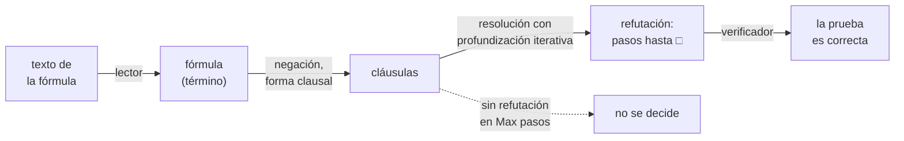
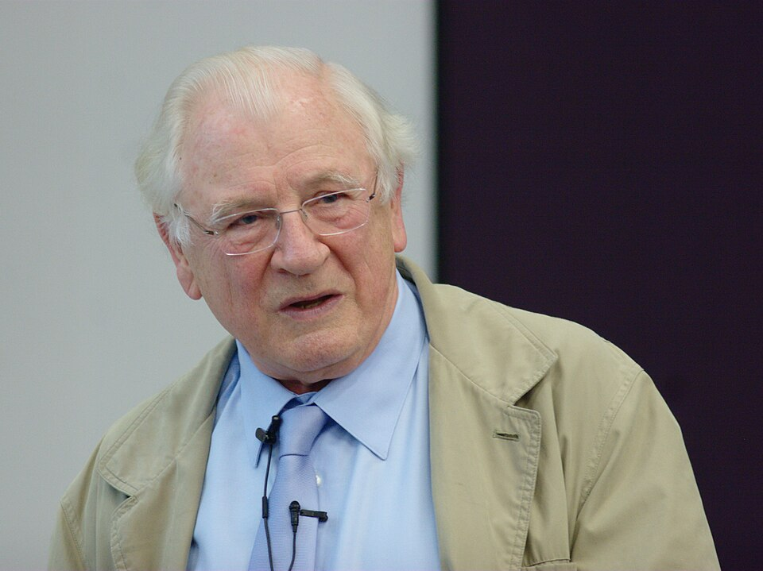

# Capítulo 62 — Proyecto: un demostrador de teoremas

Prolog prueba por resolución, pero solo sobre cláusulas de Horn y con un
recorrido en profundidad que puede no alcanzar una prueba que existe
([sección 12.6](../capitulo-12-prolog-y-la-logica/index.md#126-lo-que-excede-la-logica)).
Un **demostrador de teoremas** escrito en Prolog no tiene esos límites:
acepta fórmulas cualesquiera de la lógica de predicados, con disyunciones en
la conclusión, negaciones y cuantificadores anidados, y organiza la búsqueda
de modo que, si la prueba existe, la encuentra. El programa de este capítulo
lee una fórmula escrita como texto, la lleva a forma clausal, busca por
resolución la refutación más corta de su negación y la devuelve como un dato
que un segundo programa, pequeño e independiente, verifica paso por paso.





John Alan Robinson, que en 1965 publicó el principio de resolución, la
regla de inferencia única sobre la que trabaja este demostrador (ver
[Referencias](#referencias)).
Imagen: David Monniaux,
[CC BY-SA 3.0](https://creativecommons.org/licenses/by-sa/3.0/), vía
[Wikimedia Commons](https://commons.wikimedia.org/wiki/File:John_Alan_Robinson_IMG_0493.jpg).

El proyecto crece en siete versiones. La primera es el lector de fórmulas;
la segunda, la forma clausal de la lógica proposicional; la tercera, el
demostrador por resolución con profundización iterativa; la cuarta, el
verificador de refutaciones. La quinta y la sexta extienden la forma
clausal y la resolución a la lógica de predicados, con skolemización,
factorización y la comprobación de ocurrencia. La séptima compara el
demostrador con dos procedimientos que deciden la lógica proposicional: la
separación de casos de Quine y `library(clpb)`. Dos secciones finales
construyen un modelo cuando no hay refutación y agregan la estrategia de
conjunto de soporte.

```prolog
?- demostrar_fo("¬∃x ∀y (afeita(x, y) ↔ ¬afeita(y, y))", 5, P), escribir_prueba(P).
  1.  ¬afeita(A, A) ∨ ¬afeita(sk1, A)  premisa
  2.  afeita(A, A) ∨ afeita(sk1, A)   premisa
  3.  ¬afeita(sk1, sk1)               factor de 1
  4.  afeita(sk1, sk1)                resolvente de 2 y 3
  5.  □                               resolvente de 3 y 4
P = prueba([[-afeita(_A, _A), -afeita(sk1, _A)], [+afeita(_B, _B), +afeita(sk1, _B)]], [f(1, [-afeita(sk1, sk1)]), r(2, 3, [+afeita(sk1, sk1)]), r(3, 4, [])]).
```

La consulta demuestra que no existe un barbero que afeita exactamente a
quienes no se afeitan a sí mismos. Las dos primeras líneas son la forma
clausal de la negación, con el barbero hipotético convertido en la
constante `sk1`; las tres siguientes, la refutación, y la última, la misma
refutación como término de Prolog, listo para el verificador.

El proyecto parte de seis libros. De *Prolog Experiments in Discrete
Mathematics, Logic, and Computability* de James L. Hein
([edición en línea](https://samples.jbpub.com/9780763772062/PrologLabBook09.pdf)),
de los apartados «Tautology Tester», «CNF Generator» y «Resolution Theorem
Prover for Propositions», toma el método de Quine, la forma normal
conjuntiva obtenida por reescritura y la prueba como una secuencia numerada
de cláusulas, cada una premisa o resolvente de dos anteriores. De *The Power
of Prolog* de Markus Triska, del capítulo
«[Theorem Proving with Prolog](https://www.metalevel.at/prolog/theoremproving)»,
toma la profundización iterativa con `length/2` sobre la cadena de
resolventes, la refutación como un término que otro programa puede
verificar y la comparación con las restricciones booleanas. De *Programming
in Prolog* de Clocksin y Mellish, del apéndice «Clausal Form Program
Listings», toma las etapas de la forma clausal con cuantificadores. De
*Simply Logical* de Peter Flach, del apartado
«[Forward chaining](https://book.simply-logical.space/src/text/2_part_ii/5.4.html)»,
toma la búsqueda de un modelo como la contracara de la refutación. De
*Artificial Intelligence through Prolog* de Neil Rowe
([capítulo 14](https://faculty.nps.edu/ncrowe/book/chap14.html)), toma la
resolución con variables, el renombrado antes de cada paso y los filtros de
redundancia. De *Prolog Programming for Artificial Intelligence* de Ivan
Bratko, del apartado «A simple theorem prover», toma el ejemplo que
recorre el capítulo. La lista completa, con lo que se toma de cada uno,
está en [Referencias](#referencias). El código es propio.

El capítulo cumple tres anuncios: el del
[capítulo 38](../capitulo-38-semantica-de-los-programas-logicos/index.md),
la resolución general sobre cláusulas que no son de Horn; el del
[capítulo 43](../capitulo-43-proyecto-resolver-ecuaciones/index.md), una
forma normal obtenida por reescritura; y el del
[capítulo 60](../capitulo-60-proyecto-interprete-dirigido-patrones/index.md),
cuyo demostrador proposicional se extiende aquí a la lógica de predicados,
con refutaciones que se verifican y la subsunción. Usa las gramáticas del
[capítulo 21](../capitulo-21-gramaticas-dcg/index.md), las representaciones
limpias del [capítulo 32](../capitulo-32-inspeccion-de-terminos/index.md),
la profundización iterativa del
[capítulo 33](../capitulo-33-introspeccion-y-metainterpretes/index.md) y
`library(clpb)`, presentada en la
[sección 23.12](../capitulo-23-programacion-con-restricciones/index.md#2312-libraryclpb).
Cada versión es un módulo que carga la anterior, y se ejecuta en una
instalación local; el verificador no depende de ningún otro archivo y
corre también en SWISH.

## Objetivos del capítulo

Al terminar el capítulo, el lector puede:

- leer fórmulas escritas como texto con un analizador léxico y una
  gramática con un no terminal por nivel de precedencia, y representar las
  variables del objeto como variables de Prolog;
- llevar una fórmula a forma normal negada y a forma clausal, y medir el
  crecimiento que produce la distribución;
- buscar la refutación más corta con profundización iterativa sobre la
  longitud de la prueba, y devolverla como un dato;
- escribir un verificador independiente del demostrador, que acepta una
  prueba solo si puede rehacer cada paso;
- completar la forma clausal de la lógica de predicados con la forma
  prenexa y la skolemización, y explicar por qué la resolución necesita
  factorización y comprobación de ocurrencia;
- comparar el demostrador con el método de Quine y con `library(clpb)`, y
  decir qué produce cada uno: un veredicto, un contraejemplo o una prueba.

!!! info "Tiempo estimado"
    Leer el capítulo, ejecutar sus ejemplos y hacer las actividades: **1:40 h**.
    Resolver los 5 ejercicios marcados con ★: **1:20 h**.
    Resolver los 12 ejercicios del final: **4:15 h**.

## 62.1 El programa terminado

El programa terminado se carga con `swipl ejemplos/capitulo-62/comparacion.pl`,
que carga todas las versiones salvo el verificador. `demostrar_fo/3` recibe
el texto de una fórmula y la longitud máxima de la prueba; si encuentra una
refutación de la negación, la devuelve como `prueba(Clausulas, Pasos)`. Un
paso `r(I, J, R)` dice que la cláusula siguiente, `R`, es un resolvente de
las cláusulas número `I` y `J`; un paso `f(I, R)`, que es un factor de la
cláusula número `I`. El verificador, `verificar/1`, recibe ese término y
lo acepta o lo rechaza.

| Versión | Archivo | Agrega | Lo que no puede hacer todavía |
|---|---|---|---|
| 1 | `lector.pl` | el lector de fórmulas y su escritura | nada más que leer |
| 2 | `clausal.pl` | la forma normal negada y la forma clausal proposicional | tratar los cuantificadores |
| 3 | `resolucion.pl` | la resolución proposicional con profundización iterativa | cláusulas con variables |
| 4 | `verificador.pl` | la verificación de una refutación | — (no depende de las demás) |
| 5 | `primer_orden.pl` | la forma prenexa, la skolemización y la forma clausal de la lógica de predicados | probar |
| 6 | `resolucion_fo.pl` | la resolución con variables, la factorización y la estrategia lineal | decidir: si no hay prueba, la búsqueda no termina sin un máximo |
| 7 | `comparacion.pl` | el método de Quine, `library(clpb)` y el principio del palomar | — |

## 62.2 Versión 1: el lector de fórmulas

Una fórmula se escribe como texto, con los símbolos de la lógica o con sus
equivalentes en ASCII: ¬ o `~`, ∧ o `&`, ∨ o `|`, → o `->`, ↔ o `<->`, ∀ o
`todo`, ∃ o `existe`. `leer_formula/2` la devuelve como un término con una
**representación limpia**
([sección 32.6](../capitulo-32-inspeccion-de-terminos/index.md#326-representaciones-limpias)):
cada clase de fórmula tiene su functor —`at/1` para una fórmula atómica,
`no/1`, `y/2`, `o/2`, `si/2`, `sii/2`, `todo/2` y `existe/2`—, y ningún
predicado del proyecto necesita preguntar con `atom/1` qué clase de
fórmula recibió.

La lectura tiene dos etapas, como la del compilador del
[capítulo 45](../capitulo-45-proyecto-compilador/index.md). El analizador
léxico pasa los códigos del texto a una lista de símbolos: `no`, `y`, `o`,
`si`, `sii`, `todo`, `existe`, los paréntesis, la coma e `id(Nombre)`. El
primer carácter decide la clase del símbolo: si empieza un nombre, se lee
el nombre, y si no, `signo//2` elige la cláusula por ese carácter, que es
su primer argumento. La indexación encuentra la única cláusula que
corresponde, y el analizador no deja alternativas pendientes:

<!-- ejemplo: capitulo-62/lector.pl predicado: simbolo//1 signo//2 -->
```prolog
%!  simbolo(-S)// is semidet.
%
%   S es el símbolo que empieza en el texto: un conectivo, un
%   cuantificador, un paréntesis, una coma o id(Nombre). El primer
%   carácter decide la clase del símbolo, de modo que no queda ninguna
%   alternativa pendiente.
simbolo(S) -->
    [C],
    (   { code_type(C, csymf) }
    ->  resto_nombre(Cs),
        { atom_codes(Nombre, [C|Cs]),
          palabra(Nombre, S)
        }
    ;   signo(C, S)
    ).

%!  signo(+C, -S)// is semidet.
%
%   S es el símbolo que empieza con el carácter C, que no es el de un
%   nombre; el resto del símbolo sigue en el texto. La indexación por el
%   primer argumento elige la única cláusula que corresponde a C.
signo(0'¬, no)      --> [].
signo(0'~, no)      --> [].
signo(0'∧, y)       --> [].
signo(0'&, y)       --> [].
signo(0'∨, o)       --> [].
signo(0'|, o)       --> [].
signo(0'→, si)      --> [].
signo(0'-, si)      --> ">".
signo(0'↔, sii)     --> [].
signo(0'<, sii)     --> "->".
signo(0'∀, todo)    --> [].
signo(0'∃, existe)  --> [].
signo(0'(, '(')     --> [].
signo(0'), ')')     --> [].
signo(0',, ',')     --> [].
```

La gramática tiene un no terminal por nivel de precedencia, del que liga
menos al que liga más: ↔, →, ∨, ∧ y, en el nivel más alto, la negación y
los cuantificadores. La implicación se asocia a la derecha, porque su
segundo operando es otra implicación; la conjunción y la disyunción, a la
izquierda, porque un no terminal auxiliar acumula los operandos leídos:

<!-- ejemplo: capitulo-62/lector.pl predicado: implicacion//2 conjuncion_resto//3 -->
```prolog
%!  implicacion(+Entorno:list, -F)// is semidet.
%
%   F es una implicación, que se asocia a la derecha: p → q → r es
%   p → (q → r).
implicacion(E, F) -->
    disyuncion(E, A),
    (   [si]
    ->  implicacion(E, B),
        { F = si(A, B) }
    ;   { F = A }
    ).

%!  conjuncion_resto(+Entorno:list, +A, -F)// is semidet.
%
%   F es A seguida de los factores que quedan en el texto.
conjuncion_resto(E, A, F) -->
    [y],
    !,
    unaria(E, B),
    conjuncion_resto(E, y(A, B), F).
conjuncion_resto(_, F, F) -->
    [].
```

El primer argumento de cada no terminal es el **entorno**: la lista de
pares `Nombre-Variable` de los cuantificadores que rodean el punto de la
lectura. Cada cuantificador agrega un par con una variable de Prolog
nueva, y un nombre que aparece en el entorno se lee como esa variable; los
demás nombres son constantes o símbolos de función. Así, dos
cuantificadores nunca comparten una variable, aunque el texto use el mismo
nombre, y la fórmula que resulta está lista para que la unificación
trabaje sobre ella:

<!-- ejemplo: capitulo-62/lector.pl predicado: unaria//2 -->
```prolog
%!  unaria(+Entorno:list, -F)// is semidet.
%
%   F es una negación, una fórmula cuantificada, una fórmula entre
%   paréntesis o una fórmula atómica. Un cuantificador liga una variable
%   nueva y alcanza solo a la fórmula que lo sigue: ∀x p(x) → q(x) es
%   (∀x p(x)) → q(x).
unaria(E, no(F)) -->
    [no],
    !,
    unaria(E, F).
unaria(E, todo(X, F)) -->
    [todo, id(N)],
    !,
    unaria([N-X|E], F).
unaria(E, existe(X, F)) -->
    [existe, id(N)],
    !,
    unaria([N-X|E], F).
unaria(E, F) -->
    ['('],
    !,
    formula(E, F),
    [')'].
unaria(E, at(A)) -->
    [id(N)],
    argumentos(E, Ts),
    { compound_name_arguments_o_atomo(A, N, Ts) }.
```

```prolog
?- leer_formula("¬p ∧ q → r ∨ s", F).
F = si(y(no(at(p)), at(q)), o(at(r), at(s))).

?- leer_formula("∀x (hombre(x) → mortal(x))", F).
F = todo(_A, si(at(hombre(_A)), at(mortal(_A)))).

?- leer_formula("∀x p(x) → q(x)", F).
F = si(todo(_A, at(p(_A))), at(q(x))).
```

La tercera muestra el alcance de un cuantificador: solo la fórmula que lo
sigue, como la negación. La `x` de `q(x)` está fuera de ese alcance y se
lee como la constante `x`. Un texto que no es una fórmula produce un error
de sintaxis, y ↔ no se asocia:

```prolog
?- leer_formula("p ↔ q ↔ r", F).
ERROR: Syntax error: formula("p ↔ q ↔ r")
```

`formula_texto/2` hace el camino inverso: nombra `x`, `y`, `z`… las
variables ligadas, en el orden de sus cuantificadores, y escribe los
paréntesis que la precedencia exige. Leer lo escrito da una variante de la
fórmula original, y las pruebas de `lector.plt` lo verifican:

```prolog
?- leer_formula("existe b todo p (afeita(b, p) <-> ~afeita(p, p))", F), formula_texto(F, T).
F = existe(_A, todo(_B, sii(at(afeita(_A, _B)), no(at(afeita(_B, _B)))))),
T = "∃x ∀y (afeita(x, y) ↔ ¬afeita(y, y))".
```

!!! question "Actividad"
    Predecir el término que `leer_formula/2` devuelve para
    `"¬p ∨ q ∧ r → s"` y para `"∃x p(x) ∨ q(x) ↔ ¬r"`, y cuáles de sus
    subtérminos comparten una variable. Comprobarlo, y escribir cada
    término de vuelta con `formula_texto/2`.

## 62.3 Versión 2: la forma clausal proposicional

La resolución trabaja sobre **cláusulas**: disyunciones de literales. En
`clausal.pl` un literal es `+A` o `-A`, con `A` una fórmula atómica; una
cláusula es una lista ordenada de literales, sin repeticiones; la forma
clausal de una fórmula es la lista de sus cláusulas, que se leen unidas
por la conjunción. El camino tiene dos etapas, las de la
[sección 60.6](../capitulo-60-proyecto-interprete-dirigido-patrones/index.md#606-version-4-un-demostrador-por-resolucion),
ahora con ↔ y con cuantificadores.

La **forma normal negada** elimina → y ↔ y lleva la negación hasta las
fórmulas atómicas. `fnn/2` traduce una fórmula, y `fnn_no/2`, su negación;
cada conectivo tiene una regla en cada uno, y la negación de un
cuantificador es su dual, como en el apéndice de Clocksin y Mellish:

<!-- ejemplo: capitulo-62/clausal.pl predicado: fnn_no/2 -->
```prolog
%!  fnn_no(+F, -G) is det.
%
%   G es la forma normal negada de ¬F.
fnn_no(at(A), no(at(A))).
fnn_no(no(F), G) :-
    fnn(F, G).
fnn_no(y(A, B), o(NA, NB)) :-
    fnn_no(A, NA),
    fnn_no(B, NB).
fnn_no(o(A, B), y(NA, NB)) :-
    fnn_no(A, NA),
    fnn_no(B, NB).
fnn_no(si(A, B), y(FA, NB)) :-
    fnn(A, FA),
    fnn_no(B, NB).
fnn_no(sii(A, B), o(y(FA, NB), y(NA, FB))) :-
    fnn(A, FA),
    fnn_no(A, NA),
    fnn(B, FB),
    fnn_no(B, NB).
fnn_no(todo(X, F), existe(X, G)) :-
    fnn_no(F, G).
fnn_no(existe(X, F), todo(X, G)) :-
    fnn_no(F, G).
```

```prolog
?- leer_formula("¬(p ↔ q)", F), fnn(F, G).
F = no(sii(at(p), at(q))),
G = o(y(at(p), no(at(q))), y(no(at(p)), at(q))).
```

La **forma normal conjuntiva** distribuye la disyunción sobre la
conjunción: cada cláusula de $A \lor B$ une una cláusula de $A$ con una de
$B$. `fnc/2` descarta las cláusulas que contienen un literal y su opuesto,
que son verdaderas siempre, y produce un error de tipo si todavía hay
cuantificadores:

<!-- ejemplo: capitulo-62/clausal.pl predicado: fnc/2 -->
```prolog
%!  fnc(+G, -Clausulas:list) is det.
%
%   Clausulas es la lista de cláusulas de G, una fórmula en forma normal
%   negada y sin cuantificadores. La disyunción se distribuye sobre la
%   conjunción: cada cláusula de A ∨ B une una cláusula de A con una de B.
%   Una fórmula con cuantificadores produce un error de tipo.
fnc(at(A), [[+A]]).
fnc(no(at(A)), [[-A]]).
fnc(y(A, B), Cs) :-
    fnc(A, CA),
    fnc(B, CB),
    append(CA, CB, Cs).
fnc(o(A, B), Cs) :-
    fnc(A, CA),
    fnc(B, CB),
    findall(C,
            ( member(X, CA),
              member(Y, CB),
              ord_union(X, Y, C),
              \+ tautologica(C)
            ),
            Cs).
fnc(todo(X, F), _) :-
    type_error(formula_sin_cuantificadores, todo(X, F)).
fnc(existe(X, F), _) :-
    type_error(formula_sin_cuantificadores, existe(X, F)).
```

```prolog
?- clausulas_texto("¬((p → q) ∧ p → q)", Cs).
Cs = [[+p], [+q, -p], [-q]].

?- clausulas_texto("(p ∧ q) ∨ (p ∧ ¬q)", Cs).
Cs = [[+p], [+p, +q], [+p, -q]].
```

La segunda forma clausal es correcta y redundante: las cláusulas
`[+p, +q]` y `[+p, -q]` contienen a `[+p]`, y cualquier asignación que
satisface `[+p]` las satisface. Una cláusula que contiene a otra está
**subsumida** por ella; la [sección 62.7](#627-version-6-resolucion-con-variables)
vuelve sobre esa relación.

La distribución tiene un costo que conviene medir. La disyunción de n
conjunciones de dos átomos, $(a_1 \land b_1) \lor \dots \lor (a_n \land
b_n)$, tiene $2^n$ cláusulas, una por cada manera de elegir un átomo de
cada conjunción:

```prolog
?- clausulas_texto("a1 ∧ b1 ∨ a2 ∧ b2 ∨ a3 ∧ b3", Cs), length(Cs, N).
Cs = [[+a1, +a2, +a3], [+a1, +a2, +b3], [+a1, +a3, +b2], [+a1, +b2, +b3], [+a2, +a3, +b1], [+a2, +b1, + ...], [+a3, + ...|...], [+ ...|...]],
N = 8.
```

Con n = 12 son 4 096 cláusulas y 1 375 513 inferencias. El
[ejercicio 4](#ejercicios) construye una forma clausal que crece en forma
lineal, a cambio de agregar átomos nuevos.

## 62.4 Versión 3: resolución con profundización iterativa

Una fórmula es un teorema si su negación es insatisfacible, y la
negación es insatisfacible si de su forma clausal se deriva por resolución
la cláusula vacía, □. El paso de resolución toma un literal de una
cláusula y el opuesto de otra, y reúne los demás; `resolvente/3` no produce
resolventes tautológicos, que no pueden formar parte de una refutación más
corta:

<!-- ejemplo: capitulo-62/resolucion.pl predicado: resolvente/3 -->
```prolog
%!  resolvente(+C1:list, +C2:list, -R:list) is nondet.
%
%   R es un resolvente de las cláusulas C1 y C2, sin variables: C1 tiene
%   un literal y C2 su opuesto, y R reúne los demás literales de las dos.
%   Un resolvente tautológico no se produce.
resolvente(C1, C2, R) :-
    select(L1, C1, R1),
    opuesto(L1, L2),
    selectchk(L2, C2, R2),
    ord_union(R1, R2, R),
    \+ tautologica(R).
```

La búsqueda de la refutación no puede usar el recorrido en profundidad de
Prolog tal como es: una rama que agrega resolventes sin fin impediría
llegar a las demás, que es la razón por la que Prolog es incompleto
([sección 5.6](../capitulo-05-como-responde-prolog/index.md#56-ramas-infinitas)).
Como en el intérprete de la
[sección 33.5](../capitulo-33-introspeccion-y-metainterpretes/index.md#335-limites-de-profundidad-y-profundizacion-iterativa),
`length/2` genera listas de pasos de longitud 0, 1, 2…, y `derivar/2`
intenta completar cada una. La primera refutación que aparece es la más
corta, y el máximo evita que la búsqueda siga sin fin cuando no hay
ninguna:

<!-- ejemplo: capitulo-62/resolucion.pl predicado: refutar/3 derivar/2 -->
```prolog
%!  refutar(+Clausulas:list, +Max:integer, -Pasos:list) is semidet.
%
%   Pasos es la lista más corta de pasos de resolución, de a lo sumo Max,
%   que lleva de las Clausulas, sin variables, a la cláusula vacía.
refutar(Clausulas, Max, Pasos) :-
    between(0, Max, N),
    length(Pasos, N),
    derivar(Pasos, Clausulas),
    !.

%!  derivar(?Pasos:list, +Clausulas:list) is nondet.
%
%   Pasos, una lista de longitud conocida, lleva de Clausulas a una lista
%   que contiene la cláusula vacía. Cada paso agrega al final un
%   resolvente que no estaba.
derivar([], Clausulas) :-
    memberchk([], Clausulas).
derivar([r(I, J, R)|Pasos], Clausulas) :-
    nth1(J, Clausulas, C2),
    nth1(I, Clausulas, C1),
    I < J,
    resolvente(C1, C2, R),
    \+ memberchk(R, Clausulas),
    append(Clausulas, [R], Clausulas1),
    derivar(Pasos, Clausulas1).
```

`derivar/2` agrega cada resolvente al final de la lista, de modo que la
cláusula número k de la lista es la cláusula número k de la prueba, y
exige que el resolvente sea nuevo: sin esa condición, la misma cláusula se
podría agregar una y otra vez. `demostrar/3` niega la fórmula, la pasa a
cláusulas y busca la refutación; `escribir_prueba/1` la escribe con una
línea por cláusula, en la forma de Hein:

```prolog
?- demostrar("(a → b) ∧ (b → c) → (a → c)", 5, P).
P = prueba([[+a], [+b, -a], [+c, -b], [-c]], [r(1, 2, [+b]), r(3, 4, [-b]), r(5, 6, [])]).

?- demostrar("(p ∨ q) ∧ (p → r) ∧ (q → r) → r", 5, P), escribir_prueba(P).
  1.  p ∨ q                           premisa
  2.  r ∨ ¬p                          premisa
  3.  r ∨ ¬q                          premisa
  4.  ¬r                              premisa
  5.  q ∨ r                           resolvente de 1 y 2
  6.  r                               resolvente de 3 y 5
  7.  □                               resolvente de 4 y 6
P = prueba([[+p, +q], [+r, -p], [+r, -q], [-r]], [r(1, 2, [+q, +r]), r(3, 5, [+r]), r(4, 6, [])]).
```

La segunda es un razonamiento por casos: `p ∨ q` tiene dos literales
positivos y no es una cláusula de Horn. Prolog no puede cargarla como
programa ([sección 12.4](../capitulo-12-prolog-y-la-logica/index.md#124-clausulas-de-horn)),
y la resolución general la usa como cualquier otra.

Una fórmula que no es un teorema no tiene refutación. En la lógica
proposicional la búsqueda termina aun sin el máximo en cada longitud,
porque con finitos átomos hay finitas cláusulas: cuando no queda
ningún resolvente nuevo, ninguna longitud mayor tiene pasos posibles. El
`false.` significa entonces que no hay refutación de a lo sumo el máximo;
la segunda consulta muestra que un máximo menor que la prueba más corta
también da `false.`:

```prolog
?- demostrar("(p → q) → (q → p)", 10, P).
false.

?- demostrar("(a → b) ∧ (b → c) → (a → c)", 2, P).
false.
```

!!! question "Actividad"
    Predecir cuántos pasos tiene la refutación más corta de
    `"(p → q) ∧ (q → r) ∧ (r → s) → (p → s)"` y cuántas cláusulas
    tiene la negación. Comprobarlo con `demostrar/3` y
    `escribir_prueba/1`, y medir con `time/1` cuántas inferencias cuesta
    con el máximo en 4 y en 10.

## 62.5 Versión 4: el verificador

Un demostrador es un programa de búsqueda, con estrategias y filtros que
pueden tener errores. Si la prueba es un dato, no hace falta confiar en el
demostrador: alcanza con un programa que la **verifique**, más pequeño y
más fácil de leer que el que la buscó. `verificador.pl` no carga ningún
otro archivo del capítulo; recibe `prueba(Clausulas, Pasos)`, rehace cada
paso con las cláusulas anteriores y acepta la prueba si todos son
correctos y el último produce la cláusula vacía:

<!-- ejemplo: capitulo-62/verificador.pl predicado: verificar/1 paso_correcto/3 -->
```prolog
%!  verificar(+Prueba) is semidet.
%
%   Prueba, de la forma prueba(Clausulas, Pasos), es una refutación
%   correcta de las Clausulas: cada paso es correcto y el último produce
%   la cláusula vacía.
verificar(prueba(Clausulas, Pasos)) :-
    verificar_pasos(Pasos, Clausulas, Ultima),
    Ultima == [].

%!  paso_correcto(+Paso, +Clausulas:list, -C:list) is semidet.
%
%   Paso es correcto con las Clausulas anteriores, y agrega la cláusula C.
paso_correcto(r(I, J, C), Clausulas, C) :-
    integer(I),
    integer(J),
    nth1(I, Clausulas, C1),
    nth1(J, Clausulas, C2),
    once(( resolver(C1, C2, R),
           misma_clausula(R, C)
         )).
paso_correcto(f(I, C), Clausulas, C) :-
    integer(I),
    nth1(I, Clausulas, C1),
    once(( factorizar(C1, R),
           misma_clausula(R, C)
         )).
```

`resolver/3` hace el paso con copias de las dos cláusulas, de modo que no
comparten variables, y unifica los literales opuestos con
`unify_with_occurs_check/2`
([sección 34.2](../capitulo-34-estructuras-incompletas-y-listas-diferencia/index.md#342-de-append3-a-la-lista-diferencia)).
El resultado se compara con la cláusula que la prueba afirma salvo el
orden de los literales y el nombre de las variables:

<!-- ejemplo: capitulo-62/verificador.pl predicado: resolver/3 misma_clausula/2 -->
```prolog
%!  resolver(+C1:list, +C2:list, -R:list) is nondet.
%
%   R es un resolvente de copias de C1 y C2 sin variables comunes: un
%   literal de una unifica con el opuesto de un literal de la otra, y R
%   reúne los demás literales de las dos con el unificador aplicado.
resolver(C1, C2, R) :-
    copy_term(C1, D1),
    copy_term(C2, D2),
    select(L1, D1, R1),
    select(L2, D2, R2),
    opuestos(L1, L2),
    append(R1, R2, R0),
    sin_repetidos(R0, R).

%!  misma_clausula(+R:list, +C:list) is semidet.
%
%   R y C tienen los mismos literales, salvo el orden y el nombre de las
%   variables.
misma_clausula(R, C) :-
    same_length(R, C),
    permutation(R, P),
    P =@= C,
    !.
```

```prolog
?- verificar(prueba([[+p], [+q, -p], [-q]], [r(1, 2, [+q]), r(3, 4, [])])).
true.

?- verificar(prueba([[+p], [+q, -p], [-q]], [r(1, 3, [])])).
false.

?- verificar(prueba([[+p, +q], [-p], [-q]], [r(1, 2, [])])).
false.
```

La segunda prueba resuelve dos cláusulas sin literales opuestos; la
tercera afirma que el resolvente de `p ∨ q` y `¬p` es □, cuando es `q`.
El verificador ya trata variables y factores: la versión 6 lo usa sin
cambios. Las pruebas de `resolucion.plt` y de `resolucion_fo.plt` pasan
por él cada refutación que el demostrador encuentra, y ninguna prueba del
demostrador sale del capítulo sin esa verificación.

## 62.6 Versión 5: la forma clausal de la lógica de predicados

Con cuantificadores, la forma clausal necesita tres pasos más entre la
forma normal negada y la distribución. La página
[La lógica de predicados](primer-orden.md#la-forma-clausal-de-la-logica-de-predicados)
los desarrolla: dar a cada cuantificador una variable propia, porque ↔
duplica subfórmulas y con ellas sus variables ligadas; llevar los
cuantificadores al frente, la **forma prenexa**; y **skolemizar**:
reemplazar cada variable existencial por un término nuevo, que depende de
las variables universales que la preceden. Como las variables del objeto
son variables de Prolog, la skolemización es una unificación: la variable
existencial se liga al término de Skolem.

```prolog
?- clausulas_fo_texto("¬∃x (bebe(x) → ∀y bebe(y))", Cs).
Cs = [[+bebe(_A)], [-bebe(sk1(_A))]].
```

## 62.7 Versión 6: resolución con variables

La misma página, en
[Resolución con variables](primer-orden.md#resolucion-con-variables),
extiende el demostrador: copia las cláusulas antes de cada paso, unifica
con la comprobación de ocurrencia, agrega la **factorización**, sin la
cual la paradoja del barbero no tiene refutación, y la **estrategia
lineal**, que reduce el trabajo entre 2 y 71 veces en los ejemplos
medidos. Muestra también la fórmula que un demostrador sin comprobación de
ocurrencia «prueba» aunque no es un teorema, y que el verificador rechaza,
y por qué la subsunción, que el
[capítulo 60](../capitulo-60-proyecto-interprete-dirigido-patrones/soluciones.md#8)
dejó pendiente, no mejora estas búsquedas.

!!! question "Actividad"
    Antes de leer la página, predecir si la negación de
    `"¬∃x ∀y (afeita(x, y) ↔ ¬afeita(y, y))"` tiene una refutación que
    use solo pasos de resolución, sin factorización. Justificar la
    predicción con el tamaño de los resolventes de sus dos cláusulas, y
    comprobarla con `refutar_con/4`.

## 62.8 Tres maneras de decidir

En la lógica proposicional hay procedimientos que siempre terminan. La
página [Tres maneras de decidir](comparacion.md#tres-maneras-de-decidir)
compara el demostrador con la separación de casos de Quine y con
`library(clpb)` sobre el principio del palomar: n + 1 palomas no caben en
n agujeros. `clpb` decide el caso de 7 palomas en 4,8 millones de
inferencias; la resolución no resuelve el de 4 palomas en 100 millones.
Cada método produce algo distinto: `clpb` da un veredicto y, si la
fórmula no es un teorema, un contraejemplo; la resolución da una prueba
que se puede verificar.

## 62.9 Construir un modelo

Cuando una fórmula no es un teorema, la resolución no termina sin un
máximo, y `clpb` da el contraejemplo sin decir cómo lo obtuvo. Flach
construye el contraejemplo con un programa de encadenamiento hacia
adelante, adaptado del demostrador SATCHMO de Manthey y Bry: un **modelo**
de un conjunto de cláusulas es un conjunto de fórmulas atómicas sin
variables, las verdaderas, que hace verdadera cada cláusula. Una cláusula
está **violada** cuando todos sus literales negativos son verdaderos y
ninguno de los positivos lo es; el programa busca una, agrega al modelo
uno de sus literales positivos, y repite hasta que no queda ninguna. Si la
cláusula violada no tiene literales positivos, vuelve atrás y elige otro.
`modelos.pl` lo escribe sobre las cláusulas del capítulo:

<!-- ejemplo: capitulo-62/modelos.pl predicado: modelo/3 violada/3 -->
```prolog
%!  modelo(+Clausulas:list, +Modelo0:list, -Modelo:list) is nondet.
%
%   Modelo extiende Modelo0 hasta que ninguna de las Clausulas está
%   violada.
modelo(Clausulas, Modelo0, Modelo) :-
    (   member(C, Clausulas),
        violada(C, Modelo0, Positivos)
    ->  member(A, Positivos),
        ord_add_element(Modelo0, A, Modelo1),
        modelo(Clausulas, Modelo1, Modelo)
    ;   Modelo = Modelo0
    ).

%!  violada(+C:list, +Modelo:list, -Positivos:list) is semidet.
%
%   Una copia de la cláusula C está violada en Modelo: sus literales
%   negativos son verdaderos, con las variables ligadas por el modelo, y
%   ninguno de sus Positivos, ya sin variables, lo es. Una variable que
%   queda libre en un literal positivo produce un error de dominio: la
%   cláusula no es de rango restringido.
violada(C, Modelo, Positivos) :-
    copy_term(C, D),
    signos(D, Negativos, Positivos),
    maplist(verdadera(Modelo), Negativos),
    (   ground(Positivos)
    ->  true
    ;   domain_error(clausula_de_rango_restringido, C)
    ),
    \+ ( member(A, Positivos),
         ord_memberchk(A, Modelo)
       ),
    !.
```

Las cláusulas pueden tener variables, siempre que sean de **rango
restringido**: cada variable de un literal positivo aparece en uno
negativo. Al hacer verdaderos los negativos con fórmulas del modelo, que
no tienen variables, los positivos quedan sin variables también. Una
cláusula como `hombre(X) ∨ mujer(X)` no lo es, y `violada/3` lo señala con
un error de dominio; Flach la corrige con un predicado `persona/1` que
enumera los valores de `X`. El ejemplo de Flach da sus dos modelos
mínimos:

```prolog
?- modelo([[+casado(X), +soltero(X), -hombre(X), -adulto(X)], [+tiene_esposa(Y), -casado(Y), -hombre(Y)], [+hombre(pablo)], [+adulto(pablo)]], M).
M = [adulto(pablo), casado(pablo), hombre(pablo), tiene_esposa(pablo)] ;
M = [adulto(pablo), hombre(pablo), soltero(pablo)].
```

No todo modelo que el programa construye es mínimo: el orden en que se
satisfacen las cláusulas puede agregar una fórmula que otra elección hace
innecesaria. Un conjunto de cláusulas tiene un modelo si y solo si no
tiene refutación, así que un modelo de la negación de una fórmula es un
contraejemplo. `contramodelo/2` lo busca para una fórmula escrita como
texto; los átomos del modelo son los verdaderos, y los demás, falsos:

```prolog
?- contramodelo("(p → q) → (q → p)", M).
M = [q].

?- contramodelo("p ∨ ¬p", M).
false.
```

Con q verdadera y p falsa, `p → q` es verdadera y `q → p` es falsa. El
programa no termina si todo modelo de las cláusulas es infinito; Flach
propone para ese caso un recorrido por niveles con una profundidad
máxima, que el capítulo no escribe.

## 62.10 El conjunto de soporte

Rowe describe la estrategia de **conjunto de soporte**: las cláusulas se
separan en las hipótesis, que se suponen consistentes, y el soporte, la
negación de lo que se quiere probar. Cada paso usa al menos una cláusula
del soporte, y cada resolvente pasa a formar parte de él; dos hipótesis
nunca se resuelven entre sí, porque de hipótesis consistentes no se deriva
la cláusula vacía. `soporte.pl` numera las hipótesis primero, y como cada
paso `r(I, J, R)` tiene `I =< J`, le basta con exigir que `J` sea del
soporte:

<!-- ejemplo: capitulo-62/soporte.pl predicado: paso_soporte/4 -->
```prolog
%!  paso_soporte(+NH:integer, +Clausulas:list, -Paso, -R:list) is nondet.
%
%   Paso es un paso de resolución o de factorización sobre las Clausulas
%   cuya cláusula de número mayor es del soporte, de número mayor que NH;
%   R es la cláusula que agrega.
paso_soporte(NH, Clausulas, r(I, J, R), R) :-
    nth1(J, Clausulas, C2),
    J > NH,
    nth1(I, Clausulas, C1),
    I =< J,
    resolvente_fo(unify_with_occurs_check, C1, C2, R).
paso_soporte(NH, Clausulas, f(I, R), R) :-
    nth1(I, Clausulas, C),
    I > NH,
    factor(unify_with_occurs_check, C, R).
```

`comparar_estrategias/3` mide las tres estrategias sobre un problema con
una cadena de implicaciones útil, de `a` a `e`, y otra que no interviene en
la prueba, de `x` a `z`:

```prolog
?- comparar_estrategias([[-a, +b], [-b, +c], [-c, +d], [-d, +e], [+a], [-x, +y], [-y, +z], [+x]], [[-e]], I).
I = [general-1544090, lineal-18840, soporte-6162].
```

La estrategia general resuelve también la cadena que no interviene; la
lineal la evita una vez elegido el centro, pero puede empezar por
cualquier par de cláusulas; el soporte empieza siempre por `¬e`. El
precio es la completitud: si las hipótesis son inconsistentes, la
estrategia no lo descubre, y `refutar_soporte([[+p], [-p]], [], 3, P)`
falla aunque las dos cláusulas tengan una refutación de un paso. La
búsqueda **en anchura**, la tercera estrategia de Rowe, es la saturación
por niveles del [ejercicio 11](#ejercicios).

!!! success "Criterios de calidad"
    | Criterio | En este capítulo |
    |---|---|
    | C1 | cada predicado declara modos y determinación: `demostrar/3` y `refutar_fo/3` son `semidet` porque devuelven solo la refutación más corta, y los generadores de pasos, `resolvente/3` y `factor/3`, son `nondet` |
    | C2 | la representación es limpia: fórmulas con un functor por conectivo, literales `+A` y `-A`, y la prueba como un término, que el verificador recibe sin conocer al demostrador |
    | C4 | las cláusulas de `fnn/2`, `sustituir/4` y la escritura empiezan por el functor de la fórmula, `signo//2` por el carácter y `opuestos/3` por el literal, de modo que la indexación no deja alternativas; las pruebas lo confirman |
    | C5 | un texto que no es una fórmula produce un error de sintaxis, y una fórmula con cuantificadores en la forma clausal proposicional, un error de tipo, en lugar de una falla silenciosa |
    | C7 | 143 pruebas en nueve archivos; cada refutación que el demostrador encuentra, con cada combinación de opciones, pasa por el verificador, y los tres métodos de decisión dan el mismo veredicto sobre ocho fórmulas |

## Ejercicios

Las soluciones están en [la página de soluciones](soluciones.md). La dificultad
va de 1 (se resuelve consultando el capítulo) a 3 (requiere elaboración propia).
Los marcados con ★ son los que no conviene saltear: cubren lo que el capítulo
tiene de propio. Los ejercicios que piden código se resuelven en archivos
que cargan los del capítulo, sin modificarlos.

1. ★ **(1)** Predecir el término que devuelve `leer_formula/2` para cada
   texto, y comprobarlo: `"p → q ∨ r ∧ s"` · `"¬∀x p(x) ∧ q"` ·
   `"(p → q) → r → s"` · `"∀x ∃y ama(x, y) ∧ ∃y ama(y, x)"`. En el
   último, decir cuántas variables distintas tiene el término y a qué
   cuantificador pertenece cada una.
2. **(2)** Escribir `clasificar(Texto, Clase)`: Clase es `tautologia`,
   `contradiccion` o `contingente`, decidido con `tautologia/2` de
   `comparacion.pl` y el método `clpb`. Clasificar
   `"p ∨ ¬p"`, `"p ∧ ¬p"`, `"p → q"` y `"(p → q) ∨ (q → p)"`.
3. ★ **(2)** Predecir cuántas cláusulas tiene la forma clausal de cada
   fórmula, y comprobarlo con `clausulas_texto/2`:
   `"(p ∧ q) ∨ (r ∧ s)"` · `"¬((p ∨ q) → r)"` · `"p ↔ q"` ·
   `"(p ↔ q) ↔ r"`. Explicar por qué la última tiene las que tiene.
4. **(3)** La **forma clausal definicional** evita la distribución: cada
   subfórmula compuesta recibe un átomo nuevo, `d(N)`, y cláusulas que lo
   relacionan con ella. Escribir `clausulas_def(F, Cs)` para fórmulas sin
   cuantificadores, sobre su forma normal negada, de modo que Cs es
   satisfacible si y solo si F lo es. Comparar la cantidad de cláusulas
   con la de `clausulas/2` para la disyunción de n conjunciones de la
   [sección 62.3](#623-version-2-la-forma-clausal-proposicional), con n de
   1 a 8, y comprobar con `refutar/3` que la negación de
   `(p ∧ q) ∨ (p ∧ ¬q) → p` sigue teniendo refutación.
5. ★ **(2)** Escribir a mano, como un término `prueba/2`, una refutación
   del conjunto de cláusulas de Hein `[[-p, +q], [+p, +q], [+p, -q],
   [-p, -q]]`, y verificarla con `verificar/1`. Después cambiar un
   índice de un paso y explicar por qué el verificador la rechaza.
6. **(2)** Escribir `primer_error(Prueba, K)`: K es el número del primer
   paso de Prueba que no es correcto, o `ninguno` si todos lo son y la
   prueba termina en □. Usar los predicados de `verificador.pl` sin
   cambiarlos.
7. ★ **(2)** Demostrar con `demostrar_fo/3` que
   `"(∃y ∀x ama(x, y)) → ∀x ∃y ama(x, y)"` es un teorema, escribir su
   prueba y su forma clausal, y comparar esa forma clausal con la de la
   implicación inversa, que no es un teorema. Explicar con los términos de
   Skolem por qué una tiene refutación y la otra no.
8. **(3)** La forma prenexa hace que un término de Skolem dependa de todas
   las variables universales anteriores, aunque la variable existencial no
   esté en su alcance. Escribir `skolemizar_fnn(G, H)`, que skolemiza una
   fórmula en forma normal negada sin pasar por la forma prenexa, con
   solo las variables universales cuyo cuantificador rodea al existencial,
   como en el apéndice de Clocksin y Mellish. Comparar los términos que
   da para la negación de `"(∀x ∃y ama(x, y)) → ∃y ∀x ama(x, y)"` con
   los de `clausulas_fo/2`.
9. **(2)** La **resolución unitaria** exige que uno de los dos padres de
   cada paso tenga un solo literal. Escribir `refutar_unitaria(Cs, Max,
   Pasos)` con `resolvente/3` de `resolucion.pl`, comprobar que refuta
   las negaciones de las fórmulas de Bratko y del modus ponens, y que no
   refuta el conjunto de Hein del ejercicio 5. Explicar por qué.
10. ★ **(2)** Escribir `decidir(Texto, Veredicto)` para fórmulas sin
    cuantificadores: `teorema(Prueba)`, con una refutación de
    `demostrar/3` de a lo sumo 10 pasos, o `contraejemplo(A)`, con una
    asignación de `contraejemplo/2`. Verificar la prueba con
    `verificar/1` y el contraejemplo evaluando la fórmula con él.
11. **(3)** La **saturación por niveles** calcula todos los resolventes de
    las cláusulas, los agrega, y repite hasta obtener □ o hasta que no
    aparece ninguno nuevo. Escribir `saturar(Cs, Niveles, Resultado)` con
    `resolvente/3`, donde Resultado es `refutada` o `saturada`, y medir
    con `time/1` las inferencias para el principio del palomar con 3
    palomas, comparadas con las de `refutar_fo/3`.
12. **(2)** El primer modelo que `modelo/2` construye para el segundo
    ejemplo de Flach no es mínimo. Escribir `modelo_minimo(Cs, M)`, que da
    solo los modelos de `modelo/2` de los que ningún subconjunto propio es
    un modelo, y comprobarlo con ese ejemplo. Explicar por qué no alcanza
    con quitar una fórmula por vez.

## Resumen

| | |
|---|---|
| **representación limpia de una fórmula** | un functor por conectivo y por cuantificador, y otro para las fórmulas atómicas, leída de texto por un analizador léxico y una gramática por niveles |
| **entorno de la lectura** | los pares `Nombre-Variable` de los cuantificadores que rodean el punto leído: cada cuantificador liga una variable de Prolog nueva |
| **forma normal negada** | sin → ni ↔, con la negación delante de las fórmulas atómicas y los cuantificadores negados cambiados por su dual |
| **forma clausal** | una lista de cláusulas, cada una una lista ordenada de literales `+A` o `-A`; la distribución puede multiplicar las cláusulas por 2 en cada disyunción |
| **forma prenexa, skolemización** | los cuantificadores al frente; cada variable existencial ligada a un término nuevo de las universales anteriores |
| **refutación** | una lista de pasos `r(I, J, R)` y `f(I, R)` que termina en □; la más corta se busca con profundización iterativa sobre su longitud |
| **factorización** | unir dos literales del mismo signo de una cláusula; sin ella, la resolución binaria es incompleta |
| **comprobación de ocurrencia** | sin ella, la unificación crea términos cíclicos y el demostrador «prueba» fórmulas que no son teoremas |
| **estrategia lineal** | desde el segundo paso, cada uno usa la cláusula que agregó el anterior |
| **verificador** | un programa independiente que rehace cada paso; para confiar en una prueba alcanza con confiar en él |
| **modelo** | un conjunto de fórmulas atómicas sin variables que hace verdadera cada cláusula; existe si y solo si no hay refutación |
| **rango restringido** | cada variable de un literal positivo aparece en uno negativo, de modo que el modelo la liga |
| **conjunto de soporte** | la negación de lo que se prueba y sus descendientes; cada paso usa uno, y dos hipótesis no se resuelven entre sí |
| `leer_formula/2`, `formula_texto/2` | la lectura y la escritura |
| `fnn/2`, `fnc/2`, `clausulas/2`, `clausulas_fo/2` | la forma clausal |
| `demostrar/3`, `demostrar_fo/3`, `refutar_con/4`, `escribir_prueba/1` | el demostrador |
| `verificar/1` | el verificador |
| `tautologia/2`, `contraejemplo/2`, `palomar/2` | la comparación |
| `modelo/2`, `contramodelo/2` | la construcción de un modelo |
| `refutar_soporte/4`, `comparar_estrategias/3` | la estrategia de conjunto de soporte |

## Temas que se retoman

| Tema | Se retoma en |
|---|---|
| Reglas con excepciones, que la lógica clásica de este capítulo no puede expresar sin contradicción | [capítulo 65](../capitulo-65-proyecto-razonamiento-rebatible/index.md) |
| La subsunción entre cláusulas como orden de generalidad, para aprender reglas | [capítulo 67](../capitulo-67-proyecto-aprender-reglas-ejemplos/index.md) |
| La saturación de abajo hacia arriba, restringida a cláusulas de Horn sin funciones | [capítulo 85](../capitulo-85-proyecto-motor-datalog/index.md) |

## Referencias

- James L. Hein, *Prolog Experiments in Discrete Mathematics, Logic, and
  Computability*, Jones and Bartlett, 2009 — apartados «Tautology
  Tester», «CNF Generator» y «Resolution Theorem Prover for Propositions».
  [Edición en línea](https://samples.jbpub.com/9780763772062/PrologLabBook09.pdf).
  El capítulo toma el método de Quine para decidir tautologías, la forma
  normal conjuntiva obtenida por reglas de reescritura, las cláusulas como
  listas de literales y la prueba como una secuencia numerada de cláusulas
  con su justificación; el conjunto de cuatro cláusulas del ejercicio 5 es
  su ejemplo.
- Markus Triska, *The Power of Prolog* — «Theorem Proving with Prolog».
  [Edición en línea](https://www.metalevel.at/prolog/theoremproving).
  El capítulo toma la profundización iterativa con `length/2` sobre la
  cadena de resolventes, que hace completo al demostrador; la refutación
  como un término que otro programa verifica; y la comparación con
  `library(clpb)`.
- William F. Clocksin y Christopher S. Mellish, *Programming in Prolog*,
  5.ª edición, Springer, 2003 — apéndice «Clausal Form Program Listings».
  El capítulo toma las etapas de la forma clausal con cuantificadores:
  eliminar las implicaciones, llevar la negación hacia adentro con los
  cuantificadores duales, skolemizar con las variables universales que
  rodean al existencial, quitar los universales y distribuir; y el
  descarte de las cláusulas tautológicas.
- Peter Flach, *Simply Logical: Intelligent Reasoning by Example*, John
  Wiley, 1994 — apartado 5.4, «Forward chaining».
  [Edición en línea](https://book.simply-logical.space/src/text/2_part_ii/5.4.html).
  El capítulo toma la búsqueda de un modelo de cláusulas indefinidas como
  la contracara de la refutación, que en la comparación es el
  contraejemplo de `library(clpb)`, y, en la
  [sección 62.9](#629-construir-un-modelo), el algoritmo de construcción:
  satisfacer una cláusula violada con uno de sus literales positivos, las
  cláusulas de rango restringido con un predicado de dominio, y sus
  ejemplos de modelos mínimos y no mínimos. El programa de Flach se
  escribe aquí de nuevo, sobre las cláusulas como listas de literales.
- Neil C. Rowe, *Artificial Intelligence through Prolog*, Prentice-Hall,
  1988 — capítulo «A more general logic programming», apartados
  «Resolution with variables», «Resolution search strategies» e
  «Implementing resolution without variables».
  [Edición en línea](https://faculty.nps.edu/ncrowe/book/chap14.html).
  El capítulo toma la resolución con variables y el renombrado de las
  cláusulas antes de cada paso, la estrategia de conjunto de soporte de
  la [sección 62.10](#6210-el-conjunto-de-soporte), la de preferencia
  unitaria y la búsqueda en anchura de los ejercicios 9 y 11, y los filtros de redundancia: tautologías,
  cláusulas repetidas y subsumidas. Rowe afirma que esos filtros son
  difíciles de programar en Prolog con variables; `subsume/2` los
  resuelve con `numbervars/3` dentro de una doble negación.
- Ivan Bratko, *Prolog Programming for Artificial Intelligence*, 4.ª
  edición, Pearson, 2012 — apartado «A simple theorem prover».
  El capítulo toma el principio de resolución por refutación, la fórmula
  (a → b) ∧ (b → c) → (a → c) que recorre la versión 3, y la observación
  de que el mecanismo se extiende a la lógica de predicados.
- John Alan Robinson, «A Machine-Oriented Logic Based on the Resolution
  Principle», *Journal of the ACM* 12(1), 1965. El artículo que Clocksin y
  Mellish, Bratko y Rowe citan como origen de la resolución: la regla única
  de inferencia, la unificación más general con la comprobación de
  ocurrencia y la refutación de la forma clausal de la negación, que son
  las versiones 3 y 6 del capítulo.
- Richard E. Korf, «Depth-First Iterative-Deepening: An Optimal
  Admissible Tree Search», *Artificial Intelligence* 27, 1985. Flach lo
  cita como el origen de la profundización iterativa, y Triska la usa
  por la misma propiedad que Korf demuestra: encuentra la prueba más corta
  con la memoria de una búsqueda en profundidad.
- Rainer Manthey y François Bry, «SATCHMO: A Theorem Prover Implemented in
  Prolog», *9th International Conference on Automated Deduction*,
  Springer, 1988. El programa de construcción de modelos de Flach está
  adaptado de este demostrador; el capítulo toma de ahí la idea de un
  modelo como respuesta cuando no hay refutación, que la
  [sección 62.9](#629-construir-un-modelo) construye.
- Donald W. Loveland, «A Linear Format for Resolution», *Symposium on
  Automatic Demonstration*, Springer, 1970. La resolución lineal y su
  completitud, en las que se apoya la estrategia lineal de la versión 6.
- Armin Haken, «The Intractability of Resolution», *Theoretical Computer
  Science* 39, 1985. La demostración de que toda refutación por
  resolución del principio del palomar crece en forma exponencial, el
  resultado que la comparación de la versión 7 mide.
- Randal E. Bryant, «Graph-Based Algorithms for Boolean Function
  Manipulation», *IEEE Transactions on Computers* C-35(8), 1986.
  [Copia del autor](https://www.cs.cmu.edu/~bryant/pubdir/ieeetc86.pdf).
  Los diagramas de decisión binarios ordenados sobre los que está
  construida `library(clpb)`; el capítulo toma de ahí la explicación de
  por qué `clpb` crece despacio con el palomar y por qué el orden de las
  variables decide el tamaño del diagrama.
- G. S. Tseitin, «On the Complexity of Derivation in Propositional
  Calculus», 1968, y David A. Plaisted y Steven Greenbaum, «A
  Structure-Preserving Clause Form Translation», *Journal of Symbolic
  Computation* 2(3), 1986. La forma clausal con átomos nuevos que crece en
  forma lineal, del ejercicio 4, con las definiciones en un solo sentido.

El código del capítulo es propio, escrito para el curso: ninguno de los
programas de esos libros se copió, y la verificación independiente, la
estrategia lineal y la comparación medida no tienen equivalente en ellos.
