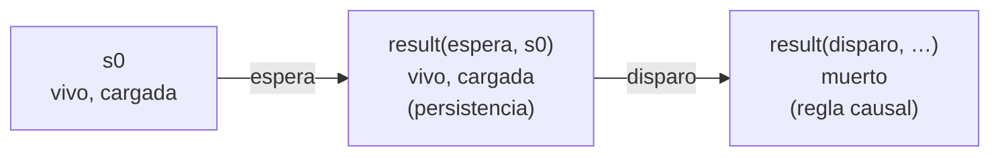

# Cuatro ampliaciones del intérprete

Esta página continúa el [capítulo 65](index.md) con cuatro temas que las
fuentes del capítulo tratan y las seis versiones dejan afuera. Tres vienen
del capítulo «Defeasible Prolog» de Covington: las conclusiones
incompatibles que no son una la negación de la otra, las utilidades de
d-Prolog para examinar una base entera, y la persistencia en el tiempo con
el problema del disparo de Yale. El cuarto viene del apartado 8.2 de
Flach: el programa pretendido, que completa un programa con lo que calla
y da a la negación como falla una lectura declarativa. Los ejemplos están
en `ejemplos/capitulo-65/` (`incompatibles.pl`, `ping_ciclo.pl`,
`utilidades.pl`, `yale.pl` y `complecion.pl`), con sus pruebas. Los cuatro
primeros cargan el intérprete de `rebatible.pl`, y el último, el
`sld.pl` del
[capítulo 38](../capitulo-38-semantica-de-los-programas-logicos/index.md); todos se ejecutan en una instalación local.

## 65.9 Conclusiones incompatibles

Dos literales pueden excluirse sin que uno sea la negación fuerte del otro.
Un animal no es a la vez ave y mamífero, y una persona no es a la vez
capitalista y marxista, aunque `mamifero(X)` no es `neg ave(X)`. Covington
lo muestra con Ping, que nació en China y tiene un restaurante: cada hecho
es evidencia de una de dos conclusiones que se excluyen. La primera manera
de escribir la exclusión es con dos reglas estrictas, una para cada
sentido:

<!-- ejemplo: capitulo-65/ping_ciclo.pl fragmento: % Quien tiene un negocio normalmente .. capitalista(X). -->
```prolog
% Quien tiene un negocio normalmente es capitalista; quien nació en China,
% normalmente marxista.
capitalista(X) :~ duena(X, restaurante).
marxista(X) :~ nacio_en(X, china).

% La incompatibilidad, en los dos sentidos: un marxista no es capitalista,
% y un capitalista no es marxista.
neg capitalista(X) :-
    marxista(X).
neg marxista(X) :-
    capitalista(X).
```

La base es correcta como teoría, pero la consulta no termina:

```prolog
?- call_with_inference_limit(respuesta([], capitalista(ping), R), 200000, L).
L = inference_limit_exceeded.
```

Para aplicar la regla del restaurante hay que verificar que ningún rival
la derrota. La regla estricta `neg capitalista(X) :- marxista(X)` es un
rival si su cuerpo se deriva, así que hay que intentar derivar
`marxista(ping)`; la regla rebatible de China lo concluiría, pero antes hay
que verificar que nada la derrota, y la regla estricta
`neg marxista(X) :- capitalista(X)` lleva de nuevo a derivar
`capitalista(ping)`. Covington describe el mismo ciclo: para mostrar que
Ping es capitalista hay que mostrar primero que Ping es capitalista.
`call_with_inference_limit/3` corta la búsqueda después de 200 000
inferencias y liga su tercer argumento a `inference_limit_exceeded`.

La salida de d-Prolog es un predicado aparte, `incompatible/2`, que no
deriva nada: solo dice qué conclusiones se excluyen. Dos literales son
**contrarios** si uno es el complemento del otro, o si la base declara que
son incompatibles, en cualquiera de los dos órdenes. El intérprete del
capítulo llama `contrario/2` en `rival/4` y en `respuesta/3`; basta con
cambiar esa definición, y separar el complemento en un predicado propio:

<!-- ejemplo: capitulo-65/rebatible.pl predicado: contrario/2 complemento/2 -->
```prolog
%!  contrario(+Literal, -Contrario) is nondet.
%
%   Contrario es el complemento de Literal o, si la base declara
%   incompatible/2, un literal incompatible con él en cualquiera de los
%   dos órdenes. Sin incompatibilidades declaradas, la única respuesta es
%   el complemento.
contrario(Literal, Contrario) :-
    (   user:incompatible(_, _)
    ->  (   complemento(Literal, Contrario)
        ;   user:incompatible(Literal, Contrario)
        ;   user:incompatible(Contrario, Literal)
        )
    ;   complemento(Literal, Contrario)
    ).

%!  complemento(+Literal, -Complemento) is det.
%
%   Complemento es la negación fuerte de Literal, o el átomo que Literal
%   niega.
complemento(neg Atomo, Complemento) :-
    !,
    Complemento = Atomo.
complemento(Atomo, neg Atomo).
```

Cuando la base no declara ninguna incompatibilidad, la condición del
`->` deja una sola respuesta, el complemento, como en las versiones
anteriores, cuyas pruebas no cambian. `respuesta/3` busca ahora un
contrario que se derive en forma estricta con `contrario_estricto/1`, que
corta en el primero, y una respuesta negativa cuando se deriva cualquier
contrario de la meta. La base de Ping se escribe con la incompatibilidad
y la superioridad de la regla del restaurante, y agrega a Lucas, que tiene
un restaurante y nació en Uruguay:

<!-- ejemplo: capitulo-65/incompatibles.pl fragmento: % duena(X, Negocio): .. (marxista(X) :~ nacio_en(X, china))). -->
```prolog
% duena(X, Negocio): X es dueña o dueño de un Negocio.
duena(ping, restaurante).
duena(lucas, restaurante).

% nacio_en(X, Pais): X nació en el Pais.
nacio_en(ping, china).
nacio_en(lucas, uruguay).

% Quien tiene un negocio normalmente es capitalista; quien nació en China,
% normalmente marxista.
capitalista(X) :~ duena(X, restaurante).
marxista(X) :~ nacio_en(X, china).

% incompatible(A, B): A y B no pueden valer a la vez.
incompatible(capitalista(X), marxista(X)).

% Tener un negocio es mejor evidencia que el lugar de nacimiento.
superior((capitalista(X) :~ duena(X, restaurante)),
         (marxista(X) :~ nacio_en(X, china))).
```

<!-- contexto: capitulo-65/incompatibles.pl -->
```prolog
?- respuesta([], capitalista(ping), R).
R = sin_conclusion.

?- respuesta([declarada], capitalista(ping), R).
R = presumiblemente_si.

?- respuesta([declarada], marxista(ping), R).
R = presumiblemente_no.

?- respuesta([], marxista(lucas), R).
R = presumiblemente_no.
```

La consulta termina porque la incompatibilidad no se usa para derivar: el
rival de la regla del restaurante es la regla de China, y lo que se
examina es su cuerpo, `nacio_en(ping, china)`, un hecho, no su
conclusión. Sin criterio, las dos reglas se derrotan entre sí; con la
superioridad declarada, prevalece la del restaurante, y como de ella se
deriva un literal incompatible con `marxista(ping)`, la respuesta sobre
esta meta es negativa. Sobre Lucas no hay conflicto: la regla de China no
se aplica, y la del restaurante basta para responder que, presumiblemente,
no es marxista.

## 65.10 Consultas exhaustivas y contradicciones

`respuesta/3` es la **consulta exhaustiva** de d-Prolog, el operador `@@`
del apartado 11.11 de Covington: recibe una meta sin variables y la
clasifica en las seis respuestas, examinando la meta y todos sus
contrarios. Covington rechaza una meta con variables, porque cada
instancia puede tener otra respuesta. Los apartados siguientes describen
utilidades que en SWI-Prolog no hacen falta o tienen otra forma: un
listado de los predicados que incluya las reglas rebatibles, que aquí son
cláusulas de `(:~)/2` y se listan con `listing((:~)/2)`; la carga y
recarga de archivos con reglas de un mismo predicado intercaladas, que los
módulos y la declaración `discontiguous` de `rebatible.pl` resuelven; y un
**diccionario** con los predicados de la base, que la utilidad del
apartado 11.16 necesita.

Esa utilidad busca **contradicciones**: literales que se derivan, junto
con un contrario, usando solo los hechos y las reglas estrictas. Una
contradicción así no la derrota ningún criterio, porque las reglas
estrictas no admiten excepciones; indica que algún hecho o alguna regla de
la base es falso. `utilidades.pl` arma el diccionario a partir de las
cabezas de las reglas rebatibles y de los refutadores, le agrega los
predicados que aparecen negados en una regla estricta, y prueba cada uno:

<!-- ejemplo: capitulo-65/utilidades.pl predicado: contradicciones/1 -->
```prolog
%!  contradicciones(-Literales:list) is det.
%
%   Literales son los literales positivos de los predicados del
%   diccionario o de una regla estricta negativa tales que el literal y su
%   complemento se derivan los dos en forma estricta, en orden alfabético.
contradicciones(Literales) :-
    diccionario(D0),
    findall(N/A,
            ( clause(user:(neg P), _),
              functor(P, N, A) ),
            D1),
    append(D0, D1, D2),
    sort(D2, D),
    findall(L,
            ( member(N/A, D),
              functor(L, N, A),
              estricto(L),
              estricto(neg L) ),
            Ls),
    sort(Ls, Literales).
```

La base de ejemplo tiene a Bruno, murciélago y ave, con dos reglas
estrictas que se contradicen sobre él, y el diamante de Nixon, cuáquero y
republicano:

<!-- ejemplo: capitulo-65/utilidades.pl fragmento: % cuaquero(X): X es cuáquero. .. neg pacifista(X) :~ republicano(X). -->
```prolog
% cuaquero(X): X es cuáquero. republicano(X): X es republicano.
cuaquero(nixon).
cuaquero(penn).
republicano(nixon).
republicano(reagan).

% Los cuáqueros normalmente son pacifistas; los republicanos normalmente
% no.
pacifista(X) :~ cuaquero(X).
neg pacifista(X) :~ republicano(X).
```

```prolog
?- contradicciones(Cs).
Cs = [mamifero(bruno)].

?- respuesta([], mamifero(bruno), R).
R = contradiccion.
```

La utilidad de Covington construye las consultas con los predicados del
diccionario y las ejecuta, con lo que ejecuta también cualquier efecto que
tengan; la misma advertencia vale aquí, porque `estricto/1` llama los
predicados de la base. `contradicciones/1` devuelve la lista en lugar de
escribirla y de guardarla con `assert/1`.

La misma idea da una consulta exhaustiva que admite variables:
`candidato/2` busca las instancias de una plantilla sobre las que hay
evidencia inicial, un hecho o una regla de cualquier clase con el cuerpo
derivable, para ella o para su complemento, y `respuestas/3` da la
respuesta sobre cada una:

<!-- ejemplo: capitulo-65/utilidades.pl predicado: candidato/2 evidencia/2 respuestas/3 -->
```prolog
%!  candidato(+Criterio:list, +Literal) is nondet.
%
%   Hay evidencia inicial sobre Literal, que puede llegar con variables y
%   queda sin ellas: Literal o su complemento es un hecho, o la cabeza de
%   una regla, rebatible o estricta, o de un refutador, cuyo cuerpo se
%   deriva con Criterio.
candidato(Criterio, Literal) :-
    (   H = Literal
    ;   complemento(Literal, H)
    ),
    evidencia(Criterio, H),
    ground(Literal).

%!  evidencia(+Criterio:list, ?Cabeza) is nondet.
%
%   Una regla de cabeza Cabeza tiene el cuerpo derivable, o Cabeza se
%   deriva en forma estricta.
evidencia(_, H) :-
    estricto(H).
evidencia(Cr, H) :-
    (   user:(H :~ B)
    ;   user:(H :^ B)
    ),
    derivable(Cr, B).

%!  respuestas(+Criterio:list, +Plantilla, -Pares:list) is det.
%
%   Pares tiene un par Literal-Respuesta por cada instancia sin variables
%   de Plantilla sobre la que hay evidencia inicial, con la respuesta de
%   respuesta/3, en orden alfabético.
respuestas(Criterio, Plantilla, Pares) :-
    findall(Plantilla, candidato(Criterio, Plantilla), Ls0),
    sort(Ls0, Ls),
    findall(L-R, ( member(L, Ls), respuesta(Criterio, L, R) ), Pares).
```

<!-- contexto: capitulo-65/utilidades.pl -->
```prolog
?- respuestas([especificidad], pacifista(X), Ps).
Ps = [pacifista(nixon)-sin_conclusion, pacifista(penn)-presumiblemente_si, pacifista(reagan)-presumiblemente_no].
```

Nixon hereda de dos grupos con propiedades opuestas, y ninguno es más
específico que el otro: las dos reglas se refutan, y no hay conclusión.
Covington observa que una declaración de superioridad resolvería el
conflicto sin afirmar que los republicanos son normalmente cuáqueros ni a
la inversa; solo dice qué grupo pesa más para esta propiedad.

## 65.11 La persistencia: el disparo de Yale

Un programa que razona sobre acciones necesita decir qué cambia con cada
una y, sobre todo, qué no cambia: mover una silla de una habitación a
otra no cambia su color. Escribir una regla por cada propiedad que una
acción no afecta es el **problema del marco** de McCarthy y Hayes. El
**cálculo de situaciones** describe el mundo en situaciones: `s0` es la
situación inicial, `result(E, S)` es la que resulta de que ocurra el
evento E en la situación S, y `vale(F, S)` dice que el **fluente** F, una
propiedad que puede cambiar, vale en S. Covington, siguiendo a McDermott,
resuelve el problema del marco con una sola regla rebatible, la
**persistencia**: lo que vale en una situación normalmente sigue valiendo
después de cualquier evento.

Hanks y McDermott construyeron un ejemplo que las lógicas no monotónicas
de su tiempo no resolvían, el **problema del disparo de Yale**: alguien
está vivo, un arma está cargada, ocurre una espera y después un disparo.
La versión de Covington, con Johnnie, cabe en cinco cláusulas:

<!-- ejemplo: capitulo-65/yale.pl fragmento: % vale(F, S): el fluente F vale .. vale(muerto, result(disparo, S)) :~ vale(cargada, S), vale(vivo, S). -->
```prolog
% vale(F, S): el fluente F vale en la situación S.
vale(vivo, s0).
vale(cargada, s0).

% Persistencia: lo que vale normalmente sigue valiendo después de un
% evento.
vale(F, result(_, S)) :~ vale(F, S).

% Nadie está vivo y muerto en la misma situación.
incompatible(vale(vivo, S), vale(muerto, S)).

% Un disparo con el arma cargada normalmente mata a quien está vivo.
vale(muerto, result(disparo, S)) :~ vale(cargada, S), vale(vivo, S).
```



`situacion/2` arma la situación que resulta de una lista de eventos, y
`historia/3` da las respuestas sobre los dos fluentes en cada situación
del recorrido:

<!-- ejemplo: capitulo-65/yale.pl predicado: situacion/2 despues/3 historia/3 -->
```prolog
%!  situacion(+Eventos:list, -S) is det.
%
%   S es la situación que resulta de los Eventos, en orden, desde s0.
situacion(Eventos, S) :-
    foldl(despues, Eventos, s0, S).

%!  despues(+E, +S0, -S) is det.
%
%   S es la situación que resulta del evento E en S0.
despues(E, S0, result(E, S0)).

%!  historia(+Criterio:list, +Eventos:list, -Historia:list) is det.
%
%   Historia tiene, para la situación inicial y cada prefijo de los
%   Eventos, un término Evento-Vivo-Muerto con las respuestas sobre los
%   fluentes vivo y muerto; el primer Evento es inicio.
historia(Criterio, Eventos, Historia) :-
    findall(Pre, append(Pre, _, Eventos), Prefijos),
    findall(E-V-M,
            ( member(P, Prefijos),
              (   last(P, E)
              ->  true
              ;   E = inicio
              ),
              situacion(P, S),
              respuesta(Criterio, vale(vivo, S), V),
              respuesta(Criterio, vale(muerto, S), M) ),
            Historia).
```

<!-- contexto: capitulo-65/yale.pl -->
```prolog
?- respuesta([especificidad], vale(vivo, result(disparo, result(espera, s0))), R).
R = presumiblemente_no.

?- historia([especificidad], [espera, disparo], H).
H = [inicio-definitivamente_si-definitivamente_no, espera-presumiblemente_si-presumiblemente_no, disparo-presumiblemente_no-presumiblemente_si].

?- historia([], [espera, disparo], H).
H = [inicio-definitivamente_si-definitivamente_no, espera-presumiblemente_si-presumiblemente_no, disparo-sin_conclusion-sin_conclusion].
```

En la situación inicial, que Johnnie está vivo es un hecho, y que no está
muerto se deriva en forma estricta de la incompatibilidad. Después de la
espera, la persistencia lleva los dos fluentes a la situación nueva.
Después del disparo compiten dos reglas: la persistencia concluye que
Johnnie sigue vivo, y la regla causal, que está muerto. Con la
especificidad, prevalece la regla causal: su cuerpo, el arma cargada y
Johnnie vivo, permite derivar el de la persistencia, Johnnie vivo, y no a
la inversa. Sin criterio, las dos se derrotan y no hay conclusión.

Covington subraya que la condición `vale(vivo, S)` de la regla causal es
lo que la vuelve más específica, y que es natural incluirla: una regla
causal dice cómo un evento cambia algo, y lo que cambia forma parte de su
condición. Las lógicas que Hanks y McDermott examinaron admiten
**extensiones múltiples**, maneras de completar la historia que violan el
mínimo de reglas rebatibles, y el disparo de Yale tiene al menos tres: que el
arma se descargue durante la espera, que el disparo no mate, o que el
muerto deje de estarlo. La derivación rebatible con especificidad elige la
que se espera. Una sola regla de persistencia tiene un límite: solo lleva
hacia adelante lo que vale, no lo que no vale; el
[ejercicio 12](index.md#ejercicios) lo muestra con un evento más.

## 65.12 El programa pretendido

El apartado 8.2 de Flach da a la negación como falla una lectura
declarativa con una idea que la
[sección 38.3](../capitulo-38-semantica-de-los-programas-logicos/index.md#383-negacion-como-falla-la-complecion-de-clark-y-sldnf)
no plantea en esos términos. Un programa con `\+` tiene en general varios
modelos, y la negación como falla elige uno sin decir cuál. Flach
transforma el programa en otro, el **programa pretendido**, que sea
**completo**: para cada átomo sin variables de la base de Herbrand, él o
su negación es consecuencia lógica. Un programa completo tiene un solo
modelo, que se toma como el modelo pretendido del original. Hay dos
transformaciones: el supuesto de mundo cerrado y la compleción.

El **supuesto de mundo cerrado** de Reiter, que la
[sección 10.1](../capitulo-10-negacion-como-falla/index.md#101-el-supuesto-de-mundo-cerrado)
presenta como una convención, es aquí una transformación: se agrega al
programa la negación de cada átomo de la base de Herbrand que no se
deduce de él. `complecion.pl` escribe los programas de Flach como listas
de cláusulas `Cabeza :- Cuerpo`, con un hecho escrito `Cabeza :- true`, y
los agrega a los del [capítulo 38](../capitulo-38-semantica-de-los-programas-logicos/index.md) con `generado/2`, el
predicado con que `sld.pl` acepta programas construidos como datos:

<!-- ejemplo: capitulo-65/complecion.pl fragmento: % generado(Nombre, Clausulas): .. (gusta(pablo, _) :- true) -->
```prolog
% generado(Nombre, Clausulas): los programas de los ejemplos de Flach.
generado(gusta,
    [ (gusta(pedro, S) :- alumno_de(S, pedro)),
      (alumno_de(pablo, pedro) :- true)
    ]).
generado(gusta_mas,
    [ (gusta(pedro, S) :- alumno_de(S, pedro)),
      (alumno_de(pablo, pedro) :- true),
      (gusta(pablo, _) :- true)
```

`modelo_minimo/2` agrega las cabezas de las instancias cuyos cuerpos ya
están en el modelo, como el operador $T_P$ de la
[sección 38.6](../capitulo-38-semantica-de-los-programas-logicos/index.md#386-evaluacion-de-abajo-hacia-arriba),
y `cwa/2` da los átomos de la base que el supuesto niega:

<!-- ejemplo: capitulo-65/complecion.pl predicado: cwa/2 base/2 -->
```prolog
%!  cwa(+Nombre, -Negados:list) is det.
%
%   Negados son los átomos de la base de Herbrand del programa Nombre que
%   no se deducen de él: lo que el supuesto de mundo cerrado agrega como
%   falso.
cwa(Nombre, Negados) :-
    base(Nombre, Base),
    modelo_minimo(Nombre, Modelo),
    subtract(Base, Modelo, Negados).

%!  base(+Nombre, -Atomos:list) is det.
%
%   Atomos es la base de Herbrand del programa Nombre: cada predicado del
%   programa aplicado a cada combinación de constantes, ordenada.
base(Nombre, Atomos) :-
    clausulas(Nombre, Clausulas),
    predicados(Clausulas, Ps),
    universo(Nombre, Cs),
    findall(At,
            ( member(N/A, Ps),
              length(Args, A),
              maplist(elegir(Cs), Args),
              At =.. [N|Args] ),
            As),
    sort(As, Atomos).
```

<!-- contexto: capitulo-65/complecion.pl -->
```prolog
?- cwa(gusta, Ns).
Ns = [alumno_de(pablo, pablo), alumno_de(pedro, pablo), alumno_de(pedro, pedro), gusta(pablo, pablo), gusta(pablo, pedro), gusta(pedro, pedro)].

?- cwa(gusta_mas, Ns).
Ns = [alumno_de(pablo, pablo), alumno_de(pedro, pablo), alumno_de(pedro, pedro), gusta(pedro, pedro)].
```

Agregar una cláusula, que a Pablo le gusta cualquiera, achica lo que el
supuesto niega: es la no monotonía de la
[sección 65.1](index.md#651-el-problema-excepciones-con-negacion-como-falla).
El supuesto solo vale para programas sin negaciones. En el de Tweety,
`vuela(X) :- ave(X), \+ anormal(X)` se lee como la disyunción
«vuela o es anormal», y negar a la vez `vuela(tweety)` y
`anormal(tweety)`, que no se deducen como átomos, deja un programa sin
modelos.

La **compleción** de Clark sí admite negaciones. La
[sección 38.3](../capitulo-38-semantica-de-los-programas-logicos/index.md#383-negacion-como-falla-la-complecion-de-clark-y-sldnf)
la construye para un predicado con `complecion_de/3`; para el programa
pretendido hay que aplicarla a todos, incluidos los que se usan en un
cuerpo sin definirse, cuya compleción es `falso`. `completar/2` lo hace con
el mismo `complecion_de/3`, que carga de `sld.pl`:

<!-- ejemplo: capitulo-65/complecion.pl predicado: completar/2 predicados/2 -->
```prolog
%!  completar(+Nombre, -Formulas:list) is det.
%
%   Formulas es la compleción del programa Nombre: la definición
%   completada de cada predicado que aparece en él, en una cabeza o en un
%   cuerpo, en orden de aparición. Un predicado sin cláusulas queda
%   equivalente a falso.
completar(Nombre, Formulas) :-
    clausulas(Nombre, Clausulas),
    predicados(Clausulas, Predicados),
    maplist(complecion_de(Clausulas), Predicados, Formulas).

%!  predicados(+Clausulas:list, -Predicados:list) is det.
%
%   Predicados son los Nombre/Aridad de las cabezas y después los de los
%   cuerpos, sin repetidos.
predicados(Clausulas, Predicados) :-
    findall(N/A, ( member((H :- _), Clausulas), functor(H, N, A) ), Ps1),
    findall(N/A,
            ( member((_ :- B), Clausulas),
              conjuncion_lista(B, Ls),
              member(L, Ls),
              atomo(L, At),
              functor(At, N, A) ),
            Ps2),
    append(Ps1, Ps2, Ps),
    list_to_set(Ps, Predicados).
```

```prolog
?- escribir_complecion(gusta).
sii(gusta(A,B),(A=pedro,alumno_de(B,pedro)))
sii(alumno_de(A,B),(A=pablo,B=pedro))
true.

?- escribir_complecion(tweety).
sii(ave(A),A=tweety)
sii(vuela(A),(ave(A),\+anormal(A)))
sii(anormal(A),falso)
true.
```

La última fórmula dice que nada es anormal: es la que el supuesto de
mundo cerrado no podía agregar sin contradecir el programa. Para
comprobar que el programa pretendido es completo, `modelos/2` recorre
todas las interpretaciones de Herbrand, los subconjuntos de la base, y
conserva las que satisfacen todas las fórmulas; `definicion_vale/3` da a
las variables de la cabeza cada valor del universo, y `verdad/3` evalúa la
fórmula, con las variables de `existe/2` tomando también valores en él:

<!-- ejemplo: capitulo-65/complecion.pl predicado: modelos/2 definicion_vale/3 verdad/3 -->
```prolog
%!  modelos(+Nombre, -Modelos:list) is det.
%
%   Modelos son las interpretaciones de Herbrand del programa Nombre, como
%   listas ordenadas de átomos verdaderos, que satisfacen su compleción.
modelos(Nombre, Modelos) :-
    completar(Nombre, Formulas),
    base(Nombre, Base),
    universo(Nombre, U),
    findall(I,
            ( subconjunto(Base, I),
              forall(member(F, Formulas), definicion_vale(F, I, U)) ),
            Modelos).

%!  definicion_vale(+Formula, +I:list, +U:list) is semidet.
%
%   La definición completada Formula, sii(Cabeza, Definicion), vale en la
%   interpretación I para todos los valores de las variables de Cabeza en
%   el universo U.
definicion_vale(sii(Cabeza, Definicion), I, U) :-
    term_variables(Cabeza, Xs),
    forall(maplist(elegir(U), Xs),
           verdad(sii(Cabeza, Definicion), I, U)).

%!  verdad(+Formula, +I:list, +U:list) is semidet.
%
%   Formula, sin variables libres salvo las de un existe/2, es verdadera
%   en la interpretación I, la lista de los átomos verdaderos, con las
%   variables cuantificadas tomando valores en el universo U.
verdad(sii(A, B), I, U) :-
    !,
    (   verdad(A, I, U)
    ->  verdad(B, I, U)
    ;   \+ verdad(B, I, U)
    ).
verdad(existe(Vs, F), I, U) :-
    !,
    \+ \+ ( maplist(elegir(U), Vs),
            verdad(F, I, U) ).
verdad((A ; B), I, U) :-
    !,
    (   verdad(A, I, U)
    ->  true
    ;   verdad(B, I, U)
    ).
verdad((A, B), I, U) :-
    !,
    verdad(A, I, U),
    verdad(B, I, U).
verdad(\+ A, I, U) :-
    !,
    \+ verdad(A, I, U).
verdad(true, _, _) :-
    !.
verdad(falso, _, _) :-
    !,
    fail.
verdad(X = Y, _, _) :-
    !,
    X == Y.
verdad(Atomo, I, _) :-
    memberchk(Atomo, I).
```

```prolog
?- modelos(gusta, Ms).
Ms = [[alumno_de(pablo, pedro), gusta(pedro, pablo)]].

?- modelos(tweety, Ms).
Ms = [[ave(tweety), vuela(tweety)]].

?- escribir_complecion(sabio).
sii(sabio(A),\+docente(A))
sii(docente(A),(A=pedro,sabio(pedro)))
true.

?- modelos(sabio, Ms).
Ms = [].
```

Para el primer programa, que no tiene negaciones, la compleción y el
supuesto de mundo cerrado tienen el mismo único modelo, el modelo mínimo;
Flach observa que eso vale para todo programa definido. El de Tweety tiene
un único modelo, el que la negación como falla calcula. El tercero dice
que quien no es docente es sabio, y que si Pedro es sabio, es docente; su
compleción no tiene ningún modelo. Suponer que Pedro no es docente lleva a
que es sabio, y de ahí a que es docente: es una recursión a través de la
negación, lo que la estratificación de la
[sección 38.4](../capitulo-38-semantica-de-los-programas-logicos/index.md#384-estratificacion)
excluye. En un programa estratificado, la compleción nunca es
inconsistente, y la negación como falla es correcta respecto de ella: lo
que se prueba con resolución SLDNF es consecuencia lógica de la
compleción.

$$P \vdash_{\mathrm{SLDNF}} q \;\Longrightarrow\; \mathit{comp}(P) \models q$$

La recíproca vale solo para clases restringidas de programas. La
derivación rebatible del capítulo toma otro camino: en lugar de completar
el programa, separa lo que se concluye con una negación fuerte de lo que
solo se supone, y decide los conflictos con un criterio explícito.
