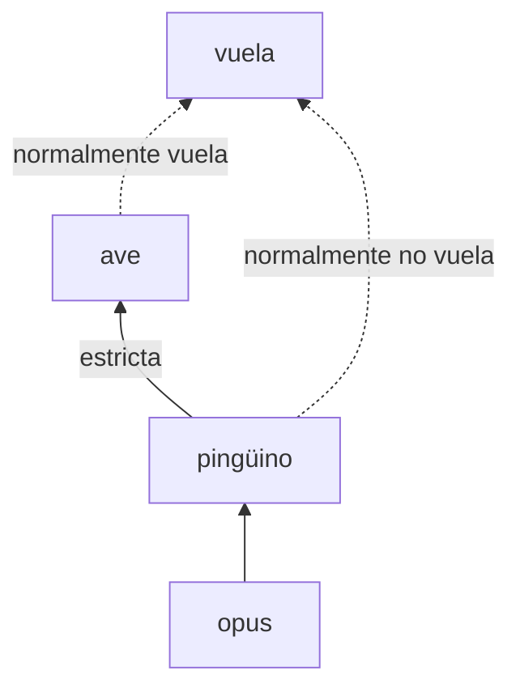

# Capítulo 65 — Proyecto: razonamiento rebatible

Muchas reglas que se usan para razonar tienen excepciones: las aves vuelan,
salvo los pingüinos; un alumno no puede cursar una materia sin aprobar sus
correlativas, salvo que el departamento lo autorice. Una regla así no dice
qué ocurre siempre, sino qué ocurre **normalmente**, y su conclusión se
retira cuando aparece información que muestra un caso excepcional. Ese
razonamiento es **no monotónico**: agregar información puede quitar
conclusiones, algo que nunca ocurre en la deducción de la
[sección 38.1](../capitulo-38-semantica-de-los-programas-logicos/index.md#381-modelos-y-consecuencia-logica).

Prolog ya razona de ese modo con `\+`, pero la negación como falla mezcla
dos cosas distintas: «se sabe que no» y «no se sabe». El **razonamiento
rebatible** las separa. Distingue las reglas **estrictas**, que no admiten
excepciones, de las **rebatibles**, que valen salvo que otra regla las
derrote; agrega una negación **fuerte**, que se puede concluir y no solo
suponer; y decide los conflictos entre reglas con un criterio explícito,
el más natural de los cuales es que la regla **más específica** prevalece.

El programa crece en seis versiones. La primera escribe un intérprete que
distingue las reglas estrictas de las rebatibles, y que cuando dos reglas
concluyen lo contrario no concluye nada. La segunda hace prevalecer la
regla más específica, o la que se declara superior. La tercera agrega los
**refutadores**, reglas que no permiten concluir nada y solo impiden que
otra se aplique, y las **presunciones**. La cuarta explica por qué se
obtuvo una conclusión y por qué no se obtuvo otra. La quinta aplica todo a
*Inscripciones*: las correlativas admiten excepciones. La sexta agrega la
**anticipación**: un rival que una regla superior refuta deja de derrotar.
Una última sección
compara las tres lecturas de una regla con excepciones que el curso ya
conoce o conoce desde aquí: la negación como falla, la semántica bien
fundada y la derivación rebatible. La página
[Cuatro ampliaciones del intérprete](ampliaciones.md) trata después lo que
las fuentes cubren y las versiones dejan afuera: las conclusiones
incompatibles, las consultas exhaustivas y la búsqueda de contradicciones
de d-Prolog, la persistencia en el tiempo con el problema del disparo de
Yale, y el programa pretendido de Flach, con el supuesto de mundo cerrado
y la compleción del programa entero.

El proyecto parte del capítulo «Defeasible Prolog» de *Prolog Programming
in Depth*, de Michael A. Covington, Donald Nute y André Vellino
([edición en PDF de los autores](https://www.covingtoninnovations.com/books/PPID.pdf)),
que presenta d-Prolog, el intérprete rebatible de Nute: de él toma las
cuatro clases de reglas, la negación fuerte, la distinción entre refutar y
socavar una regla, la superioridad y la especificidad, y la idea de
comparar dos reglas derivando el cuerpo de una a partir del cuerpo de la
otra. Los apartados 8.1, «Default reasoning», y 8.2, «The semantics of
incomplete information», de *Simply Logical* de Peter Flach
([edición en línea del autor](https://book.simply-logical.space/)) dan la
lectura de una excepción con `\+`, la no monotonía, el supuesto de mundo
cerrado y la compleción. La notación, el código y los ejemplos de *Inscripciones* son
propios del curso.

El capítulo reutiliza, sin copiarlos, los módulos `datos` y `reglas` de
*Inscripciones* del [capítulo 31](../capitulo-31-ejecutables-y-distribucion/index.md), el `experto.pl` con tablas del
[capítulo 39](../capitulo-39-tabulacion/index.md), y la técnica del intérprete vainilla del
[capítulo 33](../capitulo-33-introspeccion-y-metainterpretes/index.md), que examina la base con `clause/2`. Cumple dos anuncios: el
del [capítulo 38](../capitulo-38-semantica-de-los-programas-logicos/index.md), que trata aquí las reglas con excepciones como
razonamiento rebatible, y el del [capítulo 49](../capitulo-49-proyecto-diagnostico-abduccion/index.md), que continúa la
abducción con el razonamiento por defecto. Salvo el primero, los archivos
cargan módulos propios y se ejecutan en una instalación local, no en SWISH.

## Objetivos del capítulo

Al terminar el capítulo, el lector puede:

- reconocer una regla con excepciones y los límites de escribirla con `\+`:
  la falta de una negación que se concluya, y los conflictos que no
  terminan;
- escribir una base de conocimiento con hechos, reglas estrictas, reglas
  rebatibles, refutadores y presunciones, con la negación fuerte `neg`;
- explicar cuándo una regla refuta a otra, cuándo la socava, cuándo una
  regla es más específica que otra y cuándo un rival queda anticipado;
- extender el intérprete rebatible para que explique sus conclusiones y
  sus silencios;
- representar las excepciones de un sistema real, las correlativas de
  *Inscripciones*, y medir lo que cuestan;
- comparar la negación como falla, la semántica bien fundada y la
  derivación rebatible sobre los mismos casos;
- declarar conclusiones incompatibles, buscar las contradicciones de una
  base, razonar sobre la persistencia de los hechos en el tiempo, y
  construir el programa pretendido de uno con negaciones.

!!! info "Tiempo estimado"
    Leer el capítulo, ejecutar sus ejemplos y hacer las actividades: **1:35 h**.
    Resolver los 5 ejercicios marcados con ★: **1:20 h**.
    Resolver los 13 ejercicios del final: **4:15 h**.

## 65.1 El problema: excepciones con negación como falla


Un pingüino rey (*Aptenodytes patagonicus*) en la isla Gran Malvina. Los
pingüinos son aves y no vuelan: la excepción con que se ilustra, desde los
primeros trabajos sobre el razonamiento no monotónico, la regla «las aves
vuelan». Imagen: Ben Tubby,
[CC BY 2.0](https://creativecommons.org/licenses/by/2.0/deed.es), vía
[Wikimedia Commons](https://commons.wikimedia.org/wiki/File:Falkland_Islands_Penguins_49.jpg).

La forma más directa de escribir «las aves vuelan, salvo las anormales» es
la del [capítulo 10](../capitulo-10-negacion-como-falla/index.md): la regla pide que no se pueda probar la excepción, y
cada excepción es una cláusula del predicado que la describe. Flach
presenta así el ejemplo de Tweety, y observa que una regla más específica,
la de los avestruces en su ejemplo, cancela la regla general:

<!-- ejemplo: capitulo-65/negacion.pl predicado: vuela/1 anormal/1 no_vuela/1 -->
```prolog
%!  vuela(+X) is semidet.
%
%   X vuela: es un ave que no se puede probar anormal, o un murciélago del
%   que no se puede probar que no vuela. Con Drácula no termina.
vuela(X) :-
    ave(X),
    \+ anormal(X).
vuela(X) :-
    murcielago(X),
    \+ no_vuela(X).

%!  anormal(+X) is semidet.
%
%   X es un ave anormal para volar: un pingüino.
anormal(X) :-
    pinguino(X).

%!  no_vuela(+X) is semidet.
%
%   X no vuela: está muerto y no se puede probar que vuela.
no_vuela(X) :-
    muerto(X),
    \+ vuela(X).
```

```prolog
?- vuela(tweety).
true ;
false.

?- vuela(opus).
false.

?- vuela(nadie).
false.
```

Las respuestas son las esperadas, pero muestran el primer límite: `false.`
dice lo mismo de Opus, un pingüino del que se sabe que no vuela, que de
`nadie`, del que no se sabe nada. La negación como falla no permite
**concluir** que algo no ocurre; solo permite comprobar que no se puede
probar. El segundo límite es de mantenimiento: cada excepción nueva a la
regla de las aves es una cláusula más de `anormal/1`, y una excepción a la
excepción obliga a reescribir las dos.

El tercero aparece cuando dos reglas con excepciones se contradicen. La
segunda cláusula de `vuela/1` dice que los murciélagos vuelan salvo que se
pruebe que no; `no_vuela/1`, que los muertos no vuelan salvo que se pruebe
que sí. Drácula es las dos cosas, y cada regla espera a la otra:

```text
?- vuela(dracula).
ERROR: Stack limit (1.0Gb) exceeded
```

Es un ciclo a través de la negación, como el de la regla r13 de la
[sección 38.7](../capitulo-38-semantica-de-los-programas-logicos/index.md#387-las-reglas-del-sistema-experto): el programa no es estratificado, y la resolución SLDNF
no termina. Las tres cosas que faltan —una negación que se concluya,
reglas que se escriban sin enumerar sus excepciones y un criterio para los
conflictos— son las que agrega el razonamiento rebatible.

## 65.2 Versión 1: reglas estrictas y reglas rebatibles

Una base de conocimiento rebatible se escribe con cláusulas de Prolog más
dos operadores nuevos. Los hechos y las **reglas estrictas** son cláusulas
comunes: `ave(X) :- pinguino(X)` no tiene excepciones. Una **regla
rebatible** se escribe `Cabeza :~ Cuerpo` y se lee «si Cuerpo, normalmente
Cabeza». La **negación fuerte** `neg Atomo` se puede escribir en la cabeza
de cualquier regla: `neg vuela(X) :~ pinguino(X)` concluye que un pingüino
normalmente **no** vuela, algo que `\+` no puede expresar. Un átomo y su
negación fuerte son **contrarios**, y dos reglas con cabezas contrarias
compiten.

Covington escribe las reglas rebatibles con `:=`, y el curso no puede usar
ese símbolo: SWI-Prolog ya lo declara como operador (prioridad 800, `xfx`,
según `current_op(P, T, :=)`) con otro significado, el de definir funciones
sobre diccionarios, y la versión para navegadores lo usa para evaluar
JavaScript. El curso escribe `:~` para las reglas rebatibles, y `:^`, el
símbolo de d-Prolog, para los refutadores. El módulo
`rebatible.pl` declara los operadores, con los operadores propios de la
[sección 19.1](../capitulo-19-operadores-y-reglas-como-datos/index.md#191-operadores-propios), y los exporta a la base que lo carga. Las reglas
rebatibles son hechos del predicado `(:~)/2`: la base es un dato que el
intérprete examina, como en la [sección 19.3](../capitulo-19-operadores-y-reglas-como-datos/index.md#193-reglas-como-datos).

El intérprete tiene dos niveles. `estricto/2` usa solo los hechos y las
reglas estrictas; es el intérprete vainilla de la
[sección 33.2](../capitulo-33-introspeccion-y-metainterpretes/index.md#332-el-interprete-vainilla), con un argumento más, la **base** en que razona, que
la sección siguiente necesita. En la base entera, `raiz`, un literal se
deriva con las cláusulas del programa:

<!-- ejemplo: capitulo-65/rebatible.pl predicado: estricto/2 -->
```prolog
%!  estricto(+Base, +Meta) is nondet.
%
%   Meta se deriva de Base con las reglas estrictas. Base es raiz, la base
%   entera, o cuerpo(C), los literales de la conjunción C más las reglas
%   estrictas de la base, sin sus hechos. Un predicado importado de otro
%   módulo se llama en la raíz; en un cuerpo, solo vale como literal.
estricto(Base, (A, B)) :-
    !,
    estricto(Base, A),
    estricto(Base, B).
estricto(_, true) :-
    !.
estricto(_, Meta) :-
    predefinido(Meta),
    !,
    call(user:Meta).
estricto(raiz, Meta) :-
    externo(Meta),
    !,
    call(user:Meta).
estricto(raiz, Meta) :-
    propio(Meta),
    clause(user:Meta, Cuerpo),
    estricto(raiz, Cuerpo).
estricto(cuerpo(C), Meta) :-
    literal_de(Meta, C).
estricto(cuerpo(C), Meta) :-
    regla_estricta(Meta, Cuerpo),
    estricto(cuerpo(C), Cuerpo).
```

`derivable/3` es el razonamiento rebatible. Un literal se deriva en forma
rebatible si se deriva en forma estricta, o si es la cabeza de una regla,
estricta o rebatible, cuyo cuerpo se deriva y que no tiene **rival**:

<!-- ejemplo: capitulo-65/rebatible.pl predicado: derivable/3 -->
```prolog
%!  derivable(+Criterio:list, +Base, +Meta) is nondet.
%
%   Meta se deriva de Base: por las reglas estrictas, o por una regla
%   estricta o rebatible cuyo cuerpo se deriva y que no tiene rival.
derivable(Cr, Base, (A, B)) :-
    !,
    derivable(Cr, Base, A),
    derivable(Cr, Base, B).
derivable(_, _, true) :-
    !.
derivable(_, _, Meta) :-
    predefinido(Meta),
    !,
    call(user:Meta).
derivable(_, Base, Meta) :-
    estricto(Base, Meta).
derivable(Cr, Base, Meta) :-
    regla_estricta(Meta, Cuerpo),
    derivable(Cr, Base, Cuerpo),
    \+ rival(Cr, Base, (Meta :- Cuerpo), _).
derivable(Cr, Base, Meta) :-
    regla_rebatible(Base, Meta, Cuerpo),
    derivable(Cr, Base, Cuerpo),
    \+ rival(Cr, Base, (Meta :~ Cuerpo), _).
```

`rival/4` enumera lo que derrota a una regla. Las tres primeras cláusulas
**refutan**: la cabeza contraria se deriva en forma estricta, o la concluye
una regla estricta cuyo cuerpo se deriva, o la concluye una regla
rebatible cuyo cuerpo se deriva y a la que la regla no **supera**. La
cuarta cláusula es la de los refutadores, de la
[sección 65.4](#654-version-3-refutadores-y-presunciones):

<!-- ejemplo: capitulo-65/rebatible.pl predicado: rival/4 -->
```prolog
%!  rival(+Criterio:list, +Base, +Regla, -Rival) is nondet.
%
%   Rival derrota a Regla en Base. A cualquier regla la derrota su cabeza
%   contraria, si se deriva en forma estricta (Rival es estricto(Literal)),
%   o una regla estricta de cabeza contraria cuyo cuerpo se deriva. A una
%   regla rebatible la derrotan además una regla rebatible o un refutador
%   de cabeza contraria cuyo cuerpo se deriva, si Regla no los supera y
%   no están anticipados.
rival(_, Base, Regla, estricto(Contrario)) :-
    partes(Regla, Cabeza, _),
    contrario(Cabeza, Contrario),
    estricto(Base, Contrario).
rival(Cr, Base, Regla, (Contrario :- Cuerpo)) :-
    partes(Regla, Cabeza, _),
    contrario(Cabeza, Contrario),
    regla_estricta(Contrario, Cuerpo),
    derivable(Cr, Base, Cuerpo).
rival(Cr, Base, (Cabeza :~ Cuerpo), (Contrario :~ Cuerpo2)) :-
    contrario(Cabeza, Contrario),
    regla_rebatible(Base, Contrario, Cuerpo2),
    derivable(Cr, Base, Cuerpo2),
    \+ supera(Cr, (Cabeza :~ Cuerpo), (Contrario :~ Cuerpo2)),
    \+ anticipado(Cr, Base, (Contrario :~ Cuerpo2)).
rival(Cr, Base, (Cabeza :~ Cuerpo), (Contrario :^ Cuerpo2)) :-
    contrario(Cabeza, Contrario),
    user:(Contrario :^ Cuerpo2),
    derivable(Cr, Base, Cuerpo2),
    \+ supera(Cr, (Cabeza :~ Cuerpo), (Contrario :^ Cuerpo2)),
    \+ anticipado(Cr, Base, (Contrario :^ Cuerpo2)).
```

Una regla estricta solo cae ante un hecho o ante otra regla estricta: una
regla rebatible nunca la derrota. `respuesta/3` resume lo que la base dice
de un literal sin variables, con seis valores: una contradicción entre
hechos, `definitivamente_si` o `definitivamente_no` si decide la parte
estricta, `presumiblemente_si` o `presumiblemente_no` si deciden las
reglas rebatibles, y `sin_conclusion` si nada decide. El primer argumento
es el **criterio** con que se comparan las reglas; en esta versión es la
lista vacía: ninguna regla supera a otra.

La base de las aves empieza por el **triángulo de Tweety**, que Covington
dibuja como un grafo: una flecha llena es una regla estricta, una punteada
una regla rebatible, y la etiqueta dice si la regla concluye la propiedad o
su negación fuerte.



Las dos reglas rebatibles concluyen lo contrario sobre Opus, y el lado
del pingüino es el más específico: todo pingüino es un ave, y no a la
inversa. En código:

<!-- ejemplo: capitulo-65/aves.pl fragmento: % pinguino(X): X es un pingüino. .. neg vuela(X) :~ pinguino(X). -->
```prolog
% pinguino(X): X es un pingüino.
pinguino(opus).

%!  ave(?X) is nondet.
%
%   X es un ave: Tweety, o cualquier pingüino.
ave(tweety).
ave(X) :-
    pinguino(X).

% Las aves normalmente vuelan; los pingüinos normalmente no.
vuela(X) :~ ave(X).
neg vuela(X) :~ pinguino(X).
```

!!! question "Actividad"
    Predecir qué responde `respuesta([], vuela(opus), R)`: la regla de las
    aves y la de los pingüinos se aplican a Opus, y ninguna supera a la
    otra. Comprobarlo con `aves.pl`.

```prolog
?- respuesta([], vuela(tweety), R).
R = presumiblemente_si.

?- respuesta([], ave(opus), R).
R = definitivamente_si.

?- respuesta([], vuela(opus), R).
R = sin_conclusion.

?- rival([], raiz, (vuela(opus) :~ ave(opus)), Rival).
Rival = (neg vuela(opus):~pinguino(opus)) ;
false.
```

Tweety vuela, presumiblemente: nada se opone a la regla de las aves. Que
Opus es un ave es definitivo, porque lo deriva la parte estricta. Pero
sobre su vuelo la base no concluye nada: cada regla del triángulo derrota
a la otra. La respuesta es más cauta que la de `\+`, y distingue lo que no
se sabe de lo que se sabe que no; pero no es la esperada, porque la regla
de los pingüinos debería prevalecer.

## 65.3 Versión 2: la regla más específica

Todo pingüino es un ave, y no toda ave es un pingüino: una regla sobre los
pingüinos tiene en cuenta más información que una sobre las aves. Covington
lo define así: una regla es **más específica** que otra si el cuerpo de la
otra se deriva de su cuerpo, y no a la inversa. De `pinguino(opus)` se
deriva `ave(opus)`, por la regla estricta; de `ave(opus)` no se deriva
`pinguino(opus)`.

Para derivar un cuerpo de otro, la base cambia: en lugar de la base
entera, `cuerpo(C)` tiene como únicos hechos los literales de la
conjunción C, más las reglas de la base. Los hechos de la base se dejan de
lado a propósito: si se usara el hecho `empleado(juana)`, el empleo de
Juana se derivaría de cualquier cosa, también de ser estudiante. Tampoco
valen las presunciones, que son datos y no reglas. Es la razón del segundo
argumento de `estricto/2` y de `derivable/3`, y de las dos últimas
cláusulas de `estricto/2`.

`supera/3` recibe el criterio como una lista, y aplica los que contiene: la
especificidad, y las superioridades declaradas con hechos `superior/2`:

<!-- ejemplo: capitulo-65/rebatible.pl predicado: supera/3 -->
```prolog
%!  supera(+Criterio:list, +Regla1, +Regla2) is semidet.
%
%   Regla1 prevalece sobre Regla2 según Criterio: porque superior/2 lo
%   declara, o porque es más específica, es decir, el cuerpo de Regla2 se
%   deriva del de Regla1 y no a la inversa.
supera(Cr, R1, R2) :-
    memberchk(declarada, Cr),
    user:superior(R1, R2),
    !.
supera(Cr, R1, R2) :-
    memberchk(especificidad, Cr),
    partes(R1, _, C1),
    partes(R2, _, C2),
    derivable(Cr, cuerpo(C1), C2),
    !,
    \+ derivable(Cr, cuerpo(C2), C1).
```

!!! example "Patrón 64 — Superioridad como parámetro"
    **Problema.** Un intérprete de reglas con excepciones tiene que decidir
    qué regla prevalece cuando dos concluyen cosas contrarias, y hay más de
    un criterio razonable: ninguno, la regla más específica, una prioridad
    declarada, la anticipación de los rivales. Cada base, y a veces cada
    consulta, necesita otro, y conviene comparar lo que decide cada uno.

    **Versión ingenua.** Fijar el criterio dentro del intérprete, o
    escribir las excepciones dentro de las reglas con `\+`, como en la
    [sección 65.1](#651-el-problema-excepciones-con-negacion-como-falla): cambiar de criterio obliga a reescribir el intérprete
    o la base, y comparar dos criterios sobre la misma base obliga a
    mantener dos copias.

    **Patrón.** El criterio es un argumento del intérprete, una lista de
    fuentes de superioridad, y un solo predicado, `supera/3`, lo consulta.
    La base no cambia: la misma consulta con `[]`, `[especificidad]` o
    `[declarada, especificidad]` muestra qué decide cada criterio, y un
    criterio nuevo, como la anticipación de la
    [sección 65.7](#657-version-6-la-anticipacion-de-los-rivales), es un elemento más de la lista. Es un caso del
    [Patrón 60](../patrones.md#60-interprete-con-conducta-como-parametro): allí el argumento es la conducta de cada pieza; aquí, la
    política que resuelve los conflictos entre las piezas.

    **Cuándo no usarlo.** Cuando las reglas no compiten nunca, o cuando un
    solo criterio vale para todo el sistema y no hace falta compararlo con
    otros: una prioridad fija, como el orden de las reglas de un sistema de
    producción, es más simple. Y cuando la superioridad depende de los
    datos, no del razonamiento: entonces es parte de la base, con hechos
    `superior/2`, y el parámetro solo dice si se los usa.

La base de las aves sigue con un **diamante**, en el que dos reglas
compiten y ninguna es más específica, y con una cadena de reglas
rebatibles que Covington usa para mostrar que la especificidad se deriva
con reglas que no pueden estar derrotadas:

<!-- ejemplo: capitulo-65/aves.pl fragmento: % murcielago(X): X es un murciélago. .. neg se_mantiene(X) :~ estudiante(X). -->
```prolog
% murcielago(X): X es un murciélago.
murcielago(rufo).
murcielago(dracula).

% muerto(X): X está muerto.
muerto(dracula).

%!  mamifero(?X) is nondet.
%
%   X es un mamífero: todo murciélago lo es.
mamifero(X) :-
    murcielago(X).

% Los mamíferos normalmente no vuelan; los murciélagos normalmente sí; los
% muertos normalmente no. Entre las dos últimas reglas, prevalece la de
% los muertos.
neg vuela(X) :~ mamifero(X).
vuela(X) :~ murcielago(X).
neg vuela(X) :~ muerto(X).
superior((neg vuela(X) :~ muerto(X)), (vuela(X) :~ murcielago(X))).

% estudiante(X): X es estudiante universitario.
estudiante(juana).

% empleado(X): X tiene un empleo.
empleado(juana).

% Los estudiantes normalmente son adultos y normalmente no tienen empleo;
% los adultos normalmente lo tienen. Quien tiene empleo normalmente se
% mantiene solo; un estudiante, normalmente no.
adulto(X) :~ estudiante(X).
neg empleado(X) :~ estudiante(X).
empleado(X) :~ adulto(X).
se_mantiene(X) :~ empleado(X).
neg se_mantiene(X) :~ estudiante(X).
```

Con la especificidad, la regla de los pingüinos prevalece, y Opus no vuela.
Rufo, un murciélago, vuela: la regla de los murciélagos es más específica
que la de los mamíferos, porque todo murciélago es un mamífero. Flach
necesita una regla que cancele explícitamente la de los mamíferos para
obtener lo mismo; aquí lo decide la especificidad. Con Drácula, que además
está muerto, la regla de los murciélagos y la de los muertos no se pueden
comparar, y solo la superioridad declarada decide:

```prolog
?- respuesta([especificidad], vuela(opus), R).
R = presumiblemente_no.

?- derivable([especificidad], vuela(X)).
X = tweety ;
X = rufo ;
false.

?- respuesta([especificidad], vuela(dracula), R).
R = sin_conclusion.

?- respuesta([declarada, especificidad], vuela(dracula), R).
R = presumiblemente_no.

?- respuesta([especificidad], se_mantiene(juana), R).
R = sin_conclusion.
```

La respuesta sobre Juana es la más sutil. Un estudiante normalmente es
adulto, y un adulto normalmente tiene empleo: parecería que la regla de
los estudiantes es más específica que la de los empleados, porque del
cuerpo de la primera se llega al de la segunda. Pero en la base
`cuerpo(estudiante(juana))` el paso de adulto a empleado está derrotado por
la regla «los estudiantes normalmente no tienen empleo», que es más
específica que la de los adultos. El empleo no se deriva del estudio,
ninguna regla es más específica, y la base no concluye nada. El ejercicio 3
quita ese eslabón y muestra la diferencia.

## 65.4 Versión 3: refutadores y presunciones

Covington distingue dos maneras de derrotar una regla. **Refutarla** es
concluir lo contrario: la regla de los pingüinos refuta la de las aves.
**Socavarla** es mostrar que en este caso podría no aplicarse, sin
concluir nada: «un ave enferma podría no volar» no permite concluir que
un ave enferma no vuela, pero impide concluir que vuela. Un **refutador**
se escribe `Cabeza :^ Cuerpo`, y solo aparece en la cuarta cláusula de
`rival/4`: nunca se usa para derivar su cabeza. Una **presunción** es una
regla rebatible de cuerpo `true`: `vuela(superman) :~ true` dice que
Superman vuela salvo que algo se oponga. `refutadores.pl` es la base de la
tercera versión:

<!-- ejemplo: capitulo-65/refutadores.pl fragmento: % Las aves normalmente vuelan; los pingüinos normalmente no; Superman, .. vuela(X) :^ pinguino_alterado(X). -->
```prolog
% Las aves normalmente vuelan; los pingüinos normalmente no; Superman,
% presumiblemente, sí.
vuela(X) :~ ave(X).
neg vuela(X) :~ pinguino(X).
vuela(superman) :~ true.

% Mundo cerrado para anillada/1: ningún ave está anillada, salvo que el
% registro lo diga.
neg anillada(_Ave) :~ true.

% Las piezas de todo automóvil presumiblemente están bien.
bien(_Auto, _Pieza) :~ true.

% Un ave enferma podría no volar; un pingüino alterado podría volar.
neg vuela(X) :^ ave(X), enferma(X).
vuela(X) :^ pinguino_alterado(X).
```

```prolog
?- respuesta([especificidad], vuela(coco), R).
R = sin_conclusion.

?- respuesta([especificidad], vuela(superman), R).
R = presumiblemente_si.

?- respuesta([especificidad], vuela(folio), R).
R = sin_conclusion.
```

Coco es un ave enferma: el refutador socava la regla de las aves, y la base
no concluye nada sobre su vuelo. Superman también está enfermo, pero el
refutador exige un ave, y la presunción queda en pie. Folio, un pingüino
alterado, muestra que una regla socavada todavía derrota: el refutador
impide aplicar la regla de los pingüinos, pero esa regla sigue refutando
la de las aves, porque es más específica. Sin ninguna de las dos, no hay
conclusión. Covington discute una variante, la **anticipación** de los
rivales, en la que un rival refutado por una regla superior deja de
derrotar; la [sección 65.7](#657-version-6-la-anticipacion-de-los-rivales) la agrega como un criterio más. Con Folio no
cambia nada: la regla de los pingüinos está socavada, no refutada por una
regla superior.

Una presunción negativa es el **supuesto de mundo cerrado** de la
[sección 10.1](../capitulo-10-negacion-como-falla/index.md#101-el-supuesto-de-mundo-cerrado), para un solo predicado. `neg anillada(_Ave) :~ true`
dice que un ave no está anillada salvo que el registro lo diga, y lo que
el registro dice es un hecho, que la derrota. Covington lo propone para
elegir, predicado por predicado, qué información se supone completa:

```prolog
?- respuesta([especificidad], anillada(tweety), R).
R = definitivamente_si.

?- respuesta([especificidad], anillada(opus), R).
R = presumiblemente_no.

?- respuesta([especificidad], arranca(auto1), R).
R = presumiblemente_si.

?- respuesta([especificidad], arranca(auto2), R).
R = definitivamente_no.

?- respuesta([especificidad], bien(auto2, bateria), R).
R = presumiblemente_si.
```

Las presunciones sobre las piezas de un automóvil predicen que arranca.
Del segundo se observó lo contrario, un hecho `neg arranca(auto2)`, que
refuta la regla estricta; pero cada presunción sobre sus piezas sigue en
pie, porque nada se opone a ninguna en particular. La base contiene el
daño, pero no dice cuál de las presunciones falla. Esa pregunta es la de
la abducción del [capítulo 49](../capitulo-49-proyecto-diagnostico-abduccion/index.md).

## 65.5 Versión 4: por qué sí y por qué no

`respuesta/3` dice qué se concluye, no por qué. La página
[Por qué sí y por qué no](explicaciones.md#por-que-si-y-por-que-no) agrega al intérprete
un argumento con el árbol de la derivación, como los árboles de prueba del
[capítulo 33](../capitulo-33-introspeccion-y-metainterpretes/index.md); junta con `supuestos/2` las reglas rebatibles y las presunciones
que una conclusión da por supuestas; y responde con `por_que_no/3` qué
rivales derrotaron cada regla de una meta. Sobre el automóvil que no
arranca, las dos preguntas dan los candidatos que la abducción del
[capítulo 49](../capitulo-49-proyecto-diagnostico-abduccion/index.md) examina: el razonamiento por defecto va de las presunciones a
las predicciones, y la abducción, de las predicciones fallidas a las
presunciones que hay que retirar.

## 65.6 Versión 5: excepciones en las correlativas

*Inscripciones* rechaza una inscripción si falta una correlativa: es el
primer motivo que encuentra `inscripcion_posible/3`, de la
[sección 15.10](../capitulo-15-control/index.md#1510-el-proyecto-las-validaciones-de-una-inscripcion), que el [capítulo 31](../capitulo-31-ejecutables-y-distribucion/index.md) conserva en el módulo `reglas`.
Una facultad real admite excepciones: quien está cursando la correlativa
puede inscribirse de manera condicional, y el departamento puede autorizar
a un alumno a cursar sin un requisito. Y las excepciones tienen a su vez
excepciones: quien cursa de nuevo una materia que desaprobó podría no
estar en condiciones. `correlativas.pl` carga los dos módulos sin cambiarlos
y decide cada requisito con reglas rebatibles:

<!-- ejemplo: capitulo-65/correlativas.pl fragmento: autorizacion(105, am2, alg). .. neg cumple(L, M, R) :^ correlativa(M, R), cursa(L, R), desaprobada(L, R). -->
```prolog
autorizacion(105, am2, alg).

%!  cumple(?Legajo:integer, ?Materia:atom, ?Requisito:atom) is nondet.
%
%   El alumno Legajo cumple el Requisito de Materia en forma estricta:
%   lo aprobó.
cumple(Legajo, Materia, Requisito) :-
    correlativa(Materia, Requisito),
    aprobada(Legajo, Requisito, _).

%!  desaprobada(?Legajo:integer, ?Materia:atom) is nondet.
%
%   El alumno Legajo tiene una nota menor que la mínima en Materia.
desaprobada(Legajo, Materia) :-
    inscripcion(Legajo, Materia, nota(Nota)),
    nota_minima(Minima),
    Nota < Minima.

% Un requisito no aprobado normalmente no se cumple; sí, si el alumno lo
% está cursando o si está autorizado.
neg cumple(_L, M, R) :~ correlativa(M, R).
cumple(L, M, R) :~ correlativa(M, R), cursa(L, R).
cumple(L, M, R) :~ correlativa(M, R), autorizacion(L, M, R).

% Quien cursa de nuevo un requisito que desaprobó podría no cumplirlo.
neg cumple(L, M, R) :^ correlativa(M, R), cursa(L, R), desaprobada(L, R).
```

`correlativa/2`, `cursa/2` y `aprobada/3` vienen de los módulos del
[capítulo 31](../capitulo-31-ejecutables-y-distribucion/index.md). El intérprete llama a un predicado importado en la base
entera, y en una base `cuerpo(C)` lo acepta solo como uno de los literales
de C: si lo llamara, la especificidad dependería de los datos de un alumno
y no de las reglas. La regla de quien cursa es más específica que la
general, y lo mismo la de la autorización; el refutador es más específico
que la regla de quien cursa, y la socava.

La decisión sobre cada requisito es rebatible; la decisión sobre la
inscripción, en cambio, junta las respuestas de todos los requisitos, y
esa parte procedural queda en Prolog común, como aconseja Covington:

<!-- ejemplo: capitulo-65/correlativas.pl predicado: inscripcion_rebatible/3 por_requisitos/3 -->
```prolog
%!  inscripcion_rebatible(+Legajo:integer, +Materia:atom, -Resultado) is det.
%
%   Resultado es el de inscripcion_posible/3, salvo cuando esta rechaza
%   por una correlativa: entonces es rechazada(falta(R)) con el primer
%   requisito que presumiblemente no se cumple, a_revisar(R) con el primero
%   del que las reglas no concluyen nada, rechazada(sin_vacantes), o
%   condicional(Rs), con los requisitos que se dan por cumplidos por una
%   excepción.
inscripcion_rebatible(Legajo, Materia, Resultado) :-
    inscripcion_posible(Legajo, Materia, Resultado0),
    (   Resultado0 = rechazada(falta(_))
    ->  por_requisitos(Legajo, Materia, Resultado)
    ;   Resultado = Resultado0
    ).

%!  por_requisitos(+Legajo:integer, +Materia:atom, -Resultado) is det.
%
%   Resultado decide la inscripción del alumno Legajo en Materia por la
%   respuesta de las reglas sobre cada correlativa.
por_requisitos(Legajo, Materia, Resultado) :-
    findall(R-V,
            ( correlativa(Materia, R),
              respuesta([especificidad], cumple(Legajo, Materia, R), V) ),
            Vs),
    (   member(R-presumiblemente_no, Vs)
    ->  Resultado = rechazada(falta(R))
    ;   member(R-sin_conclusion, Vs)
    ->  Resultado = a_revisar(R)
    ;   vacantes(Materia, 0)
    ->  Resultado = rechazada(sin_vacantes)
    ;   findall(R, member(R-presumiblemente_si, Vs), Rs),
        Resultado = condicional(Rs)
    ).
```

!!! question "Actividad"
    Elena, legajo 105, cursa Análisis I, no aprobó Álgebra y tiene una
    autorización para cursar Análisis II sin ella. Predecir la respuesta
    de `inscripcion_posible(105, am2, R)` y la de
    `inscripcion_rebatible(105, am2, R)`, y comprobarlas.

```prolog
?- respuesta([especificidad], cumple(102, am2, am1), R).
R = presumiblemente_no.

?- inscripcion_posible(105, am2, R).
R = rechazada(falta(am1)).

?- inscripcion_rebatible(105, am2, R).
R = condicional([am1, alg]).

?- inscripcion_posible(101, bd, R).
R = rechazada(falta(pp)).

?- inscripcion_rebatible(101, bd, R).
R = rechazada(falta(ssl)).
```

De las 49 combinaciones de un alumno y una materia, solo esas dos cambian.
Ana, legajo 101, está cursando Paradigmas, y la excepción la cubre; el
rechazo pasa al requisito que de verdad falta, Sintaxis. La no monotonía
se ve con una operación del [capítulo 31](../capitulo-31-ejecutables-y-distribucion/index.md): Bruno, legajo 102, desaprobó
Álgebra y se inscribe de nuevo en ella.

```prolog
?- costo(posible, P), costo(rebatible, R).
P = 1275,
R = 40656.

?- inscripcion_rebatible(102, ssl, R0), inscribir(102, alg, R1), inscripcion_rebatible(102, ssl, R).
R0 = rechazada(falta(alg)),
R1 = aceptada,
R = a_revisar(alg).
```

Antes de inscribirse, Bruno no cumplía Álgebra para cursar Sintaxis.
Después, la regla de quien cursa lo favorece, pero el refutador de quien
cursa de nuevo una materia desaprobada la socava; ninguna regla decide, y
la inscripción queda para que la decida una persona. Un dato nuevo no
agregó una conclusión: quitó una. `costo/2` mide las inferencias de
decidir las 49 combinaciones con cada versión, en una sesión recién
iniciada: la rebatible cuesta unas 32 veces más, y todo ese costo está en
las 21 combinaciones que el [capítulo 31](../capitulo-31-ejecutables-y-distribucion/index.md) rechaza por una correlativa,
donde cada requisito se decide comparando reglas. Las cifras cambian un
poco si antes se ejecutaron otras consultas, que ya cargaron las
bibliotecas; la proporción, no.

## 65.7 Versión 6: la anticipación de los rivales

Sin anticipación, una regla derrota a otra aunque ella misma esté
refutada por una regla superior. La página
[La anticipación de los rivales](anticipacion.md#la-anticipacion-de-los-rivales)
agrega a `rival/4` el criterio `anticipacion` de d-Prolog: un rival
rebatible o un refutador deja de contar si una regla que lo supera lo
refuta. Con dos cadenas de reglas sobre el pago de la matrícula, una
alumna de intercambio y becaria pasa de no tener conclusión a no pagar,
presumiblemente, a cambio de un 50 % más de inferencias; las respuestas de
las versiones anteriores no cambian.

## 65.8 Tres lecturas de una regla con excepciones

El curso tiene ahora tres maneras de leer una regla con excepciones: la
negación como falla, la semántica bien fundada de los capítulos
[38](../capitulo-38-semantica-de-los-programas-logicos/index.md) y [39](../capitulo-39-tabulacion/index.md), y la derivación rebatible. La página
[Tres lecturas de una regla con excepciones](comparacion.md#tres-lecturas-de-una-regla-con-excepciones)
las aplica al diamante de Drácula y al ave de la regla r13 de la
[sección 38.7](../capitulo-38-semantica-de-los-programas-logicos/index.md#387-las-reglas-del-sistema-experto), y resume en una tabla dónde coinciden y dónde difieren: el
mundo cerrado para todos los predicados o solo para algunos, la negación
que se supone o que se concluye, y el conflicto que queda indefinido o que
un criterio de superioridad decide.

!!! success "Criterios de calidad"
    | Criterio | En este capítulo |
    |---|---|
    | C1 | cada predicado declara modos y determinación; `derivable/2` es `nondet`, y `respuesta/3`, que resume la búsqueda con `->`, es `det` y exige una meta sin variables |
    | C2 | la base es de datos: hechos, cláusulas y términos `:~` y `:^` que el intérprete examina; los datos de *Inscripciones* son los del [capítulo 31](../capitulo-31-ejecutables-y-distribucion/index.md), cargados sin cambios, y el `experto.pl` del [capítulo 39](../capitulo-39-tabulacion/index.md) también |
    | C5 | `derivable/2`, `derivacion/3` y `por_que_no/3` validan el criterio y la meta con `must_be/2`: un criterio desconocido produce un error de tipo, no una respuesta vacía |
    | C6 | el intérprete no cambia de la versión 1 a la 3: la especificidad y la superioridad son un argumento, los refutadores, una cláusula de `rival/4` que una base sin refutadores no usa, y la anticipación, un elemento más del criterio; las explicaciones son un módulo aparte |
    | C7 | 158 pruebas en veinte archivos; `derivacion/3` se compara con `derivable/2`, e `inscripcion_rebatible/3` con `inscripcion_posible/3` en las 49 combinaciones, donde solo dos difieren |

## Ejercicios

Las soluciones están en [la página de soluciones](soluciones.md). La dificultad
va de 1 (se resuelve consultando el capítulo) a 3 (requiere elaboración propia).
Los marcados con ★ son los que no conviene saltear: cubren lo que el capítulo
tiene de propio.

1. ★ **(1)** Predecir, con `aves.pl` cargado, qué responde cada consulta,
   y comprobarlo: `respuesta([], vuela(rufo), R).` ·
   `respuesta([declarada], vuela(rufo), R).` ·
   `respuesta([declarada], vuela(dracula), R).` ·
   `respuesta([especificidad], adulto(juana), R).`
2. ★ **(2)** Hans habla el dialecto de Pensilvania, que es un dialecto del
   alemán. Quien habla el dialecto de Pensilvania normalmente nació en
   Pensilvania; quien nació en Pensilvania nació en los Estados Unidos; y
   quien habla un dialecto del alemán normalmente no nació en los Estados
   Unidos. Escribir la base, distinguiendo las reglas estrictas de las
   rebatibles, predecir si Hans nació en los Estados Unidos, y explicar por
   qué una regla estricta con un cuerpo solo presumible derrota a una
   rebatible con un cuerpo definitivo.
3. **(2)** Quitar de una copia de la base de Juana la regla «los
   estudiantes normalmente no tienen empleo», y predecir qué responde la
   base sobre si Juana se mantiene sola. Explicar qué cambió en la
   comparación de las dos reglas.
4. **(2)** Escribir el encabezado de PlDoc, con modos y determinación, y
   el código de `excepciones(Legajo, Materia, Rs)`: los requisitos de
   Materia que el alumno Legajo cumple solo por una excepción. Justificar
   el modo de cada argumento.
5. **(2)** En una base con individuos, agregar la regla estricta
   contrapuesta de «los pingüinos no vuelan», `neg pinguino(X) :- vuela(X)`.
   Predecir qué responde la base sobre un ave que nada y vuela, y sobre una
   que solo nada, y explicar el resultado de la segunda con la
   observación de Covington sobre los ciclos entre reglas.
6. ★ **(2)** Continuar el automóvil de la [sección 65.5](#655-version-4-por-que-si-y-por-que-no) con la abducción del
   [capítulo 49](../capitulo-49-proyecto-diagnostico-abduccion/index.md): escribir `sospechosas(Auto, Piezas)`, las piezas cuyas
   presunciones sostienen una predicción que una observación refutó.
   Agregar la observación de que las luces del segundo automóvil encienden,
   y una regla estricta que de ella derive que la batería está bien, y
   mostrar cómo se reducen las sospechosas.
7. **(2)** Escribir `escribir_derivacion(Arbol)`, que escribe un árbol de
   `derivacion/3` con una línea por nodo, sangrada según su profundidad, y
   que dice de cada literal si se concluyó en forma estricta o con qué
   regla.
8. **(3)** Una cadena de N clases, cada una incluida en la anterior, en la
   que cada clase tiene normalmente la propiedad contraria a la de la
   anterior, como el nautilo desnudo de Covington. Generar la base con
   `assertz/1` para N de 2 a 8, medir las inferencias de la respuesta sobre
   un individuo de la última clase, y explicar cómo crecen.
9. ★ **(2)** Escribir con `tnot/1` el diamante de Drácula con la superioridad
   de la regla de los muertos, y comparar el resultado y el programa con
   los de la [sección 65.8](#658-tres-lecturas-de-una-regla-con-excepciones). ¿Qué propiedad del programa cambia?
10. **(3)** Escribir el intérprete de Flach para el razonamiento por
    defecto: una meta se explica con reglas y con supuestos por defecto, y
    un supuesto se agrega a la explicación solo si su conclusión no
    contradice lo que las reglas derivan con la explicación. Aplicarlo a
    Drácula, y comparar sus explicaciones con las respuestas de la
    [sección 65.3](#653-version-2-la-regla-mas-especifica).
11. ★ **(2)** Agregar a *Inscripciones* una autorización para Bruno, legajo
    102, para cursar Sintaxis sin Álgebra, y una versión de
    `inscripcion_rebatible/3` que reciba el criterio. Declarar que la regla
    de la autorización prevalece sobre el refutador, y mostrar la decisión
    antes y después de que Bruno se inscriba de nuevo en Álgebra, con los
    dos criterios.
12. **(2)** Agregar al disparo de Yale de la
    [sección 65.11](ampliaciones.md#6511-la-persistencia-el-disparo-de-yale)
    un evento `descarga`, después del cual el arma normalmente no está
    cargada, y mostrar la historia de los eventos `descarga`, `espera` y
    `disparo` con la especificidad. Explicar por qué la especificidad no
    decide entre la regla de la descarga y la persistencia, resolver el
    conflicto con la superioridad declarada, y explicar qué regla falta
    para que el arma siga descargada después de la espera.
13. **(2)** Escribir `completo(Nombre, Modelo)`, que tiene éxito si la
    compleción del programa Nombre de la
    [sección 65.12](ampliaciones.md#6512-el-programa-pretendido) tiene un
    único modelo. Aplicarlo al programa de Flach en que Pedro es amistoso
    si no lo es, a `p :- p`, y a `antepasado/2` sobre dos hechos de
    `progenitor/2`, y explicar cada resultado.

## Resumen

| | |
|---|---|
| **regla rebatible** | `Cabeza :~ Cuerpo`: si Cuerpo, normalmente Cabeza; otra regla puede derrotarla |
| **regla estricta** | una cláusula común: no admite excepciones, y solo la derrota otra regla estricta o un hecho |
| **presunción** | una regla rebatible de cuerpo `true` |
| **refutador** | `Cabeza :^ Cuerpo`: no concluye su cabeza, solo impide aplicar una regla rebatible de cabeza contraria |
| **negación fuerte** | `neg Atomo`: se concluye con reglas, a diferencia de `\+`, que solo comprueba que no se puede probar |
| **refutar, socavar** | derrotar una regla concluyendo lo contrario, o mostrando que podría no aplicarse |
| **especificidad** | una regla es más específica si el cuerpo de la otra se deriva del suyo y no a la inversa, sin usar los hechos |
| **anticipación** | un rival rebatible o un refutador deja de derrotar si una regla que lo supera lo refuta |
| **[Patrón 64](../patrones.md#64-superioridad-como-parametro)** | superioridad como parámetro |
| **no monotonía** | agregar información puede quitar conclusiones |
| `estricto/1`, `derivable/2`, `respuesta/3` | la derivación estricta, la rebatible y su resumen en seis valores |
| `rival/4`, `supera/3` | lo que derrota a una regla, y el criterio de superioridad |
| `derivacion/3`, `supuestos/2`, `por_que_no/3` | el árbol de una derivación, lo que da por supuesto, y lo que derrotó a cada regla |
| `inscripcion_rebatible/3` | la inscripción de *Inscripciones* con excepciones en las correlativas |
| **conclusiones incompatibles** | dos literales que se excluyen sin ser uno la negación del otro: `incompatible/2`; con el complemento, los **contrarios** |
| **contradicción** | un literal y un contrario derivados los dos en forma estricta: algún hecho o regla de la base es falso |
| **persistencia** | lo que vale en una situación normalmente sigue valiendo después de un evento: el único axioma de marco |
| **programa pretendido** | un programa completo, con un solo modelo, que se obtiene del original con el supuesto de mundo cerrado o con la compleción |
| `respuestas/3`, `contradicciones/1` | la consulta exhaustiva sobre cada instancia con evidencia, y las contradicciones de la base |
| `cwa/2`, `completar/2`, `modelos/2` | los átomos que el supuesto de mundo cerrado niega, la compleción del programa entero, y sus modelos |

## Temas que se retoman

| Tema | Se retoma en |
|---|---|
| La fuerza de una conclusión en grados, en lugar de definitiva o presumible | [capítulo 66](../capitulo-66-proyecto-evidencia-arboles-decision/index.md) |

## Referencias

- Michael A. Covington, Donald Nute y André Vellino, *Prolog Programming
  in Depth*, Prentice Hall, 1997 — capítulo «Defeasible Prolog».
  [Edición en PDF de los autores](https://www.covingtoninnovations.com/books/PPID.pdf).
  El capítulo toma las cuatro clases de reglas (estrictas, rebatibles,
  presunciones y refutadores), la negación fuerte, la diferencia entre
  refutar y socavar, la superioridad declarada, la especificidad calculada
  derivando el cuerpo de una regla desde el de otra sin usar los hechos,
  los ejemplos del triángulo de Tweety, del estudiante empleado y del
  pingüino alterado, la presunción negativa como supuesto de mundo cerrado,
  la advertencia de que la parte procedural queda en Prolog común, la
  anticipación de los rivales («Preemption of Defeaters»), que el capítulo
  agrega como un criterio más, y los tres casos de la explicación de un
  fracaso del predicado `whynot/1` («A Special Explanatory Facility»).
  La [página de ampliaciones](ampliaciones.md) toma además las
  conclusiones incompatibles y el ciclo de Ping (apartado 11.4,
  `incompatible/2`), la consulta exhaustiva `@@`, el diccionario y la
  búsqueda de contradicciones (apartados 11.11 a 11.16), y la persistencia
  temporal con su versión del disparo de Yale (apartado 11.21). Covington escribe las reglas
  rebatibles con `:=`, que en SWI-Prolog ya es un operador con otro
  significado (las funciones sobre diccionarios); el curso escribe `:~`.
- Peter Flach, *Simply Logical: Intelligent Reasoning by Example*, John
  Wiley & Sons, 1994 — apartados 8.1, «Default reasoning», y 8.2, «The
  semantics of incomplete information».
  [Edición en línea](https://book.simply-logical.space/src/text/3_part_iii/8.1.html).
  El capítulo toma la regla con excepciones escrita con la negación como
  falla, la no monotonía, el ejemplo de Drácula, la idea de un intérprete
  que agrega supuestos por defecto cuando no contradicen las reglas, con
  los supuestos nombrados que una regla puede cancelar, y el supuesto de
  mundo cerrado; la página de ampliaciones toma del apartado 8.2 el
  programa pretendido, el supuesto de mundo cerrado como transformación,
  la compleción del programa entero y sus ejemplos (los alumnos de Pedro,
  Tweety, el sabio y el docente), sin el código del apéndice B.2.
- Donald Nute, «Basic Defeasible Logic», en L. Fariñas del Cerro y
  M. Penttonen (eds.), *Intensional Logics for Programming*, Oxford
  University Press, 1992, págs. 125–154,
  [DOI 10.1093/oso/9780198537755.003.0005](https://doi.org/10.1093/oso/9780198537755.003.0005);
  y «A Decidable Quantified Defeasible Logic», en D. Prawitz, B. Skyrms y
  D. Westerståhl (eds.), *Logic, Methodology and Philosophy of Science IX*,
  Elsevier, 1994, págs. 263–284. Son la teoría sobre la que Covington
  construye d-Prolog: reglas estrictas, rebatibles y refutadores, y la
  superioridad entre reglas rivales.
- David Poole, «A Logical Framework for Default Reasoning», *Artificial
  Intelligence* 36 (1), 1988, págs. 27–47.
  [DOI 10.1016/0004-3702(88)90077-X](https://doi.org/10.1016/0004-3702(88)90077-X).
  Flach atribuye a este artículo la distinción entre reglas y supuestos
  por defecto que el ejercicio 10 implementa.
- Raymond Reiter, «On Closed World Data Bases», en H. Gallaire y J. Minker
  (eds.), *Logic and Data Bases*, Plenum Press, 1978, págs. 55–76.
  [DOI 10.1007/978-1-4684-3384-5_3](https://doi.org/10.1007/978-1-4684-3384-5_3).
  La formulación del supuesto de mundo cerrado, que Flach cita y que el
  capítulo escribe como una presunción negativa.
- Keith L. Clark, «Negation as Failure», en H. Gallaire y J. Minker
  (eds.), *Logic and Data Bases*, Plenum Press, 1978, págs. 293–322.
  [DOI 10.1007/978-1-4684-3384-5_11](https://doi.org/10.1007/978-1-4684-3384-5_11).
  La compleción de un programa, que la
  [sección 65.12](ampliaciones.md#6512-el-programa-pretendido) aplica al
  programa entero con el `complecion_de/3` del
  [capítulo 38](../capitulo-38-semantica-de-los-programas-logicos/index.md).
- John McCarthy y Patrick J. Hayes, «Some Philosophical Problems from the
  Standpoint of Artificial Intelligence», en B. Meltzer y D. Michie
  (eds.), *Machine Intelligence 4*, Edinburgh University Press, 1969,
  págs. 463–502.
  [Versión en el sitio de McCarthy](http://jmc.stanford.edu/articles/mcchay69.html).
  El cálculo de situaciones y el problema del marco, que Covington cita.
- Drew McDermott, «We've Been Framed: Or, Why AI Is Innocent of the Frame
  Problem», en Z. Pylyshyn (ed.), *The Robot's Dilemma: The Frame Problem
  in Artificial Intelligence*, Ablex, 1987, págs. 113–122. La regla de
  persistencia como único axioma de marco, según Covington.
- Steve Hanks y Drew McDermott, «Nonmonotonic Logic and Temporal
  Projection», *Artificial Intelligence* 33 (3), 1987, págs. 379–412.
  [DOI 10.1016/0004-3702(87)90043-9](https://doi.org/10.1016/0004-3702(87)90043-9).
  El problema del disparo de Yale, que la
  [sección 65.11](ampliaciones.md#6511-la-persistencia-el-disparo-de-yale)
  resuelve en la versión de Covington.

El código del capítulo es propio, escrito para el curso: de Covington se
toman el diseño de d-Prolog y sus ejemplos, no su código, con otra
notación (`:~` en lugar de `:=`); de Flach, ideas y ejemplos. Las
excepciones de *Inscripciones*, las explicaciones y la comparación con la
semántica bien fundada son del curso, como las utilidades, el disparo de
Yale y la compleción de la página de ampliaciones, escritos a partir de
las descripciones de las fuentes.
