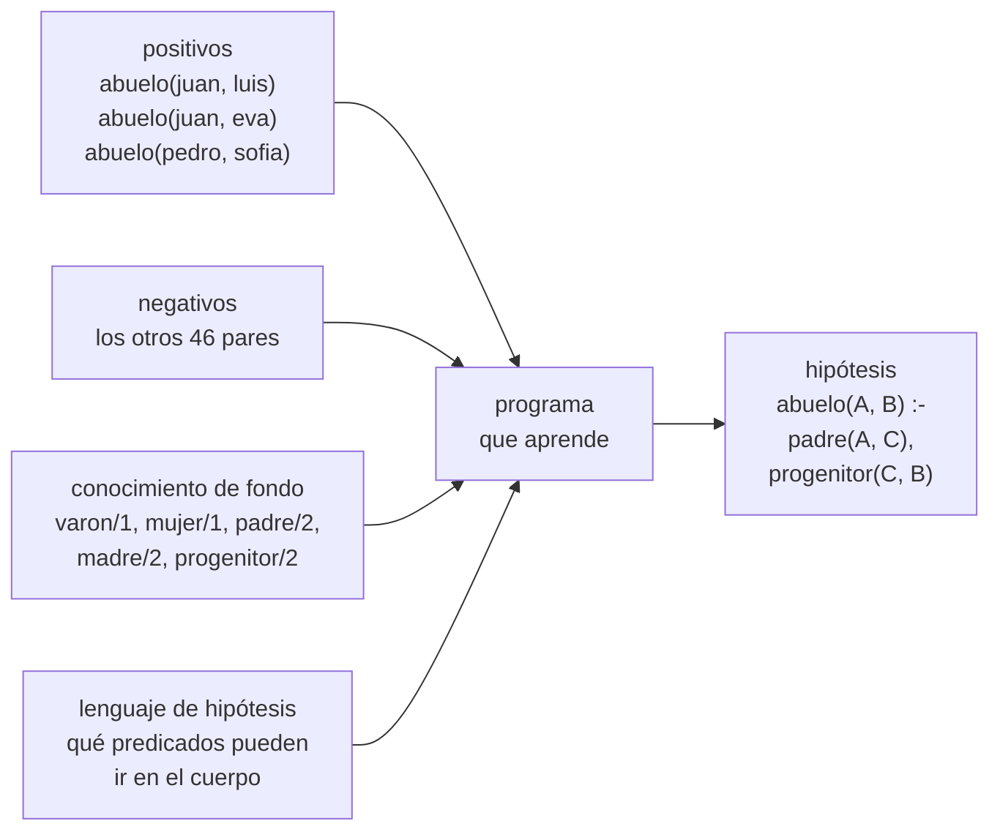
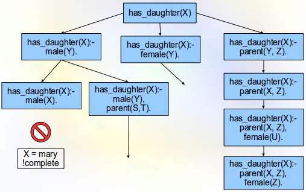

# Capítulo 67 — Proyecto: aprender reglas de ejemplos

El [capítulo 49](../capitulo-49-proyecto-diagnostico-abduccion/index.md) presenta la abducción: dada una teoría y una
observación, supone los hechos que la explican. Este capítulo presenta la
otra inferencia que forma hipótesis, la **inducción**: dados algunos
hechos de una relación y el conocimiento de fondo, supone **reglas**. Si se
sabe que juan es abuelo de luis y de eva, que pedro es abuelo de sofia, que
nadie más es abuelo de nadie, y se conocen los hechos de `padre/2`,
`madre/2`, `varon/1` y `mujer/1`, el programa del
capítulo propone la regla que el [capítulo 3](../capitulo-03-reglas-y-conjunciones/index.md) escribe a mano:

```prolog
abuelo(A, B) :-
    padre(A, C),
    progenitor(C, B).
```

La deducción va de las reglas a los hechos y es segura. La inducción va de
los hechos a las reglas y no lo es: muchas reglas explican los mismos
ejemplos, y los ejemplos no alcanzan para elegir entre ellas. El capítulo
muestra con qué orden se recorren las reglas posibles, por qué el
resultado depende de los ejemplos negativos, y cómo se mide lo que una
regla aprendida afirma de más.

El programa crece en cinco versiones. La primera generaliza dos términos:
la **generalización menos general** (lgg) es el término más específico que
tiene a los dos como casos particulares. La segunda extiende la idea a las
cláusulas, ordenadas por la **θ-subsunción**. La tercera aprende de abajo
hacia arriba: generaliza dos ejemplos junto con los hechos de fondo y
quita lo que sobra. La cuarta aprende de arriba hacia abajo: parte de la
regla más general y la especializa hasta que no cubre ningún ejemplo
negativo. La quinta elige, entre las reglas posibles, la que cubre más
ejemplos, y con ella aprende la definición recursiva de `antepasado/2`
del [capítulo 6](../capitulo-06-recursion/index.md). Una sexta parte
recorre lo que queda del capítulo de Flach: la inducción como abducción,
la búsqueda incremental que retira la cláusula falsa, los tipos que
permiten aprender `append/3`, y un programa con acumulador.

El proyecto parte del capítulo «Inductive reasoning» de *Simply Logical:
Intelligent Reasoning by Example* de Peter Flach
([edición en línea del autor](https://book.simply-logical.space/)). De él
toma los ejemplos positivos y negativos, las dos nociones de cobertura, la
θ-subsunción probada con las variables congeladas, la antiunificación con
sustituciones inversas, la lgg relativa a un modelo con su reducción, el
algoritmo de cobertura y la búsqueda descendente por refinamientos con
profundización iterativa. El libro se publica con una licencia no
comercial: el texto y los programas de este capítulo son propios, escritos
sobre la familia de los [capítulos 2](../capitulo-02-hechos-consultas-y-variables/index.md) y [3](../capitulo-03-reglas-y-conjunciones/index.md).

Los hechos de la familia no se copian: `familia.pl` carga el archivo del
[capítulo 3](../capitulo-03-reglas-y-conjunciones/index.md) en un módulo propio, y calcula el modelo del conocimiento de
fondo con el evaluador de abajo hacia arriba del [capítulo 38](../capitulo-38-semantica-de-los-programas-logicos/index.md). La lgg
es un recorrido de dos términos a la vez, como los del [capítulo 32](../capitulo-32-inspeccion-de-terminos/index.md), y la
prueba de las hipótesis recursivas es el intérprete con límite de
profundidad del [capítulo 33](../capitulo-33-introspeccion-y-metainterpretes/index.md). Todos los archivos cargan archivos de
otros capítulos y se ejecutan en una instalación local, no en SWISH.

## Objetivos del capítulo

Al terminar el capítulo, el lector puede:

- plantear un problema de inducción: ejemplos positivos y negativos,
  conocimiento de fondo, lenguaje de hipótesis y cobertura;
- calcular la lgg de dos términos por antiunificación y decidir si un
  término o una cláusula es más general que otro por θ-subsunción;
- construir la lgg relativa de dos ejemplos y reducirla con los ejemplos
  negativos, en un algoritmo de cobertura;
- especializar una cláusula con un operador de refinamiento y buscar,
  con profundidad creciente, una cláusula consistente;
- distinguir la cobertura extensional de la intensional, y aprender una
  definición recursiva;
- medir la sobregeneralización de una hipótesis comparando su extensión
  con la relación esperada.

!!! info "Tiempo estimado"
    Leer el capítulo, ejecutar sus ejemplos y hacer las actividades: **1:30 h**.
    Resolver los 6 ejercicios marcados con ★: **1:25 h**.
    Resolver los 13 ejercicios del final: **3:55 h**.

## 67.1 El problema

Un **ejemplo** es un hecho sin variables de la relación que se quiere
aprender. Es **positivo** si pertenece a la relación y **negativo** si no
pertenece. El **conocimiento de fondo** son las relaciones que ya se
conocen; aquí, las de la familia de los [capítulos 2](../capitulo-02-hechos-consultas-y-variables/index.md) y [3](../capitulo-03-reglas-y-conjunciones/index.md):

<!-- ejemplo: capitulo-67/familia.pl predicado: de_fondo/1 -->
```prolog
% de_fondo(P): P es un predicado del conocimiento de fondo.
de_fondo(varon/1).
de_fondo(mujer/1).
de_fondo(padre/2).
de_fondo(madre/2).
de_fondo(progenitor/2).
```

Una **hipótesis** es un conjunto de cláusulas. **Cubre** un ejemplo si el
ejemplo se deduce de la hipótesis junto con el conocimiento de fondo. Se
busca una hipótesis **completa**, que cubra todos los positivos, y
**consistente**, que no cubra ningún negativo.

El conocimiento de fondo tiene reglas: `progenitor/2` es la disyunción de
`padre/2` y `madre/2`. Para decidir la cobertura conviene tenerlo como un
conjunto de hechos, su **modelo mínimo**, que el [capítulo 38](../capitulo-38-semantica-de-los-programas-logicos/index.md) calcula
con `modelo_minimo_de/2`. `familia.pl` lee las cláusulas de fondo con
`clause/2` y se las entrega:

<!-- ejemplo: capitulo-67/familia.pl predicado: modelo_fondo/1 -->
```prolog
%!  modelo_fondo(-M:list) is det.
%
%   M es el modelo mínimo del conocimiento de fondo: los átomos sin
%   variables que se deducen de él, en un conjunto ordenado.
modelo_fondo(M) :-
    clausulas_fondo(Clausulas),
    modelo_minimo_de(Clausulas, M).
```

```prolog
?- modelo_fondo(M), length(M, N).
M = [mujer(ana), mujer(eva), mujer(marta), mujer(sofia), varon(juan), varon(luis), varon(pedro), madre(eva, sofia), madre(..., ...)|...],
N = 21.
```

Los ejemplos los da quien conoce la relación. `esperado/2` guarda esa
definición: para `abuelo/2` y `abuela/2`, las reglas del [capítulo 3](../capitulo-03-reglas-y-conjunciones/index.md);
para `hermano/2` y `antepasado/2`, reglas escritas en `familia.pl`. El
programa que aprende no la consulta. Con el **supuesto del mundo cerrado**,
los negativos son todos los pares de personas que la definición esperada
no incluye:

<!-- ejemplo: capitulo-67/familia.pl predicado: ejemplos/3 -->
```prolog
%!  ejemplos(+Relacion, -Pos:list, -Negs:list) is det.
%
%   Pos son los ejemplos positivos de Relacion, una relación binaria
%   entre personas, y Negs los negativos: todos los pares de personas que
%   la definición esperada no incluye (supuesto del mundo cerrado). Las
%   dos listas están ordenadas y no tienen repetidos.
ejemplos(Relacion, Pos, Negs) :-
    setof(Atomo, esperado(Relacion, Atomo), Pos),
    findall(Atomo,
            ( persona(A),
              persona(B),
              Atomo =.. [Relacion, A, B],
              \+ memberchk(Atomo, Pos) ),
            Negs0),
    sort(Negs0, Negs).
```

```prolog
?- ejemplos(abuelo, Pos, Negs), length(Negs, N).
Pos = [abuelo(juan, eva), abuelo(juan, luis), abuelo(pedro, sofia)],
Negs = [abuelo(ana, ana), abuelo(ana, eva), abuelo(ana, juan), abuelo(ana, luis), abuelo(ana, marta), abuelo(ana, pedro), abuelo(ana, sofia), abuelo(eva, ana), abuelo(..., ...)|...],
N = 46.
```

Con siete personas hay 49 pares: 3 positivos y 46 negativos para
`abuelo/2`, 2 y 47 para `abuela/2` y `hermano/2`, 14 y 35 para
`antepasado/2`. Son pocos ejemplos, y eso hace visible lo que en un
problema grande queda oculto: cuántas reglas distintas explican lo mismo.

El problema completo, para `abuelo/2`, tiene cuatro entradas y una salida:



Entre la entrada y la salida está el espacio de las cláusulas posibles,
ordenado de la más general a las más específicas. La figura muestra una
parte de ese espacio para otra relación de familia:



Parte del grafo de especialización para aprender `has_daughter(X)`, «X
tiene una hija», desde la cláusula más general: cada flecha agrega un
literal o une dos variables, y una rama se abandona cuando deja de cubrir
un ejemplo positivo (aquí, el de mary). Es la búsqueda de la
[sección 67.5](#675-version-4-induccion-descendente).
Imagen: Volkova t a, [CC BY-SA 3.0](https://creativecommons.org/licenses/by-sa/3.0/),
vía [Wikimedia Commons](https://commons.wikimedia.org/wiki/File:ILP_family2.png).

## 67.2 Versión 1: la lgg de dos términos

Un término G es **al menos tan general** como T si una sustitución de las
variables de G lo convierte en T. Lo decide `subsumes_term/2`, presentado
en la [sección 35.3](../capitulo-35-transformacion-de-programas-y-compilacion/index.md#353-desplegar-y-plegar), que no liga ninguno de los dos términos;
`mas_general/2` lo llama:

<!-- ejemplo: capitulo-67/generalizar.pl predicado: mas_general/2 -->
```prolog
%!  mas_general(@G, @T) is semidet.
%
%   G es al menos tan general como T: existe una sustitución de las
%   variables de G que lo convierte en T. Ninguno de los dos términos
%   queda ligado.
mas_general(G, T) :-
    subsumes_term(G, T).
```

```prolog
?- mas_general(f(X, Y), f(Z, Z)).
true.

?- mas_general(f(Z, Z), f(X, Y)).
false.
```

La relación es la **θ-subsunción** entre términos (θ es la sustitución).
Dos términos tienen muchas generalizaciones comunes: `abuelo(juan, luis)`
y `abuelo(pedro, sofia)` son casos de `abuelo(A, B)`, de `abuelo(A, _)` y
de cualquier variable sola. Entre todas hay una **menos general**, que es
caso particular de todas las demás: la lgg. Se calcula por
**antiunificación**, la operación dual de la unificación. Se recorren los
dos términos a la vez: donde coinciden se conserva lo común, y donde
difieren se pone una variable.

Recorrer sin más no alcanza. Con `f(a, a)` y `f(b, b)`, poner una variable
nueva en cada diferencia da `f(A, B)`, que generaliza a los dos, pero
`f(A, A)` también los generaliza y es más específica:

```prolog
?- lgg_ingenua(f(a, a), f(b, b), G1), lgg(f(a, a), f(b, b), G2).
G1 = f(_, _),
G2 = f(_A, _A).
```

La lgg exige que el mismo par de subtérminos reciba siempre la misma
variable. La tabla de los pares ya reemplazados es una **sustitución
inversa**: cada entrada `(A-B)-V` dice que V está en lugar de A en el
primer término y de B en el segundo. La tabla se pasa de un argumento al
siguiente con `foldl/6`, el recorrido genérico del [capítulo 32](../capitulo-32-inspeccion-de-terminos/index.md#324-recorrer-cualquier-termino) con
un acumulador. `reemplazado/4` busca un par en la tabla comparando con
`==`, sin unificar:

<!-- ejemplo: capitulo-67/generalizar.pl predicado: lgg/5 -->
```prolog
%!  lgg(+T1, +T2, -G, +S0:list, -S:list) is det.
%
%   G es la generalización menos general de T1 y T2, con la sustitución
%   inversa S0 como punto de partida: una lista de pares (A-B)-V, donde V
%   es la variable que ya reemplaza al par de subtérminos A y B. S es S0
%   con los pares nuevos agregados al frente.
lgg(T1, T2, G, S0, S) :-
    (   T1 == T2
    ->  G = T1,
        S = S0
    ;   reemplazado(S0, T1, T2, V)
    ->  G = V,
        S = S0
    ;   compound(T1),
        compound(T2),
        compound_name_arity(T1, F, N),
        compound_name_arity(T2, F, N)
    ->  compound_name_arguments(T1, F, Args1),
        compound_name_arguments(T2, F, Args2),
        foldl(lgg_argumento, Args1, Args2, Args, S0, S),
        compound_name_arguments(G, F, Args)
    ;   S = [(T1-T2)-G|S0]
    ).
```

```prolog
?- lgg(2 * 2 = 2 + 2, 2 * 3 = 3 + 3, G, [], S).
G = (2*_A=_A+_A),
S = [2-3-_A].

?- lgg(pertenece(1, [1]), pertenece(z, [z, y, x]), G).
G = pertenece(_A, [_A|_]).
```

En la primera consulta el primer `2` se conserva, porque los dos términos
lo tienen en esa posición; los otros tres pares `2`–`3` son el mismo par y
reciben la misma variable. La segunda generaliza dos hechos de pertenencia
a una lista: el elemento es la cabeza de la lista. La sustitución inversa
no dice en qué posiciones se reemplazó el `2`, y por eso no se puede
aplicar para volver del resultado al primer término; alcanza para
construir la lgg, que es lo único que se le pide.

!!! question "Actividad"
    Predecir la lgg de `p(f(a), g(a, b), a)` y `p(f(c), g(c, d), c)`, y
    la de `p(a, b)` con `q(a, b)`. Comprobarlo con `lgg/3`, y verificar
    con `mas_general/2` que cada resultado generaliza a los dos términos.

## 67.3 Versión 2: θ-subsunción y lgg de cláusulas

Una regla también es más o menos general. En el capítulo, una cláusula es
un término `Cabeza :- Cuerpo` con el cuerpo como **lista** de literales,
porque el orden de las condiciones no cambia lo que la cláusula afirma. La
cláusula C1 **θ-subsume** a C2 si una sustitución θ hace la cabeza de C1
igual a la de C2 y cada literal del cuerpo de C1 igual a alguno del de C2.
Entonces C1 implica a C2: C2 dice lo mismo con más condiciones o con
menos variables.

Para que θ sustituya solo variables de C1, las de C2 se congelan:
`numbervars/3` las reemplaza por términos sin variables. Todo ocurre sobre
copias y dentro de `\+ \+`, que deshace las ligaduras al terminar:

<!-- ejemplo: capitulo-67/subsuncion.pl predicado: subsume/2 -->
```prolog
%!  subsume(@C1, @C2) is semidet.
%
%   La cláusula C1 θ-subsume a C2: una sustitución θ de las variables de
%   C1 hace la cabeza de C1 igual a la de C2 y cada literal del cuerpo de
%   C1 igual a uno del cuerpo de C2. Ninguna cláusula queda ligada.
subsume(C1, C2) :-
    \+ \+ ( copy_term(C1, (H1 :- B1)),
            copy_term(C2, (H2 :- B2)),
            numbervars(H2-B2, 0, _),
            H1 = H2,
            incluido(B1, B2) ).
```

```prolog
?- subsume((abuelo(A, N) :- [padre(A, P), padre(P, N)]), (abuelo(juan, luis) :- [padre(juan, pedro), padre(pedro, luis), varon(juan)])).
true.

?- subsume((lista([V|W]) :- [lista(W)]), (lista([X, Y|Z]) :- [lista(Z)])).
false.
```

La primera consulta es la forma en que una regla explica un ejemplo: con
θ = {A/juan, P/pedro, N/luis}, las condiciones de la regla están entre los
hechos. La segunda muestra el límite de la θ-subsunción. La primera
cláusula, junto con `lista([])`, acepta listas de cualquier longitud, y la
segunda solo las de longitud par: la primera implica a la segunda. Pero
ninguna sustitución lleva una a la otra, porque W tendría que ser a la vez
`[Y|Z]` y `Z`. La θ-subsunción es más débil que la consecuencia lógica de
la [sección 38.1](../capitulo-38-semantica-de-los-programas-logicos/index.md#381-modelos-y-consecuencia-logica); a cambio, se decide con un programa corto y
da una lgg única. Flach toma el ejemplo y la comparación de Gottlob, que
caracteriza con precisión la diferencia entre las dos relaciones.

La **lgg de dos cláusulas** generaliza las cabezas y después cada par de
literales del mismo predicado, uno de cada cuerpo. Como los cuerpos no
tienen orden, no se comparan posición por posición: se prueban todos los
pares. La sustitución inversa es una sola para toda la cláusula, y así los
literales comparten las variables de la cabeza:

<!-- ejemplo: capitulo-67/subsuncion.pl predicado: lgg_clausula/3 -->
```prolog
%!  lgg_clausula(+C1, +C2, -C) is det.
%
%   C es la lgg de las cláusulas C1 y C2 bajo θ-subsunción: la cabeza es
%   la lgg de las cabezas, y el cuerpo tiene la lgg de cada par de
%   literales del mismo predicado, sin repetidos, todas calculadas con la
%   misma sustitución inversa.
lgg_clausula((H1 :- B1), (H2 :- B2), (H :- B)) :-
    lgg(H1, H2, H, [], S0),
    pares(B1, B2, Pares),
    foldl(lgg_par, Pares, B0, S0, _),
    list_to_set(B0, B).
```

`pares/3` arma los pares sin copiar los literales, porque una copia
perdería las variables que comparten con la cabeza:

```prolog
?- lgg_clausula((abuelo(juan, luis) :- [varon(juan), padre(juan, pedro), padre(pedro, luis)]), (abuelo(pedro, sofia) :- [varon(pedro), padre(pedro, eva), madre(eva, sofia)]), C).
C = (abuelo(_A, _):-[varon(_A), padre(_A, _), padre(pedro, _)]).
```

`mostrar/1` escribe una cláusula del capítulo como regla de Prolog;
`mostrar(C)` da:

```prolog
abuelo(A, _) :-
    varon(A),
    padre(A, _),
    padre(pedro, _).
```

Las dos cláusulas son las explicaciones de dos ejemplos: juan es abuelo de
luis porque es varón, padre de pedro y pedro es padre de luis; pedro es
abuelo de sofia porque es varón, padre de eva y eva es madre de sofia. La
lgg conserva el primer eslabón, pero pierde el segundo: un eslabón es
`padre/2` y el otro `madre/2`, y la lgg solo combina literales del mismo
predicado. Con `progenitor/2` en las explicaciones, los dos eslabones se
generalizarían. Es la razón por la que el conocimiento de fondo incluye
`progenitor/2`: la lgg no inventa predicados, solo generaliza los que
recibe.

## 67.4 Versión 3: inducción ascendente

Las explicaciones de la sección anterior se escribieron a mano. La **lgg
relativa** (rlgg), la idea del sistema GOLEM de Muggleton y Feng que Flach
reduce a un programa corto, las construye: la explicación de un ejemplo E es la
cláusula `E :- M`, con M el modelo de fondo entero, y la rlgg de E1 y E2 es
la lgg de `E1 :- M` y `E2 :- M`. El resultado es grande: con 21 átomos en
el modelo, la lgg tiene 99 literales, uno por cada par de átomos del mismo
predicado. La mayoría no sirve. Los que no tienen variables son hechos del
modelo, verdaderos siempre; los que no comparten variables con la cabeza,
ni directa ni indirectamente, no dicen nada del ejemplo. `rlgg/4` quita
los dos tipos, y también la cabeza si aparece en el cuerpo. `enlazados/3`
agrega a las variables de la cabeza las de cada literal que comparte una
con ellas, hasta que no aparecen más, y conserva los literales que tocan
ese conjunto:

<!-- ejemplo: capitulo-67/ascendente.pl predicado: rlgg/4 -->
```prolog
%!  rlgg(+E1, +E2, +M:list, -C) is det.
%
%   C es la lgg de E1 :- M y E2 :- M sin los literales sin variables, sin
%   la propia cabeza y sin los literales que no están enlazados con la
%   cabeza.
rlgg(E1, E2, M, (H :- B)) :-
    lgg_clausula((E1 :- M), (E2 :- M), (H :- B0)),
    exclude(ground, B0, B1),
    exclude(==(H), B1, B2),
    enlazados(H, B2, B).
```

Flach exige además que el cuerpo no tenga variables que no estén en la
cabeza. Esa restricción descarta la regla de `abuelo/2`, cuya variable C,
el hijo intermedio, no está en la cabeza; por eso aquí se conservan las
variables nuevas que están **enlazadas** con la cabeza a través de otros
literales. `rlgg_de/4` calcula la rlgg de dos positivos por su número:

```prolog
?- rlgg_de(abuelo, 1, 3, C).
C = (abuelo(_A, _B):-[mujer(_C), mujer(_B), varon(_A), varon(_D), padre(_A, _C), padre(_A, _E), padre(_A, _F), padre(..., ...)|...]).
```

`mostrar(C)` la escribe como regla:

```prolog
abuelo(A, B) :-
    mujer(C),
    mujer(B),
    varon(A),
    varon(D),
    padre(A, C),
    padre(A, E),
    padre(A, F),
    padre(A, D),
    progenitor(A, C),
    progenitor(A, E),
    progenitor(A, F),
    progenitor(A, D),
    progenitor(G, C),
    progenitor(G, E),
    progenitor(G, F),
    progenitor(G, D),
    progenitor(F, B),
    progenitor(F, _).
```

De los 99 literales quedan 18. Entre ellos están `padre(A, F)` y
`progenitor(F, B)`: juan es padre de pedro, que es progenitor de eva, y
pedro es padre de eva, que es progenitora de sofia. El resto describe lo
que los dos abuelos tienen además en común: los dos tienen una hija, y las
dos nietas son mujeres.

La cobertura que se usa para reducir es **extensional**: una cláusula
cubre un ejemplo si su cabeza unifica con él y todos los literales del
cuerpo están en el modelo, con una misma sustitución:

<!-- ejemplo: capitulo-67/ascendente.pl predicado: cubre/3 -->
```prolog
%!  cubre(+C, +E, +M:list) is semidet.
%
%   La cláusula C cubre el ejemplo E en forma extensional: la cabeza de C
%   unifica con E y todos los literales del cuerpo son verdaderos en M, con
%   una misma sustitución. Nada queda ligado.
cubre((H :- B), E, M) :-
    \+ \+ ( H = E,
            verdadero(B, M) ).
```

La **reducción** recorre el cuerpo y quita cada literal cuya ausencia no
hace cubrir un ejemplo negativo. Es el único lugar donde intervienen los
negativos:

<!-- ejemplo: capitulo-67/ascendente.pl predicado: reducir/4 -->
```prolog
%!  reducir(+C0, +Negs:list, +M:list, -C) is semidet.
%
%   C es la cláusula C0 sin los literales que se pueden quitar sin cubrir
%   un ejemplo de Negs, probados de a uno en el orden del cuerpo. Falla si
%   C0 ya cubre un ejemplo negativo.
reducir((H :- B0), Negs, M, (H :- B)) :-
    \+ cubre_alguno((H :- B0), Negs, M),
    quitar(B0, [], H, Negs, M, B).
```

<!-- ejemplo: capitulo-67/ascendente.pl predicado: quitar/6 -->
```prolog
%!  quitar(+Pendientes:list, +Guardados:list, +H, +Negs:list, +M:list,
%!         -B:list) is det.
%
%   B son los literales de Guardados, en orden inverso, seguidos de los de
%   Pendientes que no se pueden quitar: un literal se quita si la cláusula
%   con los guardados y los pendientes que le siguen no cubre ningún
%   negativo.
quitar([], Guardados, _, _, _, B) :-
    reverse(Guardados, B).
quitar([L|Ls], Guardados, H, Negs, M, B) :-
    reverse(Guardados, G),
    append(G, Ls, Sin),
    (   cubre_alguno((H :- Sin), Negs, M)
    ->  quitar(Ls, [L|Guardados], H, Negs, M, B)
    ;   quitar(Ls, Guardados, H, Negs, M, B)
    ).
```

El resultado depende del orden en que se prueban los literales.
`reducida_de/5` reduce la misma rlgg recorriendo el cuerpo hacia adelante
o hacia atrás:

```prolog
?- reducida_de(abuelo, 1, 3, directo, C).
C = (abuelo(_A, _B):-[padre(_A, _C), progenitor(_D, _E), progenitor(_D, _C), progenitor(_E, _B)]).

?- reducida_de(abuelo, 1, 3, inverso, C).
C = (abuelo(_A, _B):-[progenitor(_C, _B), padre(_A, _C)]).
```

Escritas con `mostrar/1`, son estas dos reglas:

```prolog
abuelo(A, B) :-
    padre(A, C),
    progenitor(D, E),
    progenitor(D, C),
    progenitor(E, B).

abuelo(A, B) :-
    progenitor(C, B),
    padre(A, C).
```

Las dos cláusulas son consistentes y cubren los tres positivos. La
segunda es la regla esperada. La primera dice que A es padre de C, que C
tiene un hermano o es la misma persona E, y que E es progenitor de B: en
esta familia coincide con la segunda, porque ningún nieto desciende de un
tío. Quitar un literal de ella haría cubrir un negativo, así que la
reducción se detiene; es un mínimo local, no la cláusula más corta.

El **algoritmo de cobertura** repite la construcción: calcula la rlgg de
cada par de positivos todavía sin cubrir, se queda con la que, reducida,
cubre más, quita los positivos que cubre y vuelve a empezar. Los positivos
que ninguna cláusula consistente cubre quedan como hechos. Es
`ascendente/5`, y `aprender_asc/3` lo aplica a una relación de la familia:

```prolog
?- aprender_asc(abuela, H, N).
H = [(abuela(marta, _A):-[progenitor(pedro, _A)])],
N = 1.

?- aprender_asc(hermano, H, N).
H = [(hermano(_A, _B):-[mujer(_B), varon(_A), progenitor(_C, _B), progenitor(_C, _A)])],
N = 1.
```

Los dos resultados son consistentes y completos, y los dos muestran un
límite de aprender con pocos ejemplos. Las dos abuelas de los ejemplos
son la misma, marta, y la lgg conserva la constante: la regla dice que
marta es abuela de los hijos de pedro, cierto pero demasiado específico.
En `hermano/2`, las dos personas con hermano tienen una hermana, y la regla
exige que B sea mujer. Esa condición cumple además otra función: sin
ella, la regla cubriría `hermano(pedro, pedro)`, porque pedro comparte
progenitor consigo mismo. El lenguaje no tiene un predicado para «A y B
son distintos», y los datos de esta familia permiten reemplazarlo por
`mujer(B)`.

!!! question "Actividad"
    Predecir qué rlgg da el par de positivos 1 y 2 de `abuelo/2`, los dos
    de juan, y si después de reducirla cubre a `abuelo(pedro, sofia)`.
    Comprobarlo con `rlgg_de/4` y `reducida_de/5`, y explicar por qué el
    algoritmo de cobertura no la elige.

Lo que una hipótesis permite deducir es su **extensión**: los átomos de la
relación en el modelo mínimo del fondo junto con las cláusulas aprendidas.
`evaluar/5` la calcula con `modelo_minimo_de/2` y la compara con la
relación esperada:

```prolog
?- aprender_asc(abuelo, H, _), evaluar(abuelo, H, A, FP, FN).
H = [(abuelo(_A, _B):-[padre(_A, _C), progenitor(_D, _E), progenitor(_D, _C), progenitor(_E, _B)])],
A = 3,
FP = FN, FN = 0.
```

Tres aciertos, ningún falso positivo y ningún falso negativo: sobre esta
familia, la hipótesis es exacta aunque no sea la regla esperada.

## 67.5 Versión 4: inducción descendente

La inducción descendente recorre las cláusulas en el sentido opuesto;
Flach la presenta siguiendo el sistema MIS de Shapiro. Parte de la más
general, `abuelo(A, B)`, que afirma que todos son abuelos
de todos, y la **especializa** mientras cubra un negativo. Un
**operador de refinamiento** da las especializaciones mínimas de una
cláusula bajo θ-subsunción: aplicar una sustitución, aquí unificar dos de
sus variables, o agregar un literal al cuerpo. El **lenguaje de
hipótesis** dice qué literales se pueden agregar: los predicados de fondo,
con argumentos que son variables de la cláusula y a lo sumo una variable
nueva:

<!-- ejemplo: capitulo-67/descendente.pl predicado: refinamiento/3 -->
```prolog
%!  refinamiento(+L:list, +C0, -C) is nondet.
%
%   C es C0 con dos variables unificadas o con un literal más.
refinamiento(_, C0, C) :-
    copy_term(C0, C),
    term_variables(C, Vs),
    append(_, [X|Resto], Vs),
    member(Y, Resto),
    X = Y.
refinamiento(L, C0, (H :- B)) :-
    copy_term(C0, (H :- B0)),
    term_variables(H-B0, Vs),
    member(Nombre/Aridad, L),
    length(Args, Aridad),
    maplist(argumento(Vs, Nueva), Args),
    \+ maplist(==(Nueva), Args),
    Literal =.. [Nombre|Args],
    \+ ( member(Otro, B0),
         Otro == Literal ),
    append(B0, [Literal], B).
```

`refinar/3` descarta además las **tautologías**, las cláusulas cuyo cuerpo
contiene la cabeza, que cubrirían cualquier ejemplo en el que ya se
cree. La cláusula más general tiene 29 refinamientos: las unificaciones
de sus dos variables, cuatro literales de un argumento y 24 de dos:

```prolog
?- lenguaje(L), aggregate_all(count, refinar(L, (abuelo(_, _) :- []), _), K).
L = [varon/1, mujer/1, padre/2, madre/2, progenitor/2],
K = 29.
```

Las cláusulas y sus refinamientos forman un grafo, el **grafo de
especialización**, en el que se busca una cláusula consistente. Se busca
en profundidad con un límite que crece de a uno, la profundización
iterativa de la [sección 33.5](../capitulo-33-introspeccion-y-metainterpretes/index.md#335-limites-de-profundidad-y-profundizacion-iterativa) y la [sección 40.4](../capitulo-40-busqueda-y-planificacion/index.md#404-profundidad-limitada-y-profundizacion-iterativa), porque el
grafo es ancho y guardar una frontera por anchura ocuparía mucha memoria.
La búsqueda explica un ejemplo positivo por vez, y aprovecha una propiedad
de la especialización: un refinamiento cubre a lo sumo lo que cubría la
cláusula de la que sale. Una cláusula que ya no cubre el ejemplo no puede
llevar a una que lo cubra, y se descarta:

<!-- ejemplo: capitulo-67/descendente.pl predicado: buscar/6 -->
```prolog
%!  buscar(+D:integer, +C, +Problema, -R, +N0:integer, -N:integer) is det.
%
%   Búsqueda en profundidad desde C con a lo sumo D refinamientos. Solo
%   se siguen los refinamientos que cubren el ejemplo.
buscar(D, C, E-Negs-M-L, R, N0, N) :-
    (   consistente(C, Negs, M)
    ->  R = encontrada(C),
        N = N0
    ;   D > 0
    ->  findall(S, refinar(L, C, S), Todos),
        length(Todos, K),
        N1 is N0 + K,
        include(cubre_ejemplo(E, M), Todos, Hijos),
        D1 is D - 1,
        buscar_en(Hijos, D1, E-Negs-M-L, R, N1, N)
    ;   R = ninguna,
        N = N0
    ).
```

!!! example "Patrón 66 — Especializar podando por el ejemplo"
    **Problema.** Es necesario buscar, en un grafo de especialización,
    una cláusula que cubra un ejemplo positivo y ningún negativo, y el
    grafo crece exponencialmente con la cantidad de refinamientos.

    **Versión ingenua.** Generar todos los refinamientos de cada cláusula
    y examinar cada uno hasta el límite de profundidad, aunque ya no
    cubra el ejemplo que se quiere explicar: se recorren ramas enteras
    en las que ninguna cláusula puede ser la buscada.

    **Patrón.** Un refinamiento es una especialización: cubre a lo sumo lo
    que cubría la cláusula de la que sale. Se elige un ejemplo positivo,
    la semilla, y se descarta todo refinamiento que no lo cubre, antes de
    examinar sus propios refinamientos. La prueba de cobertura de la
    semilla es barata, un solo ejemplo, y corta ramas completas del grafo.

    **Cuándo no usarlo.** Cuando la cobertura no es monótona respecto del
    refinamiento: con negación en el cuerpo, o con literales que se
    evalúan con efectos, agregar un literal puede hacer cubrir un ejemplo
    que antes no se cubría. Y cuando se busca la cláusula que cubre más
    ejemplos sin una semilla fija: entonces la cota es la cantidad de
    positivos que todavía se cubren, no uno solo.

`buscar/6` cuenta las cláusulas que genera; el algoritmo de cobertura es
el de la versión 3, con una búsqueda por cada positivo sin cubrir. Con
tres refinamientos como máximo:

```prolog
?- aprender_desc(abuelo, H, N).
H = [(abuelo(_A, _B):-[padre(_A, _C), padre(_C, _B)]), (abuelo(_D, _E):-[padre(_D, _F), madre(_F, _E)])],
N = 334.
```

El primer positivo es `abuelo(juan, eva)`, y la primera cláusula
consistente que lo cubre es «padre de un padre». No cubre a
`abuelo(pedro, sofia)`, y la segunda búsqueda agrega «padre de una
madre». La hipótesis es exacta en la familia, pero tiene dos cláusulas
donde una sola, con `progenitor/2`, cubriría los tres ejemplos: la
búsqueda se queda con la **primera** cláusula consistente, y `padre/2`
está antes que `progenitor/2` en el lenguaje. La
[sección 67.6](#676-version-5-la-mejor-clausula-y-la-recursion) cambia ese criterio.

El costo crece rápido con la profundidad. `hermano/2` necesita cuatro
literales, porque el lenguaje no puede decir que dos personas son
distintas; con el límite en tres, la búsqueda recorre todo el grafo sin
encontrar nada y los positivos quedan como hechos:

```prolog
?- aprender_desc(hermano, H, N).
H = [(hermano(luis, eva):-[]), (hermano(pedro, ana):-[])],
N = 20078.

?- ejemplos(hermano, Pos, Negs), modelo_fondo(M), lenguaje(L), descendente(Pos, Negs, M, L, 4, H, N).
Pos = [hermano(luis, eva), hermano(pedro, ana)],
Negs = [hermano(ana, ana), hermano(ana, eva), hermano(ana, juan), hermano(ana, luis), hermano(ana, marta), hermano(ana, pedro), hermano(ana, sofia), hermano(eva, ana), hermano(..., ...)|...],
M = [mujer(ana), mujer(eva), mujer(marta), mujer(sofia), varon(juan), varon(luis), varon(pedro), madre(eva, sofia), madre(..., ...)|...],
L = [varon/1, mujer/1, padre/2, madre/2, progenitor/2],
H = [(hermano(_A, _B):-[varon(_A), mujer(_B), padre(_C, _A), padre(_C, _B)])],
N = 8352.
```

Con cuatro refinamientos aparece la cláusula, y cuesta menos que el
fracaso con tres: la búsqueda termina en cuanto la encuentra, mientras
que para fallar recorre el grafo entero, una vez por cada positivo. La
cláusula aprendida tiene la misma forma que la de la versión 3, con
`mujer(B)` en lugar de «distintos».

!!! question "Actividad"
    Predecir qué hipótesis da `descendente/7` para `abuelo/2` con el
    límite en 1, y cuántas cláusulas genera. Comprobarlo, y explicar por
    qué la búsqueda con límite 1 no puede terminar de otra manera.

## 67.6 Versión 5: la mejor cláusula y la recursión

La quinta versión cambia la búsqueda: por niveles, y en el primer nivel
con cláusulas consistentes elige la que cubre más positivos. Con ella el
programa aprende la regla esperada de `abuelo/2` y la definición
recursiva de `antepasado/2`, y muestra dos maneras de equivocarse: con
pocos negativos, y con la cobertura extensional de una cláusula
recursiva. Está en la página
[La mejor cláusula y la recursión](recursion.md#la-mejor-clausula-y-la-recursion).

## 67.7 Versión 6: otras formas de inducir

El capítulo de Flach contiene cuatro ideas que las versiones anteriores
no usan. La primera plantea la inducción como abducción de cláusulas:
un metaintérprete que, para explicar un ejemplo, supone cláusulas de una
lista de cláusulas posibles. La segunda es la búsqueda incremental del
sistema MIS de Shapiro: los ejemplos llegan de a uno, y un negativo que
la hipótesis deduce se corrige quitando la cláusula falsa de su prueba.
La tercera agrega términos y tipos al lenguaje, y con ellos el programa
aprende `append/3` y una traducción entre listas. La cuarta es el
ejercicio de Flach de aprender `reverse/3`, un programa con acumulador.
Están en la página [Otras formas de inducir](otras-formas.md#otras-formas-de-inducir).

!!! success "Criterios de calidad"
    | Criterio | En este capítulo |
    |---|---|
    | C1 | cada predicado declara modos y determinación; `refinar/3` e `incluido/2` son `nondet` porque enumeran alternativas, y los que aprenden son `det`: devuelven una hipótesis y la cuenta de cláusulas |
    | C2 | el problema es de datos: los ejemplos salen de `ejemplos/3`, el fondo de `de_fondo/1` y el lenguaje de `lenguaje/1`; los hechos son los del [capítulo 3](../capitulo-03-reglas-y-conjunciones/index.md), sin copiarlos |
    | C4 | `subsume/2`, `cubre/3` y `cubre_alguno/3` no dejan ligaduras ni alternativas: usan `\+ \+` o un corte después de la primera prueba |
    | C7 | 150 pruebas en nueve archivos; cada versión se verifica contra la anterior o contra la relación esperada: la lgg subsume a los dos términos, cada refinamiento es subsumido por su cláusula, y la extensión de cada hipótesis se compara con `esperado/2` |

## Ejercicios

Las soluciones están en [la página de soluciones](soluciones.md). La dificultad
va de 1 (se resuelve consultando el capítulo) a 3 (requiere elaboración propia).
Los marcados con ★ son los que no conviene saltear: cubren lo que el capítulo
tiene de propio.

1. ★ **(1)** Predecir, con `subsuncion.pl` cargado, qué responde cada
   consulta, y comprobarlo: `lgg(f(g(a), a), f(g(b), b), G).` ·
   `lgg([1, 2, 3], [4, 5], G).` ·
   `subsume((p(X) :- [q(X, Y)]), (p(a) :- [q(a, a)])).` ·
   `subsume((p(a) :- []), (p(X) :- [])).`
2. ★ **(2)** Escribir `lgg_lista(Ts, G)`, la lgg de una lista no vacía de
   términos, con su encabezado de PlDoc. Aplicarlo a `pertenece(1, [1])`,
   `pertenece(z, [z, y])` y `pertenece(b, [b, c, d])`, y justificar que el
   resultado no depende del orden de la lista.
3. **(2)** Una cláusula puede tener literales redundantes: `p(X) :- [q(X,
   Y), q(X, Z)]` es equivalente a `p(X) :- [q(X, Y)]`, porque cada una
   subsume a la otra. Escribir `reducida(C, R)`, que quita cada literal
   cuya ausencia deja una cláusula que C todavía subsume, y aplicarla a la
   lgg de `(p(a) :- [q(a, b), q(a, c)])` y `(p(d) :- [q(d, e)])`.
4. ★ **(2)** La reducción de la versión 3 depende del orden. Escribir
   `reducir_corta(C0, Negs, M, C)`, que reduce en los dos órdenes y se
   queda con la cláusula más corta, y usarla en una copia de
   `aprender_asc/3` para obtener la regla esperada de `abuelo/2`.
5. ★ **(1)** Aprender `abuela/2` con las versiones 3 y 4, comparar las
   hipótesis y sus extensiones con `evaluar_en/6`, y explicar por qué la
   versión 4 no puede producir una cláusula con la constante `marta`.
6. **(3)** En la familia, cada varón con un hermano tiene una hermana.
   Agregar al modelo de fondo un hijo varón de juan y marta, tomas, y
   aprender `hermano/2` con `ascendente/5`. Explicar qué ejemplos quedan
   como hechos y por qué ninguna cláusula del lenguaje los cubre. Medir
   cuántos literales enlazados tiene la rlgg de `hermano(pedro, ana)` y
   `hermano(pedro, tomas)` si se agregan al modelo los hechos
   `distintos(X, Y)` de cada par de personas distintas.
7. **(2)** Medir cuántas cláusulas genera `buscar/6` para `abuelo/2` con
   límite 2 cuando no descarta los refinamientos que dejan de cubrir el
   ejemplo, y compararlo con las que genera con la poda.
8. ★ **(2)** Aprender `abuelo/2` con `inductivo/7`, todos los
   positivos y un solo negativo: primero `abuelo(pedro, eva)`, después
   `abuelo(juan, ana)`. Medir los falsos positivos de cada hipótesis con
   `evaluar_en/6` y explicar, con los niveles de la búsqueda, por qué uno
   de los dos negativos alcanza y el otro no.
9. **(1)** Aprender `hermano/2` con `inductivo/7` sin la relación en el
   lenguaje y con límite 4, y comparar la cantidad de cláusulas generadas
   con la de la [sección 67.5](#675-version-4-induccion-descendente).
10. **(3)** `cubre/3` prueba los literales del cuerpo en su orden.
    Escribir una versión que pruebe primero el literal que unifica con
    menos átomos del modelo, y la reducción que la usa. Medir con
    `time/1` las dos reducciones en `aprender_asc/3` para `abuelo/2` y
    `hermano/2`, y en la rlgg de `antepasado(juan, luis)` y
    `antepasado(pedro, sofia)` con los positivos en el modelo, con un
    límite de tiempo.
11. **(3)** Reemplazar en `mejor_clausula/9` la búsqueda por niveles
    completa por una **búsqueda en haz**: en cada nivel se conservan solo
    las K cláusulas que cubren más positivos. Medir, con K = 1, 3 y 10,
    las cláusulas generadas y el resultado para `antepasado/2` y
    `hermano/2`.
12. ★ **(2)** Flach propone procesar todos los ejemplos a la vez, con
    cláusulas supuestas sin instanciar, para que una cláusula sirva a
    varios ejemplos. Escribir `inducir_todos(Ejemplos, Inducibles, Fondo,
    H)`, con su encabezado de PlDoc, y aplicarlo a los positivos de
    `abuelo/2` con las cláusulas de `inducibles/2`. Comparar su primera
    respuesta con las explicaciones de la
    [sección 67.7](otras-formas.md#la-induccion-como-abduccion).
13. **(1)** La hipótesis de `numerales` en la
    [sección 67.7](otras-formas.md#refutar-la-clausula-falsa) tiene la
    cláusula base `listnum([], _)`. Agregar a los ejemplos los negativos
    necesarios para que `mis/4` aprenda `listnum([], [])`, y explicar por
    qué con uno solo, `listnum([], [uno])`, la cláusula base pasa a ser
    `listnum(_, [])`.

## Resumen

| | |
|---|---|
| **ejemplo positivo, negativo** | un hecho sin variables que pertenece, o no, a la relación que se aprende |
| **conocimiento de fondo** | las relaciones conocidas; aquí, su modelo mínimo como lista de hechos |
| **cobertura extensional** | la cabeza unifica con el ejemplo y el cuerpo es verdadero en el modelo |
| **cobertura intensional** | el ejemplo se deduce de la hipótesis y del fondo |
| **completa, consistente** | la hipótesis cubre todos los positivos; no cubre ningún negativo |
| **θ-subsunción** | una sustitución lleva un término o una cláusula a otro, o a una parte de otro |
| **lgg, antiunificación** | la generalización menos general; se calcula con una sustitución inversa |
| **rlgg** | la lgg de dos ejemplos con el modelo de fondo como cuerpo |
| **refinamiento** | especialización mínima: unificar dos variables o agregar un literal |
| **sobregeneralización** | la extensión de la hipótesis incluye átomos que no pertenecen a la relación |
| `mas_general/2`, `lgg/3`, `lgg/5` | la versión 1 |
| `subsume/2`, `lgg_clausula/3` | la versión 2 |
| `rlgg/4`, `cubre/3`, `reducir/4`, `aprender_asc/3`, `evaluar/5` | la versión 3 |
| `refinar/3`, `buscar_clausula/8`, `aprender_desc/3`, `evaluar_en/6` | la versión 4 |
| **[Patrón 66](../patrones.md#66-especializar-podando-por-el-ejemplo)** | especializar podando por el ejemplo |
| `mejor_clausula/9`, `aprender_rec/3`, `probar/4` | la versión 5 |
| **cláusula falsa** | la cláusula más alta de una prueba que deduce una cabeza falsa de un cuerpo verdadero |
| `inducir/5`, `refinar_tipado/3`, `clausula_falsa/3`, `mis/4`, `bien_fundada/2` | la versión 6 |

## Temas que se retoman

| Tema | Se retoma en |
|---|---|
| El espacio de hipótesis ordenado por generalidad, con sus dos bordes, y la generalización guiada por una prueba | [capítulo 68](../capitulo-68-proyecto-espacios-versiones-generalizacion-explicacion/index.md) |

## Referencias

- Peter Flach, *Simply Logical: Intelligent Reasoning by Example*, John
  Wiley & Sons, 1994 — capítulo «Inductive reasoning», con sus apartados
  «Generalisation and specialisation», «Bottom-up induction» y «Top-down
  induction».
  [Edición en línea](https://book.simply-logical.space/src/text/3_part_iii/9.1.html).
  El capítulo toma los ejemplos positivos y negativos, la cobertura
  extensional e intensional, la θ-subsunción probada con las variables
  congeladas, la antiunificación con sustituciones inversas, la lgg de
  cláusulas y la relativa a un modelo con su reducción por los negativos,
  el algoritmo de cobertura, y la búsqueda descendente con refinamientos,
  tipos y profundización iterativa, y de su ejercicio final la búsqueda
  en haz del ejercicio 11. Flach basa la inducción ascendente en GOLEM y
  la descendente en MIS; las referencias siguientes son las que él cita
  para esas ideas, y el capítulo las conoce a través de él.
- Stephen H. Muggleton y Cao Feng, «Efficient induction of logic
  programs», en *Proceedings of the First Conference on Algorithmic
  Learning Theory*, Ohmsha, Tokio, 1990, págs. 368–381. Sin edición en
  línea de acceso libre verificada. Presenta GOLEM, que construye
  cláusulas con la lgg relativa a un modelo de hechos de fondo y las
  reduce: es el origen de la versión 3.
- Ehud Y. Shapiro, *Algorithmic Program Debugging*, MIT Press, 1983. Sin
  edición en línea de acceso libre verificada. Su sistema MIS aprende
  cláusulas buscando de la más general a las más específicas con un
  operador de refinamiento: es el origen de la versión 4. La versión 6
  toma de él, a través de Flach, el procesamiento incremental de los
  ejemplos y la búsqueda de la cláusula falsa en la prueba de un
  negativo, la idea de su depuración algorítmica.
- Georg Gottlob, «Subsumption and implication», *Information Processing
  Letters* 24(2), 1987, págs. 109–111. Sin edición en línea de acceso
  libre verificada. Caracteriza la diferencia entre la θ-subsunción y la
  consecuencia lógica que la [sección 67.3](#673-version-2-subsuncion-y-lgg-de-clausulas)
  muestra con dos cláusulas de `lista/1`.
- Tim Niblett, «A study of generalisation in logic programs», en
  *Proceedings of the Third European Working Session on Learning*,
  Pitman, 1988, págs. 131–138. Sin edición en línea de acceso libre
  verificada. Es la referencia de Flach para el orden de generalidad
  entre cláusulas y la generalización menos general de las versiones 1
  y 2.
- J. Ross Quinlan, «Learning logical definitions from relations»,
  *Machine Learning* 5(3), 1990, págs. 239–266,
  [doi:10.1007/BF00117105](https://doi.org/10.1007/BF00117105). Es la
  referencia de Flach para guiar la búsqueda descendente con una
  heurística. La versión 5 usa un criterio mucho más simple, la cantidad
  de positivos cubiertos, y no la ganancia de información del artículo.

El código del capítulo es propio, escrito para el curso sobre la familia
de los [capítulos 2](../capitulo-02-hechos-consultas-y-variables/index.md) y [3](../capitulo-03-reglas-y-conjunciones/index.md): de Flach se toman las ideas y la
estructura de los algoritmos, no el código; las variables enlazadas en
lugar de las cláusulas restringidas, el conteo de cláusulas generadas, la
elección de la mejor cláusula y la medición de la extensión con el modelo
mínimo son del curso.
