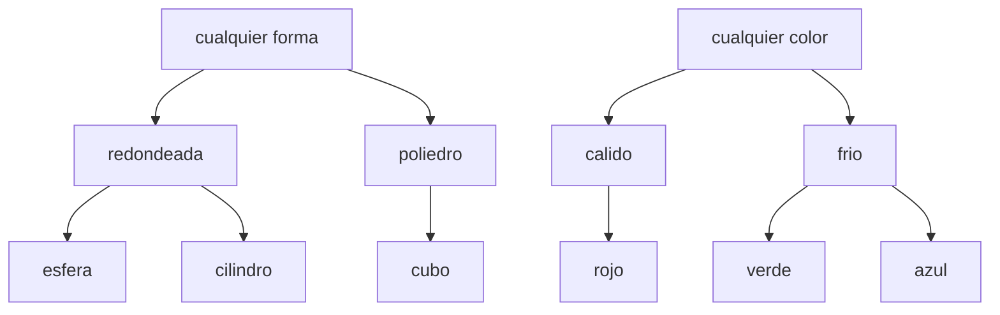

# Otras generalizaciones e incorporar las reglas

Esta página contiene la sección
[68.7](index.md#687-version-7-otras-generalizaciones-e-incorporar-las-reglas)
del [capítulo 68](index.md): las partes del capítulo «Machine Learning
Algorithms in Prolog» de Luger y Stubblefield que las versiones 1 a 6 no
cubren. Luger y Stubblefield enumeran cuatro operaciones de
generalización: reemplazar una constante por una variable, quitar
condiciones de una conjunción, agregar un disyunto y subir en una
jerarquía de clases. Las versiones 1 a 4 usan solo la primera; esta
página escribe las otras tres sobre las mismas piezas. Al final de la
sección sobre la generalización basada en la explicación, los autores
proponen además que el programa agregue a la base cada regla que
aprende; la última parte de la página lo hace y mide el resultado. Los
ejemplos están en `generalizaciones.pl` e `incorporar.pl`, en
`ejemplos/capitulo-68/`, con sus pruebas; cargan archivos de otros
capítulos y se ejecutan localmente.

## Quitar condiciones

Un concepto se puede leer como una conjunción de condiciones
`Atributo = Valor`, una por cada atributo que no está libre.
`condiciones_de/2` traduce un concepto o una instancia a esa lectura, y
`comunes/3` generaliza dos conjunciones quitando de la primera las
condiciones que la segunda no tiene:

<!-- ejemplo: capitulo-68/generalizaciones.pl predicado: condiciones_de/2 condicion/4 comunes/3 esta_en/2 -->
```prolog
%!  condiciones_de(+C, -Cs:list) is det.
%
%   Cs es el concepto o la instancia C como lista de condiciones
%   Atributo = Valor, sin las de los atributos libres.
condiciones_de(C, Cs) :-
    C =.. [pieza|Valores],
    findall(A, atributo(A, _), Atributos),
    foldl(condicion, Atributos, Valores, Cs, []).

%!  condicion(+A, +V, ?Cs0:list, ?Cs:list) is det.
%
%   Cs0 es Cs con la condición A = V al frente si V no es una variable.
condicion(A, V, Cs0, Cs) :-
    (   var(V)
    ->  Cs0 = Cs
    ;   Cs0 = [A = V|Cs]
    ).

%!  comunes(+Cs1:list, +Cs2:list, -Cs:list) is det.
%
%   Cs son las condiciones de Cs1 que también están en Cs2: la
%   generalización que quita de una conjunción las condiciones que el
%   otro ejemplo no cumple.
comunes(Cs1, Cs2, Cs) :-
    include(esta_en(Cs2), Cs1, Cs).

%!  esta_en(+Cs:list, +C) is semidet.
%
%   La condición C está en Cs.
esta_en(Cs, C) :-
    memberchk(C, Cs).
```

```prolog
?- condiciones_de(pieza(esfera, rojo, chico, madera), Cs).
Cs = [forma=esfera, color=rojo, tamano=chico, material=madera].

?- comunes([forma=esfera, color=rojo, tamano=chico, material=madera], [forma=esfera, color=rojo, tamano=grande, material=metal], Cs).
Cs = [forma=esfera, color=rojo].
```

El resultado es la lectura de `pieza(esfera, rojo, _, _)`, el mismo
concepto que da `generalizacion/3` de la
[sección 68.2](index.md#682-version-2-una-sola-direccion) con las dos
instancias. No es una coincidencia: en un lenguaje donde cada atributo
es un valor o una variable propia, reemplazar un valor por una variable
y quitar la condición sobre ese atributo son la misma operación vista de
dos maneras. Una de las pruebas de `generalizaciones.plt` lo verifica
para cuatro pares de instancias. Las dos operaciones se separan en
lenguajes más ricos, como las cláusulas del
[capítulo 67](../capitulo-67-proyecto-aprender-reglas-ejemplos/index.md),
donde quitar un literal del cuerpo no equivale a reemplazar una
constante.

## Subir en una jerarquía de clases

Entre un valor y la variable que admite cualquier valor puede haber
clases intermedias. La jerarquía de este ejemplo agrupa las formas en
redondeadas y poliedros, y los colores en cálidos y fríos:



<!-- ejemplo: capitulo-68/generalizaciones.pl predicado: clase/2 -->
```prolog
% clase(V, K): el valor V pertenece a la clase K.
clase(esfera, redondeada).
clase(cilindro, redondeada).
clase(cubo, poliedro).
clase(rojo, calido).
clase(verde, frio).
clase(azul, frio).
```

Generalizar dos valores es ahora subir hasta el nodo más bajo que los
tiene a los dos debajo: el valor mismo si son iguales, la clase común si
la hay, una variable si no. El primer valor puede ser ya una clase,
porque el borde específico se generaliza con cada positivo nuevo:

<!-- ejemplo: capitulo-68/generalizaciones.pl predicado: subir/3 clase_o_valor/2 generalizacion_jerarquia/3 -->
```prolog
%!  subir(+V1, +V2, -G) is det.
%
%   G es la generalización mínima de los valores V1 y V2 en la jerarquía:
%   el valor mismo si son iguales, la clase común si la tienen, una
%   variable si no. V1 puede ser ya una clase o una variable.
subir(V1, V2, G) :-
    (   var(V1)
    ->  true
    ;   V1 == V2
    ->  G = V1
    ;   clase_o_valor(V1, K),
        clase(V2, K)
    ->  G = K
    ;   true
    ).

%!  clase_o_valor(+V, -K) is semidet.
%
%   K es la clase de V si V es un valor, o V si V ya es una clase.
clase_o_valor(V, K) :-
    (   clase(V, K0)
    ->  K = K0
    ;   clase(_, V)
    ->  K = V
    ).

%!  generalizacion_jerarquia(+S, +I, -S1) is det.
%
%   S1 es la generalización mínima del concepto S que cubre la instancia
%   I, subiendo cada atributo en la jerarquía: I misma si S es vacio.
generalizacion_jerarquia(S, I, S1) :-
    (   S == vacio
    ->  S1 = I
    ;   S =.. [pieza|Vs],
        I =.. [pieza|Ws],
        maplist(subir, Vs, Ws, Gs),
        S1 =.. [pieza|Gs]
    ).
```

Un concepto con clases cubre una instancia si cada atributo es una
variable, el mismo valor o la clase del valor:

<!-- ejemplo: capitulo-68/generalizaciones.pl predicado: cubre_jerarquia/2 cubre_valor/2 -->
```prolog
%!  cubre_jerarquia(@C, +I) is semidet.
%
%   El concepto C, con valores, clases o variables, cubre la instancia I.
cubre_jerarquia(C, I) :-
    C \== vacio,
    C =.. [pieza|Vs],
    I =.. [pieza|Ws],
    maplist(cubre_valor, Vs, Ws).

%!  cubre_valor(@V, +W) is semidet.
%
%   V es una variable, el valor W o la clase de W.
cubre_valor(V, W) :-
    (   var(V)
    ->  true
    ;   V == W
    ->  true
    ;   clase(W, V)
    ).
```

La secuencia `redondas_rojas` describe las piezas rojas de forma
redondeada, con dos positivos (una esfera y un cilindro) y dos negativos
(un cubo rojo y una esfera verde). Sin la jerarquía, la generalización
de los dos positivos libera la forma, y el concepto resultante cubre el
cubo rojo, que es negativo:

```prolog
?- generalizacion(pieza(esfera, rojo, chico, madera), pieza(cilindro, rojo, grande, madera), S), cubre_jerarquia(S, pieza(cubo, rojo, chico, madera)).
S = pieza(_, rojo, _, madera).
```

El espacio de versiones de la
[sección 68.3](index.md#683-version-3-eliminacion-de-candidatos) colapsa
con esta secuencia: el concepto no es expresable en el lenguaje. Con la
jerarquía, la forma sube solo hasta `redondeada`:

```prolog
?- generalizacion_jerarquia(pieza(esfera, rojo, chico, madera), pieza(cilindro, rojo, grande, madera), S).
S = pieza(redondeada, rojo, _, madera).
```

`especifico_jerarquia/2` es la búsqueda de lo específico a lo general
de la versión 2 con esta generalización: recorre los positivos y
verifica al final que el concepto no cubra ningún negativo.

<!-- ejemplo: capitulo-68/generalizaciones.pl predicado: subir_con/3 especifico_jerarquia/2 -->
```prolog
%!  subir_con(+I, +S, -S1) is det.
%
%   generalizacion_jerarquia/3 con la instancia primero, para foldl/4.
subir_con(I, S, S1) :-
    generalizacion_jerarquia(S, I, S1).

%!  especifico_jerarquia(+Nombre, -S) is det.
%
%   S es el concepto más específico que cubre los positivos de la
%   secuencia Nombre, con la jerarquía, o colapso si cubre un negativo.
especifico_jerarquia(Nombre, S) :-
    ejemplos_de(Nombre, Ejs),
    findall(I, member(pos(I), Ejs), Pos),
    foldl(subir_con, Pos, vacio, S0),
    (   member(neg(N), Ejs),
        cubre_jerarquia(S0, N)
    ->  S = colapso
    ;   S = S0
    ).
```

```prolog
?- especifico_jerarquia(redondas_rojas, S).
S = pieza(redondeada, rojo, _, madera).

?- especifico_jerarquia(rojo_o_esfera, S).
S = colapso.
```

La jerarquía amplía el lenguaje, pero no lo vuelve capaz de expresar
cualquier concepto: la secuencia `rojo_o_esfera` de la
[sección 68.3](index.md#683-version-3-eliminacion-de-candidatos) sigue
colapsando, porque «rojo o esfera» no es una clase de la jerarquía. Cada
clase agregada es una decisión de quien escribe el lenguaje, y es el
**sesgo** del aprendiz: lo que puede aprender está fijado de antemano
por los conceptos que puede representar.

## Agregar un disyunto

La operación más fuerte es la disyunción: un concepto pasa a ser una
lista de conceptos, y cubre una instancia si alguno de ellos la cubre.
Con disyunciones, todo conjunto de ejemplos sin contradicciones tiene un
concepto consistente. `disyuncion_de/2` procesa los positivos en orden:
cada uno se generaliza con el primer disyunto con el que el resultado
sigue sin cubrir ningún negativo, o se agrega como un disyunto nuevo:

<!-- ejemplo: capitulo-68/generalizaciones.pl predicado: disyuncion/2 disyuncion_de/2 agregar_positivo/4 cubre_disyuncion/2 -->
```prolog
%!  disyuncion(+Nombre, -D:list) is det.
%
%   D es una disyunción de conceptos que cubre los positivos de la
%   secuencia Nombre y ningún negativo: cada positivo se generaliza con el
%   primer disyunto con el que la generalización sigue siendo consistente,
%   o se agrega como un disyunto nuevo.
disyuncion(Nombre, D) :-
    ejemplos_de(Nombre, Ejs),
    disyuncion_de(Ejs, D).

%!  disyuncion_de(+Ejs:list, -D:list) is det.
%
%   D es la disyunción de disyuncion/2 para la lista de ejemplos Ejs.
disyuncion_de(Ejs, D) :-
    findall(N, member(neg(N), Ejs), Negs),
    findall(I, member(pos(I), Ejs), Pos),
    foldl(agregar_positivo(Negs), Pos, [], D).

%!  agregar_positivo(+Negs:list, +I, +D0:list, -D:list) is det.
%
%   D es la disyunción D0 extendida para cubrir la instancia I sin cubrir
%   ningún ejemplo de Negs.
agregar_positivo(Negs, I, D0, D) :-
    (   append(Antes, [C|Despues], D0),
        generalizacion(C, I, C1),
        \+ ( member(N, Negs),
             cubre(C1, N) )
    ->  append(Antes, [C1|Despues], D)
    ;   append(D0, [I], D)
    ).

%!  cubre_disyuncion(+D:list, +I) is semidet.
%
%   Algún disyunto de D cubre la instancia I.
cubre_disyuncion(D, I) :-
    member(C, D),
    cubre(C, I),
    !.
```

```prolog
?- disyuncion(rojo_o_esfera, D).
D = [pieza(esfera, verde, chico, madera), pieza(cubo, rojo, chico, madera)].

?- disyuncion(esferas_y_cubos_verdes, D).
D = [pieza(esfera, _, _, _), pieza(cubo, verde, grande, metal)].
```

Con `rojo_o_esfera` la disyunción no generaliza nada: los dos positivos
quedan como disyuntos sin variables, y la disyunción solo cubre los
ejemplos vistos. Es el riesgo de la operación: sin otra restricción,
la disyunción de los positivos es siempre consistente y no clasifica
ninguna instancia nueva. Con `esferas_y_cubos_verdes` la esfera roja y
la esfera azul se generalizan en `pieza(esfera, _, _, _)`, y el cubo
verde queda aparte. El resultado depende del orden de los positivos,
como muestra el [ejercicio 12](index.md#ejercicios). Cuando el concepto
es conjuntivo, la disyunción tiene un solo disyunto, y coincide con el
borde específico de la versión 2; una de las pruebas lo verifica con
`esfera_roja`.

Las secuencias nuevas se agregan a las de `espacio.pl` con
`ejemplos_de/2`:

<!-- ejemplo: capitulo-68/generalizaciones.pl predicado: ejemplos_de/2 secuencia7/2 -->
```prolog
%!  ejemplos_de(+Nombre, -Ejs:list) is semidet.
%
%   Ejs es la secuencia Nombre: una de las de espacio.pl o una de este
%   archivo.
ejemplos_de(Nombre, Ejs) :-
    (   secuencia(Nombre, Ejs0)
    ->  Ejs = Ejs0
    ;   secuencia7(Nombre, Ejs)
    ).

% secuencia7(Nombre, Ejs): una secuencia de ejemplos de esta versión.
% redondas_rojas: las piezas rojas de forma redondeada.
secuencia7(redondas_rojas,
           [ pos(pieza(esfera, rojo, chico, madera)),
             pos(pieza(cilindro, rojo, grande, madera)),
             neg(pieza(cubo, rojo, chico, madera)),
             neg(pieza(esfera, verde, chico, madera))
           ]).
% esferas_y_cubos_verdes: un concepto que no es conjuntivo.
secuencia7(esferas_y_cubos_verdes,
           [ pos(pieza(esfera, rojo, chico, madera)),
             pos(pieza(cubo, verde, grande, metal)),
             pos(pieza(esfera, azul, grande, metal)),
             neg(pieza(cubo, rojo, chico, madera)),
             neg(pieza(cilindro, verde, chico, metal))
           ]).
```

## Incorporar las reglas aprendidas

La versión 6 aprende una regla de cada ejemplo, pero no la guarda: cada
taza nueva se explica otra vez con la teoría. Luger y Stubblefield
proponen, como ejercicio, que el programa agregue cada regla aprendida a
la base. `reconocer/3` prueba primero las reglas aprendidas; si ninguna
reconoce el objeto, lo explica con la teoría, generaliza la explicación
con `ebg/5` y guarda la regla con `assertz/1`:

<!-- ejemplo: capitulo-68/incorporar.pl predicado: olvidar/1 aprendidas/2 reconocer/3 -->
```prolog
%!  olvidar(+T) is det.
%
%   Quita las reglas aprendidas de la teoría T.
olvidar(T) :-
    retractall(aprendida(T, _)).

%!  aprendidas(+T, -Rs:list) is det.
%
%   Rs son las reglas aprendidas de la teoría T, en el orden en que se
%   aprendieron.
aprendidas(T, Rs) :-
    findall(R, aprendida(T, R), Rs).

%!  reconocer(+T, +Objeto, -Como) is det.
%
%   Objeto es un par O-Hechos. Como es regla si una regla aprendida de T
%   reconoce a O como taza, teoria si hizo falta la teoría (y la regla
%   que se aprende de la explicación queda guardada), y no si O no es una
%   taza.
reconocer(T, O-Hs, Como) :-
    Meta = taza(O),
    (   aprendida(T, R),
        aplicar(T, R, Hs, Meta)
    ->  Como = regla
    ;   operacionales(T, Ops),
        once(ebg(T, Ops, Hs, Meta, R))
    ->  assertz(aprendida(T, R)),
        Como = teoria
    ;   Como = no
    ).
```

`recorrer/2` empieza sin reglas y reconoce, en orden, los 48 objetos de
la población de la versión 6:

<!-- ejemplo: capitulo-68/incorporar.pl predicado: recorrer/2 -->
```prolog
%!  recorrer(+T, -Usos:list) is det.
%
%   Olvida las reglas de T y reconoce, en orden, los objetos de la
%   población. Usos es la lista de pares Como-Cantidad: cuántos objetos se
%   reconocieron con una regla, cuántos con la teoría y cuántos no son
%   tazas.
recorrer(T, Usos) :-
    olvidar(T),
    poblacion(Os),
    maplist(reconocer(T), Os, Comos),
    findall(C-N, ( member(C, [regla, teoria, no]),
                   aggregate_all(count, member(C, Comos), N) ),
            Usos).
```

```prolog
?- recorrer(taza, Usos).
Usos = [regla-2, teoria-2, no-44].
```

De las cuatro tazas, dos necesitan la teoría y dos se reconocen con una
regla que ya estaba guardada. La primera taza de la población es liviana
por el peso: la teoría la explica y deja la regla de la taza de 150
gramos. La segunda, de cartón y 150 gramos, la reconoce esa regla. La
tercera pesa 900 gramos y es liviana por el material: la regla del peso
no la reconoce, la teoría sí, y queda una segunda regla, la del cartón.
La cuarta, de cartón y sin peso registrado, la reconoce la segunda
regla. Al terminar hay dos reglas, las mismas que la versión 6 aprende
de `taza1` y `taza2`.

La teoría solo se usa con las tazas que lo son por una razón nueva, pero
los 44 objetos que no son tazas se prueban primero contra las reglas y
después contra la teoría, porque el programa no puede saber que no son
tazas sin agotar las dos. El [ejercicio 13](index.md#ejercicios) mide lo
que eso cuesta.
