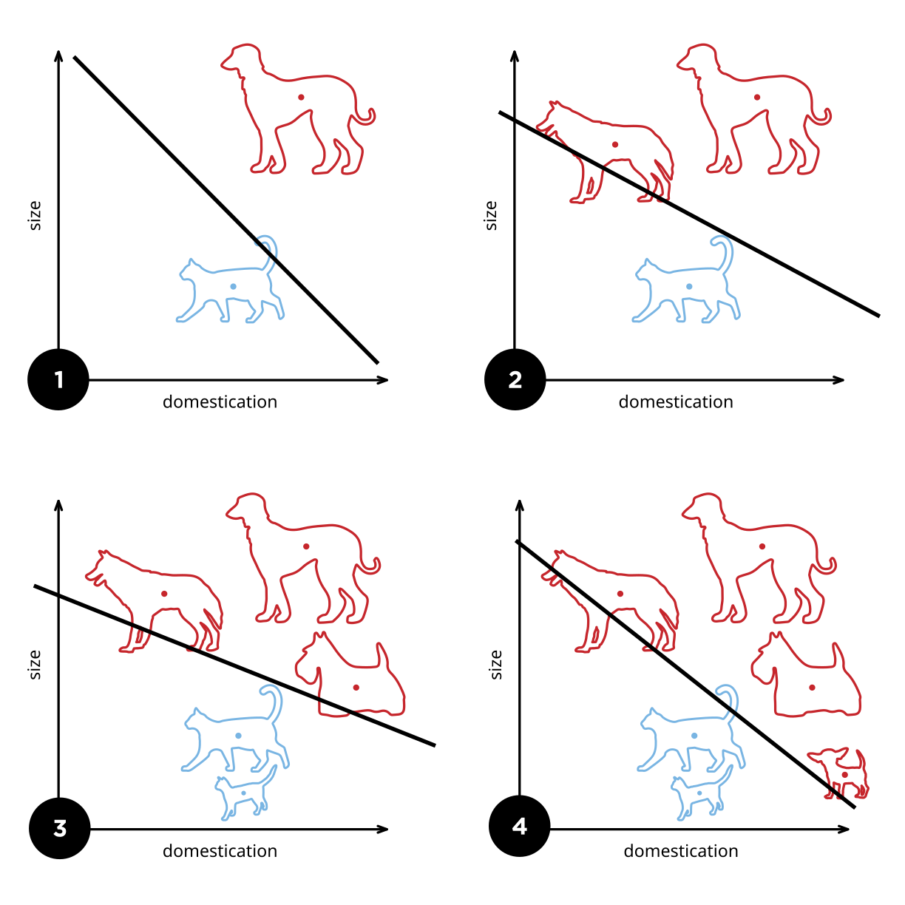
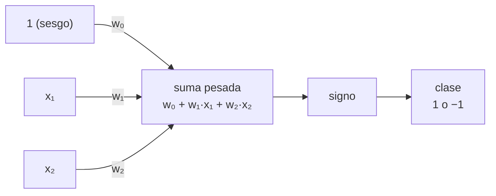

# Capítulo 69 — Proyecto: un perceptrón

Los números de un sistema de reglas los escribe una persona. En el
[capítulo 66](../capitulo-66-proyecto-evidencia-arboles-decision/index.md),
cada regla lleva una fuerza, una probabilidad escrita a mano en una tabla
de hechos
([sección 66.2](../capitulo-66-proyecto-evidencia-arboles-decision/index.md#662-version-1-probabilidades-en-las-reglas)),
y el sistema es tan bueno como esas estimaciones. Este capítulo toma el
camino opuesto: un programa que parte de números arbitrarios y los ajusta
a partir de ejemplos ya clasificados, hasta que los clasifica todos bien.
El [capítulo 68](../capitulo-68-proyecto-espacios-versiones-generalizacion-explicacion/index.md)
aprende un concepto buscando en un espacio de términos; aquí el concepto
es un vector de números, y aprender es ajustarlo. El programa es un **perceptrón**, el clasificador más simple de los que
aprenden de datos: calcula una suma pesada de las entradas y responde con
su signo, y una regla de corrección cambia los pesos cada vez que la
respuesta es incorrecta.



Cuatro etapas del entrenamiento de un perceptrón con dos entradas, el
tamaño (size) y el grado de domesticación (domestication) de un animal.
Los pesos definen una recta, la frontera entre las dos clases; cada
ejemplo mal clasificado la desplaza, y con suficientes ejemplos la recta
deja cada clase de un lado. Es el problema de las versiones 1 y 2: hallar
esa recta a partir de los ejemplos.
Imagen: Elizabeth Goodspeed, [CC BY-SA 4.0](https://creativecommons.org/licenses/by-sa/4.0/),
vía [Wikimedia Commons](https://commons.wikimedia.org/wiki/File:Perceptron_example.svg).

El perceptrón del capítulo, con dos entradas y el sesgo como una entrada
fija en 1, calcula así su respuesta:



El programa crece en cuatro versiones. La primera escribe la regla de
aprendizaje y entrena con un ejemplo por vez, rotando la lista de
ejemplos, hasta que todos quedan bien clasificados. La segunda organiza el
entrenamiento en **épocas**, recorridos completos de los ejemplos hechos
con `foldl/4`, y los repite con el ciclo `iterar/5` del
[capítulo 46](../capitulo-46-proyecto-metodos-numericos/index.md); los
errores de cada época forman la **curva de aprendizaje**. La tercera
detecta cuándo el entrenamiento no puede terminar, porque los pesos se
repiten, y con eso mide cuáles de las dieciséis funciones lógicas de dos
entradas aprende un perceptrón: todas salvo dos, la o exclusiva y su
negación. La cuarta agrega una entrada calculada, el producto de las otras
dos, y con ella la o exclusiva se vuelve aprendible.

El proyecto parte de *Prolog Techniques* de Attila Csenki, distribuido de
manera gratuita por Bookboon
([página de la editorial, copia de archivo](https://web.archive.org/web/20220123025207/https://bookboon.com/en/prolog-techniques-applications-of-prolog-ebook?mediaType=ebook)).
Del apartado 1.6, «Case Study: The Perceptron Training Algorithm», toma la
regla de decisión con un sesgo, la regla de corrección, el entrenamiento
de a un ejemplo por vez con el ejemplo usado pasado al final de la lista,
y los ocho puntos del plano con los que se prueba; del apartado 2.5.2,
«The Perceptron Training Algorithm Revisited», toma la idea de medir el
costo de esa rotación. El código es propio: las épocas, la curva de
aprendizaje, la detección de ciclos y el rasgo nuevo son del curso.

La primera versión corre en SWISH. Las demás cargan el ciclo de iteración
del [capítulo 46](../capitulo-46-proyecto-metodos-numericos/index.md), que
a su vez carga los programas del
[capítulo 32](../capitulo-32-inspeccion-de-terminos/index.md), y se
ejecutan con SWI-Prolog instalado; la quinta carga la primera, y también
se ejecuta localmente.

## Objetivos del capítulo

Al terminar el capítulo, el lector puede:

- representar un clasificador lineal con sus pesos como una lista y
  calcular su respuesta con `foldl/6`;
- programar la regla de aprendizaje del perceptrón como un predicado que
  recibe los pesos y devuelve los pesos corregidos;
- escribir un recorrido de entrenamiento como un plegado con un
  acumulador compuesto de pesos y errores;
- reutilizar un ciclo de iteración con el paso como parámetro, cargándolo
  desde otro capítulo;
- leer una curva de aprendizaje y medir con inferencias el costo de dos
  formas de entrenar;
- demostrar, por la repetición de los pesos, que un conjunto de ejemplos
  no es linealmente separable, y reconocer cuándo esa demostración no está
  disponible;
- volver separable un problema agregando un rasgo calculado a los
  ejemplos;
- escribir una operación sobre listas por recursión simple y con
  acumulador, medir las dos, y reconocer el esquema general de un
  predicado con acumulador.

!!! info "Tiempo estimado"
    Leer el capítulo, ejecutar sus ejemplos y hacer las actividades: **1:45 h**.
    Resolver los 6 ejercicios marcados con ★: **1:55 h**.
    Resolver los 14 ejercicios del final: **4:20 h**.

## 69.1 El programa terminado

`rasgos.pl` carga las tres versiones anteriores y agrega `aprender/3`, que
recibe el nombre de un conjunto de ejemplos y la forma de presentar sus
entradas —`entradas` las deja como están, `producto` agrega el producto de
todas ellas—, entrena un perceptrón desde pesos nulos y responde con el
resultado:

```prolog
?- aprender(y, entradas, R).
R = separa([-6, 4, 2], [2, 3, 3, 2, 1, 0]).

?- aprender(o_exclusivo, entradas, R).
R = ciclo(1, [3, 3, 4]).

?- aprender(o_exclusivo, producto, R).
R = separa([-2, 2, 2, -6], [3, 3, 4, 3, 1, 2, 1, 0]).
```

`separa(Pesos, Curva)` dice que el entrenamiento terminó: los pesos
clasifican bien todos los ejemplos, y la curva da los errores de cada
época, la última sin ninguno. Para la conjunción, los pesos `[-6, 4, 2]`
dan la regla «clase 1 si −6 + 4·x₁ + 2·x₂ ≥ 0», que solo se cumple con
x₁ = x₂ = 1. `ciclo(1, [3, 3, 4])` dice que el entrenamiento nunca
terminará: al final de la tercera época los pesos son los mismos que al
final de la segunda, y desde allí todo se repite. Con el producto de las
entradas como tercera entrada, la o exclusiva se aprende en ocho épocas.
`separables_con/2` cuenta cuántas de las dieciséis funciones lógicas de
dos entradas aprende el perceptrón en cada caso:

```prolog
?- separables_con(entradas, N).
N = 14.

?- separables_con(producto, N).
N = 16.
```

El programa se reparte en cuatro archivos, uno por versión:

| Archivo | Contenido | Sección |
|---|---|---|
| `perceptron.pl` | versión 1: la salida, la regla de corrección y el entrenamiento de a un ejemplo | [69.2](#692-version-1-la-regla-del-perceptron) |
| `epocas.pl` | versión 2: las épocas, el ciclo del [capítulo 46](../capitulo-46-proyecto-metodos-numericos/index.md) y la curva | [69.3](#693-version-2-epocas-y-curva-de-aprendizaje) |
| `ciclos.pl` | versión 3: separables o en ciclo | [69.4](#694-version-3-separables-o-en-ciclo) |
| `rasgos.pl` | versión 4: un rasgo nuevo | [69.5](#695-version-4-un-rasgo-nuevo) |

## 69.2 Versión 1: la regla del perceptrón

Un ejemplo es un término `ej(Entradas, Clase)`: una lista de números y una
clase, 1 o −1. Los conjuntos de ejemplos del capítulo son hechos de
`datos/2`: tres funciones lógicas, con 0 y 1 como entradas y la clase 1
para verdadero, y los ocho puntos del plano de la tabla 1.4 de Csenki,
separados en dos clases.

<!-- ejemplo: capitulo-69/perceptron.pl predicado: datos/2 -->
```prolog
% datos(Nombre, Ejemplos): Ejemplos es un conjunto de entrenamiento.
% y, o, o_exclusivo: las funciones lógicas de dos entradas 0 y 1, con 1
% para verdadero y -1 para falso. puntos: ocho puntos del plano, de dos
% clases (tabla 1.4 de Csenki, «Prolog Techniques»).
datos(y, [ej([0, 0], -1), ej([0, 1], -1), ej([1, 0], -1), ej([1, 1], 1)]).
datos(o, [ej([0, 0], -1), ej([0, 1], 1), ej([1, 0], 1), ej([1, 1], 1)]).
datos(o_exclusivo,
      [ej([0, 0], -1), ej([0, 1], 1), ej([1, 0], 1), ej([1, 1], -1)]).
datos(puntos,
      [ ej([6.981, 0.554], -1), ej([14.414, 4.466], 1),
        ej([2.337, 4.040], -1), ej([8.500, 3.496], 1),
        ej([9.190, 2.000], -1), ej([1.149, 6.100], -1),
        ej([14.786, 2.179], 1), ej([7.842, 6.331], 1)
      ]).
```

Un perceptrón con n entradas tiene n + 1 pesos, `[W0, W1, ..., Wn]`. W0 es
el **sesgo**: multiplica a una entrada fija igual a 1, que no figura en el
ejemplo. La salida es 1 si W0 + W1·X1 + … + Wn·Xn es mayor o igual que
cero, y −1 si es negativa. La suma recorre dos listas a la vez, los pesos
y las entradas, con el sesgo como valor inicial del acumulador; es el uso
de `foldl/6` de la
[sección 18.3](../capitulo-18-orden-superior/index.md#183-foldl46):

<!-- ejemplo: capitulo-69/perceptron.pl predicado: salida/3 sumar_producto/4 -->
```prolog
%!  salida(+Pesos:list(number), +Entradas:list(number), -Clase) is det.
%
%   Clase es 1 si W0 + W1·X1 + ... + Wn·Xn es mayor o igual que cero, y -1
%   si es negativo. Pesos es [W0, W1, ..., Wn] y Entradas [X1, ..., Xn].
salida([W0|Ws], Xs, Clase) :-
    foldl(sumar_producto, Ws, Xs, W0, S),
    (   S >= 0
    ->  Clase = 1
    ;   Clase = -1
    ).

%!  sumar_producto(+W:number, +X:number, +S0:number, -S:number) is det.
%
%   S es S0 + W·X.
sumar_producto(W, X, S0, S) :-
    S is S0 + W * X.
```

```prolog
?- salida([-3, 2, 2], [1, 1], Clase).
Clase = 1.

?- salida([-3, 2, 2], [0, 1], Clase).
Clase = -1.
```

Geométricamente, los puntos con suma nula forman una recta del plano, la
**frontera**, y la salida dice de qué lado de ella está el punto. Con los
pesos `[-3, 2, 2]`, la frontera es 2·x₁ + 2·x₂ = 3, y de los cuatro puntos
con coordenadas 0 y 1 solo `[1, 1]` queda del lado positivo: esos pesos
calculan la conjunción. Un conjunto de ejemplos es **linealmente
separable** cuando alguna recta —en general, algún hiperplano— deja cada
clase de un lado.

La **regla del perceptrón** corrige los pesos con un ejemplo mal
clasificado. Si la salida Y difiere de la clase deseada D, cada peso Wi
suma Tasa·(D − Y)·Xi, con X0 = 1 para el sesgo. La diferencia D − Y vale 2
o −2, y su signo mueve la suma en la dirección que corrige el error: un
ejemplo de clase 1 clasificado como −1 aumenta los pesos de sus entradas
positivas, y la suma para ese ejemplo aumenta. La **tasa de aprendizaje**
es un número positivo fijo que regula el tamaño de la corrección. Un
ejemplo bien clasificado no cambia nada:

<!-- ejemplo: capitulo-69/perceptron.pl predicado: corregir/4 ajustar/4 bien_clasificado/2 -->
```prolog
%!  corregir(+Tasa:number, +Ejemplo, +Pesos0:list, -Pesos:list) is det.
%
%   Pesos son los Pesos0 corregidos por la regla del perceptrón con el
%   Ejemplo ej(Xs, D): si la salida Y es D, no cambian; si no, cada peso
%   Wi suma Tasa·(D - Y)·Xi, con X0 = 1 para el sesgo.
corregir(Tasa, ej(Xs, D), Pesos0, Pesos) :-
    salida(Pesos0, Xs, Y),
    (   Y =:= D
    ->  Pesos = Pesos0
    ;   K is Tasa * (D - Y),
        maplist(ajustar(K), Pesos0, [1|Xs], Pesos)
    ).

%!  ajustar(+K:number, +W0:number, +X:number, -W:number) is det.
%
%   W es W0 + K·X.
ajustar(K, W0, X, W) :-
    W is W0 + K * X.

%!  bien_clasificado(+Pesos:list, +Ejemplo) is semidet.
%
%   Pesos da al Ejemplo ej(Xs, D) la clase D.
bien_clasificado(Pesos, ej(Xs, D)) :-
    salida(Pesos, Xs, Y),
    Y =:= D.
```

```prolog
?- corregir(1, ej([0, 0], -1), [0, 0, 0], Pesos).
Pesos = [-2, 0, 0].
```

Con los pesos nulos, la suma para `[0, 0]` es 0 y la salida es 1; la
clase deseada es −1, así que la corrección vale 1·(−1 − 1) = −2 y solo
cambia el sesgo, porque las dos entradas son nulas.

El entrenamiento aplica la regla a un ejemplo por vez. `entrenar_uno/5`
verifica si los pesos ya clasifican bien todos los ejemplos; si no, corrige
con el primero, lo pasa al final de la lista y sigue. El número de pasos es
un acumulador que empieza en cero, como en la
[sección 8.5](../capitulo-08-aritmetica/index.md#85-acumuladores):

<!-- ejemplo: capitulo-69/perceptron.pl predicado: entrenar_uno/5 entrenar_uno/6 -->
```prolog
%!  entrenar_uno(+Tasa:number, +Ejemplos:list, +Pesos0:list, -Pesos:list,
%!               -Pasos:integer) is det.
%
%   Pesos clasifican bien todos los Ejemplos, y se obtienen desde Pesos0
%   aplicando corregir/4 Pasos veces, con un ejemplo por vez en orden
%   circular. Si los ejemplos no son linealmente separables, no termina.
entrenar_uno(Tasa, Ejemplos, Pesos0, Pesos, Pasos) :-
    entrenar_uno(Tasa, Ejemplos, Pesos0, 0, Pesos, Pasos).

%!  entrenar_uno(+Tasa, +Ejemplos, +Pesos0, +Pasos0:integer, -Pesos,
%!               -Pasos:integer) is det.
%
%   Como entrenar_uno/5, con Pasos0 pasos ya dados: el acumulador.
entrenar_uno(Tasa, [E|Es], Pesos0, Pasos0, Pesos, Pasos) :-
    (   maplist(bien_clasificado(Pesos0), [E|Es])
    ->  Pesos = Pesos0,
        Pasos = Pasos0
    ;   corregir(Tasa, E, Pesos0, Pesos1),
        Pasos1 is Pasos0 + 1,
        append(Es, [E], Es1),
        entrenar_uno(Tasa, Es1, Pesos1, Pasos1, Pesos, Pasos)
    ).
```

`pasos/5`, también de `perceptron.pl`, llama a `entrenar_uno/5` con los
ejemplos de un conjunto de `datos/2` dado por su nombre:

```prolog
?- pasos(y, 1, [0, 0, 0], Pesos, Pasos).
Pesos = [-6, 4, 2],
Pasos = 18.

?- pasos(o, 1, [0, 0, 0], Pesos, Pasos).
Pesos = [-2, 2, 2],
Pasos = 9.

?- pasos(puntos, 0.25, [0.13, -0.51, -0.35], Pesos, Pasos).
Pesos = [-39.870000000000005, 3.0180000000000176, 4.193500000000006],
Pasos = 801.
```

La tercera consulta repite el ejemplo de Csenki, con sus pesos iniciales y
su tasa de 0.25, y da los mismos 801 pasos que el libro informa. Un paso
cuenta aunque el ejemplo esté bien clasificado y los pesos no cambien.

El límite de esta versión es la terminación. Si el conjunto es separable,
un teorema clásico, el de Novikoff (1962), al que Csenki remite a
través de los textos que cita, garantiza que la regla encuentra
pesos que lo separan en un número finito de pasos. Si no lo es, ninguna
corrección deja todos los ejemplos bien clasificados, y `entrenar_uno/5`
no termina. La o exclusiva es el caso más pequeño: `[0, 1]` y `[1, 0]` son
de clase 1, `[0, 0]` y `[1, 1]` de clase −1, y ninguna recta deja los dos
primeros de un lado y los dos últimos del otro, porque los segmentos que
unen cada par se cruzan en el centro del cuadrado. Con un límite de
inferencias, como en la
[sección 26.8](../capitulo-26-pruebas-y-depuracion/index.md#268-el-proyecto-la-bateria-completa),
la consulta se detiene:

```prolog
?- call_with_inference_limit(pasos(o_exclusivo, 1, [0, 0, 0], _, _), 1_000_000, R).
R = inference_limit_exceeded.
```

La respuesta no distingue entre un entrenamiento que necesita más
inferencias y uno que nunca terminará. El costo es el otro límite: cada
paso verifica todos los ejemplos antes de corregir uno solo, y la rotación
con `append/3` copia la lista entera.

!!! question "Actividad"
    Predecir, sin ejecutarlo, qué responde
    `pasos(o, 1, [-2, 2, 2], Pesos, Pasos)`, y por qué. Después, predecir
    si el orden de los ejemplos cambia los pesos finales para la
    conjunción: escribir los cuatro ejemplos de `y` en orden inverso y
    entrenar con `entrenar_uno/5`. Comprobar las dos predicciones.

## 69.3 Versión 2: épocas y curva de aprendizaje

Una **época** recorre todos los ejemplos una vez, corrigiendo los pesos
con cada uno. `epoca/5` es un plegado con `foldl/4` cuyo acumulador es un
par `Pesos-Errores`: cada ejemplo recibe los pesos que dejó el anterior, y
los errores cuentan los ejemplos mal clasificados en el momento de usarlos.

<!-- ejemplo: capitulo-69/epocas.pl predicado: epoca/5 aprender/4 -->
```prolog
%!  epoca(+Tasa:number, +Ejemplos:list, +Pesos0:list, -Pesos:list,
%!        -Errores:integer) is det.
%
%   Pesos son los Pesos0 corregidos con cada uno de los Ejemplos, en
%   orden, y Errores es la cantidad de ejemplos mal clasificados en el
%   momento de usarlos.
epoca(Tasa, Ejemplos, Pesos0, Pesos, Errores) :-
    foldl(aprender(Tasa), Ejemplos, Pesos0-0, Pesos-Errores).

%!  aprender(+Tasa:number, +Ejemplo, +Acumulado0, -Acumulado) is det.
%
%   Acumulado0 es Pesos0-Errores0. Si Pesos0 clasifica bien el Ejemplo,
%   Acumulado es Acumulado0; si no, los pesos se corrigen y los errores
%   aumentan en uno.
aprender(Tasa, Ejemplo, Pesos0-Errores0, Pesos-Errores) :-
    (   bien_clasificado(Pesos0, Ejemplo)
    ->  Pesos = Pesos0,
        Errores = Errores0
    ;   corregir(Tasa, Ejemplo, Pesos0, Pesos),
        Errores is Errores0 + 1
    ).
```

```prolog
?- epoca(1, [ej([0, 0], -1), ej([0, 1], -1), ej([1, 0], -1), ej([1, 1], 1)], [0, 0, 0], Pesos, Errores).
Pesos = [0, 2, 2],
Errores = 2.
```

El primer ejemplo mueve el sesgo a −2; con esos pesos, `[0, 1]` y `[1, 0]`
dan sumas negativas y están bien; `[1, 1]` también da −2, está mal, y lo
corrige. Dos errores.

La época resuelve el costo de la versión 1 con una observación: si una
época termina sin errores, ningún ejemplo cambió los pesos, así que los
pesos del final clasifican bien todos los ejemplos. La verificación ya no
es un recorrido aparte antes de cada paso: la hace la misma época. El
entrenamiento repite épocas hasta la primera sin errores, y ese ciclo es
el de los métodos numéricos. `iterar/5`, de la
[sección 46.2](../capitulo-46-proyecto-metodos-numericos/index.md#462-la-ecuacion-como-termino-y-el-ciclo-de-iteracion),
repite un paso `call(Paso, E0, E, X, Cambio)` hasta que el cambio es menor
o igual que una tolerancia, y devuelve la lista de las aproximaciones X.
Aquí el estado es la lista de pesos, el paso es una época, el cambio son
los errores y la tolerancia es 0. La aproximación que registra cada paso
es el par `Errores-Pesos`, y de la lista de pares salen la curva y los
pesos finales:

<!-- ejemplo: capitulo-69/epocas.pl predicado: maximo_de_epocas/1 -->
```prolog
% maximo_de_epocas(N): el entrenamiento se abandona después de N épocas.
maximo_de_epocas(1000).
```

<!-- ejemplo: capitulo-69/epocas.pl predicado: paso_epoca/6 entrenar/5 -->
```prolog
%!  paso_epoca(+Tasa, +Ejemplos, +Pesos0, -Pesos, -Resultado,
%!             -Errores:integer) is det.
%
%   El paso de una época para iterar/5: Resultado es Errores-Pesos, y el
%   cambio que mide el ciclo son los Errores.
paso_epoca(Tasa, Ejemplos, Pesos0, Pesos, Errores-Pesos, Errores) :-
    epoca(Tasa, Ejemplos, Pesos0, Pesos, Errores).

%!  entrenar(+Tasa:number, +Ejemplos:list, +Pesos0:list, -Pesos:list,
%!           -Curva:list(integer)) is semidet.
%
%   Pesos clasifican bien todos los Ejemplos y Curva es la cantidad de
%   errores de cada época, desde Pesos0; su último elemento es 0. Falla si
%   no hay una época sin errores en maximo_de_epocas/1 épocas.
entrenar(Tasa, Ejemplos, Pesos0, Pesos, Curva) :-
    maximo_de_epocas(Maximo),
    iterar(paso_epoca(Tasa, Ejemplos), 0, Maximo, Pesos0, Resultados),
    pairs_keys_values(Resultados, Curva, Sucesion),
    last(Sucesion, Pesos).
```

El archivo carga `iteracion.pl` con `ensure_loaded/1`; el ciclo no se
copia. El límite es de 1000 épocas y no de 100, el `maximo_de_pasos/1` de
`iterar/4`, por la tercera de las consultas siguientes, hechas con
`curva/5`, que toma los ejemplos de `datos/2` por su nombre:

```prolog
?- curva(y, 1, [0, 0, 0], Pesos, Curva).
Pesos = [-6, 4, 2],
Curva = [2, 3, 3, 2, 1, 0].

?- curva(o, 1, [0, 0, 0], Pesos, Curva).
Pesos = [-2, 2, 2],
Curva = [2, 2, 1, 0].

?- curva(puntos, 0.25, [0.13, -0.51, -0.35], Pesos, Curva), length(Curva, N).
Pesos = [-39.870000000000005, 3.0180000000000176, 4.193500000000006],
Curva = [4, 6, 3, 3, 3, 4, 5, 4, 3|...],
N = 102.
```

Los pesos finales son los de la versión 1, número por número: las dos
versiones corrigen con los mismos ejemplos en el mismo orden, porque
recorrer la lista de principio a fin una y otra vez es la misma sucesión
que rotarla. Para los ocho puntos se necesitan 102 épocas.

La curva de aprendizaje de los puntos no baja de manera regular. Durante
58 épocas oscila entre 3 y 6 errores; el primer 2 aparece en la época 59,
el único 1 en la 101, y la 102 no tiene errores. De las 102 épocas, 61
tienen 3 errores. La regla corrige un ejemplo sin mirar los demás, y la
corrección que arregla uno puede estropear otro: el número de errores no
es una medida que la regla haga decrecer, y la garantía de terminación
dice que la búsqueda termina, no que cada época mejore la anterior. La
frontera final pasa cerca de los puntos, y el
[ejercicio 11](#ejercicios) mide esa distancia.

`costos/5` mide las dos versiones con `inferencias/2`, que cuenta las
inferencias de una meta con `statistics/2`:

<!-- contexto: capitulo-69/epocas.pl -->

```prolog
?- costos(puntos, 0.25, [0.13, -0.51, -0.35], Uno, Epocas).
Uno = 46400,
Epocas = 21758.
```

Las épocas usan menos de la mitad de las inferencias. Aplican la regla a
816 ejemplos (102 épocas de 8) y la versión 1 a 801, casi los mismos; la
diferencia está en lo que la versión 1 agrega a cada paso: la verificación
de los ejemplos antes de corregir uno y la copia de la lista al rotarla.

!!! question "Actividad"
    Con los pesos iniciales de Csenki, la tasa 0.25 necesita 102 épocas.
    Predecir si la tasa 1 necesita más o menos épocas, y comprobarlo con
    `curva/5`. Después, predecir cuántas épocas necesitan las tasas 0.25
    y 1 desde los pesos `[0, 0, 0]`, y comparar los pesos finales de las
    dos. Explicar la diferencia entre los dos casos; el
    [ejercicio 9](#ejercicios) pide demostrarla.

El límite de esta versión es lo que responde cuando el entrenamiento no
termina:

```prolog
?- curva(o_exclusivo, 1, [0, 0, 0], Pesos, Curva).
false.
```

Después de 1000 épocas, `iterar/5` falla, y el fallo no dice nada: ni la
curva, ni si con más épocas se habría llegado a cero errores.

## 69.4 Versión 3: separables o en ciclo

Con entradas enteras, pesos iniciales enteros y una tasa entera, todos los
pesos son enteros. Si el entrenamiento no termina, los pesos del final de
cada época se mantienen en una región acotada —un resultado conocido sobre
el perceptrón, de Minsky y Papert, que aquí no se demuestra—, y en una región acotada hay una
cantidad finita de listas de enteros: tarde o temprano los pesos del final
de una época repiten los de una época anterior. Desde ese momento, como la
época es una función de los pesos, todo se repite, y el entrenamiento no
terminará nunca. Una época sin errores es el caso particular de un ciclo
de largo 1: los pesos no cambiaron.

Detectar la repetición requiere recordar los pesos anteriores. El estado
que `iterar/5` pasa de un paso al siguiente es cualquier término, así que
basta con que sea el par `Pesos-Vistos`, con la lista de los pesos del
final de las épocas anteriores. El paso se detiene —cambio 0— cuando los
pesos nuevos ya estaban entre los vistos:

<!-- ejemplo: capitulo-69/ciclos.pl predicado: paso_con_memoria/6 entrenar_o_ciclo/4 -->
```prolog
%!  paso_con_memoria(+Tasa, +Ejemplos, +Estado0, -Estado, -Resultado,
%!                   -Cambio:integer) is det.
%
%   El paso para iterar/5: Estado0 es Pesos0-Vistos, con Vistos los pesos
%   de las épocas anteriores; Estado es Pesos-[Pesos0|Vistos], Resultado
%   es Errores-Pesos, y Cambio es 0 si Pesos ya estaba entre los vistos, o
%   1 si no.
paso_con_memoria(Tasa, Ejemplos, Pesos0-Vistos, Pesos-[Pesos0|Vistos],
                 Errores-Pesos, Cambio) :-
    epoca(Tasa, Ejemplos, Pesos0, Pesos, Errores),
    (   memberchk(Pesos, [Pesos0|Vistos])
    ->  Cambio = 0
    ;   Cambio = 1
    ).

%!  entrenar_o_ciclo(+Tasa:number, +Ejemplos:list, +Pesos0:list,
%!                   -Resultado) is semidet.
%
%   Resultado es separa(Pesos, Curva) si una época termina sin errores,
%   con Pesos los pesos finales, o ciclo(Largo, Curva) si los pesos del
%   final de una época repiten los de Largo épocas antes con errores.
%   Curva son los errores de cada época. Falla si los pesos no se repiten
%   en maximo_de_epocas/1 épocas, lo que puede ocurrir con pesos de punto
%   flotante.
entrenar_o_ciclo(Tasa, Ejemplos, Pesos0, Resultado) :-
    maximo_de_epocas(Maximo),
    iterar(paso_con_memoria(Tasa, Ejemplos), 0, Maximo, Pesos0-[],
           Resultados),
    pairs_keys_values(Resultados, Curva, Sucesion),
    last(Curva, Errores),
    last(Sucesion, Pesos),
    (   Errores =:= 0
    ->  Resultado = separa(Pesos, Curva)
    ;   reverse([Pesos0|Sucesion], [Ultimo|Anteriores]),
        once(nth1(Largo, Anteriores, Ultimo)),
        Resultado = ciclo(Largo, Curva)
    ).
```

El ciclo es el mismo; lo que cambia es el paso. Cuando el ciclo se
detiene, los errores de la última época deciden el resultado: sin errores,
`separa/2`; con errores, `ciclo/2`, cuyo primer argumento es la distancia,
en épocas, entre los dos pesos iguales. La historia se recorre con
`memberchk/2` en cada época, un costo que crece con el número de épocas y
que en estos ejemplos no se nota. `probar/2` entrena un conjunto por su
nombre, desde pesos nulos y con tasa 1:

<!-- contexto: capitulo-69/ciclos.pl -->

```prolog
?- probar(y, R).
R = separa([-6, 4, 2], [2, 3, 3, 2, 1, 0]).

?- probar(o_exclusivo, R).
R = ciclo(1, [3, 3, 4]).
```

La o exclusiva entra en ciclo en la tercera época. Los pesos del final de
la segunda son `[0, -2, 0]`, y una época desde ellos comete cuatro errores
y vuelve exactamente a ellos: las cuatro correcciones se anulan.

```prolog
?- epoca(1, [ej([0, 0], -1), ej([0, 1], 1), ej([1, 0], 1), ej([1, 1], -1)], [0, -2, 0], Pesos, Errores).
Pesos = [0, -2, 0],
Errores = 4.
```

El resultado `ciclo/2` es una demostración, no una sospecha: los pesos
repetidos prueban que ninguna época futura terminará sin errores. Y como
el entrenamiento termina siempre que los ejemplos son separables, un ciclo
prueba también que la o exclusiva no es linealmente separable.

!!! example "Patrón 68 — Historia en el estado del ciclo"
    **Problema.** Un ciclo que se detiene al alcanzar una tolerancia puede
    no alcanzarla nunca, y es necesario distinguir un proceso que todavía
    no convergió de uno que repite estados y no convergerá.

    **Versión ingenua.** Confiar en el límite de pasos, como `entrenar/5`
    en la versión 2: después de 1000 épocas `iterar/5` falla, sin la curva
    y sin decir si con más épocas se habría terminado. O escribir otro
    ciclo, con una lista de estados vistos, que repite el de la
    [sección 46.2](../capitulo-46-proyecto-metodos-numericos/index.md#462-la-ecuacion-como-termino-y-el-ciclo-de-iteracion).

    **Patrón.** El ciclo no cambia; cambia el paso. `iterar/5` pasa de un
    paso al siguiente un término cualquiera, y `paso_con_memoria/6` lo usa
    para llevar el par `Pesos-Vistos`: agrega los pesos anteriores a los
    vistos y da cambio 0 cuando los nuevos ya estaban. Si el paso es una
    función del estado, un estado repetido demuestra el ciclo, y
    `entrenar_o_ciclo/4` lo informa como `ciclo(Largo, Curva)`.

    **Cuándo no usarlo.** Cuando los estados no pertenecen a un conjunto
    finito, como los pesos de punto flotante: la repetición exacta no está
    garantizada, y el ciclo termina por el límite de pasos como antes.
    Cuando el paso no es una función del estado, porque depende de un
    orden aleatorio o de un contador: un estado repetido no prueba nada.
    Y cuando el ciclo es largo: `memberchk/2` recorre la historia en cada
    paso, y una historia de n estados cuesta del orden de n² comparaciones.

Con esa demostración, la pregunta «¿qué funciones lógicas aprende un
perceptrón?» se responde midiendo. Una función de dos entradas es una
columna de cuatro clases, una para cada combinación de entradas; hay
2⁴ = 16. `tabla/1` las genera, `ejemplos_de/2` las convierte en ejemplos,
y `no_separables/1` junta las que entran en ciclo:

<!-- ejemplo: capitulo-69/ciclos.pl predicado: tabla/1 clase/1 ejemplos_de/2 ejemplo_de/3 no_separables/1 -->
```prolog
%!  tabla(?Clases:list) is multi.
%
%   Clases es la columna de una función lógica de dos entradas: las clases
%   de [0, 0], [0, 1], [1, 0] y [1, 1], cada una 1 o -1. Hay 16.
tabla(Clases) :-
    length(Clases, 4),
    maplist(clase, Clases).

% clase(C): C es una de las dos clases.
clase(-1).
clase(1).

%!  ejemplos_de(+Clases:list, -Ejemplos:list) is det.
%
%   Ejemplos son los de la función lógica de columna Clases.
ejemplos_de(Clases, Ejemplos) :-
    maplist(ejemplo_de, [[0, 0], [0, 1], [1, 0], [1, 1]], Clases,
            Ejemplos).

%!  ejemplo_de(+Entradas, +Clase, -Ejemplo) is det.
%
%   Ejemplo es ej(Entradas, Clase).
ejemplo_de(Xs, D, ej(Xs, D)).

%!  no_separables(-Tablas:list) is det.
%
%   Tablas son las columnas de las funciones lógicas de dos entradas con
%   las que el entrenamiento, desde pesos nulos y con tasa 1, entra en
%   ciclo.
no_separables(Tablas) :-
    findall(Clases,
            ( tabla(Clases),
              ejemplos_de(Clases, Ejemplos),
              entrenar_o_ciclo(1, Ejemplos, [0, 0, 0], ciclo(_, _))
            ),
            Tablas).
```

!!! question "Actividad"
    Antes de ejecutar `no_separables/1`, predecir cuántas de las dieciséis
    funciones son separables y cuáles no, dibujando los cuatro puntos del
    cuadrado con sus clases. Comprobar la predicción. Después, construir
    los ejemplos de la función «x₁ y no x₂» con `ejemplos_de/2` y
    entrenarlos con `entrenar_o_ciclo/4`.

```prolog
?- no_separables(Tablas).
Tablas = [[-1, 1, 1, -1], [1, -1, -1, 1]].
```

Catorce de las dieciséis funciones son separables; las dos que no lo son
son la o exclusiva y su negación, la equivalencia.

La detección tiene un límite. Con números de punto flotante, el argumento
de la repetición, que cuenta listas de enteros en una región acotada, no
se aplica, y nada garantiza que los pesos se repitan de manera exacta: con los ocho
puntos de Csenki y la clase del último cambiada, un conjunto que no es
separable, no se repiten en 1000 épocas, y `entrenar_o_ciclo/4` falla
como la versión 2. La demostración por repetición vale para entradas y
tasas enteras. El [ejercicio 5](#ejercicios) trata ese caso con otro
criterio.

## 69.5 Versión 4: un rasgo nuevo

La o exclusiva no se separa con una recta en el plano, pero el perceptrón
no está obligado a ver solo las entradas originales. Si cada ejemplo recibe
una tercera entrada calculada, el producto x₁·x₂, los cuatro puntos pasan
a ser puntos del espacio: `[0, 0, 0]`, `[0, 1, 0]`, `[1, 0, 0]` y
`[1, 1, 1]`. El último sale del plano de los otros tres, y un plano del
espacio los separa. Una entrada calculada a partir de las originales se
llama un **rasgo**. El entrenamiento no cambia; cambian los ejemplos que
recibe:

<!-- ejemplo: capitulo-69/rasgos.pl predicado: rasgos/3 multiplicar/3 ampliar/3 -->
```prolog
%!  rasgos(+Rasgos:atom, +Entradas:list(number), -Ampliadas:list(number))
%!      is det.
%
%   Ampliadas son las Entradas que ve el perceptrón según Rasgos:
%   entradas las deja iguales, y producto agrega al final el producto de
%   todas ellas.
rasgos(entradas, Xs, Xs).
rasgos(producto, Xs, Ampliadas) :-
    foldl(multiplicar, Xs, 1, P),
    append(Xs, [P], Ampliadas).

%!  multiplicar(+X:number, +P0:number, -P:number) is det.
%
%   P es P0·X.
multiplicar(X, P0, P) :-
    P is P0 * X.

%!  ampliar(+Rasgos:atom, +Ejemplo0, -Ejemplo) is det.
%
%   Ejemplo es Ejemplo0 con las entradas ampliadas según Rasgos.
ampliar(Rasgos, ej(Xs, D), ej(Ys, D)) :-
    rasgos(Rasgos, Xs, Ys).
```

`aprender/3` es el programa terminado de la
[sección 69.1](#691-el-programa-terminado): amplía los ejemplos y entrena
con la versión 3. `separables_con/2` repite la medición de las dieciséis
funciones con los rasgos pedidos:

<!-- ejemplo: capitulo-69/rasgos.pl predicado: aprender/3 entrenar_ampliados/3 separables_con/2 -->
```prolog
%!  aprender(+Nombre:atom, +Rasgos:atom, -Resultado) is semidet.
%
%   Resultado es el de entrenar_o_ciclo/4 para el conjunto Nombre de
%   datos/2 con las entradas ampliadas según Rasgos, desde pesos nulos y
%   con tasa 1.
aprender(Nombre, Rasgos, Resultado) :-
    datos(Nombre, Ejemplos0),
    entrenar_ampliados(Rasgos, Ejemplos0, Resultado).

%!  entrenar_ampliados(+Rasgos:atom, +Ejemplos0:list, -Resultado)
%!      is semidet.
%
%   Resultado es el de entrenar_o_ciclo/4 para Ejemplos0 con las entradas
%   ampliadas según Rasgos, desde pesos nulos y con tasa 1.
entrenar_ampliados(Rasgos, Ejemplos0, Resultado) :-
    maplist(ampliar(Rasgos), Ejemplos0, Ejemplos),
    pesos_nulos(Ejemplos, Pesos0),
    entrenar_o_ciclo(1, Ejemplos, Pesos0, Resultado).

%!  separables_con(+Rasgos:atom, -Cantidad:integer) is det.
%
%   Cantidad es el número de funciones lógicas de dos entradas que el
%   entrenamiento separa con las entradas ampliadas según Rasgos.
separables_con(Rasgos, Cantidad) :-
    aggregate_all(count,
                  ( tabla(Clases),
                    ejemplos_de(Clases, Ejemplos),
                    entrenar_ampliados(Rasgos, Ejemplos, separa(_, _))
                  ),
                  Cantidad).
```

```prolog
?- aprender(o_exclusivo, producto, R).
R = separa([-2, 2, 2, -6], [3, 3, 4, 3, 1, 2, 1, 0]).
```

Los pesos dan la regla «clase 1 si −2 + 2·x₁ + 2·x₂ − 6·x₁·x₂ ≥ 0»: con
una sola entrada en 1 la suma es 0, y con las dos, −4. Con el rasgo, las
dieciséis funciones son separables, como mostró la
[sección 69.1](#691-el-programa-terminado). El rasgo no se aprende: se
elige. Elegir el rasgo adecuado exige saber algo del problema, y un
perceptrón con otro rasgo, por ejemplo los cuadrados de las entradas,
separa otros conjuntos y no estos. La alternativa es combinar
perceptrones: la o exclusiva es la conjunción de la disyunción y de la
negación de la conjunción, tres funciones separables, y un perceptrón que
recibe las salidas de otros dos la calcula. El
[ejercicio 6](#ejercicios) construye esa red de dos capas.

!!! question "Actividad"
    Predecir si la conjunción necesita más o menos épocas con el rasgo
    producto que sin él, y comprobarlo con `aprender/3`. Explicar el peso
    0 que recibe x₂ en los pesos finales.

## 69.6 Versión 5: vectores y el esquema del acumulador

Csenki escribe la regla del perceptrón con dos operaciones sobre
vectores, el producto por un número y la suma, y propone definirlas por
recursión simple y con acumulador y comparar las dos. La quinta versión
lo hace y mide las inferencias: la recursión simple es la más barata, y
en Prolog no necesita acumulador porque construye la lista resultado
hacia adelante. Muestra también que el orden de los argumentos que usa
Csenki, con el número primero, deja una alternativa pendiente que la
indexación evita con la lista primero. Por último, escribe el
entrenamiento de a un ejemplo con el esquema general del acumulador de
Csenki, un argumento que se transforma hasta una condición de parada y
del que se extrae el resultado, y lo compara con `iterar/5` del
[capítulo 46](../capitulo-46-proyecto-metodos-numericos/index.md). Está
en la página
[Vectores y el esquema del acumulador](vectores.md#vectores-y-el-esquema-del-acumulador).

!!! success "Criterios de calidad"
    | Criterio | En este capítulo |
    |---|---|
    | C1 | cada predicado declara modos y determinación; los entrenamientos que pueden no terminar lo dicen: `entrenar_uno/5` es `det` solo para conjuntos separables, y `entrenar/5` y `entrenar_o_ciclo/4` son `semidet` porque tienen un límite de épocas |
    | C3 | `salida/3` compara la suma antes de unificar la clase, así que `salida(P, Xs, 1)` responde como `salida(P, Xs, C), C = 1`; `aprender/4` y `corregir/4` deciden con la comparación antes de ligar sus salidas |
    | C4 | ningún entrenamiento deja alternativas pendientes; `once/1` elige la posición del peso repetido, que es única |
    | C6 | todo el programa es puro: los pesos y la historia viajan en los argumentos, el ciclo es el del [capítulo 46](../capitulo-46-proyecto-metodos-numericos/index.md) y la tasa es un parámetro |
    | C7 | 80 pruebas en los cinco archivos del programa y 51 en las soluciones; cada afirmación del texto que depende de una ejecución —los 801 pasos, las 102 épocas, los pesos repetidos de la o exclusiva, las catorce y dieciséis funciones— tiene su prueba |

## Ejercicios

Las soluciones están en [la página de soluciones](soluciones.md). La dificultad
va de 1 (se resuelve consultando el capítulo) a 3 (requiere elaboración propia).
Los marcados con ★ son los que no conviene saltear: cubren lo que el capítulo
tiene de propio.

1. ★ **(1)** Predecir, época por época, los pesos y los errores de
   `curva(o, 1, [0, 0, 0], Pesos, Curva)`, aplicando a mano la regla del
   perceptrón, y comprobar la predicción con `epoca/5`.
2. **(1)** Entrenar la conjunción con `entrenar/5` y los ejemplos en orden
   inverso. Comparar los pesos y la curva con los de la
   [sección 69.3](#693-version-2-epocas-y-curva-de-aprendizaje), y explicar por qué los
   dos resultados son correctos.
3. ★ **(2)** Escribir `errores/3`, que da la cantidad de ejemplos que
   unos pesos clasifican mal, con su encabezado PlDoc, y usarlo para
   contar los errores de los pesos iniciales de Csenki sobre los ocho
   puntos.
4. ★ **(2)** Csenki propone, como ejercicio, entrenar durante un número
   fijo de iteraciones. Escribir `entrenar_n/6`, que hace exactamente N
   épocas con `foldl/4` sobre la lista de 1 a N y da los pesos finales y
   la curva completa. Obtener las seis primeras épocas de la o exclusiva y
   las cinco primeras de la disyunción.
5. **(3)** Si se cambia la clase del último de los ocho puntos, el
   conjunto deja de ser separable y `entrenar_o_ciclo/4` falla. Escribir
   `entrenar_bolsillo/6`, que hace N épocas y guarda los pesos del final
   de época con menos errores —el algoritmo «del bolsillo»—, y encontrar
   con 200 épocas unos pesos que se equivoquen en un solo punto.
6. ★ **(3)** Construir un perceptrón de dos capas para la o exclusiva:
   entrenar por separado la disyunción, la negación de la conjunción y la
   conjunción, y escribir `salida_capas/3`, que pasa las salidas de los
   dos primeros, convertidas a 0 y 1, al tercero. Comprobar que clasifica
   bien los cuatro ejemplos.
7. **(2)** Para más de dos clases se entrena un perceptrón por clase, que
   separa esa clase de todas las demás, y se responde con la clase cuyo
   perceptrón da la mayor suma. Escribir `entrenar_clases/2` y
   `clase_de/3`, y probarlos con nueve puntos del plano en tres grupos.
   ¿Qué clase recibe el punto `[3, 3]`?
8. **(2)** Escribir `recta(Pesos, Pendiente, Ordenada)`, que da la
   frontera de un perceptrón de dos entradas como y = Pendiente·x +
   Ordenada. Calcularla para los pesos finales de los ocho puntos, y
   clasificar con esos pesos los puntos nuevos `[10, 5]` y `[4, 2]`.
9. **(2)** Demostrar que, desde pesos nulos, entrenar con la tasa c da en
   cada época los pesos de la tasa 1 multiplicados por c, y por lo tanto la
   misma curva. Comprobarlo con los ocho puntos y las tasas 0.25 y 1.
   ¿Por qué la demostración no vale desde los pesos iniciales de Csenki?
10. ★ **(2)** Csenki reemplaza la rotación con `append/3` por una cola
    hecha con una lista diferencia, como las de la
    [sección 34.3](../capitulo-34-estructuras-incompletas-y-listas-diferencia/index.md#343-colas).
    Escribir `entrenar_cola/5` de esa manera, comprobar que da los mismos
    pesos y pasos que `entrenar_uno/5`, y medir las inferencias de las
    dos. ¿Qué parte del costo de la versión 1 elimina la cola, y qué parte
    elimina la versión 2?
11. **(2)** El **margen** de unos pesos es la menor distancia con signo de
    los ejemplos a la frontera. Escribir `margen/3` y calcular el margen
    de los pesos finales de la conjunción y el de los dos entrenamientos
    de los ocho puntos, desde los pesos de Csenki y desde pesos nulos.
    ¿Qué indica un margen nulo?
12. **(2)** Nueve puntos enteros del plano tienen clase 1 dentro del
    círculo de radio 2 con centro en el origen y −1 fuera de él. Mostrar
    con `entrenar_o_ciclo/4` que no son separables, y que lo son si cada
    punto se reemplaza por los cuadrados de sus coordenadas. Explicar por
    qué ese rasgo sirve para este conjunto y no para la o exclusiva.
13. ★ **(2)** Escribir `suma_rec/2` y `suma_acc/2`, la suma de los
    elementos de un vector por recursión simple y con acumulador, medir
    sus inferencias con mil elementos, y sumar los números de 1 a 200 000
    con cada una con las pilas limitadas a 12 000 000 de bytes con el
    indicador `stack_limit`. Explicar por qué aquí el acumulador conviene
    y en `escalar_rec/3` de la
    [sección 69.6](vectores.md#el-costo-de-cada-forma) no.
14. **(2)** Escribir `esquema_general/5`, el esquema del acumulador de la
    [sección 69.6](vectores.md#el-esquema-general-del-acumulador) con la
    condición de parada, la extracción y la transformación como
    parámetros, y usarlo para entrenar el perceptrón con las partes de
    `vectores.pl` y para calcular el menor elemento de una lista no
    vacía.

## Resumen

| | |
|---|---|
| **perceptrón** | clasifica por el signo de una suma pesada de las entradas más un sesgo |
| **sesgo** | el peso de una entrada fija igual a 1; desplaza la frontera |
| **frontera** | los puntos con suma nula: una recta en el plano, un hiperplano en general |
| **linealmente separable** | un conjunto cuyas clases deja un hiperplano cada una de un lado |
| **regla del perceptrón** | con un ejemplo mal clasificado, cada peso suma Tasa·(D − Y)·Xi |
| **tasa de aprendizaje** | el factor fijo de la corrección |
| **época** | un recorrido completo de los ejemplos; una época sin errores termina el entrenamiento |
| **curva de aprendizaje** | los errores de cada época; no tiene por qué decrecer |
| **ciclo** | los pesos del final de una época repiten los de otra; con pesos enteros, prueba que el conjunto no es separable |
| **rasgo** | una entrada calculada a partir de las originales, que puede volver separable un conjunto |
| `datos/2`, `corregir/4`, `bien_clasificado/2` | los ejemplos, la respuesta y la regla |
| `entrenar_uno/5`, `pasos/5`, `inferencias/2` | la versión 1 y su medición |
| `epoca/5`, `entrenar/5`, `curva/5`, `costos/5` | la versión 2, sobre `iterar/5` del [capítulo 46](../capitulo-46-proyecto-metodos-numericos/index.md) |
| `entrenar_o_ciclo/4`, `probar/2`, `tabla/1`, `no_separables/1` | la versión 3 |
| **[Patrón 68](../patrones.md#68-historia-en-el-estado-del-ciclo)** | historia en el estado del ciclo |
| `rasgos/3`, `ampliar/3`, `aprender/3`, `separables_con/2` | la versión 4 |
| **esquema del acumulador** | un argumento que se transforma hasta cumplir una condición de parada, y del que se extrae el resultado |
| `escalar_rec/3`, `sumar_rec/3`, `escalar_acc/3`, `sumar_acc/3`, `corregir_vectores/4`, `costos_vectores/2`, `entrenar_esquema/5` | la versión 5 |

## Temas que se retoman

| Tema | Se retoma en |
|---|---|
| Umbrales ajustados a partir de datos para separar lo normal de lo anómalo | [capítulo 84](../capitulo-84-proyecto-analisis-registros/index.md) |

## Referencias

- Attila Csenki, *Prolog Techniques*, Ventus Publishing (Bookboon), 2009 —
  apartado 1.6, «Case Study: The Perceptron Training Algorithm», y
  apartado 2.5.2, «The Perceptron Training Algorithm Revisited».
  [Página de la editorial, copia de archivo](https://web.archive.org/web/20220123025207/https://bookboon.com/en/prolog-techniques-applications-of-prolog-ebook?mediaType=ebook).
  El capítulo toma del primero la regla de decisión con un sesgo, la regla
  de corrección con la diferencia entre la clase deseada y la obtenida, el
  entrenamiento de a un ejemplo por vez con el ejemplo usado pasado al
  final, la tabla de ocho puntos con sus pesos iniciales y su tasa, que
  la versión 1 reproduce con los mismos 801 pasos, y el ejercicio de
  entrenar un número fijo de iteraciones, el ejercicio de escribir el
  producto de un vector por un número y la suma de vectores por recursión
  simple y con acumulador, y el esquema general de los predicados con
  acumulador de su apartado 1.5; del segundo, la cola con una
  lista diferencia en lugar de la rotación con `append/3`, y la medición
  de su costo en inferencias. Para el algoritmo y su convergencia, Csenki
  remite a tres textos generales: Achim Hoffmann, *Paradigms of
  Artificial Intelligence*, Springer, 1998; Michael Negnevitsky,
  *Artificial Intelligence: A Guide to Intelligent Systems*,
  Addison-Wesley, 2002, y Stuart Russell y Peter Norvig, *Artificial
  Intelligence: A Modern Approach*, Prentice Hall, 1995 (Csenki lo cita
  con el nombre de Nilsson en lugar del de Russell). El capítulo no toma
  nada de ellos que no esté en Csenki.
- Frank Rosenblatt, «The perceptron: a probabilistic model for
  information storage and organization in the brain», *Psychological
  Review* 65(6), 1958, págs. 386–408,
  [doi:10.1037/h0042519](https://doi.org/10.1037/h0042519). Es el origen
  del perceptrón y de su regla de corrección, que los textos que cita
  Csenki presentan.
- Albert B. J. Novikoff, «On convergence proofs on perceptrons», en
  *Proceedings of the Symposium on the Mathematical Theory of Automata*,
  vol. 12, Polytechnic Institute of Brooklyn, 1962, págs. 615–622. Sin
  edición en línea de acceso libre verificada. Demuestra que la regla
  termina en una cantidad finita de correcciones cuando los ejemplos son
  separables: el teorema que enuncia la
  [sección 69.2](#692-version-1-la-regla-del-perceptron).
- Marvin Minsky y Seymour Papert, *Perceptrons: An Introduction to
  Computational Geometry*, MIT Press, 1969. Sin edición en línea de
  acceso libre verificada. Estudia lo que un perceptrón no puede
  representar, con la o exclusiva como el caso más simple, y muestra que
  sin separabilidad los pesos quedan acotados y el entrenamiento se
  repite: la base de las versiones 3 y 4.

El código del capítulo es propio, escrito para el curso: de la fuente se
toman la regla, los datos y la idea de la rotación, no el código; las
épocas como plegado, el uso del ciclo del
[capítulo 46](../capitulo-46-proyecto-metodos-numericos/index.md), la
curva de aprendizaje, la detección de ciclos, la medición de las
dieciséis funciones, el rasgo producto y la medición de las dos formas
de las operaciones con vectores son del curso.
