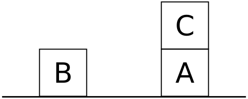
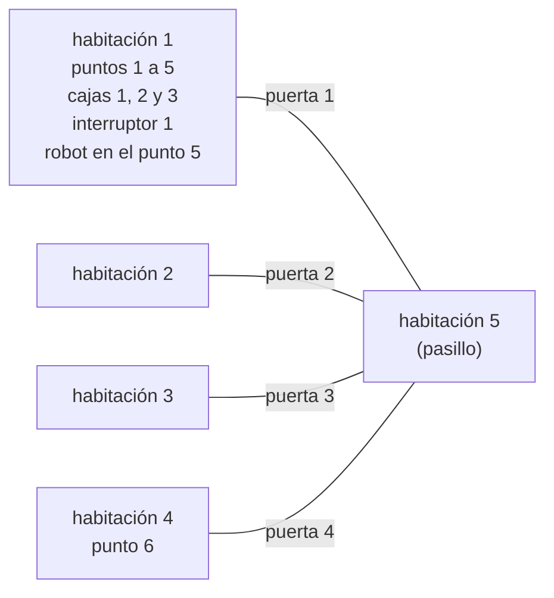

# Capítulo 70 — Proyecto: planificación por regresión

La [sección 40.6](../capitulo-40-busqueda-y-planificacion/planificacion.md#planificacion-operadores-strips-y-analisis-de-medios-y-fines)
planifica en el mundo de bloques por análisis de medios y fines: elige una
meta que el estado no cumple, un operador que la logra, planifica antes sus
precondiciones y sigue desde el estado al que llega. Ese método logra las
metas una después de la otra, y la anomalía de Sussman (el problema de los
tres bloques de la tesis de Gerald Sussman, 1973) muestra su límite:
en el mundo sin pinza, el plan más corto que construye tiene cuatro
acciones donde alcanzan tres, porque no **intercala** una acción que
prepara una meta mientras logra otra. Este capítulo construye el
planificador que la sección nombra al final, WARPLAN, de David Warren
(memo «WARPLAN: a system for generating plans», 1974). Planifica hacia atrás: un hecho vale después de un plan si la
última acción lo agrega, o si valía antes y la acción no lo borra, y esa
**regresión** a través de las acciones permite insertar una acción nueva en
cualquier punto del plan, no solo al final. Las metas ya logradas quedan
**protegidas**: ninguna acción nueva puede borrarlas.



El estado inicial de la anomalía de Sussman: el cubo C está sobre el A, y
los cubos A y B están sobre la mesa. Las metas son A sobre B y B sobre C,
una torre con C abajo. Imagen: Eyrian, en la Wikipedia en inglés,
[CC BY-SA 3.0](https://creativecommons.org/licenses/by-sa/3.0/), vía
[Wikimedia Commons](https://commons.wikimedia.org/wiki/File:Sussman-anomaly-1.svg).

El programa terminado resuelve la anomalía con tres movimientos, y en el
mundo del robot de STRIPS encuentra cómo encender la luz:

<!-- contexto: capitulo-70/warplan.pl -->
```prolog
?- once(planificar(cubos, sussman, [sobre(a, b), sobre(b, c)], 6, Plan)).
Plan = [mover(c, a, mesa), mover(b, mesa, c), mover(a, mesa, b)].

?- once(planificar(robot, strips1, [estado(interruptor(1), encendido)], 6, Plan)).
Plan = [acercarse(caja(1), habitacion(1)), empujar(caja(1), interruptor(1), habitacion(1)), subir(caja(1)), encender(interruptor(1))].
```

El programa crece en cuatro versiones. Antes de ellas, el mundo se
describe con siete predicados que el planificador consulta sin conocerlo,
y un predicado calcula por regresión lo que vale después de un plan. La
versión 1 planifica hacia atrás, protege las metas logradas y pone cada
acción al final del plan. La versión 2 es WARPLAN: si la acción no puede ir
al final, la inserta antes. La versión 3 aplica el mismo planificador a
otro mundo, el del robot, con hechos que ninguna acción cambia. La versión
4 traduce los operadores STRIPS del [capítulo 40](../capitulo-40-busqueda-y-planificacion/index.md) a la descripción de
WARPLAN y compara los dos planificadores sobre el mismo mundo.

El proyecto parte del apartado «Planning» del capítulo «Two case studies»
de *Prolog for Programmers*, de Feliks Kluźniak y Stanisław Szpakowicz
([edición en línea](https://www.site.uottawa.ca/~szpak/pub/P4P/Prolog_for_Programmers_neat.pdf)).
De él toma la separación entre la descripción del mundo y el planificador,
los predicados de esa descripción, el estado que nunca se guarda, la
regresión de un hecho a través del plan, los hechos protegidos, la
inserción de una acción antes de la última con la regresión de los
protegidos, la prueba de consistencia con las combinaciones imposibles, la
comparación de hechos con variables sobre una copia sin variables, el
mundo de los cubos y el del robot, y los planes que el libro publica como
resultados. El código es propio: la cota de acciones, las listas en lugar
de conjunciones, la traducción de los operadores del [capítulo 40](../capitulo-40-busqueda-y-planificacion/index.md) y las
mediciones son del curso. Todos los archivos son módulos que cargan otros
archivos, y se ejecutan en una instalación local, no en SWISH.

## Objetivos del capítulo

Al terminar el capítulo, el lector puede:

- describir un mundo por sus acciones, con lo que cada una exige, agrega y
  borra, sin guardar ningún estado;
- decidir por regresión si un hecho vale después de un plan;
- planificar hacia atrás con metas protegidas, y explicar por qué poner
  cada acción al final no resuelve la anomalía de Sussman;
- insertar una acción antes en el plan regresando los hechos protegidos,
  y resolver con eso la anomalía;
- comparar dos planificadores por la longitud de sus planes y por las
  inferencias que cuestan, sobre el mismo mundo.

!!! info "Tiempo estimado"
    Leer el capítulo, ejecutar sus ejemplos y hacer las actividades: **1:25 h**.
    Resolver los 5 ejercicios marcados con ★: **1:35 h**.
    Resolver los 12 ejercicios del final: **3:45 h**.

## 70.1 El mundo como descripción

El mundo de los cubos tiene tres cubos, a, b y c, y la mesa. La única
acción es `mover(U, V, W)`: lleva el cubo libre U, que está sobre V, a W,
que es la mesa o un cubo libre. Los hechos son `sobre(U, V)` y
`libre(U)`, que dice que nada está sobre U. Un estado es el conjunto de los
hechos que valen en él, pero el planificador no guarda ninguno: le alcanza
con saber qué hace cada acción. `agrega/2` y `borra/2` lo dicen, en el
orden hecho y acción, de modo que la misma relación responde qué acciones
logran un hecho:

<!-- ejemplo: capitulo-70/cubos.pl predicado: agrega/2 borra/2 -->
```prolog
%!  agrega(?Hecho, ?Accion) is nondet.
%
%   Accion hace valer Hecho: el cubo movido queda sobre su destino, y su
%   origen queda libre si es un cubo.
agrega(sobre(U, W), mover(U, _, W)).
agrega(libre(V), mover(_, V, _)) :-
    V \== mesa.

%!  borra(?Hecho, ?Accion) is nondet.
%
%   Accion puede hacer que Hecho deje de valer: el cubo movido deja de
%   estar donde estaba, y el destino deja de estar libre.
borra(sobre(U, _), mover(U, _, _)).
borra(libre(W), mover(_, _, W)).
```

`borra/2` borra de más: `borra(sobre(U, _), mover(U, _, _))` dice que el
cubo movido deja de estar sobre cualquier cosa, porque no hace falta saber
sobre qué estaba. `agrega/2` no libera la mesa: la mesa siempre tiene
lugar.

`puede/2` da las precondiciones de cada acción. Las dos cláusulas separan
el movimiento a la mesa, que no exige un destino libre, del movimiento a
un cubo. Entre las precondiciones hay **pruebas**, como `distinto(U, W)`,
que no son hechos del mundo: se deciden llamándolas, y `prueba/1` las
declara. `distinto/2` falla si uno de sus argumentos está libre, porque
dos objetos que todavía no se conocen pueden ser el mismo; por eso cada
prueba va después de los hechos que ligan sus variables:

<!-- ejemplo: capitulo-70/cubos.pl predicado: puede/2 prueba/1 distinto/2 -->
```prolog
%!  puede(?Accion, -Precondiciones:list) is nondet.
%
%   Accion se puede ejecutar en un estado donde valen las Precondiciones.
%   Las pruebas van después de los hechos que ligan sus variables.
puede(mover(U, V, mesa), [sobre(U, V), distinto(V, mesa), libre(U)]).
puede(mover(U, V, W), [libre(W), distinto(W, mesa), sobre(U, V),
                       distinto(U, W), libre(U)]).

% prueba(H): H se decide llamándolo.
prueba(distinto(_, _)).

%!  distinto(+X, +Y) is semidet.
%
%   X e Y son objetos distintos. Con una variable libre falla: dos
%   objetos que todavía no se conocen pueden ser el mismo.
distinto(X, Y) :-
    X \= Y.
```

Los tres predicados que quedan completan la descripción. `imposible/1`
lista las combinaciones de hechos que no pueden valer juntas: un cubo con
algo encima y libre, un cubo en dos lugares, dos cubos sobre el mismo
cubo, un cubo sobre sí mismo. `siempre/1` da los hechos que ninguna acción
cambia; en los cubos no hay ninguno, y el predicado se declara dinámico y
sin cláusulas. `dado/2` da los hechos del estado inicial, que tiene un
nombre:

<!-- ejemplo: capitulo-70/cubos.pl predicado: imposible/1 dado/2 -->
```prolog
% imposible(Hs): los hechos de Hs no pueden valer juntos.
imposible([sobre(_, Y), libre(Y)]).
imposible([sobre(X, Y), sobre(X, Z), distinto(Y, Z)]).
imposible([sobre(X, Z), sobre(Y, Z), distinto(Z, mesa), distinto(X, Y)]).
imposible([sobre(X, X)]).

% dado(I, H): H vale en el estado inicial I. En sussman, c está sobre a,
% y a y b sobre la mesa.
dado(sussman, sobre(a, mesa)).
dado(sussman, sobre(b, mesa)).
dado(sussman, sobre(c, a)).
dado(sussman, libre(b)).
dado(sussman, libre(c)).
```

El planificador recibe el nombre del módulo del mundo como primer
argumento y llama a `Mundo:agrega(H, A)`, `Mundo:puede(A, Pre)` y los
demás, como la búsqueda del
[capítulo 40](../capitulo-40-busqueda-y-planificacion/index.md#401-el-problema-como-interfaz) recibe el problema como término. Otro mundo es
otro módulo con los mismos siete predicados.

## 70.2 Lo que vale después de un plan

Un plan es una lista de acciones. El estado al que lleva se calcula hecho
por hecho y hacia atrás: un hecho vale después del plan si la última
acción lo agrega, o si la última acción no lo borra y el hecho vale
después del resto del plan; antes de la primera acción, vale si está dado.
La recursión empieza por la última acción, de modo que el planificador
guarda las acciones hechas al revés, la última primero, y `vale/4` las
recorre desde la cabeza:

<!-- ejemplo: capitulo-70/regresion.pl predicado: vale/4 -->
```prolog
%!  vale(+Mundo, +Inicio, ?Hecho, +Hechas:list) is nondet.
%
%   Hecho vale después de ejecutar, desde el estado inicial Inicio del
%   Mundo, las acciones de Hechas, que está al revés: la última primero.
vale(Mundo, _, Hecho, [Accion|_]) :-
    Mundo:agrega(Hecho, Accion).
vale(Mundo, Inicio, Hecho, [Accion|Antes]) :-
    preservada(Mundo, Hecho, Accion),
    vale(Mundo, Inicio, Hecho, Antes),
    preservada(Mundo, Hecho, Accion).
vale(Mundo, Inicio, Hecho, []) :-
    Mundo:dado(Inicio, Hecho).
```

La segunda cláusula comprueba dos veces que la acción no borra el hecho:
antes de la llamada recursiva, que puede ligar las variables del hecho, y
después, con las variables ya ligadas. `preservada/3` hace esa prueba con
una idea del libro. La acción y el hecho pueden tener variables libres,
porque el planificador elige las acciones antes de conocer todos sus
argumentos; una variable libre se toma como un objeto desconocido,
distinto de todos los conocidos y de las otras variables. Para eso la
prueba se hace sobre una copia donde `numbervars/3` convierte cada variable
en un término `'$VAR'(N)`, dentro de una doble negación que deshace las
ligaduras, como en la
[sección 32.5](../capitulo-32-inspeccion-de-terminos/index.md#325-variables-como-datos):

<!-- ejemplo: capitulo-70/regresion.pl predicado: preservada/3 -->
```prolog
%!  preservada(+Mundo, +Hecho, +Accion) is semidet.
%
%   Accion no borra Hecho. Las variables libres de los dos términos se
%   toman como objetos desconocidos, distintos de todo objeto conocido y
%   entre sí: la prueba se hace sobre una copia sin variables, y no liga
%   nada.
preservada(Mundo, Hecho, Accion) :-
    \+ \+ ( numbervars(Hecho-Accion, 0, _),
            \+ Mundo:borra(Hecho, Accion) ).
```

Después de mover c a la mesa, c está sobre la mesa; después de mover
además b sobre c, los cubos libres son a y b:

```prolog
?- vale(cubos, sussman, sobre(c, X), [mover(c, a, mesa)]).
X = mesa ;
false.

?- vale(cubos, sussman, libre(X), [mover(b, mesa, c), mover(c, a, mesa)]).
X = a ;
X = b ;
false.
```

Con un destino todavía libre, `preservada/3` da por preservado `libre(b)`;
con el destino b, no. La primera respuesta es optimista, y el planificador
la vuelve a comprobar cuando el destino ya se conoce:

```prolog
?- preservada(cubos, libre(b), mover(c, a, W)).
true.

?- preservada(cubos, libre(b), mover(c, a, b)).
false.
```

Con `vale/4`, `regresion.pl` también comprueba planes escritos a mano:
`ejecutable/3` verifica que antes de cada acción valen sus precondiciones,
y `logra/4` además que al final valen las metas. Todas las pruebas del
capítulo pasan cada plan encontrado por `logra/4`:

```prolog
?- logra(cubos, sussman, [mover(c, a, mesa), mover(b, mesa, c), mover(a, mesa, b)], [sobre(a, b), sobre(b, c)]).
true.

?- logra(cubos, sussman, [mover(c, a, mesa), mover(a, mesa, b)], [sobre(a, b), sobre(b, c)]).
false.
```

!!! question "Actividad"
    Predecir qué responde `vale(cubos, sussman, sobre(X, mesa), [mover(c,
    b, mesa), mover(c, a, b)])`, teniendo en cuenta que la lista está al
    revés: la primera acción ejecutada es la segunda de la lista.
    Comprobarlo, y explicar el orden de las respuestas con las tres
    cláusulas de `vale/4`.

## 70.3 Versión 1: extender el plan y proteger las metas

La primera versión planifica hacia atrás. Las metas se resuelven en orden,
y cada una puede estar en uno de cuatro casos: vale siempre; es una prueba
que se cumple; ya vale después de las acciones hechas, y entonces queda
**protegida**; o una acción la agrega, y entonces se planifican las
precondiciones de esa acción, la acción se pone al final y la meta queda
protegida. Ninguna acción nueva puede borrar un hecho protegido: así una
meta lograda no se deshace al lograr la siguiente. `resolver/9` tiene una
cláusula por caso:

<!-- ejemplo: capitulo-70/extension.pl predicado: resolver/9 lograr/8 -->
```prolog
%!  resolver(+Mundo, +Inicio, +Meta, +Protegidas0:list, -Protegidas:list,
%!           +Hechas0:list, -Hechas:list, +Cota0, -Cota) is nondet.
%
%   Meta vale después de Hechas: porque vale siempre, porque es una prueba
%   que se cumple, porque ya vale después de Hechas0, o porque una acción
%   la logra. En los dos últimos casos Meta pasa a estar protegida.
resolver(Mundo, _, Meta, Ps, Ps, Hechas, Hechas, Cota, Cota) :-
    Mundo:siempre(Meta).
resolver(Mundo, _, Meta, Ps, Ps, Hechas, Hechas, Cota, Cota) :-
    es_prueba(Mundo, Meta),
    call(Mundo:Meta).
resolver(Mundo, Inicio, Meta, Ps0, Ps, Hechas, Hechas, Cota, Cota) :-
    \+ es_prueba(Mundo, Meta),
    vale(Mundo, Inicio, Meta, Hechas),
    proteger(Meta, Ps0, Ps).
resolver(Mundo, Inicio, Meta, Ps, [Meta|Ps], Hechas0, Hechas, Cota0,
         Cota) :-
    \+ es_prueba(Mundo, Meta),
    gastar(Cota0, Cota1),
    Mundo:agrega(Meta, Accion),
    lograr(Mundo, Inicio, Accion, Ps, Hechas0, Hechas, Cota1, Cota).

%!  lograr(+Mundo, +Inicio, +Accion, +Protegidas:list, +Hechas0:list,
%!         -Hechas:list, +Cota0, -Cota) is nondet.
%
%   Hechas es Hechas0 más las acciones que logran las precondiciones de
%   Accion, y Accion al final. Accion no borra ningún hecho protegido.
lograr(Mundo, Inicio, Accion, Ps, Hechas0, [Accion|Hechas1], Cota0,
       Cota) :-
    no_borra_ninguna(Mundo, Accion, Ps),
    Mundo:puede(Accion, Pre),
    \+ inconsistente(Mundo, Pre, Ps),
    planear(Mundo, Inicio, Pre, Ps, _, Hechas0, Hechas1, Cota0, Cota),
    no_borra_ninguna(Mundo, Accion, Ps).
```

`lograr/8` comprueba que la acción no borra ningún protegido antes de
planificar sus precondiciones, con las variables todavía libres, y otra vez
después, con las variables ya ligadas: la acción `mover(c, a, W)` no borra
`libre(b)` hasta que W queda ligada a b. Antes de planificar, descarta las
precondiciones que contradicen a los protegidos, con `inconsistente/3`:
sobre una copia sin variables, busca una combinación de `imposible/1` cuyos
hechos estén todos entre las precondiciones y los protegidos, y cuyas
pruebas se cumplan. Los hechos protegidos mientras se planifican las
precondiciones quedan en la llamada interna: al volver, la lista de
protegidos es la de antes más la meta.

Esta búsqueda puede no terminar. Para liberar c hay que mover lo que está
sobre c, cuya precondición es que algo esté sobre c; para lograr eso hay
que mover un cubo a c, que exige que c esté libre; y así sin fin. Como en
la [sección 40.4](../capitulo-40-busqueda-y-planificacion/index.md#404-profundidad-limitada-y-profundizacion-iterativa),
la solución es una cota: cada acción gasta una unidad, y `planificar/5`
prueba cotas de 0 a un máximo y exige gastarlas todas. Los planes salen de
menor a mayor longitud, y el primero es uno de los más cortos que el
método construye:

<!-- ejemplo: capitulo-70/extension.pl predicado: planificar/5 gastar/2 -->
```prolog
%!  planificar(+Mundo, +Inicio, +Metas:list, +Maximo:integer, -Plan:list)
%!      is nondet.
%
%   Plan, en el orden en que se ejecuta, tiene a lo sumo Maximo acciones y
%   lleva desde el estado inicial Inicio del Mundo a un estado donde valen
%   todas las Metas. Los planes se dan de menor a mayor longitud.
planificar(Mundo, Inicio, Metas, Maximo, Plan) :-
    \+ inconsistente(Mundo, Metas, []),
    between(0, Maximo, N),
    planear(Mundo, Inicio, Metas, [], _, [], Hechas, N, 0),
    reverse(Hechas, Plan).

%!  gastar(+Cota0, -Cota) is semidet.
%
%   Queda por lo menos una acción en Cota0, y Cota es una menos. La cota
%   sin_cota no se gasta nunca.
gastar(sin_cota, sin_cota) :-
    !.
gastar(Cota0, Cota) :-
    Cota0 > 0,
    Cota is Cota0 - 1.
```

Una sola meta se logra con una acción. Las dos metas de la anomalía de
Sussman piden más:

<!-- contexto: capitulo-70/extension.pl -->
```prolog
?- planificar(cubos, sussman, [sobre(c, b)], 1, Plan).
Plan = [mover(c, a, b)] ;
false.

?- once(planificar(cubos, sussman, [sobre(a, b), sobre(b, c)], 8, Plan)).
Plan = [mover(c, a, mesa), mover(b, mesa, a), mover(b, a, c), mover(a, mesa, b)].

?- planificar(cubos, sussman, [sobre(a, b), sobre(b, c)], 3, Plan).
false.
```

Con tres acciones no hay plan, y el de cuatro da un rodeo. Para
`sobre(a, b)`, la acción final es `mover(a, mesa, b)`, con la precondición
`libre(a)`. La versión 1 la logra con `mover(b, a, c)`, que libera a
porque saca b de encima; para eso b tiene que estar sobre a
(`mover(b, mesa, a)`), y para eso a tiene que estar libre
(`mover(c, a, mesa)`). El rodeo deja b sobre c de paso, y la segunda meta
ya vale cuando llega su turno. Es el mismo efecto lateral que
[en el capítulo 40](../capitulo-40-busqueda-y-planificacion/planificacion.md#planificacion-operadores-strips-y-analisis-de-medios-y-fines)
lleva al análisis de medios y fines a su plan de cuatro acciones en el
mundo sin pinza. El plan de tres pone `mover(b, mesa, c)` **entre**
`mover(c, a, mesa)` y `mover(a, mesa, b)`, y una versión que solo agrega
acciones al final no puede construirlo: cuando lograr `sobre(a, b)` termina,
a ya está sobre b y `libre(b)` no vale; cuando empieza por `sobre(b, c)`,
b está sobre c y c ya no se puede liberar sin deshacer la meta protegida.

Las metas contradictorias fallan antes de buscar: a no puede estar sobre
b y sobre c a la vez.

```prolog
?- planificar(cubos, sussman, [sobre(a, b), sobre(a, c)], 8, Plan).
false.
```

## 70.4 Versión 2: WARPLAN, insertar la acción antes

La segunda versión agrega a `lograr/9` una cláusula, la que Warren llama
**inserción** frente a la **extensión** de la versión 1; sin ella, dice el
memo, el planificador es casi STRIPS sin la permutación de las metas. Si la acción no puede
ir al final del plan, se prueba **antes de la última acción**, y así hacia
atrás hasta el principio. Para pasar la acción por delante de la última,
esa última acción no puede borrar la meta: la meta la logra la acción
nueva, y tiene que sobrevivir a lo que viene después. Los hechos
protegidos se **regresan** a través de la última acción: lo que ella
agrega ya no hace falta protegerlo antes de ella, y sus precondiciones sí,
porque la acción nueva no puede deshacerlas:

<!-- ejemplo: capitulo-70/warplan.pl predicado: lograr/9 regresar/4 -->
```prolog
%!  lograr(+Mundo, +Inicio, +Meta, +Accion, +Protegidas:list,
%!         +Hechas0:list, -Hechas:list, +Cota0, -Cota) is nondet.
%
%   Hechas es Hechas0 con Accion insertada, y con las acciones que logran
%   sus precondiciones antes de ella: al final del plan, o antes de la
%   última acción si esa acción no borra Meta. Accion no borra ningún
%   hecho protegido en el lugar donde queda.
lograr(Mundo, Inicio, _, Accion, Ps, Hechas0, [Accion|Hechas1], Cota0,
       Cota) :-
    no_borra_ninguna(Mundo, Accion, Ps),
    Mundo:puede(Accion, Pre),
    \+ inconsistente(Mundo, Pre, Ps),
    planear(Mundo, Inicio, Pre, Ps, _, Hechas0, Hechas1, Cota0, Cota),
    no_borra_ninguna(Mundo, Accion, Ps).
lograr(Mundo, Inicio, Meta, Accion, Ps, [Ultima|Hechas0], [Ultima|Hechas1],
       Cota0, Cota) :-
    preservada(Mundo, Meta, Ultima),
    regresar(Mundo, Ps, Ultima, Ps1),
    lograr(Mundo, Inicio, Meta, Accion, Ps1, Hechas0, Hechas1, Cota0, Cota),
    preservada(Mundo, Meta, Ultima).

%!  regresar(+Mundo, +Protegidas:list, +Accion, -Antes:list) is det.
%
%   Antes son los hechos que deben valer antes de Accion para que después
%   valgan los Protegidas: las precondiciones de Accion y los protegidos
%   que Accion no agrega.
regresar(Mundo, Ps, Accion, Antes) :-
    once(Mundo:puede(Accion, Pre)),
    exclude(agregado_o_previo(Mundo, Accion, Pre), Ps, Resto),
    append(Pre, Resto, Antes).
```

`regresar/4` quita de los protegidos lo que la acción agrega y lo que ya
está entre sus precondiciones, y pone delante las precondiciones. Los
protegidos `sobre(a, b)` y `sobre(c, mesa)`, regresados a través de
`mover(a, mesa, b)`, son las precondiciones del movimiento y
`sobre(c, mesa)`:

<!-- contexto: capitulo-70/warplan.pl -->
```prolog
?- regresar(cubos, [sobre(a, b), sobre(c, mesa)], mover(a, mesa, b), Antes).
Antes = [libre(b), distinto(b, mesa), sobre(a, mesa), distinto(a, b), libre(a), sobre(c, mesa)].
```

Con esta cláusula, la anomalía se resuelve con tres acciones en los dos
órdenes de las metas, y la figura del libro, c sobre a sobre b, también:

```prolog
?- once(planificar(cubos, sussman, [sobre(a, b), sobre(b, c)], 6, Plan)).
Plan = [mover(c, a, mesa), mover(b, mesa, c), mover(a, mesa, b)].

?- once(planificar(cubos, sussman, [sobre(b, c), sobre(a, b)], 6, Plan)).
Plan = [mover(c, a, mesa), mover(b, mesa, c), mover(a, mesa, b)].

?- once(planificar(cubos, sussman, [sobre(c, a), sobre(a, b)], 6, Plan)).
Plan = [mover(c, a, mesa), mover(a, mesa, b), mover(c, mesa, a)].
```

En el primer orden, la meta `sobre(a, b)` deja el plan
`[mover(c, a, mesa), mover(a, mesa, b)]` con `sobre(a, b)` protegida. Para
`sobre(b, c)`, la acción `mover(b, mesa, c)` no puede ir al final, porque
`libre(b)` ya no vale y liberar b borraría la meta. Va antes de
`mover(a, mesa, b)`, que no borra `sobre(b, c)`: allí `libre(b)` y
`libre(c)` valen, y la acción no borra ninguno de los protegidos
regresados. Esa es la intercalación que la versión 1 no alcanza: una
acción de la segunda meta queda entre dos acciones de la primera.

El precio está en la búsqueda: más lugares donde probar cada acción. En
esta máquina, la anomalía cuesta a la versión 2 5 455 inferencias en el
primer orden y 6 790 en el segundo; a la versión 1, 32 073 y 35 390 para
llegar a un plan más largo, porque recorre sin éxito todas las cotas
menores.

**Sin la cota.** `planificar_sin_cota/4` busca en profundidad sin gastar
ninguna cota, como el WARPLAN original. En el primer orden de la anomalía
encuentra el mismo plan con 1 959 inferencias; en el segundo, después de
un minuto de búsqueda no dio ningún plan, porque se hunde en la cadena de
«liberar c, poner algo sobre c». Y el primer plan no es necesariamente el
más corto: con a sobre b sobre c y las metas `sobre(c, b)` y `sobre(b, a)`,
da cuatro acciones donde alcanzan tres ([ejercicio 2](soluciones.md#ejercicio-2)).
Kluźniak y Szpakowicz señalan las dos cosas: los planes de WARPLAN no son
óptimos, y su costo crece de manera exponencial; el memo de Warren ya
anota que la búsqueda en profundidad pura no es completa y que el sistema
no detecta ciclos. La cota con profundización
cambia una parte de ese costo por la garantía de terminar y de dar primero
los planes más cortos.

!!! question "Actividad"
    Predecir cuántas acciones tiene el plan de la versión 2 para las metas
    `[sobre(b, a), sobre(c, b)]` desde `sussman`, y en qué orden quedan.
    Comprobarlo con `planificar/5`, y comprobar con `logra/4` que el plan
    de `planificar_sin_cota/4` para las mismas metas también las logra.

## 70.5 Versión 3: el robot de STRIPS

El mismo planificador sirve para otro mundo: el del robot con el que Fikes
y Nilsson probaron STRIPS en 1971, y con el que Warren comparó su
programa. STRIPS planificaba las acciones de Shakey, el robot móvil
del Stanford Research Institute:


Shakey (1966–1972), el robot para el que se escribió STRIPS, expuesto en
el Computer History Museum. Imagen: The wub,
[CC BY-SA 4.0](https://creativecommons.org/licenses/by-sa/4.0/), vía
[Wikimedia Commons](https://commons.wikimedia.org/wiki/File:SRI_Shakey_robot,_1969,_Computer_History_Museum.jpg).

El mundo del robot de STRIPS tiene cinco habitaciones; la 5 es un pasillo, unido a cada una de
las otras por una puerta. En la habitación 1 están los puntos 1 a 5, tres
cajas en los puntos 1, 2 y 3 y el interruptor de la luz en el punto 4; el
punto 6 está en la habitación 4. El robot empieza en el punto 5 y actúa
con siete acciones: ir a un punto, acercarse a algo, empujar una caja
junto a algo, cruzar una puerta, subir a una caja, bajar y encender el
interruptor.



`robot.pl` describe ese mundo con los mismos siete predicados. Dos cosas
son nuevas. Una parte de los hechos no cambia nunca —qué puerta une qué
habitaciones, dónde está cada punto, qué se puede empujar— y `siempre/1`
los deduce con reglas, en lugar de que el estado inicial los enumere:

<!-- ejemplo: capitulo-70/robot.pl predicado: siempre/1 une/3 -->
```prolog
%!  siempre(?Hecho) is nondet.
%
%   Hecho vale en todo estado: ninguna acción lo cambia.
siempre(en_habitacion(D, R1)) :-
    siempre(conecta(D, R1, _)).
siempre(conecta(D, R1, R2)) :-
    (   une(D, R1, R2)
    ;   une(D, R2, R1)
    ).
siempre(empujable(caja(_))).
siempre(punto_en(punto(N), habitacion(1))) :-
    between(1, 5, N).
siempre(punto_en(punto(6), habitacion(4))).
siempre(en_habitacion(interruptor(1), habitacion(1))).
siempre(en(interruptor(1), punto(4))).

%!  une(?Puerta, ?R1, ?R2) is nondet.
%
%   La puerta N une la habitación N con el pasillo, la habitación 5.
une(puerta(N), habitacion(N), habitacion(5)) :-
    between(1, 4, N).
```

La otra es `borra/2`, que se define por reglas: un objeto que se mueve deja
de estar donde estaba, sobre lo que estaba y junto a lo que estaba, salvo
el robot junto a la caja con la que actúa:

<!-- ejemplo: capitulo-70/robot.pl predicado: borra/2 movido/2 conserva/2 -->
```prolog
%!  borra(?Hecho, ?Accion) is nondet.
%
%   Accion puede hacer que Hecho deje de valer. Un objeto que se mueve
%   deja de estar donde estaba, sobre lo que estaba y junto a lo que
%   estaba, salvo el robot junto a la caja que empuja, a la que sube o de
%   la que baja. Borra también lo que la acción misma agrega: la regresión
%   pregunta primero si la acción agrega el hecho.
borra(en(X, _), Accion) :-
    movido(X, Accion).
borra(sobre(X, _), Accion) :-
    movido(X, Accion).
borra(junto(X, Y), Accion) :-
    (   movido(X, Accion)
    ;   movido(Y, Accion)
    ),
    \+ conserva(junto(X, Y), Accion).
borra(en_el_piso, subir(_)).
borra(en_habitacion(robot, _), cruzar(_, _, _)).
borra(estado(S, _), encender(S)).

% movido(X, A): la acción A mueve el objeto X.
movido(robot, ir_a(_, _)).
movido(robot, acercarse(_, _)).
movido(robot, empujar(_, _, _)).
movido(X, empujar(X, _, _)).
movido(robot, subir(_)).
movido(robot, bajar(_)).
movido(robot, cruzar(_, _, _)).

% conserva(H, A): el robot sigue junto a la caja con la que actúa.
conserva(junto(robot, X), empujar(X, _, _)).
conserva(junto(X, robot), empujar(X, _, _)).
conserva(junto(robot, B), subir(B)).
conserva(junto(B, robot), subir(B)).
conserva(junto(robot, B), bajar(B)).
conserva(junto(B, robot), bajar(B)).
```

Los planes coinciden con los que el libro publica: encender la luz exige
llevar la caja 1 junto al interruptor y subirse; llegar al punto 6 exige
cruzar dos puertas; y juntar las cajas 1 y 3 con la 2 son dos
acercamientos y dos empujes. Dos lugares a la vez son una combinación
imposible, y la consulta falla sin buscar:

<!-- contexto: capitulo-70/warplan.pl -->
```prolog
?- once(planificar(robot, strips1, [en(robot, punto(6))], 6, Plan)).
Plan = [acercarse(puerta(1), habitacion(1)), cruzar(puerta(1), habitacion(1), habitacion(5)), acercarse(puerta(4), habitacion(5)), cruzar(puerta(4), habitacion(5), habitacion(4)), ir_a(punto(6), habitacion(4))].

?- once(planificar(robot, strips1, [junto(caja(1), caja(2)), junto(caja(3), caja(2))], 6, Plan)).
Plan = [acercarse(caja(1), habitacion(1)), empujar(caja(1), caja(2), habitacion(1)), acercarse(caja(3), habitacion(1)), empujar(caja(3), caja(2), habitacion(1))].

?- planificar(robot, strips1, [en(robot, punto(1)), en(robot, punto(2))], 6, Plan).
false.
```

En este mundo, la búsqueda sin cota da al primer intento los planes más
cortos de los ejemplos, y la profundización se paga. Encender la luz cuesta 1 208 inferencias con la
cota y 514 sin ella; llegar al punto 6, 2 421 y 742. Con las dos metas
juntas, encender la luz y llegar al punto 6, el plan tiene diez acciones:
sin cota cuesta 1 568 inferencias, y con la profundización 607 230, porque
antes de llegar a la cota 10 recorre entero, sin éxito, el espacio de cada
cota menor. Ninguna de las dos estrategias gana en los dos mundos: en los
cubos, la búsqueda sin cota no termina para un orden de las metas; en el
robot, la profundización multiplica el costo casi por cuatrocientos.

## 70.6 Versión 4: el mundo del capítulo 40

La cuarta versión no cambia el planificador: traduce a la descripción de
WARPLAN los operadores STRIPS del
[capítulo 40](../capitulo-40-busqueda-y-planificacion/planificacion.md#planificacion-operadores-strips-y-analisis-de-medios-y-fines),
cargando sus archivos, y compara los dos planificadores sobre el mismo
mundo. Con pinza dan el mismo plan de seis acciones; sin pinza, WARPLAN da
el de tres que el análisis de medios y fines no construye, y cuesta menos.
La descripción con acciones sin variables cuesta más del doble que la de
`cubos.pl`, y sin la cota agota la pila. Está en la página
[El mundo del capítulo 40](comparacion.md#el-mundo-del-capitulo-40).

!!! example "Patrón 69 — Descripción del mundo como parámetro"
    **Problema.** Un planificador tiene que servir para más de un mundo
    —los cubos, el robot de STRIPS, el mundo con pinza del
    [capítulo 40](../capitulo-40-busqueda-y-planificacion/index.md)—, y algunos de esos mundos ya están descritos
    en otro formato.

    **Versión ingenua.** Escribir las acciones del mundo dentro del
    planificador, como cláusulas de la regresión, o copiar el planificador
    para cada mundo; y, para un mundo que ya existe, reescribir su
    descripción a mano en el formato nuevo, con dos copias que hay que
    mantener iguales.

    **Patrón.** El planificador recibe el nombre del módulo del mundo como
    primer argumento de `planificar/5` y solo llama a un conjunto fijo de
    predicados descriptivos: `agrega/2`, `borra/2`, `puede/2`,
    `imposible/1`, `siempre/1`, `prueba/1` y `dado/2`, siempre como
    `Mundo:agrega(H, A)`. Otro mundo es otro módulo con los mismos siete
    predicados: `robot.pl` los define en parte con reglas, y el mismo
    código planifica en los dos. Una descripción existente se reutiliza con
    una traducción pequeña: `pinza.pl` carga los operadores STRIPS del
    [capítulo 40](../capitulo-40-busqueda-y-planificacion/index.md) en un módulo propio y define `agrega/2`, `borra/2`,
    `puede/2` y `dado/2` con una o dos líneas cada uno, sin copiar el
    mundo. Se diferencia del
    [Patrón 54](../patrones.md#54-la-frontera-decide-la-estrategia), en el
    que el problema es fijo y la estrategia de búsqueda es el parámetro, y
    del [Patrón 60](../patrones.md#60-interprete-con-conducta-como-parametro),
    en el que la estructura es fija y el parámetro da el significado de sus
    piezas: aquí el algoritmo y su significado son fijos, y lo que varía
    son los datos sobre los que razona, una descripción de varias
    relaciones y no una sola función de sucesores.

    **Cuándo no usarlo.** Cuando hay un solo mundo y no se espera otro: la
    llamada calificada y la interfaz fija agregan una indirección sin
    beneficio. Cuando la traducción deja de ser pequeña: la versión 4 mide
    que los operadores sin variables del
    [capítulo 40](../capitulo-40-busqueda-y-planificacion/index.md) cuestan más del doble
    de inferencias que `cubos.pl`, y sin la cota agotan la pila; un mundo
    que el planificador recorre mal se describe de nuevo, con variables.
    Y cuando el mundo necesita algo que la interfaz no expresa, como
    acciones con costo o efectos que dependen del estado: entonces cambia
    la interfaz, y con ella todos los mundos.

!!! success "Criterios de calidad"
    | Criterio | En este capítulo |
    |---|---|
    | C1 | cada predicado declara modos y determinación; `planificar/5` es `nondet` y da los planes de menor a mayor longitud, y `preservada/3` e `inconsistente/3` aclaran cómo tratan las variables libres |
    | C3 | el planificador no conoce el mundo: recibe su módulo y solo llama a los siete predicados de la descripción; el mismo código planifica en los cubos, en el robot y en los dos mundos del [capítulo 40](../capitulo-40-busqueda-y-planificacion/index.md) |
    | C4 | `preservada/3`, `inconsistente/3` y `es_prueba/2` trabajan sobre una copia dentro de `\+ \+`: no ligan nada ni dejan alternativas |
    | C7 | 92 pruebas en siete archivos, y 33 más sobre las soluciones; cada plan que se prueba pasa además por `logra/4`, que lo ejecuta por regresión desde el estado inicial |

## 70.7 Más allá de WARPLAN

Las fuentes del capítulo describen tres cosas que las cuatro versiones no
hacen, y que la página [Más allá de WARPLAN](extensiones.md) agrega. Los
**planes condicionales** de Warren (1976) examinan un hecho del mundo y
siguen por una rama u otra; `condicional.pl` construye una versión simple,
para un estado inicial que puede ser uno de varios. El **control de
ciclos** que el memo de 1974 propone entre sus mejoras vuelve finita la
búsqueda sin cota, pero en el segundo orden de la anomalía no la hace
practicable: `ciclos.pl` lo mide. Y el **mundo de las llaves y las cajas**
del apéndice del memo, `llaves.pl`, reproduce el plan de ocho acciones
que Warren publica, con dos versiones de la acción de llevar, una por cada
clase de destino.

## Ejercicios

Las soluciones están en [la página de soluciones](soluciones.md). La dificultad
va de 1 (se resuelve consultando el capítulo) a 3 (requiere elaboración propia).
Los marcados con ★ son los que no conviene saltear: cubren lo que el capítulo
tiene de propio.

1. ★ **(1)** Predecir, con `warplan.pl` cargado, qué responde cada
   consulta, y comprobarlo:
   `vale(cubos, sussman, sobre(X, mesa), [mover(c, a, b)]).` ·
   `preservada(cubos, sobre(a, mesa), mover(a, mesa, W)).` ·
   `preservada(cubos, libre(c), mover(b, mesa, W)).` ·
   `planificar(cubos, sussman, [libre(a)], 1, Plan).`
2. ★ **(2)** Escribir un mundo que reexporte el de `cubos.pl` con otro
   estado inicial, `torre`: a sobre b sobre c, c sobre la mesa. Planificar
   las metas `sobre(c, b)` y `sobre(b, a)` con las versiones 1 y 2 y con
   `planificar_sin_cota/4`, y explicar por qué la búsqueda sin cota da un
   plan de cuatro acciones.
3. **(2)** Explicar, con la lista de hechos protegidos en cada paso, por
   qué la versión 1 no encuentra un plan de tres acciones para la
   anomalía de Sussman en el orden `[sobre(b, c), sobre(a, b)]`, y
   describir el rodeo de su plan de cuatro acciones.
4. ★ **(2)** Enumerar los planes de hasta seis acciones de la versión 2
   para `[en(robot, punto(5))]` y encontrar los que empujan una caja junto
   al robot. Explicar qué precondición de `puede/2` lo permite, corregirla en
   un mundo que use el de `robot.pl`, y comprobar que ningún plan conserva
   esa acción.
5. **(3)** Agregar al mundo del ejercicio 4 la acción
   `empujar_por(X, D, R1, R2)`: el robot, junto a la caja X, que está junto
   a la puerta D, la empuja de la habitación R1 a la R2 y pasa con ella.
   Planificar `en_habitacion(caja(2), habitacion(2))`, con la cota y sin
   ella, y comparar las inferencias.
6. ★ **(2)** Escribir `planificar_techo/5`, que hace una sola búsqueda en
   profundidad con la cota como techo, sin profundización. Medir sus
   inferencias en la anomalía, en el orden `[sobre(b, c), sobre(a, b)]` con
   techo 6 y 12, y en el robot para encender la luz y llegar al punto 6,
   con techo 12, y compararlas con las de `planificar/5`.
7. **(2)** Declarar combinaciones imposibles para el mundo con pinza —la
   pinza vacía y sosteniendo un bloque, dos bloques sostenidos, un bloque
   sostenido y apoyado, un bloque en dos lugares, un bloque con algo encima
   y libre— y medir cómo cambian las inferencias de la versión 2 en la
   anomalía, en los dos órdenes de las metas.
8. **(1)** Escribir `estado_final(Mundo, Inicio, Plan, Estado)`, que da
   todos los hechos que valen después de Plan como un conjunto ordenado,
   con `vale/4`. Aplicarlo al plan de la anomalía y a `ir_a(punto(4),
   habitacion(1))` en el robot.
9. ★ **(3)** Agregar al mundo del ejercicio 2 el estado inicial `cuatro`:
   d sobre c sobre b sobre a. Planificar `[sobre(a, b), sobre(b, c),
   sobre(c, d)]` y el orden inverso con `planificar/5` y
   `planificar_sin_cota/4`, comparar longitudes e inferencias, y explicar
   por qué aquí la profundización paga lo que cuesta y en el robot no.
10. **(2)** Planificar en el robot las metas encender la luz y llegar al
    punto 6 en los dos órdenes, con la cota y sin ella. Comparar los planes
    y las inferencias, y explicar por qué el orden de las metas cambia el
    costo y no el plan.
11. **(2)** Predecir qué responde `planificar(cubos, sussman, [sobre(X,
    b), sobre(b, X)], 4, Plan)`, medir sus inferencias, y agregar al mundo
    del ejercicio 2 una combinación imposible que haga fallar la consulta
    sin buscar.
12. **(2)** Con `condicional.pl` y el mundo `dudoso.pl`, predecir el plan
    condicional para `[sobre(c, a)]` y para `[sobre(b, c)]` desde los
    estados `c_sobre_a` y `c_sobre_b`. Comprobarlo con
    `planificar_casos/5`, obtener con `ejecutar_casos/4` las acciones de
    cada rama y explicar por qué una de las ramas de la primera meta está
    vacía.

## Resumen

| | |
|---|---|
| **descripción del mundo** | siete predicados: lo que cada acción agrega, borra y exige, las combinaciones imposibles, los hechos que no cambian, las pruebas y el estado inicial |
| **regresión de un hecho** | vale después de un plan si la última acción lo agrega, o si vale antes y la acción no lo borra |
| **hecho protegido** | una meta lograda, que ninguna acción nueva puede borrar |
| **objeto desconocido** | una variable libre de un plan parcial, que se compara sobre una copia hecha con `numbervars/3` |
| **extensión, inserción** | la acción nueva va al final del plan, o antes de una acción que no borra la meta |
| **regresar los protegidos** | a través de una acción: se quitan los que la acción agrega y se agregan sus precondiciones |
| **intercalar** | poner una acción de una meta entre las acciones de otra; resuelve la anomalía de Sussman |
| `vale/4`, `preservada/3`, `logra/4` | lo que vale después de un plan, y la comprobación de un plan |
| `planificar/5` de `extension.pl` | la versión 1: extensión, metas protegidas y cota |
| `planificar/5` de `warplan.pl`, `regresar/4`, `planificar_sin_cota/4` | la versión 2, WARPLAN |
| `robot.pl` | la versión 3: el mundo del robot, con hechos deducidos |
| `pinza.pl`, `sin_pinza.pl`, `medios_fines/3` | la versión 4: los mundos del [capítulo 40](../capitulo-40-busqueda-y-planificacion/index.md), traducidos |
| `planificar_casos/5`, `planificar_sin_ciclos/4`, `llaves.pl` | más allá de WARPLAN: planes condicionales, control de ciclos y el mundo de las llaves y las cajas |
| **[Patrón 69](../patrones.md#69-descripcion-del-mundo-como-parametro)** | descripción del mundo como parámetro |

## Temas que se retoman

| Tema | Se retoma en |
|---|---|
| La planificación de tareas con duraciones y procesadores, como búsqueda de costo mínimo | [capítulo 72](../capitulo-72-proyecto-planificacion-tareas/index.md) |

## Referencias

- Feliks Kluźniak y Stanisław Szpakowicz, *Prolog for Programmers*,
  Academic Press, 1985 — capítulo «Two case studies», apartado «Planning».
  [Edición en línea](https://www.site.uottawa.ca/~szpak/pub/P4P/Prolog_for_Programmers_neat.pdf).
  El capítulo toma la separación entre la descripción del mundo y el
  planificador, los predicados de la descripción (acciones que agregan,
  borran y exigen, combinaciones imposibles, hechos permanentes y estado
  inicial), el estado que nunca se guarda, la regresión de un hecho a
  través del plan, los hechos protegidos, la inserción de una acción antes
  de la última con la regresión de los protegidos, la prueba de
  consistencia, la comparación de hechos con variables sobre una copia
  sin variables, el mundo de los cubos y el del robot, y los planes
  publicados como resultados, que el capítulo reproduce. El libro presenta
  una versión revisada del programa de David Warren («WARPLAN: a system
  for generating plans», 1974), y el mundo del robot de Richard Fikes y
  Nils Nilsson (STRIPS, 1971); el capítulo los conoce a través de él. Sus
  notas bibliográficas remiten además a Helder Coelho, José Carlos Cotta y
  Luís Moniz Pereira, *How to Solve It with Prolog* (Laboratório Nacional
  de Engenharia Civil, Lisboa, 1980), de donde proviene el texto del
  programa y de los mundos, y a Warren (1976), *Generating Conditional
  Plans and Programs* (AISB, Edimburgo, 1976), la extensión a planes
  condicionales; sin edición en línea de acceso libre, el capítulo la
  conoce por esa nota, y la versión por casos de la página
  [Más allá de WARPLAN](extensiones.md#planes-condicionales) es propia.
- David H. D. Warren, *WARPLAN: a system for generating plans*, Memo 76
  del Department of Computational Logic, Universidad de Edimburgo, 1974 —
  apartados «The 3 blocks problem», «Specifying a problem»,
  «Implementation of the system», «Deficiencies of the system» y
  «Completeness and irredundancy».
  [Copia del Software Preservation Group](https://www.softwarepreservation.org/projects/prolog/edinburgh/doc/Warren-WARPLAN_A_System_for_Generating_Plans-1974_06.pdf/view).
  Es el texto original del planificador: la suposición lineal de STRIPS y
  la falta de intercalación, la anomalía de los tres bloques, el
  formalismo de `add`, `del`, `can`, `always`, `imposs` y `given`, las
  dos maneras de lograr una acción (extensión e inserción), la regresión
  de los protegidos a través de la última acción, la doble prueba de
  `preserved` antes y después de planificar las precondiciones, y las
  deficiencias que el memo mismo señala: búsqueda en profundidad sin
  control de ciclos, planes no óptimos, orden de las metas fijado a mano.
  La página [Más allá de WARPLAN](extensiones.md) toma de su apartado
  «Deficiencies of the system» el control de ciclos y de su apéndice el
  problema de las llaves y las cajas, una simplificación que Warren hace
  de una prueba de Donald Michie (*On Machine Intelligence*, Edinburgh
  University Press, 1974), con su plan de ocho acciones.
  El capítulo toma de él las versiones 1 y 2 como «sin la cláusula de
  inserción» y «con ella», y la observación de que intercambiar las dos
  cláusulas de `achieve` da otra versión del planificador.
- Richard E. Fikes y Nils J. Nilsson, «STRIPS: a new approach to the
  application of theorem proving to problem solving», *Artificial
  Intelligence* 2, 1971.
  [Copia del autor](https://ai.stanford.edu/~nilsson/OnlinePubs-Nils/PublishedPapers/strips.pdf).
  Origen de los operadores con precondiciones, lista de agregados y lista
  de borrados, y del mundo del robot con habitaciones, puertas, cajas e
  interruptor de la [sección 70.5](#705-version-3-el-robot-de-strips); el
  formalismo es el del [capítulo 40](../capitulo-40-busqueda-y-planificacion/index.md),
  que la versión 4 traduce.
- Gerald J. Sussman, *A Computational Model of Skill Acquisition*,
  informe técnico AI-TR-297 del MIT, 1973 (el sistema HACKER).
  [Edición en DSpace@MIT](https://dspace.mit.edu/handle/1721.1/6894).
  Allí aparece, como «situación anómala», el problema de los tres bloques
  que el capítulo llama anomalía de Sussman; Warren lo cita de esta tesis
  y atribuye a Austin Tate haberlo señalado primero como un problema que
  un planificador lineal no resuelve de manera óptima.

El código del capítulo es propio, escrito para el curso: del libro se
toman las ideas y la estructura del algoritmo, no el código. La cota de
acciones con profundización, las listas de hechos en lugar de
conjunciones, las pruebas declaradas con `prueba/1`, la traducción de los
operadores del [capítulo 40](../capitulo-40-busqueda-y-planificacion/index.md) y las mediciones son del curso.
