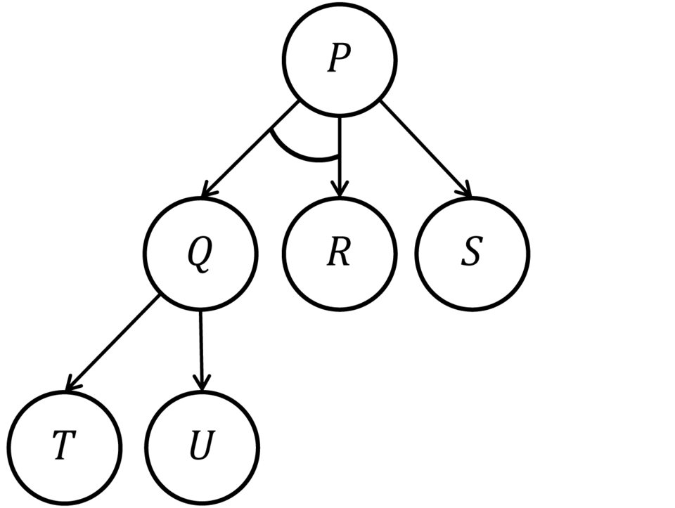
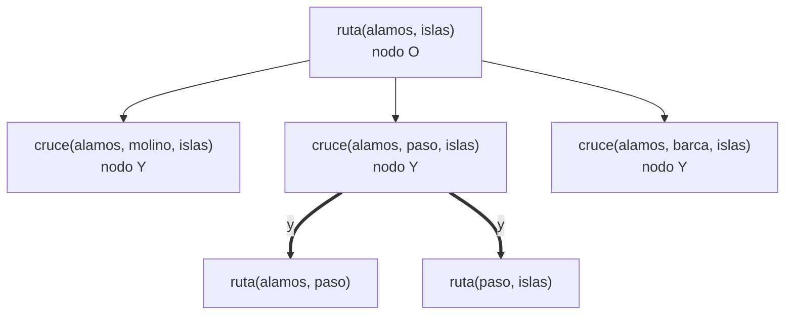
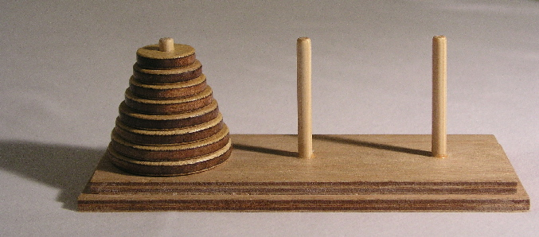

# Capítulo 71 — Proyecto: grafos Y/O

Muchos problemas se resuelven partiéndolos en otros más pequeños. Para ir
de un pueblo a otro que está del otro lado de un río, hay que elegir un
puente; elegido el puente, quedan dos problemas independientes: llegar al
puente y seguir desde él. Para pasar una torre de discos de un poste a
otro, hay que pasar primero los de arriba a un poste auxiliar, mover el
disco mayor y volver a apilar. Para ganar una partida, hace falta una
jugada que gane contra todas las respuestas del rival. En los tres casos
se combinan dos clases de elección: **basta una** de varias alternativas,
o **hacen falta todas** las partes. Un grafo cuyos nodos son de una de esas
dos clases es un **grafo Y/O**, y la solución de un problema es un **árbol
solución**: el nodo inicial, una alternativa en cada nodo O y todas las
partes en cada nodo Y, hasta problemas que se resuelven sin descomponerlos.

El capítulo construye un programa que busca esos árboles. Terminado,
encuentra la ruta más corta de alamos a islas en un mapa con un río, y
una estrategia ganadora en una posición del ta-te-ti, y dice cuántos nodos
tuvo que expandir para cada una:

<!-- contexto: capitulo-71/juego.pl -->
```prolog
?- viaje(mejor(distancia), alamos, islas, Pueblos, Km, Expandidos).
Pueblos = [alamos, cantera, paso, granja, islas],
Km = 106,
Expandidos = 6.

?- estrategia(mejor, [x,o,v, v,x,v, v,v,o], Resultado, Expandidos).
Resultado = jugadas(9, jugar(4, [3-jugar(6, gana), 6-jugar(7, gana), 7-jugar(6, gana), 8-jugar(6, gana)])),
Expandidos = 13.
```

La primera respuesta cruza el río en paso y recorre 106 km; la búsqueda
expandió 6 nodos, donde una exploración completa del mismo grafo expande
255 103. La segunda es un árbol de estrategia: x juega en la casilla 4, y
para cada respuesta de o (3, 6, 7 u 8) tiene una jugada que gana. Nueve
jugadas en total cubren todas las partidas posibles.

La fuente del capítulo es el capítulo «Problem Reduction and AND/OR
Graphs» de *Prolog Programming for Artificial Intelligence* de Ivan
Bratko (Addison-Wesley, 1986). De él vienen la representación de un
problema como grafo Y/O, el árbol solución y su costo, los tres ejemplos
(la ruta que cruza un río por uno de sus puentes, las torres de Hanoi como
reducción y el juego como grafo Y/O), las tres limitaciones de escribir el
grafo como cláusulas de Prolog y la búsqueda mejor primero con costos
estimados que se corrigen desde las hojas hacia la raíz. El mapa, la
representación de los árboles de búsqueda, los programas y las mediciones
son propios. La lista completa está en las [Referencias](#referencias).

El capítulo cumple dos anuncios: el del
[capítulo 40](../capitulo-40-busqueda-y-planificacion/index.md), la
búsqueda mejor primero en grafos Y/O, y el del
[capítulo 41](../capitulo-41-juegos/index.md), del que la posición ganada
es un caso. Carga, sin copiarlos, la búsqueda con visitados del
[capítulo 40](../capitulo-40-busqueda-y-planificacion/index.md), para
comparar las torres de Hanoi como espacio de estados con su reducción, y
el ta-te-ti del [capítulo 41](../capitulo-41-juegos/index.md). Los
programas están en `ejemplos/capitulo-71/`; todos son `% solo-local`
porque cargan otros archivos, salvo `arboles.pl`.

## Objetivos del capítulo

Al terminar el capítulo, el lector puede:

- describir un problema como un grafo Y/O, con nodos O, nodos Y, nodos
  primitivos y costos en los arcos, y reconocer cuándo sus subproblemas
  son independientes;
- escribir una búsqueda en profundidad que devuelve el árbol solución
  como un término, evita los ciclos con la lista de ancestros y cuenta los
  nodos que expande;
- calcular el árbol de menor costo de un grafo pequeño explorándolo
  entero, y medir por qué eso no escala;
- escribir la búsqueda mejor primero en grafos Y/O, con un árbol de
  búsqueda cuyos costos estimados se recalculan después de cada expansión,
  y explicar por qué una estimación que no exagera da el óptimo;
- resolver una sola vez los subproblemas que se repiten, y reconocer
  cuándo eso deja de ser correcto;
- construir estrategias ganadoras de un juego como árboles solución, y
  comparar su tamaño según la búsqueda.

!!! info "Tiempo estimado"
    Leer el capítulo, ejecutar sus ejemplos y hacer las actividades: **1:40 h**.
    Resolver los 5 ejercicios marcados con ★: **1:20 h**.
    Resolver los 13 ejercicios del final: **3:35 h**.

## 71.1 Problemas que se descomponen

En el [capítulo 40](../capitulo-40-busqueda-y-planificacion/index.md) un
problema es un espacio de estados: una acción lleva de un estado a otro, y
una solución es un camino. En un grafo Y/O, un nodo es un **problema**, y
sus arcos lo reducen a otros:

- un **nodo O** se resuelve si se resuelve **alguno** de sus hijos: son
  maneras alternativas de encarar el problema;
- un **nodo Y** se resuelve si se resuelven **todos** sus hijos: son
  partes independientes del problema, que se resuelven cada una por su
  lado;
- un **nodo primitivo** se resuelve sin descomponerlo; un nodo que no es
  primitivo y no tiene hijos no tiene solución.



Un árbol Y/O con la notación habitual: el arco curvo que une las flechas
de P a Q y a R indica que esos dos hijos forman un grupo Y. P se resuelve
si se resuelven Q **y** R, **o** si se resuelve S; Q se resuelve si se
resuelve T **o** U. Imagen: Saumaun, en la Wikipedia en inglés, dominio
público, vía
[Wikimedia Commons](https://commons.wikimedia.org/wiki/File:Andortree.png).

Un **árbol solución** de un nodo N contiene a N; si contiene un nodo O,
contiene también uno de sus hijos con el árbol de ese hijo; si contiene
un nodo Y, contiene todos sus hijos con sus árboles; y sus hojas son
nodos primitivos. Cuando los arcos tienen costos, el **costo** de un árbol
es la suma de los costos de sus arcos, y el problema pasa a ser encontrar
el árbol de menor costo.

El mapa del capítulo tiene trece pueblos y un río que corre de norte a
sur. Cinco pueblos están al oeste, cinco al este, y tres, molino, paso y
barca, están sobre el río: son los únicos lugares donde se lo cruza. Ir de
alamos, al oeste, a islas, al este, es un nodo O con un hijo por puente;
cada hijo, «ir de alamos a islas cruzando en P», es un nodo Y con dos
partes independientes:



Las partes se resuelven cada una por su lado: la ruta de alamos a paso no
depende de cómo se siga de paso a islas. Esa independencia es lo que hace
útil la descomposición: dos problemas de la mitad de tamaño cuestan mucho
menos que uno del tamaño entero.

## 71.2 El programa terminado

| Versión | Archivo | Agrega | Lo que no puede hacer todavía |
|---|---|---|---|
| 1 | `clausulas.pl` | el grafo escrito como cláusulas: Prolog lo recorre en profundidad | devolver el árbol, usar los costos, evitar los ciclos |
| 2 | `profundidad.pl` | el grafo como dato, el árbol solución como término, los ancestros | encontrar el árbol de menor costo |
| 3 | `optimo.pl` | el árbol de menor costo, explorando todo | evitar explorar todo |
| 4 | `mejor.pl` | la búsqueda mejor primero con costos estimados | resolver una sola vez un subproblema repetido |
| 5 | `compartidos.pl` | los subproblemas resueltos, recordados en un assoc | trabajar en grafos con ciclos |
| 6 | `juego.pl` | las estrategias de un juego como árboles solución | — |

`arboles.pl` define la interfaz de los problemas y las operaciones sobre
árboles solución; `mapa.pl` y `hanoi.pl` son los problemas;
`capitulo40.pl` y `capitulo41.pl` cargan los archivos de esos capítulos
dentro de un módulo, como hace el
[capítulo 77](../capitulo-77-proyecto-mundo-wumpus/index.md).

## 71.3 Versión 1: el grafo como cláusulas

Una cláusula de Prolog ya es un nodo Y: para probar la cabeza hay que
probar todos los objetivos del cuerpo. Varias cláusulas para la misma
cabeza forman un nodo O: basta con una. Un hecho es un nodo primitivo. La
resolución de Prolog es, entonces, una búsqueda en profundidad en un grafo
Y/O, y la reducción del mapa se escribe directamente:

<!-- ejemplo: capitulo-71/clausulas.pl predicado: llega/2 -->
```prolog
%!  llega(+A, +B) is semidet.
%
%   Hay un recorrido de A a B. Si A y B están en orillas opuestas, pasa
%   por un puente P: va de A a P y de P a B; si no, sale de A por un
%   camino. No termina si la búsqueda entra en un ciclo de caminos.
llega(B, B).
llega(A, B) :-
    A \== B,
    separados(A, B),
    pueblo(P, rio, _, _),
    llega(A, P),
    llega(P, B).
llega(A, B) :-
    A \== B,
    \+ separados(A, B),
    tramo(A, C, _),
    llega(C, B).
```

`separados/2` dice si dos pueblos están en orillas opuestas, `tramo/3`
recorre los caminos en los dos sentidos, y los dos, como `pueblo/4`, están en
`mapa.pl`. El programa responde:

```prolog
?- once(llega(alamos, paso)).
true.

?- call_with_inference_limit(llega(alamos, islas), 1000000, R).
R = inference_limit_exceeded.
```

La primera consulta termina: de alamos a cantera y de cantera a paso. La
segunda no terminaría sin el límite de inferencias. El primer puente que
prueba es molino, y la búsqueda de alamos a molino sale por cantera y
paso, cruza hacia el este por granja e islas, y desde jardin entra en el
ciclo jardin, barca, huerta, jardin, del que la búsqueda en profundidad
no sale. Son las tres
limitaciones de escribir el grafo como programa:

1. la respuesta es `true` o `false`, sin el árbol que la prueba;
2. las longitudes de los caminos no intervienen;
3. en un grafo con ciclos, la búsqueda puede no terminar.

## 71.4 Versión 2: el árbol solución, en profundidad

La segunda versión separa el grafo de la búsqueda. Un problema se
describe con tres predicados, `primitivo/2`, `expansion/4` y
`estimacion/3`, declarados `multifile` en `arboles.pl` para que cada
archivo de problema agregue sus cláusulas; la búsqueda los llama sin
conocer el problema por dentro, como las del
[capítulo 40](../capitulo-40-busqueda-y-planificacion/index.md#401-el-problema-como-interfaz).
`expansion(Problema, Nodo, Tipo, Hijos)` da el tipo del nodo, `o` o `y`, y
la lista de sus hijos como pares `Hijo-Costo`. Para el mapa:

<!-- ejemplo: capitulo-71/mapa.pl predicado: expansion/4 -->
```prolog
%!  expansion(+Problema, +Nodo, -Tipo, -Hijos:list) is semidet.
%
%   Nodo de Problema se reduce a Hijos, con Tipo o o y. Falla si Nodo es
%   primitivo.
expansion(rio(_), ruta(A, B), o, Hijos) :-
    A \== B,
    (   separados(A, B)
    ->  findall(cruce(A, P, B)-0, pueblo(P, rio, _, _), Hijos)
    ;   findall(ruta(C, B)-L, tramo(A, C, L), Hijos)
    ).
expansion(rio(_), cruce(A, P, B), y, [ruta(A, P)-0, ruta(P, B)-0]).
```

`ruta(A, B)` con A y B en orillas opuestas tiene un hijo `cruce(A, P, B)`
por puente, con costo 0; si no, un hijo `ruta(C, B)` por camino de A a C,
con la longitud del camino como costo. `ruta(B, B)` es primitivo. El
problema es `rio(Estimacion)`, porque la versión 4 usa dos estimaciones
distintas del mismo mapa.

Un árbol solución es un término: `meta(N)` para un nodo primitivo,
`o(N, A-C)` para un nodo O resuelto por el hijo de árbol A con un arco de
costo C, e `y(N, [A1-C1, …])` para un nodo Y. `costo/2`, `hojas/2` y
`mostrar/1`, en `arboles.pl`, operan sobre cualquier árbol:

<!-- contexto: capitulo-71/arboles.pl -->
```prolog
?- mostrar(y(a, [meta(b)-1, o(c, meta(d)-3)-2])).
a  y
  +1 b
  +2 c  o
    +3 d
true.

?- costo(y(a, [meta(b)-1, o(c, meta(d)-3)-2]), C).
C = 6.
```

La búsqueda recibe la lista de los ancestros de cada nodo: un nodo que
repite uno de ellos no se expande, porque un árbol que pasara por él
contendría un ciclo. Y en lugar de tener éxito o fallar, cada llamada
devuelve `si(Arbol)` o `no`, para que la cantidad de nodos expandidos se
conserve también en las ramas que no llevan a una solución: es el
[Patrón 63](../patrones.md#63-estado-como-resultado-no-como-falla) del
[capítulo 61](../capitulo-61-proyecto-maquina-prolog/index.md).

<!-- ejemplo: capitulo-71/profundidad.pl predicado: profundidad/6 reducir/8 alguno/6 todos/6 -->
```prolog
%!  profundidad(+Problema, +Nodo, +Ancestros:list, -Resultado,
%!              +K0:integer, -K:integer) is det.
%
%   Resultado es si(Arbol) con el primer árbol solución de Nodo que no
%   pasa por ninguno de Ancestros, o no si no lo hay; K es K0 más la
%   cantidad de nodos expandidos.
profundidad(Problema, Nodo, Ancestros, Resultado, K0, K) :-
    (   memberchk(Nodo, Ancestros)
    ->  Resultado = no,
        K = K0
    ;   primitivo(Problema, Nodo)
    ->  Resultado = si(meta(Nodo)),
        K = K0
    ;   expansion(Problema, Nodo, Tipo, Hijos)
    ->  K1 is K0 + 1,
        reducir(Tipo, Problema, Nodo, [Nodo|Ancestros], Hijos, Resultado,
                K1, K)
    ;   Resultado = no,
        K = K0
    ).

%!  reducir(+Tipo, +Problema, +Nodo, +Ancestros:list, +Hijos:list,
%!          -Resultado, +K0:integer, -K:integer) is det.
%
%   Resultado es si(Arbol) con un árbol solución de Nodo, que se reduce a
%   Hijos con Tipo o o y, o no si no lo hay.
reducir(o, Problema, Nodo, Ancestros, Hijos, Resultado, K0, K) :-
    alguno(Hijos, Problema, Ancestros, R, K0, K),
    (   R = si(Arco)
    ->  Resultado = si(o(Nodo, Arco))
    ;   Resultado = no
    ).
reducir(y, Problema, Nodo, Ancestros, Hijos, Resultado, K0, K) :-
    todos(Hijos, Problema, Ancestros, R, K0, K),
    (   R = si(Arcos)
    ->  Resultado = si(y(Nodo, Arcos))
    ;   Resultado = no
    ).

%!  alguno(+Hijos:list, +Problema, +Ancestros:list, -Resultado,
%!         +K0:integer, -K:integer) is det.
%
%   Resultado es si(Arbol-C) para el primer hijo Hijo-C de Hijos que tiene
%   solución, o no si ninguno la tiene. Los hijos siguientes no se exploran.
alguno([], _, _, no, K, K).
alguno([Hijo-C|Hijos], Problema, Ancestros, Resultado, K0, K) :-
    profundidad(Problema, Hijo, Ancestros, R, K0, K1),
    (   R = si(Arbol)
    ->  Resultado = si(Arbol-C),
        K = K1
    ;   alguno(Hijos, Problema, Ancestros, Resultado, K1, K)
    ).

%!  todos(+Hijos:list, +Problema, +Ancestros:list, -Resultado,
%!        +K0:integer, -K:integer) is det.
%
%   Resultado es si(Arcos), con un Arbol-C por cada hijo Hijo-C de Hijos,
%   si todos tienen solución, o no si alguno no la tiene. Los hijos que
%   siguen al primero sin solución no se exploran.
todos([], _, _, si([]), K, K).
todos([Hijo-C|Hijos], Problema, Ancestros, Resultado, K0, K) :-
    profundidad(Problema, Hijo, Ancestros, R, K0, K1),
    (   R = si(Arbol)
    ->  todos(Hijos, Problema, Ancestros, R1, K1, K),
        (   R1 = si(Arcos)
        ->  Resultado = si([Arbol-C|Arcos])
        ;   Resultado = no
        )
    ;   Resultado = no,
        K = K1
    ).
```

`alguno/6` se detiene en el primer hijo que se resuelve, y `todos/6` en el
primero que no. `viaje/6`, en `mapa.pl`, resume el resultado de cualquiera
de las búsquedas del capítulo con el recorrido, su costo y los nodos
expandidos:

<!-- contexto: capitulo-71/profundidad.pl -->
```prolog
?- viaje(profundidad, alamos, islas, Pueblos, Km, Expandidos).
Pueblos = [alamos, cantera, paso, granja, islas, fuente, molino, fuente, granja|...],
Km = 241,
Expandidos = 24.
```

La búsqueda termina y devuelve un árbol, pero el recorrido da un rodeo:
para llegar a molino, el primer puente de la lista, pasa por paso, cruza
el río, pasa por islas, que es el destino, sube hasta molino y vuelve a
bajar a islas. En profundidad, el primer árbol que se encuentra es el que
dicta el orden de los hijos, no el de menor costo.

!!! question "Actividad"
    bosque tiene un camino directo a molino, y molino uno a fuente: 49 km.
    Antes de ejecutarla, predecir si la consulta
    `viaje(profundidad, bosque, fuente, Ps, Km, K)` encuentra ese
    recorrido, mirando el orden de los hechos `camino/3` de `mapa.pl`.
    Ejecutarla, mostrar su árbol con
    `mostrar_viaje(profundidad, bosque, fuente)` y explicar en qué nodo O
    la búsqueda elige un hijo que no es el del recorrido directo.

## 71.5 Versión 3: el óptimo, a costa de explorarlo todo

Para tener el árbol de menor costo, la tercera versión resuelve todos los
hijos de cada nodo: un nodo O se queda con el hijo cuyo arco más su árbol
cuesta menos, y un nodo Y suma los costos de todos sus hijos.

<!-- ejemplo: capitulo-71/optimo.pl predicado: mejor_arbol/6 combinar/4 -->
```prolog
%!  mejor_arbol(+Problema, +Nodo, +Ancestros:list, -Resultado,
%!              +K0:integer, -K:integer) is det.
%
%   Resultado es si(Arbol, Costo) con un árbol solución de Nodo de costo
%   mínimo entre los que no pasan por ninguno de Ancestros, o no si no lo
%   hay; K es K0 más la cantidad de nodos expandidos.
mejor_arbol(Problema, Nodo, Ancestros, Resultado, K0, K) :-
    (   memberchk(Nodo, Ancestros)
    ->  Resultado = no,
        K = K0
    ;   primitivo(Problema, Nodo)
    ->  Resultado = si(meta(Nodo), 0),
        K = K0
    ;   expansion(Problema, Nodo, Tipo, Hijos)
    ->  K1 is K0 + 1,
        foldl(resolver_hijo(Problema, [Nodo|Ancestros]), Hijos, Rs,
              K1, K),
        combinar(Tipo, Nodo, Rs, Resultado)
    ;   Resultado = no,
        K = K0
    ).

%!  combinar(+Tipo, +Nodo, +Resultados:list, -Resultado) is det.
%
%   Resultado es el mejor árbol de Nodo a partir de los resultados de sus
%   hijos: con Tipo o, el hijo de menor costo; con Tipo y, todos, con la
%   suma de sus costos. Es no si ningún hijo (o) o alguno (y) no tiene
%   solución.
combinar(o, Nodo, Rs, Resultado) :-
    findall(Costo-Arco, member(si(Arco, Costo), Rs), Soluciones),
    (   Soluciones == []
    ->  Resultado = no
    ;   keysort(Soluciones, [Costo-Arco|_]),
        Resultado = si(o(Nodo, Arco), Costo)
    ).
combinar(y, Nodo, Rs, Resultado) :-
    (   memberchk(no, Rs)
    ->  Resultado = no
    ;   findall(Arco, member(si(Arco, _), Rs), Arcos),
        foldl(sumar_resultado, Rs, 0, Costo),
        Resultado = si(y(Nodo, Arcos), Costo)
    ).
```

<!-- contexto: capitulo-71/optimo.pl -->
```prolog
?- viaje(optimo, alamos, islas, Pueblos, Km, Expandidos).
Pueblos = [alamos, cantera, paso, granja, islas],
Km = 106,
Expandidos = 255103.
```

El recorrido es el mejor, 106 km, pero la búsqueda expandió 255 103 nodos
y tardó 3,7 segundos (15,2 millones de inferencias) para un mapa de trece
pueblos. Con la lista de ancestros, cada nodo se resuelve de nuevo por
cada camino sin ciclos que llega a él: la búsqueda recorre el árbol que
resulta de desplegar el grafo, no el grafo. Entre alamos e islas hay
315 323 765 árboles solución sin ciclos, y aunque la versión 3 no los
arma uno por uno, visita cada rama de la que salen (el
[ejercicio 4](#ejercicios) los cuenta).

## 71.6 Versión 4: búsqueda mejor primero

La cuarta versión expande un nodo por vez, siempre dentro del árbol
solución parcial que parece más barato. Para eso cada nodo lleva un
**costo estimado** F:

- una **punta**, un nodo todavía sin expandir, tiene como F su estimación
  `estimacion/3`, que no debe superar el costo verdadero de resolverlo;
- un nodo O tiene como F el menor, entre sus hijos, de costo del arco más
  F del hijo;
- un nodo Y tiene como F la suma, sobre sus hijos, de costo del arco más F
  del hijo;
- un nodo **resuelto** tiene como F el costo exacto de su árbol, y uno sin
  solución, el átomo `inf`, que en el orden estándar de términos del
  [capítulo 22](../capitulo-22-estructuras-de-datos-de-la-biblioteca/index.md#222-el-orden-estandar)
  sigue a cualquier número.

El árbol de búsqueda es un término con esos cinco functores: `punta/2`,
`o/3`, `y/3`, `hecho/3` e `imposible/1`. Cada paso baja desde la raíz: en
un nodo O, al hijo de menor F; en un nodo Y, al primer hijo sin resolver;
hasta llegar a una punta, que se expande. Al volver, cada nodo recalcula
su F con los de sus hijos. La búsqueda termina cuando la raíz queda
resuelta o sin solución.

<!-- ejemplo: capitulo-71/mejor.pl predicado: ciclo/5 expandir/4 rehacer/4 -->
```prolog
%!  ciclo(+Problema, +T0, +K0:integer, -T, -K:integer) is det.
%
%   T es el árbol de búsqueda al que se llega desde T0 expandiendo una
%   punta por vez, hasta que la raíz queda resuelta o imposible; K es K0
%   más la cantidad de expansiones.
ciclo(Problema, T0, K0, T, K) :-
    (   terminado(T0)
    ->  T = T0,
        K = K0
    ;   expandir(T0, Problema, [], T1),
        K1 is K0 + 1,
        ciclo(Problema, T1, K1, T, K)
    ).

%!  expandir(+T0, +Problema, +Ancestros:list, -T) is det.
%
%   T es T0 después de expandir una punta de su árbol solución parcial más
%   prometedor, con los F recalculados de esa punta hacia arriba.
expandir(punta(N, _), Problema, Ancestros, T) :-
    (   expansion(Problema, N, Tipo, Hijos)
    ->  maplist(nuevo_hijo(Problema, [N|Ancestros]), Hijos, Ts),
        rehacer(Tipo, N, Ts, T)
    ;   T = imposible(N)
    ).
expandir(o(N, _, Ts0), Problema, Ancestros, T) :-
    menor(Ts0, I),
    expandir_hijo(Problema, [N|Ancestros], I, Ts0, Ts),
    rehacer(o, N, Ts, T).
expandir(y(N, _, Ts0), Problema, Ancestros, T) :-
    nth1(I, Ts0, T1-_),
    T1 \= hecho(_, _, _),
    !,
    expandir_hijo(Problema, [N|Ancestros], I, Ts0, Ts),
    rehacer(y, N, Ts, T).

%!  rehacer(+Tipo, +N, +Ts:list, -T) is det.
%
%   T es el árbol de búsqueda del nodo N de Tipo o o y con los hijos Ts: su
%   F se recalcula, y queda hecho o imposible si corresponde. Un nodo O sin
%   hijos es imposible.
rehacer(o, N, Ts, T) :-
    maplist(f_arco, Ts, Fs),
    (   min_member(F0, Fs)
    ->  F = F0
    ;   F = inf
    ),
    (   F == inf
    ->  T = imposible(N)
    ;   nth1(I, Fs, F),
        nth1(I, Ts, hecho(_, _, A)-C)
    ->  T = hecho(N, F, o(N, A-C))
    ;   T = o(N, F, Ts)
    ).
rehacer(y, N, Ts, T) :-
    maplist(f_arco, Ts, Fs),
    (   memberchk(inf, Fs)
    ->  T = imposible(N)
    ;   sum_list(Fs, F),
        (   maplist(arco_resuelto, Ts, Arcos)
        ->  T = hecho(N, F, y(N, Arcos))
        ;   T = y(N, F, Ts)
        )
    ).
```

Un nodo O queda resuelto cuando su hijo de menor F está resuelto. En ese
momento el costo de ese hijo es exacto, y el de los demás hijos no puede
ser menor que su F, porque ninguna estimación exagera: el árbol elegido es
el de menor costo. Es la misma condición de **admisibilidad** que la de
A\* en la [sección 40.5](../capitulo-40-busqueda-y-planificacion/heuristicas.md#heuristicas-a-e-ida).
El algoritmo es una variante del que la literatura llama AO\*, como
señala Bratko; Nilsson lo presenta en su libro de 1980, y Pearl
(1984) estudia sus propiedades formales, la admisibilidad entre ellas.
Para el mapa hay dos estimaciones admisibles: `cero`, que no da
información, y `distancia`, la distancia en línea recta truncada, que no
supera la longitud de ningún camino. Una prueba de `mapa.plt` lo verifica
camino por camino.

<!-- contexto: capitulo-71/mejor.pl -->
```prolog
?- viaje(mejor(cero), alamos, islas, Pueblos, Km, Expandidos).
Pueblos = [alamos, cantera, paso, granja, islas],
Km = 106,
Expandidos = 76.

?- viaje(mejor(distancia), alamos, islas, Pueblos, Km, Expandidos).
Pueblos = [alamos, cantera, paso, granja, islas],
Km = 106,
Expandidos = 6.

?- mostrar_viaje(mejor(distancia), bosque, fuente).
ruta(bosque,fuente)  o
  +0 cruce(bosque,molino,fuente)  y
    +0 ruta(bosque,molino)  o
      +27 ruta(molino,molino)
    +0 ruta(molino,fuente)  o
      +22 ruta(fuente,fuente)
true.
```

| Búsqueda | Km | Nodos expandidos | Inferencias |
|---|---|---|---|
| en profundidad (versión 2) | 241 | 24 | 854 |
| exhaustiva (versión 3) | 106 | 255 103 | 15 158 489 |
| mejor primero, estimación `cero` | 106 | 76 | 25 180 |
| mejor primero, estimación `distancia` | 106 | 6 | 1 248 |

Las inferencias se midieron con `call_time/2`, después de una primera
llamada que carga las bibliotecas. Sobre los 169 pares de pueblos, las
dos estimaciones dan el mismo costo, y en total expanden 3 342 nodos con
`cero` y 566 con `distancia`.

La búsqueda es un solo bucle, `ciclo/5`, y lo que decide cuánto trabaja
es la estimación: con `cero` expande primero el árbol parcial de menor
costo acumulado, como la búsqueda de costo uniforme, y con `distancia`
se dirige hacia el destino, como A\*. Es la idea del
[Patrón 54](../patrones.md#54-la-frontera-decide-la-estrategia) del
[capítulo 40](../capitulo-40-busqueda-y-planificacion/index.md) en un
grafo Y/O: la frontera son las puntas de los árboles parciales, y el
criterio para elegir entre ellas decide la estrategia.

!!! question "Actividad"
    Calcular a mano las estimaciones de los tres hijos de
    `ruta(dique, jardin)` con `estimacion(rio(distancia), N, H)` y
    predecir por cuál puente empieza la búsqueda. Comprobarlo con
    `viaje(mejor(distancia), dique, jardin, Ps, Km, K)` y explicar por qué
    le alcanzan tan pocas expansiones.

## 71.7 Versión 5: subproblemas compartidos



Una torre de Hanoi de juguete, con todos los discos en el primer poste.
Imagen: Evanherk, en la Wikipedia en inglés,
[CC BY-SA 3.0](https://creativecommons.org/licenses/by-sa/3.0/), vía
[Wikimedia Commons](https://commons.wikimedia.org/wiki/File:Tower_of_Hanoi.jpeg).

Las torres de Hanoi tienen tres postes, a, b y c, y N discos de tamaños
distintos apilados en a, el mayor abajo. Se mueve un disco por vez, el de
arriba de un poste, y nunca sobre uno menor. El nodo `torre(N, De, A)`,
«pasar los N discos de arriba de De a A», se reduce a un nodo Y con tres
partes: pasar N − 1 discos al tercer poste, mover el disco mayor y pasar
los N − 1 discos del tercer poste a A. El disco mayor es la parte más
difícil del problema, y la reducción la resuelve primero: lo demás
consiste en despejarle el camino y volver a apilar.

<!-- ejemplo: capitulo-71/hanoi.pl predicado: expansion/4 -->
```prolog
%!  expansion(+Problema, +Nodo, -Tipo, -Hijos:list) is semidet.
%
%   torre(N, De, A), con N > 0, es un nodo Y con tres hijos: pasar N - 1
%   discos al tercer poste, mover el mayor y volver a apilar.
expansion(hanoi, torre(N, De, A), y,
          [torre(N1, De, Via)-0, mover(De, A)-1, torre(N1, Via, A)-0]) :-
    N > 0,
    N1 is N - 1,
    tercero(De, A, Via).
```

`mover(De, A)` es primitivo y su arco cuesta 1, de modo que el costo de un
árbol es la cantidad de movimientos. La versión 2 resuelve la torre de 10
discos expandiendo 1 023 nodos, uno por cada `torre(K, De, A)` con K > 0
del árbol desplegado. Pero solo hay seis maneras de elegir los postes De y
A: `torre(8, a, b)` aparece dos veces, `torre(7, b, c)` cuatro, y así. La
quinta versión recuerda en un assoc del
[capítulo 22](../capitulo-22-estructuras-de-datos-de-la-biblioteca/index.md#225-libraryassoc-y-libraryrbtrees)
el resultado de cada nodo ya expandido, y cuando el nodo reaparece usa el
mismo árbol, sin copiarlo:

<!-- ejemplo: capitulo-71/compartidos.pl predicado: recordado/5 -->
```prolog
%!  recordado(+Problema, +Nodo, -Resultado, +S0, -S) is det.
%
%   Resultado es si(Arbol) con un árbol solución de Nodo, o no si no lo
%   hay. S0 y S son m(Memoria, K): Memoria asocia cada nodo expandido con
%   su resultado, y K cuenta las expansiones.
recordado(Problema, Nodo, Resultado, S0, S) :-
    S0 = m(M0, K0),
    (   get_assoc(Nodo, M0, R)
    ->  Resultado = R,
        S = S0
    ;   primitivo(Problema, Nodo)
    ->  Resultado = si(meta(Nodo)),
        S = S0
    ;   expansion(Problema, Nodo, Tipo, Hijos)
    ->  K1 is K0 + 1,
        reducir_recordado(Tipo, Problema, Nodo, Hijos, Resultado,
                          m(M0, K1), m(M1, K)),
        put_assoc(Nodo, M1, Resultado, M),
        S = m(M, K)
    ;   Resultado = no,
        S = S0
    ).
```

<!-- contexto: capitulo-71/compartidos.pl -->
```prolog
?- plan_torres(3, Movimientos).
Movimientos = [a-c, a-b, c-b, a-c, b-a, b-c, a-c].

?- torres(profundidad, 10, Movimientos, Expandidos).
Movimientos = Expandidos, Expandidos = 1023.

?- torres(compartido, 10, Movimientos, Expandidos).
Movimientos = 1023,
Expandidos = 27.

?- torres(compartido, 20, Movimientos, Expandidos).
Movimientos = 1048575,
Expandidos = 57.
```

Para N discos se expanden 3N − 3 nodos distintos, y el árbol, con sus
2^N − 1 movimientos, ocupa en la memoria un nodo por subproblema: los
subárboles repetidos son el mismo término. Martelli y Montanari (1973)
llaman **aditivo** a un grafo Y/O así, un árbol Y/O «plegado» donde los
subproblemas iguales se identifican: el costo de un subproblema común se
suma tantas veces como aparece, pero se calcula una sola vez. La tabla compara las dos
versiones con la búsqueda en anchura con visitados del
[capítulo 40](../capitulo-40-busqueda-y-planificacion/visitados.md), que
recorre el espacio de estados de las torres: `capitulo40.pl` carga
`visitados.pl` en un módulo y le agrega las cláusulas de un problema
`torres(N)`, cuyo estado es la lista de los postes de los discos.

| Discos | Movimientos | Profundidad (versión 2) | Compartidos (versión 5) | Espacio de estados (anchura con visitados) |
|---|---|---|---|---|
| 4 | 15 | 15 | 9 | 70 |
| 6 | 63 | 63 | 15 | 686 |
| 8 | 255 | 255 | 21 | 6 390 |
| 10 | 1 023 | 1 023 | 27 | 58 366 (4,6 s) |

La cantidad de estados es 3^N, y la búsqueda en anchura los visita casi
todos antes de encontrar el plan; la reducción no busca: cada nodo tiene
una sola expansión. Lo que la versión 5 ahorra es la repetición.

Recordar el resultado de un nodo es correcto solo si ese resultado no
depende del camino por el que se llegó a él. En el mapa depende: un nodo
no puede usar a sus ancestros, así que la misma `ruta(C, B)` puede tener
solución por un camino y no tenerla por otro. La versión 5 es para grafos
sin ciclos, y por eso no lleva la lista de ancestros; el
[ejercicio 10](#ejercicios) muestra qué pasa si se la usa en el mapa.

!!! example "Patrón 70 — Resultado recordado, sin copiar"
    **Problema.** Una búsqueda que construye un resultado, como un árbol
    solución, encuentra el mismo subproblema muchas veces, y resolverlo
    cada vez multiplica el trabajo y el tamaño del resultado.

    **Versión ingenua.** Resolver cada aparición por separado, como la
    versión 2: la torre de 10 discos expande 1 023 nodos, uno por cada
    aparición de `torre(K, De, A)`, aunque solo hay 27 subproblemas
    distintos, y el árbol tiene una copia de cada subárbol repetido.

    **Patrón.** Un assoc asocia cada subproblema resuelto con su
    resultado, y viaja en el estado de la búsqueda junto con la cuenta de
    expansiones, como `m(Memoria, K)` en `recordado/5`. Antes de expandir
    un nodo se lo busca con `get_assoc/3`; si ya está, se usa **el mismo
    término**, sin copiarlo. El resultado es una estructura compartida: el
    árbol de la torre de 20 discos describe 1 048 575 movimientos, se
    construye con 57 expansiones y ocupa en la memoria un nodo por
    subproblema distinto. Se diferencia del
    [Patrón 53](../patrones.md#53-tabular-la-relacion-recursiva) en dos
    cosas: la tabla de `:- table` es global al predicado y entrega cada
    respuesta como una copia, de modo que los subárboles repetidos dejan de
    ser el mismo término; el assoc es local a una búsqueda, conserva la
    compartición y permite contar lo que se expande.

    **Cuándo no usarlo.** Cuando el resultado de un nodo depende del camino
    por el que se llegó a él, como en el mapa, donde un nodo no puede usar
    a sus ancestros: el resultado recordado por un camino es incorrecto por
    otro, y el [ejercicio 10](#ejercicios) lo muestra. Cuando los
    subproblemas no se repiten, como en un árbol de búsqueda sin nodos
    comunes: el assoc solo agrega costo. Y cuando lo que se hace con el
    resultado lo recorre entero: `costo/2` visita el millón de hojas del
    árbol compartido, y el [ejercicio 7](#ejercicios) pide recordar
    también ese cálculo.

## 71.8 Versión 6: estrategias de juego

Un juego de dos jugadores es un grafo Y/O visto desde uno de ellos, J.
Cuando mueve J basta con una jugada buena: la posición es un nodo O,
`mueve(Pos)`. Cuando mueve el rival, J tiene que ganar contra todas sus
respuestas: la posición es un nodo Y, `responde(Pos)`. Una posición en la
que la partida terminó con la victoria de J es primitiva. Un árbol
solución es una **estrategia ganadora**: dice qué jugar en cada posición
a la que el rival puede llevar la partida.

<!-- ejemplo: capitulo-71/juego.pl predicado: primitivo/2 expansion/4 -->
```prolog
%!  primitivo(+Problema, +Nodo) is semidet.
%
%   Nodo es responde(Pos) y en Pos la partida terminó con la victoria de J.
primitivo(gana(Juego, J), responde(Pos)) :-
    fin(Juego, Pos, gana(J)).

%!  expansion(+Problema, +Nodo, -Tipo, -Hijos:list) is semidet.
%
%   En mueve(Pos), un nodo O, los hijos son las respuestas del rival a cada
%   jugada de J; en responde(Pos), un nodo Y, las posiciones a las que el
%   rival puede llevar la partida. Falla si la partida terminó.
expansion(gana(Juego, _), mueve(Pos), o, Hijos) :-
    \+ fin(Juego, Pos, _),
    findall(responde(Sig)-1, jugada(Juego, Pos, _, Sig), Hijos).
expansion(gana(Juego, _), responde(Pos), y, Hijos) :-
    \+ fin(Juego, Pos, _),
    findall(mueve(Sig)-1, jugada(Juego, Pos, _, Sig), Hijos).
```

`ganada/2` del
[capítulo 41](../capitulo-41-juegos/index.md#la-posicion-ganada-sin-numeros)
es esta misma definición, escrita como cláusulas: la versión 1 aplicada
al ta-te-ti, que responde si la estrategia existe. Las búsquedas de este
capítulo la construyen. `estrategia/4` la busca para x con cualquiera de
ellas y la escribe con las casillas: `jugar(C, Respuestas)` juega C, y
`Respuestas` es `gana` o la lista de lo que sigue a cada respuesta del
rival. El costo de un arco es 1, así que el costo del árbol es la
cantidad de jugadas de la estrategia.

<!-- contexto: capitulo-71/juego.pl -->
```prolog
?- estrategia(profundidad, [x,o,v, v,v,v, v,v,v], jugadas(N, _), K).
N = 61,
K = 170.

?- estrategia(mejor, [x,o,v, v,v,v, v,v,v], jugadas(N, P), K).
N = 21,
P = jugar(4, [3-jugar(7, gana), 5-jugar(7, gana), 6-jugar(7, gana), 7-jugar(5, [3-jugar(..., ...), ... - ...|...]), 8-jugar(7, gana), 9-jugar(7, gana)]),
K = 73.

?- estrategia(compartido, [v,v,v, v,v,v, v,v,v], R, K).
R = ninguna,
K = 1878.
```

Con x en la esquina 1 y o en la casilla 2, x gana. La primera estrategia
que encuentra la búsqueda en profundidad tiene 61 jugadas; la de mejor
primero, que minimiza el tamaño del árbol, tiene 21: x juega en 4, y
salvo que o tape la columna en 7, gana en la jugada siguiente; si o la
tapa, x juega en 5 y amenaza dos líneas a la vez. El toplevel abrevia el
término, y `plan/2` y `mostrar/1` lo muestran entero. Desde el
tablero vacío x no tiene estrategia ganadora, y las tres búsquedas lo
confirman de maneras distintas:

| Búsqueda | Nodos expandidos | Inferencias |
|---|---|---|
| en profundidad (versión 2) | 9 689 | 2 703 548 |
| con subproblemas compartidos (versión 5) | 1 878 | 564 357 |
| mejor primero (versión 4) | 5 165 | 4 874 014 |

Dos órdenes distintos de las mismas jugadas llevan a la misma posición:
el grafo del juego comparte nodos, y la versión 5 los resuelve una vez.
Como el ta-te-ti no tiene ciclos, recordar los resultados es correcto. La
búsqueda mejor primero expande menos nodos que la de profundidad pero
hace más inferencias: cada expansión baja desde la raíz y recalcula F en
todo el camino, y probar que no hay estrategia obliga a examinar todas
las alternativas de x de todos modos.

!!! success "Criterios de calidad"
    | Criterio | En este capítulo |
    |---|---|
    | C1 | cada predicado declara modos y determinación; las búsquedas son `det` hacia adentro, con el resultado `si(Arbol)` o `no`, y `semidet` hacia afuera |
    | C2 | representaciones limpias: el árbol solución, el árbol de búsqueda y el problema son términos con un functor por caso; lo imposible es el átomo `inf`, no un número grande |
    | C4 | `expandir/4` recibe el árbol en su primer argumento y las estimaciones despachan por un predicado auxiliar, de modo que la indexación elige la cláusula y las pruebas no encuentran alternativas pendientes |
    | C6 | las búsquedas no conocen los problemas: el mapa, las torres y el ta-te-ti solo agregan cláusulas a `primitivo/2`, `expansion/4` y `estimacion/3` |
    | C7 | 150 pruebas en catorce archivos; las del mapa y de la versión 4 verifican que la estimación es admisible camino por camino y que las dos estimaciones dan el mismo costo en los 169 pares |

## 71.9 La notación de Bratko y la búsqueda ascendente

Tres partes de las fuentes quedan fuera de las seis versiones, y la página
[La notación de Bratko y la búsqueda ascendente](extensiones.md) las
agrega. `bratko.pl` escribe grafos Y/O con el operador `--->` del libro,
`Nodo ---> or:Hijos`, y los traduce a `expansion/4`, de modo que todas las
búsquedas del capítulo sirven para ellos; el grafo de la figura 13.4 de
Bratko da 9 en profundidad y 8 con la búsqueda mejor primero. El mismo
archivo escribe la ruta con los **puntos clave** de Bratko, una relación
aparte que dice por dónde tiene que pasar toda ruta entre dos pueblos.
`ascendente.pl` programa el método **ascendente** de Martelli y
Montanari, que extiende el algoritmo de Dijkstra: resuelve los nodos desde
los primitivos hacia arriba, en orden de costo, y en las torres de Hanoi
cuenta cada subproblema una sola vez.

## Ejercicios

Las soluciones están en [la página de soluciones](soluciones.md). La dificultad
va de 1 (se resuelve consultando el capítulo) a 3 (requiere elaboración propia).
Los marcados con ★ son los que no conviene saltear: cubren lo que el capítulo
tiene de propio. Los ejercicios que piden código se resuelven en archivos
que cargan los del capítulo, sin modificarlos.

1. ★ **(1)** Predecir los hijos de `ruta(dique, jardin)`, sus
   estimaciones con `distancia` y el recorrido de menor costo. Comprobarlo
   con `expansion/4`, `estimacion/3` y `viaje/6`, y contar los nodos
   expandidos.
2. **(1)** Dibujar a mano el árbol solución de menor costo de
   `ruta(bosque, fuente)`, con el costo de cada arco, y compararlo con
   `mostrar_viaje/3`. Decir cuáles de sus nodos son O, cuáles Y y cuáles
   primitivos.
3. ★ **(2)** Escribir `resolver_limitado(Problema, Nodo, Limite, Arbol)`,
   una búsqueda en profundidad sin ancestros en la que ningún camino de la
   raíz a una hoja expande más de Limite nodos, y
   `profundizando(Problema, Nodo, Arbol, Limite)`, que la llama con
   límites crecientes. Aplicarla a `ruta(alamos, islas)` y explicar por qué
   el árbol que devuelve no es el de la versión 2 ni el de menor costo.
4. ★ **(2)** Escribir `contar_arboles(Problema, Nodo, N)`: N es la cantidad
   de árboles solución de Nodo sin ciclos. Contar los de
   `ruta(alamos, paso)` y los de `ruta(alamos, islas)`, y relacionar el
   resultado con las expansiones de la versión 3.
5. **(2)** Cruzar en barca cuesta un peaje. Escribir el problema
   `peaje(Estimacion, Peaje)`, que suma Peaje al arco de cada cruce por
   barca y deja igual lo demás, y hallar a partir de qué peaje la ruta de
   dique a jardin deja de cruzar en barca.
6. ★ **(2)** Escribir el problema `doble`, con la estimación del doble de
   la distancia en línea recta. Contar en cuántos de los 169 pares de
   pueblos el costo que encuentra la búsqueda mejor primero no es el
   mínimo, cuántos kilómetros de más suman, y cuántas expansiones ahorra.
   Explicar el resultado con la admisibilidad.
7. **(2)** `costo/2` recorre el árbol compartido de la versión 5 entero:
   para 20 discos, un millón de hojas. Escribir `costo_compartido/2`, que
   calcula el costo de cada nodo una sola vez, y comparar las inferencias
   de los dos en la torre de 20 discos.
8. **(1)** Escribir con `mostrar/1` la estrategia de la posición
   `[x,o,v, v,x,v, v,v,o]` y explicar qué representa cada nodo Y y cada
   hoja. Relacionar la cantidad de hojas con las partidas posibles.
9. ★ **(2)** Con x en la casilla 1, determinar para cada respuesta de o,
   de la casilla 2 a la 9, si x tiene una estrategia ganadora y cuántas
   jugadas tiene la menor. Escribir `respuestas_a_la_esquina/1`.
10. **(2)** Predecir qué hace
    `compartido(rio(cero), ruta(alamos, islas), A, K)`, comprobarlo con
    `call_with_inference_limit/3`, y explicar por qué agregar la lista de
    ancestros a la versión 5 no basta para usarla en el mapa.
11. **(2)** Una búsqueda mejor primero que no encuentra solución expande
    en el ta-te-ti más nodos que la versión 5. Medir `estrategia/4` con
    las tres búsquedas en las ocho posiciones en que x jugó en 1 y o en
    otra casilla, y explicar en qué casos cada una expande menos.
12. **(3)** La integración simbólica, como en el programa SAINT de James
    Slagle (1961), se reduce a un grafo Y/O: integrar
    una suma es integrar cada término (Y), y a una misma expresión se le
    pueden aplicar varias transformaciones (O). Escribir el problema
    `integral`, con nodos `int(E)`, las integrales inmediatas de
    constantes, `x`, `x^N`, `sin(x)`, `cos(x)` y `exp(x)` como nodos
    primitivos, y tres transformaciones de costo 1: separar una suma,
    sacar un factor constante y distribuir un producto sobre una suma.
    Escribir `primitiva/2`, que arma la primitiva a partir del árbol, e
    integrar `3*x^2 + 2*(sin(x) + cos(x))`.
13. **(2)** Con `ascendente/4`, calcular el costo de `ruta(bosque, jardin)`
    y la cantidad de nodos resueltos para `torre(N, a, c)` con N de 1 a 6.
    Explicar por qué, a partir de cuatro discos, cada disco más agrega
    tres nodos.

## Resumen

| | |
|---|---|
| **grafo Y/O** | un grafo cuyos nodos son problemas: un nodo O se resuelve con uno de sus hijos, un nodo Y con todos, un nodo primitivo sin descomponerlo |
| **árbol solución** | el nodo inicial, un hijo por nodo O y todos los hijos por nodo Y, hasta nodos primitivos; su costo es la suma de los costos de sus arcos |
| **Prolog como búsqueda Y/O** | las cláusulas de una cabeza son un nodo O, el cuerpo de una cláusula un nodo Y y los hechos nodos primitivos; la búsqueda es en profundidad, sin árbol, sin costos y sin protección contra los ciclos |
| **ancestros** | un nodo que repite a uno de sus ancestros no se expande: una solución que pasara por él contendría un ciclo |
| **búsqueda mejor primero en grafos Y/O** | un árbol de búsqueda con costos estimados que se recalculan desde la punta expandida hacia la raíz; con una estimación admisible, el árbol que encuentra es el de menor costo |
| **puntos clave**, **búsqueda ascendente** | lugares por los que pasa toda ruta, en una relación aparte; resolver los nodos desde los primitivos hacia arriba, en orden de costo, como el algoritmo de Dijkstra |
| **subproblemas compartidos** | el resultado de un nodo ya resuelto se recuerda y se reutiliza sin copiarlo; correcto solo si no depende del camino por el que se llegó al nodo |
| **[Patrón 70](../patrones.md#70-resultado-recordado-sin-copiar)** | resultado recordado, sin copiar |
| **estrategia ganadora** | un árbol solución del juego visto desde un jugador: una jugada en sus posiciones, todas las respuestas en las del rival |
| `primitivo/2`, `expansion/4`, `estimacion/3` | la interfaz de un problema, multifile |
| **operaciones sobre árboles solución** | `arboles.pl` suma los costos de los arcos, lista las hojas y escribe el árbol sangrado, un nodo por línea |
| **búsquedas de las versiones 2 a 5** | en profundidad, exhaustiva, mejor primero y con subproblemas compartidos, cada una en su archivo |
| **resultados de las búsquedas** | `mapa.pl`, `compartidos.pl` y `juego.pl` resumen el recorrido, la cantidad de movimientos o la estrategia, con los nodos expandidos |
| `call_with_inference_limit/3` | ejecuta una meta hasta un número de inferencias, y responde `inference_limit_exceeded` si lo alcanza |

## Temas que se retoman

| Tema | Se retoma en |
|---|---|
| La estrategia ganadora de Nim, calculada con la suma de Nim en lugar de buscarla en el grafo Y/O del juego | [capítulo 78](../capitulo-78-proyecto-kalah-mastermind-nim/index.md) |

## Referencias

- Ivan Bratko, *Prolog Programming for Artificial Intelligence*,
  Addison-Wesley, 1986 — capítulo «Problem Reduction and AND/OR Graphs»,
  con las secciones «AND/OR graph representation of problems», «Examples
  of AND/OR representation» (la ruta por un mapa con un río, las torres de
  Hanoi y el juego como grafo Y/O), «Basic AND/OR search procedures» y
  «Best-first AND/OR search». Sin edición en línea de acceso libre. El
  capítulo toma la definición de grafo Y/O, de árbol solución y de su
  costo como suma de los arcos; la ruta que se descompone en dos tramos
  independientes por el puente que cruza; la reducción de las torres que
  resuelve primero el disco mayor; la posición de un juego como nodo O o
  Y según quién mueve; las tres limitaciones de escribir el grafo como
  cláusulas; y la búsqueda mejor primero con el costo estimado de un nodo
  O como el mínimo y el de un nodo Y como la suma, corregido desde las
  hojas, con la admisibilidad como condición del óptimo. La página
  [La notación de Bratko y la búsqueda ascendente](extensiones.md) toma
  además la notación `--->` de «Basic AND/OR search procedures», el grafo
  de la figura 13.4 y los puntos clave de «Example of problem-defining
  relations: route finding».

- Alberto Martelli y Ugo Montanari, «Additive AND/OR graphs»,
  *Proceedings of the Third International Joint Conference on Artificial
  Intelligence* (IJCAI), 1973, pp. 1–11.
  [Edición de IJCAI](https://www.ijcai.org/Proceedings/73/Papers/001.pdf).
  Define los grafos Y/O aditivos, árboles Y/O plegados en los que un
  subproblema común se resuelve una sola vez y su costo se cuenta en cada
  aparición, y da dos métodos de búsqueda óptimos para ellos. El capítulo
  toma esa idea para la versión 5, la de los subproblemas compartidos de
  las torres de Hanoi, y el método ascendente para `ascendente.pl`, de la
  página [La notación de Bratko y la búsqueda ascendente](extensiones.md#la-busqueda-ascendente).
- Nils J. Nilsson, *Problem-Solving Methods in Artificial Intelligence*,
  McGraw-Hill, 1971, y *Principles of Artificial Intelligence*, Tioga,
  1980 — los capítulos sobre reducción de problemas y búsqueda en grafos
  Y/O. Sin edición en línea de acceso libre. Son la presentación general
  de los grafos Y/O y del algoritmo AO\* a la que remite Bratko.
- Judea Pearl, *Heuristics: Intelligent Search Strategies for Computer
  Problem Solving*, Addison-Wesley, 1984 — el capítulo sobre búsqueda en
  grafos Y/O. Sin edición en línea de acceso libre. Bratko remite a él
  por las propiedades formales de AO\*, entre ellas la admisibilidad que
  la [sección 71.6](#716-version-4-busqueda-mejor-primero) usa como
  condición del óptimo.
- James R. Slagle, *A Heuristic Program that Solves Symbolic Integration
  Problems in Freshman Calculus: Symbolic Automatic Integrator (SAINT)*,
  tesis doctoral, MIT, 1961.
  [Edición en DSpace@MIT](https://dspace.mit.edu/handle/1721.1/11997).
  Bratko lo da como uno de los primeros programas que aplicaron la
  reducción a grafos Y/O: una integral es un nodo O entre las
  transformaciones posibles, y la integral de una suma, un nodo Y. El
  [ejercicio 12](#ejercicios) construye una versión pequeña de esa idea;
  el programa de Slagle, con sus heurísticas, no se implementa.

El código del capítulo es propio, escrito para el curso: ningún programa
de la fuente se copió. El mapa, la representación de los árboles de
búsqueda con cinco functores, el bucle que baja desde la raíz y
recalcula al volver, la memoria de subproblemas compartidos, la
estrategia del ta-te-ti y las mediciones no tienen equivalente en ella.
