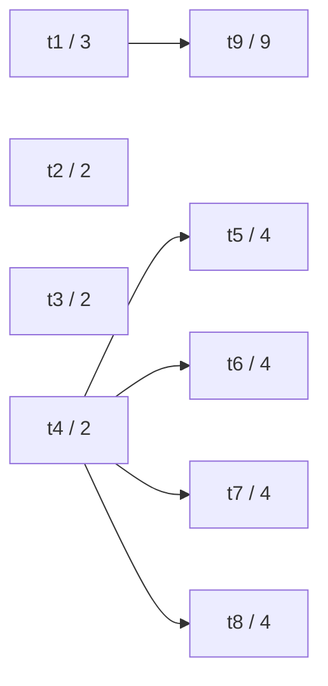

# Anomalías, consistencia y holguras

Esta página completa el [capítulo 72](index.md) con tres partes de sus
fuentes que las cinco versiones no desarrollan: las **anomalías** de la
planificación por lista que estudió Ronald Graham, la **consistencia** de
las heurísticas, que el artículo de A\* de Hart, Nilsson y Raphael
distingue de la admisibilidad, y las **fechas tempranas, fechas tardías y
holguras** del método del camino crítico. Los ejemplos son
`anomalias.pl`, `consistencia.pl` y `holguras.pl`, en
`ejemplos/capitulo-72/`, con sus pruebas; cargan otros archivos del
capítulo y se ejecutan en una instalación local.

## Las anomalías de la planificación por lista

La [sección 72.3](index.md#723-version-1-la-planificacion-por-lista)
cita la cota de Graham para el cambio de la lista de prioridades. El
artículo de 1966 estudia, además, cuatro cambios a la vez: otra lista,
tareas más cortas, menos precedencias y otra cantidad de procesadores.
Los tres últimos parecen favorables, y sin embargo cualquiera de ellos
puede alargar el calendario que arma la planificación por lista. En un
artículo de 1969, Graham muestra cada caso con un mismo proyecto de nueve
tareas y tres procesadores, que `anomalias.pl` reproduce:



`variante/3` da el proyecto original y cada variante con la lista con que
se planifica: la del original es t1, …, t9.

<!-- ejemplo: capitulo-72/anomalias.pl predicado: variante/3 -->
```prolog
%!  variante(?Nombre, -Proyecto, -Lista:list) is nondet.
%
%   Proyecto es la variante Nombre del ejemplo de Graham y Lista la
%   prioridad con que se planifica: base, el original; otra_lista, con
%   otra prioridad; sin_dos_precedencias, sin t4 antes de t5 ni t4 antes
%   de t6; mas_cortas, con cada tarea una unidad más corta; y
%   cuatro_procesadores, con un procesador más.
variante(base, proyecto(Tareas, Precedencias, 3), Lista) :-
    tareas_graham(0, Tareas),
    precedencias_graham([], Precedencias),
    lista_graham(Lista).
variante(otra_lista, proyecto(Tareas, Precedencias, 3),
         [t1, t2, t4, t5, t6, t3, t9, t7, t8]) :-
    tareas_graham(0, Tareas),
    precedencias_graham([], Precedencias).
variante(sin_dos_precedencias, proyecto(Tareas, Precedencias, 3), Lista) :-
    tareas_graham(0, Tareas),
    precedencias_graham([antes(t4, t5), antes(t4, t6)], Precedencias),
    lista_graham(Lista).
variante(mas_cortas, proyecto(Tareas, Precedencias, 3), Lista) :-
    tareas_graham(1, Tareas),
    precedencias_graham([], Precedencias),
    lista_graham(Lista).
variante(cuatro_procesadores, proyecto(Tareas, Precedencias, 4), Lista) :-
    tareas_graham(0, Tareas),
    precedencias_graham([], Precedencias),
    lista_graham(Lista).
```

`anomalias/1` planifica cada variante por lista y, para comparar, busca
su duración óptima con A\* y la heurística combinada de la
[versión 4](camino.md#version-4-el-camino-critico):

<!-- ejemplo: capitulo-72/anomalias.pl predicado: anomalias/1 -->
```prolog
%!  anomalias(-Filas:list) is det.
%
%   Filas tiene un término fila(Nombre, PorLista, Optima) por cada
%   variante: la duración del calendario por lista y la duración óptima.
anomalias(Filas) :-
    findall(fila(Nombre, PorLista, Optima),
            ( variante(Nombre, Proyecto, Lista),
              por_lista(Proyecto, ordenadas(Lista), C1),
              duracion(C1, PorLista),
              optimo(Proyecto, combinada, C2, _),
              duracion(C2, Optima) ),
            Filas).
```

<!-- contexto: capitulo-72/anomalias.pl -->
```prolog
?- anomalias(Fs).
Fs = [fila(base, 12, 12), fila(otra_lista, 14, 12), fila(sin_dos_precedencias, 16, 12), fila(mas_cortas, 13, 10), fila(cuatro_procesadores, 15, 12)].

?- ver_variante(base).
P1 t1----t9----------------
P2 t2--t4--t5------t7------
P3 t3--....t6------t8------
duración: 12
true.

?- ver_variante(cuatro_procesadores).
P1 t1----t8------
P2 t2--t5------t9----------------
P3 t3--t6------
P4 t4--t7------
duración: 15
true.
```

Con la lista original el calendario dura 12, que es el óptimo: la cadena
`t1`, `t9` suma 12. Con un cuarto procesador, `t4` empieza en el momento
0 y libera enseguida a sus cuatro sucesoras; los procesadores que quedan
libres en 2 y en 3 toman `t5`, `t6`, `t7` y `t8`, que están antes en la
lista, y `t9` empieza recién en 6. El calendario pasa de 12 a 15. Quitar
dos precedencias y acortar todas las tareas tienen el mismo efecto por la
misma causa: cambian el momento en que cada tarea queda lista, y la lista
asigna antes las tareas que no están en la cadena más larga.

La columna de la derecha muestra que la anomalía es del método, no del
problema: la duración óptima nunca crece con esos cambios, porque todo
calendario del proyecto original sigue siendo válido después de quitar
precedencias o de agregar un procesador, y uno con las tareas más cortas
se obtiene del original sin moverlas de su inicio. Graham prueba que,
con n procesadores antes del cambio y n′ después, el calendario por lista
no se alarga más que 1 + (n − 1)/n′ veces; con n = n′ = 3 da 5/3, y el
ejemplo llega a 16/12. Es otra razón por la que el planificador de la
[versión 5](index.md#727-version-5-el-planificador) no confía en un
calendario por lista sin una cota inferior que lo respalde.

## Heurísticas consistentes

La [sección 72.5](index.md#725-version-3-repartir-el-trabajo) justifica
las heurísticas con la **admisibilidad**: nunca estiman de más. El
artículo de Hart, Nilsson y Raphael agrega una segunda condición, más
fuerte. Una heurística h es **consistente**, o monótona, si en cada
transición de un estado E a un estado S con costo c se cumple

$$h(E) \le c + h(S)$$

es decir, la estimación no baja de un estado al siguiente más de lo que
cuesta el paso. Una heurística consistente que vale 0 en las metas es
admisible, y con ella A\* extrae cada estado de la frontera, la primera
vez, con su menor costo acumulado: nunca necesita expandirlo de nuevo.
Con una heurística admisible que no es consistente, A\* puede llegar a un
estado ya expandido por un camino más barato. `buscar/5` del
[capítulo 40](../capitulo-40-busqueda-y-planificacion/index.md) lo tiene
en cuenta: guarda el menor costo con que vio cada estado y vuelve a
agregarlo a la frontera si lo alcanza con uno menor, de modo que da el
óptimo en los dos casos.

En un proyecto chico, la consistencia se puede verificar en todo el
espacio de estados. `alcanzables/2` lo recorre desde el estado inicial
con un conjunto de `library(nb_set)`, que agrega cada estado una sola vez
sin copiar el conjunto, y `arista_inconsistente/5` busca en él una
transición que viole la condición:

<!-- ejemplo: capitulo-72/consistencia.pl predicado: alcanzables/2 recorrer/3 arista_inconsistente/5 consistente/2 -->
```prolog
%!  alcanzables(+Proyecto, -Estados:list) is det.
%
%   Estados son todos los estados del espacio de la versión 2 que se
%   alcanzan desde el estado inicial de Proyecto, en el orden estándar.
alcanzables(Proyecto, Estados) :-
    inicial(datos(Proyecto, cero), Inicial),
    empty_nb_set(Vistos),
    add_nb_set(Inicial, Vistos),
    recorrer([Inicial], Proyecto, Vistos),
    nb_set_to_list(Vistos, Estados).

%!  recorrer(+Frontera:list, +Proyecto, +Vistos) is det.
%
%   Agrega a Vistos todos los estados que se alcanzan desde los de
%   Frontera.
recorrer([], _, _).
recorrer([Estado|Frontera], Proyecto, Vistos) :-
    findall(Siguiente,
            ( sucesor(datos(Proyecto, cero), Estado, _, Siguiente, _),
              add_nb_set(Siguiente, Vistos, true) ),
            Nuevos),
    append(Nuevos, Frontera, Frontera1),
    recorrer(Frontera1, Proyecto, Vistos).

%!  arista_inconsistente(+Proyecto, :Heuristica, -Estado, -Siguiente,
%!                       -Costo:integer) is nondet.
%
%   La transición de Estado a Siguiente, con Costo, viola la consistencia
%   de Heuristica: lo que estima en Estado supera Costo más lo que estima
%   en Siguiente.
arista_inconsistente(Proyecto, Heuristica, Estado, Siguiente, Costo) :-
    alcanzables(Proyecto, Estados),
    member(Estado, Estados),
    sucesor(datos(Proyecto, cero), Estado, _, Siguiente, Costo),
    call(Heuristica, Proyecto, Estado, H0),
    call(Heuristica, Proyecto, Siguiente, H1),
    H0 > Costo + H1.

%!  consistente(+Proyecto, :Heuristica) is semidet.
%
%   Heuristica es consistente en todo el espacio de estados de Proyecto.
consistente(Proyecto, Heuristica) :-
    \+ arista_inconsistente(Proyecto, Heuristica, _, _, _).
```

Para contrastar, `salteada/3` es una heurística admisible que no es
consistente: da lo que estima `camino/3` cuando queda una cantidad par de
tareas pendientes y 0 cuando queda una impar. Nunca supera a `camino/3`,
de modo que nunca estima de más, pero al empezar una tarea sin aumentar
la duración la estimación puede bajar a 0 en un paso que no cuesta nada.

<!-- ejemplo: capitulo-72/consistencia.pl predicado: salteada/3 -->
```prolog
%!  salteada(+Proyecto, +Estado, -H:integer) is det.
%
%   H es lo que estima camino/3 si en Estado queda una cantidad par de
%   tareas pendientes, y 0 si queda una cantidad impar. Nunca estima de
%   más, porque nunca supera a camino/3, pero no es consistente.
salteada(Proyecto, e(Pendientes, Libres, Fines), H) :-
    length(Pendientes, N),
    (   N mod 2 =:= 0
    ->  camino(Proyecto, e(Pendientes, Libres, Fines), H)
    ;   H = 0
    ).
```

`medir_consistencia/4` cuenta los estados alcanzables de un proyecto de
ejemplo y las transiciones que violan la condición:

<!-- contexto: capitulo-72/consistencia.pl -->
```prolog
?- medir_consistencia(casa, combinada, E, M).
E = 1017,
M = 0.

?- medir_consistencia(coffman, combinada, E, M).
E = 22685,
M = 0.

?- medir_consistencia(coffman, salteada, E, M).
E = 22685,
M = 1017.

?- medir(coffman, salteada, D, K).
D = 24,
K = 52.
```

En los dos proyectos, ninguna transición entre los 22 685 y los 1 017
estados alcanzables viola la consistencia de la heurística combinada; las pruebas verifican lo mismo
para `reparto/3` y `camino/3`. Para `reparto/3` hay, además, un
argumento general. Empezar una tarea de duración d en el momento T
reemplaza T por T + d en los momentos de los procesadores y resta d al
trabajo pendiente: el reparto R no cambia, la duración pasa de D a D′ y
el paso cuesta D′ − D, de modo que R − D = (D′ − D) + (R − D′). Esperar
no cuesta nada y solo aumenta R. En los dos casos la estimación no baja
más que el costo. La verificación exhaustiva de `camino/3` no es una
prueba: cubre los proyectos de ejemplo, no todos.

`salteada/3` viola la condición en 1 017 transiciones de `coffman`
(prueba `consistencia:salteada_coffman`), y A\* con ella sigue dando 24,
porque `buscar/5` reabre los estados; expande 52 estados, el doble de los
26 que expande con `camino/3`, que en cada estado estima al menos lo mismo
(pruebas `consistencia:salteada_optima` y `consistencia:camino_optima`).
Una heurística admisible da el óptimo con esta búsqueda;
la consistencia asegura además que ningún estado se expande dos veces.

!!! example "Patrón 72 — Verificar una propiedad en todo el espacio de estados de un caso chico"
    **Problema.** Una propiedad debe valer en todos los estados de un
    espacio de búsqueda, o en todas sus transiciones, como la
    consistencia de una heurística, y no hay una demostración general,
    o la que hay conviene confirmarla con el programa.

    **Versión ingenua.** Comprobar la propiedad en algunos estados
    elegidos a mano, o juzgar la heurística por el resultado de la
    búsqueda. Ninguna de las dos cosas detecta el defecto de
    `salteada/3`: A\* con ella da en `coffman` la duración óptima, 24,
    igual que con `camino/3`, y solo los 52 estados expandidos, contra
    26, reflejan las 1 017 transiciones que violan la condición.

    **Patrón.** Elegir casos chicos, como los proyectos de ejemplo, y
    generar su espacio de estados completo desde el estado inicial, cada
    estado una sola vez, con un conjunto de visitados (`alcanzables/2`,
    con `library(nb_set)`). Escribir un generador de contraejemplos, que
    recorre los estados y sus sucesores y tiene éxito con cada
    transición que viola la propiedad (`arista_inconsistente/5`), y
    definir la propiedad como su negación (`consistente/2`). Es el
    [Patrón 13](../patrones.md#13-comprobar-para-todos) aplicado a un
    espacio que el programa genera, en la forma que recomienda su
    «Cuándo no usarlo»: el generador nombra la transición que falla, y
    una prueba de `consistencia.plt` la muestra. El recorrido cubre
    1 017 estados en `casa` y 22 685 en `coffman`, y verificar
    `combinada/3` en `coffman` cuesta unos 8,5 millones de inferencias
    (prueba `consistencia:coffman_combinada`, dentro de un 10 %).
    Son las pruebas de una propiedad sobre muchos datos que el
    [Patrón 33](../patrones.md#33-una-prueba-por-modo-y-por-caso-limite)
    deja fuera de sus casos.

    **Cuándo no usarlo.** Cuando el espacio es infinito o demasiado
    grande para recorrerlo: las siete tareas y los tres procesadores de
    `coffman` ya dan 22 685 estados. Cuando se toma el
    recorrido por una demostración: cubre los casos recorridos, no
    todos, y `camino/3` queda verificada solo en los proyectos de
    ejemplo. Y cuando hay un argumento general, como el de `reparto/3`:
    el argumento es la garantía, y el recorrido solo lo confirma en los
    casos chicos.

## Fechas tempranas, fechas tardías y holguras

La [versión 4](camino.md#version-4-el-camino-critico) usa el camino
crítico como heurística, y el ejercicio 3 define la **cabeza** de una
tarea, el momento más temprano en que puede empezar. En la gestión de
proyectos, el método del camino crítico completa esas dos medidas con una
tercera, suponiendo procesadores de sobra:

- la **fecha temprana** de una tarea es lo antes que puede empezar: el
  mayor fin temprano de sus predecesoras, o 0;
- la **duración mínima** del proyecto es el mayor fin temprano;
- la **fecha tardía** es lo más tarde que puede empezar sin demorar esa
  duración: la menor fecha tardía de sus sucesoras, o la duración mínima
  si no tiene, menos su propia duración;
- la **holgura** es la diferencia entre las dos fechas: cuánto puede
  demorarse la tarea sin demorar el proyecto. Las tareas de holgura 0
  forman el camino crítico.

`cola/3` y la cabeza del ejercicio 3 se definen por recursión sobre las
sucesoras o las predecesoras, y una tarea con muchos caminos hacia ella
se recalcula una vez por camino. `fechas/3` hace en cambio dos pasadas
sobre el orden topológico de `orden_topologico/2`: hacia adelante para
las fechas tempranas, cuando cada predecesora ya tiene la suya, y hacia
atrás para las tardías. Las fechas calculadas se guardan en un árbol de
`library(assoc)`, y cada pasada examina cada tarea y cada precedencia una
sola vez.

<!-- ejemplo: capitulo-72/holguras.pl predicado: fechas/3 temprana/4 mayor_fin/5 tardia/5 -->
```prolog
%!  fechas(+Proyecto, -Fechas:list, -Largo:integer) is semidet.
%
%   Fechas tiene un término fechas(Tarea, Temprana, Tardia) por cada tarea
%   de Proyecto, en orden topológico, y Largo es la duración mínima del
%   proyecto con procesadores de sobra. Falla si las precedencias forman
%   un ciclo.
fechas(Proyecto, Fechas, Largo) :-
    orden_topologico(Proyecto, Orden),
    empty_assoc(Vacio),
    foldl(temprana(Proyecto), Orden, Vacio, Tempranas),
    foldl(mayor_fin(Proyecto, Tempranas), Orden, 0, Largo),
    reverse(Orden, Inverso),
    foldl(tardia(Proyecto, Largo), Inverso, Vacio, Tardias),
    findall(fechas(T, I, J),
            ( member(T, Orden),
              get_assoc(T, Tempranas, I),
              get_assoc(T, Tardias, J) ),
            Fechas).

%!  temprana(+Proyecto, +Tarea, +Tempranas0, -Tempranas) is det.
%
%   Tempranas es Tempranas0 con la fecha temprana de Tarea: el mayor fin
%   temprano de sus predecesoras, o 0 si no tiene. Tempranas0 ya tiene la
%   fecha de cada predecesora.
temprana(Proyecto, Tarea, Tempranas0, Tempranas) :-
    findall(F,
            ( precede(Proyecto, Antes, Tarea),
              get_assoc(Antes, Tempranas0, I),
              tarea(Proyecto, Antes, D),
              F is I + D ),
            Fines),
    max_list([0|Fines], Inicio),
    put_assoc(Tarea, Tempranas0, Inicio, Tempranas).

%!  mayor_fin(+Proyecto, +Tempranas, +Tarea, +L0:integer, -L:integer)
%!      is det.
%
%   L es el mayor entre L0 y el fin temprano de Tarea.
mayor_fin(Proyecto, Tempranas, Tarea, L0, L) :-
    get_assoc(Tarea, Tempranas, I),
    tarea(Proyecto, Tarea, D),
    L is max(L0, I + D).

%!  tardia(+Proyecto, +Largo:integer, +Tarea, +Tardias0, -Tardias) is det.
%
%   Tardias es Tardias0 con la fecha tardía de Tarea: la menor fecha
%   tardía de sus sucesoras, o Largo si no tiene, menos su duración.
%   Tardias0 ya tiene la fecha de cada sucesora.
tardia(Proyecto, Largo, Tarea, Tardias0, Tardias) :-
    findall(J,
            ( precede(Proyecto, Tarea, Despues),
              get_assoc(Despues, Tardias0, J) ),
            Inicios),
    min_list([Largo|Inicios], Fin),
    tarea(Proyecto, Tarea, D),
    Inicio is Fin - D,
    put_assoc(Tarea, Tardias0, Inicio, Tardias).
```

<!-- ejemplo: capitulo-72/holguras.pl predicado: holguras/2 camino_critico/2 -->
```prolog
%!  holguras(+Proyecto, -Holguras:list) is semidet.
%
%   Holguras tiene un par Tarea-Holgura por cada tarea de Proyecto, en
%   orden topológico: cuánto puede demorarse la tarea sin demorar el final
%   del proyecto, con procesadores de sobra.
holguras(Proyecto, Holguras) :-
    fechas(Proyecto, Fechas, _),
    findall(T-H,
            ( member(fechas(T, I, J), Fechas),
              H is J - I ),
            Holguras).

%!  camino_critico(+Proyecto, -Tareas:list) is semidet.
%
%   Tareas son las tareas de Proyecto con holgura 0, en orden topológico.
camino_critico(Proyecto, Tareas) :-
    holguras(Proyecto, Holguras),
    findall(T, member(T-0, Holguras), Tareas).
```

<!-- contexto: capitulo-72/holguras.pl -->
```prolog
?- fechas_de(casa, Fs, L).
Fs = [fechas(cimientos, 0, 0), fechas(paredes, 5, 5), fechas(aberturas, 13, 25), fechas(agua, 13, 15), fechas(luz, 13, 16), fechas(techo, 13, 13), fechas(revoque, 19, 19), fechas(pintura, 24, 24)],
L = 27.

?- holguras_de(casa, Hs).
Hs = [cimientos-0, paredes-0, aberturas-12, agua-2, luz-3, techo-0, revoque-0, pintura-0].

?- holguras_de(coffman, Hs).
Hs = [t1-0, t2-2, t3-2, t4-0, t5-0, t6-11, t7-11].
```

En la obra, el camino crítico es cimientos, paredes, techo, revoque y
pintura, las 27 unidades que la
[sección 72.5](index.md#725-version-3-repartir-el-trabajo) señala como
la cadena que ningún reparto acorta. Las aberturas pueden demorarse 12
unidades, el agua 2 y la luz 3. Las holguras suponen procesadores de
sobra. Con dos cuadrillas, el techo ocupa una de ellas entre 13 y 19, y
el agua y la luz se hacen una después de la otra en la segunda: la que va
segunda empieza 4 o 3 unidades tarde, más que su holgura, y el proyecto
se demora una unidad. Por eso el óptimo es 28 y no 27.

La fecha tardía de una tarea es la duración mínima menos su cola, porque
la cola es justamente lo que tiene que pasar desde que la tarea empieza
hasta el final; la prueba `tardia_y_cola` lo verifica en tres proyectos.
Ordenar por la menor fecha tardía es, por lo tanto, la prioridad «mayor
cola primero» que usa el planificador de la versión 5, y en la gestión de
proyectos se la conoce como la regla de la menor fecha tardía de inicio.

En `coffman`, `t6` y `t7` tienen 11 unidades de holgura, y `t4` y `t5`
ninguna. Las holguras dicen lo que el calendario de 24 hace: empezar
`t4` y `t5` apenas termina `t1`, y postergar `t6` y `t7`. La
planificación por lista no puede aprovecharlo con ninguna prioridad: en
el momento 2 las únicas tareas listas son `t6` y `t7`, y la lista nunca
deja un procesador ocioso si hay una tarea lista. La holgura informa
cuánto se puede esperar; decidir esperar requiere la búsqueda.
