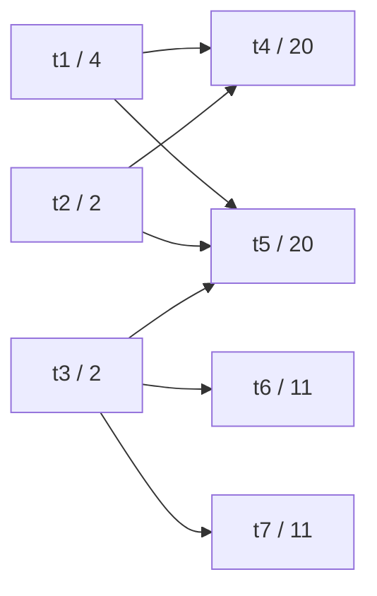
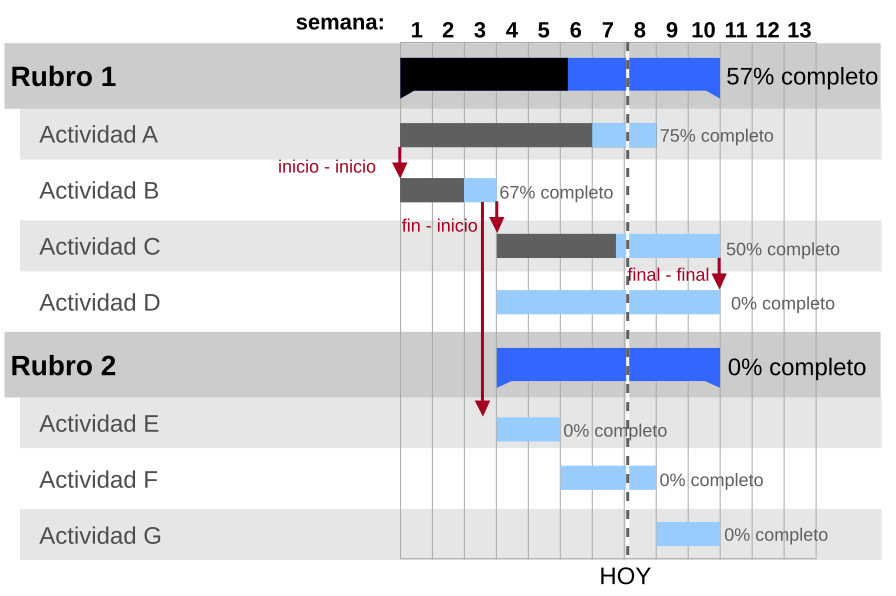

# Capítulo 72 — Proyecto: planificación de tareas

Un proyecto se compone de tareas con una duración conocida, algunas de las
cuales no pueden empezar antes de que terminen otras, y se dispone de
varios procesadores idénticos: máquinas, cuadrillas u operarios que
ejecutan una tarea por vez. **Planificar** el proyecto es decidir cuándo
empieza cada tarea y en qué procesador, respetando las precedencias, de
modo que la última tarea termine lo antes posible. Este capítulo construye
un planificador que resuelve el problema con la búsqueda A\* del
[capítulo 40](../capitulo-40-busqueda-y-planificacion/index.md) y que,
cuando la búsqueda resulta demasiado cara, entrega un calendario junto con
lo que puede asegurar de él:

<!-- contexto: capitulo-72/planificador.pl -->
```prolog
?- informe_de(coffman, 1000000).
P1 t3--t7--------------------t6--------------------
P2 t1------t5--------------------------------------
P3 ....t2--t4--------------------------------------
duración: 24
es la duración óptima (a_estrella)
true.

?- informe_de(casa, 10000).
P1 cimientos-paredes---------techo-------aberturas........pintura
P2 ..........................agua----luz---revoque---
duración: 28
la duración óptima está entre 27 y 28
true.
```

Cada línea es un procesador, con dos columnas por unidad de tiempo: el
nombre de la tarea seguido de guiones ocupa su duración, y los puntos son
tiempo sin tarea. El primer proyecto tiene siete tareas y tres
procesadores, y su calendario más corto dura 24 unidades. El segundo es
una obra con dos cuadrillas; con un límite de 10 000 inferencias la
búsqueda no alcanza a terminar, y el planificador devuelve un calendario
de 28 unidades con la garantía de que ninguno dura menos de 27. Con un
límite mayor prueba que 28 es el óptimo.

El proyecto parte de *Prolog Programming for Artificial Intelligence* de
Ivan Bratko, que en el capítulo «Best-first: A Heuristic Search Principle»
aplica la búsqueda primero el mejor a este problema. De allí se toman el
planteo, el ejemplo de siete tareas y tres procesadores (que Bratko toma a
su vez de *Operating Systems Theory* de Coffman y Denning), la idea de
armar el calendario de izquierda a derecha dejando un procesador ocioso
solo hasta que termina otra tarea, y una heurística que reparte el trabajo
pendiente entre los procesadores. La lista completa, con lo que se toma de
cada fuente, está en [Referencias](#referencias). El código es propio.

El capítulo carga, sin copiarla, la búsqueda del
[capítulo 40](../capitulo-40-busqueda-y-planificacion/index.md). Cada
versión es un módulo, y todos son `% solo-local`, porque cargan otros
archivos. La representación de los proyectos y los calendarios,
`tareas.pl`, no depende de ninguna búsqueda: el
[capítulo 73](../capitulo-73-proyecto-horarios-inscripciones/index.md) la
usa para armar horarios.

## Objetivos del capítulo

Al terminar el capítulo, el lector puede:

- representar un problema de planificación con términos limpios y
  verificar cualquier calendario contra él, sin importar cómo se obtuvo;
- plantear la planificación como búsqueda en un espacio de estados y
  reutilizar para ella una búsqueda escrita para otro problema;
- diseñar heurísticas que nunca estiman de más relajando el problema, y
  combinarlas con el máximo;
- medir cuántos estados expande A\* con cada heurística y explicar la
  diferencia entre un calendario óptimo y uno voraz;
- acotar el costo de una búsqueda con un límite de inferencias y
  acompañar el resultado con una garantía verificable.

!!! info "Tiempo estimado"
    Leer el capítulo, ejecutar sus ejemplos y hacer las actividades: **1:40 h**.
    Resolver los 5 ejercicios marcados con ★: **1:15 h**.
    Resolver los 12 ejercicios del final: **3:45 h**.

## 72.1 El problema y su representación

Un **proyecto** es el término `proyecto(Tareas, Precedencias,
Procesadores)`: una lista de `tarea(Nombre, Duracion)`, una lista de
`antes(A, B)`, que exige que la tarea A termine antes de que empiece la B,
y la cantidad de procesadores. Una tarea empezada no se interrumpe. El
archivo `tareas.pl` define tres proyectos de ejemplo:

<!-- ejemplo: capitulo-72/tareas.pl predicado: ejemplo/2 -->
```prolog
%!  ejemplo(+Nombre, -Proyecto) is semidet.
%
%   Proyecto es el proyecto de ejemplo Nombre. coffman es el de Coffman y
%   Denning que usa Bratko: siete tareas y tres procesadores; casa, ocho
%   tareas de una obra con dos cuadrillas; taller(N), con N instanciado,
%   N tareas con pocas precedencias y tres procesadores, para medir cómo
%   crece la búsqueda con el tamaño.
ejemplo(coffman,
        proyecto([ tarea(t1, 4), tarea(t2, 2), tarea(t3, 2), tarea(t4, 20),
                   tarea(t5, 20), tarea(t6, 11), tarea(t7, 11) ],
                 [ antes(t1, t4), antes(t1, t5), antes(t2, t4),
                   antes(t2, t5), antes(t3, t5), antes(t3, t6),
                   antes(t3, t7) ],
                 3)).
ejemplo(casa,
        proyecto([ tarea(cimientos, 5), tarea(paredes, 8), tarea(techo, 6),
                   tarea(agua, 4), tarea(luz, 3), tarea(revoque, 5),
                   tarea(pintura, 3), tarea(aberturas, 2) ],
                 [ antes(cimientos, paredes), antes(paredes, techo),
                   antes(paredes, agua), antes(paredes, luz),
                   antes(agua, revoque), antes(luz, revoque),
                   antes(techo, revoque), antes(revoque, pintura),
                   antes(paredes, aberturas) ],
                 2)).
ejemplo(taller(N), proyecto(Tareas, Precedencias, 3)) :-
    must_be(nonneg, N),
    findall(tarea(T, D),
            ( between(1, N, I),
              atom_concat(t, I, T),
              D is 2 + (7 * I * I + 3 * I) mod 11 ),
            Tareas),
    findall(antes(A, B),
            ( between(4, N, I),
              I mod 4 =:= 0,
              J is I - 2,
              atom_concat(t, J, A),
              atom_concat(t, I, B) ),
            Precedencias).
```

Las precedencias de `coffman` forman este grafo; cada nodo da la tarea y
su duración:



`coffman` es el proyecto de Bratko. `casa` es una obra en la que dos
cuadrillas levantan paredes, techo e instalaciones. `taller(N)` genera N
tareas con duraciones entre 2 y 12 y pocas precedencias, para medir cómo
crece el costo de la búsqueda con el tamaño del proyecto.

El calendario de un proyecto se dibuja habitualmente como un diagrama de
Gantt: una barra horizontal por tarea, a lo largo de un eje de tiempo, y
flechas para las dependencias. La salida de `informe_de/2` es un diagrama
de Gantt en texto, con una línea por procesador en lugar de una por tarea.



Un diagrama de Gantt con tareas agrupadas, las dependencias entre ellas
en rojo y el avance de cada tarea. Imagen: Garrybooker, Malyszkz y Mario
Fávre, [CC0](https://creativecommons.org/publicdomain/zero/1.0/deed.es),
vía
[Wikimedia Commons](https://commons.wikimedia.org/wiki/File:GanttChartAnatomyES.svg).

Un **calendario** es una lista de `asignada(Tarea, Procesador, Inicio,
Fin)`, ordenada por el inicio, y su duración es el mayor `Fin`. Separar
el calendario del procedimiento que lo produce permite verificar
cualquier resultado con el mismo predicado: `valido/2` comprueba que cada
tarea aparece una vez, con su duración, en un procesador que existe, que
ningún procesador ejecuta dos tareas a la vez y que se respeta cada
precedencia.

<!-- ejemplo: capitulo-72/tareas.pl predicado: valido/2 superpuestas/1 -->
```prolog
%!  valido(+Proyecto, +Calendario:list) is semidet.
%
%   Calendario cumple con Proyecto: cada tarea aparece una sola vez, con su
%   duración, en un procesador que existe; ningún procesador ejecuta dos
%   tareas a la vez; y cada precedencia se respeta.
valido(Proyecto, Calendario) :-
    findall(T, tarea(Proyecto, T, _), Tareas0),
    findall(T, member(asignada(T, _, _, _), Calendario), Tareas1),
    msort(Tareas0, Tareas),
    msort(Tareas1, Tareas),
    procesadores(Proyecto, N),
    forall(member(asignada(T, P, I, F), Calendario),
           ( tarea(Proyecto, T, D),
             between(1, N, P),
             I >= 0,
             F =:= I + D )),
    \+ superpuestas(Calendario),
    forall(precede(Proyecto, A, B),
           ( memberchk(asignada(A, _, _, FinA), Calendario),
             memberchk(asignada(B, _, IniB, _), Calendario),
             FinA =< IniB )).

%!  superpuestas(+Calendario:list) is semidet.
%
%   Dos tareas distintas de Calendario ocupan el mismo procesador al mismo
%   tiempo.
superpuestas(Calendario) :-
    member(asignada(T1, P, I1, F1), Calendario),
    member(asignada(T2, P, I2, F2), Calendario),
    T1 @< T2,
    I1 < F2,
    I2 < F1,
    !.
```

`calendario_coffman/1` es un calendario de 24 unidades escrito a mano, que
las pruebas usan para verificar `valido/2` y el dibujo. `mostrar/2`
escribe las líneas que produce `lineas/3`, un predicado puro que las
devuelve como cadenas:

<!-- contexto: capitulo-72/tareas.pl -->
```prolog
?- calendario_coffman(C), duracion(C, D).
C = [asignada(t1, 1, 0, 4), asignada(t2, 2, 0, 2), asignada(t3, 3, 0, 2), asignada(t7, 3, 2, 13), asignada(t4, 2, 4, 24), asignada(t5, 1, 4, 24), asignada(t6, 3, 13, 24)],
D = 24.

?- forall(ejemplo(coffman, P), (calendario_coffman(C), mostrar(P, C))).
P1 t1------t5--------------------------------------
P2 t2--....t4--------------------------------------
P3 t3--t7--------------------t6--------------------
duración: 24
true.
```

Las versiones que buscan no siempre saben en qué procesador queda cada
tarea: les basta con saber cuándo empieza y cuándo termina. `repartir/3`
convierte una lista de `tramo(Tarea, Inicio, Fin)` en un calendario,
tomando los tramos por su inicio y poniendo cada uno en el procesador de
menor número que está libre en ese momento:

<!-- ejemplo: capitulo-72/tareas.pl predicado: repartir/3 por_inicio/2 ubicar/4 -->
```prolog
%!  repartir(+N:integer, +Tramos:list, -Calendario:list) is semidet.
%
%   Calendario asigna a uno de N procesadores cada tramo(Tarea, Inicio,
%   Fin) de Tramos: los tramos se toman por su inicio, y cada uno va al
%   procesador de menor número que está libre en ese momento. Falla si en
%   algún momento hay más de N tramos a la vez.
repartir(N, Tramos, Calendario) :-
    maplist(por_inicio, Tramos, Pares0),
    keysort(Pares0, Pares),
    pairs_values(Pares, Ordenados),
    length(Libres, N),
    maplist(=(0), Libres),
    foldl(ubicar, Ordenados, Calendario, Libres, _).

%!  por_inicio(+Tramo, -Par) is det.
%
%   Par es Tramo con su inicio como clave.
por_inicio(tramo(T, I, F), I-tramo(T, I, F)).

%!  ubicar(+Tramo, -Asignada, +Libres0:list, -Libres:list) is semidet.
%
%   Asignada pone Tramo en el primer procesador libre en su inicio;
%   Libres0 da, para cada procesador, desde cuándo está libre.
ubicar(tramo(T, I, F), asignada(T, P, I, F), Libres0, Libres) :-
    nth1(P, Libres0, Libre, Resto),
    Libre =< I,
    !,
    nth1(P, Libres, F, Resto).
```

```prolog
?- repartir(2, [tramo(a, 0, 4), tramo(b, 0, 2), tramo(c, 2, 5)], C).
C = [asignada(a, 1, 0, 4), asignada(b, 2, 0, 2), asignada(c, 2, 2, 5)].
```

Si en algún momento hay más tramos que procesadores, `repartir/3` falla.
Por último, `orden_topologico/2` ordena las tareas de modo que cada una
aparece después de sus predecesoras, con `top_sort/2` de
`library(ugraphs)`, y falla si las precedencias forman un ciclo: un
proyecto así no tiene ningún calendario, y la versión 5 lo rechaza antes
de buscar.

!!! question "Actividad"
    Predecir qué responde `valido/2` si en el calendario de Coffman la
    tarea `t5` empieza en 2 y termina en 22, en el mismo procesador.
    Nombrar la condición que falla. Comprobarlo con `selectchk/4` sobre
    `calendario_coffman/1`, como hace la prueba `precedencia_violada` de
    `tareas.plt`.

## 72.2 El programa terminado

| Versión | Archivo | Agrega | Lo que no puede hacer todavía |
|---|---|---|---|
| 1 | `lista.pl` | la planificación por lista: un calendario sin volver atrás | dejar un procesador ocioso a propósito |
| 2 | `espacio.pl` | el espacio de estados y A\* del [capítulo 40](../capitulo-40-busqueda-y-planificacion/index.md), sin heurística | evitar la explosión de estados |
| 3 | `reparto.pl` | la heurística que reparte el trabajo entre los procesadores | tener en cuenta las precedencias |
| 4 | `camino.pl` | la heurística del camino crítico y su combinación con la anterior | acotar el costo de los proyectos grandes |
| 5 | `planificador.pl` | el planificador con un límite y una garantía | — |

`tareas.pl` es la representación de todas las versiones, y `busqueda.pl`
carga la búsqueda del [capítulo 40](../capitulo-40-busqueda-y-planificacion/index.md) para cualquier problema. Cada versión
reexporta la anterior, de modo que al cargar `planificador.pl` quedan
disponibles todos los predicados del capítulo.

## 72.3 Versión 1: la planificación por lista

La forma más directa de armar un calendario es no buscar: ordenar las
tareas una vez según una **prioridad** y asignarlas en ese orden. El
procesador que se libera primero toma la primera tarea de la lista que
está **lista**, es decir, cuyas predecesoras ya terminaron; si ninguna lo
está, espera hasta que se libere otro procesador. Los procesadores se
representan solo por el momento desde el que están libres, en una lista
ordenada de menor a mayor: son idénticos, y no importa cuál es cuál.

<!-- ejemplo: capitulo-72/lista.pl predicado: armar/5 lista/4 -->
```prolog
%!  armar(+Proyecto, +Pendientes:list, +Libres:list, +Fines:list,
%!        -Tramos:list) is semidet.
%
%   Tramos son los tramos de las tareas Pendientes, cuando cada procesador
%   está libre desde el momento que da Libres, ordenada de menor a mayor,
%   y Fines da el fin de cada tarea ya empezada.
armar(_, [], _, _, []) :-
    !.
armar(Proyecto, Pendientes, [T|Libres], Fines, Tramos) :-
    (   member(Tarea, Pendientes),
        lista(Proyecto, Tarea, T, Fines)
    ->  selectchk(Tarea, Pendientes, Pendientes1),
        tarea(Proyecto, Tarea, Duracion),
        F is T + Duracion,
        Tramos = [tramo(Tarea, T, F)|Tramos1],
        msort([F|Libres], Libres1),
        armar(Proyecto, Pendientes1, Libres1, [Tarea-F|Fines], Tramos1)
    ;   member(Hasta, Libres),
        Hasta > T
    ->  msort([Hasta|Libres], Libres1),
        armar(Proyecto, Pendientes, Libres1, Fines, Tramos)
    ).

%!  lista(+Proyecto, +Tarea, +T:integer, +Fines:list) is semidet.
%
%   Cada predecesora de Tarea empezó y terminó a más tardar en T; Fines
%   tiene un par Tarea-Fin por cada tarea empezada.
lista(Proyecto, Tarea, T, Fines) :-
    forall(precede(Proyecto, Antes, Tarea),
           ( memberchk(Antes-F, Fines),
             F =< T )).
```

`armar/5` no deja alternativas: cada paso se compromete con la primera
tarea lista. Hay dos prioridades, `orden` (el orden del proyecto) y
`larga` (la de mayor duración primero), y con `ordenadas(Lista)` la
lista la da quien llama:

<!-- contexto: capitulo-72/lista.pl -->
```prolog
?- medir_lista(coffman, orden, D).
D = 33.

?- medir_lista(coffman, larga, D).
D = 33.

?- ver_lista(coffman, orden).
P1 t1------t4--------------------------------------
P2 t2--t6--------------------t5--------------------------------------
P3 t3--t7--------------------
duración: 33
true.
```

El calendario de la sección anterior dura 24, y la planificación por
lista da 33 con las dos prioridades. La razón no es la prioridad elegida.
En el momento 2 terminan `t2` y `t3` y quedan libres dos procesadores; las
únicas tareas listas son `t6` y `t7`, porque `t4` y `t5` esperan a `t1`,
que termina en 4. La planificación por lista nunca deja un procesador
ocioso si hay una tarea lista, así que `t6` y `t7` ocupan los dos
procesadores hasta el momento 13, y una de las dos tareas de 20 unidades
empieza recién entonces. El calendario de 24 deja el procesador 2 ocioso
entre 2 y 4 para empezar `t4` apenas termina `t1`. El ejercicio 2 prueba
las 5 040 prioridades posibles del proyecto: ninguna baja de 33.

En `casa` la misma prioridad `orden` da 28, que es el óptimo. La
planificación por lista es rápida y muchas veces buena, pero no puede
esperar a propósito, y no sabe cuánto se aleja del óptimo en cada caso.
Ronald Graham (1966), que estudió este método con procesadores
idénticos, acotó cuánto puede variar: con n procesadores, cambiar la lista
de prioridades no alarga el calendario más que 2 − 1/n veces el de la
mejor lista. En `coffman` todas las listas dan 33, y el óptimo de 24 está
fuera de su alcance, porque exige tiempo ocioso.

!!! question "Actividad"
    Antes de ejecutarlo, armar a mano el calendario de `coffman` con la
    prioridad `larga`: en qué orden quedan las tareas y qué toma cada
    procesador en los momentos 0, 2, 4 y 13. Compararlo con
    `ver_lista(coffman, larga)`.

## 72.4 Versión 2: el espacio de estados

Para encontrar el calendario de 24 hay que considerar también las
esperas. Se plantea el problema como una búsqueda en un **espacio de
estados**, como los del
[capítulo 40](../capitulo-40-busqueda-y-planificacion/index.md), en el
que un plan es una secuencia de decisiones del procesador que se libera
primero.

**La búsqueda, reutilizada.** El archivo `puzzle8.pl` del [capítulo 40](../capitulo-40-busqueda-y-planificacion/index.md) no
es un módulo: su bucle `buscar/5` llama a `inicial/2`, `meta/2`,
`sucesor/5` y `heuristica/3` del mismo archivo. `busqueda.pl` lo incluye
con `include/1` dentro de un módulo propio y agrega a esos cuatro
predicados una cláusula para el término `problema(Modulo, Datos)`, que
delega en el módulo indicado. Así, un espacio de estados definido en otro
módulo usa `buscar/5` y `ida_estrella/4` tal como el [capítulo 40](../capitulo-40-busqueda-y-planificacion/index.md) los
escribió:

<!-- ejemplo: capitulo-72/busqueda.pl fragmento: :- discontiguous .. M:heuristica(Datos, Estado, H). -->
```prolog
:- discontiguous inicial/2, meta/2, sucesor/5, heuristica/3.

:- include('../capitulo-40/puzzle8').

%!  inicial(+Problema, -Estado) is det.
%
%   Estado es el estado de partida de problema(Modulo, Datos), según
%   Modulo.
inicial(problema(M, Datos), Estado) :-
    M:inicial(Datos, Estado).

%!  meta(+Problema, +Estado) is semidet.
%
%   Estado es un estado meta de problema(Modulo, Datos), según Modulo.
meta(problema(M, Datos), Estado) :-
    M:meta(Datos, Estado).

%!  sucesor(+Problema, +Estado, -Accion, -Siguiente, -Costo) is nondet.
%
%   Accion lleva de Estado a Siguiente con Costo, según Modulo.
sucesor(problema(M, Datos), Estado, Accion, Siguiente, Costo) :-
    M:sucesor(Datos, Estado, Accion, Siguiente, Costo).

%!  heuristica(+Problema, +Estado, -H:number) is det.
%
%   H es lo que estima Modulo que falta desde Estado.
heuristica(problema(M, Datos), Estado, H) :-
    M:heuristica(Datos, Estado, H).
```

**El estado.** Un estado es `e(Pendientes, Libres, Fines)`: las tareas
que todavía no empezaron, en orden; desde cuándo está libre cada
procesador, de menor a mayor; y un par `Tarea-Fin` por cada tarea
empezada. El procesador que se libera primero, en el momento T, decide la
acción: `empezar(Tarea, T, Fin)` con una tarea pendiente y lista, o
`esperar(T, Hasta)`, que lo deja ocioso hasta el primer momento posterior
en que se libera otro procesador. Esperar menos no sirve: hasta ese
momento no termina ninguna tarea, y por lo tanto ninguna nueva queda
lista. `lista/4` es el de la versión 1.

<!-- ejemplo: capitulo-72/espacio.pl predicado: inicial/2 meta/2 sucesor/5 accion/9 -->
```prolog
%!  inicial(+Datos, -Estado) is det.
%
%   Estado tiene todas las tareas pendientes y los procesadores libres
%   desde el momento 0.
inicial(datos(Proyecto, _), e(Pendientes, Libres, [])) :-
    findall(T, tarea(Proyecto, T, _), Tareas),
    sort(Tareas, Pendientes),
    procesadores(Proyecto, N),
    length(Libres, N),
    maplist(=(0), Libres).

%!  meta(+Datos, +Estado) is semidet.
%
%   En Estado ya empezaron todas las tareas.
meta(datos(_, _), e([], _, _)).

%!  sucesor(+Datos, +Estado, -Accion, -Siguiente, -Costo:integer)
%!      is nondet.
%
%   El primer procesador libre de Estado hace Accion, que lleva a
%   Siguiente; Costo es lo que aumenta la duración del calendario.
sucesor(datos(Proyecto, _), e(Pendientes, [T|Libres], Fines), Accion,
        e(Pendientes1, Libres1, Fines1), Costo) :-
    accion(Proyecto, Pendientes, T, Libres, Fines, Accion, Pendientes1,
           Libre, Fines1),
    msort([Libre|Libres], Libres1),
    max_list([T|Libres], D0),
    max_list(Libres1, D),
    Costo is D - D0.

%!  accion(+Proyecto, +Pendientes:list, +T:integer, +Libres:list,
%!         +Fines:list, -Accion, -Pendientes1:list, -Libre:integer,
%!         -Fines1:list) is nondet.
%
%   Accion es lo que hace el procesador libre desde T; Libre es desde
%   cuándo queda libre después. Empezar una tarea lista la quita de
%   Pendientes y agrega su fin a Fines; esperar lo lleva al primer momento
%   posterior a T en que se libera otro procesador.
accion(Proyecto, Pendientes, T, _, Fines, empezar(Tarea, T, F),
       Pendientes1, F, Fines1) :-
    select(Tarea, Pendientes, Pendientes1),
    lista(Proyecto, Tarea, T, Fines),
    tarea(Proyecto, Tarea, Duracion),
    F is T + Duracion,
    msort([Tarea-F|Fines], Fines1).
accion(_, Pendientes, T, Libres, Fines, esperar(T, Hasta), Pendientes,
       Hasta, Fines) :-
    member(Hasta, Libres),
    Hasta > T,
    !.
```

**El costo.** El costo de una acción es lo que aumenta la duración del
calendario, el mayor elemento de `Libres`. Empezar `t6` en el momento 2,
con todos los procesadores libres en 2, cuesta 11; empezar una tarea
corta mientras otro procesador sigue ocupado hasta más tarde no cuesta
nada. La suma de los costos de un plan es la duración del calendario que
describe, y A\* devuelve el plan de menor costo: el calendario más corto.

`optimo/4` llama a `buscar/5` con la estrategia `mejor(a_estrella)` y la
heurística como parámetro: un predicado `H(Proyecto, Estado, Estimacion)`
que se declara con `meta_predicate` y se pasa con `call/4`. Del plan toma
las acciones `empezar/3`, y `repartir/3` les asigna los procesadores.
Esta versión trae solo `cero/3`, que no estima nada y convierte A\* en la
búsqueda de costo uniforme:

<!-- contexto: capitulo-72/espacio.pl -->
```prolog
?- medir(coffman, cero, D, K).
D = 24,
K = 803.

?- ver_optimo(coffman, cero).
P1 t3--t7--------------------t6--------------------
P2 t2--....t5--------------------------------------
P3 t1------t4--------------------------------------
duración: 24
true.

?- medir(casa, cero, D, K).
D = 28,
K = 381.
```

El calendario de 24 aparece, con la espera del procesador 2 entre 2 y 4.
`K` cuenta los estados que expandió la búsqueda. Sin heurística, la
búsqueda examina todos los estados cuyo costo acumulado es menor que el
óptimo, y su cantidad crece muy rápido con el tamaño del proyecto. Con
`taller(6)` son 1 036 estados; con `taller(8)`, 38 145 estados, 13,4
millones de inferencias y casi cinco segundos, con la pila de un gigabyte
que SWI-Prolog usa por omisión; con `taller(12)` la búsqueda agota esa
memoria. La tabla de la versión 4 reúne estas mediciones. Es la limitación que corrigen las dos versiones siguientes.

## 72.5 Versión 3: repartir el trabajo

Una heurística admisible se obtiene **relajando** el problema: quitándole
restricciones hasta que el costo óptimo del problema relajado se calcule
sin buscar
([capítulo 40](../capitulo-40-busqueda-y-planificacion/heuristicas.md#heuristicas-a-e-ida)).
Como el problema relajado admite todas las soluciones del original y
algunas más, su óptimo nunca es mayor, y la heurística nunca estima de
más. Que A\* con una heurística así da el óptimo es el teorema de
admisibilidad de Hart, Nilsson y Raphael (1968), que Bratko cita al final
de su capítulo.

La relajación de Bratko olvida las precedencias y permite partir una
tarea en pedazos que corren en procesadores distintos. En ese problema,
el trabajo que falta más el que ya tienen asignado los procesadores se
reparte en partes iguales, y ningún procesador termina antes de ese
reparto. Con N procesadores libres desde los momentos de `Libres` y un
trabajo pendiente W, ningún calendario termina antes de la suma de
`Libres` más W, dividida por N. Como las duraciones son enteras, el
reparto se redondea hacia arriba, y la estimación es lo que le falta al
calendario actual para llegar a él:

<!-- ejemplo: capitulo-72/reparto.pl predicado: reparto/3 -->
```prolog
%!  reparto(+Proyecto, +Estado, -H:integer) is det.
%
%   H es cuánto le falta al calendario de Estado para llegar al reparto en
%   partes iguales de todo el trabajo, o 0 si ya lo pasó.
reparto(Proyecto, e(Pendientes, Libres, _), H) :-
    foldl(sumar_duracion(Proyecto), Pendientes, 0, Falta),
    sum_list(Libres, Asignado),
    length(Libres, N),
    max_list(Libres, D),
    Reparto is (Asignado + Falta + N - 1) // N,
    H is max(0, Reparto - D).
```

<!-- contexto: capitulo-72/reparto.pl -->
```prolog
?- estimacion_inicial(coffman, reparto, H).
H = 24.

?- medir(coffman, reparto, D, K).
D = 24,
K = 21.

?- estimacion_inicial(casa, reparto, H).
H = 18.

?- medir(casa, reparto, D, K).
D = 28,
K = 231.
```

En `coffman` las 70 unidades de trabajo divididas entre tres procesadores
dan 24, que es justo el óptimo: A\* expande 21 estados en lugar de 803.
En `casa` las 36 unidades entre dos cuadrillas dan 18, lejos de las 28
del óptimo, y la mejora es menor: de 381 a 231 estados. La obra tiene una
cadena de precedencias —cimientos, paredes, techo, revoque, pintura— que
suma 27 unidades y que ningún reparto acorta, y la heurística la ignora.

!!! question "Actividad"
    Predecir qué estima `reparto/3` en el estado inicial de `casa` si la
    obra tuviera una sola cuadrilla, y si tuviera cuatro. Comprobarlo
    construyendo el proyecto con `ejemplo(casa, proyecto(T, A, _))`, su
    estado inicial con `inicial/2` y la estimación con `reparto/3`, y
    explicar por qué con cuatro cuadrillas la estimación está todavía más
    lejos del óptimo.

## 72.6 Versión 4: el camino crítico

La otra relajación conserva las precedencias y supone procesadores de
sobra. La **cola** de una tarea es su duración más la mayor cola de las
tareas que la esperan, y la cadena de colas máximas es el **camino
crítico** del proyecto. Una tarea pendiente no puede terminar antes de
empezar lo antes posible y recorrer su cola, y la mayor de esas cotas es
la heurística `camino/3`; `combinada/3` es el máximo entre ella y el
reparto. La página [El camino crítico](camino.md#version-4-el-camino-critico)
escribe las dos, mide los estados que expande A\* con cada heurística en
todos los proyectos de ejemplo y compara A\* con la búsqueda voraz. En la
obra `casa`, el camino crítico baja la búsqueda de 231 estados a 16; la
combinada resuelve `coffman` con 9 y `taller(16)` con 28, donde el camino
crítico solo pasa de cien millones de inferencias.

## 72.7 Versión 5: el planificador

La versión 4 resuelve los proyectos chicos, pero el costo de A\* puede
crecer de un proyecto al siguiente sin aviso. El planificador terminado
combina las versiones anteriores y empieza por lo barato:

1. arma tres calendarios por lista, con las prioridades `orden`, `larga`
   y la de mayor cola primero, y se queda con el más corto;
2. calcula la estimación de la heurística combinada en el estado inicial:
   una **cota inferior** de la duración óptima;
3. si el calendario por lista llega a la cota, es óptimo y no hace falta
   buscar;
4. si no, ejecuta A\* con la heurística combinada dentro de
   `call_with_inference_limit/3`
   ([capítulo 15](../capitulo-15-control/index.md)), y si termina dentro
   del límite, el calendario es óptimo;
5. si la búsqueda pasa del límite, devuelve el calendario por lista con
   la garantía `entre(Cota, D)`: la duración óptima está entre la cota y
   la del calendario.

Antes de todo eso, `orden_topologico/2` rechaza los proyectos cuyas
precedencias forman un ciclo, para los que `cola/3` no termina.

<!-- ejemplo: capitulo-72/planificador.pl predicado: planificar/4 cota_inferior/2 -->
```prolog
%!  planificar(+Proyecto, +Limite:integer, -Calendario:list, -Garantia)
%!      is semidet.
%
%   Calendario es un calendario de Proyecto. Garantia es optima(Metodo)
%   si es óptimo, con Metodo por_lista cuando el mejor calendario por
%   lista llega a la cota inferior y a_estrella cuando lo halló A* sin
%   pasar de Limite inferencias. Si A* pasa del límite, Garantia es
%   entre(Cota, D): Calendario es el mejor calendario por lista, dura D, y
%   ningún calendario dura menos que Cota. Falla si las precedencias
%   forman un ciclo.
planificar(Proyecto, Limite, Calendario, Garantia) :-
    orden_topologico(Proyecto, _),
    mejor_por_lista(Proyecto, PorLista),
    duracion(PorLista, D),
    cota_inferior(Proyecto, Cota),
    (   D =:= Cota
    ->  Calendario = PorLista,
        Garantia = optima(por_lista)
    ;   call_with_inference_limit(optimo(Proyecto, combinada, Optimo, _),
                                  Limite, Resultado),
        Resultado \== inference_limit_exceeded
    ->  Calendario = Optimo,
        Garantia = optima(a_estrella)
    ;   Calendario = PorLista,
        Garantia = entre(Cota, D)
    ).

%!  cota_inferior(+Proyecto, -Cota:integer) is det.
%
%   Cota es lo que estima la heurística combinada en el estado inicial:
%   ningún calendario de Proyecto dura menos.
cota_inferior(Proyecto, Cota) :-
    inicial(datos(Proyecto, combinada), Estado),
    combinada(Proyecto, Estado, Cota).
```

<!-- contexto: capitulo-72/planificador.pl -->
```prolog
?- informe_de(taller(14), 1000).
P1 t1----------------------t10---------t12---------------------
P2 t3--------------t8----------------------t2----t4--------t11-
P3 t6--------------t14-------------t5--------t7----t13---t9--
duración: 30
es la duración óptima (por_lista)
true.

?- planificar_ejemplo(taller(13), 1000000, D, G).
D = 28,
G = entre(27, 28).

?- planificar_ejemplo(taller(13), 3000000, D, G).
D = 27,
G = optima(a_estrella).
```

`taller(14)`, que a A\* le cuesta casi diez millones de inferencias, se
resuelve sin buscar: el mejor calendario por lista dura 30, lo mismo que
la cota, y la respuesta completa cuesta 3 757 inferencias. En
`taller(13)` la lista da 28 y la cota 27; con un millón de inferencias
A\* no termina, y el planificador responde con la garantía; con tres
millones encuentra un calendario de 27 y prueba que es óptimo. Las
mediciones de la versión 5 con un límite de un millón de inferencias:

| Proyecto | Duración | Garantía | Inferencias |
|---|---|---|---|
| `coffman` | 24 | óptima, por A\* | 16 532 |
| `casa` | 28 | óptima, por A\* | 23 517 |
| `taller(13)` | 28 | entre 27 y 28 | 1 003 519 |
| `taller(14)` | 30 | óptima, por lista | 3 757 |
| `taller(20)` | 42 | óptima, por lista | 5 661 |
| `taller(40)` | 82 | entre 81 y 82 | 1 013 216 |

El planificador nunca gasta más que el límite, más lo que cuestan los
calendarios por lista y la cota, y cuando no puede probar el óptimo dice
cuánto puede faltar. Bratko cierra su capítulo recordando, con la obra de
Garey y Johnson sobre problemas intratables, que para muchos problemas de
planificación ninguna heurística general asegura a la vez la eficiencia y
la admisibilidad en todos los casos; la garantía es la manera de informar
lo que se sabe cuando el límite corta la búsqueda.

!!! example "Patrón 71 — Resultado con garantía"
    **Problema.** Una búsqueda exacta, como A\* con una heurística
    admisible, da el óptimo, pero su costo puede crecer de un caso al
    siguiente sin aviso, y es necesario responder siempre dentro de un
    presupuesto.

    **Versión ingenua.** Ejecutar la búsqueda exacta sin límite, como
    `optimo/4`, que en `taller(14)` cuesta casi diez millones de
    inferencias; o cortarla con un límite y, si se alcanza, fallar o
    devolver una solución heurística sin decir cuánto puede alejarse del
    óptimo.

    **Patrón.** Empezar por lo barato: una solución rápida, el mejor
    calendario por lista, y una **cota inferior** probada, la estimación
    admisible en el estado inicial que calcula `cota_inferior/2`. Si
    coinciden, la solución es óptima sin buscar. Si no, la búsqueda exacta
    corre dentro de `call_with_inference_limit/3`; si termina, su
    resultado es óptimo, y si pasa del límite, `planificar/4` devuelve la
    solución rápida junto con `entre(Cota, D)`. La respuesta dice qué se
    sabe: en `taller(13)`, con un millón de inferencias, un calendario de
    28 que no puede mejorarse en más de una unidad; con tres millones,
    el de 27, `optima(a_estrella)`. La garantía es un término que el
    llamador examina, no un mensaje.

    **Cuándo no usarlo.** Cuando no hay una cota inferior barata y
    probada: una estimación que no es admisible convierte la garantía en
    una afirmación falsa. Cuando la cota es tan débil que el intervalo no
    informa nada. Y cuando el costo de la búsqueda exacta está acotado de
    antemano, como en los proyectos chicos: el límite y la cota agregan
    trabajo a una respuesta que igual llega.

!!! success "Criterios de calidad"
    | Criterio | En este capítulo |
    |---|---|
    | C1 | cada predicado declara modos y determinación; `tarea/3` es `nondet` en general y, con la tarea instanciada, usa `memberchk/2` para no dejar alternativas en los recorridos de las heurísticas |
    | C2 | representaciones limpias: el proyecto, el calendario, el estado y la garantía son términos con un functor cada uno; `valido/2` verifica cualquier calendario sin importar la versión que lo produjo |
    | C4 | `armar/5` se compromete en cada paso con `->`, y las heurísticas reúnen sus cotas con `findall/3` y `max_list/2`, de modo que las pruebas no encuentran alternativas pendientes |
    | C6 | el núcleo es puro: `lineas/3` devuelve el dibujo como cadenas y solo `mostrar/2` e `informe/2` escriben |
    | C7 | 154 pruebas en doce archivos, incluidos calendarios inválidos de cada clase, un proyecto con un ciclo y el problema mínimo que prueba el puente con la búsqueda del [capítulo 40](../capitulo-40-busqueda-y-planificacion/index.md) |

## 72.8 Anomalías, consistencia y holguras

Tres temas de las fuentes quedan fuera de las cinco versiones, y la página
[Anomalías, consistencia y holguras](extensiones.md) los agrega.
`anomalias.pl` reproduce el ejemplo de Graham (1969) en el que agregar un
procesador, quitar precedencias o acortar todas las tareas alarga el
calendario por lista de 12 hasta 16 unidades, mientras la duración óptima
no crece. `consistencia.pl` recorre el espacio de estados completo de los
proyectos chicos y verifica que las heurísticas del capítulo son
**consistentes**: la estimación nunca baja de un estado al siguiente más
de lo que cuesta el paso, y A\* no necesita expandir un estado dos veces.
`holguras.pl` calcula con dos pasadas sobre el orden topológico las
fechas tempranas y tardías de cada tarea y su **holgura**, cuánto puede
demorarse sin demorar el proyecto.

## Ejercicios

Las soluciones están en [la página de soluciones](soluciones.md). La dificultad
va de 1 (se resuelve consultando el capítulo) a 3 (requiere elaboración propia).
Los marcados con ★ son los que no conviene saltear: cubren lo que el capítulo
tiene de propio. Los ejercicios que piden código se resuelven en archivos
que cargan los del capítulo, sin modificarlos.

1. ★ **(1)** Con la obra `casa` y tres cuadrillas en lugar de dos,
   predecir la estimación de `reparto/3` y de `camino/3` en el estado
   inicial, la cota inferior y la duración óptima. Comprobarlo con un
   predicado `con_procesadores(Proyecto0, N, Proyecto)` y con
   `planificar/4`, y decir qué garantía da y por qué.
2. ★ **(2)** Escribir `mejor_de_todas(Proyecto, D)`: D es la menor
   duración que da la planificación por lista entre todas las
   prioridades posibles. Comprobar que en `coffman` es 33 y explicar por
   qué ninguna prioridad alcanza el calendario de 24.
3. **(2)** La **cabeza** de una tarea es el momento más temprano en que
   puede empezar si sobran procesadores. Escribir `cabeza/3` y
   `criticas(Proyecto, Tareas)`, las tareas cuya cabeza más cola es la
   mayor cola del proyecto, con sus cabeceras PlDoc: modos, determinación
   y una descripción que diga qué significa que una tarea sea crítica.
   Obtener las tareas críticas de `coffman` y de `casa`.
4. ★ **(2)** La heurística `suma/3` estima la suma de las duraciones de
   las tareas pendientes. Escribirla, usarla con `optimo/4` en `coffman` y
   en `casa`, y explicar la duración y la cantidad de estados que se
   obtienen con la definición de admisibilidad.
5. **(2)** Escribir `comparar_voraz(Ns, Filas)`, que compara la búsqueda
   voraz con A\* sobre `taller(N)` para cada N de `Ns`, las dos con la
   heurística combinada: duración y estados expandidos. Medir con N = 6 y
   N = 12 y explicar el resultado.
6. **(3)** El [capítulo 40](../capitulo-40-busqueda-y-planificacion/index.md) también escribió IDA\*. Escribir
   `optimo_ida(Proyecto, Heuristica, D, K)` con `ida_estrella/4` y
   `busqueda.pl`, y comparar sus estados expandidos con los de A\* para
   `reparto` y `combinada` en `coffman` y en `casa`. Explicar por qué IDA\*
   expande menos en un caso y muchos más en otro.
7. ★ **(2)** Escribir `curva(Proyecto, Ns, Duraciones)`, la duración
   óptima con cada cantidad de procesadores de `Ns`. Obtenerla para `casa`
   y para `coffman` con uno a cuatro procesadores y explicar a partir de
   qué cantidad la duración deja de bajar.
8. **(3)** El estado guarda el fin de cada tarea empezada, pero ese fin
   solo sirve mientras quede pendiente alguna sucesora. Definir otro
   problema para `busqueda.pl` que delegue en el espacio de estados de la
   versión 2 y borre de cada estado los fines que ya no sirven. Medir los
   estados expandidos con `cero` en `coffman` y en `casa`.
9. **(2)** Escribir `regla(D, Linea)`, una línea con el número de cada
   múltiplo de 5 hasta D en la columna de ese momento, y
   `mostrar_con_regla/2`, que la escribe arriba del diagrama.
10. ★ **(2)** Escribir `errores(Proyecto, Errores)`, que revisa la
    representación de un proyecto: tareas repetidas, duraciones que no son
    enteros positivos, tareas de las precedencias que no existen, una
    cantidad de procesadores que no es un entero positivo y precedencias
    que forman un ciclo. Probarlo con un proyecto que tenga un error de
    cada clase.
11. **(1)** Predecir qué garantía da `planificar/4` para `casa` con límites
    de 1 000, 10 000 y 100 000 inferencias, y comprobarlo con
    `planificar_ejemplo/4`.
12. **(2)** Escribir `por_colas(Proyecto, D)`: D es la duración del
    calendario por lista de Proyecto con la prioridad de mayor cola
    primero. Obtenerla para las cinco variantes de `anomalias.pl`,
    compararla con `anomalias/1` y explicar por qué esa prioridad evita
    las anomalías del ejemplo de Graham. Comprobar con `coffman` que no
    las evita en general.

## Resumen

| | |
|---|---|
| **proyecto** | tareas con duración, precedencias `antes(A, B)` y una cantidad de procesadores idénticos; una tarea empezada no se interrumpe |
| **calendario** | una lista de `asignada(Tarea, Procesador, Inicio, Fin)`; se verifica con `valido/2`, sin importar cómo se obtuvo |
| **planificación por lista** | asignar las tareas en el orden de una prioridad, sin volver atrás; nunca deja un procesador ocioso a propósito, y por eso puede no alcanzar el óptimo |
| **espacio de estados de la planificación** | tareas pendientes, momentos en que se liberan los procesadores y fines de las empezadas; el primer procesador libre empieza una tarea lista o espera hasta que se libera otro |
| **costo como aumento de la duración** | la suma de los costos de un plan es la duración del calendario, y A\* devuelve el más corto |
| **relajación** | quitar restricciones al problema; el óptimo del problema relajado es una heurística que nunca estima de más |
| **reparto** | el trabajo pendiente y el asignado divididos entre los procesadores: relaja las precedencias y la indivisibilidad de las tareas |
| **camino crítico** | la cadena de tareas de mayor cola: relaja la cantidad de procesadores |
| **máximo de heurísticas** | el máximo de dos heurísticas admisibles es admisible y al menos tan informado como cada una |
| **garantía** | la cota inferior y la duración del calendario obtenido: el óptimo está entre las dos |
| **anomalía de la planificación por lista** | un cambio favorable (más procesadores, menos precedencias, tareas más cortas) que alarga el calendario por lista sin alargar el óptimo |
| **heurística consistente** | la estimación no baja de un estado al siguiente más que el costo del paso; A\* no expande un estado dos veces |
| **holgura** | la fecha tardía menos la temprana: cuánto puede demorarse una tarea sin demorar el proyecto, con procesadores de sobra |
| **puente a otra búsqueda** | incluir un archivo que no es un módulo y agregarle una cláusula que delega en otro módulo |
| `ejemplo/2`, `valido/2`, `duracion/2`, `repartir/3`, `orden_topologico/2` | la representación, en `tareas.pl` |
| `por_lista/3` | la versión 1 |
| `optimo/4`, `voraz/4`, `cero/3` | la versión 2 |
| `reparto/3`, `camino/3`, `combinada/3` | las heurísticas de las versiones 3 y 4 |
| `planificar/4`, `cota_inferior/2`, `informe/2` | el planificador |
| `variante/3`, `anomalias/1` | las anomalías de Graham |
| `alcanzables/2`, `consistente/2`, `salteada/3` | la consistencia |
| `fechas/3`, `holguras/2`, `camino_critico/2` | las holguras |
| **[Patrón 71](../patrones.md#71-resultado-con-garantia)** | resultado con garantía |
| **[Patrón 72](../patrones.md#72-verificar-una-propiedad-en-todo-el-espacio-de-estados-de-un-caso-chico)** | verificar una propiedad en todo el espacio de estados de un caso chico |
| `empty_nb_set/1`, `add_nb_set/2,3`, `nb_set_to_list/2`, `size_nb_set/2` | un conjunto de términos que no se deshace al retroceder: crearlo, agregar un elemento, la lista y la cantidad de elementos |

## Temas que se retoman

| Tema | Se retoma en |
|---|---|
| Horarios de exámenes y de clases de *Inscripciones* sobre la misma representación de tareas y recursos, con búsqueda y con restricciones | [capítulo 73](../capitulo-73-proyecto-horarios-inscripciones/index.md) |

## Referencias

- Ivan Bratko, *Prolog Programming for Artificial Intelligence*,
  Addison-Wesley, 1986 — capítulo «Best-first: A Heuristic Search
  Principle», apartado «Best-first search applied to scheduling». Sin
  edición en línea de acceso libre. El capítulo toma de allí el planteo
  del problema, el ejemplo de siete tareas y tres procesadores con sus
  calendarios de 24 y de 33, la observación de que el óptimo exige tiempo
  ocioso, la construcción del calendario de izquierda a derecha con una
  espera que dura solo hasta que termina otra tarea, el costo de una
  transición como aumento de la duración, la heurística que olvida las
  precedencias y reparte el trabajo entre los procesadores, y la
  propuesta final de buscar heurísticas mejores, que la versión 4
  desarrolla con el camino crítico.
- Peter E. Hart, Nils J. Nilsson y Bertram Raphael, «A formal basis for
  the heuristic determination of minimum cost paths», *IEEE Transactions
  on Systems Science and Cybernetics* SSC-4(2), 1968, pp. 100–107.
  [Copia de Nilsson](https://ai.stanford.edu/~nilsson/OnlinePubs-Nils/PublishedPapers/astar.pdf).
  El artículo de A\* y del teorema de admisibilidad, al que Bratko
  remite: con una estimación que nunca supera el costo restante, la
  búsqueda da el óptimo. El capítulo lo usa para justificar que las
  heurísticas de las versiones 3 y 4, obtenidas por relajación, dan
  calendarios óptimos, y que la estimación en el estado inicial es una
  cota inferior que el planificador puede informar. De allí viene también
  la condición de consistencia que verifica `consistencia.pl`.
- Ronald L. Graham, «Bounds for certain multiprocessing anomalies», *The
  Bell System Technical Journal* 45(9), 1966, pp. 1563–1581.
  [Edición en Internet Archive](https://archive.org/details/bstj45-9-1563).
  Define la planificación por lista sobre procesadores idénticos con
  precedencias (cada procesador que se libera toma la primera tarea lista
  de una lista de prioridades), muestra sus anomalías y prueba que cambiar
  la lista no alarga el calendario más que 2 − 1/n veces. Es el método de
  la versión 1, y la cota que la
  [sección 72.3](#723-version-1-la-planificacion-por-lista) cita; la
  cota 1 + (n − 1)/n′ para los cuatro cambios a la vez se cita en la
  página de las anomalías.
- Ronald L. Graham, «Bounds on multiprocessing timing anomalies», *SIAM
  Journal on Applied Mathematics* 17(2), 1969, pp. 416–429.
  [Copia del autor](https://mathweb.ucsd.edu/~ronspubs/69_02_multiprocessing.pdf).
  Presenta el proyecto de nueve tareas y tres procesadores con el que la
  página [Anomalías, consistencia y holguras](extensiones.md) muestra que
  otra lista, menos precedencias, tareas más cortas o un procesador más
  alargan el calendario por lista; `anomalias.pl` reproduce sus cinco
  calendarios y sus duraciones, 12, 14, 16, 13 y 15.
- Michael R. Garey y David S. Johnson, *Computers and Intractability: A
  Guide to the Theory of NP-Completeness*, W. H. Freeman, 1979. Sin
  edición en línea de acceso libre. Bratko remite a esta obra para los
  límites de las heurísticas en los problemas de planificación; el
  capítulo la cita en la
  [sección 72.7](#727-version-5-el-planificador) como razón del
  planificador con garantía.
- E. G. Coffman y P. J. Denning, *Operating Systems Theory*,
  Prentice-Hall, 1973 — el ejemplo de siete tareas y tres procesadores,
  tomado a través de Bratko, que lo cita. Sin edición en línea de acceso
  libre.

El código del capítulo es propio, escrito para el curso: la
representación, la planificación por lista, el espacio de estados sobre
la búsqueda del [capítulo 40](../capitulo-40-busqueda-y-planificacion/index.md),
la heurística del camino crítico, el planificador con límite y garantía,
la verificación de la consistencia, el cálculo de las holguras y las
mediciones son nuevos, y del libro de Bratko se toman las ideas y el
ejemplo, no el programa.
