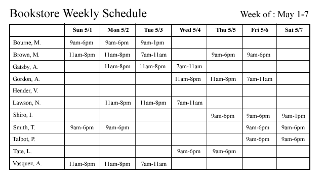
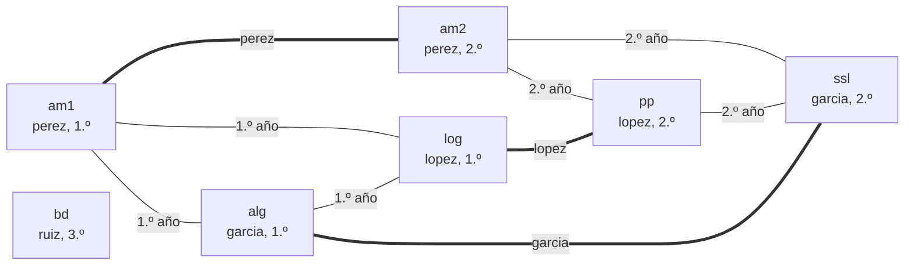

# Capítulo 73 — Proyecto: horarios para Inscripciones

Cada cuatrimestre, la facultad de *Inscripciones* publica el horario de
clases: en qué día, en qué franja y en qué aula se dicta cada clase de
cada materia. Un horario válido respeta reglas que se cruzan entre sí:
un aula no recibe dos clases a la vez, un docente no dicta dos clases a la
vez, las materias de un mismo año no se superponen, porque un alumno que
sigue el plan las cursa todas, y cada materia reparte sus clases en días
distintos. Entre los horarios válidos, además, unos son mejores que otros
para los alumnos. Este capítulo construye el programa que arma ese
horario, lo mejora y lo publica en una página web:

<!-- contexto: capitulo-73/optimo.pl -->
```prolog
?- ver_optimo(cuatrimestre, 1).
   lun       mar       mie       jue       vie
F1 am1/a1    am1/a1    am1/a1    -         -
F2 -         log/a2    log/a2    -         -
F3 -         alg/a1    alg/a1    -         -
F4 -         -         -         -         -
costo: 8
true.
```

La grilla es la del primer año: una columna por día, una fila por franja
de dos horas y, en cada casilla, la materia y el aula. Análisis 1 tiene
tres clases, en tres días distintos y en el aula `a1`, la única donde
caben sus cuarenta alumnos; Lógica y Álgebra completan los mismos tres
días, y el primer año no tiene clase los jueves ni los viernes. El costo
cuenta los días con clase y las franjas libres entre dos clases de cada
año: 8 es el menor posible, y el programa lo prueba.



Planilla semanal de turnos del personal de una librería: un empleado por
fila, un día por columna y, en cada casilla, el horario en que trabaja.
Es el mismo tipo de grilla que arma el capítulo, con empleados en lugar
de clases, y el problema que resuelve el programa de Covington, Nute y
Vellino citado más abajo. Imagen: Jacob Buerk, dominio público (liberada
por su autor), vía
[Wikimedia Commons](https://commons.wikimedia.org/wiki/File:WeeklySchedule.png).

El horario de clases es un problema de **asignación con restricciones**:
cada clase recibe un momento y un aula, y las reglas prohíben ciertas
combinaciones. El capítulo lo resuelve con una escalera de versiones que
recorre las técnicas de la [parte III](../capitulo-40-busqueda-y-planificacion/index.md):
generar y probar, buscar construyendo con pruebas en cada paso, podar los
dominios a mano y, por último, el modelo de restricciones de
`library(clpfd)` del [capítulo 23](../capitulo-23-programacion-con-restricciones/index.md),
con el que se optimiza. Una segunda página arma el **llamado a examen**
como un proyecto de la planificación de tareas del
[capítulo 72](../capitulo-72-proyecto-planificacion-tareas/index.md).

El proyecto parte de tres fuentes. De *Prolog Programming in Depth*, de
Covington, Nute y Vellino, sección «Scheduling», toma el horario armado
casilla por casilla con cada regla verificada contra el horario parcial,
la observación de que una restricción global probada al final es correcta
pero ineficiente, el orden que pone primero lo más difícil de ubicar y la
reparación de un horario terminado. De *The Power of Prolog*, de Markus
Triska, capítulo «Combinatorial Optimization», toma el paso de generar y
probar a las restricciones que podan antes de buscar, con el coloreo de
mapas como modelo. De *Prolog Programming for Artificial Intelligence*, de
Ivan Bratko, a través del [capítulo 72](../capitulo-72-proyecto-planificacion-tareas/index.md),
toma la planificación de tareas sobre procesadores que usa el llamado a
examen. La lista completa, con lo que se toma de cada fuente, está en
[Referencias](#referencias). El código es propio.

El capítulo carga, sin copiarlos, los datos de *Inscripciones* del
[capítulo 31](../capitulo-31-ejecutables-y-distribucion/index.md#318-el-proyecto-inscripciones-se-entrega)
y la representación de tareas y calendarios del
[capítulo 72](../capitulo-72-proyecto-planificacion-tareas/index.md#721-el-problema-y-su-representacion).
Cada versión es un módulo que reexporta la anterior, y todos son
`% solo-local`, porque cargan otros archivos.

## Objetivos del capítulo

Al terminar el capítulo, el lector puede:

- representar un problema de horarios con términos limpios y verificarlo
  con el verificador de calendarios de otro proyecto, más sus reglas
  propias;
- medir cómo crece el costo de generar y probar, y explicar por qué
  verificar en cada paso y elegir primero lo más restringido lo reduce;
- escribir a mano la poda hacia adelante sobre dominios y reconocerla en lo
  que `library(clpfd)` hace sola;
- agregar restricciones redundantes que prueban que no hay solución sin
  buscar, y elegir qué variables etiquetar;
- expresar un costo como una variable de restricciones, minimizarlo con
  una cota inferior y responder con una garantía cuando la búsqueda se
  corta;
- publicar el resultado como una grilla web armada por un predicado puro.

!!! info "Tiempo estimado"
    Leer el capítulo, ejecutar sus ejemplos y hacer las actividades: **2:00 h**.
    Resolver los 5 ejercicios marcados con ★: **1:20 h**.
    Resolver los 11 ejercicios del final: **3:15 h**.

## 73.1 El problema y su representación

Una **oferta** es el término `oferta(Semana, Clases, Aulas, Docentes)`.
`Semana` es `semana(Dias, Franjas)`: la cantidad de días y la de franjas
de dos horas de cada día. `Clases` es una lista de `clase(Id, Materia,
Anio, Docente, Cupo)`, una por cada clase semanal, cuyo identificador es
el par `Materia-K`. `Aulas` es una lista de `aula(Nombre, Capacidad)`,
numeradas por su posición, y `Docentes`, una lista de
`disponible(Docente, Dias)`. Las materias y sus años son los del módulo
`datos` de *Inscripciones*; las clases semanales, los docentes, los cupos y
las aulas son hechos nuevos:

<!-- ejemplo: capitulo-73/oferta.pl fragmento: % horas(Materia, N) .. aulas([aula(a1, 40) -->
```prolog
% horas(Materia, N): la materia tiene N clases semanales de dos horas.
horas(am1, 3).
horas(alg, 2).
horas(log, 2).
horas(am2, 3).
horas(pp,  2).
horas(ssl, 2).
horas(bd,  2).

% dicta(Docente, Materia): el docente dicta la materia.
dicta(perez,  am1).
dicta(perez,  am2).
dicta(garcia, alg).
dicta(garcia, ssl).
dicta(lopez,  log).
dicta(lopez,  pp).
dicta(ruiz,   bd).

% cupo(Materia, N): se esperan N alumnos en cada clase de la materia.
cupo(am1, 40).
cupo(alg, 35).
cupo(log, 30).
cupo(am2, 25).
cupo(pp,  25).
cupo(ssl, 20).
cupo(bd,  15).

% dias_de(Docente, Dias): los días de la semana, de 1 (lunes) a 5
% (viernes), en que el docente puede dar clase.
dias_de(perez,  [1, 2, 3, 4]).
dias_de(garcia, [1, 2, 3, 4, 5]).
dias_de(lopez,  [2, 3, 4, 5]).
dias_de(ruiz,   [4, 5]).

% aulas(Aulas): las aulas de la facultad, con su capacidad.
aulas([aula(a1, 40), aula(a2, 30), aula(lab, 20)]).
```

`oferta/2` arma tres clases de ofertas. `cuatrimestre` reúne las siete
materias en una semana de cinco días con cuatro franjas: dieciséis clases.
`materias(Ms, Dias, Franjas)` toma solo algunas materias y una semana más
chica, para medir las versiones que no alcanzan a resolver la oferta
completa. `facultad(N)` genera N materias con fórmulas fijas, como
`taller(N)` en el [capítulo 72](../capitulo-72-proyecto-planificacion-tareas/index.md#721-el-problema-y-su-representacion):
una por año en rotación, de dos o tres clases, con cupos entre 15 y 40 y
un docente cada dos materias que falta un día por semana, en una semana de
cinco días con tres franjas. Al crecer N, la semana se llena y el problema
se vuelve más difícil, hasta que no tiene solución.

<!-- contexto: capitulo-73/oferta.pl -->
```prolog
?- oferta(materias([bd], 5, 4), O).
O = oferta(semana(5, 4), [clase(bd-1, bd, 3, ruiz, 15), clase(bd-2, bd, 3, ruiz, 15)], [aula(a1, 40), aula(a2, 30), aula(lab, 20)], [disponible(perez, [1, 2, 3, 4]), disponible(garcia, [1, 2, 3, 4, 5]), disponible(lopez, [2, 3, 4, 5]), disponible(ruiz, [4, 5])]).
```

Las reglas entre dos clases forman un grafo: dos clases son
**incompatibles** si no pueden darse en el mismo momento, porque las dicta
el mismo docente o porque sus materias son del mismo año. El diagrama
muestra las materias de la oferta `cuatrimestre` unidas por esa relación;
cada clase de una materia hereda las aristas de la materia, y las clases
de una misma materia, además, van en días distintos:



Armar un horario es **colorear** este grafo: cada momento de la semana es
un color, y dos clases unidas por una arista no pueden tener el mismo. Es
el planteo con que Triska presenta las restricciones, el coloreo de un
mapa, con dos agregados: el aula, que es otro recurso a repartir, y la
disponibilidad de los docentes, que quita colores a algunas clases.

Un **horario** es un calendario del [capítulo 72](../capitulo-72-proyecto-planificacion-tareas/index.md#721-el-problema-y-su-representacion):
una lista de `asignada(Clase, Aula, Inicio, Fin)`, donde la clase es una
tarea de duración 1, el aula es el procesador e `Inicio` es el momento de
la semana, numerado desde 0; el momento 9 es la segunda franja del
miércoles. Así, `valido/2` de `tareas.pl` verifica lo que un horario
comparte con un calendario: que cada clase aparece una vez, en un aula que
existe, y que ningún aula recibe dos clases a la vez. `horario_valido/2`
agrega las reglas propias de un horario, y `choque/3` nombra las que se
rompen entre dos clases:

<!-- ejemplo: capitulo-73/oferta.pl predicado: horario_valido/2 choque/3 -->
```prolog
%!  horario_valido(+Oferta, +Horario:list) is semidet.
%
%   Horario cumple con Oferta: es un calendario válido del proyecto en que
%   cada clase es una tarea de duración 1 y cada aula un procesador; cada
%   clase cae dentro de la semana, en un aula donde cabe y un día en que su
%   docente está disponible; y no hay ningún choque.
horario_valido(Oferta, Horario) :-
    Oferta = oferta(_, _, Aulas, _),
    findall(tarea(C, 1), clase(Oferta, C, _, _, _, _), Tareas),
    length(Aulas, NA),
    tareas:valido(proyecto(Tareas, [], NA), Horario),
    momentos(Oferta, N),
    forall(member(asignada(C, A, S, _), Horario),
           ( S < N,
             clase(Oferta, C, _, _, Docente, Cupo),
             aula(Oferta, A, _, Capacidad),
             Cupo =< Capacidad,
             momento(Oferta, S, Dia, _),
             disponible(Oferta, Docente, Dia) )),
    \+ choque(Oferta, Horario, _).

%!  choque(+Oferta, +Horario:list, -Choque) is nondet.
%
%   Choque es una regla de Oferta que Horario no cumple entre dos clases:
%   mismo_momento(C1, C2), dos clases incompatibles en el mismo momento, o
%   mismo_dia(C1, C2), dos clases de la misma materia el mismo día.
choque(Oferta, Horario, mismo_momento(C1, C2)) :-
    incompatibles(Oferta, C1, C2),
    memberchk(asignada(C1, _, S, _), Horario),
    memberchk(asignada(C2, _, S, _), Horario).
choque(Oferta, Horario, mismo_dia(C1, C2)) :-
    member(asignada(C1, _, S1, _), Horario),
    member(asignada(C2, _, S2, _), Horario),
    C1 = M-_,
    C2 = M-_,
    C1 @< C2,
    momento(Oferta, S1, Dia, _),
    momento(Oferta, S2, Dia, _).
```

`horario_ejemplo/1` es un horario válido escrito a mano, que las pruebas
usan para verificar `horario_valido/2` y el dibujo de la grilla.
`lineas_anio/4` es un predicado puro que devuelve la grilla de un año como
cadenas, y `mostrar_anio/3` la escribe:

<!-- contexto: capitulo-73/oferta.pl -->
```prolog
?- ver_ejemplo(1).
   lun       mar       mie       jue       vie
F1 am1/a1    am1/a1    am1/a1    -         -
F2 alg/a1    log/a2    alg/a1    log/a2    -
F3 -         -         -         -         -
F4 -         -         -         -         -
true.
```

!!! question "Actividad"
    Predecir qué responde `choque/3` sobre el horario de ejemplo si la
    clase `am2-1` pasa del momento 2 al momento 0, en la misma aula.
    Comprobarlo con `selectchk/4`, como hace la prueba `choque_momento` de
    `oferta.plt`, y explicar por qué `horario_valido/2` no necesita
    verificar el aula en ese caso.

## 73.2 El programa terminado

| Versión | Archivo | Agrega | Lo que no puede hacer todavía |
|---|---|---|---|
| — | `oferta.pl` | la oferta, el horario y su verificación | — |
| 1 | `generar.pl` | generar horarios completos y probarlos | resolver más de cinco o seis clases |
| 2 | `construir.pl` | ubicar clase por clase, verificando cada paso; ordenar lo difícil primero | evitar que un error temprano se descubra tarde |
| 3 | `dominios.pl` | los dominios, la poda hacia adelante y la clase más restringida primero | probar que una oferta no tiene horario sin recorrerla entera |
| 4 | `restricciones.pl` | el modelo de `library(clpfd)` y las restricciones redundantes de conteo | elegir entre los horarios válidos |
| 5 | `optimo.pl` | el costo, la cota inferior, la garantía y la carrera de estrategias | mostrar el horario a los alumnos |
| 6 | `web.pl` | la grilla web de cada año | — |

`examenes.pl` arma el llamado a examen sobre el planificador del
[capítulo 72](../capitulo-72-proyecto-planificacion-tareas/index.md), y
la página [El llamado a examen](examenes.md) lo explica.

## 73.3 Versión 1: generar y probar

La versión más directa genera un horario completo, con un momento y un
aula para cada clase, y lo prueba con `horario_valido/2`. Si la prueba
falla, la vuelta atrás cambia la última clase generada:

<!-- ejemplo: capitulo-73/generar.pl predicado: generar_y_probar/2 generar/2 candidata/4 -->
```prolog
%!  generar_y_probar(+Oferta, -Horario:list) is nondet.
%
%   Horario es un horario válido de Oferta. Genera cada horario posible y
%   lo prueba entero.
generar_y_probar(Oferta, Horario) :-
    generar(Oferta, Horario),
    horario_valido(Oferta, Horario).

%!  generar(+Oferta, -Horario:list) is multi.
%
%   Horario da a cada clase de Oferta un momento de la semana y un aula,
%   sin verificar nada más.
generar(Oferta, Horario) :-
    findall(C, clase(Oferta, C, _, _, _, _), Clases),
    momentos(Oferta, N),
    Oferta = oferta(_, _, Aulas, _),
    length(Aulas, NA),
    maplist(candidata(N, NA), Clases, Horario).

%!  candidata(+N:integer, +NA:integer, +Clase, -Asignada) is multi.
%
%   Asignada pone Clase en uno de los N momentos y una de las NA aulas.
candidata(N, NA, Clase, asignada(Clase, A, S, F)) :-
    Ultimo is N - 1,
    between(0, Ultimo, S),
    between(1, NA, A),
    F is S + 1.
```

El programa es correcto, porque la prueba es la definición de horario
válido, pero recorre los candidatos de a uno, y su cantidad es la
cantidad de pares momento-aula elevada a la cantidad de clases.
`candidatos/2` la calcula, y `ensayos/2` cuenta cuántos horarios prueba
`generar_y_probar/2` hasta encontrar el primero válido:

<!-- contexto: capitulo-73/generar.pl -->
```prolog
?- candidatos(cuatrimestre, K).
K = 28211099074560000000000000000.

?- candidatos(materias([am1, alg], 3, 2), K).
K = 1889568.

?- ensayos(materias([am1, alg], 3, 2), K).
K = 38944.

?- ensayos(materias([am1, alg], 3, 3), K).
K = 190363.
```

Con solo Análisis 1 y Álgebra en una semana de tres días y dos franjas,
cinco clases, el primer horario aparece después de 38 944 ensayos, en 1,7
segundos; con una franja más por día, después de 190 363, en 8,3
segundos. Con Lógica agregada, siete clases en tres días de tres franjas,
la búsqueda no termina en dos minutos. La razón está en el orden de la
vuelta atrás: la primera clase queda en el momento 0 mientras se prueban
todas las combinaciones de las demás, y la segunda clase de Análisis 1,
que nunca puede ir el mismo día que la primera, cambia de día recién
cuando se agotaron todas las combinaciones de las tres clases que la
siguen. La prueba llega al final, cuando el error ya se cometió muchos
pasos antes. Para la oferta completa, a un ritmo de veinte mil ensayos
por segundo, recorrer los 2,8 · 10²⁸ candidatos llevaría unos 4 · 10¹⁶
años.

## 73.4 Versión 2: probar al construir

Covington, Nute y Vellino arman su horario casilla por casilla, y cada
asignación se verifica contra el horario parcial con un predicado,
`available/5`, que solo acepta a un trabajador disponible ese día, sin
otra tarea en ese turno y sin pasar sus máximos. Aplicado aquí, cada clase
se ubica solo en un momento y un aula compatibles con las clases ya
ubicadas, y la prueba se reparte entre los pasos de la generación:

<!-- ejemplo: capitulo-73/construir.pl predicado: ubicar_todas/4 ubicacion/3 compatible/3 -->
```prolog
%!  ubicar_todas(+Oferta, +Clases:list, +Parcial:list, -Horario:list)
%!      is nondet.
%
%   Horario agrega a Parcial una ubicación compatible para cada clase de
%   Clases.
ubicar_todas(_, [], Horario, Horario).
ubicar_todas(Oferta, [C|Cs], Parcial, Horario) :-
    ubicacion(Oferta, C, Asignada),
    compatible(Oferta, Asignada, Parcial),
    contar_paso,
    ubicar_todas(Oferta, Cs, [Asignada|Parcial], Horario).

%!  ubicacion(+Oferta, +Clase, -Asignada) is nondet.
%
%   Asignada pone Clase en un momento de la semana en que su docente está
%   disponible y en un aula donde cabe: las reglas que dependen de una
%   sola clase.
ubicacion(Oferta, C, asignada(C, A, S, F)) :-
    clase(Oferta, C, _, _, Docente, Cupo),
    momento(Oferta, S, Dia, _),
    disponible(Oferta, Docente, Dia),
    aula(Oferta, A, _, Capacidad),
    Cupo =< Capacidad,
    F is S + 1.

%!  compatible(+Oferta, +Asignada, +Parcial:list) is semidet.
%
%   Asignada no choca con ninguna clase de Parcial: el aula está libre en
%   ese momento, ninguna clase incompatible ocupa el mismo momento y
%   ninguna clase de la misma materia cae el mismo día.
compatible(Oferta, asignada(C, A, S, _), Parcial) :-
    \+ memberchk(asignada(_, A, S, _), Parcial),
    \+ ( member(asignada(C2, _, S, _), Parcial),
         incompatibles_en_orden(Oferta, C, C2) ),
    C = M-_,
    momento(Oferta, S, Dia, _),
    \+ ( member(asignada(M-_, _, S2, _), Parcial),
         momento(Oferta, S2, Dia, _) ).
```

`ubicacion/3` aplica las reglas que dependen de una sola clase, la
disponibilidad del docente y la capacidad del aula, y `compatible/3` las
que dependen de las demás. Con esa sola diferencia, la oferta completa se
resuelve sin volver atrás ni una vez: dieciséis clases, dieciséis pasos.

<!-- contexto: capitulo-73/construir.pl -->
```prolog
?- medir_construir(cuatrimestre, datos, K).
K = 16.

?- ver_construir(cuatrimestre, datos, 1).
   lun       mar       mie       jue       vie
F1 am1/a1    am1/a1    am1/a1    -         -
F2 alg/a1    alg/a1    log/a1    -         -
F3 -         log/a1    -         -         -
F4 -         -         -         -         -
true.
```

La oferta de *Inscripciones* tiene holgura: veinte momentos para siete
clases por año. Las ofertas `facultad(N)` la reducen. `medir_construir/3`
cuenta las clases ubicadas hasta el primer horario, con las clases en el
orden de los datos o, con `dificiles`, ordenadas de menos a más
ubicaciones posibles, como los trabajos «cuello de botella» que Covington
pone primero en sus datos:

<!-- ejemplo: capitulo-73/construir.pl predicado: ordenar_clases/3 -->
```prolog
%!  ordenar_clases(+Oferta, +Orden, -Clases:list) is det.
%
%   Clases son las clases de Oferta en el Orden pedido: datos, el de la
%   oferta, o dificiles, de menos a más ubicaciones posibles, y entre las
%   que tienen las mismas, en el orden de la oferta.
ordenar_clases(Oferta, datos, Clases) :-
    !,
    findall(C, clase(Oferta, C, _, _, _, _), Clases).
ordenar_clases(Oferta, dificiles, Clases) :-
    findall(N-C,
            ( clase(Oferta, C, _, _, _, _),
              ubicaciones(Oferta, C, N) ),
            Pares0),
    keysort(Pares0, Pares),
    pairs_values(Pares, Clases).
```

```prolog
?- medir_construir(facultad(6), datos, K).
K = 18.

?- medir_construir(facultad(12), dificiles, K).
K = 817.
```

Con seis materias, quince clases, el orden de los datos necesita 18 pasos.
Con nueve materias ya no termina en un minuto; con las clases difíciles
primero, nueve materias se resuelven en 23 pasos y doce, treinta clases,
en 817. Con trece, tampoco el orden de las difíciles termina en un minuto.
El orden se fija antes de empezar, y una clase que al principio tenía
muchas ubicaciones puede quedarse sin ninguna después de que las otras
ocupan la semana; el fracaso se descubre recién cuando le toca su turno, y
la vuelta atrás deshace primero las clases ubicadas en último lugar, que
no siempre son las responsables.

!!! question "Actividad"
    Antes de ejecutarlo, ubicar a mano las tres primeras clases de la
    oferta `cuatrimestre` en el orden de los datos, como lo hace
    `construir/3`: en qué momento y en qué aula queda cada una. Comparar
    con `ver_construir(cuatrimestre, datos, 1)`.

## 73.5 Versión 3: dominios y la clase más restringida

Dos cambios atacan las dos causas. Cada clase pendiente lleva su
**dominio**, la lista de ubicaciones `Momento-Aula` que todavía le
quedan, y al ubicar una clase se quitan de los dominios de las demás las
ubicaciones que chocarían con ella: es la **poda hacia adelante**. Si
algún dominio queda vacío, la rama se abandona en ese momento, sin esperar
a que le toque a esa clase. Y la próxima clase a ubicar es la de dominio
más chico, la **más restringida**, elegida de nuevo en cada paso:

<!-- ejemplo: capitulo-73/dominios.pl predicado: asignar/4 elegir/3 podar/4 choca/6 -->
```prolog
%!  asignar(+Oferta, +Pendientes:list, +Parcial:list, -Horario:list)
%!      is nondet.
%
%   Horario agrega a Parcial una ubicación para cada clase de Pendientes,
%   tomada de su dominio.
asignar(_, [], Horario, Horario).
asignar(Oferta, Pendientes, Parcial, Horario) :-
    elegir(Pendientes, C-Dominio, Resto),
    member(S-A, Dominio),
    contar_paso,
    F is S + 1,
    Asignada = asignada(C, A, S, F),
    maplist(podar(Oferta, Asignada), Resto, Resto1),
    asignar(Oferta, Resto1, [Asignada|Parcial], Horario).

%!  elegir(+Pendientes:list, -Elegida, -Resto:list) is det.
%
%   Elegida es el par Clase-Dominio de Pendientes con el dominio más
%   chico, el primero si hay varios; Resto, los demás pares, en su orden.
elegir(Pendientes, Elegida, Resto) :-
    maplist(con_tamanio, Pendientes, Pares0),
    keysort(Pares0, [_-Elegida|_]),
    selectchk(Elegida, Pendientes, Resto).

%!  podar(+Oferta, +Asignada, +Par0, -Par) is semidet.
%
%   Par es Par0, un par Clase-Dominio, sin las ubicaciones que chocan con
%   Asignada. Falla si el dominio queda vacío.
podar(Oferta, asignada(C, A, S, _), C2-Dominio0, C2-Dominio) :-
    (   incompatibles_en_orden(Oferta, C, C2)
    ->  Incompatible = si
    ;   Incompatible = no
    ),
    C = M-_,
    (   C2 = M-_
    ->  momento(Oferta, S, Dia, _)
    ;   Dia = ninguno
    ),
    exclude(choca(Oferta, A, S, Incompatible, Dia), Dominio0, Dominio),
    Dominio \== [].

%!  choca(+Oferta, +A:integer, +S:integer, +Incompatible, +Dia,
%!        +Ubicacion) is semidet.
%
%   La Ubicacion S2-A2 de otra clase choca con una clase ubicada en el
%   momento S y el aula A: usa la misma aula en el mismo momento, o el
%   mismo momento si las clases son incompatibles (Incompatible es si), o
%   el mismo día Dia si son de la misma materia (si no, Dia es ninguno).
choca(_, A, S, _, _, S-A) :-
    !.
choca(_, _, S, si, _, S-_) :-
    !.
choca(Oferta, _, _, _, Dia, S2-_) :-
    Dia \== ninguno,
    momento(Oferta, S2, Dia, _).
```

```prolog
?- medir_dominios(facultad(12), K).
K = 30.

?- medir_dominios(facultad(13), K).
K = 169.
```

Doce materias se resuelven sin volver atrás, treinta clases en treinta
pasos, y trece en 169. Con catorce hacen falta 181 599 pasos y 32 millones
de inferencias, y con quince la búsqueda no termina en un minuto: la
oferta `facultad(15)` no tiene horario, y la poda hacia adelante no lo
puede probar sin recorrer todas las combinaciones. La sección siguiente
muestra cómo probarlo.

La poda y la elección dinámica son lo que una biblioteca de restricciones
hace sin que se lo escriba: cada restricción quita valores de los
dominios de sus variables cuando cambia el de otra, y el etiquetado con la
opción `ff`, *first fail*, elige la variable de dominio más chico.

## 73.6 Versión 4: el modelo de restricciones

El modelo sigue el [Patrón 27](../patrones.md#27-modelar-restringir-etiquetar),
como el calendario de exámenes del
[capítulo 23](../capitulo-23-programacion-con-restricciones/index.md#2313-el-proyecto-el-calendario-de-examenes):
variables, dominios, restricciones y etiquetado al final. Cada clase tiene
dos variables, su momento `S` y su aula `A`. Las reglas de una sola clase
son dominios: `S` solo toma momentos de los días del docente, `A` solo
aulas donde cabe el cupo. Las reglas entre clases son restricciones:

<!-- ejemplo: capitulo-73/restricciones.pl predicado: modelo/4 variables_de/3 -->
```prolog
%!  modelo(+Oferta, +Modelo, -Horario:list, -Variables) is semidet.
%
%   Horario es una lista de asignada(Clase, A, S, F), una por clase de
%   Oferta, cuyos A y S son variables restringidas por las reglas de la
%   oferta; Variables es vars(Momentos, Aulas, Pares): las mismas
%   variables en listas, para etiquetarlas, y el número del par
%   momento-aula de cada clase. Las listas de variables se arman con
%   maplist/3 e include/3, no con findall/3, que copiaría las variables, y
%   las restricciones se imponen con maplist/2, no con forall/2, que las
%   desharía al terminar. Con Modelo conteo se agregan las restricciones
%   de conteo/3. Falla si la propagación ya prueba que no hay horario.
modelo(Oferta, Modelo, Horario, vars(Momentos, Aulas, Pares)) :-
    Oferta = oferta(semana(_, Franjas), _, ListaAulas, _),
    length(ListaAulas, NA),
    findall(C, clase(Oferta, C, _, _, _, _), Clases),
    maplist(variables_de(Oferta), Clases, Horario),
    maplist(momento_de, Horario, Momentos),
    maplist(aula_de, Horario, Aulas),
    maplist(par_momento_aula(NA), Horario, Pares),
    all_distinct(Pares),
    findall(Clave, grupo(Oferta, Clave), Claves),
    maplist(restringir_grupo(Oferta, Horario), Claves),
    findall(M, grupo(Oferta, materia(M)), Materias),
    maplist(restringir_materia(Franjas, Horario), Materias),
    (   Modelo == conteo
    ->  conteo(Oferta, Horario)
    ;   must_be(oneof([simple]), Modelo)
    ).

%!  variables_de(+Oferta, +Clase, -Asignada) is det.
%
%   Asignada es asignada(Clase, A, S, F) con los dominios de las reglas
%   de una sola clase: S en los días del docente, A en las aulas donde
%   cabe el cupo, y F = S + 1.
variables_de(Oferta, C, asignada(C, A, S, F)) :-
    Oferta = oferta(semana(_, Franjas), _, _, _),
    clase(Oferta, C, _, _, Docente, Cupo),
    momentos(Oferta, N),
    Ultimo is N - 1,
    S in 0..Ultimo,
    findall(D, disponible(Oferta, Docente, D), Dias),
    dominio(Dias, DomDias),
    Dia #= S // Franjas + 1,
    Dia in DomDias,
    findall(Num, ( aula(Oferta, Num, _, Cap), Cupo =< Cap ), Nums),
    dominio(Nums, DomAulas),
    A in DomAulas,
    F #= S + 1.
```

`all_distinct/1` sobre los momentos de las clases de un año y de un
docente expresa la incompatibilidad; sobre los días de las clases de una
materia, que van en días distintos. El par momento-aula, codificado como
un solo número, es distinto para todas las clases: dos clases con el mismo
número estarían en la misma aula al mismo tiempo. `chain/2` ordena los
momentos de las clases de una misma materia, para no obtener el mismo
horario con esas clases permutadas. Dos detalles de la construcción
importan: las listas de variables se arman con `maplist/3` e `include/3`,
porque `findall/3` copia los términos y devolvería variables nuevas, sin
restricciones; y las restricciones se imponen con `maplist/2`, porque
`forall/2` deshace todo lo que su meta liga, restricciones incluidas.

**Lo que la propagación prueba sola.** Con el modelo armado, antes de
etiquetar, los dominios ya cambiaron: la clase `bd-1`, de un docente que
solo viene jueves y viernes y que debe ir antes que `bd-2`, tiene el
dominio `12..18`. Con veintiuna materias, la oferta tiene más clases de un
año que momentos en la semana, y la propagación de `all_distinct/1`
responde que no hay horario con 147 296 inferencias, sin etiquetar nada.

**Restricciones redundantes.** Con quince materias, en cambio, el modelo
simple no responde en un minuto, como la versión 3. La causa es una cuenta
que el modelo no hace: hay 33 clases con más de veinte alumnos, que solo
caben en las dos aulas grandes, y la semana tiene quince momentos, es
decir, treinta lugares en esas aulas. `conteo/2` agrega, para cada
capacidad de aula, una restricción que limita en cada momento la cantidad
de clases con cupo mayor que esa capacidad a la cantidad de aulas
mayores:

<!-- ejemplo: capitulo-73/restricciones.pl predicado: conteo/2 contar_mayores/5 -->
```prolog
%!  conteo(+Oferta, +Horario:list) is semidet.
%
%   En ningún momento de Horario hay más clases que aulas, ni más clases
%   de cupo mayor que C que aulas de capacidad mayor que C, para cada
%   capacidad C de las aulas. Son restricciones redundantes: las implica
%   el par momento-aula distinto, pero la biblioteca las propaga mejor,
%   porque cuentan sin elegir el aula. Falla si la propagación ya prueba
%   que no hay horario.
conteo(Oferta, Horario) :-
    Oferta = oferta(_, _, ListaAulas, _),
    findall(Cap, member(aula(_, Cap), ListaAulas), Caps0),
    sort(Caps0, Caps),
    momentos(Oferta, N),
    maplist(contar_mayores(Oferta, Horario, N, Caps), [0|Caps]).

%!  contar_mayores(+Oferta, +Horario:list, +N:integer, +Caps:list,
%!                 +C:integer) is semidet.
%
%   En cada uno de los N momentos, las clases de Horario con cupo mayor
%   que C no son más que las aulas de Caps con capacidad mayor que C.
contar_mayores(Oferta, Horario, N, Caps, C) :-
    include(cupo_mayor(Oferta, C), Horario, Grandes),
    maplist(momento_de, Grandes, Ss),
    include(<(C), Caps, Mayores),
    length(Mayores, Max),
    Ultimo is N - 1,
    findall(S-_, between(0, Ultimo, S), Pares),
    pairs_values(Pares, Cuentas),
    Cuentas ins 0..Max,
    global_cardinality(Ss, Pares).
```

Son restricciones **redundantes**: no excluyen ningún horario que el par
momento-aula distinto no excluya ya, pero `global_cardinality/2` cuenta
sin elegir el aula, y con ellas la propagación descubre la falta de
lugares. La técnica tiene nombre propio:

!!! example "Patrón 73 — Restricción redundante que cuenta"
    **Problema.** Un modelo de restricciones correcto no termina de probar
    que un problema no tiene solución, aunque la causa es una cuenta
    simple: hay más pedidos de un recurso escaso que lugares de ese
    recurso.

    **Versión ingenua.** Confiar en las restricciones que definen el
    problema, como el par momento-aula distinto para todas las clases, y
    dejar que la búsqueda descubra la falta de lugares. En
    `facultad(15)`, 33 clases necesitan una de las dos aulas grandes, que
    en quince momentos ofrecen treinta lugares; la poda hacia adelante de
    la versión 3 no termina en un minuto, y el modelo simple tampoco: cada
    rama elige aulas y momentos hasta tropezar con la falta de lugares,
    y las combinaciones que lo hacen son muchísimas.

    **Patrón.** Agregar restricciones que **cuentan** el recurso escaso
    sin elegir cuál de sus unidades se usa: para cada capacidad de aula,
    `global_cardinality/2` limita en cada momento las clases de cupo mayor
    a la cantidad de aulas mayores. No excluyen ninguna solución, porque
    las implica el modelo, pero se propagan sobre las variables de momento
    solas, antes de etiquetar. `conteo/2` las agrega, y con ellas
    `facultad(15)` y `facultad(18)` se prueban imposibles con 2,9 y 4,4
    millones de inferencias, sin buscar.

    **Cuándo no usarlo.** Cuando el problema tiene solución y holgura: las
    restricciones agregadas se propagan en cada paso, y en las ofertas
    `facultad(6)` a `facultad(14)` el modelo con conteo cuesta entre dos y
    tres veces más que el simple. Cuando la cuenta no es redundante sino
    nueva: una restricción que excluye soluciones cambia el problema y
    debe estar en el modelo, no presentarse como ayuda. Y cuando la
    cantidad de cuentas crece con el producto de los recursos, como una
    por cada par de aula y docente: su construcción puede costar más que
    la búsqueda que ahorra.

**Qué etiquetar.** `horario_clpfd/3` recibe las opciones del modelo
(`simple` o `conteo`) y de las variables que se etiquetan: los momentos y
después las aulas, o directamente el número del par momento-aula, cuyo
dominio combina las dos decisiones como el dominio de la versión 3:

<!-- ejemplo: capitulo-73/restricciones.pl predicado: horario_clpfd/3 -->
```prolog
%!  horario_clpfd(+Oferta, +Opciones:list, -Horario:list) is nondet.
%
%   Horario es un horario válido de Oferta, obtenido del modelo de
%   modelo/4. Opciones elige modelo(simple) o modelo(conteo), que agrega
%   las restricciones redundantes de conteo/2 (por omisión, conteo), y
%   etiquetar(momentos), que fija primero los momentos y después las
%   aulas, o etiquetar(pares), que fija de una vez el par momento-aula de
%   cada clase (por omisión, pares). En los dos casos se elige primero la
%   variable de dominio más chico.
horario_clpfd(Oferta, Opciones, Horario) :-
    option(modelo(Modelo), Opciones, conteo),
    option(etiquetar(Cuales), Opciones, pares),
    modelo(Oferta, Modelo, Horario, vars(Momentos, Aulas, Pares)),
    (   Cuales == pares
    ->  labeling([ff], Pares)
    ;   must_be(oneof([momentos]), Cuales),
        labeling([ff], Momentos),
        labeling([ff], Aulas)
    ).
```

<!-- contexto: capitulo-73/restricciones.pl -->
```prolog
?- medir_clpfd(facultad(13), [modelo(simple), etiquetar(momentos)], R).
R = r(si, 8535502).

?- medir_clpfd(facultad(13), [modelo(simple)], R).
R = r(si, 3780989).

?- medir_clpfd(facultad(14), [modelo(simple)], R).
R = r(si, 3860720).

?- medir_clpfd(facultad(15), [], R).
R = r(no, 2898847).

?- medir_clpfd(facultad(21), [modelo(simple)], R).
R = r(no, 147296).
```

`R` dice si hay horario y cuántas inferencias costó saberlo. La tabla
reúne las mediciones de las cuatro versiones, con un minuto de límite;
«—» indica que la versión no terminó:

| Oferta | Clases | V2, datos | V2, difíciles | V3, pasos | V4, momentos | V4, pares | V4, conteo y pares |
|---|---|---|---|---|---|---|---|
| `facultad(6)` | 15 | 18 pasos | 15 pasos | 15 | 1,0 M | 1,0 M | 2,4 M |
| `facultad(12)` | 30 | — | 817 pasos | 30 | 2,9 M | 3,0 M | 7,7 M |
| `facultad(13)` | 33 | — | — | 169 | 8,5 M | 3,8 M | 9,5 M |
| `facultad(14)` | 35 | — | — | 181 599 | — | 3,9 M | 9,7 M |
| `facultad(15)` | 38 | — | — | — | — | — | no hay, 2,9 M |

En `facultad(14)`, el etiquetado de los momentos no terminó ni en nueve
minutos, y el del par momento-aula encontró el horario con 3,9 millones de
inferencias. Treinta de sus 35 clases necesitan un aula grande, justo los
treinta lugares que hay, y fijar el momento sin el aula deja para después
una decisión de la que depende si el momento era posible. Las
restricciones de conteo cuestan el doble en las ofertas que tienen
horario, porque hay más que propagar, y son las únicas que responden en
la que no lo tiene.

!!! question "Actividad"
    Contar a mano, en `facultad(18)`, cuántas clases tienen un cupo mayor
    que 30 y cuántas un cupo mayor que 20, con `clase/6` y
    `aggregate_all/3`, y predecir qué responde
    `medir_clpfd(facultad(18), [], R)`. Comprobarlo.

## 73.7 Versión 5: el mejor horario

Entre los horarios válidos, unos son mejores que otros para los alumnos.
El costo de un horario suma, para cada año, los días con clase y los
**huecos**, franjas libres entre dos clases del mismo día, y es una
variable de clpfd sobre el modelo de la versión 4. La página
[El mejor horario](optimo.md#el-costo) escribe el costo, una **cota
inferior** que acota la búsqueda del óptimo desde abajo, la versión de
`mejor_con_limite/4` que responde con una garantía cuando la búsqueda se
corta, como el [Patrón 71](../patrones.md#71-resultado-con-garantia), y
la carrera de estrategias con `first_solution/3`. En la oferta
`cuatrimestre`, la cota es 8 y el horario de la grilla del comienzo la
alcanza, con 2,9 millones de inferencias:

<!-- contexto: capitulo-73/optimo.pl -->
```prolog
?- garantia(cuatrimestre, 5000000, G).
G = optimo(8).

?- garantia(facultad(6), 1000000, G).
G = entre(9, 11).
```

En `facultad(6)` la cota no se alcanza, y con un millón de inferencias
por búsqueda la respuesta es que el óptimo está entre 9 y 11.

## 73.8 Versión 6: la grilla web

Cada año del plan tiene una página con su grilla. La página es un término
de `html//1`, como las del
[capítulo 36](../capitulo-36-interfaces-de-usuario/index.md#366-paginas-web-sobre-los-servicios),
armado por un predicado puro a partir de la oferta y del horario; el
manejador solo calcula el horario de costo mínimo y responde con
`reply_html_page/2`:

<!-- ejemplo: capitulo-73/web.pl predicado: cuerpo_anio/4 celda_html/6 -->
```prolog
%!  cuerpo_anio(+Oferta, +Horario:list, +Anio:integer, -Cuerpo:list) is det.
%
%   Cuerpo es la página de la grilla del año Anio en Horario: un título y
%   una tabla con una columna por día y una fila por franja.
cuerpo_anio(Oferta, Horario, Anio,
            [ h1(Titulo),
              table(class(horario), [tr([th('Franja')|Encabezados])|Filas]),
              p(a(href('/horario'), 'Todos los años'))
            ]) :-
    Oferta = oferta(semana(Dias, Franjas), _, _, _),
    format(atom(Titulo), "Horario de ~wº año", [Anio]),
    numlist(1, Dias, Ds),
    maplist(encabezado, Ds, Encabezados),
    numlist(1, Franjas, Fs),
    maplist(fila_html(Oferta, Horario, Anio, Ds), Fs, Filas).

%!  celda_html(+Oferta, +Horario:list, +Anio:integer, +Franja:integer,
%!             +Dia:integer, -Td) is det.
%
%   Td es la casilla del día Dia y la franja Franja: el nombre de la
%   materia de la clase del año Anio, con su aula, o una casilla vacía.
%   El nombre sale del módulo datos de Inscripciones; una materia que no
%   está allí, como las de las ofertas facultad(N), muestra su código.
celda_html(Oferta, Horario, Anio, Franja, Dia, Td) :-
    momento(Oferta, S, Dia, Franja),
    (   member(asignada(C, A, S, _), Horario),
        clase(Oferta, C, M, Anio, _, _)
    ->  (   materia(M, Nombre, _)
        ->  true
        ;   Nombre = M
        ),
        aula(Oferta, A, Aula, _),
        Td = td([b(Nombre), br([]), Aula])
    ;   Td = td([])
    ).
```

`iniciar_web/1` arranca el servidor en un puerto libre, y las dos rutas
son `/horario`, con un enlace por año, y `/horario/{anio}`, con la grilla,
que responde 404 para un año que no existe. Como en el [capítulo 36](../capitulo-36-interfaces-de-usuario/index.md), las
pruebas de `web.plt` verifican el cuerpo como término, como texto HTML y
con pedidos reales al servidor:

```prolog
test(celda_con_clase, [true(Td == td([b(bases_de_datos), br([]), lab]))]) :-
    oferta(cuatrimestre, O),
    horario_ejemplo(H),
    celda_html(O, H, 3, 1, 4, Td).

test(anio_inexistente, [true(Codigo == 404)]) :-
    pedir('/horario/7', Codigo, _).
```

## 73.9 El llamado a examen

El [capítulo 23](../capitulo-23-programacion-con-restricciones/index.md#2313-el-proyecto-el-calendario-de-examenes)
armó el calendario de exámenes con restricciones. El
[capítulo 72](../capitulo-72-proyecto-planificacion-tareas/index.md)
dejó un planificador de tareas sobre procesadores, y el llamado a examen
también es un proyecto de ese tipo: los exámenes son tareas de un día,
las aulas son los procesadores y las correlativas son precedencias, porque
un alumno que rinde las dos materias necesita rendir antes la correlativa.
La página [El llamado a examen](examenes.md) lo resuelve con el
planificador del [capítulo 72](../capitulo-72-proyecto-planificacion-tareas/index.md) y muestra lo que ese modelo no puede
expresar: los conflictos de los alumnos que rinden dos materias.

!!! success "Criterios de calidad"
    | Criterio | En este capítulo |
    |---|---|
    | C1 | cada predicado declara modos y determinación; `clase/6` es `nondet` en general y, con el identificador instanciado del todo, usa `memberchk/2`; con un identificador parcial, como `M-K`, enumera |
    | C2 | representaciones limpias: la oferta, la clase, el horario y la garantía son términos con un functor cada uno; el horario es un calendario del [capítulo 72](../capitulo-72-proyecto-planificacion-tareas/index.md), y `horario_valido/2` verifica el resultado de cualquier versión |
    | C3 | las versiones 3 a 5 no modifican la base de datos; el único estado global es el contador de pasos de las mediciones, con `nb_setval/2` |
    | C4 | `optimo/4`, `costo/3` y las mediciones no dejan alternativas pendientes; `hueco/3` separa la lista con `length/2` y `append/3` en un solo sentido |
    | C6 | el núcleo es puro: `lineas_anio/4` y `cuerpo_anio/4` devuelven la grilla como cadenas o como término, y solo `mostrar_anio/3` y los manejadores escriben |
    | C7 | 94 pruebas en ocho archivos, incluidos horarios con cada clase de choque, ofertas sin horario, los dominios después de propagar y pedidos HTTP reales |

## Ejercicios

Las soluciones están en [la página de soluciones](soluciones.md). La dificultad
va de 1 (se resuelve consultando el capítulo) a 3 (requiere elaboración propia).
Los marcados con ★ son los que no conviene saltear: cubren lo que el capítulo
tiene de propio. Los ejercicios que piden código se resuelven en archivos
que cargan los del capítulo, sin modificarlos.

1. ★ **(1)** En el horario de ejemplo, la clase `alg-2` pasa al momento 2
   y la clase `log-2` al momento 5, las dos en sus aulas. Predecir qué
   choques informa `choque/3` y qué responde `tareas:valido/2` sobre el
   proyecto de tareas de la oferta. Comprobarlo.
2. **(1)** Con el ritmo medido en la versión 1, estimar cuánto tardaría
   `generar_y_probar/2` en recorrer todos los candidatos de
   `materias([am1, alg, log], 3, 3)`. Calcularlos con `candidatos/2`.
3. ★ **(2)** Escribir `construir_por_grado(Oferta, Horario)`, que
   construye como la versión 2 con las clases ordenadas de más a menos
   clases incompatibles. Medir los pasos en `facultad(6)`, `facultad(9)` y
   `facultad(12)`, con un minuto de límite, compararlos con el orden
   `dificiles` y explicar el resultado.
4. **(3)** Covington mejora un horario terminado moviendo una asignación
   por vez. Escribir `reparar(Oferta, Horario0, Horario)`, que mientras
   haya un choque mueve una de las dos clases a una ubicación compatible
   con todas las demás, y probarlo con el horario de ejemplo después de
   pasar `am2-1` al momento 0.
5. ★ **(2)** Un alumno recursa una materia de primer año mientras cursa
   las de segundo. Escribir `horario_con_recursantes(Oferta, Pares,
   Horario)`, que además exige momentos distintos para las clases de cada
   par de materias `M1-M2` de `Pares`, y obtener un horario de la oferta
   `cuatrimestre` con `[am1-am2, alg-pp]`.
6. **(2)** Escribir `medir_etiquetado(Nombre, Opcion, R)`, que mide las
   inferencias del etiquetado del par momento-aula del modelo simple con
   una opción de `labeling/2`, con un límite de veinte millones. Medir
   `ff`, `ffc` y `leftmost` en `facultad(13)` y `facultad(14)` y explicar
   las diferencias.
7. ★ **(2)** Escribir `costo_docentes(Oferta, Horario, Costo)`, la
   cantidad de días que viene cada docente, sumada; obtener el horario de
   la oferta `cuatrimestre` que la minimiza y compararlo con el de
   `optimo/4`.
8. **(3)** Escribir una versión de `mejor_con_limite/4` cuyo primer
   horario sea el de menor costo entre los de cuatro etiquetados
   distintos, medir la garantía en `facultad(6)` con un millón de
   inferencias y explicar por qué cambia o no cambia.
9. **(2)** Agregar a `web.pl` la ruta `/aula/{nombre}`, con la grilla de
   la ocupación de un aula: en cada casilla, la clase que la usa.
10. ★ **(2)** Escribir `llamado_separado(Aulas, Calendario, Dias)`, que
    además deja al menos un día libre entre dos exámenes en conflicto.
    Obtener cuántos días hacen falta con dos aulas.
11. **(1)** Predecir, sin ejecutarlo, qué responde
    `medir_clpfd(facultad(30), [modelo(simple)], R)` y por qué la
    respuesta es inmediata. Comprobarlo.

## Resumen

| | |
|---|---|
| **oferta** | la semana, las clases con su materia, año, docente y cupo, las aulas y la disponibilidad de los docentes |
| **horario como calendario** | cada clase es una tarea de duración 1 y cada aula un procesador; `tareas:valido/2` verifica la parte común |
| **clases incompatibles** | mismo docente o mismo año: armar el horario es colorear su grafo |
| **generar y probar** | correcto, pero examina (momentos × aulas) elevado a la cantidad de clases |
| **probar al construir** | cada paso verifica la clase nueva contra el horario parcial |
| **lo más restringido primero** | el orden fijo de lo difícil primero, o el dominio más chico elegido en cada paso |
| **poda hacia adelante** | quitar de los dominios pendientes lo que choca con cada asignación; un dominio vacío abandona la rama |
| **restricción redundante** | no excluye soluciones nuevas pero propaga más; `global_cardinality/2` cuenta las clases por momento |
| **qué etiquetar** | la variable que combina las decisiones (el par momento-aula) evita fijar una sin la otra |
| **cota inferior y garantía** | acotar el costo desde la cota da el óptimo; con un límite, `entre(Cota, C)` |
| **carrera de estrategias** | `first_solution/3` corre varios etiquetados y se queda con el primero que termina |
| `horario_valido/2`, `choque/3`, `lineas_anio/4` | la representación, en `oferta.pl` |
| `generar_y_probar/2`, `construir/3`, `resolver/2` | las versiones 1 a 3 |
| `horario_clpfd/3`, `conteo/2` | el modelo de restricciones |
| **[Patrón 73](../patrones.md#73-restriccion-redundante-que-cuenta)** | restricción redundante que cuenta |
| `cota_inferior/2`, `mejor_con_limite/4`, `carrera/3` | la versión 5 |
| `cuerpo_anio/4` | la grilla web |

## Temas que se retoman

| Tema | Se retoma en |
|---|---|
| Consultas en castellano sobre *Inscripciones*, entre ellas el horario de una materia | [capítulo 87](../capitulo-87-proyecto-preguntas-en-castellano/index.md) |

## Referencias

- Michael A. Covington, Donald Nute y André Vellino, *Prolog Programming
  in Depth*, Prentice Hall, 1997; edición digital de los autores, 2013 —
  capítulo «Artificial Intelligence and the Search for Solutions»,
  sección «Scheduling» y su listado SCHEDULE.PL
  ([edición en PDF de los autores](https://www.covingtoninnovations.com/books/PPID.pdf)).
  El capítulo toma de allí el horario armado casilla por casilla con cada
  regla verificada contra el horario parcial (versión 2), la observación
  de que una restricción global verificada sobre el horario completo da un
  algoritmo correcto pero ineficiente (versión 1), el orden de los datos
  que pone primero los trabajos con menos candidatos y la propuesta de
  automatizarlo (versiones 2 y 3), y la reparación de un horario terminado
  (ejercicio 4).
- Markus Triska, *The Power of Prolog* — «Combinatorial Optimization with
  Prolog» ([edición en línea](https://www.metalevel.at/prolog/optimization)).
  El capítulo toma el paso de generar y probar a las restricciones que
  podan el árbol de búsqueda antes de recorrerlo y durante el recorrido, el
  coloreo de un mapa con una variable por región y una desigualdad por
  vecindad como modelo del horario, y la falla del modelo como prueba de
  que no hay solución.
- Markus Triska, *Simsttab: School Timetabling Engine*
  ([página del programa](https://www.metalevel.at/simsttab/)), el ejemplo
  de horarios escolares que cita el capítulo anterior: requisitos por
  curso, materia y docente, una variable de restricciones por clase y el
  etiquetado con la opción `ff`. El capítulo toma la idea de etiquetar
  primero la variable de dominio más chico sobre un horario; el código de
  Simsttab no se usa.
- Ivan Bratko, *Prolog Programming for Artificial Intelligence*,
  Addison-Wesley, 1986 — capítulo «Best-first: A Heuristic Search
  Principle», apartado «Best-first search applied to scheduling». Sin
  edición en línea de acceso libre. A través del planificador del
  [capítulo 72](../capitulo-72-proyecto-planificacion-tareas/index.md),
  el capítulo toma el modelo de tareas sobre procesadores idénticos con
  precedencias que usa el llamado a examen.
- E. G. Coffman y P. J. Denning, *Operating Systems Theory*,
  Prentice-Hall, 1973, citado por Bratko como origen del problema de
  planificación de tareas. Sin edición en línea de acceso libre.

El código del capítulo es propio, escrito para el curso: la oferta, las
seis versiones, las restricciones de conteo, el costo de días y huecos con
su cota inferior, la garantía, la carrera de estrategias, la grilla web y
el llamado a examen son nuevos; de las fuentes se toman las ideas, no los
programas.
