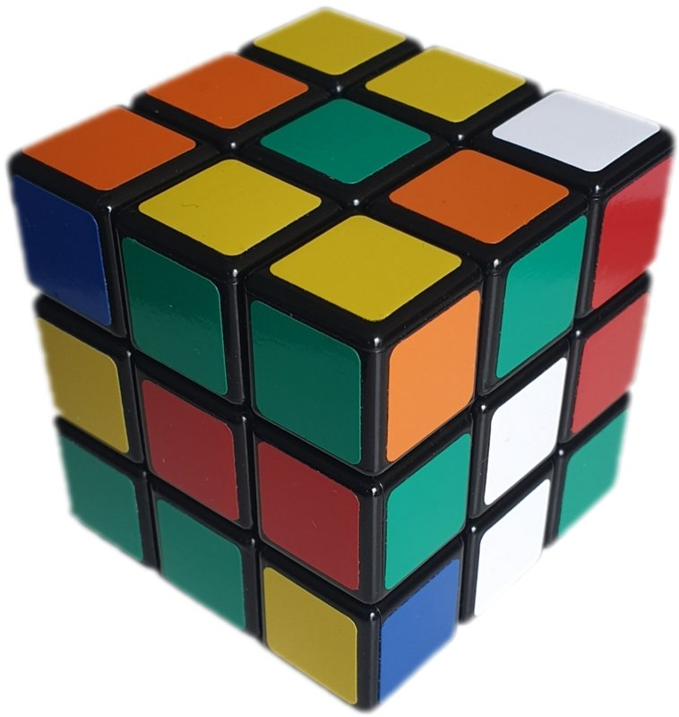

# Capítulo 74 — Proyecto: el cubo de Rubik

El cubo de Rubik tiene seis caras de nueve casillas, y cada cara gira sobre
su centro arrastrando las casillas de los bordes de las cuatro caras
vecinas. Mezclarlo es fácil; volver al estado inicial exige conocer
secuencias de giros que cambian pocas piezas y dejan el resto en su lugar.



Un cubo de Rubik mezclado. Se ven tres de sus caras: cada una tiene
casillas de varios colores, y el problema es devolverla a un solo color
con giros de las caras. Las piezas de las esquinas muestran tres
casillas, las de las aristas dos, y los centros no se mueven.
Imagen: Imk3nnyma, [CC BY-SA 4.0](https://creativecommons.org/licenses/by-sa/4.0/),
vía [Wikimedia Commons](https://commons.wikimedia.org/wiki/File:Scrumbled_Rubik%27s_Cube.jpg);
reducida a 758 × 800 píxeles.

Este capítulo construye un programa que lo resuelve. La salida siguiente es
la de `sesion(7, 20)`, de la versión 7: mezcla el cubo con veinte giros
elegidos a partir de la semilla 7, lo muestra desplegado y lo arma en cinco
etapas.

```text
Mezcla de 20 cuartos de vuelta: F L B F U' D' F U D' R' F' R' U D B' R D' F U R
┌────────────────────────────┐
│        U R D               │
│        L U D               │
│        F B U               │
│ F U R  U D R  B F L  B U L │
│ D L F  R F B  L R B  U B L │
│ F F B  D D B  U B L  F F D │
│        R R L               │
│        L D R               │
│        R U D               │
└────────────────────────────┘
1. la cruz de abajo (12 cuartos de vuelta):
   B D U F2 U2 R B' D' F D
2. las esquinas de abajo (32 cuartos de vuelta):
   B U2 B' U' B U B' L U L' F' U' F B U2 B' U' B U2 B' F U2 F' U2 F U F'
3. las aristas del medio (32 cuartos de vuelta):
   U L U' L' U' B' U B U L U' L' U' B' U B U' R' U R U B U' B' U L' U L U F U' F'
4. las aristas de arriba (14 cuartos de vuelta):
   B L U L' U' B' L F U F' U' L' U2
5. las esquinas de arriba (28 cuartos de vuelta):
   B U' F' U B' U' F U R' D' R D R' D' R D U2 D' R' D R D' R' D R U2
Total: 118 cuartos de vuelta. El cubo queda resuelto.
```

Cada letra es la inicial de una cara, en la notación de David Singmaster:
U arriba, D abajo, F adelante, B atrás, R derecha, L izquierda. Una letra
sola es un cuarto de vuelta de esa cara en el sentido de las agujas del
reloj, mirándola de frente; con apóstrofo, en el sentido contrario; con un
2, media vuelta.

El proyecto parte del capítulo «Rubik's Cube» de *Building Expert Systems
in Prolog*, de Dennis Merritt. De allí toma cuatro ideas: el cubo como un
término plano de 54 argumentos, un giro como un hecho cuyos dos
argumentos son el cubo antes y después, de modo que girar es una sola
unificación; las secuencias de giros compiladas de antemano en el mismo
formato, y la solución por etapas, en la que un cubo **criterio** con
variables libres unifica solamente con los cubos que tienen colocadas las
piezas pedidas. La lista completa, con lo que se toma de cada fuente, está
en [Referencias](#referencias). El código es propio.

El programa carga, sin copiarlos, el módulo de pantalla del
[capítulo 36](../capitulo-36-interfaces-de-usuario/index.md) y las
búsquedas del [capítulo 40](../capitulo-40-busqueda-y-planificacion/index.md),
y usa la inspección de términos del
[capítulo 32](../capitulo-32-inspeccion-de-terminos/index.md) y la
expansión de términos al cargar del
[capítulo 35](../capitulo-35-transformacion-de-programas-y-compilacion/index.md).
Todas las versiones son `% solo-local`, salvo la primera, que corre en
SWISH.

## Objetivos del capítulo

Al terminar el capítulo, el lector puede:

- representar un objeto con muchas partes como un término plano y escribir
  cada transformación como una unificación entre dos términos que
  comparten variables;
- generar esos hechos al cargar el programa, calculándolos a partir de la
  geometría del problema en lugar de escribirlos a mano;
- componer transformaciones aplicándolas a un término de variables libres,
  y leer en el resultado qué partes cambian;
- plantear un problema como un espacio de estados, medir el crecimiento de
  una búsqueda ciega y explicar por qué no alcanza;
- resolver por etapas con metas parciales expresadas como términos con
  variables libres;
- medir la longitud de las soluciones y el esfuerzo de búsqueda de cada
  mejora sobre cientos de mezclas reproducibles;
- pasar de una representación a otra con una sola unificación, y decidir
  con mediciones si una heurística previa a la búsqueda conviene.

!!! info "Tiempo estimado"
    Leer el capítulo, ejecutar sus ejemplos y hacer las actividades: **1:35 h**.
    Resolver los 6 ejercicios marcados con ★: **1:25 h**.
    Resolver los 13 ejercicios del final: **4:20 h**.

## 74.1 El programa terminado

| Versión | Archivo | Agrega | Lo que no puede hacer todavía |
|---|---|---|---|
| 1 | `cubo.pl` | el cubo como término; los seis giros, generados al cargar | mostrar el cubo de manera legible |
| 2 | `vista.pl` | el cubo desplegado en texto; la notación; las mezclas | resolver una mezcla |
| 3 | `espacio.pl` | las búsquedas del [capítulo 40](../capitulo-40-busqueda-y-planificacion/index.md) sobre el cubo, medidas | resolver mezclas de más de siete giros |
| 4 | `macros.pl` | las secuencias compiladas y su efecto | encontrar secuencias útiles sin escribirlas a mano |
| 5 | `descubrir.pl` | los conmutadores que mueven solo tres esquinas | usarlas para resolver |
| 6 | `etapas.pl` | la solución por etapas, pieza por pieza | dar soluciones cortas |
| 7 | `mejoras.pl` | la simplificación y la pieza más cercana | — |
| 8 | `piezas.pl` | el cubo como lista de piezas; dónde está una pieza; una ayuda previa a la búsqueda, medida | — |

`capitulo40.pl` carga las búsquedas del
[capítulo 40](../capitulo-40-busqueda-y-planificacion/index.md) en
módulos propios y les agrega los problemas del cubo, como hace el
[capítulo 77](../capitulo-77-proyecto-mundo-wumpus/index.md) con la vuelta
del Wumpus. Cada versión carga la anterior con `ensure_loaded/1`.

## 74.2 Versión 1: el cubo como término

El cubo es un término `c/54`, con un argumento por casilla. Las casillas
se numeran cara por cara, en el orden U, R, F, D, L, B, y dentro de cada
cara por filas, mirándola de frente; las caras U y D se miran con F
hacia abajo y hacia arriba, respectivamente:

```text
             1  2  3
             4  5  6
             7  8  9
37 38 39   19 20 21   10 11 12   46 47 48
40 41 42   22 23 24   13 14 15   49 50 51
43 44 45   25 26 27   16 17 18   52 53 54
             28 29 30
             31 32 33
             34 35 36
```

Cada argumento es el átomo de la cara a la que pertenece el color de la
casilla: en el cubo resuelto, los nueve primeros son `u`, los nueve
siguientes `r`, y así. Es una representación limpia en el sentido del
[capítulo 32](../capitulo-32-inspeccion-de-terminos/index.md#326-representaciones-limpias):
cada casilla es un argumento fijo, y un color es un átomo.

Un giro es un hecho `giro(Cara, Antes, Despues)`. Sus dos argumentos son
términos `c/54` con las mismas 54 variables, en otro orden. El giro de la
cara U, escrito a mano, empezaría así:

```text
giro(u, c(A1, A2, A3, A4, A5, A6, A7, A8, A9, A10, A11, A12, ...),
        c(A7, A4, A1, A8, A5, A2, A9, A6, A3, A46, A47, A48, ...)).
```

Al unificar `Antes` con un cubo, cada variable queda ligada al color de
una casilla, y `Despues` es el cubo girado: no se ejecuta ninguna
instrucción, Prolog solo unifica. Merritt escribe los hechos a mano. Aquí
se calculan al cargar el archivo, a partir de la geometría del cubo. Cada
casilla está en un cubito `p(X, Y, Z)`, con coordenadas −1, 0 o 1, y mira
en una dirección, un vector de la misma forma. Girar una cara es rotar un
cuarto de vuelta los cubitos de su capa, los que tienen coordenada 1 en la
dirección de la cara, junto con la dirección de sus casillas:

<!-- ejemplo: capitulo-74/cubo.pl predicado: rotar/3 destino/3 -->
```prolog
%!  rotar(+Eje, +V, -W) is det.
%
%   W es el vector V girado un cuarto de vuelta en el sentido de las
%   agujas del reloj, visto desde la punta del vector Eje:
%   W = (Eje . V) Eje - Eje x V.
rotar(p(A, B, C), p(X, Y, Z), p(X1, Y1, Z1)) :-
    E is A * X + B * Y + C * Z,
    X1 is E * A - (B * Z - C * Y),
    Y1 is E * B - (C * X - A * Z),
    Z1 is E * C - (A * Y - B * X).

%!  destino(+Cara, +I:integer, -J:integer) is det.
%
%   Al girar Cara, la casilla I pasa al lugar de la casilla J. Las
%   casillas fuera de la capa de Cara no se mueven.
destino(Cara, I, J) :-
    cara(Cara, _, Eje),
    casilla(I, _, P, N),
    Eje = p(A, B, C),
    P = p(X, Y, Z),
    (   A * X + B * Y + C * Z =:= 1
    ->  rotar(Eje, P, P1),
        rotar(Eje, N, N1),
        casilla(J, _, P1, N1)
    ;   J = I
    ).
```

`rotar/3` es la fórmula de la rotación de un cuarto de vuelta alrededor
de un eje, con aritmética entera. `destino/3` dice adónde va cada casilla:
la que está fuera de la capa se queda. Con esos destinos,
`giro_calculado/3` arma los dos términos: una lista de 54 variables para
`Antes`, y la misma lista reordenada por el destino de cada casilla para
`Despues`. `term_expansion/2`, como en la
[sección 35.1](../capitulo-35-transformacion-de-programas-y-compilacion/index.md#351-term_expansion2-y-goal_expansion2-en-swi-prolog),
reemplaza el término `generar_cubo` del archivo por los siete hechos
calculados, el del cubo resuelto y los seis giros ([Patrón 49](../patrones.md#49-expandir-al-cargar)):

<!-- ejemplo: capitulo-74/cubo.pl predicado: term_expansion/2 giro_calculado/3 -->
```prolog
%!  term_expansion(+Termino, -Clausulas:list) is semidet.
%
%   El término generar_cubo se reemplaza, al cargar el archivo, por el
%   hecho resuelto/1 y un hecho giro/3 por cara. Falla con cualquier
%   otro término.
term_expansion(generar_cubo, [resuelto(Resuelto)|Giros]) :-
    findall(Cara, ( between(1, 54, I), casilla(I, Cara, _, _) ), Caras),
    Resuelto =.. [c|Caras],
    findall(giro(Cara, Antes, Despues),
            ( cara(Cara, _, _),
              giro_calculado(Cara, Antes, Despues) ),
            Giros).

%!  giro_calculado(+Cara, -Antes, -Despues) is det.
%
%   Antes y Despues son dos términos c/54 con las mismas variables:
%   Despues es Antes con la capa de Cara girada.
giro_calculado(Cara, Antes, Despues) :-
    findall(J, ( between(1, 54, I), destino(Cara, I, J) ), Destinos),
    length(Vs, 54),
    Antes =.. [c|Vs],
    pairs_keys_values(Pares, Destinos, Vs),
    keysort(Pares, Ordenados),
    pairs_values(Ordenados, Ws),
    Despues =.. [c|Ws].
```

El giro inverso no necesita otro hecho. Si `giro(u, A, D)` lleva `A` a
`D`, leído en sentido inverso lleva `D` a `A`: basta con pasar el cubo en
el tercer argumento. `mover/3` lo hace para el movimiento `-Cara`, y
funciona con cualquiera de los dos cubos instanciado:

<!-- ejemplo: capitulo-74/cubo.pl predicado: mover/3 -->
```prolog
%!  mover(+Movimiento, ?Antes, ?Despues) is det.
%
%   Despues es Antes con Movimiento aplicado. Movimiento es una cara (un
%   cuarto de vuelta en el sentido de las agujas del reloj) o -Cara (el
%   giro inverso: el mismo hecho, leído en sentido inverso). Basta con que
%   llegue instanciado uno de los dos cubos.
mover(-Cara, Antes, Despues) :-
    !,
    giro(Cara, Despues, Antes).
mover(Cara, Antes, Despues) :-
    giro(Cara, Antes, Despues).
```

`aplicar/3` aplica una lista de movimientos con `foldl/4`, `inversa/2` da
la secuencia que la deshace, y `orden/2` cuenta cuántas veces hay que
repetir una secuencia para volver al cubo resuelto:

```prolog
?- color_tras([u], 19, Color).
Color = r.

?- cambiadas([r, u, -r, -u], N).
N = 12.

?- orden([r, u], N).
N = 105.

?- inversa([r, -u, f], I).
I = [-f, u, -r].
```

La casilla 19 es la esquina superior izquierda de la cara F: después de U
tiene el color de R, porque la fila de arriba gira de la derecha hacia el
frente. La secuencia R U, repetida, vuelve al estado inicial recién en la
repetición 105. Las pruebas verifican que cada cara repetida cuatro veces
es la identidad, que tres cuartos de vuelta equivalen al giro inverso y
que la secuencia inversa deshace la original.

!!! question "Actividad"
    Predecir cuántas casillas cambia `[u, u]`, cuántas cambia `[u, d]` y
    cuál es el orden de `[u, d]`. Comprobarlo con `cambiadas/2` y
    `orden/2`, y explicar por qué el orden de `[r, l]` es el mismo que el
    de `[u, d]`.

**Lo que falta.** Un término de 54 argumentos no se lee a simple vista.

## 74.3 Versión 2: el cubo a la vista

`red/2` arma las nueve líneas del cubo desplegado en cruz, con la letra de
cada casilla en mayúscula, y `mostrar/1` las encierra con `caja/3` del
módulo `pantalla` del
[capítulo 36](../capitulo-36-interfaces-de-usuario/index.md#362-pantalla-completa-en-la-terminal)
y las escribe. Es el [Patrón 51](../patrones.md#51-modelo-de-pantalla):
`red/2` es puro y se prueba comparando cadenas; solo `mostrar/1` escribe.

<!-- ejemplo: capitulo-74/vista.pl predicado: mostrar/1 -->
```prolog
%!  mostrar(+Cubo) is det.
%
%   Escribe Cubo desplegado, dentro de un recuadro.
mostrar(Cubo) :-
    red(Cubo, Lineas),
    caja("", Lineas, Caja),
    forall(member(Linea, Caja), writeln(Linea)).
```

Las secuencias se leen y se escriben en la notación de Singmaster.
`leer_notacion/2` es una gramática sobre los códigos del texto, como las
del [capítulo 21](../capitulo-21-gramaticas-dcg/index.md): cada palabra es
una letra de cara seguida, a lo sumo, de un apóstrofo o de un 2.
`escribir_notacion/2` hace lo inverso y agrupa dos cuartos de vuelta
iguales en una media vuelta:

```prolog
?- mostrar_giros("R U R' U'").
┌────────────────────────────┐
│        U U L               │
│        U U F               │
│        U U F               │
│ B L L  F F D  R R U  B R R │
│ L L L  F F U  B R R  B B B │
│ L L L  F F F  U R R  B B B │
│        D D R               │
│        D D D               │
│        D D D               │
└────────────────────────────┘
true.

?- leer_notacion("F2 U' R", Ms).
Ms = [f, f, -u, r].

?- mezcla(7, 6, Ms), escribir_notacion(Ms, T).
Ms = [f, l, b, f, -u, -d],
T = "F L B F U' D'".
```

`mezcla/3` elige cada giro con un generador congruencial lineal cuyo
estado pasa de una llamada a la siguiente como argumento, sin repetir la
cara del giro anterior: la misma semilla da la misma mezcla en cualquier
instalación, y las pruebas y las mediciones del capítulo son
reproducibles.

**Lo que falta.** El programa mezcla, pero no resuelve.

## 74.4 Versión 3: el cubo como espacio de estados

El [capítulo 40](../capitulo-40-busqueda-y-planificacion/index.md#401-el-problema-como-interfaz)
define un problema con tres predicados, `inicial/2`, `meta/2` y
`sucesor/5`, y lo resuelve con búsquedas que no saben nada del dominio.
El cubo encaja en esa interfaz: el estado es el término `c/54`, la meta es
el cubo resuelto y cada sucesor es uno de los doce cuartos de vuelta. La
página [El cubo como espacio de estados](espacio.md#el-cubo-como-espacio-de-estados)
carga esas búsquedas sin copiarlas, en `capitulo40.pl`, y las mide:

<!-- contexto: capitulo-74/espacio.pl -->
```prolog
?- capas(4, Cuantos).
Cuantos = [1, 12, 114, 1068, 10011].

?- medir(profundizando, 5, 5, Largo, Inferencias).
Largo = 5,
Inferencias = 567572.
```

`capas/2` cuenta los estados a cada distancia del cubo resuelto. La
profundización iterativa resuelve una mezcla de cinco giros con medio
millón de inferencias y una de siete con 130 millones, en 40 segundos:
cada giro más multiplica el costo por alrededor de doce, y una mezcla de
veinte giros llevaría más de cien millones de años. La búsqueda en
anchura con registro de visitados es todavía más lenta, porque compara
términos de 54 argumentos en cada inserción. El cubo tiene
43 252 003 274 489 856 000 estados.

**Lo que falta.** Una búsqueda ciega no resuelve una mezcla real. Hace
falta conocimiento: secuencias que muevan pocas piezas.

## 74.5 Versión 4: los macrooperadores

Un **macrooperador** es una secuencia de giros tratada como un solo
movimiento. Para usarla con el mismo costo que un giro, se compila: se
aplica a un cubo cuyas 54 casillas son variables libres, como en la
[sección 32.5](../capitulo-32-inspeccion-de-terminos/index.md#325-variables-como-datos).
El resultado es un par `Antes-Despues` con las mismas variables en otro
orden, exactamente la forma de un giro:

<!-- ejemplo: capitulo-74/macros.pl predicado: compilar/2 term_expansion/2 -->
```prolog
%!  compilar(+Movimientos:list, -Macro) is det.
%
%   Macro es Antes-Despues: dos términos c/54 con las mismas variables,
%   tales que Despues es Antes con Movimientos aplicados.
compilar(Movimientos, Antes-Despues) :-
    functor(Antes, c, 54),
    aplicar(Movimientos, Antes, Despues).

%!  term_expansion(+Termino, -Hechos:list) is semidet.
%
%   El término macro(Nombre, Texto) se reemplaza, al cargar, por el hecho
%   macro(Nombre, Antes, Despues), con la secuencia de Texto compilada, y
%   el hecho texto_macro(Nombre, Texto).
term_expansion(macro(Nombre, Texto),
               [macro(Nombre, Antes, Despues), texto_macro(Nombre, Texto)]) :-
    leer_notacion(Texto, Movimientos),
    compilar(Movimientos, Antes-Despues).
%!  term_expansion(+Termino, -Hechos:list) is semidet.
%
%   El término generar_piezas se reemplaza, al cargar, por un hecho
%   pieza(P, Nombre, Casillas) por cada arista y cada esquina.
term_expansion(generar_piezas, Hechos) :-
    findall(pieza(P, Nombre, Casillas),
            pieza_calculada(P, Nombre, Casillas),
            Hechos).
```

Merritt precompila sus secuencias de la misma manera, con `assertz/1` en
tiempo de ejecución; aquí `term_expansion/2` reemplaza cada término
`macro(Nombre, Texto)` del archivo por el hecho compilado, al cargar.
Aplicar una macro de 18 giros cuesta lo mismo que aplicar un giro:

```prolog
?- inferencias(dos_esquinas, 1000, EnLista, Compilada).
EnLista = 58002,
Compilada = 3002.
```

El par compilado dice, además, qué hace la secuencia sin aplicarla a
ningún cubo. Una pieza queda quieta si cada una de sus casillas recibe en
`Despues` la misma variable que tenía en `Antes`; la comparación es con
`==/2`, porque son variables:

<!-- ejemplo: capitulo-74/macros.pl predicado: efecto/2 quieta/3 -->
```prolog
%!  efecto(+Macro, -Piezas:list(atom)) is det.
%
%   Piezas son los nombres de las piezas que Macro, un par Antes-Despues,
%   cambia de lugar o de orientación.
efecto(Antes-Despues, Piezas) :-
    findall(Nombre,
            ( pieza(_, Nombre, Casillas),
              \+ quieta(Casillas, Antes, Despues) ),
            Piezas).

%!  quieta(+Casillas:list(integer), +Antes, +Despues) is semidet.
%
%   Cada una de Casillas tiene en Despues la misma variable que en Antes.
quieta(Casillas, Antes, Despues) :-
    forall(member(I, Casillas),
           ( arg(I, Antes, X),
             arg(I, Despues, Y),
             X == Y )).
```

`pieza/3` es una tabla generada al cargar con las 20 piezas móviles
(ocho esquinas y doce aristas), cada una con su nombre en la notación
(UFR, DB, FL…) y los números de sus casillas:

```prolog
?- efecto_de("R U R' U'", Piezas).
Piezas = ['UBL', 'UB', 'DFR', 'FR', 'UBR', 'UR', 'UFR'].

?- efecto_macro(giro_esquina, Piezas).
Piezas = ['DBL', 'DB', 'DBR', 'DR', 'DFR', 'FR', 'UFR'].

?- efecto_macro(dos_esquinas, Piezas).
Piezas = ['UBR', 'UFR'].
```

`giro_esquina` es R' D' R D dos veces: en la capa de arriba solo toca la
esquina UFR, que queda en su lugar pero girada sobre sí misma, y
desordena la capa de abajo. `dos_esquinas` es un **conmutador**:
`giro_esquina`, U, la inversa de `giro_esquina` y U'. U lleva otra esquina
a la posición UFR; la inversa la gira en sentido contrario y arregla la
capa de abajo; U' devuelve la capa de arriba. El resultado gira dos
esquinas y no toca nada más. `conmutador/3` y `conjugado/3` construyen
estas secuencias.

!!! example "Patrón 74 — Transformación como par de términos"
    **Problema.** Es necesario aplicar muchas veces una transformación que
    reordena las partes de un término de tamaño fijo, como un giro del
    cubo, y también componer transformaciones, invertirlas y saber qué
    partes cambian.

    **Versión ingenua.** Escribir cada transformación como un
    procedimiento que lee el término argumento por argumento y construye
    otro; su inversa es otro procedimiento, y una secuencia se aplica paso
    a paso cada vez: `dos_esquinas`, de 18 giros, aplicada como lista
    cuesta 58 002 inferencias en mil aplicaciones.

    **Patrón.** La transformación es un par `Antes-Despues` de dos
    términos que comparten sus variables, en otro orden, como los hechos
    `giro(Cara, Antes, Despues)` de la versión 1. Aplicarla es **una
    unificación**: `Antes` con el término, y `Despues` es el resultado.
    Componer es aplicarla a un término de variables libres: `compilar/2`
    aplica una secuencia a un `c/54` sin ligar y obtiene otro par con la
    forma de un giro, que se aplica con `usar/3` en 3 002 inferencias las
    mismas mil veces. El mismo hecho, leído en sentido inverso, da la
    inversa, como `mover/3` para `-Cara`. Y el par dice qué hace sin
    aplicarlo: `efecto/2` compara las variables con `==/2`.

    **Cuándo no usarlo.** Cuando la transformación depende de los valores
    y no solo de las posiciones, como una que cambia un color según otro:
    un par de términos solo reordena, copia o descarta partes. Cuando no es
    una permutación: si `Despues` repite una variable o no contiene
    alguna, leer el par en sentido inverso no da la inversa, sino una
    restricción de igualdad o una parte libre. Y cuando el par no es un
    hecho sino un término que viaja en una variable: la primera
    aplicación liga sus variables, y cada uso siguiente necesita antes
    una copia con `copy_term/2`; por eso `term_expansion/2` guarda cada
    macro compilada como un hecho.

!!! question "Actividad"
    Predecir qué piezas mueve el conmutador R L R' L' y cuáles mueve
    F R U R' U' F'. Comprobarlo con `efecto_de/2` y explicar el primer
    resultado a partir de las capas que tocan R y L.

**Lo que falta.** Las secuencias útiles se escriben a mano, copiadas de
un libro o de la experiencia de quien resuelve el cubo.

## 74.6 Versión 5: descubrir macros

Merritt propone, como ejercicio de su capítulo, que el programa descubra
secuencias. El conmutador de dos secuencias A y B deshace las dos salvo
en las piezas que ambas mueven: si comparten una sola pieza, mueve apenas
tres. `descubrir/3` genera los conmutadores de una secuencia A de hasta
tres cuartos de vuelta con un cuarto de vuelta B, compila cada uno y se
queda con los que mueven exactamente tres esquinas de la cara de arriba:

<!-- ejemplo: capitulo-74/descubrir.pl predicado: descubrir/3 -->
```prolog
%!  descubrir(+Largo:integer, -Encontradas:list, -Probadas:integer) is det.
%
%   Encontradas son los conmutadores A B A' B', con A de 1 a Largo
%   cuartos de vuelta y B un cuarto de vuelta, que mueven tres esquinas de
%   la cara de arriba y nada más; cada uno como una lista de giros, sin
%   repetidos. Probadas es la cantidad de conmutadores examinados.
descubrir(Largo, Encontradas, Probadas) :-
    findall(S-Sirve,
            ( between(1, Largo, N),
              length(A, N),
              reducida(A),
              cuarto_de_vuelta(B),
              conmutador(A, [B], S),
              compilar(S, Macro),
              efecto(Macro, Piezas),
              (   tres_esquinas_de_arriba(Piezas)
              ->  Sirve = si
              ;   Sirve = no
              ) ),
            Todas),
    length(Todas, Probadas),
    findall(S, member(S-si, Todas), Encontradas0),
    sort(Encontradas0, Encontradas).
```

```prolog
?- descubrir(2, Encontradas, Probadas).
Encontradas = [],
Probadas = 1584.

?- aggregate_all(count, descubierta(3, _), N).
N = 24.

?- descubierta(3, T), sub_string(T, 0, _, _, "U' L").
T = "U' L' U R U' L U R'" ;
false.
```

Con A de uno o dos giros no hay ninguno; con tres, 24 entre 15 984
conmutadores, en 5 millones de inferencias y menos de dos segundos. La
secuencia U' L' U R U' L U R' es el conmutador de U' L' U con R: cicla
las esquinas UFR, UBR y UBL. Su inversa, R U' L' U R' U' L U, es la que
Merritt llama *tri-corner*. Las dos son candidatas de la última etapa de
la versión 6.

**Lo que falta.** Con giros, macros y metas, todavía no hay un
resolvedor.

## 74.7 Versión 6: la solución por etapas

El resolvedor arma el cubo por capas, de abajo hacia arriba, en cinco
etapas de cuatro piezas, y coloca las piezas de a una. Merritt organiza
su programa de la misma manera, con un plan de piezas y una lista de
candidatos por etapa, pero sigue las seis etapas del libro de Black y
Taylor, que arman el cubo de la cara izquierda a la derecha:

| Etapa | Piezas | Candidatos |
|---|---|---|
| 1. la cruz de abajo | DF, DR, DB, DL | los 18 giros de U, D y las caras laterales |
| 2. las esquinas de abajo | DFR, DBR, DBL, DFL | U; tres inserciones de una esquina desde arriba |
| 3. las aristas del medio | FR, BR, BL, FL | U; dos inserciones de una arista, por la derecha y por la izquierda |
| 4. las aristas de arriba | UF, UR, UB, UL | U; F R U R' U' F', que da vuelta aristas; la secuencia de Sune, que las cicla |
| 5. las esquinas de arriba | UFR, UBR, UBL, UFL | el ciclo de tres esquinas de la versión 5 y su inversa; `dos_esquinas` y sus variantes |

La meta de cada pieza es un **criterio**: un término `c/54` con las
casillas de las piezas ya colocadas y de la pieza nueva ligadas a su color,
y las demás libres. Un cubo cumple el criterio si unifica con él. No hace
falta recorrer el cubo buscando piezas: la unificación compara las
casillas ligadas e ignora las libres.

<!-- ejemplo: capitulo-74/etapas.pl predicado: criterio/2 colocar/5 -->
```prolog
%!  criterio(+Piezas:list(atom), -Criterio) is det.
%
%   Criterio es un término c/54 con las casillas de Piezas ligadas al
%   color del cubo resuelto y las demás libres.
criterio(Piezas, Criterio) :-
    functor(Criterio, c, 54),
    resuelto(Resuelto),
    maplist(casillas_de, Piezas, Listas),
    append(Listas, Casillas),
    maplist(copiar_casilla(Resuelto, Criterio), Casillas).

%!  colocar(+Etapa, +Cubo, +Criterio, -Movimientos:list, -Cubo1) is det.
%
%   Movimientos es una de las secuencias más cortas de candidatos de
%   Etapa que llevan Cubo a Cubo1, que cumple Criterio. La búsqueda es la
%   profundización iterativa del capítulo 40.
colocar(Etapa, Cubo, Criterio, Movimientos, Cubo1) :-
    colocar_pieza(Etapa, Cubo, [Criterio], Plan),
    append(Plan, Movimientos),
    aplicar(Movimientos, Cubo, Cubo1).
```

`colocar/5` busca la secuencia más corta de candidatos que lleva el cubo
a un estado que unifica con el criterio. Merritt escribe esa búsqueda con
una recursión que recalcula los estados intermedios en lugar de
guardarlos; es la profundización iterativa del
[capítulo 40](../capitulo-40-busqueda-y-planificacion/index.md#404-profundidad-limitada-y-profundizacion-iterativa),
y `colocar_pieza/4` la toma de allí, con un tercer problema agregado en
`capitulo40.pl`: el estado inicial es el cubo, la meta unifica con el
criterio y cada sucesor aplica un candidato. Cada candidato es un giro o
una macro compilada, así que aplicarlo es una unificación.

Los candidatos se escriben por familias, para la posición de adelante a la
derecha, y `orientar/3` genera las otras tres cambiando cada cara lateral
por la de su izquierda: es girar el cubo entero sobre el eje vertical. El
término `generar_candidatos` se expande, al cargar, en un hecho
`candidato/4` compilado por cada secuencia distinta:

<!-- ejemplo: capitulo-74/etapas.pl fragmento: familia(3, "U") .. familia(3, "U' F' U F U R U' R'"). -->
```prolog
familia(3, "U").
familia(3, "U'").
familia(3, "U2").
familia(3, "U R U' R' U' F' U F").
familia(3, "U' F' U F U R U' R'").
```

En `capitulo40.pl`, el módulo de la profundización iterativa recibe las
cláusulas de los dos problemas, el cubo entero y la pieza:

<!-- ejemplo: capitulo-74/capitulo40.pl fragmento: iterativa40:inicial(cubo(C), C). .. user:candidato(Etapa, Ms, C, C1). -->
```prolog
iterativa40:inicial(cubo(C), C).
iterativa40:inicial(pieza(_, C, _), C).

%!  iterativa40:meta(+Problema, +C) is semidet.
%
%   El cubo C es una meta de Problema: en cubo(_), el cubo resuelto; en
%   pieza(_, _, Criterios), un cubo que unifica con alguno de Criterios.
iterativa40:meta(cubo(_), C) :-
    user:resuelto(C).
iterativa40:meta(pieza(_, _, Criterios), C) :-
    memberchk(C, Criterios).

%!  iterativa40:sucesor(+Problema, +C, -Ms, -C1, -Costo:integer)
%!      is nondet.
%
%   El cubo C1 sigue a C en Problema, con costo 1: en cubo(_), por el
%   cuarto de vuelta Ms; en pieza(Etapa, _, _), por el candidato de Etapa
%   cuya lista de giros es Ms.
iterativa40:sucesor(cubo(_), C, M, C1, 1) :-
    user:cuarto_de_vuelta(M),
    user:mover(M, C, C1).
iterativa40:sucesor(pieza(Etapa, _, _), C, Ms, C1, 1) :-
    user:candidato(Etapa, Ms, C, C1).
```

```prolog
?- orientar(1, [r, u, -r], Ms).
Ms = [f, u, -f].

?- resolver_mezcla(7, 20, PorEtapa, Total).
PorEtapa = [1-14, 2-39, 3-56, 4-25, 5-42],
Total = 176.
```

Sobre las mezclas de 25 giros de las semillas 1 a 200, el resolvedor
arma los 200 cubos con 172,7 cuartos de vuelta en promedio, entre 107 y
247, y 53 926 inferencias en promedio; la más larga tarda 0,09 s. Ninguna
pieza pide más de cinco candidatos. La etapa más larga es la última, con
50,9 cuartos de vuelta en promedio, porque sus macros tienen entre 8 y
20 giros. La diferencia con la versión 3 es de escala: una búsqueda ciega
de siete giros costaba 130 millones de inferencias, y el cubo entero
cuesta aquí 54 mil. Las macros convierten el problema en veinte búsquedas
cortas, y la unificación con el criterio hace que cada prueba de meta
cueste una sola operación.

!!! question "Actividad"
    Antes de consultar, predecir cuántos candidatos tiene cada etapa: cada
    familia da cuatro secuencias, salvo las que no tocan las caras
    laterales, que dan una sola. Comprobarlo con
    `aggregate_all(count, candidato(E, _, _, _), N)` para E de 1 a 5.

**Lo que falta.** Las soluciones son largas: 172 cuartos de vuelta en
promedio para deshacer mezclas de 25.

## 74.8 Versión 7: soluciones más cortas

Dos cambios, medidos por separado. El primero es de limpieza: una macro
termina con giros de U y la siguiente empieza con otros giros de U, de
modo que al concatenarlas quedan secuencias como U' U2 o R R'.
`simplificar/2` apila los giros y suma los cuartos de vuelta de una misma
cara módulo 4; si la suma da cero, el grupo desaparece y el anterior puede
sumarse con el siguiente:

<!-- ejemplo: capitulo-74/mejoras.pl predicado: apilar/3 -->
```prolog
%!  apilar(+Movimiento, +Pila0:list, -Pila:list) is det.
%
%   Pila es Pila0 con Movimiento sumado: Pila es una lista de pares
%   Cara-Cuartos, el último grupo primero. Si el grupo de arriba es de la
%   misma cara, se suman; si la suma da 0 módulo 4, el grupo desaparece y
%   el de abajo puede volver a sumarse con el siguiente.
apilar(Movimiento, Pila0, Pila) :-
    cara_de(Movimiento, Cara),
    cuartos(Movimiento, K),
    (   Pila0 = [Cara-K0|Resto]
    ->  K1 is (K0 + K) mod 4,
        (   K1 =:= 0
        ->  Pila = Resto
        ;   Pila = [Cara-K1|Resto]
        )
    ;   Pila = [Cara-K|Pila0]
    ).
```

El segundo es una heurística de orden. En cada etapa, en lugar de
colocar las piezas en el orden fijo de la tabla, se busca la que pide la
secuencia más corta: `colocar_pieza/4` recibe un criterio por cada pieza
que falta y termina con el primero que se cumple.

```prolog
?- simplificar([r, u, -u, -r, f, f, f], Ms).
Ms = [-f].

?- medir(etapas, 20, Media, Maximo).
Media = 169.7,
Maximo = 215.

?- medir(cercana_simplificada, 20, Media, Maximo).
Media = 146.1,
Maximo = 195.
```

Sobre las 200 mezclas de la versión 6:

| Método | Cuartos de vuelta (media) | Máximo | Inferencias (media) |
|---|---|---|---|
| etapas (versión 6) | 172,7 | 247 | 53 926 |
| etapas, simplificada | 160,4 | 235 | 53 926 |
| pieza más cercana | 153,4 | 217 | 62 856 |
| pieza más cercana, simplificada | 142,7 | 197 | 62 856 |

La simplificación no cuesta búsqueda y ahorra un 7 %. La pieza más
cercana ahorra un 11 % de giros a cambio de un 17 % más de inferencias,
porque cada nivel de la profundización prueba varios criterios. Juntas
reducen la solución en un 17 %. El resolvedor sigue lejos del óptimo:
colocar las piezas de a una, con macros que preservan todo lo anterior,
es lo que hace que la búsqueda sea corta, y también lo que alarga la
solución. Merritt observa lo mismo: más heurísticas y más macros ahorran
búsqueda solo mientras cuestan menos que la búsqueda que evitan.

## 74.9 Versión 8: piezas y una ayuda para la búsqueda

El programa de Merritt usa una segunda representación del cubo, una
lista de piezas, y pasa de una a otra con un solo hecho cuyos dos
argumentos comparten las variables, como los giros ([Patrón 75](../patrones.md#75-dos-representaciones-unidas-por-un-hecho-que-comparte-las-variables)). La
octava versión genera ese hecho al cargar y escribe con él la búsqueda
de Merritt de una pieza: recorre a la vez la lista del cubo resuelto y la del cubo dado,
y responde dónde está la pieza y si está girada. Con esa información
escribe también la ayuda de las heurísticas `shift_right` de Merritt, que
sacan de la capa de abajo la pieza que está allí fuera de su lugar antes
de buscar, y la mide: con los candidatos de este capítulo, la ayuda
alarga las soluciones y aumenta las inferencias, porque la búsqueda ya
encuentra esos movimientos cuando le sirven. Está en la página
[Piezas y una ayuda para la búsqueda](piezas.md#piezas-y-una-ayuda-para-la-busqueda).

!!! success "Criterios de calidad"
    | Criterio | En este capítulo |
    |---|---|
    | C1 | cada regla declara modos y determinación; `mover/3` declara los dos cubos con `?`, porque funciona con cualquiera de ellos instanciado |
    | C2 | representaciones limpias: el cubo es un término de tamaño fijo, un movimiento es una cara o `-Cara`, una macro es un par `Antes-Despues` |
    | C3 | un giro es una relación: el mismo hecho da el giro y su inverso, y `leer_notacion/2` y `escribir_notacion/2` son lecturas inversas probadas una contra la otra |
    | C4 | `simplificar/2` despliega cada grupo con `giros_de/4`, indexado por su primer argumento, y las pruebas no encuentran alternativas pendientes |
    | C6 | `red/2` arma el texto y solo `mostrar/1` y `sesion/2` escriben |
    | C7 | 111 pruebas en nueve archivos; las mezclas salen de una semilla, así que cada medición del capítulo se repite igual en cualquier instalación |

## Ejercicios

Las soluciones están en [la página de soluciones](soluciones.md). La dificultad
va de 1 (se resuelve consultando el capítulo) a 3 (requiere elaboración propia).
Los marcados con ★ son los que no conviene saltear: cubren lo que el capítulo
tiene de propio. Los ejercicios que piden código se resuelven en archivos
que cargan los del capítulo, sin modificarlos.

1. ★ **(1)** Predecir `orden([r, r], N)`, `orden([r, l], N)` y
   `cambiadas([r, l, -r, -l], N)`, y comprobarlo. Explicar con `efecto_de/2`
   por qué el último da 0.
2. ★ **(2)** Escribir `giro_medio(Eje, Antes, Despues)`, el giro de la
   capa del medio perpendicular a la cara `Eje`, con la misma geometría de
   `destino/3`: la capa es la de coordenada 0 en esa dirección. Verificar
   que cuatro giros medios son la identidad y que el giro de una cara, el
   de la capa del medio y el inverso de la cara opuesta hacen girar el cubo
   entero.
3. **(2)** Extender `leer_notacion/2` para que acepte una secuencia entre
   paréntesis seguida de un número de repeticiones:
   `"(R' D' R D)2 U"`. Comprobar que `"(R' D' R D)2"` da la secuencia de
   `giro_esquina`.
4. ★ **(2)** Escribir `tipo_efecto(Texto, Esquinas, Aristas)`, que cuenta
   las esquinas y las aristas que mueve una secuencia, y aplicarlo a las
   familias de cada etapa. Explicar por qué ninguna candidata de la etapa
   3 mueve una pieza de la capa de abajo.
5. ★ **(2)** Escribir `leer_red(Lineas, Cubo)`, la relación inversa de
   `red/2`: arma el cubo a partir de las nueve líneas del cubo desplegado,
   como el editor del programa de Merritt. Comprobar sobre las mezclas de
   las semillas 1 a 20 que `red/2` seguido de `leer_red/2` devuelve el
   mismo cubo.
6. **(2)** Escribir `mostrar_color/1`, que escribe el cubo desplegado con
   cada casilla sobre un fondo de color, con las secuencias de escape ANSI
   del [capítulo 36](../capitulo-36-interfaces-de-usuario/index.md). Separar
   la parte pura, que arma las líneas con las secuencias de escape, de la
   que escribe, y probar la parte pura.
7. **(3)** Escribir los tres giros del cubo entero, `rotacion(Eje, Antes,
   Despues)`, generados al cargar como los giros de las caras. Verificar
   que `orientar/3` equivale a conjugar con la rotación sobre el eje
   vertical: para cada familia de `etapas.pl`, la secuencia orientada y la
   original entre una rotación y su inversa dan la misma macro.
8. ★ **(2)** Medir, sobre las semillas 1 a 50, la media y el máximo de
   cuartos de vuelta de cada etapa de `resolver/2`. Decir qué etapa pesa
   más y relacionarlo con el largo de sus macros.
9. **(2)** En la búsqueda de una pieza, dos candidatos seguidos que solo
   giran U se pueden reemplazar por uno. Escribir `colocar_podado/5`, que
   descarta esas secuencias, y medir las inferencias de `resolver/2` con y
   sin la poda en las semillas 1 a 50.
10. **(3)** Adaptar `descubrir/3` para buscar conmutadores de A, de hasta
    tres cuartos de vuelta, con B, un cuarto de vuelta de U, que muevan
    exactamente tres aristas de la cara de arriba. Informar cuántos hay y
    explicar el resultado.
11. **(3)** El otro ejercicio de Merritt: que el programa recuerde lo que
    aprende. Escribir una variante de `resolver/2` que, cada vez que
    coloca una pieza con tres o más candidatos, agregue la secuencia
    compilada como un candidato nuevo de la etapa para las mezclas
    siguientes. Medir, sobre las semillas 1 a 50 resueltas en orden, los
    candidatos aprendidos, los cuartos de vuelta y las inferencias.
12. ★ **(1)** Predecir, con `piezas.pl` cargado, qué responden
    `donde_tras([f], 'DF', L, E)`, `donde_tras([d], 'DF', L, E)`,
    `donde_tras([f, f, d, d, -f, -f], 'DF', L, E)` y
    `pieza_tras([u], 'UF', P)`, y comprobarlo.
13. **(2)** Escribir `por_etapa(Metodo, Semillas, Pares)`, los cuartos de
    vuelta que usa cada etapa de `resolver/2` o de
    `resolver_con_ayuda/2`, sumados sobre las mezclas de 25 giros de las
    semillas 1 a Semillas. Compararlos con 50 semillas y explicar por qué
    la ayuda cambia también las etapas en las que no actúa.

## Resumen

| | |
|---|---|
| **giro como unificación** | un hecho con el cubo antes y después, dos términos con las mismas variables; el mismo hecho, leído en sentido inverso, es el giro inverso |
| **hechos generados por geometría** | los giros no se escriben: se calculan al cargar, rotando las coordenadas de cada casilla |
| **macro compilada** | una secuencia aplicada a un cubo de variables libres da un par con la misma forma que un giro; aplicarla cuesta una unificación |
| **efecto de una macro** | las piezas cuyas casillas reciben otra variable, comparadas con `==/2` sin aplicar la macro a ningún cubo |
| **conmutador** | A B A' B': mueve solo lo que A y B mueven en común y lo que eso arrastra |
| **criterio** | un cubo con las casillas colocadas ligadas y las demás libres; la meta de una pieza es unificar con él |
| **orientaciones de una familia** | la misma secuencia con las caras laterales cambiadas: el cubo girado sobre su eje vertical |
| `resuelto/1`, `giro/3`, `aplicar/3`, `inversa/2`, `orden/2` | el cubo y sus giros |
| `red/2`, `leer_notacion/2`, `escribir_notacion/2`, `mezcla/3` | la vista, la notación y las mezclas |
| `en_anchura/3`, `profundizando/2`, `colocar_pieza/4`, `capas/2`, `estados/1` | el cubo como espacio de estados |
| `compilar/2`, `efecto/2`, `pieza/3`, `conmutador/3`, `conjugado/3`, `descubrir/3` | las macros |
| **[Patrón 74](../patrones.md#74-transformacion-como-par-de-terminos)** | transformación como par de términos |
| **[Patrón 75](../patrones.md#75-dos-representaciones-unidas-por-un-hecho-que-comparte-las-variables)** | dos representaciones unidas por un hecho que comparte las variables |
| `criterio/2`, `candidato/4`, `orientar/3`, `resolver/2` | la solución por etapas |
| `resolver_cercana/2`, `sesion/2` | las mejoras y el programa terminado |
| **dos representaciones** | el término de casillas para girar y la lista de piezas para buscar una pieza, unidas por un hecho que comparte las variables |
| `piezas/2`, `donde/4`, `en_lugar/3`, `ayuda/5`, `resolver_con_ayuda/2`, `comparar_ayuda/3` | la versión 8 |
| `nextto/3` | dos elementos consecutivos de una lista; en las pruebas |

## Temas que se retoman

| Tema | Se retoma en |
|---|---|
| Las simetrías de un rompecabezas para no explorar dos veces el mismo estado | [capítulo 75](../capitulo-75-proyecto-rompecabezas-simetrias/index.md) |

## Referencias

- Dennis Merritt, *Building Expert Systems in Prolog*, Springer-Verlag,
  1989 — capítulo «Rubik's Cube» (las secciones sobre el cubo, la rotación,
  las reglas de alto nivel, la búsqueda y las heurísticas) y el apéndice
  con el código del programa.
  [Edición en línea](https://www.amzi.com/ExpertSystemsInProlog/), de
  Amzi!. El capítulo toma de allí las ideas y no el código: el cubo como
  un término plano de 54 casillas; cada giro como un hecho que unifica dos
  términos; el giro inverso con los argumentos intercambiados; las
  secuencias precompiladas como un giro más; la solución por etapas, con
  un plan de piezas y candidatos por etapa; el cubo criterio con
  variables libres como meta parcial, y la búsqueda que recalcula los
  estados en lugar de guardarlos; la lista de piezas como segunda
  representación, la búsqueda de una pieza recorriendo dos listas a la
  vez, y las heurísticas que mueven la pieza antes de buscar. También los
  dos ejercicios del final de
  su capítulo: más heurísticas y el descubrimiento de secuencias.
- M. Razid Black y Herbert Taylor, *Unscrambling the Cube*, Zephyr
  Engineering Design (ZED), Burbank, California, 1980 (impreso en 1981),
  40 páginas, ISBN 0-940874-03-2; incluye el folleto anterior de Black,
  *Constructing Patterns on the Cube*. Merritt no da los datos
  bibliográficos: salen de la reseña de David Singmaster en
  [*Cubic Circular* 3 y 4](https://www.jaapsch.net/puzzles/cubic3.htm)
  (1982) y de la bibliografía de cubos de Georges Helm. Sin edición en
  línea de acceso libre verificada. Es la fuente de Merritt para la solución por etapas,
  con sus seis etapas de la cara izquierda a la derecha, y para las
  secuencias que intercambian y giran esquinas; el capítulo conoce el
  libro a través de él, y usa cinco etapas por capas de abajo hacia
  arriba.
- David Singmaster, *Notes on Rubik's «Magic Cube»*, Enslow, 1981. Sin
  edición en línea de acceso libre verificada. El capítulo toma la
  notación de los giros y de las piezas y el recuento de los estados del
  cubo.

El código del capítulo es propio, escrito para el curso: los giros
calculados por geometría, las macros compiladas al cargar, la lectura de
su efecto, la búsqueda de conmutadores, las cinco etapas por capas con
sus familias de candidatos, la ayuda limitada a la capa de abajo y las
mediciones no provienen de esas fuentes.
