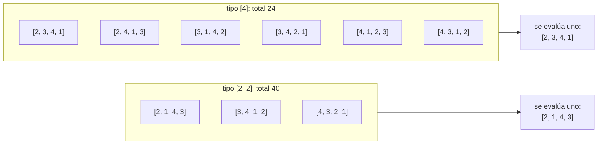

# Enigma 1225

Esta página desarrolla la [sección 75.7](index.md#757-versiones-6-a-8-enigma-1225)
del [capítulo 75](index.md): las tres versiones que resuelven *Enigma
1225*. Los archivos son `enigma.pl`, `tipos.pl` y
`representantes.pl`, en `ejemplos/capitulo-75/`, cada uno con sus
pruebas; cada versión carga la anterior.

## Versión 6: generación y prueba

El enunciado de *Enigma 1225*, en palabras de este curso: se escribe un
entero positivo en cada casilla de un tablero de ajedrez, de modo que
ninguna fila sea igual a otra; que cada fila sea igual a alguna columna,
pero no a la columna del mismo número, y que, si el mayor número escrito
es K, aparezcan también todos los números de 1 a K. ¿Cuál es la mayor
suma posible de los 64 números? El programa resuelve el problema para un
tablero de N × N cualquiera.

Si las filas son distintas y cada una es igual a una columna, la
correspondencia de filas a columnas es una permutación de 1..N. Que
ninguna fila sea igual a la columna de su mismo número exige que la
permutación no deje ningún número en su lugar: es un **desarreglo**.
Csenki resuelve el problema en cinco pasos:

1. elegir un desarreglo P;
2. construir la matriz de variables libres **más general** cuya columna J
   es igual a su fila número P(J): una matriz que cumple la condición y
   de la que cualquier otra que la cumpla se obtiene ligando variables;
3. descartarla si tiene dos filas idénticas;
4. evaluarla: el valor más alto a la variable que más se repite, el
   siguiente a la siguiente, y así;
5. quedarse con el mayor total de todos los desarreglos.

El paso 2 es una sola unificación. Se arma una matriz de variables
libres, se forma la lista de sus filas en el orden de P y se unifica la
matriz con la traspuesta de esa lista, con `transpose/2` de
`library(clpfd)`. Cada columna queda unificada con la fila que le
corresponde, y las variables que deben ser iguales quedan ligadas entre
sí:

<!-- ejemplo: capitulo-75/enigma.pl predicado: desarreglo/2 desarreglo/4 matriz_patron/2 -->
```prolog
%!  desarreglo(+N:integer, -P:list(integer)) is nondet.
%
%   P es una permutación de 1..N que no deja ningún número en su lugar:
%   nth1(I, P, X) implica X =\= I.
desarreglo(N, P) :-
    numlist(1, N, Numeros),
    desarreglo(Numeros, 1, Numeros, P).

%!  desarreglo(+Posiciones:list, +I:integer, +Libres:list, -P:list)
%!      is nondet.
%
%   P asigna a las posiciones I, I+1, ... números distintos de Libres,
%   ninguno igual a su posición.
desarreglo([], _, [], []).
desarreglo([_|Posiciones], I, Libres, [X|P]) :-
    select(X, Libres, Libres1),
    X =\= I,
    I1 is I + 1,
    desarreglo(Posiciones, I1, Libres1, P).

%!  matriz_patron(+P:list(integer), -M:list(list)) is det.
%
%   M es la matriz de variables libres más general cuya columna J es igual
%   a su fila nth1(J, P).
matriz_patron(P, M) :-
    length(P, N),
    length(M, N),
    maplist(fila_libre(N), M),
    maplist(fila_de(M), P, Filas),
    transpose(Filas, M).
```

```prolog
?- matriz_patron([2, 3, 1], M).
M = [[_A, _B, _A], [_A, _A, _B], [_B, _A, _A]].
```

Las filas de esa matriz son distintas aunque nada esté instanciado: la
comparación es con `==/2`, que distingue dos variables libres
diferentes, como en la
[sección 32.5](../capitulo-32-inspeccion-de-terminos/index.md#325-variables-como-datos).
`\=/2` no serviría, porque dos filas de variables libres distintas
unifican. `evaluar/2` cuenta cuántas veces aparece cada variable,
también con `==/2`, ordena los pares `Veces-Variable` con `keysort/2` y
liga las variables, de la menos frecuente a la más frecuente, a 1, 2, …
con una sola llamada a `numlist/3`:

<!-- ejemplo: capitulo-75/enigma.pl predicado: filas_distintas/1 evaluar/2 frecuencia/3 -->
```prolog
%!  filas_distintas(+M:list(list)) is semidet.
%
%   Ningún par de filas de M es idéntico: la comparación es con ==/2, así
%   que dos filas de variables libres distintas cuentan como distintas.
filas_distintas([]).
filas_distintas([Fila|Filas]) :-
    \+ ( member(Otra, Filas), Otra == Fila ),
    filas_distintas(Filas).

%!  evaluar(+M:list(list), -Total:integer) is det.
%
%   Liga cada variable de M a un número entre 1 y la cantidad K de
%   variables distintas: K a la que más se repite, K-1 a la siguiente, y
%   así; Total es la suma de la matriz resultante, la mayor que admite el
%   patrón.
evaluar(M, Total) :-
    append(M, Casillas),
    term_variables(Casillas, Variables),
    maplist(frecuencia(Casillas), Variables, Pares),
    keysort(Pares, Ordenados),
    pairs_values(Ordenados, PorFrecuencia),
    length(PorFrecuencia, K),
    numlist(1, K, PorFrecuencia),
    sum_list(Casillas, Total).

%!  frecuencia(+Casillas:list, +V, -Par) is det.
%
%   Par es Veces-V, donde Veces es la cantidad de casillas idénticas a V.
frecuencia(Casillas, V, Veces-V) :-
    aggregate_all(count, ( member(X, Casillas), X == V ), Veces).
```

```prolog
?- matriz_patron([2, 3, 1], M), filas_distintas(M), evaluar(M, Total).
M = [[2, 1, 2], [2, 2, 1], [1, 2, 2]],
Total = 15.
```

<!-- ejemplo: capitulo-75/enigma.pl predicado: tablero/4 maximo/3 -->
```prolog
%!  tablero(+N:integer, ?P:list(integer), -M:list(list), -Total:integer)
%!      is nondet.
%
%   M es el tablero de mayor suma para el desarreglo P de 1..N, si sus
%   filas son distintas; Total es su suma. Con P libre, recorre los
%   desarreglos.
tablero(N, P, M, Total) :-
    desarreglo(N, P),
    matriz_patron(P, M),
    filas_distintas(M),
    evaluar(M, Total).

%!  maximo(+N:integer, -Total:integer, -Evaluadas:integer) is semidet.
%
%   Total es la mayor suma de un tablero de N por N; Evaluadas es la
%   cantidad de desarreglos cuyo patrón tiene filas distintas y se evaluó.
%   Falla si ningún desarreglo da filas distintas.
maximo(N, Total, Evaluadas) :-
    findall(T, tablero(N, _, _, T), Totales),
    length(Totales, Evaluadas),
    max_list(Totales, Total).
```

```prolog
?- tablero(3, P, M, Total).
P = [2, 3, 1],
M = [[2, 1, 2], [2, 2, 1], [1, 2, 2]],
Total = 15 ;
P = [3, 1, 2],
M = [[2, 2, 1], [1, 2, 2], [2, 1, 2]],
Total = 15 ;
false.

?- maximo(6, Total, Evaluadas).
Total = 180,
Evaluadas = 265.
```

El costo crece con la cantidad de desarreglos, que es aproximadamente
N!/e:

| N | Desarreglos | Con filas distintas | Máximo | Inferencias | Segundos |
|---|---|---|---|---|---|
| 5 | 44 | 24 | 55 | 17 484 | 0,00 |
| 6 | 265 | 265 | 180 | 229 626 | 0,03 |
| 7 | 1 854 | 1 350 | 275 | 1 716 044 | 0,19 |
| 8 | 14 833 | 13 713 | 544 | 22 092 942 | 2,66 |

Para N = 8, los 13 713 tableros evaluados dan apenas seis totales
distintos: 160, 244, 288, 301, 400 y 544, los mismos que informa Csenki.
El máximo, 544, es la respuesta del enigma. La mayor parte del trabajo
se repite: muchos desarreglos dan el mismo tablero con las filas y las
columnas en otro orden.

## Versión 7: una evaluación por clase

Si S es una permutación cualquiera, Q = S ∘ P ∘ S⁻¹, la **conjugada** de
P por S, es P con los números renombrados por S: lleva S(i) a S(P(i)).
El patrón de Q es el de P con las filas y las columnas reordenadas por S.
Reordenar filas y columnas no cambia la suma, no hace iguales dos filas
distintas y no deja ningún número en su lugar. Por lo tanto, dos
desarreglos conjugados dan el mismo total.

Dos permutaciones son conjugadas exactamente cuando tienen el mismo
**tipo**: la lista ordenada de las longitudes de sus ciclos. El tipo es
la forma canónica de la clase, como la menor escritura lo es de un lazo:

<!-- ejemplo: capitulo-75/tipos.pl predicado: ciclos/2 ciclos/3 ciclo_desde/4 tipo/2 conjugada/3 -->
```prolog
%!  ciclos(+P:list(integer), -Ciclos:list(list(integer))) is det.
%
%   Ciclos son los ciclos de la permutación P, cada uno empezando por su
%   menor elemento, en el orden de esos elementos.
ciclos(P, Ciclos) :-
    length(P, N),
    numlist(1, N, Pendientes),
    ciclos(Pendientes, P, Ciclos).

%!  ciclos(+Pendientes:list, +P:list, -Ciclos:list) is det.
%
%   Ciclos son los ciclos de P que pasan por los elementos de Pendientes.
ciclos([], _, []).
ciclos([I|Pendientes], P, [Ciclo|Ciclos]) :-
    ciclo_desde(I, I, P, Ciclo),
    sort(Ciclo, Visitados),
    ord_subtract(Pendientes, Visitados, Resto),
    ciclos(Resto, P, Ciclos).

%!  ciclo_desde(+Inicio:integer, +I:integer, +P:list, -Ciclo:list) is det.
%
%   Ciclo es I seguido de sus imágenes sucesivas por P, hasta volver a
%   Inicio sin incluirlo.
ciclo_desde(Inicio, I, P, [I|Ciclo]) :-
    nth1(I, P, J),
    (   J =:= Inicio
    ->  Ciclo = []
    ;   ciclo_desde(Inicio, J, P, Ciclo)
    ).

%!  tipo(+P:list(integer), -Tipo:list(integer)) is det.
%
%   Tipo es la lista de las longitudes de los ciclos de P, de menor a
%   mayor: la forma canónica de P bajo la conjugación.
tipo(P, Tipo) :-
    ciclos(P, Ciclos),
    maplist(length, Ciclos, Longitudes),
    msort(Longitudes, Tipo).

%!  conjugada(+P:list(integer), +S:list(integer), -Q:list(integer)) is det.
%
%   Q es S o P o S^-1: lleva S(I) a S(P(I)). Es P con sus elementos
%   renombrados por S.
conjugada(P, S, Q) :-
    length(P, N),
    numlist(1, N, Is),
    maplist(imagen_renombrada(P, S), Is, Pares),
    keysort(Pares, Ordenados),
    pairs_values(Ordenados, Q).
```

```prolog
?- ciclos([2, 3, 1, 5, 4], C).
C = [[1, 2, 3], [4, 5]].

?- tipo([2, 3, 1, 5, 4], T).
T = [2, 3].

?- conjugada([2, 1, 3], [3, 1, 2], Q), tipo(Q, T).
Q = [3, 2, 1],
T = [1, 2].
```

Para N = 4, los nueve desarreglos se reparten en dos tipos:



`maximo_por_tipo/3` recorre los desarreglos como `maximo/3`, pero lleva
en un `foldl/4` un registro de los tipos ya vistos, como el registro de
visitados de la
[sección 40.3](../capitulo-40-busqueda-y-planificacion/index.md#403-ciclos-y-visitados):
arma y evalúa un solo patrón por tipo.

<!-- ejemplo: capitulo-75/tipos.pl predicado: maximo_por_tipo/3 visitar/3 -->
```prolog
%!  maximo_por_tipo(+N:integer, -Total:integer, -Tipos:list) is semidet.
%
%   Total es la mayor suma de un tablero de N por N; Tipos es la lista de
%   pares Tipo-T, uno por cada tipo de desarreglo cuyo patrón tiene filas
%   distintas, con el total T de su patrón. Arma un patrón por tipo. Falla
%   si ningún tipo da filas distintas.
maximo_por_tipo(N, Total, Tipos) :-
    desarreglos(N, Ps),
    foldl(visitar, Ps, []-[], _-Tipos0),
    reverse(Tipos0, Tipos),
    pairs_values(Tipos, Totales),
    max_list(Totales, Total).

%!  visitar(+P:list, +Estado0, -Estado) is det.
%
%   Estado es Vistos-Tipos: Vistos es el conjunto ordenado de los tipos
%   ya considerados y Tipos los pares Tipo-T hallados, el último primero.
%   Si el tipo de P ya está en Vistos, P no se evalúa.
visitar(P, Vistos0-Tipos0, Vistos-Tipos) :-
    tipo(P, Tipo),
    (   ord_memberchk(Tipo, Vistos0)
    ->  Vistos = Vistos0,
        Tipos = Tipos0
    ;   ord_add_element(Vistos0, Tipo, Vistos),
        (   matriz_patron(P, M),
            filas_distintas(M)
        ->  evaluar(M, T),
            Tipos = [Tipo-T|Tipos0]
        ;   Tipos = Tipos0
        )
    ).
```

```prolog
?- maximo_por_tipo(8, Total, Tipos).
Total = 544,
Tipos = [[2, 2, 2, 2]-544, [2, 2, 4]-400, [2, 6]-244, [3, 5]-301, [4, 4]-288, [8]-160].
```

De los 14 833 desarreglos de 8 elementos, solo siete tipos se evalúan, y
uno de ellos, `[2, 3, 3]`, no da filas distintas: es el ejemplo de
Csenki de un patrón que no pasa la prueba. El costo baja de 22,1
millones de inferencias a 2,0 millones; casi todo lo que queda es
generar los desarreglos y calcular su tipo. Para N = 9 son 19,6 millones
y para N = 10, 216 millones en 28 segundos: el registro evita las
evaluaciones repetidas, pero no la generación.

!!! question "Actividad"
    Predecir cuántos tipos distintos tienen los 44 desarreglos de 5
    elementos y cuáles son. Comprobarlo con `maximo_por_tipo(5, T, Ts)`
    y explicar por qué un solo tipo da los 24 tableros válidos de la
    tabla de la sección anterior.

## Versión 8: generar solo los representantes

Los tipos de desarreglo de 1..N son las **particiones** de N en partes
mayores que 1: listas no decrecientes de enteros que suman N. Se pueden
generar directamente, sin pasar por los desarreglos, y de cada una
construir una permutación representante: ciclos de números consecutivos
con las longitudes de la partición. `[2, 3]` da (1 2)(3 4 5), es decir,
la permutación `[2, 1, 4, 5, 3]`.

<!-- ejemplo: capitulo-75/representantes.pl predicado: particion/2 particion/3 representante/2 bloque/4 -->
```prolog
%!  particion(+N:integer, -Partes:list(integer)) is nondet.
%
%   Partes es una partición de N en partes mayores que 1, de menor a
%   mayor. Las particiones salen en orden lexicográfico.
particion(N, Partes) :-
    particion(N, 2, Partes).

%!  particion(+N:integer, +Minima:integer, -Partes:list(integer))
%!      is nondet.
%
%   Partes es una partición de N en partes de al menos Minima, de menor a
%   mayor.
particion(0, _, []).
particion(N, Minima, [P|Partes]) :-
    between(Minima, N, P),
    Resto is N - P,
    (   Resto =:= 0
    ->  true
    ;   Resto >= P
    ),
    particion(Resto, P, Partes).

%!  representante(+Tipo:list(integer), -P:list(integer)) is det.
%
%   P es la permutación de 1..N, N la suma de Tipo, cuyos ciclos son
%   bloques de números consecutivos con las longitudes de Tipo, en ese
%   orden: [2, 3] da (1 2)(3 4 5), es decir [2, 1, 4, 5, 3].
representante(Tipo, P) :-
    foldl(bloque, Tipo, Bloques, 1, _),
    append(Bloques, P).

%!  bloque(+L:integer, -Imagenes:list(integer), +Desde:integer,
%!         -Hasta:integer) is det.
%
%   Imagenes son las imágenes del ciclo (Desde Desde+1 ... Desde+L-1):
%   cada número va al siguiente y el último vuelve a Desde. Hasta es
%   Desde + L.
bloque(L, Imagenes, Desde, Hasta) :-
    Hasta is Desde + L,
    Segundo is Desde + 1,
    Ultimo is Hasta - 1,
    numlist(Segundo, Ultimo, Siguientes),
    append(Siguientes, [Desde], Imagenes).
```

```prolog
?- findall(T, particion(8, T), Ts).
Ts = [[2, 2, 2, 2], [2, 2, 4], [2, 3, 3], [2, 6], [3, 5], [4, 4], [8]].

?- representante([2, 3], P).
P = [2, 1, 4, 5, 3].
```

Csenki genera las particiones con un predicado de sucesor que pasa de una
partición a la siguiente y un generador que escribe cláusulas en la base
de datos con `assert`. La recursión de `particion/3` las da en el mismo
orden lexicográfico sin modificar la base: cada parte es al menos la
anterior, y el resto se reparte entre partes iguales o mayores.

<!-- ejemplo: capitulo-75/representantes.pl predicado: total_de_tipo/2 maximo_representantes/3 -->
```prolog
%!  total_de_tipo(+Tipo:list(integer), -Total:integer) is semidet.
%
%   Total es la suma del tablero de mayor suma para el representante de
%   Tipo. Falla si el patrón tiene dos filas iguales.
total_de_tipo(Tipo, Total) :-
    representante(Tipo, P),
    matriz_patron(P, M),
    filas_distintas(M),
    evaluar(M, Total).

%!  maximo_representantes(+N:integer, -Total:integer, -Tipo:list)
%!      is semidet.
%
%   Total es la mayor suma de un tablero de N por N y Tipo, un tipo de
%   desarreglo que la alcanza. Falla si ningún tipo da filas distintas.
maximo_representantes(N, Total, Tipo) :-
    aggregate_all(max(T, Ti), ( particion(N, Ti), total_de_tipo(Ti, T) ),
                  max(Total, Tipo)).
```

```prolog
?- total_de_tipo([2, 3, 3], T).
false.

?- maximo_representantes(14, Total, Tipo).
Total = 4900,
Tipo = [2, 2, 2, 2, 2, 2, 2].
```

El espacio pasa de los desarreglos a las particiones:

| N | Desarreglos | Tipos | Máximo | Inferencias |
|---|---|---|---|---|
| 8 | 14 833 | 7 | 544 | 12 278 |
| 10 | 1 334 961 | 12 | 1 300 | 40 674 |
| 14 | 32 071 101 049 | 34 | 4 900 | 296 711 |
| 20 | ≈ 8,95 × 10¹⁷ | 137 | 20 200 | 3 679 921 |

El tablero de 14 × 14, que la versión 6 no podría terminar, se resuelve
en tres centésimas de segundo, como informa Csenki. Las tres versiones
de Enigma recorren la misma escalera que las del lazo: la versión 6
evalúa todo; la 7 registra las formas canónicas ya vistas y evalúa una
por clase; la 8 genera solo las formas canónicas.
