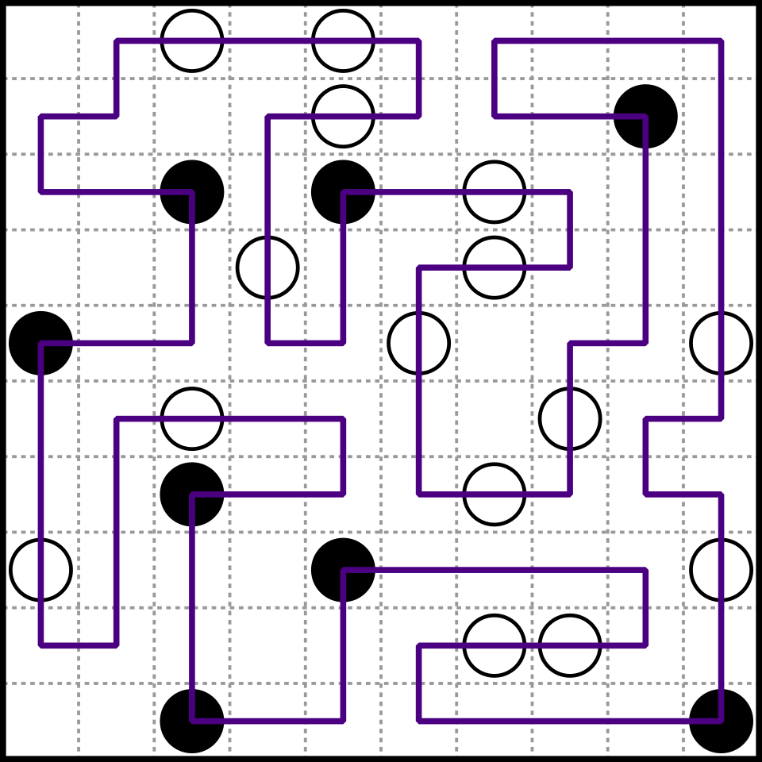

# Capítulo 75 — Proyecto: rompecabezas con simetrías

Un rompecabezas tiene **simetrías** cuando existen transformaciones que
llevan una solución a otra solución y no cambian lo que se mide. Una
búsqueda que no las conoce encuentra la misma solución muchas veces, o
recorre muchas veces el mismo caso con otro nombre. Este capítulo
construye dos programas sobre dos rompecabezas de esa clase y, en cada
uno, mide lo que cuesta ignorar las simetrías y lo que se gana al
quitarlas.

El primero es un rompecabezas de lazo: un tablero con casillas marcadas
con círculos y numerales, y un lazo cerrado que debe pasar por todas las
marcas con tramos rectos o con un giro, según la clase de las marcas que
une. La salida siguiente es la de `dibujar(csenki1)`, de la versión 4:
el único lazo del tablero de 6 × 6 que se resuelve en las primeras
secciones.

```text
┌─────O ┌─#
│     │ │ │
# #───┘ │ │
│ │     │ │
│ └─────O │
│         │
# O───────┘
│ │
│ └─────#─┐
│         │
└─────────O
```

El segundo es *Enigma 1225*, un problema publicado en la revista *New
Scientist* en 2003: llenar un tablero de N × N con enteros de manera que
cada fila sea igual a alguna columna de otro número, y obtener la mayor
suma posible. Para N = 8 hay 14 833 maneras de relacionar las filas con
las columnas; las simetrías del problema las reducen a 7 casos.

El proyecto parte de *Applications of Prolog*, de Attila Csenki: del
capítulo «Enigma 1225: Rows are Columns», el método de las matrices de
variables libres y la reducción por tipos de permutación; del apartado
«Application: A Loop Puzzle», el rompecabezas del lazo, sus dos tableros
y la observación de que la búsqueda encuentra cada lazo dos veces. La
lista completa, con lo que se toma de cada fuente, está en
[Referencias](#referencias). El código es propio.

El programa carga, sin copiarla, la búsqueda limitada del
[capítulo 40](../capitulo-40-busqueda-y-planificacion/index.md), dibuja
con el modelo de pantalla del
[capítulo 36](../capitulo-36-interfaces-de-usuario/index.md), trata
las variables libres como datos, como el
[capítulo 32](../capitulo-32-inspeccion-de-terminos/index.md), y tabula
con el [capítulo 39](../capitulo-39-tabulacion/index.md). Todas las
versiones son `% solo-local`, salvo la primera y la sexta, que corren en
SWISH.

## Objetivos del capítulo

Al terminar el capítulo, el lector puede:

- plantear un rompecabezas de recorrido como una búsqueda cuyos pasos son
  tramos entre marcas, y resolverlo con la búsqueda limitada del
  [capítulo 40](../capitulo-40-busqueda-y-planificacion/index.md);
- reconocer las simetrías de una representación (la marca de partida y
  el sentido de un lazo) y las del problema (los giros y espejos del
  tablero, la conjugación de permutaciones);
- definir una forma canónica, un representante único de cada clase de
  objetos equivalentes, y usarla para contar soluciones distintas o para
  no resolver dos veces el mismo caso;
- elegir entre filtrar los duplicados al final, registrar las formas ya
  vistas y generar solamente los representantes, midiendo el costo de
  cada opción;
- construir por unificación la matriz de variables libres más general
  que cumple un patrón, y evaluarla contando las apariciones de cada
  variable.

!!! info "Tiempo estimado"
    Leer el capítulo, ejecutar sus ejemplos y hacer las actividades: **2:05 h**.
    Resolver los 5 ejercicios marcados con ★: **1:35 h**.
    Resolver los 11 ejercicios del final: **3:15 h**.

## 75.1 El programa terminado

| Versión | Archivo | Agrega | Lo que no puede hacer todavía |
|---|---|---|---|
| 1 | `tramos.pl` | los tableros, las marcas y los tramos entre marcas | armar un lazo |
| 2 | `lazo.pl` | el lazo como búsqueda limitada del [capítulo 40](../capitulo-40-busqueda-y-planificacion/index.md) | distinguir dos escrituras del mismo lazo |
| 3 | `unico.pl` | la semilla fija, el sentido fijo y la forma canónica de un lazo | mostrar el lazo |
| 4 | `vista.pl` | el dibujo y la cobertura del tablero | aprovechar que dos tableros son equivalentes |
| 5 | `tablero.pl` | las ocho simetrías del tablero y una tabla sobre su forma canónica | — |
| 6 | `enigma.pl` | Enigma 1225 por generación y prueba | evitar casos equivalentes |
| 7 | `tipos.pl` | la forma canónica de una permutación y el registro de las vistas | evitar generarlas todas |
| 8 | `representantes.pl` | un solo representante por clase, generado directamente | — |

Las versiones 1 a 5 resuelven el rompecabezas del lazo y las 6 a 8,
Enigma 1225. Cada versión carga la anterior con `ensure_loaded/1`.

## 75.2 Versión 1: el tablero y los tramos

El rompecabezas del lazo se juega sobre un tablero rectangular con
algunas casillas marcadas, unas con un círculo (`O`) y otras con un
numeral (`#`). Se busca un **lazo**: un camino cerrado que pasa de una
casilla a una vecina en horizontal o en vertical, nunca en diagonal, no
se cruza consigo mismo y pasa exactamente una vez por cada marca. Puede
dejar casillas sin visitar. Entre dos marcas consecutivas del lazo, la
cuerda forma un **tramo**: si las dos marcas son de la misma clase, el
tramo es recto; si son de clases distintas, dobla una sola vez en ángulo
recto.

Csenki toma el rompecabezas de una revista húngara de pasatiempos. Es
parecido al Masyu japonés, cuyas perlas imponen otras reglas sobre el
camino:



Un Masyu resuelto: el lazo pasa por todas las perlas, sigue recto en las
blancas y gira en las negras. El rompecabezas de este capítulo usa la
misma clase de tablero, pero sus reglas se refieren a los tramos entre
marcas y no a lo que pasa en cada marca. Imagen: Adam R. Wood
(versión SVG de Life of Riley),
[CC BY-SA 3.0](https://creativecommons.org/licenses/by-sa/3.0/), vía
[Wikimedia Commons](https://commons.wikimedia.org/wiki/File:Masyu_puzzle_solution.svg).

Una posición es un par `Fila-Columna`, con `1-1` arriba a la izquierda, y
un tablero es un hecho `problema/4` con su nombre, sus dimensiones y sus
marcas. Cada marca es `circulo(Pos)` o `numeral(Pos)`: una representación
limpia en el sentido del
[capítulo 32](../capitulo-32-inspeccion-de-terminos/index.md#326-representaciones-limpias),
en la que la clase se lee en el functor. Dos tableros pequeños sirven de
ejemplo a lo largo del capítulo:

<!-- ejemplo: capitulo-75/tramos.pl fragmento: problema(chico, 3, 3, [circulo(1-1), circulo(1-3), numeral(3-2)]). .. problema(cruz, 3, 3, [circulo(1-2), numeral(2-3), circulo(3-2), numeral(2-1)]). -->
```prolog
problema(chico, 3, 3, [circulo(1-1), circulo(1-3), numeral(3-2)]).
problema(cruz, 3, 3, [circulo(1-2), numeral(2-3), circulo(3-2), numeral(2-1)]).
```

El archivo tiene además los dos tableros de Csenki: `csenki1`, de 6 × 6
con nueve marcas, y `csenki2`, de 9 × 8 con quince. `marca/3` lee las
marcas de un tablero y `clase/3` separa la clase de la posición:

<!-- ejemplo: capitulo-75/tramos.pl predicado: marca/3 clase/3 -->
```prolog
%!  marca(+Nombre, ?Pos, ?Clase) is nondet.
%
%   En el tablero Nombre hay una marca de Clase, circulo o numeral, en Pos.
marca(Nombre, Pos, Clase) :-
    problema(Nombre, _, _, Marcas),
    member(Marca, Marcas),
    clase(Marca, Clase, Pos).

% clase(Marca, Clase, Pos): Marca es una marca de Clase en Pos.
clase(circulo(Pos), circulo, Pos).
clase(numeral(Pos), numeral, Pos).
```

```prolog
?- marca(chico, P, Clase).
P = 1-1,
Clase = circulo ;
P = 1-3,
Clase = circulo ;
P = 3-2,
Clase = numeral.
```

Un tramo es la lista de las casillas que recorre la cuerda después de la
marca de salida, con la de llegada incluida. Así, el lazo completo es la
marca de partida seguida de sus tramos uno tras otro, sin casillas
repetidas en las uniones. `linea/3` da el tramo recto entre dos casillas
de una misma fila o columna, y `con_giro/3` los dos tramos con un giro:
por la fila de la salida hasta la columna de la llegada, o por la columna
de la salida hasta la fila de la llegada.

<!-- ejemplo: capitulo-75/tramos.pl predicado: linea/3 pasos/3 con_giro/3 -->
```prolog
%!  linea(+P, +Q, -Celdas:list) is semidet.
%
%   Celdas son las casillas que van de P, excluida, a Q, incluida, por la
%   fila o la columna que comparten. Falla si P y Q no comparten fila ni
%   columna, o si son la misma casilla.
linea(F1-C1, F2-C2, Celdas) :-
    (   F1 =:= F2
    ->  C1 =\= C2,
        pasos(C1, C2, Cs),
        findall(F1-C, member(C, Cs), Celdas)
    ;   C1 =:= C2,
        pasos(F1, F2, Fs),
        findall(F-C1, member(F, Fs), Celdas)
    ).

%!  pasos(+A:integer, +B:integer, -Ns:list(integer)) is det.
%
%   Ns son los enteros que van de A, excluido, a B, incluido, en ese
%   orden; A y B son distintos.
pasos(A, B, Ns) :-
    (   A < B
    ->  A1 is A + 1,
        numlist(A1, B, Ns)
    ;   B1 is A - 1,
        numlist(B, B1, Ns0),
        reverse(Ns0, Ns)
    ).

%!  con_giro(+P, +Q, -Celdas:list) is nondet.
%
%   Celdas va de P a Q con un solo giro en ángulo recto: primero por la
%   fila de P hasta la columna de Q, o primero por la columna de P hasta
%   la fila de Q. P y Q no comparten fila ni columna.
con_giro(F1-C1, F2-C2, Celdas) :-
    F1 =\= F2,
    C1 =\= C2,
    member(Esquina, [F1-C2, F2-C1]),
    linea(F1-C1, Esquina, Antes),
    linea(Esquina, F2-C2, Despues),
    append(Antes, Despues, Celdas).
```

```prolog
?- linea(3-5, 3-2, Celdas).
Celdas = [3-4, 3-3, 3-2].

?- con_giro(1-1, 3-2, Celdas).
Celdas = [1-2, 2-2, 3-2] ;
Celdas = [2-1, 3-1, 3-2].
```

`tramo/4` junta las reglas: elige la forma según las clases y descarta
el tramo que pasa por otra marca antes de llegar. La condición de
`sin_marcas_intermedias/2` está dentro de una negación, de modo que las
alternativas de `append/3` que la recorren no quedan pendientes:

<!-- ejemplo: capitulo-75/tramos.pl predicado: tramo/4 sin_marcas_intermedias/2 -->
```prolog
%!  tramo(+Nombre, +P, ?Q, -Celdas:list) is nondet.
%
%   Celdas es un tramo del tablero Nombre que sale de la marca en P y
%   llega a la marca en Q, distinta de P, sin pasar por otras marcas:
%   recto si las dos marcas son de la misma clase, con un giro si no.
tramo(Nombre, P, Q, Celdas) :-
    marca(Nombre, P, ClaseP),
    marca(Nombre, Q, ClaseQ),
    Q \== P,
    (   ClaseP == ClaseQ
    ->  linea(P, Q, Celdas)
    ;   con_giro(P, Q, Celdas)
    ),
    sin_marcas_intermedias(Nombre, Celdas).

%!  sin_marcas_intermedias(+Nombre, +Celdas:list) is semidet.
%
%   Ninguna casilla de Celdas salvo la última tiene una marca del tablero
%   Nombre.
sin_marcas_intermedias(Nombre, Celdas) :-
    \+ ( append(Intermedias, [_], Celdas),
         member(Pos, Intermedias),
         marca(Nombre, Pos, _) ).
```

```prolog
?- tramo(chico, 1-1, Q, Celdas).
Q = 1-3,
Celdas = [1-2, 1-3] ;
Q = 3-2,
Celdas = [1-2, 2-2, 3-2] ;
Q = 3-2,
Celdas = [2-1, 3-1, 3-2] ;
false.

?- tramo(csenki1, 5-5, 1-4, Celdas).
Celdas = [5-4, 4-4, 3-4, 2-4, 1-4] ;
false.
```

El numeral de `5-5` llega al círculo de `1-4` por un solo camino: el
otro giro pasaría por `3-5`, que tiene un círculo. El tablero `csenki1`
tiene 38 tramos en total; de `1-4` salen los cuatro que Csenki enumera a
mano, y de `3-5`, seis:

```prolog
?- findall(Q, tramo(csenki1, 3-5, Q, _), Qs).
Qs = [1-6, 1-6, 2-1, 2-2, 2-2, 4-1].

?- aggregate_all(count, tramo(csenki1, _, _, _), N).
N = 38.
```

## 75.3 Versión 2: el lazo como búsqueda

El lazo se arma de marca en marca. Un estado es `e(Actual, Pendientes,
Usadas)`: la cuerda llegó a la marca `Actual`, faltan las marcas de
`Pendientes` y `Usadas` son las casillas que ya ocupa. Un paso agrega un
tramo que sale de `Actual`, llega a una marca pendiente y no toca
casillas ocupadas. Cuando no quedan marcas pendientes, el único paso
posible es el tramo que vuelve a la marca de partida, la **semilla**, y
el estado al que lleva, `cerrado(Usadas)`, es la meta. Como el lazo pasa
por todas las marcas, cualquier marca sirve de semilla: alguno de los
tramos que salen de ella forma parte de cada solución.

Un lazo de M marcas tiene exactamente M tramos, así que la profundidad de
la búsqueda se conoce de antemano. La búsqueda en profundidad limitada
de la
[sección 40.4](../capitulo-40-busqueda-y-planificacion/index.md#404-profundidad-limitada-y-profundizacion-iterativa),
`con_limite/3`, termina siempre y da todas las soluciones al volver
atrás; la profundización iterativa, en cambio, no termina cuando la
semilla no lleva a ninguna. El archivo `profundizacion.pl` de aquel
capítulo no es un módulo: se carga en el módulo `limitada40`, como hizo el
[capítulo 74](../capitulo-74-proyecto-cubo-rubik/index.md) con el cubo, y
se le agregan las cláusulas del problema `lazo(Red)`:

<!-- ejemplo: capitulo-75/lazo.pl fragmento: :- multifile .. avanzar(Red, Estado, Tramo, Siguiente). -->
```prolog
:- multifile
    limitada40:inicial/2,
    limitada40:meta/2,
    limitada40:sucesor/5.

:- load_files(limitada40:'../capitulo-40/profundizacion', []).

limitada40:inicial(lazo(Red), Estado) :-
    estado_inicial(Red, Estado).
limitada40:meta(lazo(_), cerrado(_)).
limitada40:sucesor(lazo(Red), Estado, Tramo, Siguiente, 1) :-
    avanzar(Red, Estado, Tramo, Siguiente).
```

`Red` reúne lo que la búsqueda consulta en cada paso: la semilla, el
límite y, para cada marca, sus tramos de salida ya calculados. Cada tramo
lleva su **máscara**: un entero con un bit encendido por cada casilla que
ocupa. Con las casillas usadas también como máscara, verificar que un
tramo no toca casillas ocupadas es una conjunción de bits (`/\`) y
ocuparlas es una disyunción (`\/`):

<!-- ejemplo: capitulo-75/lazo.pl predicado: bit/3 mascara/3 avanzar/4 -->
```prolog
%!  bit(+Columnas:integer, +Pos, -Bit:integer) is det.
%
%   Bit es el entero con un solo bit encendido, el de la casilla Pos en un
%   tablero de Columnas columnas: las casillas se numeran por filas desde 0.
bit(Columnas, F-C, Bit) :-
    Bit is 1 << ((F - 1) * Columnas + C - 1).

%!  mascara(+Columnas:integer, +Celdas:list, -Mascara:integer) is det.
%
%   Mascara tiene encendidos los bits de las casillas de Celdas.
mascara(Columnas, Celdas, Mascara) :-
    foldl(sumar_bit(Columnas), Celdas, 0, Mascara).

%!  avanzar(+Red, +Estado, -Celdas:list, -Siguiente) is nondet.
%
%   Siguiente es el estado después de agregar el tramo Celdas, que sale de
%   la marca actual y no toca casillas ocupadas. Si faltan marcas, el tramo
%   llega a una de ellas; si no, vuelve a la semilla y Siguiente es
%   cerrado(Usadas).
avanzar(red(Semilla, BitSemilla, _, Tramos), e(Actual, Pendientes, Usadas),
        Celdas, Siguiente) :-
    get_assoc(Actual, Tramos, Salidas),
    (   Pendientes == []
    ->  member(t(Llegada, Celdas, M), Salidas),
        Llegada == Semilla,
        (M /\ \ BitSemilla) /\ Usadas =:= 0,
        Usadas1 is Usadas \/ M,
        Siguiente = cerrado(Usadas1)
    ;   member(t(Q, Celdas, M), Salidas),
        M /\ Usadas =:= 0,
        ord_selectchk(Q, Pendientes, Pendientes1),
        Usadas1 is Usadas \/ M,
        Siguiente = e(Q, Pendientes1, Usadas1)
    ).
```

```prolog
?- bit(3, 2-1, B), mascara(3, [1-1, 2-1], M).
B = 8,
M = 9.
```

`ord_selectchk/3` quita un elemento de un conjunto ordenado y falla si no
está: el tramo tiene que llegar a una marca pendiente.

La primera versión de este archivo guardaba las casillas usadas en un
conjunto ordenado de `library(ordsets)` y llamaba a `tramo/4` en cada
paso. Sobre `csenki2`, desde la marca `2-7`, costaba 1 497 millones de
inferencias; con `tramo/4` tabulado, 151 millones; con los tramos
calculados una vez y las máscaras, 14,7 millones, para los mismos
406 571 nodos. La búsqueda es la misma; cambia lo que cuesta cada paso.

`planes/3` reúne todos los planes que da `con_limite/3`, y
`lazos_desde/3` convierte cada plan en la lista de las casillas del lazo:

<!-- ejemplo: capitulo-75/lazo.pl predicado: planes/3 lazo_de_plan/3 lazos_desde/3 -->
```prolog
%!  planes(+Nombre, +Semilla, -Planes:list) is det.
%
%   Planes son todos los planes de la búsqueda limitada del capítulo 40
%   que cierran un lazo en el tablero Nombre a partir de la marca Semilla:
%   cada plan es la lista de sus tramos, uno por marca.
planes(Nombre, Semilla, Planes) :-
    red(Nombre, Semilla, Red),
    Red = red(_, _, Limite, _),
    findall(Plan, limitada40:con_limite(lazo(Red), Limite, Plan), Planes).

%!  lazo_de_plan(+Semilla, +Plan:list, -Lazo:list) is det.
%
%   Lazo es la lista de las casillas del lazo de Plan, empezando por
%   Semilla y sin repetirla al final.
lazo_de_plan(Semilla, Plan, [Semilla|Casillas]) :-
    append(Plan, Todas),
    sin_ultima(Todas, Casillas).

%!  lazos_desde(+Nombre, +Semilla, -Lazos:list) is det.
%
%   Lazos son los lazos del tablero Nombre que empiezan en la marca
%   Semilla, en el orden en que la búsqueda los halla.
lazos_desde(Nombre, Semilla, Lazos) :-
    planes(Nombre, Semilla, Planes),
    maplist(lazo_de_plan(Semilla), Planes, Lazos).
```

```prolog
?- planes(chico, 1-1, [Plan|_]).
Plan = [[1-2, 1-3], [2-3, 3-3, 3-2], [3-1, 2-1, 1-1]].
```

El tablero `chico` tiene un solo lazo, y sin embargo la búsqueda desde
`1-1` da dos planes. El segundo empieza por `[2-1, 3-1, 3-2]`: es el
mismo lazo recorrido en el otro sentido.

!!! question "Actividad"
    Antes de ejecutarlas, predecir cuántos planes dan `planes(csenki1,
    1-4, Ps)` y `planes(csenki1, 2-2, Ps)`, sabiendo que `csenki1` tiene
    un solo lazo. Comprobarlo con `length/2`.

## 75.4 Versión 3: cada lazo una sola vez

Un lazo de M marcas se puede **escribir** de 2M maneras: empezando en
cualquiera de sus marcas y recorriéndolo en cualquiera de los dos
sentidos. Son las simetrías de la representación: rotar la lista y darla
vuelta no cambian el lazo. `lazos/3`, con la semilla libre, recorre todas
las marcas y encuentra cada escritura por separado.

La **forma canónica** de un lazo es una sola de sus escrituras, elegida
por una regla: la que empieza en su menor casilla, en el orden estándar
de los términos, y sigue hacia la menor de las dos vecinas de esa
casilla. Dos escrituras representan el mismo lazo si y solo si tienen la
misma forma canónica:

<!-- ejemplo: capitulo-75/unico.pl predicado: canonica/2 -->
```prolog
%!  canonica(+Lazo:list, -Forma:list) is det.
%
%   Forma es la escritura de Lazo que empieza en su menor casilla y sigue
%   hacia la menor de las dos vecinas de esa casilla en el lazo.
canonica(Lazo, Forma) :-
    min_member(Menor, Lazo),
    once(append(Antes, [Menor|Despues], Lazo)),
    append([Menor|Despues], Antes, Rotado),
    Rotado = [Menor|Resto],
    Resto = [Segunda|_],
    last(Resto, Ultima),
    (   Segunda @< Ultima
    ->  Forma = Rotado
    ;   reverse(Resto, Invertido),
        Forma = [Menor|Invertido]
    ).
```

```prolog
?- canonica([2-1, 1-1, 1-2, 2-2], F).
F = [1-1, 1-2, 2-2, 2-1].

?- canonica([1-1, 2-1, 2-2, 1-2], F).
F = [1-1, 1-2, 2-2, 2-1].
```

Con la forma canónica hay tres maneras de no contar un lazo más de una
vez. La primera es buscar desde todas las semillas y quedarse con las
formas distintas, ordenándolas con `sort/2`: un registro de lo ya visto.
La segunda es **fijar la semilla**: buscar solo desde la primera marca
del tablero, lo que divide el trabajo por M. La tercera es **fijar el
sentido**: entre las dos escrituras desde la semilla, conservar la que
tiene la segunda casilla menor que la última.

<!-- ejemplo: capitulo-75/unico.pl predicado: en_un_sentido/1 escrituras/3 -->
```prolog
%!  en_un_sentido(+Lazo:list) is semidet.
%
%   Lazo está escrito en el sentido elegido: su segunda casilla precede a
%   la última en el orden estándar.
en_un_sentido([_, Segunda|Resto]) :-
    last(Resto, Ultima),
    Segunda @< Ultima.

%!  escrituras(+Modo, +Nombre, -Lazos:list) is det.
%
%   Lazos son las escrituras de los lazos del tablero Nombre que halla la
%   búsqueda según Modo: todas (desde cada marca), semilla (desde la
%   primera marca) o sentido (desde la primera marca y en el sentido
%   elegido).
escrituras(todas, Nombre, Lazos) :-
    findall(Ls, lazos(Nombre, _, Ls), Listas),
    append(Listas, Lazos).
escrituras(semilla, Nombre, Lazos) :-
    semilla(Nombre, S),
    lazos_desde(Nombre, S, Lazos).
escrituras(sentido, Nombre, Lazos) :-
    semilla(Nombre, S),
    lazos_desde(Nombre, S, Lazos0),
    include(en_un_sentido, Lazos0, Lazos).
```

```prolog
?- findall(M-N, ( member(M, [todas, semilla, sentido]), escrituras(M, csenki1, Ls), length(Ls, N) ), R).
R = [todas-18, semilla-2, sentido-1].

?- findall(M-N, ( member(M, [todas, semilla, sentido]), escrituras(M, cruz, Ls), length(Ls, N) ), R).
R = [todas-40, semilla-10, sentido-5].
```

`conteo/4` mide además las inferencias de cada modo. En los dos tableros
de Csenki:

| Tablero | Modo | Escrituras | Inferencias |
|---|---|---|---|
| `csenki1` | todas | 18 | 128 487 |
| `csenki1` | semilla | 2 | 13 030 |
| `csenki1` | sentido | 1 | 13 250 |
| `csenki2` | todas | 300 | 265 311 202 |
| `csenki2` | semilla | 20 | 22 986 346 |
| `csenki2` | sentido | 10 | 22 987 766 |

Fijar la semilla quita las escrituras antes de buscarlas: el trabajo
baja diez veces en `csenki1` y once en `csenki2`. Fijar el sentido, en
cambio, solo las filtra después: la búsqueda recorre los dos sentidos y
descarta uno al final, así que el costo no baja. `csenki2` tiene diez
lazos distintos (Csenki muestra dos de ellos), y cada uno aparece 30
veces cuando se busca desde todas las semillas.

Esta diferencia es la que organiza el resto del capítulo: una simetría
se puede quitar **filtrando** los resultados, **registrando** las formas
canónicas ya vistas o **generando** solo los representantes. Cuanto
antes actúa, más trabajo ahorra. El [Patrón 76](../patrones.md#76-forma-canonica-de-la-clase), en la
[sección 75.6](#756-version-5-las-simetrias-del-tablero), lo resume.

## 75.5 Versión 4: el lazo a la vista

El dibujo sigue el
[Patrón 51](../patrones.md#51-modelo-de-pantalla), «Modelo de pantalla»,
del
[capítulo 36](../capitulo-36-interfaces-de-usuario/index.md#362-pantalla-completa-en-la-terminal):
`lineas/3` es puro y da las líneas de texto, y solo `mostrar/2` las
escribe. Cada casilla ocupa un carácter: `O` y `#` para las marcas, una
esquina o un trazo para las casillas por las que pasa la cuerda y un
punto para las demás; entre dos casillas unidas por la cuerda va un trazo
horizontal o vertical. Las aristas del lazo, los pares de casillas
consecutivas, se guardan en un conjunto ordenado.

El carácter de una casilla depende de las direcciones en las que sale el
lazo. Cada dirección pesa un bit distinto, como las casillas de las
máscaras, de modo que la suma identifica el par de direcciones y
`trazo/2` se consulta por un entero:

<!-- ejemplo: capitulo-75/vista.pl predicado: caracter/4 direccion/3 peso/2 trazo/2 -->
```prolog
%!  caracter(+Nombre, +Aristas, +Pos, -Caracter) is det.
%
%   Caracter es O o # si hay una marca en Pos; si no, el trazo que forman
%   las dos aristas del lazo que tocan Pos, o un punto si no lo toca.
caracter(Nombre, Aristas, Pos, Caracter) :-
    (   marca(Nombre, Pos, Clase)
    ->  simbolo(Clase, Caracter)
    ;   aggregate_all(sum(P), ( direccion(Aristas, Pos, D), peso(D, P) ),
                      Suma),
        trazo(Suma, Caracter)
    ).

%!  direccion(+Aristas, +Pos, -D) is nondet.
%
%   El lazo sale de Pos hacia D: arriba, abajo, izquierda o derecha.
direccion(Aristas, F-C, arriba) :-
    F0 is F - 1,
    ord_memberchk((F0-C)-(F-C), Aristas).
direccion(Aristas, F-C, abajo) :-
    F1 is F + 1,
    ord_memberchk((F-C)-(F1-C), Aristas).
direccion(Aristas, F-C, izquierda) :-
    C0 is C - 1,
    ord_memberchk((F-C0)-(F-C), Aristas).
direccion(Aristas, F-C, derecha) :-
    C1 is C + 1,
    ord_memberchk((F-C)-(F-C1), Aristas).

% peso(D, P): la dirección D cuenta P en la suma que identifica un trazo;
% cada dirección es un bit distinto, así que la suma determina el par.
peso(arriba, 1).
peso(abajo, 2).
peso(izquierda, 4).
peso(derecha, 8).

% trazo(Suma, Caracter): una casilla de la que el lazo sale hacia las
% direcciones cuyos pesos suman Suma se dibuja con Caracter.
trazo(0, '·').
trazo(3, '│').
trazo(12, '─').
trazo(5, '┘').
trazo(9, '└').
trazo(6, '┐').
trazo(10, '┌').
```

<!-- ejemplo: capitulo-75/vista.pl predicado: lineas/3 mostrar/2 -->
```prolog
%!  lineas(+Nombre, +Lazo:list, -Lineas:list(string)) is det.
%
%   Lineas son las líneas de texto del tablero Nombre con el lazo Lazo
%   dibujado; con Lazo vacío, solo el tablero y sus marcas.
lineas(Nombre, Lazo, Lineas) :-
    problema(Nombre, Filas, Columnas, _),
    aristas(Lazo, Aristas),
    numlist(1, Filas, Fs),
    foldl(lineas_de_fila(Nombre, Filas, Columnas, Aristas), Fs, Lineas, []).

%!  mostrar(+Nombre, +Lazo:list) is det.
%
%   Escribe las líneas de lineas/3, una por renglón.
mostrar(Nombre, Lazo) :-
    lineas(Nombre, Lazo, Lineas),
    forall(member(Linea, Lineas), writeln(Linea)).
```

```prolog
?- distintos(chico, [L]), lineas(chico, L, Lineas).
L = [1-1, 1-2, 1-3, 2-3, 3-3, 3-2, 3-1, 2-1],
Lineas = ["O───O", "│   │", "│ · │", "│   │", "└─#─┘"].
```

`dibujar/1` escribe todos los lazos distintos de un tablero. Los cinco
de `cruz`:

```prolog
?- dibujar(cruz).
┌─O─┐
│   │
# ┌─#
│ │
└─O ·

┌─O─┐
│   │
#─┐ #
  │ │
· O─┘

┌─O─┐
│   │
# · #
│   │
└─O─┘

┌─O ·
│ │
# └─#
│   │
└─O─┘

· O─┐
  │ │
#─┘ #
│   │
└─O─┘
true.
```

Los cinco lazos de `cruz` muestran otra simetría, esta vez del tablero:
el primero y el último son imágenes uno del otro por un giro de media
vuelta, y el segundo y el cuarto también. La
[sección 75.6](#756-version-5-las-simetrias-del-tablero) trata esas
simetrías.

**La cobertura.** Csenki agrega una exigencia: que el lazo pase por
todas las casillas del tablero. La página
[La cobertura del tablero](cobertura.md) la agrega con `cubre/2` y
`cobertura/3`: en `csenki2`, de los diez lazos, uno solo la cumple.

!!! question "Actividad"
    Predecir qué dibuja `mostrar(csenki1, [])` y comprobarlo. Después,
    tomar el lazo de `chico` y dibujarlo con `mostrar/2` sobre el tablero
    `cruz`: explicar qué caracteres aparecen y por qué ninguna regla de
    `trazo/2` falla.

## 75.6 Versión 5: las simetrías del tablero

Girar o reflejar el tablero no cambia las reglas: un tramo recto sigue
siendo recto y un tramo con un giro sigue teniendo un giro. Las ocho
simetrías del rectángulo —la identidad, los giros de un cuarto, media y
tres cuartos de vuelta, los dos espejos y las dos trasposiciones— llevan
cada rompecabezas a uno equivalente, cuyos lazos son las imágenes de los
del original. Los giros de un cuarto y las trasposiciones intercambian
filas y columnas, así que un tablero de 9 × 8 pasa a ser de 8 × 9.

<!-- ejemplo: capitulo-75/tablero.pl predicado: simetria/2 dimensiones/5 simetria_de/5 -->
```prolog
% simetria(S, Inversa): S es una simetría del rectángulo e Inversa, la
% que la deshace.
simetria(identidad, identidad).
simetria(giro90, giro270).
simetria(giro180, giro180).
simetria(giro270, giro90).
simetria(espejo_filas, espejo_filas).
simetria(espejo_columnas, espejo_columnas).
simetria(traspuesta, traspuesta).
simetria(antitraspuesta, antitraspuesta).

%!  dimensiones(+S, +Filas:integer, +Columnas:integer, -Filas1:integer,
%!              -Columnas1:integer) is det.
%
%   Un tablero de Filas por Columnas, transformado por S, tiene Filas1 por
%   Columnas1 casillas: los giros de un cuarto y las trasposiciones
%   intercambian filas y columnas.
dimensiones(S, F, C, F1, C1) :-
    (   memberchk(S, [giro90, giro270, traspuesta, antitraspuesta])
    ->  F1 = C,
        C1 = F
    ;   F1 = F,
        C1 = C
    ).

%!  simetria_de(+S, +Filas:integer, +Columnas:integer, +Pos, -Pos1) is det.
%
%   Pos1 es la casilla a la que S lleva la casilla Pos de un tablero de
%   Filas por Columnas. giro90 gira un cuarto de vuelta en el sentido de
%   las agujas del reloj; espejo_filas invierte el orden de las filas.
simetria_de(identidad, _, _, F-C, F-C).
simetria_de(giro90, Fs, _, F-C, C-F1) :-
    F1 is Fs + 1 - F.
simetria_de(giro180, Fs, Cs, F-C, F1-C1) :-
    F1 is Fs + 1 - F,
    C1 is Cs + 1 - C.
simetria_de(giro270, _, Cs, F-C, C1-F) :-
    C1 is Cs + 1 - C.
simetria_de(espejo_filas, Fs, _, F-C, F1-C) :-
    F1 is Fs + 1 - F.
simetria_de(espejo_columnas, _, Cs, F-C, F-C1) :-
    C1 is Cs + 1 - C.
simetria_de(traspuesta, _, _, F-C, C-F).
simetria_de(antitraspuesta, Fs, Cs, F-C, C1-F1) :-
    F1 is Fs + 1 - F,
    C1 is Cs + 1 - C.
```

```prolog
?- simetria_de(giro90, 2, 3, 1-1, P).
P = 1-2.
```

Los tableros transformados se agregan como nombres derivados:
`sim(S, Base)` es el tablero `Base` transformado por `S`. `problema/4`
es `multifile` en `tramos.pl`, y `tablero.pl` le agrega una regla. La
regla exige que `Base` sea un átomo: sin esa condición, una consulta con
el nombre libre volvería a pedir un tablero transformado de un tablero
transformado, sin terminar.

<!-- ejemplo: capitulo-75/tablero.pl predicado: marca_imagen/5 problema/4 -->
```prolog
%!  marca_imagen(+S, +Filas:integer, +Columnas:integer, +Marca, -Marca1)
%!      is det.
%
%   Marca1 es Marca, de la misma clase, en la casilla a la que la lleva S.
marca_imagen(S, Fs, Cs, Marca, Marca1) :-
    clase(Marca, Clase, Pos),
    simetria_de(S, Fs, Cs, Pos, Pos1),
    clase(Marca1, Clase, Pos1).

%!  problema(+Nombre, -Filas:integer, -Columnas:integer, -Marcas:list)
%!      is semidet.
%
%   Agrega a los tableros de tramos.pl dos clases de nombres derivados.
%   sim(S, Base) es el tablero Base, que tiene que ser un átomo,
%   transformado por la simetría S, con las marcas ordenadas. forma(t(F,
%   C, Ms)) es el tablero de F por C con las marcas Ms.
problema(sim(S, Base), Filas, Columnas, Marcas) :-
    atom(Base),
    simetria(S, _),
    problema(Base, F0, C0, Marcas0),
    dimensiones(S, F0, C0, Filas, Columnas),
    maplist(marca_imagen(S, F0, C0), Marcas0, Marcas1),
    msort(Marcas1, Marcas).
problema(forma(t(Filas, Columnas, Marcas)), Filas, Columnas, Marcas).
```

```prolog
?- problema(sim(giro90, chico), F, C, Marcas).
F = C, C = 3,
Marcas = [circulo(1-3), circulo(3-3), numeral(2-1)].
```

**La forma canónica de un tablero** es la menor de sus ocho imágenes en
el orden estándar de los términos, con las marcas ordenadas. Dos
tableros equivalentes tienen la misma, como dos escrituras de un mismo
lazo tienen la misma forma canónica de lazo:

<!-- ejemplo: capitulo-75/tablero.pl predicado: imagen/3 forma/3 -->
```prolog
%!  imagen(+S, +Nombre, -Imagen) is det.
%
%   Imagen es t(Filas, Columnas, Marcas): el tablero Nombre transformado
%   por S, con las marcas ordenadas.
imagen(S, Nombre, t(F1, C1, Marcas)) :-
    problema(Nombre, F0, C0, Marcas0),
    dimensiones(S, F0, C0, F1, C1),
    maplist(marca_imagen(S, F0, C0), Marcas0, Marcas1),
    msort(Marcas1, Marcas).

%!  forma(+Nombre, -S, -Forma) is det.
%
%   Forma es la forma canónica del tablero Nombre y S, la primera simetría
%   que lleva el tablero a ella.
forma(Nombre, S, Forma) :-
    findall(Imagen-S0, ( simetria(S0, _), imagen(S0, Nombre, Imagen) ),
            Pares),
    keysort(Pares, [Forma-S|_]).
```

```prolog
?- forma(chico, S, Forma).
S = identidad,
Forma = t(3, 3, [circulo(1-1), circulo(1-3), numeral(3-2)]).

?- forall(simetria(S, _), ( forma(sim(S, csenki1), F), forma(csenki1, F) )).
true.
```

Con la forma canónica, resolver un tablero es resolver su forma y
transformar los lazos con la simetría inversa. `lazos_de_forma/2` está
tabulado, como en la
[sección 39.2](../capitulo-39-tabulacion/index.md#392-memorizacion-sin-estado-escrito-a-mano):
la primera consulta por una forma la resuelve y guarda la respuesta, y
las siguientes la leen de la tabla. Es la promesa del
[capítulo 74](../capitulo-74-proyecto-cubo-rubik/index.md): el mismo
estado, aquí el mismo tablero visto desde otro lado, no se explora dos
veces.

<!-- ejemplo: capitulo-75/tablero.pl predicado: lazo_imagen/5 lazos_de_forma/2 resolver/2 -->
```prolog
%!  lazo_imagen(+S, +Filas:integer, +Columnas:integer, +Lazo:list,
%!              -Forma:list) is det.
%
%   Forma es la forma canónica de la imagen por S de Lazo, un lazo de un
%   tablero de Filas por Columnas.
lazo_imagen(S, Fs, Cs, Lazo, Forma) :-
    maplist(simetria_de(S, Fs, Cs), Lazo, Lazo1),
    canonica(Lazo1, Forma).

%!  lazos_de_forma(+Forma, -Lazos:list) is det.
%
%   Lazos son las formas canónicas, sin repetir, de los lazos del tablero
%   Forma. El predicado está tabulado: cada forma se resuelve una sola vez.
lazos_de_forma(Forma, Lazos) :-
    distintos(forma(Forma), Lazos).

%!  resolver(+Nombre, -Lazos:list) is det.
%
%   Lazos son las formas canónicas, sin repetir y ordenadas, de los lazos
%   del tablero Nombre, obtenidas de los de su forma canónica.
resolver(Nombre, Lazos) :-
    forma(Nombre, S, Forma),
    lazos_de_forma(Forma, LazosForma),
    simetria(S, Inversa),
    Forma = t(Fs, Cs, _),
    maplist(lazo_imagen(Inversa, Fs, Cs), LazosForma, Lazos0),
    sort(Lazos0, Lazos).
```

```prolog
?- forall(simetria(S, _), resolver(sim(S, csenki1), [_])).
true.
```

Resolver por separado los ocho tableros equivalentes a `csenki1` cuesta
208 592 inferencias; con `resolver/2`, 23 611: una búsqueda y siete
transformaciones. Las pruebas de `tablero.plt` verifican, para cada
simetría, que `resolver/2` da los mismos lazos que la búsqueda directa
sobre el tablero transformado.

!!! example "Patrón 76 — Forma canónica de la clase"
    **Problema.** Un problema tiene simetrías: transformaciones que llevan
    un objeto a otro equivalente, con las mismas soluciones o la misma
    medida, como las escrituras de un lazo, los ocho tableros que se
    obtienen girando o reflejando uno, o los desarreglos conjugados de
    Enigma 1225. Una búsqueda que no las conoce resuelve muchas veces el
    mismo caso con otro nombre.

    **Versión ingenua.** Resolver cada objeto por separado y, si hace
    falta, quitar los duplicados al final con `sort/2`. Los ocho tableros
    equivalentes a `csenki1` cuestan así 208 592 inferencias, y buscar
    los lazos de `csenki2` desde todas las semillas, 265 millones, para
    descartar después 290 de las 300 escrituras.

    **Patrón.** Definir una **forma canónica**: una función que elige un
    representante único de cada clase, de modo que dos objetos son
    equivalentes si y solo si tienen la misma forma canónica, como
    `canonica/2` para los lazos, `forma/3` para los tableros y `tipo/2`
    para las permutaciones. Después, usarla tan temprano como se pueda:
    como clave de un registro de lo ya visto o de una tabla, que resuelve
    cada clase una sola vez (`resolver/2`, 23 611 inferencias para los
    mismos ocho tableros), o, mejor, para generar solo los
    representantes, como la semilla fija o las particiones de la versión
    8. Si el resultado se pide para un objeto que no es el representante,
    se resuelve el representante y se transforma la respuesta con la
    simetría inversa.

    **Cuándo no usarlo.** Cuando calcular la forma canónica cuesta más que
    resolver el caso, o cuando las clases son casi todas de un solo
    elemento: la forma se paga para cada objeto y no ahorra nada. Cuando
    la transformación no conserva lo que se busca, por ejemplo si el
    tablero tuviera una casilla de partida fija, que un giro movería. Y
    filtrar al final no es una aplicación del patrón: fijar el sentido de
    un lazo después de buscarlo, en la
    [sección 75.4](#754-version-3-cada-lazo-una-sola-vez), quita las
    respuestas repetidas pero no el trabajo.

Un tablero puede ser igual a alguna de sus imágenes. `cruz` lo es para
cuatro de las ocho simetrías, y por eso sus lazos vienen en pares:

```prolog
?- findall(S, ( simetria(S, _), imagen(S, cruz, I), imagen(identidad, cruz, I) ), Ss).
Ss = [identidad, giro180, espejo_filas, espejo_columnas].
```

!!! question "Actividad"
    Predecir qué devuelve `forma(cruz, S, F)` y si `S` es `identidad`.
    Comprobarlo, y explicar por qué la respuesta es una sola aunque
    cuatro simetrías lleven `cruz` a su forma canónica.

## 75.7 Versiones 6 a 8: Enigma 1225

*Enigma 1225* pide llenar un tablero de N × N con enteros positivos de
modo que las filas sean distintas, que cada fila sea igual a alguna
columna de otro número y que, si el mayor número escrito es K, aparezcan
todos los de 1 a K; se busca la mayor suma. La correspondencia de filas
a columnas es una permutación sin puntos fijos, un **desarreglo**, y para
cada uno se construye por unificación la matriz de variables libres más
general que cumple la condición, como en la
[sección 32.5](../capitulo-32-inspeccion-de-terminos/index.md#325-variables-como-datos),
que trata las variables libres como datos.

La página [Enigma 1225](enigma.md) desarrolla las tres versiones, que
recorren la misma escalera que las del lazo, la del [Patrón 76](../patrones.md#76-forma-canonica-de-la-clase):

| Versión | Archivo | Qué hace con las simetrías | N = 8 | Inferencias |
|---|---|---|---|---|
| 6 | `enigma.pl` | nada: evalúa los 14 833 desarreglos | 544 | 22 092 942 |
| 7 | `tipos.pl` | registra las formas canónicas (los tipos de permutación) ya vistas y evalúa una por clase | 544 | 2 001 196 |
| 8 | `representantes.pl` | genera solo un representante por clase, a partir de las particiones de N | 544 | 12 278 |

Dos desarreglos conjugados, es decir, con la misma estructura de ciclos,
dan el mismo tablero con las filas y las columnas en otro orden: los
14 833 desarreglos de 8 elementos son solo 7 casos. La versión 8
resuelve el tablero de 14 × 14 (máximo 4 900) en tres centésimas de
segundo y el de 20 × 20 (máximo 20 200) en menos de medio segundo.

!!! success "Criterios de calidad"
    | Criterio | En este capítulo |
    |---|---|
    | C1 | cada regla declara modos y determinación; `tramo/4` y `lazos/3` son `nondet` y los que reúnen sus respuestas, como `lazos_desde/3` y `distintos/2`, `det` |
    | C2 | representaciones limpias: una marca es `circulo(Pos)` o `numeral(Pos)`, un estado de la búsqueda es `e/3` o `cerrado/1`, una simetría es un átomo y un tablero derivado es `sim/2` o `forma/1` |
    | C4 | `linea/3` decide la dirección con una condición, `pares/3` y `sin_ultima/3` recorren la lista por su primer argumento y `trazo/2` se consulta por un entero, de modo que las pruebas no encuentran alternativas pendientes |
    | C6 | `lineas/3` es puro; solo `mostrar/2` y `dibujar/1` escriben |
    | C7 | 119 pruebas en ocho archivos; las de `tablero.plt` comparan, para las ocho simetrías, la búsqueda directa con la búsqueda sobre la forma canónica |

## Ejercicios

Las soluciones están en [la página de soluciones](soluciones.md). La dificultad
va de 1 (se resuelve consultando el capítulo) a 3 (requiere elaboración propia).
Los marcados con ★ son los que no conviene saltear: cubren lo que el capítulo
tiene de propio. Los ejercicios que piden código se resuelven en archivos
que cargan los del capítulo, sin modificarlos.

1. ★ **(1)** Predecir cuántas escrituras dan `escrituras(todas, chico,
   Ls)`, `escrituras(semilla, chico, Ls)` y `escrituras(sentido, chico,
   Ls)`, y comprobarlo. Explicar la relación entre los tres números y la
   cantidad de marcas.
2. ★ **(2)** El costo de la búsqueda depende de la semilla. Medir las
   inferencias de `lazos_desde/3` en `csenki1` y en `csenki2` desde cada
   marca, y comparar con la cantidad de tramos que salen de cada una.
   ¿Conviene elegir como semilla la marca con menos tramos?
3. ★ **(2)** Escribir `simetrias_propias(Nombre, Ss)`, las simetrías que
   dejan el tablero igual, y `orbitas(Nombre, Os)`, que agrupa los lazos
   distintos del tablero en clases: dos lazos están en la misma clase si
   una simetría propia lleva uno al otro. Aplicarlo a `cruz`.
4. **(2)** Escribir `leer_tablero(Lineas, Filas, Columnas, Marcas)`, la
   lectura inversa de `lineas(Nombre, [], Lineas)`: a partir de las
   líneas del dibujo de un tablero sin lazo, da sus dimensiones y sus
   marcas. Comprobar que lee de vuelta los tableros del capítulo.
5. **(3)** La variante del «lazo recto» de Csenki: una sola clase de
   marca, el lazo pasa por todas las casillas del tablero y atraviesa
   cada marca en línea recta, sin girar en ella. Escribir un resolvedor
   que avance casilla por casilla y resolver el tablero de 6 × 6 con
   marcas en `2-2`, `2-4`, `3-1`, `3-4`, `4-3`, `5-3`, `5-5` y `6-4`.
6. **(1)** Explicar con `matriz_patron/2` por qué no hay ningún tablero
   para N = 2.
7. **(1)** Escribir `cantidad_desarreglos(N, D)` con la recurrencia
   D(N) = (N − 1)(D(N − 1) + D(N − 2)), D(1) = 0, D(2) = 1, y verificarla
   contra `desarreglos/2` hasta N = 8.
8. **(2)** Contar las particiones de 8 en partes cualesquiera, incluidas
   las de 1, y explicar por qué los tipos con un 1 no pueden dar un
   tablero.
9. ★ **(2)** Verificar el argumento de la conjugación para N = 6: para
   cada desarreglo P cuyo patrón tiene filas distintas, el total de P es
   el total del representante de su tipo.
10. ★ **(3)** Calcular con `maximo_representantes/3` los máximos para N
    par de 4 a 20, conjeturar un polinomio en N que los da y verificarlo.
    ¿Qué tipo alcanza el máximo en esos casos?
11. **(2)** Escribir `mostrar_matriz(M)`, que escribe una matriz de
    enteros con las columnas alineadas a la derecha, como pide Csenki en
    su primer capítulo. Separar la parte pura, que arma las líneas, de la
    que escribe.

## Resumen

| | |
|---|---|
| **tramo** | la parte del lazo entre dos marcas consecutivas: recta entre marcas de la misma clase, con un giro entre marcas de clases distintas |
| **semilla** | la marca donde empieza la búsqueda del lazo; fijarla divide el trabajo por la cantidad de marcas |
| **máscara** | un entero con un bit por casilla; la intersección y la unión de conjuntos de casillas son operaciones de bits |
| **forma canónica** | un representante único de cada clase de objetos equivalentes: la menor escritura de un lazo, la menor imagen de un tablero, el tipo de una permutación |
| **[Patrón 76](../patrones.md#76-forma-canonica-de-la-clase)** | forma canónica de la clase |
| **filtrar, registrar, generar** | las tres maneras de quitar una simetría: descartar los duplicados al final, recordar las formas ya vistas, o producir solo los representantes |
| **matriz más general** | la matriz de variables libres que cumple un patrón; cualquier otra se obtiene ligando sus variables |
| **conjugación** | renombrar los números de una permutación; las conjugadas tienen el mismo tipo y dan el mismo total |
| `problema/4`, `marca/3`, `tramo/4`, `linea/3`, `con_giro/3` | el tablero y los tramos |
| `red/3`, `avanzar/4`, `planes/3`, `lazos/3`, `lazos_desde/3` | el lazo como búsqueda |
| `canonica/2`, `en_un_sentido/1`, `escrituras/3`, `conteo/4`, `distintos/2` | cada lazo una sola vez |
| `lineas/3`, `cubre/2`, `cobertura/3` | el dibujo y la cobertura |
| `simetria_de/5`, `imagen/3`, `forma/3`, `resolver/2` | las simetrías del tablero |
| `desarreglo/2`, `matriz_patron/2`, `filas_distintas/1`, `evaluar/2`, `maximo/3` | Enigma 1225 por generación y prueba |
| `conjugada/3`, `maximo_por_tipo/3` | una evaluación por tipo |
| `particion/2`, `representante/2`, `maximo_representantes/3` | los representantes generados |
| `ord_selectchk/3` | quita un elemento de un conjunto ordenado; falla si no está |

## Temas que se retoman

| Tema | Se retoma en |
|---|---|
| Las simetrías del tablero en el registro de visitados de una búsqueda: el rompecabezas del triángulo de clavijas | [capítulo 81](../capitulo-81-proyecto-coleccion-problemas/index.md) |

## Referencias

- Attila Csenki, *Applications of Prolog*, Ventus Publishing (Bookboon),
  2009 — capítulo «Enigma 1225: Rows are Columns» (apartados «A Puzzle»,
  «Symbolic Solutions», «Implementation Details» y «Enhanced
  Implementation») y apartado «Application: A Loop Puzzle» del capítulo
  «Blind Search». Sin edición en línea de acceso libre verificada. El
  capítulo toma del primero el enunciado, el método de la matriz de
  variables libres más general construida por unificación, la prueba de
  filas distintas con `==/2`, la evaluación por frecuencias, la
  reducción por tipos de permutación con un representante por tipo, y
  las cifras que sirven de control (14 833 desarreglos, 13 713 tableros,
  los seis totales, 544 y 4 900). Del segundo, las reglas del
  rompecabezas, los tramos entre marcas como pasos de la búsqueda, la
  semilla fija, la observación de que cada lazo aparece dos veces, el
  dibujo del tablero en texto, la exigencia de cobertura y los datos de
  sus tableros; la variante del lazo recto del ejercicio 5 también es
  suya.
- Keith Austin, «Enigma 1225: Rows are columns», *New Scientist*, 8 de
  febrero de 2003, p. 55. Sin edición en línea de acceso libre
  verificada. Es el enunciado original, que el capítulo conoce a través
  de Csenki y reformula.
- Attila Csenki, «Enigma 1225: Prolog-assisted solution of a puzzle
  using discrete mathematics», *Computers and Mathematics with
  Applications* 52 (2006) 383–400. Sin edición en línea de acceso libre
  verificada. Es el artículo del que Csenki adapta su capítulo.
- Hadrien Cambazard, Barry O'Sullivan y Barbara M. Smith, «A
  constraint-based approach to Enigma 1225», *Computers and Mathematics
  with Applications* 58 (2009) 1487–1497,
  [doi:10.1016/j.camwa.2008.11.019](https://doi.org/10.1016/j.camwa.2008.11.019)
  (página de la editorial; el texto completo no es de acceso libre).
  Csenki lo cita como desarrollo posterior: resuelve el mismo problema
  con programación con restricciones y elimina las simetrías agregando
  restricciones al modelo, una cuarta manera de quitarlas que este
  capítulo no desarrolla.
- Norman L. Biggs, *Discrete Mathematics*, Clarendon Press, 1989. Sin
  edición en línea de acceso libre verificada. Csenki toma de allí los
  desarreglos, los tipos de permutación y el orden de las particiones.
- EPS Trade Kft., «Fekete–Fehér» y «Egyenes karika», *Logikoktél*,
  número 2001/3. Sin edición en línea. Son los rompecabezas de los que
  Csenki toma el lazo y la variante del lazo recto.

El código del capítulo es propio, escrito para el curso: la búsqueda
sobre los tramos con máscaras de bits, las formas canónicas del lazo y
del tablero, las ocho simetrías con la tabla sobre la forma canónica, el
registro de tipos vistos, el generador de particiones y las mediciones no
provienen de esas fuentes.
