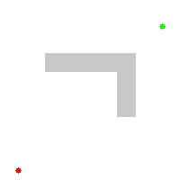

# Capítulo 76 — Proyecto: robots, laberintos y el caballo

El [capítulo 40](../capitulo-40-busqueda-y-planificacion/index.md) escribió
una sola búsqueda en la que la frontera decide la estrategia, le agregó un
registro de los estados visitados y la llevó hasta A\* e IDA\* sobre el
rompecabezas de 8. Este proyecto aplica esas mismas búsquedas, sin
copiarlas, a tres problemas de caminos en grillas: un robot que cruza un
plano con obstáculos, un laberinto de paredes con compuertas y un caballo
de ajedrez que va de una casilla a otra. El robot llega, por ejemplo, de
la celda (1, 4) a la (20, 6) del plano de un taller por el camino más
corto que menos gira:

```text
....................
..####......####....
..####...***####....
**********#*........
######....#*...#####
..........#*********
...####...#..####...
...####......####...
....................
....................
```

El mismo problema, visto mientras se resuelve: A\* busca en una grilla el
camino entre dos puntos separados por un obstáculo, y expande primero las
celdas que la heurística pone más cerca de la llegada.



Animación de A\* sobre una grilla: los círculos rellenos son los nodos
expandidos, los de borde azul los que esperan en la frontera, y la figura
gris el obstáculo; la heurística es la distancia en línea recta.
Imagen: Subh83, [CC BY 3.0](https://creativecommons.org/licenses/by/3.0/),
vía [Wikimedia Commons](https://commons.wikimedia.org/wiki/File:Astar_progress_animation.gif).

Los tres problemas parecen fáciles y lo son, mientras la búsqueda recuerde
qué celdas ya visitó. Sin ese registro, una grilla tiene tantos caminos del
mismo largo entre dos celdas que la búsqueda vuelve a expandir cada celda
una vez por camino, y basta una pared que engañe a la heurística para que
una búsqueda de doce pasos expanda diez mil nodos. El capítulo mide ese
crecimiento, prueba el remedio que propone Csenki —contar los giros en el
costo— y el que propone el
[capítulo 40](../capitulo-40-busqueda-y-planificacion/index.md)
—recordar los visitados—, compara
heurísticas en el laberinto y en el tablero, incluida una que estima de
más, y termina con un problema distinto sobre el mismo tablero: el
recorrido del caballo, que visita cada casilla una sola vez y donde la
heurística no estima ninguna distancia, sino que ordena las alternativas.

Los tres problemas son los proyectos «Robot Navigation», «The Shortest
Route in a Maze» y «Moving a Knight» del capítulo «Informed Search» de
Attila Csenki, *Applications of Prolog*; de allí vienen el costo con
giros, el laberinto de la figura 3.10 y las heurísticas del caballo,
incluida la que no es admisible. El recorrido del caballo y la regla de
Warnsdorff no están en Csenki. La lista completa de fuentes, con lo que se
toma de cada una, está en [Referencias](#referencias). El código es propio.

Cada versión es un módulo de `ejemplos/capitulo-76/`, con sus pruebas, y
todos son `% solo-local`, porque cargan los archivos del
[capítulo 40](../capitulo-40-busqueda-y-planificacion/index.md).

## Objetivos del capítulo

Al terminar el capítulo, el lector puede:

- reutilizar una búsqueda escrita para otro problema cargándola en un
  módulo y pasándole problemas de otros módulos, sin modificarla;
- convertir al cargar un dibujo en hechos que la búsqueda consulta;
- medir con los nodos expandidos qué aporta una heurística y qué aporta el
  registro de los estados visitados;
- explicar por qué en una grilla la búsqueda sin registro de visitados y
  IDA\* crecen exponencialmente, y qué cambia al contar los giros;
- comparar heurísticas admisibles por lo que ahorran y por lo que cuestan,
  redondear hacia arriba una heurística cuando los costos son enteros, y
  reconocer el efecto de una heurística que estima de más;
- usar una heurística para ordenar las alternativas de una búsqueda en
  profundidad, como en el recorrido del caballo.

!!! info "Tiempo estimado"
    Leer el capítulo, ejecutar sus ejemplos y hacer las actividades: **1:55 h**.
    Resolver los 5 ejercicios marcados con ★: **1:20 h**.
    Resolver los 12 ejercicios del final: **3:45 h**.

## 76.1 Las búsquedas del capítulo 40, para otros módulos

Las búsquedas del [capítulo 40](../capitulo-40-busqueda-y-planificacion/index.md) están en archivos que no son módulos:
`puzzle8.pl` tiene `buscar/5`, con el registro de visitados y las
estrategias `anchura`, `mejor(costo)`, `mejor(heuristica)` y
`mejor(a_estrella)`, e `ida_estrella/4`; `frontera.pl` tiene el bucle de la
[sección 40.2](../capitulo-40-busqueda-y-planificacion/index.md#402-una-sola-busqueda-varias-estrategias),
que no recuerda nada. Las dos llaman a `inicial/2`, `meta/2`, `sucesor/5` y
`heuristica/3` con el problema como primer argumento, y cada problema es un
término con su propio functor. El archivo `capitulo40.pl` carga los dos
dentro de módulos, como hicieron los capítulos
[71](../capitulo-71-proyecto-grafos-o/index.md) y
[74](../capitulo-74-proyecto-cubo-rubik/index.md), y en lugar de agregar
las cláusulas de un problema agrega una sola cláusula por predicado, para
los problemas escritos `Modulo:Problema`:

<!-- ejemplo: capitulo-76/capitulo40.pl fragmento: :- module(capitulo40, .. M:heuristica(P, Estado, H). -->
```prolog
:- module(capitulo40,
          [ buscar/5,
            ida_estrella/4,
            buscar_sin_visitados/5
          ]).

:- multifile
    inicial/2,
    meta/2,
    sucesor/5,
    heuristica/3,
    frontera40:inicial/2,
    frontera40:meta/2,
    frontera40:sucesor/5,
    frontera40:prioridad/4.

:- load_files(capitulo40:'../capitulo-40/puzzle8', []).
:- load_files(frontera40:'../capitulo-40/frontera', []).

%!  inicial(+Problema, -Estado) is det.
%
%   Para Modulo:P, Estado es el estado inicial que Modulo da a P.
inicial(M:P, Estado) :-
    M:inicial(P, Estado).

%!  meta(+Problema, +Estado) is semidet.
%
%   Para Modulo:P, Estado es un estado meta de P según Modulo.
meta(M:P, Estado) :-
    M:meta(P, Estado).

%!  sucesor(+Problema, +Estado, -Accion, -Siguiente, -Costo) is nondet.
%
%   Para Modulo:P, Accion lleva de Estado a Siguiente con Costo según Modulo.
sucesor(M:P, Estado, Accion, Siguiente, Costo) :-
    M:sucesor(P, Estado, Accion, Siguiente, Costo).

%!  heuristica(+Problema, +Estado, -H:number) is det.
%
%   Para Modulo:P, H es lo que Modulo estima que falta desde Estado.
heuristica(M:P, Estado, H) :-
    M:heuristica(P, Estado, H).
```

Con eso, cada problema del capítulo vive en su módulo, con sus propios
`inicial/2`, `meta/2`, `sucesor/5` y `heuristica/3`, y se resuelve
escribiendo, por ejemplo, `buscar(mejor(a_estrella), robot:ruta(…), …)`.
Es el [Patrón 77](../patrones.md#77-problema-de-otro-modulo), que se enuncia más abajo. Al bucle de
`frontera.pl` le falta la prioridad de A\*; el puente la agrega con una
cláusula de `frontera40:prioridad/4`, y `buscar_sin_visitados/5` lo usa en
la [sección 76.4](#764-version-3-lo-que-cuesta-no-recordar).

```prolog
?- buscar(mejor(a_estrella), capitulo40:puzzle([2, 4, 3, 7, 1, 5, 0, 8, 6], manhattan), P, C, K).
P = [arriba, derecha, arriba, izquierda, abajo, derecha, derecha, abajo],
C = 8,
K = 10.
```

El rompecabezas de 8 del [capítulo 40](../capitulo-40-busqueda-y-planificacion/index.md) sigue resolviéndose igual cuando se
lo nombra como `capitulo40:puzzle(…)`: la cláusula nueva pasa la llamada al
mismo módulo, donde están las del rompecabezas.

!!! example "Patrón 77 — Problema de otro módulo"
    **Problema.** Una búsqueda escrita como archivo sin módulo llama a
    `inicial/2`, `meta/2`, `sucesor/5` y `heuristica/3` con el problema
    como primer argumento, y se quiere usarla, sin modificarla, para varios
    problemas nuevos, cada uno con sus propios predicados auxiliares.

    **Versión ingenua.** Cargar la búsqueda en un módulo y agregarle, por
    `multifile`, las cláusulas de cada problema, como hicieron los
    capítulos [71](../capitulo-71-proyecto-grafos-o/index.md) y
    [74](../capitulo-74-proyecto-cubo-rubik/index.md). Con un problema
    funciona; con los cinco de este capítulo, todas sus cláusulas y sus
    auxiliares —`vecina/4`, `costo_paso/3`, `recta/3`, `salto/4`…— viven
    en el mismo módulo, donde dos problemas no pueden tener un auxiliar
    con el mismo nombre, y el puente crece con cada problema nuevo.

    **Patrón.** El puente agrega a cada predicado de la interfaz una sola
    cláusula para los problemas escritos `Modulo:Problema`, que pasa la
    llamada a ese módulo: `inicial(M:P, E) :- M:inicial(P, E).` Cada
    problema define la interfaz en su propio módulo, con sus auxiliares
    privados, y se resuelve escribiendo `buscar(E, robot:ruta(…), …)`. El
    puente de este capítulo tiene cuatro cláusulas para `puzzle8.pl` y
    cuatro para `frontera.pl`, y no cambió al agregar el robot, los giros,
    el laberinto, el caballo y los problemas de las soluciones. Se parece
    al [Patrón 69](../patrones.md#69-descripcion-del-mundo-como-parametro),
    en el que el planificador recibe el nombre del módulo del mundo como
    argumento propio y lo usa en cada llamada; aquí el programa que busca
    no sabe nada de módulos: el módulo viaja dentro del término del
    problema, y la delegación la agrega el puente, sin tocar el código
    cargado.

    **Cuándo no usarlo.** Cuando el programa cargado ya es un módulo que
    recibe el módulo del problema como argumento, como el planificador del
    [Patrón 69](../patrones.md#69-descripcion-del-mundo-como-parametro): basta con pasárselo. Cuando hay un solo problema y no se
    espera otro: las cláusulas `multifile` directas son más simples. Y
    cuando el programa cargado inspecciona el término del problema más
    allá de pasarlo a la interfaz: una cláusula suya que unifica con
    `jarras(_, _, _)` no reconoce `m:jarras(…)`.

## 76.2 Versión 1: el plano del robot

Un plano es un dibujo: una lista de filas, cada una un átomo con un
carácter por celda, `.` para una celda libre y `#` para una ocupada. La
celda `X-Y` está en la columna X y en la fila Y, contadas desde 1 a partir
de la esquina de arriba a la izquierda. `plano.pl` tiene dos planos
dibujados, el `taller` de 20 × 10 y el `galpon` de 30 × 20, con pasillos:

<!-- ejemplo: capitulo-76/plano.pl predicado: plano/2 -->
```prolog
% plano(Nombre, Filas): el dibujo del plano Nombre, fila por fila.
plano(taller,
      [ '....................',
        '..####......####....',
        '..####......####....',
        '..........#.........',
        '######....#....#####',
        '..........#.........',
        '...####...#..####...',
        '...####......####...',
        '....................',
        '....................'
      ]).
plano(galpon,
      [ '..............................',
        '.#####.#####.#####.#####.####.',
        '.#.........#.....#.....#....#.',
        '.#.#######.#.###.#.###.#.##.#.',
        '.#.#.....#.#.#...#...#.#..#.#.',
        '.#.#.###.#.#.#.#####.#.##.#.#.',
        '.#.#.#.#.#...#.....#.#....#.#.',
        '.#.#.#.#.#####.###.#.######.#.',
        '.#...#.......#...#.#........#.',
        '.#####.#####.###.#.##########.',
        '.......#...#.....#............',
        '########.#.#######.##########.',
        '.........#.........#..........',
        '.#######.#########.#.########.',
        '.#.....#.........#.#.#......#.',
        '.#.###.#########.#.#.#.####.#.',
        '.#...#...........#...#....#.#.',
        '.###.###############.####.#.#.',
        '.....................#......#.',
        '##############################'
      ]).
```

y dos planos de 60 × 40 dados por sus rectángulos ocupados,
`plano(Nombre, Ancho, Alto, Bloques)`: el `patio`, con una pared vertical
en las columnas 30 y 31 que deja libres solo las cuatro filas de arriba, y
la `bolsa`, con tres paredes en forma de U abierta hacia la izquierda.

<!-- ejemplo: capitulo-76/plano.pl fragmento: plano(patio, 60, 40 .. plano(bolsa, 60, 40 -->
```prolog
plano(patio, 60, 40, [b(30, 5, 31, 40)]).
plano(bolsa, 60, 40, [b(20, 10, 40, 11), b(39, 10, 40, 30), b(20, 29, 40, 30)]).
```

La búsqueda pregunta miles de veces si una celda está libre. Recorrer el
dibujo en cada pregunta repetiría el mismo trabajo; Csenki genera por eso
las celdas como hechos antes de buscar, con reglas que las afirman en la
base de datos. Aquí el trabajo se hace al cargar el archivo, con
`term_expansion/2`
([sección 35.1](../capitulo-35-transformacion-de-programas-y-compilacion/index.md#351-term_expansion2-y-goal_expansion2-en-swi-prolog);
es el [Patrón 49](../patrones.md#49-expandir-al-cargar)): cada hecho
`plano/2` se convierte en el mismo hecho, un hecho `medidas/3` y un hecho
`libre(Nombre, X, Y)` por celda libre; un `plano/4` se dibuja primero y
sigue el mismo camino.

<!-- ejemplo: capitulo-76/plano.pl predicado: term_expansion/2 -->
```prolog
%!  term_expansion(+Hecho, -Clausulas:list) is semidet.
%
%   Clausulas son el hecho plano(Nombre, Filas), un hecho
%   medidas(Nombre, Ancho, Alto) y un hecho libre(Nombre, X, Y) por cada
%   celda libre del dibujo. Falla con cualquier otro término, que se carga
%   sin cambios.
term_expansion(plano(Nombre, Filas), [plano(Nombre, Filas),
                                      medidas(Nombre, Ancho, Alto)
                                     | Libres]) :-
    length(Filas, Alto),
    Filas = [Primera|_],
    atom_length(Primera, Ancho),
    findall(libre(Nombre, X, Y),
            ( nth1(Y, Filas, Fila),
              sub_atom(Fila, Antes, 1, _, '.'),
              X is Antes + 1 ),
            Libres).
term_expansion(plano(Nombre, Ancho, Alto, Bloques), Clausulas) :-
    dibujo(Ancho, Alto, Bloques, Filas),
    term_expansion(plano(Nombre, Filas), Clausulas).
```

`sub_atom/5` con la subcadena `'.'` dada recorre por reintento las
posiciones de la fila donde aparece; `Antes` es la cantidad de caracteres
anteriores. `libre/3` tiene tres argumentos, y no `libre(Nombre, X-Y)`,
para que la indexación de SWI-Prolog pueda usar la columna y la fila. El
robot pasa de una celda a una vecina libre en una de cuatro direcciones,
nunca en diagonal:

<!-- ejemplo: capitulo-76/plano.pl predicado: vecina/4 paso/3 -->
```prolog
%!  vecina(+Plano, +Celda, ?Direccion, -Vecina) is nondet.
%
%   Vecina es la celda libre de Plano que está junto a Celda en Direccion:
%   norte, sur, este u oeste.
vecina(Plano, X-Y, Direccion, X1-Y1) :-
    paso(Direccion, DX, DY),
    X1 is X + DX,
    Y1 is Y + DY,
    libre(Plano, X1, Y1).

% paso(Direccion, DX, DY): moverse en Direccion suma DX a la columna y DY
% a la fila; la fila 1 es la de arriba.
paso(norte, 0, -1).
paso(sur, 0, 1).
paso(este, 1, 0).
paso(oeste, -1, 0).
```

```prolog
?- medidas(taller, Ancho, Alto).
Ancho = 20,
Alto = 10.

?- findall(D-C, vecina(taller, 10-4, D, C), Vs).
Vs = [norte-(10-3), sur-(10-5), oeste-(9-4)].

?- libre(taller, 11, 4).
false.

?- aggregate_all(count, libre(patio, _, _), N).
N = 2328.
```

La celda (10, 4) tiene la pared al este; el patio tiene 2 400 celdas, 72
de ellas en la pared. `lineas/3` produce las filas del dibujo con un `*` en
cada celda de un camino, sin escribir nada, y `mostrar/2` las escribe: el
dibujo del comienzo del capítulo es la salida de `mostrar/2`.

## 76.3 Versión 2: A\* en el plano

El problema `ruta(Plano, Desde, Hasta, Heuristica)` es el de la
[sección 40.7](../capitulo-40-busqueda-y-planificacion/index.md#407-la-vuelta-a-casa-del-wumpus),
la vuelta del Wumpus, sobre un plano cualquiera: el estado es la celda,
cada paso cuesta 1 y la acción es la celda a la que se pasa, de modo que el
plan es el camino sin su celda de partida. La heurística `manhattan` cuenta
los pasos que faltarían sin obstáculos; un obstáculo solo puede alargar el
camino, así que nunca estima de más.

<!-- ejemplo: capitulo-76/robot.pl predicado: inicial/2 meta/2 sucesor/5 heuristica/3 manhattan/3 camino/7 estrategia/3 -->
```prolog
%!  inicial(+Problema, -Estado) is det.
%
%   Estado es la celda de partida.
inicial(ruta(_, Desde, _, _), Desde).

%!  meta(+Problema, +Estado) is semidet.
%
%   El robot está en la celda de llegada.
meta(ruta(_, _, Hasta, _), Hasta).

%!  sucesor(+Problema, +Estado, -Accion, -Siguiente, -Costo) is nondet.
%
%   El robot pasa a una celda vecina libre, que es también la Accion, con
%   costo 1.
sucesor(ruta(Plano, _, _, _), Celda, Vecina, Vecina, 1) :-
    vecina(Plano, Celda, _, Vecina).

%!  heuristica(+Problema, +Estado, -H:integer) is det.
%
%   H estima la cantidad de pasos que faltan; nunca estima de más.
heuristica(ruta(_, _, _, cero), _, 0).
heuristica(ruta(_, _, Hasta, manhattan), Celda, H) :-
    manhattan(Celda, Hasta, H).

%!  manhattan(+A, +B, -D:integer) is det.
%
%   D es la distancia entre las celdas A y B contando solo movimientos
%   horizontales y verticales.
manhattan(X1-Y1, X2-Y2, D) :-
    D is abs(X1 - X2) + abs(Y1 - Y2).

%!  camino(+Plano, +Estrategia, +Desde, +Hasta, -Camino:list,
%!         -Pasos:integer, -Expandidos:integer) is semidet.
%
%   Camino va de Desde a Hasta por celdas libres de Plano, con Pasos pasos,
%   hallado con buscar/5 del capítulo 40. Estrategia es anchura,
%   costo_uniforme, voraz o a_estrella; las dos últimas usan manhattan.
%   Falla si no hay camino.
camino(Plano, Estrategia, Desde, Hasta, [Desde|Plan], Pasos, Expandidos) :-
    estrategia(Estrategia, E, H),
    buscar(E, robot:ruta(Plano, Desde, Hasta, H), Plan, Pasos, Expandidos).

% estrategia(Nombre, Estrategia, Heuristica): la estrategia de buscar/5 y
% la heurística del problema que corresponden a Nombre.
estrategia(anchura, anchura, cero).
estrategia(costo_uniforme, mejor(costo), cero).
estrategia(voraz, mejor(heuristica), manhattan).
estrategia(a_estrella, mejor(a_estrella), manhattan).
```

```prolog
?- camino(taller, a_estrella, 1-4, 20-6, Camino, Pasos, K).
Camino = [1-4, 2-4, 3-4, 4-4, 5-4, 6-4, 7-4, 8-4, ... - ...|...],
Pasos = 23,
K = 42.

?- camino(taller, anchura, 1-4, 20-6, _, Pasos, K).
Pasos = 23,
K = 144.
```

`robot.pl` reexporta los predicados de `plano.pl`, así que `mostrar/2`
está disponible. El camino de A\*:

```text
....................
..####......####....
..####...***####....
**********#****.....
######....#...*#####
..........#...******
...####...#..####...
...####......####...
....................
....................
```

Las cuatro estrategias en los cuatro planos, como pasos del camino y nodos
expandidos (las búsquedas tardan, en esta máquina, entre unos milisegundos
en el taller y una décima de segundo en el patio):

| Plano, de → a | anchura | costo uniforme | voraz | A\* |
|---|---|---|---|---|
| `taller`, (1, 4) → (20, 6) | 23 · 144 | 23 · 146 | 25 · 26 | 23 · 42 |
| `galpon`, (1, 1) → (20, 17) | 39 · 192 | 39 · 193 | 39 · 107 | 39 · 110 |
| `patio`, (10, 30) → (50, 30) | 92 · 2 107 | 92 · 2 107 | 92 · 612 | 92 · 1 054 |
| `bolsa`, (25, 20) → (55, 20) | 64 · 2 233 | 64 · 2 237 | 64 · 500 | 64 · 504 |

Con costos unitarios, la anchura y el costo uniforme son la misma
búsqueda, y expanden casi todo el plano alcanzable antes de llegar. A\*
expande menos cuanto mejor estima la heurística: en el taller, donde el
camino recto está casi libre, menos de un tercio; en el patio, donde la
pared obliga a subir hasta la fila 4 y la heurística estima 40 pasos donde
hacen falta 92, la mitad. La búsqueda voraz solo mira la heurística: en el
taller da un camino de 25 pasos donde alcanzan 23; en los otros tres
planos acierta con el más corto y expande menos que A\*, pero nada lo
garantiza.

!!! question "Actividad"
    En el `galpon`, de (1, 1) a (3, 6), predecir si A\* expande más o
    menos de la mitad de los nodos que expande la anchura, examinando en
    el dibujo por dónde pasa el camino. Comprobarlo con `camino/7` y
    mostrar el camino con `mostrar/2`.

## 76.4 Versión 3: lo que cuesta no recordar

Csenki programa A\* con una agenda de caminos sin lista de cerrados: cada
camino de la agenda se extiende sin preguntar si su última celda ya se
alcanzó por otro camino, y solo se descartan los caminos con ciclos. Sobre
el plano de su proyecto observa que la agenda puede crecer hasta agotar la
memoria, «si hay demasiados caminos del mismo largo con los mismos
extremos». El puente de la [sección 76.1](#761-las-busquedas-del-capitulo-40-para-otros-modulos)
permite medirlo: `camino_sin_visitados/6` resuelve el mismo problema con
el bucle de `frontera.pl`, que ni siquiera descarta los ciclos —con A\*
eso solo agrega caminos que la prioridad deja atrás—, y `camino_ida/6`
con IDA\*, que descarta los ciclos del camino actual pero no recuerda los
estados de otras ramas.

<!-- ejemplo: capitulo-76/robot.pl predicado: camino_sin_visitados/6 camino_ida/6 -->
```prolog
%!  camino_sin_visitados(+Plano, +Desde, +Hasta, -Camino:list,
%!                       -Pasos:integer, -Expandidos:integer) is semidet.
%
%   Como camino/7 con a_estrella, pero con el bucle que no recuerda los
%   estados vistos.
camino_sin_visitados(Plano, Desde, Hasta, [Desde|Plan], Pasos, Expandidos) :-
    buscar_sin_visitados(mejor(a_estrella),
                         robot:ruta(Plano, Desde, Hasta, manhattan),
                         Plan, Pasos, Expandidos).

%!  camino_ida(+Plano, +Desde, +Hasta, -Camino:list, -Pasos:integer,
%!             -Expandidos:integer) is semidet.
%
%   Como camino/7 con a_estrella, pero con el IDA* del capítulo 40.
camino_ida(Plano, Desde, Hasta, [Desde|Plan], Pasos, Expandidos) :-
    ida_estrella(robot:ruta(Plano, Desde, Hasta, manhattan), Plan, Pasos,
                 Expandidos).
```

El caso de prueba es el patio: de (28, Y) a (32, Y), a cuatro columnas de
distancia pero con la pared en medio. Para llegar hay que subir hasta la
fila 4, cruzar y bajar, y cuanto más abajo está Y, más se equivoca la
heurística, que siempre estima 4.

```prolog
?- camino(patio, a_estrella, 28-8, 32-8, Camino, Pasos, K).
Camino = [28-8, 29-8, 29-7, 29-6, 29-5, 29-4, 30-4, 31-4, ... - ...|...],
Pasos = 12,
K = 36.

?- camino_sin_visitados(patio, 28-8, 32-8, _, Pasos, K).
Pasos = 12,
K = 10822.

?- camino_ida(patio, 28-8, 32-8, _, Pasos, K).
Pasos = 12,
K = 220.
```

Los tres encuentran el camino de 12 pasos; la diferencia está en lo que
expanden. Medidos para Y de 6 a 14 (nodos expandidos; «—» es una búsqueda
que no terminó en 20 segundos):

| Y | pasos | A\* con visitados | A\* sin visitados | IDA\* |
|---|---|---|---|---|
| 6 | 8 | 14 | 93 | 23 |
| 8 | 12 | 36 | 10 822 | 220 |
| 10 | 16 | 66 | — | 3 625 |
| 12 | 20 | 104 | — | 81 468 (1,3 s) |
| 14 | 24 | 150 | — | — |

Con el registro de visitados, cada celda se expande a lo sumo una vez con
cada costo, y el crecimiento es el del área que la heurística no descarta.
Sin él, cada celda se expande una vez por cada camino que llega a ella
dentro de la cota, y en una grilla abierta esos caminos son muchísimos:
entre dos celdas de un rectángulo libre de a × b, todos los caminos que
solo avanzan tienen el mismo largo, y son tantos como las combinaciones de
a + b pasos tomados de a. De (28, 8) a (20, 20) hay 125 970 caminos
mínimos (el ejercicio 4 los cuenta). Para A\* sin visitados todos tienen
la misma prioridad mientras la heurística no los distingue; para IDA\*,
cada iteración los recorre todos. IDA\* crece más despacio porque solo
guarda un camino, pero crece igual.

La razón de Csenki es exacta, y también lo es su diagnóstico de qué
sobra: en una grilla la cantidad de estados es pequeña —2 328 celdas en el
patio— y lo que explota es la cantidad de caminos. El remedio del
[capítulo 40](../capitulo-40-busqueda-y-planificacion/visitados.md#ciclos-y-visitados),
recordar el menor costo con que se llegó a cada estado, ataca justamente
eso. Csenki propone otro, que la sección siguiente mide.

!!! question "Actividad"
    Antes de ejecutarlo, estimar cuántos nodos expande
    `camino_ida(patio, 28-7, 32-7, _, P, K)`, a mitad de camino entre las
    filas 6 y 8 de la tabla. Comprobarlo y decir si el crecimiento entre
    filas consecutivas parece constante.

## 76.5 Versión 4: caminos con menos giros

Csenki mide el costo de un camino como su largo más δ por la cantidad de
giros, con δ = 0,1: de dos caminos igual de cortos prefiere el que cambia
menos de dirección, y mientras un camino no tenga diez giros, uno más
corto siempre cuesta menos. Lo propone por dos razones: un robot real
pierde tiempo al girar, y el costo distingue caminos que antes empataban,
así que debería contener el crecimiento de la agenda. `giros.pl` lo
programa con costos enteros, 10 por paso y 1 por giro. El estado tiene que
llevar la dirección del último paso, porque el costo de un paso depende de
ella:

<!-- ejemplo: capitulo-76/giros.pl predicado: inicial/2 meta/2 sucesor/5 costo_paso/3 heuristica/3 camino_con_giros/6 -->
```prolog
%!  inicial(+Problema, -Estado) is det.
%
%   Estado es la celda de partida, todavía sin dirección.
inicial(giros(_, Desde, _), c(Desde, ninguna)).

%!  meta(+Problema, +Estado) is semidet.
%
%   El robot está en la celda de llegada, en cualquier dirección.
meta(giros(_, _, Hasta), c(Hasta, _)).

%!  sucesor(+Problema, +Estado, -Accion, -Siguiente, -Costo) is nondet.
%
%   El robot pasa a una celda vecina libre, la Accion, en la dirección D;
%   Costo es 10, más 1 si D no es la dirección del paso anterior.
sucesor(giros(Plano, _, _), c(Celda, D0), Vecina, c(Vecina, D), Costo) :-
    vecina(Plano, Celda, D, Vecina),
    costo_paso(D0, D, Costo).

%!  costo_paso(+D0, +D, -Costo:integer) is det.
%
%   Costo es el de un paso en la dirección D después de uno en D0: 10, o
%   11 si es un giro.
costo_paso(D0, D, Costo) :-
    (   ( D0 == ninguna ; D0 == D )
    ->  Costo = 10
    ;   Costo = 11
    ).

%!  heuristica(+Problema, +Estado, -H:integer) is det.
%
%   H es 10 veces la distancia de manhattan a la llegada: cada paso que
%   falta cuesta al menos 10.
heuristica(giros(_, _, Hasta), c(Celda, _), H) :-
    manhattan(Celda, Hasta, D),
    H is 10 * D.

%!  camino_con_giros(+Plano, +Desde, +Hasta, -Camino:list, -Costo:integer,
%!                   -Expandidos:integer) is semidet.
%
%   Camino es uno de los caminos más cortos de Desde a Hasta, y de ellos uno
%   con menos giros, hallado con A*; Costo es 10 por paso más 1 por giro.
camino_con_giros(Plano, Desde, Hasta, [Desde|Plan], Costo, Expandidos) :-
    buscar(mejor(a_estrella), giros:giros(Plano, Desde, Hasta), Plan, Costo,
           Expandidos).
```

```prolog
?- camino_con_giros(taller, 1-4, 20-6, C, Costo, K), giros_de(C, G).
C = [1-4, 2-4, 3-4, 4-4, 5-4, 6-4, 7-4, 8-4, ... - ...|...],
Costo = 234,
K = 85,
G = 4.

?- camino(taller, a_estrella, 1-4, 20-6, C, _, _), giros_de(C, G).
C = [1-4, 2-4, 3-4, 4-4, 5-4, 6-4, 7-4, 8-4, ... - ...|...],
G = 6.
```

El camino tiene los mismos 23 pasos y 4 giros en lugar de 6: es el del
comienzo del capítulo. `giros_de/2` cuenta los cambios de dirección de una
lista de celdas. El precio es el espacio de estados: cada celda aparece
ahora con cuatro direcciones, y A\* con visitados expande 85 nodos donde
antes expandía 42. En el patio, de (28, Y) a (32, Y):

| Y | A\* con visitados | A\* sin visitados | IDA\* |
|---|---|---|---|
| 6 | 33 | 99 | 122 |
| 8 | 96 | 2 312 | 8 676 |
| 10 | 190 | 310 439 (10,8 s) | 842 110 (16,8 s) |
| 12 | 347 | — | — |
| 14 | 473 | — | — |

Contar los giros reduce la agenda sin visitados de 10 822 a 2 312 nodos
para Y = 8, y le permite terminar para Y = 10; pero el crecimiento sigue
siendo exponencial, porque quedan muchos caminos con los mismos giros y el
mismo largo. A IDA\* lo empeora: el costo distingue ahora caminos que
antes empataban, cada valor distinto del costo más la heurística es una
cota más, y cada cota repite la búsqueda desde el principio. Con el registro de visitados, en cambio, el costo
con giros cuesta poco y da caminos mejores. La conclusión del capítulo:
el costo con giros es una buena medida del camino, no un remedio para la
búsqueda; el remedio es recordar los estados.

!!! question "Actividad"
    Mostrar con `mostrar/2` el camino de `camino_con_giros/6` en el
    `galpon`, de (1, 1) a (20, 17), y el de `camino/7` con `a_estrella`.
    Predecir antes cuál de los dos tiene menos giros y si los dos tienen
    el mismo largo.

## 76.6 Versión 5: el laberinto de compuertas

El laberinto de Csenki es una sucesión de paredes horizontales con
aberturas, las compuertas; se entra por la única de la fila de abajo, se
sale por la única de la fila de arriba, y pasar de una compuerta a otra
de la fila siguiente cuesta lo que se camina por el corredor. La página
[El laberinto de compuertas](laberinto.md#el-laberinto-de-compuertas)
programa el problema en el módulo `laberinto`, con tres heurísticas
admisibles —cero, la línea recta y el «vuelo» de Csenki por las filas
intermedias—, reproduce el recorrido de costo 54 que publica Csenki y
mide las heurísticas sobre laberintos sembrados de hasta 100 filas. La
mejor informada expande menos nodos y hace hasta trece veces más
inferencias, y en esos laberintos IDA\* vuelve a encontrar el problema de
la [sección 76.4](#764-version-3-lo-que-cuesta-no-recordar): con 20 filas
no termina en 20 segundos, y A\* expande 68 nodos.

## 76.7 Versión 6: el caballo, de una casilla a otra

En un tablero de N × N, la casilla `X-Y` está en la columna X y la fila Y;
en el de 8 × 8, la columna 1 es la a y la fila 1 la de abajo, así que a8
es `1-8`. Un salto del caballo avanza dos casillas en una dirección y una
en la otra, y cuesta 1:

<!-- ejemplo: capitulo-76/caballo.pl predicado: salto/4 vector/2 -->
```prolog
%!  salto(+N:integer, +Desde, ?Hasta, -Vector) is nondet.
%
%   Hasta es una casilla del tablero de N x N a la que el caballo llega
%   desde Desde con un salto de Vector DX-DY.
salto(N, X-Y, X1-Y1, DX-DY) :-
    vector(DX, DY),
    X1 is X + DX,
    Y1 is Y + DY,
    X1 >= 1, X1 =< N,
    Y1 >= 1, Y1 =< N.

% vector(DX, DY): los ocho saltos del caballo.
vector(1, 2).
vector(2, 1).
vector(2, -1).
vector(1, -2).
vector(-1, -2).
vector(-2, -1).
vector(-2, 1).
vector(-1, 2).
```

Las heurísticas son las de Csenki. Un salto avanza 3 en la distancia de
Manhattan y √5 en línea recta, así que n saltos avanzan a lo sumo 3n y
√5·n: dividir cada distancia por lo que avanza un salto da una cota
inferior de los saltos. `manhattan` y `euclidea` son esas dos;
`combinada`, la mayor de ellas, que también es una cota. `minima`, la
menor de las diferencias de columna y de fila, no lo es: de (7, 2) a
(1, 8) estima 6, y bastan 4 saltos. `entera(H)` redondea H hacia arriba:
la cantidad de saltos es entera, así que si H no supera la cantidad real,
tampoco la supera el entero siguiente a H.

<!-- ejemplo: capitulo-76/caballo.pl predicado: estimar/4 -->
```prolog
%!  estimar(+Nombre, +A, +B, -H:number) is det.
%
%   H es lo que estima la heurística Nombre de la cantidad de saltos entre
%   las casillas A y B.
estimar(cero, _, _, 0).
estimar(manhattan, X1-Y1, X2-Y2, H) :-
    H is (abs(X1 - X2) + abs(Y1 - Y2)) / 3.
estimar(euclidea, X1-Y1, X2-Y2, H) :-
    H is sqrt((X1 - X2)**2 + (Y1 - Y2)**2) / sqrt(5).
estimar(combinada, A, B, H) :-
    estimar(manhattan, A, B, H1),
    estimar(euclidea, A, B, H2),
    H is max(H1, H2).
estimar(minima, X1-Y1, X2-Y2, H) :-
    H is min(abs(X1 - X2), abs(Y1 - Y2)).
estimar(entera(Nombre), A, B, H) :-
    estimar(Nombre, A, B, H0),
    H is ceiling(H0).
```

```prolog
?- saltos_entre(a8, h1, Casillas).
Casillas = [a8, c7, e8, g7, h5, g3, h1].

?- estimar(manhattan, 4-3, 7-4, M), estimar(euclidea, 4-3, 7-4, E).
M = 1.3333333333333333,
E = 1.4142135623730951.

?- estimar(manhattan, 4-3, 6-1, M), estimar(euclidea, 4-3, 6-1, E).
M = 1.3333333333333333,
E = 1.2649110640673518.
```

`saltos_entre/3` reproduce la sesión de Csenki: de a8 a h1 en 6 saltos,
con IDA\*. Los dos pares siguientes son los suyos para mostrar que
ninguna de las dos heurísticas domina a la otra; por eso la combinada
mejora a las dos. La heurística que estima de más produce lo que
Csenki anuncia:

```prolog
?- caballo(8, ida_estrella, minima, 7-2, 1-8, Camino, Saltos, K).
Camino = [7-2, 8-4, 6-5, 7-7, 5-6, 3-7, 1-8],
Saltos = 6,
K = 9.

?- caballo(8, ida_estrella, combinada, 7-2, 1-8, Camino, Saltos, K).
Camino = [7-2, 5-3, 3-4, 2-6, 1-8],
Saltos = K, K = 4.
```

Con `minima`, IDA\* empieza con la cota 6 y acepta el primer camino que
encuentra dentro de ella; con `combinada` encuentra el de 4, el mismo que
da Csenki. De a8 a h1, los nodos expandidos:

| Heurística | A\* | IDA\* |
|---|---|---|
| `cero` | 63 | 2 016 |
| `manhattan` | 42 | 225 |
| `euclidea` | 36 | 1 148 |
| `combinada` | 31 | 657 |
| `entera(combinada)` | — | 35 |

A\* ordena bien con cualquiera de ellas. IDA\* con `euclidea` expande cinco
veces más que con `manhattan`, aunque `euclidea` estima más en este par:
sus valores son números irracionales casi todos distintos, y cada
iteración de IDA\* sube la cota apenas hasta el menor valor que la pasó,
de modo que hay decenas de iteraciones —la sesión de Csenki muestra
veintidós cotas entre 1 y 6— y cada una repite la búsqueda desde el
principio. Redondear hacia arriba deja una cota por cantidad de saltos; es
el [Patrón 78](../patrones.md#78-heuristica-entera), que se enuncia después de la consulta:

```prolog
?- caballo(8, ida_estrella, combinada, 1-8, 8-1, _, S, K).
S = 6,
K = 657.

?- caballo(8, ida_estrella, entera(combinada), 1-8, 8-1, _, S, K).
S = 6,
K = 35.
```

!!! example "Patrón 78 — Heurística entera"
    **Problema.** Los costos del problema son enteros —saltos, pasos—,
    pero la heurística admisible natural es un número de punto flotante,
    como una distancia en línea recta dividida por √5.

    **Versión ingenua.** Usar la heurística tal como sale de la fórmula.
    Cada nodo tiene un f distinto, IDA\* sube la cota de a un valor
    irracional por vez y repite la búsqueda en cada iteración: de a8 a h1
    con `combinada`, 657 nodos expandidos donde alcanzan 35.

    **Patrón.** Redondear la heurística hacia arriba, `ceiling/1`. Si h no
    supera el costo real c, que es entero, el menor entero mayor o igual
    que h tampoco lo supera: la heurística sigue siendo admisible, y es
    mejor informada. Las cotas de IDA\* pasan a ser enteras, una por
    costo posible, y A\* desempata menos: en el tablero de 50 × 50, de una
    esquina a la otra, expande 506 nodos en lugar de 840. En
    `estimar/4` es una cláusula, `entera(H)`, que envuelve cualquier otra
    heurística.

    **Cuándo no usarlo.** Cuando los costos no son enteros, como las
    longitudes de una red de caminos medidas en línea recta: el entero
    siguiente a h puede pasar el costo real, y la heurística deja de ser
    admisible. Cuando la heurística ya da enteros, como `manhattan` en el
    plano del robot: no cambia nada. Y cuando todos los costos son
    múltiplos de un mismo número, como los 10 y 11 de los giros: el
    redondeo a enteros sigue siendo admisible, pero las cotas de IDA\*
    siguen siendo muchas, porque los valores de f se distinguen igual.

En tableros grandes la heurística decide si la búsqueda es posible. De
una esquina a la opuesta de un tablero de 100 × 100:

```prolog
?- caballo(100, a_estrella, cero, 1-1, 100-100, _, S, K).
S = 66,
K = 9997.

?- caballo(100, a_estrella, combinada, 1-1, 100-100, _, S, K).
S = K, K = 66.
```

Sin heurística, A\* expande casi las 10 000 casillas; con la combinada,
solo las del camino.

!!! question "Actividad"
    Predecir cuántos saltos necesita el caballo de a1 a b2, que están en
    diagonal, y si `combinada` lo estima bien. Comprobarlo con `caballo/8`
    y `estimar/4`, y explicar el resultado dibujando las casillas a las
    que se llega con un salto desde a1.

## 76.8 Versión 7: el recorrido del caballo

Un **recorrido del caballo** pasa por todas las casillas del tablero
exactamente una vez. No hay una meta a la que acercarse: es una búsqueda
en profundidad con la vuelta atrás de Prolog, y la heurística, la regla
de Warnsdorff (1823), no estima ninguna distancia, sino que ordena las
alternativas: se prueban primero las casillas desde las que quedan menos
saltos libres. La página
[El recorrido del caballo](recorrido.md#el-recorrido-del-caballo)
programa las dos versiones en el módulo `recorrido` y las mide: sin
orden, el tablero de 6 × 6 tarda 4,5 segundos y el de 7 × 7 no termina
en un minuto; con la regla de Warnsdorff, el de 50 × 50 tarda 0,3
segundos.

!!! success "Criterios de calidad"
    | Criterio | En este capítulo |
    |---|---|
    | C1 | cada predicado declara modos y determinación; las cláusulas que el puente agrega a predicados de otro módulo también |
    | C2 | representaciones limpias: el problema es un término con un functor por clase de problema, y la celda, la compuerta y la casilla son términos `X-Y`, `g(F, P)` y `X-Y`; los dibujos se convierten en hechos al cargar |
    | C4 | `giros_de/2` y `casilla/2` se escribieron sin alternativas pendientes después de que las pruebas las encontraron: las listas se recorren con el elemento anterior como argumento, y las columnas son hechos indexados en las dos direcciones |
    | C6 | lo que se dibuja se calcula aparte: `lineas/3` y `tablero/3` devuelven las filas, y `mostrar/2`, `mostrar_laberinto/2` y `mostrar_recorrido/3` solo las escriben |
    | C7 | 63 pruebas en siete archivos, y 17 más para las soluciones; las cantidades de nodos expandidos están en las pruebas, así que un cambio en una búsqueda o en una heurística se nota |

## Ejercicios

Las soluciones están en [la página de soluciones](soluciones.md). La dificultad
va de 1 (se resuelve consultando el capítulo) a 3 (requiere elaboración propia).
Los marcados con ★ son los que no conviene saltear: cubren lo que el capítulo
tiene de propio. Los ejercicios que piden código se resuelven en archivos
que cargan los del capítulo, sin modificarlos.

1. ★ **(1)** En el `taller`, de (1, 4) a (20, 6), predecir el orden de
   las cuatro estrategias de `camino/7` por cantidad de nodos expandidos
   y cuál puede dar un camino más largo que 23 pasos. Comprobarlo, y
   explicar por qué la anchura y el costo uniforme expanden casi lo mismo.
2. ★ **(2)** Desde una celda que no está en la fila ni en la columna de la
   llegada hace falta al menos un giro. Escribir un problema `giros2` con
   la heurística de `giros.pl` más 1 en ese caso, argumentar que sigue sin
   estimar de más, y comparar los nodos expandidos con los de
   `camino_con_giros/6` en el taller y en el patio de (10, 30) a (50, 30).
3. **(2)** Permitir los pasos en diagonal, con costo 1, solo si las dos
   celdas que la diagonal roza están libres. Elegir una heurística
   admisible para ese movimiento, escribir `camino8/5` y medir en el
   taller cuántos pasos se ahorran.
4. ★ **(2)** Escribir `cantidad_minimos(Plano, Desde, Hasta, N)`: N es la
   cantidad de caminos de largo mínimo de Desde a Hasta. Calcularla de
   (28, 8) a (32, 8) y de (28, 8) a (20, 20) en el patio, y explicar con
   esos números por qué A\* sin visitados expande 10 822 nodos para un
   camino de 12 pasos.
5. **(3)** Escribir `ida_con_tabla/4`, un IDA\* que en cada iteración
   recuerda en un assoc el menor costo con que llegó a cada estado y no
   vuelve a expandir un estado al que llega con un costo igual o mayor.
   Argumentar por qué sigue dando el camino más corto y repetir la tabla
   de la [sección 76.4](#764-version-3-lo-que-cuesta-no-recordar).
6. **(1)** Calcular `euclidea` y `vuelo` desde la entrada del laberinto
   `csenki` y explicar, con la definición de cada una, por qué `vuelo`
   nunca es menor.
7. **(2)** Csenki propone basar las heurísticas del laberinto en la
   distancia de Manhattan en lugar de la línea recta. Escribirla
   (`salida_manhattan/3`), decir si es admisible y compararla con
   `euclidea` en `csenki` y en `sembrado(1, 30, 40, 4)`.
8. **(3)** La heurística H3 de Csenki generaliza `vuelo` a vuelos de tres
   tramos que pasan por dos filas intermedias. Escribirla y medir si sus
   nodos ahorrados compensan su costo en `csenki` y en
   `sembrado(1, 30, 40, 4)`.
9. ★ **(2)** Escribir `sobreestimaciones(Heuristica, Pares)`, los pares de
   casillas del tablero de 8 × 8 en los que la heurística estima más
   saltos que los necesarios, calculando las distancias reales con una
   búsqueda en anchura. Contar los de `minima` y verificar que
   `combinada` no tiene ninguno.
10. **(2)** Escribir `admisible(N, Heuristica)`, que comprueba la
    admisibilidad sobre todos los pares de casillas de un tablero de
    N × N, y aplicarlo a las cinco heurísticas del caballo y a
    `entera(combinada)`.
11. ★ **(2)** Un recorrido es **cerrado** si la última casilla está a un
    salto de la primera. Escribir `recorrido_cerrado/3` con la regla de
    Warnsdorff y buscar uno en el tablero de 8 × 8. Explicar por qué no
    hay recorridos cerrados en tableros con una cantidad impar de casillas
    (pista: el color de la casilla cambia en cada salto) y medir qué
    ocurre en el de 6 × 6.
12. **(2)** Contar los recorridos del tablero de 5 × 5 que empiezan en una
    esquina, con los dos órdenes, y comparar los tiempos. Explicar por qué
    la regla de Warnsdorff, que encuentra el primero mucho antes, no
    ayuda a encontrarlos todos.

## Resumen

| | |
|---|---|
| **problema de otro módulo** | el puente agrega a la búsqueda una cláusula por predicado para los problemas `Modulo:Problema`, y cada problema define su interfaz en su propio módulo |
| **dibujo expandido al cargar** | `term_expansion/2` convierte cada plano en hechos `libre/3` que la búsqueda consulta indexados |
| **caminos del mismo largo** | en una grilla, entre dos celdas hay muchos caminos mínimos; una búsqueda que no recuerda los estados los expande todos |
| **costo con giros** | 10 por paso y 1 por giro: elige entre los caminos más cortos el que menos gira; no reemplaza al registro de visitados |
| **heurística entera** | con costos enteros, una heurística admisible redondeada hacia arriba sigue siendo admisible, y IDA\* hace menos iteraciones |
| **heurística no admisible** | puede dar un plan que no es el más corto: IDA\* con `minima` da 6 saltos donde bastan 4 |
| **regla de Warnsdorff** | en el recorrido del caballo, probar primero la casilla con menos salidas libres; ordena la búsqueda en profundidad, no estima distancias |
| `buscar_sin_visitados/5` | el bucle del [capítulo 40](../capitulo-40-busqueda-y-planificacion/index.md) sin registro de visitados, con A\* |
| `plano/2`, `medidas/3`, `libre/3`, `vecina/4`, `lineas/3` | el plano |
| `camino/7`, `camino_sin_visitados/6`, `camino_ida/6` | el robot con A\*, sin visitados y con IDA\* |
| `camino_con_giros/6`, `giros_de/2` | los caminos con menos giros |
| `laberinto/2`, `sembrado/5`, `salida/4`, `salida_con/6`, `mostrar_laberinto/2` | el laberinto de compuertas |
| `caballo/8`, `saltos_entre/3`, `casilla/2`, `estimar/4` | el caballo de una casilla a otra |
| `recorrido/4`, `es_recorrido/2`, `libres_desde/4`, `mostrar_recorrido/3` | el recorrido del caballo |
| **[Patrón 77](../patrones.md#77-problema-de-otro-modulo)** | problema de otro módulo |
| **[Patrón 78](../patrones.md#78-heuristica-entera)** | heurística entera |

## Temas que se retoman

| Tema | Se retoma en |
|---|---|
| El tablero de ajedrez como coordenadas y las piezas como saltos: el final de rey y torre contra rey | [capítulo 79](../capitulo-79-proyecto-lenguaje-consejos-ajedrez/index.md) |
| Problemas pequeños resueltos como búsqueda en un espacio de estados | [capítulo 81](../capitulo-81-proyecto-coleccion-problemas/index.md) |

## Referencias

- Attila Csenki, *Applications of Prolog*, Ventus Publishing (Bookboon),
  2009 — capítulo «Informed Search», apartados «The Network Search Problem
  with Costs» (el algoritmo A, la admisibilidad, IDA\* e IDA\*-ε),
  «Project: Robot Navigation», «Project: The Shortest Route in a Maze» y
  «Project: Moving a Knight».
  [Página de la editorial, copia de archivo](https://web.archive.org/web/20260216182045/https://bookboon.com/en/applications-of-prolog-ebook).
  La editorial ya no ofrece el libro;
  [Google Libros](https://books.google.com/books?id=copBGLD4LKwC) muestra
  páginas seleccionadas.
  El capítulo toma los tres proyectos; el costo como largo
  más 0,1 por giro y la observación de que sin él la agenda de A\* crece
  sin límite; la idea de generar las celdas libres antes de buscar; el
  laberinto de la figura 3.10, su costo por corredor y sus heurísticas
  euclídea y de vuelo, con los valores 15,52 y 17,13 y el recorrido de
  costo 54; las heurísticas del caballo divididas por 3 y por √5, la
  combinada, los pares que muestran que ninguna domina a la otra, y la
  heurística `minima`, que no es admisible, con el par (7, 2) → (1, 8).
- Nils J. Nilsson, *Artificial Intelligence: A New Synthesis*, Morgan
  Kaufmann, 1998. Sin edición en línea de acceso libre. Csenki toma de
  allí la demostración de que A\* con una heurística admisible da un camino
  de costo mínimo, y el plano de su proyecto del robot; el capítulo usa
  ese resultado y dibuja planos propios.
- Peter E. Hart, Nils J. Nilsson y Bertram Raphael, «A Formal Basis for
  the Heuristic Determination of Minimum Cost Paths», *IEEE Transactions
  on Systems Science and Cybernetics* 4(2), 1968, págs. 100–107.
  [Página del editor](https://doi.org/10.1109/TSSC.1968.300136). El
  artículo que define A\*, con f = g + h, y demuestra su admisibilidad; es
  el origen que citan Bratko y, a través de Nilsson, Csenki.
- Richard E. Korf, «Depth-First Iterative-Deepening: An Optimal Admissible
  Tree Search», *Artificial Intelligence* 27(1), 1985, págs. 97–109.
  [Página del editor](https://doi.org/10.1016/0004-3702(85)90084-0).
  Define IDA\*: profundidad acotada por f, con la cota siguiente igual al
  menor f que pasó la anterior, y memoria proporcional al largo del
  camino. Es la referencia de Csenki para IDA\*; el capítulo mide sus
  límites en grillas.
- Richard E. Korf, Michael Reid y Stefan Edelkamp, «Time Complexity of
  Iterative-Deepening-A\*», *Artificial Intelligence* 129(1–2), 2001,
  págs. 199–218. [Página del editor](https://doi.org/10.1016/S0004-3702(01)00094-7).
  Citado por Csenki como análisis de la cantidad de nodos que expande
  IDA\*; el capítulo no usa sus fórmulas, pero sus mediciones muestran el
  fenómeno que el artículo estudia: IDA\* repite los nodos a los que se
  llega por más de un camino.
- Ivan Bratko, *Prolog Programming for Artificial Intelligence*,
  Addison-Wesley, 1986 — capítulo «Best-first: a heuristic search
  principle». Sin edición en línea de acceso libre. Del capítulo se toman
  la observación de que A\* con h = 0 y costos unitarios es la búsqueda en
  anchura y la de que una heurística que estima de más puede guiar bien y
  aun así no dar el plan más corto.
- H. C. von Warnsdorff, *Des Rösselsprunges einfachste und allgemeinste
  Lösung*, Schmalkalden, 1823, a través del artículo
  [«Knight's tour» de Wikipedia](https://en.wikipedia.org/wiki/Knight%27s_tour),
  que resume la regla, su eficacia y sus límites, y las condiciones para
  que existan recorridos abiertos y cerrados. El capítulo toma la regla
  y la cantidad de recorridos del tablero de 5 × 5 para comparar.

El código del capítulo es propio, escrito para el curso: Csenki da los
enunciados, los datos del laberinto y las heurísticas, no el código de sus
soluciones, y las búsquedas son las del
[capítulo 40](../capitulo-40-busqueda-y-planificacion/index.md), cargadas
sin modificarlas. Los planos, los laberintos sembrados, el puente entre
módulos, el recorrido del caballo y todas las mediciones son del curso.
