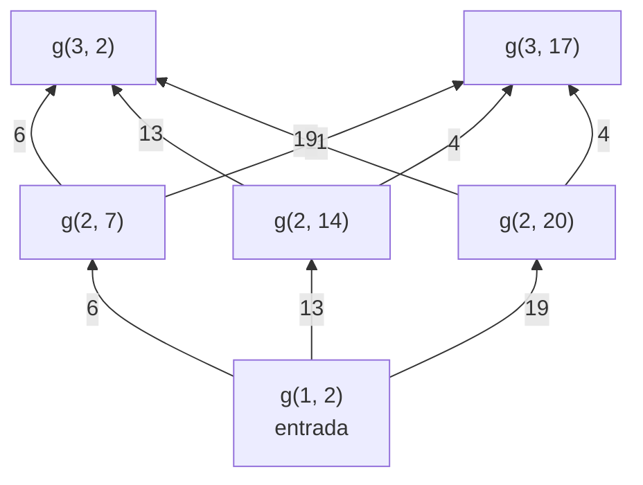

# El laberinto de compuertas

Esta página contiene la sección
[76.6](index.md#766-version-5-el-laberinto-de-compuertas) del
[capítulo 76](index.md): el laberinto de Csenki, tres heurísticas
admisibles y su comparación sobre laberintos sembrados, con A\* y con
IDA\*. El programa es `laberinto.pl`, en `ejemplos/capitulo-76/`, con sus
pruebas.

## El laberinto de compuertas

El laberinto de Csenki es una sucesión de paredes horizontales, una por
fila, cada una con algunas aberturas, las compuertas. Se entra por la
única compuerta de la fila 1 y se sale por la única de la última fila; de
una compuerta se pasa a cualquiera de la fila siguiente caminando por el
corredor entre las dos paredes. Una compuerta es `g(Fila, Posicion)`, con
la posición contada desde la pared de la izquierda, y el laberinto es la
lista de las posiciones de cada fila. `csenki` es el de su figura 3.10:

<!-- ejemplo: capitulo-76/laberinto.pl predicado: laberinto/2 -->
```prolog
%!  laberinto(?Nombre, -Filas:list) is nondet.
%
%   Filas son las posiciones de las compuertas de cada fila del laberinto
%   Nombre, de abajo hacia arriba. csenki es el de la figura 3.10 de
%   Csenki; sembrado(S, F, A, C) es el de sembrado/5.
laberinto(csenki,
          [ [2], [7, 14, 20], [2, 17], [5, 8], [2, 20], [13, 17, 19],
            [2, 15], [7, 19], [4, 8, 18], [3, 16, 19], [3, 12], [5]
          ]).
laberinto(sembrado(Semilla, NFilas, Ancho, Compuertas), Filas) :-
    sembrado(Semilla, NFilas, Ancho, Compuertas, Filas).
```

Ir de `g(F, P)` a `g(F+1, Q)` cuesta `|P − Q| + 1`: lo que se camina a lo
largo del corredor más la fila que se sube. Nunca se vuelve a una fila
anterior, así que el grafo no tiene ciclos. Las tres primeras filas del
laberinto `csenki`, como grafo de búsqueda, con el costo de cada tramo
(es la figura 3.13 de Csenki):



De la entrada a la fila 3 se puede llegar por seis recorridos, y a cada
compuerta de la fila 3 por tres; en un laberinto de muchas filas, la
cantidad de recorridos hasta una compuerta crece como el producto de las
compuertas de las filas anteriores, mientras que las compuertas son pocas.

<!-- ejemplo: capitulo-76/laberinto.pl predicado: inicial/2 meta/2 sucesor/5 -->
```prolog
%!  inicial(+Problema, -Estado) is det.
%
%   Estado es la compuerta de entrada, la única de la fila 1.
inicial(salir(Filas, _), g(1, P)) :-
    Filas = [[P]|_].

%!  meta(+Problema, +Estado) is semidet.
%
%   Estado es la compuerta de salida, la única de la última fila.
meta(salir(Filas, _), g(F, P)) :-
    length(Filas, F),
    last(Filas, [P]).

%!  sucesor(+Problema, +Estado, -Accion, -Siguiente, -Costo) is nondet.
%
%   Siguiente es una compuerta de la fila siguiente, también la Accion, y
%   Costo la distancia caminada por el corredor.
sucesor(salir(Filas, _), g(F, P), g(F1, Q), g(F1, Q), Costo) :-
    F1 is F + 1,
    nth1(F1, Filas, Fila),
    member(Q, Fila),
    Costo is abs(P - Q) + 1.
```

Tres heurísticas, todas con la misma justificación: el camino real se
mide sumando tramos horizontales y verticales, y ninguna línea recta es
más larga que eso. `cero` no estima nada. `euclidea` es la distancia en
línea recta de la compuerta a la salida. `vuelo` es la de Csenki: para
cada fila intermedia, el vuelo más corto en dos tramos rectos que pasa por
alguna de sus compuertas; cada uno de esos vuelos es una cota inferior, y
la heurística toma la mayor.

<!-- ejemplo: capitulo-76/laberinto.pl predicado: heuristica/3 estimacion/5 vuelo_por/6 recta/3 -->
```prolog
%!  heuristica(+Problema, +Estado, -H:number) is det.
%
%   H es la estimación de salir(Filas, Nombre) desde la compuerta Estado
%   hasta la salida.
heuristica(salir(Filas, Nombre), G, H) :-
    length(Filas, N),
    last(Filas, [P]),
    estimacion(Nombre, Filas, G, g(N, P), H).

%!  estimacion(+Nombre, +Filas:list, +X, +Y, -H:number) is det.
%
%   H estima con la heurística Nombre la distancia de la compuerta X a la
%   compuerta Y, en una fila posterior.
estimacion(cero, _, _, _, 0).
estimacion(euclidea, _, X, Y, H) :-
    recta(X, Y, H).
estimacion(vuelo, Filas, X, Y, H) :-
    X = g(F1, _),
    Y = g(F2, _),
    recta(X, Y, E),
    Desde is F1 + 1,
    Hasta is F2 - 1,
    findall(V, vuelo_por(Filas, Desde, Hasta, X, Y, V), Vs),
    max_list([E|Vs], H).

%!  vuelo_por(+Filas:list, +Desde:integer, +Hasta:integer, +X, +Y,
%!            -V:number) is nondet.
%
%   V es el vuelo más corto de X a Y que pasa por una compuerta de una
%   fila entre Desde y Hasta; una respuesta por fila.
vuelo_por(Filas, Desde, Hasta, X, Y, V) :-
    between(Desde, Hasta, F),
    nth1(F, Filas, Fila),
    aggregate_all(min(D),
                  ( member(P, Fila),
                    recta(X, g(F, P), D1),
                    recta(g(F, P), Y, D2),
                    D is D1 + D2 ),
                  V).

%!  recta(+X, +Y, -D:float) is det.
%
%   D es la distancia en línea recta entre las compuertas X e Y.
recta(g(F1, P1), g(F2, P2), D) :-
    D is sqrt((F1 - F2)**2 + (P1 - P2)**2).
```

```prolog
?- salida(csenki, Camino, Costo, K).
Camino = [g(1, 2), g(2, 7), g(3, 2), g(4, 5), g(5, 2), g(6, 13), g(7, 15), g(8, 7), g(..., ...)|...],
Costo = 54,
K = 20.

?- estimacion(euclidea, csenki, g(3, 17), E), estimacion(vuelo, csenki, g(3, 17), V).
E = 15.0,
V = 20.158496632710836.
```

El recorrido es el que publica Csenki, por las compuertas 2, 7, 2, 5, 2,
13, 15, 7, 4, 3, 3 y 5, y las pruebas comprueban sus dos cálculos de
ejemplo, 15,52 y 17,13 entre `g(3, 17)` y `g(7, 2)`. `mostrar_laberinto/2`
dibuja las paredes de arriba hacia abajo, con un espacio en cada compuerta
y un `*` en las que usa el camino:

```text
 12 ----*---------------
 11 --*-------- --------
 10 --*------------ -- -
  9 ---*--- --------- --
  8 ------*----------- -
  7 - ------------*-----
  6 ------------*--- - -
  5 -*-----------------
  4 ----*-- ------------
  3 -*-------------- ---
  2 ------*------ -----
  1 -*------------------
```

Para medir con laberintos más grandes, `sembrado/5` genera uno con un
generador congruencial lineal propio, así que la misma semilla da el mismo
laberinto en cualquier instalación (la técnica del
[capítulo 77](../capitulo-77-proyecto-mundo-wumpus/index.md)):

<!-- ejemplo: capitulo-76/laberinto.pl predicado: sembrado/5 azar/4 -->
```prolog
%!  sembrado(+Semilla:integer, +NFilas:integer, +Ancho:integer,
%!           +Compuertas:integer, -Filas:list) is det.
%
%   Filas es un laberinto de NFilas filas de ancho Ancho: la primera y la
%   última con una compuerta, las demás con a lo sumo Compuertas, en
%   posiciones tomadas de un generador congruencial lineal con la Semilla.
%   El mismo pedido da siempre el mismo laberinto, en cualquier instalación.
sembrado(Semilla, NFilas, Ancho, Compuertas, [[P1]|Filas]) :-
    azar(Semilla, Ancho, P1, S1),
    NMedio is NFilas - 2,
    filas(NMedio, Ancho, Compuertas, S1, Medio, S2),
    azar(S2, Ancho, PN, _),
    append(Medio, [[PN]], Filas).

%!  azar(+S0:integer, +N:integer, -X:integer, -S:integer) is det.
%
%   X es un entero entre 1 y N y S el estado siguiente del generador
%   congruencial lineal de módulo 2^31.
azar(S0, N, X, S) :-
    S is (1103515245 * S0 + 12345) mod 2147483648,
    X is (S >> 16) mod N + 1.
```

```prolog
?- sembrado(1, 8, 40, 4, Filas).
Filas = [[39], [12, 34, 36, 39], [11, 13, 20, 28], [5, 7, 8, 30], [10, 21, 24, 26], [7, 18, 24], [8, 16|...], [15]].
```

Los nodos expandidos por A\* con las tres heurísticas, y las inferencias
de la búsqueda completa:

| Laberinto | costo | `cero` | `euclidea` | `vuelo` |
|---|---|---|---|---|
| `csenki` (12 filas) | 54 | 25 · 3 471 | 20 · 2 847 | 20 · 6 813 |
| `sembrado(1, 30, 40, 4)` | 131 | 110 · 41 517 | 94 · 23 006 | 90 · 131 307 |
| `sembrado(2, 60, 60, 5)` | 280 | 272 · 87 190 | 260 · 83 994 | 253 · 711 539 |
| `sembrado(3, 100, 80, 6)` | 580 | 544 · 221 804 | 525 · 221 029 | 520 · 2 833 764 |

`vuelo` es la mejor informada —nunca estima menos que `euclidea`— y
expande menos nodos, pero calcularla en cada nodo recorre todas las filas
intermedias y sus compuertas: en el laberinto de 100 filas expande 5 nodos
menos que `euclidea` y hace trece veces más inferencias. Es la pregunta del
ejercicio 3.10 de Csenki, si el beneficio de una heurística mejor compensa
su costo, contestada por la medición: en estos laberintos, no. La razón es
que el costo está dominado por la parte que todas las heurísticas ven —las
filas que faltan— y el resto lo decide el laberinto, no la estimación.

IDA\* resuelve `csenki` (con `euclidea`, 1 140 nodos), pero en los
laberintos sembrados encuentra el problema de la
[sección 76.4](index.md#764-version-3-lo-que-cuesta-no-recordar): a cada
compuerta se llega por muchísimos recorridos. Con 8, 12 y 16 filas expande
375, 1 026 y 119 428 nodos; con 20 filas no termina en 20 segundos. A\*
expande 68.
