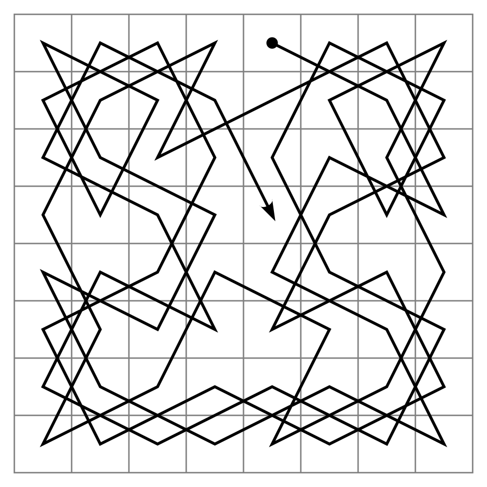

# El recorrido del caballo

Esta página contiene la sección
[76.8](index.md#768-version-7-el-recorrido-del-caballo) del
[capítulo 76](index.md): el recorrido del caballo por todo el tablero,
con el orden fijo de los saltos y con la regla de Warnsdorff. El
programa es `recorrido.pl`, en `ejemplos/capitulo-76/`, con sus pruebas.

## El recorrido del caballo

Un **recorrido del caballo** pasa por todas las casillas del tablero
exactamente una vez.



Un recorrido abierto del caballo en el tablero de 8 × 8: la línea une las
64 casillas en el orden de los saltos, desde el punto hasta la flecha.
Imagen: Ilmari Karonen, dominio público, vía
[Wikimedia Commons](https://commons.wikimedia.org/wiki/File:Knight%27s_tour.svg)
(versión PNG de 960 píxeles del archivo SVG).

No hay una meta a la que acercarse, y ninguna
distancia que estimar: es una búsqueda en profundidad con la vuelta atrás
de Prolog, con las casillas visitadas en un assoc
([sección 22.5](../capitulo-22-estructuras-de-datos-de-la-biblioteca/index.md#225-libraryassoc-y-libraryrbtrees)).

<!-- ejemplo: capitulo-76/recorrido.pl predicado: recorrido/4 continuar/7 candidatas/5 sin_visitar/4 libres_desde/4 -->
```prolog
%!  recorrido(+Orden, +N:integer, +Desde, -Camino:list) is nondet.
%
%   Camino es un recorrido del caballo por el tablero de N x N que empieza
%   en Desde: N x N casillas distintas, cada una a un salto de la
%   anterior. Orden es ingenuo o warnsdorff, el orden en que se prueban los
%   saltos; por reintento da los demás recorridos.
recorrido(Orden, N, Desde, [Desde|Camino]) :-
    Total is N * N,
    list_to_assoc([Desde-si], Visitadas),
    continuar(Orden, N, Total, 1, Desde, Visitadas, Camino).

%!  continuar(+Orden, +N:integer, +Total:integer, +K:integer, +Casilla,
%!            +Visitadas, -Camino:list) is nondet.
%
%   Camino completa el recorrido desde Casilla, la K-ésima, sin pasar por
%   las Visitadas.
continuar(_, _, Total, Total, _, _, []).
continuar(Orden, N, Total, K, Casilla, Visitadas, [Siguiente|Camino]) :-
    K < Total,
    candidatas(Orden, N, Casilla, Visitadas, Candidatas),
    member(Siguiente, Candidatas),
    put_assoc(Siguiente, Visitadas, si, Visitadas1),
    K1 is K + 1,
    continuar(Orden, N, Total, K1, Siguiente, Visitadas1, Camino).

%!  candidatas(+Orden, +N:integer, +Casilla, +Visitadas,
%!             -Candidatas:list) is det.
%
%   Candidatas son las casillas sin visitar a un salto de Casilla, en el
%   orden en que se prueban.
candidatas(ingenuo, N, Casilla, Visitadas, Candidatas) :-
    findall(S, sin_visitar(N, Casilla, Visitadas, S), Candidatas).
candidatas(warnsdorff, N, Casilla, Visitadas, Candidatas) :-
    findall(L-S,
            ( sin_visitar(N, Casilla, Visitadas, S),
              libres_desde(N, S, Visitadas, L) ),
            Pares),
    keysort(Pares, Ordenados),
    pairs_values(Ordenados, Candidatas).

%!  sin_visitar(+N:integer, +Casilla, +Visitadas, -S) is nondet.
%
%   S es una casilla sin visitar a un salto de Casilla.
sin_visitar(N, Casilla, Visitadas, S) :-
    salto(N, Casilla, S, _),
    \+ get_assoc(S, Visitadas, _).

%!  libres_desde(+N:integer, +S, +Visitadas, -L:integer) is det.
%
%   L es la cantidad de casillas sin visitar a un salto de S.
libres_desde(N, S, Visitadas, L) :-
    aggregate_all(count, sin_visitar(N, S, Visitadas, _), L).
```

Con el orden `ingenuo`, las casillas se prueban en el orden fijo de
`salto/4`. Con `warnsdorff`, la regla que H. C. von Warnsdorff publicó en
1823, se prueban primero las casillas desde las que quedan menos saltos
libres: las que más pronto quedarían aisladas se visitan antes de que eso
ocurra. `candidatas/5` arma pares `Libres-Casilla` y los ordena con
`keysort/2`, que conserva el orden de `salto/4` entre las de igual
cantidad. Es una heurística en otro sentido que el de A\*: no estima nada,
ordena los hijos de una búsqueda en profundidad, y la vuelta atrás sigue
disponible por si el orden falla. `mostrar_recorrido/3` escribe el número
de orden de cada casilla en el primer recorrido:

```prolog
?- mostrar_recorrido(ingenuo, 5, 1-1).
  25  18   3  12  23
   8  13  24  17   4
  19   2   7  22  11
  14   9  20   5  16
   1   6  15  10  21
true.

?- mostrar_recorrido(warnsdorff, 8, 1-1).
  22   7  44  39  24   9  28  63
  43  40  23   8  45  62  25  10
   6  21  42  59  38  27  64  29
  41  58  37  46  61  54  11  26
  20   5  60  53  36  47  30  51
  57   2  35  48  55  52  15  12
   4  19  56  33  14  17  50  31
   1  34   3  18  49  32  13  16
true.

?- mostrar_recorrido(ingenuo, 4, 1-1).
false.
```

En el tablero de 4 × 4 no hay recorrido, y la búsqueda lo prueba agotando
las alternativas. Medido desde la esquina (1, 1):

| Tablero | `ingenuo` | `warnsdorff` |
|---|---|---|
| 5 × 5 | 816 228 inferencias, 0,14 s | 37 830 inferencias |
| 6 × 6 | 24 169 331 inferencias, 4,5 s | — |
| 7 × 7 | más de 60 s | — |
| 8 × 8 | — | 21 906 inferencias |
| 20 × 20 | — | 182 715 inferencias, 0,03 s |
| 50 × 50 | — | 1 280 310 inferencias, 0,3 s |

Sin orden, la búsqueda llega a callejones sin salida muy tarde, con medio
tablero recorrido, y deshace millones de pasos; con la regla de
Warnsdorff, en estos tableros no hace falta deshacer ninguno, y el costo
crece con la cantidad de casillas. La regla no garantiza nada: el
[ejercicio 12](index.md#ejercicios) muestra que, si se piden todos los recorridos, ordenar no
ahorra trabajo.
