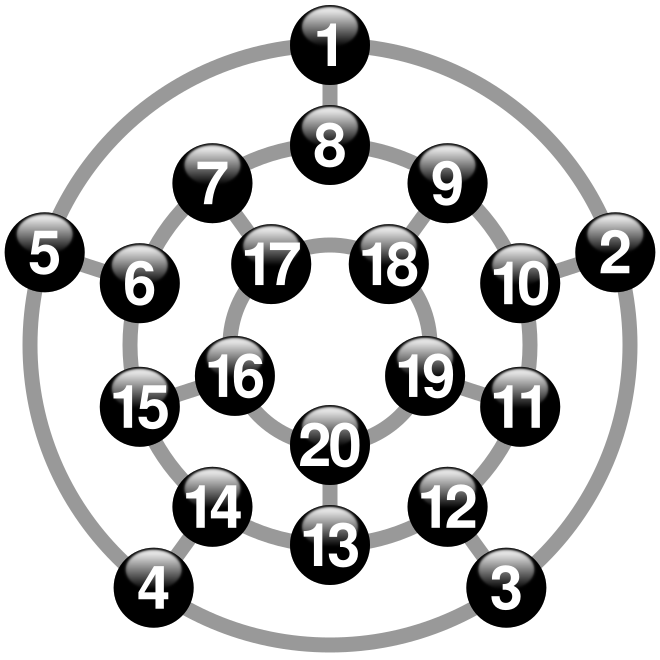

# Capítulo 77 — Proyecto: el mundo del Wumpus

En 1973 Gregory Yob escribió «Hunt the Wumpus», un juego para terminales
de texto: una cueva de veinte salas unidas por túneles, pozos sin fondo,
murciélagos que llevan al jugador de un lado a otro y un monstruo, el
wumpus, al que hay que alcanzar con una flecha sin haberlo visto nunca.
El jugador solo recibe avisos: un olor, una corriente de aire, un ruido de
alas. Dos décadas después, Stuart Russell y Peter Norvig tomaron el juego
como ejemplo de un **agente basado en conocimiento**: un programa que
registra lo que percibe, deduce de ello qué es seguro y actúa en
consecuencia. El [capítulo 20](../capitulo-20-base-de-datos-dinamica/index.md#207-el-agente-del-mundo-del-wumpus)
escribió las primeras reglas de ese agente y el
[capítulo 40](../capitulo-40-busqueda-y-planificacion/aplicaciones.md#la-vuelta-a-casa-del-wumpus)
su camino de vuelta con A\*. Este capítulo construye el juego completo y un
agente que lo juega:

```text
Estás en la sala 5. Hay túneles hacia las salas 1, 4 y 6.
Oyes murciélagos cerca.
> m 1
Estás en la sala 1. Hay túneles hacia las salas 2, 5 y 8.
> m 2
Estás en la sala 2. Hay túneles hacia las salas 1, 3 y 10.
Sientes el olor del wumpus.
> m 1
Estás en la sala 1. Hay túneles hacia las salas 2, 5 y 8.
> m 8
Estás en la sala 8. Hay túneles hacia las salas 1, 7 y 9.
Oyes murciélagos cerca.
> m 1
Estás en la sala 1. Hay túneles hacia las salas 2, 5 y 8.
> m 5
Estás en la sala 5. Hay túneles hacia las salas 1, 4 y 6.
Oyes murciélagos cerca.
> m 4
Estás en la sala 4. Hay túneles hacia las salas 3, 5 y 14.
Sientes el olor del wumpus.
> d 3
¡Tu flecha alcanza al wumpus! Ganas.
```

Es la salida de `narrar(7)`, de la versión 5: las órdenes después de `>`
no las escribe una persona sino el agente, que ve lo mismo que vería un
jugador. En la sala 2 percibe el olor: el wumpus está en la sala 3 o en la
10, porque la 1 ya la visitó. Explora la 8, que prueba segura, y vuelve por
la 5 hasta la 4, donde el olor se repite. La única sala vecina de la 2 y de
la 4 que puede tener al wumpus es la 3, y el agente dispara.

El proyecto parte de dos fuentes. De las instrucciones del juego de Yob,
publicadas en el boletín de la People's Computer Company en noviembre de
1973, toma la cueva con forma de dodecaedro, los peligros, los avisos, las
flechas torcidas y el despertar del wumpus. De *Artificial Intelligence:
A Modern Approach* de Russell y Norvig, del capítulo «Logical Agents»,
toma el mundo de 4 × 4 celdas con sus percepciones, el agente que infiere
qué celdas son seguras y el orden de decisiones de su agente híbrido; del
capítulo «Quantifying Uncertainty», el cálculo de la probabilidad de un
pozo contando mundos. El código oficial del libro, `aima-python`, sirve de
referencia para el puntaje y la generación de mundos. La lista completa,
con lo que se toma de cada una, está en [Referencias](#referencias). El
código es propio.

El capítulo carga, sin copiarlos, la cueva y el agente del
[capítulo 20](../capitulo-20-base-de-datos-dinamica/index.md), el A\* del
[capítulo 40](../capitulo-40-busqueda-y-planificacion/index.md), el
evaluador de abajo hacia arriba del
[capítulo 38](../capitulo-38-semantica-de-los-programas-logicos/index.md) y
el demostrador del
[capítulo 62](../capitulo-62-proyecto-demostrador-teoremas/index.md). Cada
versión es un módulo, y todos son `% solo-local`: sus pruebas leen las
órdenes de cadenas, nunca del teclado, y el azar sale de una semilla.

## Objetivos del capítulo

Al terminar el capítulo, el lector puede:

- comparar seis maneras de representar el conocimiento de un agente y de
  decidir con él, midiendo lo que prueba cada una y lo que cuesta;
- escribir un juego cuyo estado, incluido el generador de números al
  azar, es un término, de modo que una partida queda determinada por su
  semilla y sus órdenes;
- separar un simulador, que conoce el mundo, de un agente, que solo
  recibe percepciones, con el agente como un predicado que se pasa como
  argumento;
- decidir qué es seguro enumerando los mundos consistentes con lo
  percibido, y calcular con los mismos mundos la probabilidad de un
  peligro;
- reutilizar una búsqueda escrita para otro problema trasladando las
  coordenadas del problema nuevo;
- medir la política de un agente sobre cientos de mundos sembrados.

!!! info "Tiempo estimado"
    Leer el capítulo, ejecutar sus ejemplos y hacer las actividades: **1:25 h**.
    Resolver los 5 ejercicios marcados con ★: **1:20 h**.
    Resolver los 12 ejercicios del final: **4:15 h**.

## 77.1 Seis maneras de programar el agente

Un agente del mundo del Wumpus tiene que resolver dos problemas distintos.
El primero es de **conocimiento**: con lo que percibió, decidir qué celdas
son seguras, cuáles peligrosas y cuáles desconocidas. El segundo es de
**acción**: con esa clasificación, elegir adónde ir y por qué camino. La
búsqueda del [capítulo 40](../capitulo-40-busqueda-y-planificacion/index.md)
resuelve el segundo, pero no el primero: A\* necesita saber por qué
celdas puede pasar. Para el primero hay varias representaciones posibles,
y el archivo `enfoques.pl` programa seis sobre el mismo conocimiento. La
página [Los enfoques comparados](enfoques.md) muestra el código de cada
una; la tabla resume lo que representa cada enfoque, cómo decide y lo que
se midió sobre 85 situaciones del agente en 20 mundos sembrados, donde
los enfoques completos prueban seguras 192 celdas:

| Enfoque | Representa | Decide «segura» | Medido (celdas, inferencias) | En Prolog |
|---|---|---|---|---|
| Reglas resueltas por Prolog ([capítulo 20](../capitulo-20-base-de-datos-dinamica/index.md)) | reglas de Horn sobre las percepciones | una regla prueba «sin pozo» y «sin wumpus» | 188, 62 060 | gratis: es la resolución de Prolog; pero cada caso nuevo, como dos hedores, pide otra regla |
| Datalog ([capítulo 38](../capitulo-38-semantica-de-los-programas-logicos/index.md)) | las mismas reglas como datos | el átomo está en el modelo estándar | 188, 3 070 526 | un evaluador de pocas decenas de líneas; calcula el modelo entero; incremental con un sistema de producción o Rete |
| Resolución de primer orden ([capítulo 62](../capitulo-62-proyecto-demostrador-teoremas/index.md)) | cláusulas universales | refutar `pozo(C)` y `wumpus(C)` | 186, 350 199 373 | un demostrador escrito a mano; completo solo con axiomas existenciales y de nombres distintos, que la búsqueda no alcanza |
| Proposicional con `library(clpb)` (capítulos [23](../capitulo-23-programacion-con-restricciones/index.md#2312-libraryclpb) y [62](../capitulo-62-proyecto-demostrador-teoremas/comparacion.md#tres-maneras-de-decidir)) | un átomo por celda y peligro | la implicación es una tautología | 192, 180 756 834 | una biblioteca; completo; la fórmula se traduce entera en cada pregunta |
| Restricciones con `library(clpfd)` ([capítulo 23](../capitulo-23-programacion-con-restricciones/index.md)) | variables 0/1 y sumas | ningún mundo pone un peligro en la celda | 192, 14 907 623 | una biblioteca; completo; la búsqueda la hace el etiquetado |
| Mundos consistentes (versión 3) | conjuntos de pozos de la frontera y posiciones del wumpus | ningún mundo que explica las percepciones pone un peligro en la celda | 192, 283 674 | generar y probar con vuelta atrás, sin bibliotecas; los mismos mundos dan las probabilidades |

Otros enfoques se consideraron sin programarlos. Un **sistema de
producción** o el **algoritmo Rete** (capítulos
[63](../capitulo-63-proyecto-sistema-produccion/index.md) y
[64](../capitulo-64-proyecto-algoritmo-rete/index.md)) evalúan las mismas
reglas que Datalog hacia adelante, y con Rete cada percepción propaga solo
sus consecuencias: prueban lo mismo que las reglas. La **tabulación** del
[capítulo 39](../capitulo-39-tabulacion/index.md) no agrega nada, porque
las reglas no son recursivas. La **abducción** del
[capítulo 49](../capitulo-49-proyecto-diagnostico-abduccion/index.md)
busca las explicaciones de las percepciones: son los mundos consistentes,
restringidos a los mínimos, y un mundo que no es mínimo puede ser el
verdadero. Las **reglas rebatibles** del
[capítulo 65](../capitulo-65-proyecto-razonamiento-rebatible/index.md)
permitirían presumir segura una celda salvo prueba en contrario: una
presunción así lleva al agente a entrar en celdas con pozos. Un **DPLL** escrito a mano decide lo
mismo que `clpb`; el ejercicio 6 lo escribe.

**La elección.** La línea principal del capítulo usa los **mundos
consistentes**. Es completo, como `clpb` y `clpfd`: prueba todo lo que se
sigue de lo percibido, incluidos los casos que ninguna regla previó. Es
el más barato de los completos, porque aprovecha dos hechos del problema:
la brisa depende solo de los pozos y el hedor solo del wumpus, y un pozo
fuera de la frontera no cambia ninguna percepción. Es el que mejor usa a
Prolog, porque generar candidatos y descartar los que no explican las
percepciones es la vuelta atrás, sin ninguna biblioteca. Y la misma lista
de mundos, pesada por su probabilidad, da el riesgo de cada celda (versión
4) y se adapta a la cueva de Yob, donde la cantidad de pozos es fija
(versión 5). Su costo crece con 2 elevado a la cantidad de celdas de la
frontera; en una cueva de 4 × 4 la frontera tiene a lo sumo ocho.

## 77.2 El programa terminado

| Versión | Archivo | Agrega | Lo que no puede hacer todavía |
|---|---|---|---|
| 1 | `cueva.pl` | el juego de Yob, jugable en la terminal | nada juega solo |
| 2 | `grilla.pl` | el mundo de Russell y Norvig como simulador | no hay agente que razone |
| 3 | `agente.pl` | el agente basado en conocimiento: mundos consistentes, exploración, vuelta con A\* | arriesgar cuando nada es seguro |
| 4 | `riesgo.pl` | la flecha y la probabilidad de cada peligro | jugar la cueva de Yob |
| 5 | `cazador.pl` | un agente que juega la cueva de Yob | — |

`azar.pl` es el generador de números al azar de todas las versiones, y
`capitulo20.pl`, `capitulo38.pl` y `capitulo40.pl` cargan los archivos de
esos capítulos dentro de un módulo, como hace el
[capítulo 43](../capitulo-43-proyecto-resolver-ecuaciones/index.md) con los
del 32. `enfoques.pl` es la comparación de la sección anterior.

## 77.3 Versión 1: «Hunt the Wumpus»

La cueva es un dodecaedro: veinte salas, cada una con tres túneles.



La cueva de Yob aplanada: las salas 1 a 5 en el anillo exterior, 6 a 15
en el medio y 16 a 20 en el interior, con la misma numeración que usan las
instrucciones de 1973 y el programa del capítulo. Imagen: CMG Lee,
[CC BY-SA 4.0](https://creativecommons.org/licenses/by-sa/4.0/), vía
[Wikimedia Commons](https://commons.wikimedia.org/wiki/File:Hunt_the_Wumpus_map.svg).

La cueva se escribe como veinte hechos `tuneles(S, Vecinas)`, y
`tunel/2` los lee de a un túnel. Las pruebas verifican que la figura es la correcta: 30 túneles,
todos en los dos sentidos, sin ciclos de tres ni de cuatro salas.

El estado de la partida es un término `j(Jugador, Wumpus, Pozos,
Murcielagos, Flechas, Azar)`. El último argumento es el estado de un
generador congruencial lineal, `azar/4`: cada número al azar se obtiene
del estado anterior y devuelve el siguiente. Así, `jugada/5` es puro: la
misma partida y la misma orden dan siempre el mismo resultado, en
cualquier instalación, y una prueba puede fijar una semilla sin depender
del orden en que corren las demás.

<!-- ejemplo: capitulo-77/cueva.pl predicado: despertar/4 vuelo/7 -->
```prolog
%!  despertar(+W0, -W, +A0, -A) is det.
%
%   El wumpus despierta en W0 y queda en W: en tres casos de cada cuatro
%   pasa por uno de sus tres túneles, elegido al azar; en el cuarto se
%   queda.
despertar(W0, W, A0, A) :-
    azar(4, K, A0, A),
    (   K < 3
    ->  tuneles(W0, Vecinas),
        nth0(K, Vecinas, W)
    ;   W = W0
    ).

%!  vuelo(+Ruta:list, +Desde, +J, +W, +A0, -A, -Impacto) is det.
%
%   La flecha sale de la sala Desde por las salas de Ruta, con el jugador
%   en J y el wumpus en W. Si una sala de Ruta no está conectada con la
%   sala en que está la flecha, la flecha toma uno de sus túneles al azar.
%   Impacto es wumpus, jugador o nada.
vuelo([], _, _, _, A, A, nada).
vuelo([S|Ruta], Desde, J, W, A0, A, Impacto) :-
    (   tunel(Desde, S)
    ->  Siguiente = S,
        A1 = A0
    ;   tuneles(Desde, Vecinas),
        elegir(Vecinas, Siguiente, A0, A1)
    ),
    (   Siguiente == W
    ->  Impacto = wumpus,
        A = A1
    ;   Siguiente == J
    ->  Impacto = jugador,
        A = A1
    ;   vuelo(Ruta, Siguiente, J, W, A1, A, Impacto)
    ).
```

`despertar/4` es la regla de Yob: el wumpus despierta cuando el jugador
entra en su sala o dispara, y entonces se mueve o se queda. Las
instrucciones de 1973 no dicen con qué frecuencia; el programa del curso
lo mueve en tres casos de cada cuatro, y una prueba lo mide sobre 400
semillas: 299 movimientos. `vuelo/7` es la flecha torcida: sigue la ruta
que el jugador indicó mientras cada sala esté unida a la anterior, y
cuando no lo está, toma un túnel al azar. Puede volver a la sala del
jugador:

```prolog
?- nueva_partida(7, E), observacion(E, O).
E = j(5, 3, [17, 16], [6, 9], 5, 220562521),
O = obs(5, [1, 4, 6], [murcielagos], 5).

?- nueva_partida(7, E0), jugada(mover(6), E0, E, R, M).
E0 = j(5, 3, [17, 16], [6, 9], 5, 220562521),
E = j(15, 3, [17, 16], [6, 9], 5, 2099423262),
R = sigue,
M = [murcielagos(15)].
```

`observacion/2` es lo único que el jugador puede saber: su sala, los
túneles, los avisos y las flechas. La jugada devuelve términos, no texto,
y `mensaje_texto/2` los redacta dirigiéndose al jugador de tú. El bucle
del juego, `partida/2`, lee cada orden de un stream con la gramática
`orden//1`: `m 4` o `mover 4`, `d 3 4` o `disparar 3 4`. `jugar/0` usa el
teclado y una semilla tomada del reloj. Una partida con la semilla 7:

```text
Estás en la sala 5. Hay túneles hacia las salas 1, 4 y 6.
Oyes murciélagos cerca.
> m 4
Estás en la sala 4. Hay túneles hacia las salas 3, 5 y 14.
Sientes el olor del wumpus.
> m 5
Estás en la sala 5. Hay túneles hacia las salas 1, 4 y 6.
Oyes murciélagos cerca.
> m 6
¡Un murciélago gigante te lleva a la sala 15!
Estás en la sala 15. Hay túneles hacia las salas 6, 14 y 16.
Sientes una corriente de aire.
Oyes murciélagos cerca.
> m 16
Caes en un pozo sin fondo. Pierdes.
```

!!! question "Actividad"
    Con la semilla 7, el jugador está en la sala 5 y el wumpus en la 3.
    Predecir el resultado y los mensajes de `disparar([4, 3])` y de
    `disparar([4, 5])`, y comprobarlos con `jugada/5`. Después explicar
    por qué el resultado de `disparar([2, 3])` no se puede predecir sin
    ejecutarlo.

**Lo que falta.** Nada juega solo. Para escribir un agente, conviene
empezar por un mundo más regular, donde las percepciones de cada celda se
calculan con una fórmula: la grilla de Russell y Norvig.

## 77.4 Versión 2: el mundo de Russell y Norvig

Una cueva de N × N celdas `X-Y`, con la entrada en (1, 1). Un mundo es un
término `mundo(N, Pozos, Wumpus, Oro)`; `mundo(figura_7_2, M)` es la
cueva del [capítulo 20](../capitulo-20-base-de-datos-dinamica/index.md), leída de sus hechos a través de `capitulo20.pl`, y
`mundo_sembrado/2` construye una al azar como la del código de
`aima-python`: un pozo en cada celda salvo la entrada con probabilidad
1/5, y el wumpus y el oro en celdas distintas de la entrada.

<!-- contexto: capitulo-77/grilla.pl -->
```prolog
?- mundo(figura_7_2, M).
M = mundo(4, [3-1, 3-3, 4-4], 1-3, 2-3).
```

`mostrar/1` escribe la cueva con la fila de arriba primero: P es un pozo,
W el wumpus y O el oro.

```text
. . . P
W O P .
. . . .
. . P .
```

El agente percibe hedor junto al wumpus, brisa junto a un pozo y brillo
sobre el oro; un golpe si choca con una pared y un grito si su flecha
mata al wumpus. Los dos últimos dependen de la acción, y por eso los
devuelve `actuar/6` y no `percepciones/3`:

<!-- ejemplo: capitulo-77/grilla.pl predicado: percepciones/3 percibe/7 -->
```prolog
%!  percepciones(+M, +E, -Ps:list) is det.
%
%   Ps son las percepciones de la celda del agente en el estado E del mundo
%   M, sin el golpe ni el grito, que dependen de la acción anterior: hedor,
%   brisa y brillo, en ese orden, las que haya.
percepciones(mundo(N, Pozos, Wumpus, Oro), e(C, TieneOro, _, _), Ps) :-
    findall(P,
            ( member(P, [hedor, brisa, brillo]),
              percibe(P, N, C, Pozos, Wumpus, Oro, TieneOro) ),
            Ps).

%!  percibe(+P, +N, +C, +Pozos, +Wumpus, +Oro, +TieneOro) is semidet.
%
%   En la celda C se percibe P.
percibe(hedor, N, C, _, Wumpus, _, _) :-
    once(vecina(N, C, Wumpus)).
percibe(brisa, N, C, Pozos, _, _, _) :-
    once(( vecina(N, C, V), memberchk(V, Pozos) )).
percibe(brillo, _, C, _, _, C, no).
```

```prolog
?- mundo(figura_7_2, M), actuar(M, disparar(norte), e(1-1, no, si, vivo), E, X, F).
M = mundo(4, [3-1, 3-3, 4-4], 1-3, 2-3),
E = e(1-1, no, no, muerto),
X = [grito],
F = sigue.
```

Russell y Norvig hacen girar al agente antes de avanzar; aquí la acción
`ir(C)` lo lleva a una celda vecina, que es también la forma de los
planes del [capítulo 40](../capitulo-40-busqueda-y-planificacion/index.md). El puntaje es el del libro: un punto menos por
acción, diez más por disparar, mil por salir con el oro y mil menos por
morir. `simular/5` juega una partida con un agente que recibe como
argumento, un predicado que se llama como `call(Agente, Percepciones, K0,
Accion, K)`: el simulador no le muestra el mundo, y el agente lleva su
conocimiento en `K`.

**Lo que falta.** El agente.

## 77.5 Versión 3: el agente basado en conocimiento

El conocimiento del agente es un término `c(N, Celda, Visitadas, Oro,
Flecha, Wumpus, Plan)`: `Visitadas` es una lista de pares
`Celda-Percepciones`, con la brisa y el hedor que se percibieron en cada
celda. Un **mundo consistente** es una ubicación de los peligros que
explica todo lo percibido: cada celda visitada tiene brisa si y solo si
una vecina tiene pozo. Los pozos que importan están en la **frontera**,
las celdas sin visitar vecinas de alguna visitada:

<!-- ejemplo: capitulo-77/agente.pl predicado: mundos_pozos/2 subconjunto/2 explica/4 posiciones_wumpus/2 -->
```prolog
%!  mundos_pozos(+K, -Mundos:list) is det.
%
%   Mundos son los conjuntos de celdas de la frontera con pozos que
%   explican la brisa percibida en cada celda visitada, cada uno como una
%   lista ordenada.
mundos_pozos(K, Mundos) :-
    frontera(K, Frontera),
    K = c(N, _, Vs, _, _, _, _),
    findall(Pozos,
            ( subconjunto(Frontera, Pozos),
              explica(Vs, N, brisa, Pozos) ),
            Mundos).

%!  subconjunto(+Xs:list, -Ys:list) is multi.
%
%   Ys es un subconjunto de Xs, en el mismo orden.
subconjunto([], []).
subconjunto([X|Xs], [X|Ys]) :-
    subconjunto(Xs, Ys).
subconjunto([_|Xs], Ys) :-
    subconjunto(Xs, Ys).

%!  explica(+Visitadas:list, +N:integer, +P, +Celdas:list) is semidet.
%
%   Con peligros en las Celdas, cada celda visitada percibe P si y solo si
%   tiene una vecina entre ellas.
explica(Vs, N, P, Celdas) :-
    forall(member(C-Ps, Vs),
           (   memberchk(P, Ps)
           ->  once(( vecina(N, C, V), memberchk(V, Celdas) ))
           ;   \+ ( vecina(N, C, V), memberchk(V, Celdas) )
           )).

%!  posiciones_wumpus(+K, -Celdas:list) is det.
%
%   Celdas son las celdas sin visitar donde puede estar el wumpus vivo:
%   las que explican el hedor percibido en cada celda visitada, salvo las
%   que una flecha recorrió sin matarlo. Si el wumpus murió, la lista es
%   vacía.
posiciones_wumpus(c(_, _, _, _, _, muerto, _), []) :-
    !.
posiciones_wumpus(c(N, _, Vs, _, _, vivo(Descartadas), _), Celdas) :-
    findall(W,
            ( between(1, N, X),
              between(1, N, Y),
              W = X-Y,
              \+ memberchk(W-_, Vs),
              \+ memberchk(W, Descartadas),
              explica(Vs, N, hedor, [W]) ),
            Celdas).
```

`subconjunto/2` genera, por vuelta atrás, cada conjunto de celdas de la
frontera; `explica/4` descarta los que no explican las percepciones. Con
el wumpus alcanza probar cada celda, porque hay uno solo. En la situación
de la figura 7.4 del libro, brisa en (2, 1) y hedor en (1, 2):

```prolog
?- conocer(4, [1-1-[], 2-1-[brisa], 1-2-[hedor]], K), frontera(K, F), mundos_pozos(K, Ps), posiciones_wumpus(K, Ws).
K = c(4, 1-2, [1-1-[], 2-1-[brisa], 1-2-[hedor]], no, si, vivo([]), []),
F = [1-3, 2-2, 3-1],
Ps = [[3-1]],
Ws = [1-3].

?- conocer(4, [1-1-[], 2-1-[brisa], 1-2-[hedor]], K), seguras(K, S), clasificar(K, 3-1, C31), clasificar(K, 1-3, C13), clasificar(K, 4-4, C44).
K = c(4, 1-2, [1-1-[], 2-1-[brisa], 1-2-[hedor]], no, si, vivo([]), []),
S = [2-2],
C31 = pozo,
C13 = wumpus,
C44 = desconocida.
```

Es la inferencia que el libro hace a mano: (1, 2) no tuvo brisa, así que
ni (2, 2) ni (1, 3) tienen pozo, y el pozo que explica la brisa de (2, 1)
está en (3, 1); (2, 1) no tuvo hedor, así que el wumpus no está en (2, 2)
y está en (1, 3). Ninguna regla la escribe: sale de descartar mundos.

El agente sigue el orden del agente híbrido del libro: si percibe el
brillo, toma el oro y planea la vuelta; si no, va a la celda segura sin
visitar más cercana; si no queda ninguna, vuelve y sale sin el oro. Los
caminos son del A\* del [capítulo 40](../capitulo-40-busqueda-y-planificacion/index.md), cargado con `capitulo40.pl`. Ese A\*
resuelve un solo problema, `vuelta(Desde, Seguras)`, que siempre termina
en (1, 1). Para ir a otra celda no hace falta otra búsqueda: se trasladan
todas las celdas de modo que la meta quede en (1, 1), se busca, y el plan
se traslada de vuelta:

<!-- ejemplo: capitulo-77/agente.pl predicado: ruta/4 -->
```prolog
%!  ruta(+Desde, +Hasta, +Permitidas:list, -Plan:list) is semidet.
%
%   Plan es el camino más corto de Desde a Hasta que pasa solo por celdas
%   de Permitidas, una lista de acciones ir(Celda), hallado con el A* del
%   capítulo 40. Ese A* va siempre a (1, 1): las celdas se trasladan para
%   que Hasta quede en (1, 1), y el plan se traslada de vuelta. Falla si no
%   hay camino.
ruta(Desde, Hasta, Permitidas, Plan) :-
    Hasta = HX-HY,
    DX is 1 - HX,
    DY is 1 - HY,
    maplist(trasladar(DX, DY), [Desde|Permitidas], [Desde1|Permitidas1]),
    vuelta(Desde1, Permitidas1, Plan1, _, _),
    NX is -DX,
    NY is -DY,
    maplist(trasladar_accion(NX, NY), Plan1, Plan).
```

```prolog
?- ruta(1-1, 3-2, [1-1, 2-1, 2-2, 3-2], P).
P = [ir(2-1), ir(2-2), ir(3-2)].
```

Las celdas trasladadas pueden tener coordenadas nulas o negativas, y la
heurística del [capítulo 40](../capitulo-40-busqueda-y-planificacion/index.md), X − 1 + Y − 1, deja de ser la distancia de
Manhattan. Sigue sin estimar de más, porque nunca supera a
|X − 1| + |Y − 1|, y cambia en 1 de una celda a su vecina: A\* sigue
devolviendo el camino más corto, con una heurística menos informada. El
agente completo, en la cueva de la figura 7.2:

```prolog
?- mundo(figura_7_2, M), jugar(M, F).
M = mundo(4, [3-1, 3-3, 4-4], 1-3, 2-3),
F = final(salio(si), 990, [ir(1-2), ir(1-1), ir(2-1), ir(2-2), ir(2-3), tomar, ir(... - ...), ir(...)|...]).
```

Diez acciones y 990 puntos: visita (1, 2), vuelve por (1, 1) a (2, 1),
deduce que (2, 2) es segura, sigue a (2, 3), toma el oro y vuelve por el
camino de A\*. Toda la partida usa 11 151 inferencias, medidas con `time/1`.

!!! question "Actividad"
    Predecir la frontera, los mundos de pozos, las posiciones del wumpus y
    las celdas seguras del conocimiento `[1-1-[], 1-2-[brisa, hedor]]`, y
    comprobarlo con `frontera/2`, `mundos_pozos/2`, `posiciones_wumpus/2`
    y `seguras/2`.

**Lo que falta.** El agente nunca muere, pero con frecuencia sale sin el
oro: en la semilla 2 vuelve a la entrada después de seis movimientos,
porque ninguna celda sin visitar es segura:

```prolog
?- mundo_sembrado(2, M), jugar(M, F).
M = mundo(4, [2-3, 3-1, 3-4, 4-4], 1-4, 2-4),
F = final(salio(no), -7, [ir(1-2), ir(1-3), ir(1-2), ir(2-2), ir(2-1), ir(1-1), salir]).
```

## 77.6 Versión 4: la flecha y el riesgo

Cuando no queda ninguna celda segura, el agente híbrido de Russell y
Norvig tiene dos recursos. El primero es la flecha: `disparo/3` busca una
celda visitada y una dirección cuya línea pase por la mayor cantidad de
posiciones posibles del wumpus. Si el agente oye el grito, el wumpus
murió; si no, las celdas por las que pasó la flecha quedan descartadas.
El conocimiento lo registra en su campo `Wumpus`: `vivo(Descartadas)`,
`apuntado(...)` mientras espera el grito, o `muerto`. En la semilla 2 el
agente dispara hacia el norte desde (1, 1), mata al wumpus y llega al
oro:

<!-- contexto: capitulo-77/riesgo.pl -->
```prolog
?- mundo_sembrado(2, M), jugar_con_riesgo(M, 0.5, F).
M = mundo(4, [2-3, 3-1, 3-4, 4-4], 1-4, 2-4),
F = final(salio(si), 973, [ir(1-2), ir(1-3), ir(1-2), ir(2-2), ir(2-1), ir(1-1), disparar(norte), ir(...)|...]).
```

El segundo recurso es el riesgo. Cada celda tiene un pozo con
probabilidad 1/5, independientemente de las demás, así que un mundo con k
pozos en una frontera de n celdas tiene probabilidad
$(1/5)^k (4/5)^{n-k}$. La probabilidad de un pozo en una celda es la
suma de las probabilidades de los mundos consistentes que lo ponen allí,
dividida por la de todos:

<!-- ejemplo: capitulo-77/riesgo.pl predicado: probabilidad_pozo/3 peso/3 -->
```prolog
%!  probabilidad_pozo(+K, +C, -P:float) is det.
%
%   P es la probabilidad de que la celda C tenga un pozo, según el
%   conocimiento K: 0 si está visitada; en la frontera, la suma de los
%   pesos de los mundos consistentes con un pozo en C sobre la suma de
%   todos; fuera de la frontera, 1/5.
probabilidad_pozo(K, C, P) :-
    K = c(_, _, Vs, _, _, _, _),
    frontera(K, Frontera),
    (   memberchk(C-_, Vs)
    ->  P = 0.0
    ;   memberchk(C, Frontera)
    ->  mundos_pozos(K, Mundos),
        length(Frontera, N),
        maplist(peso(N), Mundos, Pesos),
        sum_list(Pesos, Total),
        pares_con(Mundos, Pesos, C, ConC),
        sum_list(ConC, Parcial),
        P is Parcial / Total
    ;   P = 0.2
    ).

%!  peso(+N:integer, +Pozos:list, -W:float) is det.
%
%   W es la probabilidad de que una frontera de N celdas tenga pozos
%   exactamente en las celdas de Pozos.
peso(N, Pozos, W) :-
    length(Pozos, K),
    W is 0.2 ** K * 0.8 ** (N - K).
```

```prolog
?- conocer(4, [1-1-[], 1-2-[brisa], 2-1-[brisa]], K), mundos_pozos(K, Mundos), probabilidad_pozo(K, 1-3, P13), probabilidad_pozo(K, 2-2, P22).
K = c(4, 2-1, [1-1-[], 1-2-[brisa], 2-1-[brisa]], no, si, vivo([]), []),
Mundos = [[1-3, 2-2, 3-1], [1-3, 2-2], [1-3, 3-1], [2-2, 3-1], [2-2]],
P13 = 0.3103448275862069,
P22 = 0.8620689655172414.
```

Son los números de la sección «The Wumpus World Revisited» del libro,
0,31 y 0,86: exactamente 9/29 y 25/29. De los cinco mundos, el de un solo
pozo en (2, 2) es el más probable, y (2, 2) está en cuatro. El agente
entra en la celda de la frontera con menos riesgo si ese riesgo es menor
que un umbral. `medir/3` juega los cien mundos de las semillas 1 a 100:

```prolog
?- numlist(1, 100, Ss), medir(prudente, Ss, R).
Ss = [1, 2, 3, 4, 5, 6, 7, 8, 9|...],
R = r(25, 0, 75, 244).

?- numlist(1, 100, Ss), medir(riesgo(0.3), Ss, R).
Ss = [1, 2, 3, 4, 5, 6, 7, 8, 9|...],
R = r(29, 2, 69, 255).

?- numlist(1, 100, Ss), medir(riesgo(0.5), Ss, R).
Ss = [1, 2, 3, 4, 5, 6, 7, 8, 9|...],
R = r(37, 15, 48, 203).

?- numlist(1, 100, Ss), medir(riesgo(1.01), Ss, R).
Ss = [1, 2, 3, 4, 5, 6, 7, 8, 9|...],
R = r(47, 53, 0, -79).
```

Cada resultado es `r(Oro, Muertes, SinOro, PuntajeMedio)`. El agente
prudente de la versión 3 sale con el oro en 25 mundos y nunca muere. Con
un umbral de 0,3 gana cuatro mundos más a costa de dos muertes, y su
puntaje medio es el mejor; con 0,5 gana 37 y muere en 15; el que siempre
arriesga gana 47 y muere en 53. Una muerte cuesta lo mismo que un oro, y
por eso el puntaje premia al umbral bajo.

**Lo que falta.** El agente juega la grilla, no la cueva de Yob.

## 77.7 Versión 5: un agente para la cueva de Yob

El agente de `cazador.pl` juega la cueva de la versión 1 con las mismas
órdenes que un jugador y solo ve lo que ve un jugador: `observacion/2` y
los mensajes de cada jugada. Razona con mundos consistentes, con tres
diferencias. Los peligros están en salas unidas por túneles, no en una
grilla. Su cantidad es fija: dos pozos, dos salas con murciélagos y un
wumpus; un mundo de pozos es un par de salas, y todos los mundos
consistentes son igual de probables. Y el wumpus se mueve cuando
despierta, así que lo que se percibió de él antes ya no vale: el agente
guarda aparte las observaciones posteriores al último despertar.

<!-- ejemplo: capitulo-77/cazador.pl predicado: mundos/4 explican/3 -->
```prolog
%!  mundos(+K, +Peligro, +Cantidad:integer, -Mundos:list) is det.
%
%   Mundos son los conjuntos de Cantidad salas donde puede estar Peligro
%   (corriente, murcielagos o wumpus) según el conocimiento K: salas
%   candidatas que explican el aviso de Peligro en cada sala observada.
mundos(K, Peligro, Cantidad, Mundos) :-
    observadas(K, Peligro, Obs),
    candidatas(K, Peligro, Obs, Candidatas, Fijas),
    length(Fijas, NF),
    Resto is Cantidad - NF,
    findall(Mundo,
            ( combinacion(Resto, Candidatas, Otras),
              ord_union(Fijas, Otras, Mundo),
              explican(Obs, Peligro, Mundo) ),
            Mundos).

%!  explican(+Obs:list, +Peligro, +Mundo:list) is semidet.
%
%   Con Peligro en las salas de Mundo, cada sala observada tiene el aviso
%   de Peligro si y solo si una vecina está en Mundo.
explican(Obs, Peligro, Mundo) :-
    forall(member(S-Avisos, Obs),
           (   memberchk(Peligro, Avisos)
           ->  once(( tunel(S, V), memberchk(V, Mundo) ))
           ;   \+ ( tunel(S, V), memberchk(V, Mundo) )
           )).
```

El agente dispara cuando el wumpus solo puede estar en una sala, por el
camino más corto; si no, va a la sala segura sin visitar más cercana, y si
no hay ninguna, a la sala sin visitar con menos riesgo. En la cueva no se
puede salir: cuando nada es seguro, arriesgar es la única opción.

```prolog
?- cazar(7, R, O).
R = gana,
O = [mover(1), mover(2), mover(1), mover(8), mover(1), mover(5), mover(4), disparar([...])].

?- numlist(1, 100, Ss), medir_caza(Ss, R).
Ss = [1, 2, 3, 4, 5, 6, 7, 8, 9|...],
R = [gana-77, pierde(pozo)-20, pierde(wumpus)-3].
```

El agente gana 77 de las 100 partidas, y 152 de las 200 de las semillas
101 a 300. De las 20 caídas en un pozo, 8 ocurren justo después de que
los murciélagos lo llevaron a una sala al azar, donde ningún razonamiento
lo protege. Disparar también con dos salas posibles gana 75 partidas, y
con tres, 74: fallar despierta al wumpus y borra lo que se sabía de él.

!!! success "Criterios de calidad"
    | Criterio | En este capítulo |
    |---|---|
    | C1 | cada predicado declara modos y determinación; `subconjunto/2` es `multi` y `mundos_pozos/2`, que reúne sus respuestas, `det` |
    | C2 | representaciones limpias: el estado del juego, el mundo y el conocimiento son términos con un functor cada uno; las jugadas devuelven términos y el texto se redacta aparte |
    | C4 | `actuar/6` resuelve el disparo en una sola cláusula y `pares_con/4` recorre la lista en su primer argumento, de modo que las pruebas no encuentran alternativas pendientes |
    | C6 | el núcleo es puro: `jugada/5` y `simular/5` no escriben nada, y el bucle de la terminal y `narrar/1` solo escriben lo que ellos devuelven |
    | C7 | 156 pruebas en once archivos; el azar sale de una semilla, así que cada partida de las pruebas es reproducible en cualquier instalación |

## 77.8 El agente con historia

Las cinco versiones dan al agente su celda como dato. El agente del
apartado «Agents Based on Propositional Logic» de Russell y Norvig no la
recibe: avanza, gira y dispara, y deduce dónde está de lo que hizo y de lo
que percibió, con un **axioma de estado sucesor** por cada propiedad que
cambia con el tiempo. La página [El agente con historia](temporal.md)
escribe esos axiomas como cláusulas de `temporal.pl`, arma con ellos el
conocimiento de la versión 3 en cada momento de una historia, traduce los
planes de la versión 3 a las acciones del libro y explica por qué el
conocimiento `c/7`, que se actualiza con cada acción, evita releer la
historia en cada decisión.

Dos partes de ese apartado del libro solo se describen aquí, sin
programarlas. La primera es el agente que escribe los axiomas como
fórmulas proposicionales, un símbolo por fluente y por momento, y decide
si una celda es segura preguntando a un procedimiento de satisfacibilidad
(SAT) si la base de conocimiento es compatible con un peligro en ella. La
segunda es SATPlan, que planifica por la misma vía: afirma la meta en el
momento T, para T = 1, 2, …, y lee el plan en los símbolos de acción del
primer modelo que el procedimiento encuentra. Tampoco se programan
«Wumpus 2» y «Wumpus 3», las versiones posteriores del juego de Yob, con
otras cuevas y peligros nuevos: no hay una edición de acceso libre de
sus reglas que el capítulo pueda seguir.

## Ejercicios

Las soluciones están en [la página de soluciones](soluciones.md). La dificultad
va de 1 (se resuelve consultando el capítulo) a 3 (requiere elaboración propia).
Los marcados con ★ son los que no conviene saltear: cubren lo que el capítulo
tiene de propio. Los ejercicios que piden código se resuelven en archivos
que cargan los del capítulo, sin modificarlos.

1. ★ **(1)** Con el conocimiento `[1-1-[brisa]]`, predecir los mundos de
   pozos, la probabilidad de un pozo en (1, 2) y la clase de (1, 2), de
   (2, 2) y de (3, 3). Comprobarlo con `mundos_pozos/2`,
   `probabilidad_pozo/3` y `clasificar/3`.
2. **(2)** Escribir `distancia(A, B, D)`: D es la cantidad mínima de
   túneles de la sala A a la sala B. Comprobar que la mayor distancia de
   la cueva es 5, y explicar qué tiene que ver con que una flecha recorra
   hasta cinco salas.
3. **(2)** Una ruta como `[4, 5]` desde la sala 5 devuelve la flecha al
   jugador. Escribir `jugada_estricta/5`, que rechaza con el mensaje
   `ruta_invalida` una ruta que pasa por la sala del jugador o que repite
   la sala de dos pasos antes, y juega las demás con `jugada/5`.
4. ★ **(2)** Jugar el agente prudente en los mundos de las semillas 1 a
   10. Para cada partida que termina en `salio(no)`, reconstruir el
   conocimiento al salir y explicar, con `frontera/2` y `clasificar/3`,
   por qué ninguna celda de la frontera es segura.
5. ★ **(2)** Agregar a las reglas de `enfoques.pl` una regla para dos
   hedores: el wumpus está en la única celda sin visitar vecina de dos
   celdas con hedor que no está descartada. Escribir
   `seguras_por_reglas2/2` y comprobar con las 85 instantáneas de las
   semillas 1 a 20 que ahora coincide con los mundos consistentes.
6. **(3)** Escribir un DPLL: `satisfacible(Clausulas)` con propagación
   unitaria y separación de casos, sobre cláusulas como las de la forma
   clausal del [capítulo 62](../capitulo-62-proyecto-demostrador-teoremas/index.md). Usarlo como séptimo enfoque, con la
   seguridad como insatisfacibilidad del conocimiento más `pozo(C)` o
   `wumpus(C)`, y comparar sus inferencias con las de `clpb` en las
   instantáneas de las semillas 1 a 5.
7. ★ **(2)** Medir `riesgo(U)` con los umbrales 0,1, 0,2, … 0,9 en las
   semillas 1 a 100. Decir qué umbral da el mayor puntaje medio y cuál
   el mayor número de oros, y explicar por qué no coinciden.
8. **(3)** Escribir `mundo_sembrado(N, Semilla, M)` para cuevas de N × N
   y medir el agente prudente en 20 mundos de 5 × 5 y de 6 × 6:
   partidas ganadas, inferencias por partida y el mayor tamaño de
   frontera que encuentra. Decir a partir de qué tamaño el costo de
   enumerar los mundos se vuelve un problema.
9. **(2)** Hacer que el agente de `cazador.pl` dispare cuando el wumpus
   puede estar en a lo sumo K salas, con K como argumento, y medir K = 1,
   2 y 3 en las semillas 101 a 300.
10. ★ **(2)** Un mundo es **soluble** si el oro está en una celda sin pozo
    a la que se llega desde (1, 1) sin pasar por pozos. Contar los mundos
    solubles de las semillas 1 a 100 y comparar con los 25 oros del agente
    prudente y los 47 del que siempre arriesga. Explicar por qué ningún
    agente alcanza todos los solubles.
11. **(3)** Escribir `jugar_humano/2`, que juega la grilla de la versión 2
    en la terminal: muestra las percepciones con mensajes de tú y lee
    acciones como `ir 2 1`, `tomar`, `disparar norte` y `salir` de un
    stream. Probarlo con una cadena que gana la cueva de la figura 7.2.
12. **(2)** Escribir el axioma de estado sucesor del fluente «lleva el
    oro» como un predicado `tiene_oro(H, T)` sobre las historias de
    `temporal.pl`: el agente lleva el oro si en un momento anterior lo
    tomó mientras percibía el brillo. Comprobarlo con la partida de la
    cueva de la figura 7.2 traducida a las acciones del libro, y explicar
    qué parte del predicado resuelve el problema del marco.

## Resumen

| | |
|---|---|
| **agente basado en conocimiento** | registra lo que percibe, infiere qué es seguro y elige una acción; el simulador no le muestra el mundo |
| **mundo consistente** | una ubicación de los peligros que explica cada percepción registrada; una celda es segura si ningún mundo consistente pone un peligro en ella |
| **frontera** | las celdas sin visitar vecinas de una visitada; un pozo fuera de ella no cambia ninguna percepción |
| **probabilidad por mundos** | la suma de las probabilidades de los mundos consistentes con el peligro en la celda, dividida por la de todos |
| **azar como estado** | el generador congruencial lineal pasa su estado de un predicado a otro: una partida queda determinada por su semilla |
| **coordenadas trasladadas** | una búsqueda escrita para una meta fija sirve para cualquier otra si el problema se traslada |
| **forall/2 y las restricciones** | lo que `forall/2` prueba se deshace al terminar, incluidas las restricciones; se imponen con `maplist/2` |
| **fluente** | una propiedad que cambia con el tiempo, como la celda del agente o la flecha |
| **axioma de estado sucesor** | un fluente vale en t + 1 si una acción de t lo produjo, o si valía en t y ninguna lo deshizo; resuelve el problema del marco con un axioma por fluente |
| **lambdas de `library(yall)` compilados** | si la biblioteca ya está cargada, un lambda se traduce al compilar y sus variables libres no declaradas con `/` quedan como variables nuevas; un predicado con nombre evita el problema |
| `nueva_partida/2`, `jugada/5`, `observacion/2` | el juego de Yob |
| `mundo/2`, `mundo_sembrado/2`, `percepciones/3`, `actuar/6`, `simular/5` | el simulador de la grilla |
| `mundos_pozos/2`, `posiciones_wumpus/2`, `clasificar/3`, `seguras/2`, `ruta/4`, `jugar/2` | el agente |
| `probabilidad_pozo/3`, `riesgo/3`, `disparo/3`, `medir/3` | la flecha y el riesgo |
| `cazar/3`, `narrar/1`, `medir_caza/2` | el agente en la cueva de Yob |
| `seguras_con/3`, `comparar_en/3` | la comparación de los enfoques |
| `vale/3`, `conocimiento_en/3`, `ok/3`, `traducir/4`, `historia/3` | el agente con historia |

## Temas que se retoman

| Tema | Se retoma en |
|---|---|
| Descartar las hipótesis que no explican las respuestas: Mastermind | [capítulo 78](../capitulo-78-proyecto-kalah-mastermind-nim/index.md) |
| Reglas como las de seguridad evaluadas por un motor Datalog | [capítulo 85](../capitulo-85-proyecto-motor-datalog/index.md) |

## Referencias

- Gregory Yob, «Hunt the Wumpus», instrucciones del juego en el boletín
  *People's Computer Company*, volumen 2, número 2, noviembre de 1973.
  [Edición en línea en el archivo del Computer History Museum](https://archive.computerhistory.org/resources/access/text/2017/09/102661095/102661095-05-v2-n2-acc.pdf).
  El capítulo toma la cueva de veinte salas con tres túneles cada una,
  los dos pozos, las dos salas con murciélagos que llevan al jugador a
  otra sala, las cinco flechas torcidas de una a cinco salas que toman un
  túnel al azar cuando la ruta no sigue un túnel, el despertar del
  wumpus al entrar en su sala o al disparar, la derrota sin flechas y los
  tres avisos. La historia del juego, su publicación en *Creative
  Computing* en 1975 y sus versiones están resumidas en el artículo
  [«Hunt the Wumpus» de Wikipedia](https://en.wikipedia.org/wiki/Hunt_the_Wumpus).
- Gregory Yob, «Hunt the Wumpus», con el programa en BASIC, en *Creative
  Computing*, septiembre-octubre de 1975, reimpreso en *The Best of
  Creative Computing*, volumen 1, 1976. Sin edición en línea de acceso
  libre verificada. Es la versión del juego que lleva el código; las
  instrucciones de 1973 no dicen con qué frecuencia se mueve el wumpus al
  despertar, y el capítulo fija tres casos de cada cuatro.
- Stuart Russell y Peter Norvig, *Artificial Intelligence: A Modern
  Approach*, 4.ª edición, Pearson, 2020 — capítulo «Logical Agents»,
  secciones «Knowledge-Based Agents», «The Wumpus World» y «Agents Based
  on Propositional Logic»; capítulo «Quantifying Uncertainty», sección
  «The Wumpus World Revisited». [Sitio oficial del libro](https://aima.cs.berkeley.edu/).
  El capítulo toma el mundo de 4 × 4 con sus cinco percepciones y su
  puntaje, la cueva de la figura 7.2 (a través del [capítulo 20](../capitulo-20-base-de-datos-dinamica/index.md)) y la
  situación de la figura 7.4, la inferencia de celdas seguras como
  consecuencia lógica, el orden de decisiones del agente híbrido y el
  cálculo de la probabilidad de un pozo sumando mundos consistentes, con
  sus valores 0,31 y 0,86. Del apartado «Agents Based on Propositional
  Logic», la página [El agente con historia](temporal.md) toma las
  acciones de avanzar y girar, los fluentes con el tiempo como
  superíndice, los axiomas de estado sucesor de la flecha y de la
  ubicación, el fluente OK, el problema del marco y la estimación del
  estado como remedio del costo creciente de la inferencia. El mundo del wumpus como banco de pruebas de
  agentes se atribuye a Michael Genesereth, que lo adaptó del juego de Yob
  (artículo [«Wumpus world» de Wikipedia](https://en.wikipedia.org/wiki/Wumpus_world)).
- aima-python, el código oficial del libro, con licencia MIT:
  `aima/agents.py` (`WumpusEnvironment`) y `aima/logic.py` (`WumpusKB`,
  `HybridWumpusAgent`). [Repositorio](https://github.com/aimacode/aima-python).
  El capítulo toma la probabilidad 0,2 de pozo por celda, la exclusión
  de la entrada para el wumpus y el oro, y la formulación proposicional
  del conocimiento que usa el enfoque de `library(clpb)`: cada brisa
  equivale a la disyunción de los pozos vecinos, y hay al menos un wumpus
  y a lo sumo uno. De `WumpusKB` toma también el axioma de estado
  sucesor del wumpus vivo, que la página del agente con historia usa
  junto con los del libro, y la negación explícita de las acciones no
  hechas, que en Prolog da la compleción del programa.

El código del capítulo es propio, escrito para el curso: ninguno de los
programas de esas fuentes se copió, y la enumeración de mundos
consistentes como método principal, la cueva de Yob jugada por un agente
y las mediciones no tienen equivalente en ellas.
