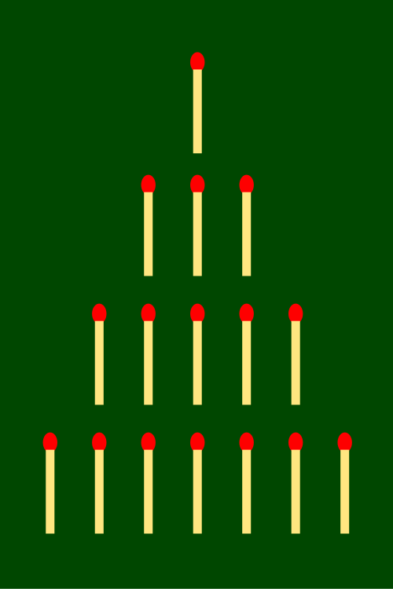
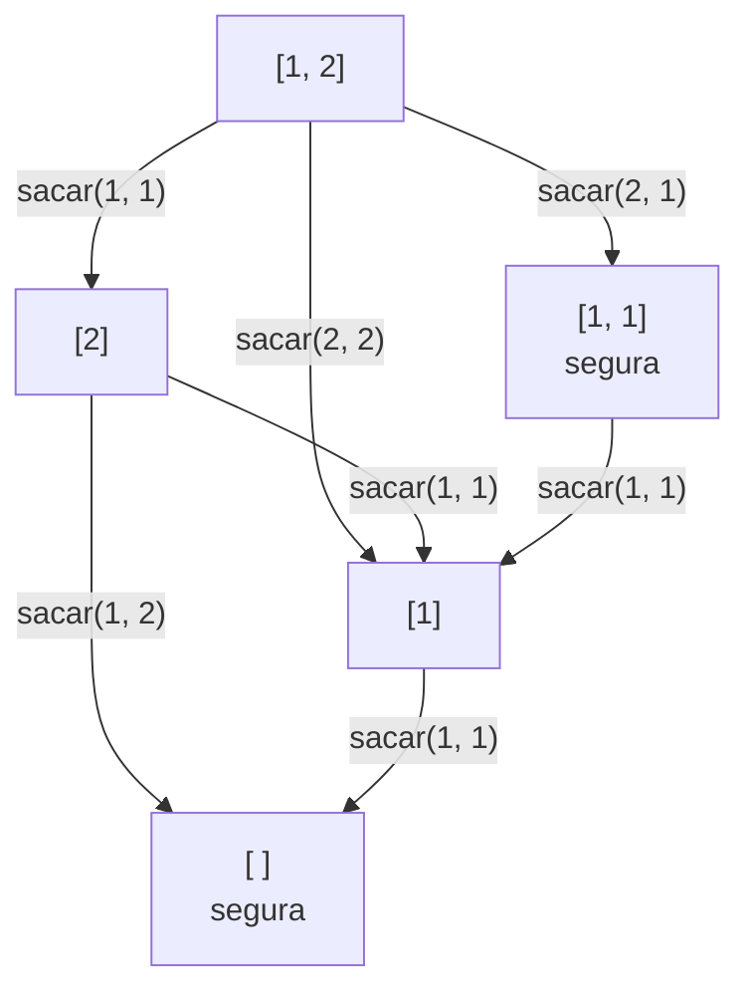

# Capítulo 78 — Proyecto: Kalah, Mastermind y Nim

El [capítulo 41](../capitulo-41-juegos/index.md) escribió una búsqueda que
juega cualquier juego de dos jugadores descrito con cinco predicados, y la
probó con el ta-te-ti. Este capítulo la usa en dos juegos más y agrega un
tercero que no es de dos jugadores, y en cada uno la manera de elegir la
jugada es distinta. En **Nim**, la búsqueda en el árbol de la partida da
la jugada correcta pero tarda minutos; la tabulación la da en centésimas
de segundo, y una fórmula, la **suma de Nim**, la da sin buscar. En
**Mastermind**, el programa adivina un código secreto proponiendo siempre
un código que explica todas las respuestas recibidas. En **Kalah**, un
juego de siembra con capturas y turnos extra, el árbol es demasiado grande
para recorrerlo y el programa juega con la poda alfa-beta y una función de
evaluación, como un programa de ajedrez:

```text
     6  6  7  7  7  7
  0                    2
     0  7  7  0  8  8
   (1)(2)(3)(4)(5)(6)
La computadora juega [1].
     7  7  8  8  8  0
  1                    2
     1  7  7  0  8  8
   (1)(2)(3)(4)(5)(6)
Tu jugada: 2
```

El tablero muestra abajo los hoyos de la persona, con sus números, y a la
derecha su kalah, donde guarda las piedras; arriba, los de la
computadora, que acaba de sembrar su hoyo 1.

Los tres programas vienen del capítulo «Game-Playing Programs» de *The Art
of Prolog* de Leon Sterling y Ehud Shapiro (MIT Press, 2.ª edición, 1994),
que juega Mastermind con la regla de la jugada consistente, Nim con la
suma de Nim y Kalah con la poda alfa-beta. La teoría de Nim es la del
artículo de Charles Bouton de 1901, que la formuló y la demostró. El
capítulo reescribe los programas con los predicados actuales de
SWI-Prolog, sin `assert`, y les agrega lo que el libro no tiene: la
comparación con la búsqueda, las mediciones y las pruebas. La lista
completa de las fuentes, con lo que se toma de cada una, está en las
[Referencias](#referencias).

El capítulo cumple tres anuncios: el del
[capítulo 41](../capitulo-41-juegos/index.md) (Kalah con la poda
alfa-beta; Mastermind y Nim), el del
[capítulo 71](../capitulo-71-proyecto-grafos-o/index.md) (la estrategia
ganadora de Nim calculada con la suma de Nim en lugar de buscarla en el
grafo Y/O del juego) y el del
[capítulo 77](../capitulo-77-proyecto-mundo-wumpus/index.md) (Mastermind
como el descarte de las hipótesis que no explican las respuestas). Carga
sin copiarla la búsqueda del [capítulo 41](../capitulo-41-juegos/index.md), y usa las restricciones del
[capítulo 23](../capitulo-23-programacion-con-restricciones/index.md) y la
tabulación del [capítulo 39](../capitulo-39-tabulacion/index.md). Todos los
archivos son `% solo-local`: son módulos que cargan otros.

## Objetivos del capítulo

Al terminar el capítulo, el lector puede:

- describir un juego nuevo para la búsqueda del [capítulo 41](../capitulo-41-juegos/index.md), agregando sus
  cláusulas a un módulo cargado desde otro capítulo;
- medir lo que cuesta buscar en el árbol de un juego cuyas posiciones se
  repiten, y quitar ese costo con la tabulación;
- reemplazar una búsqueda por una propiedad que la decide sin buscar, y
  verificar la propiedad contra la búsqueda;
- adivinar con la regla de la hipótesis consistente, escrita como generar
  y probar, como un conjunto que se filtra y como restricciones, y
  comparar las tres;
- programar las reglas de un juego de siembra, con vueltas al tablero,
  turnos extra y capturas, como relaciones sobre un tablero;
- jugar partidas entre estrategias pasadas como argumento, y contra una
  persona, con el núcleo de cada juego separado de la terminal.

!!! info "Tiempo estimado"
    Leer el capítulo, ejecutar sus ejemplos y hacer las actividades: **1:50 h**.
    Resolver los 5 ejercicios marcados con ★: **1:05 h**.
    Resolver los 11 ejercicios del final: **3:15 h**.

## 78.1 Tres maneras de elegir una jugada

Los tres juegos se resuelven con tres ideas distintas, y el capítulo las
mide sobre los mismos casos:

| Juego | Qué recibe el programa | Cómo elige | Lo que cuesta |
|---|---|---|---|
| Nim | las pilas | busca en el árbol de la partida, o calcula la suma de Nim | 25 millones de posiciones con alfa-beta; 137 tabulando; ninguna con la suma |
| Mastermind | las respuestas a sus intentos | propone el primer código que las explica todas | 5,56 intentos de media sobre los 5040 códigos |
| Kalah | el tablero | alfa-beta hasta una profundidad, con la diferencia de kalahs como evaluación | de 11 posiciones a profundidad 1 a 4 446 a profundidad 6, en la primera jugada |

Nim es el caso en que la búsqueda tiene una alternativa exacta: un
teorema dice qué posiciones son ganadoras, y la jugada correcta se
calcula. En Mastermind no hay adversario, sino un código fijo y
desconocido; lo que se busca es una **hipótesis** consistente con lo
observado, como los mundos consistentes del
[capítulo 77](../capitulo-77-proyecto-mundo-wumpus/index.md#775-version-3-el-agente-basado-en-conocimiento).
Kalah es el caso general: ni hay fórmula ni cabe la búsqueda completa, y
el programa juega tan bien como su evaluación y su profundidad lo
permiten.

## 78.2 El programa terminado

| Versión | Archivo | Agrega | Lo que no puede hacer todavía |
|---|---|---|---|
| — | `capitulo41.pl` | la poda alfa-beta y la profundización del [capítulo 41](../capitulo-41-juegos/index.md), en un módulo | — |
| — | `partida.pl` | partidas entre estrategias, y contra una persona | — |
| Nim 1 | `nim.pl` | las reglas; la posición ganadora buscada en el árbol | buscar sin repetir posiciones |
| Nim 2 | `nim.pl` | la búsqueda tabulada y el jugador | decidir sin buscar |
| Nim 3 | `nim.pl` | la suma de Nim | — |
| Mastermind 1 | `mastermind.pl` | el código, las respuestas, la jugada consistente | evitar revisar cada vez los mismos códigos |
| Mastermind 2 | `candidatos.pl` | el conjunto de los códigos posibles; la partida contra una persona | — |
| Mastermind 3 | `restricciones.pl` | la jugada consistente como restricciones | — |
| Kalah 1 | `kalah.pl` | el tablero, la siembra, las capturas | elegir una jugada |
| Kalah 2 | `kalah.pl` | el juego para la búsqueda del [capítulo 41](../capitulo-41-juegos/index.md); el jugador | ver más allá de su horizonte |

`capitulo41.pl` carga `profundizacion.pl` del [capítulo 41](../capitulo-41-juegos/index.md) dentro de un
módulo, como el [capítulo 71](../capitulo-71-proyecto-grafos-o/index.md)
carga `tateti.pl`:

<!-- ejemplo: capitulo-78/capitulo41.pl fragmento: :- module(capitulo41, .. :- load_files(capitulo41:'../capitulo-41/profundizacion', []). -->
```prolog
:- module(capitulo41,
          [ alfabeta/6,
            profundizar/6,
            inicial/2,
            jugada/4,
            turno/3,
            fin/3,
            valor_final/3,
            evaluar/3
          ]).

:- multifile
    inicial/2,
    jugada/4,
    turno/3,
    fin/3,
    valor_final/3,
    evaluar/3,
    completa/4.

:- load_files(capitulo41:'../capitulo-41/profundizacion', []).
```

La búsqueda del [capítulo 41](../capitulo-41-juegos/index.md) llama a `inicial/2`, `jugada/4`, `turno/3`,
`fin/3`, `valor_final/3` y `evaluar/3` dentro del módulo donde se cargó, y
`profundizar/6` llama además a `completa/4`. Esos predicados están
definidos en `profundizacion.pl` para el ta-te-ti; declararlos `multifile`
antes de cargar el archivo permite que otros archivos agreguen cláusulas
para sus juegos, con el nombre del módulo delante: `nim.pl` define
`capitulo41:jugada(nim(_), …)` y `kalah.pl`,
`capitulo41:jugada(kalah(_), …)`. Las cláusulas del ta-te-ti siguen ahí, y
cada juego toma las suyas por el primer argumento o por la forma de la
posición. El [capítulo 41](../capitulo-41-juegos/index.md) no cambia.
Es el patrón 79:

!!! example "Patrón 79 — Cláusulas para un módulo cargado"
    **Problema.** Un programa de otro capítulo, o de otra persona, llama a
    predicados que describen un caso, como la búsqueda del
    [capítulo 41](../capitulo-41-juegos/index.md) llama a `jugada/4` o a
    `fin/3`, y es necesario agregarle casos nuevos sin copiarlo ni
    modificarlo.

    **Versión ingenua.** Copiar el archivo en cada programa nuevo, como
    hacen los ejemplos del [capítulo 41](../capitulo-41-juegos/index.md) para correr en SWISH: las 265
    líneas de `profundizacion.pl` en `nim.pl` y en `kalah.pl`, con pruebas
    que verifiquen que las copias siguen iguales al original. O cargarlo y
    escribir las cláusulas nuevas con el módulo delante sin más: SWI-Prolog
    avisa `Redefined static procedure capitulo41:inicial/2`, borra las
    cláusulas del ta-te-ti y deja solo las del juego nuevo.

    **Patrón.** Un archivo puente define el módulo, declara `multifile`
    los predicados que el programa cargado deja abiertos, y recién
    después lo carga con `load_files/2` dentro de ese módulo. Cada archivo
    que agrega un caso escribe sus cláusulas con el nombre del módulo
    delante, `capitulo41:jugada(nim(_), …)`, y las distingue de las otras
    por el primer argumento o por la forma de la posición. El programa
    cargado no cambia, y todos los casos conviven.

    **Cuándo no usarlo.** Cuando el programa cargado ya ofrece un
    argumento para pasar la conducta, como las estrategias de `partida/5`:
    pasarla es más simple y más local que agregar cláusulas a un módulo
    ajeno. Cuando los casos nuevos se superponen con los existentes, es
    decir, cuando dos juegos pueden unificar la misma cabeza: las
    cláusulas de uno dan respuestas al otro. Y cuando el programa cargado
    corta en las cláusulas que se extienden, porque el orden de los
    archivos decide entonces el resultado.

## 78.3 Nim, versión 1: las reglas y la búsqueda

Hay varias pilas de fichas. Cada jugador, en su turno, saca de una sola
pila entre una ficha y todas, y gana quien saca la última. Una posición es
la lista de las pilas; una pila vacía queda en la lista con 0, para que
las pilas conserven su número. Una jugada es `sacar(K, M)`: sacar `M`
fichas de la pila `K`.



La posición de partida de Nim que proponen Sterling y Shapiro: pilas de 1,
3, 5 y 7 fósforos. Imagen: Uncopy,
[CC BY-SA 3.0](https://creativecommons.org/licenses/by-sa/3.0), vía
[Wikimedia Commons](https://commons.wikimedia.org/wiki/File:NimGame.svg).

<!-- ejemplo: capitulo-78/nim.pl predicado: sacar/3 vacias/1 -->
```prolog
%!  sacar(+Pilas:list(integer), ?Jugada, -Pilas1:list(integer)) is nondet.
%
%   Pilas1 son las Pilas después de Jugada, sacar(K, M): sacar M fichas,
%   entre 1 y todas, de la pila K. Enumera las jugadas pila por pila, y en
%   cada pila de una ficha en adelante.
sacar(Pilas, sacar(K, M), Pilas1) :-
    nth1(K, Pilas, P, Resto),
    between(1, P, M),
    P1 is P - M,
    nth1(K, Pilas1, P1, Resto).

%!  vacias(+Pilas:list(integer)) is semidet.
%
%   No queda ninguna ficha: el jugador que sacó la última ganó.
vacias(Pilas) :-
    sum_list(Pilas, 0).
```

```prolog
?- findall(J-P, sacar([1, 2], J, P), L).
L = [sacar(1, 1)-[0, 2], sacar(2, 1)-[1, 1], sacar(2, 2)-[1, 0]].
```

El que mueve **gana** si tiene una jugada tras la cual el rival no gana; y
si no quedan fichas, el que mueve ya perdió, porque el otro sacó la
última. Es la posición ganada del
[capítulo 41](../capitulo-41-juegos/index.md#411-posiciones-jugadas-y-fin-de-partida),
un árbol Y/O, con un solo caso: la posición sin fichas no tiene jugadas,
así que `ganadora/1` falla en ella sin una cláusula aparte.

<!-- ejemplo: capitulo-78/nim.pl predicado: ganadora/1 -->
```prolog
%!  ganadora(+Pilas:list(integer)) is semidet.
%
%   El jugador que mueve en Pilas gana, juegue lo que juegue el rival:
%   tiene una jugada que deja una posición que no es ganadora para el otro.
%   Si no quedan fichas, el que mueve ya perdió. Recorre el árbol de la
%   partida, sin recordar las posiciones ya resueltas.
ganadora(Pilas) :-
    sacar(Pilas, _, Pilas1),
    \+ ganadora(Pilas1),
    !.
```

```prolog
?- ganadora([1, 3, 5]).
true.

?- ganadora([1, 2, 3]).
false.
```

Con 1, 3 y 5 fichas, el que mueve gana; con 1, 2 y 3, pierde. La posición
de partida que propone el libro, `[1, 3, 5, 7]`, también es perdedora para
el que mueve, y `ganadora/1` necesita recorrer el árbol entero para
probarlo, porque cada jugada del primero tiene una respuesta y hay que
examinarlas todas. La consulta `time(\+ ganadora([1, 3, 5, 7]))` tarda más
de un minuto, más que el límite de 15 segundos con que se verifican las
consultas del curso, así que se muestra la medición registrada en una
computadora con un AMD Ryzen 9 5900HX y SWI-Prolog 9.2.9 para Windows:

```text
% 532,140,219 inferences, 78.688 CPU in 79.866 seconds (99% CPU, 6762703 Lips)
```

### La alfa-beta del capítulo 41 sobre Nim

La poda alfa-beta del [capítulo 41](../capitulo-41-juegos/index.md) sirve para cualquier juego que se
describa con sus predicados. `nim.pl` describe Nim al final del archivo:
la posición es `pilas(Pilas, Jugador)`, con el jugador `uno`, que es max,
o `dos`; la partida termina sin fichas, con la victoria del rival del que
mueve; una victoria vale 100 o −100, y la evaluación de una posición
intermedia es 0, porque la búsqueda llega siempre al final de la partida.

<!-- ejemplo: capitulo-78/nim.pl fragmento: es pilas(Pilas, Jugador): las pilas .. extremo(min, -100). -->
```prolog
% La posición del capítulo 41 es pilas(Pilas, Jugador): las pilas y el
% jugador que mueve, uno o dos. uno es max.

% inicial(nim(Pilas), P): la partida empieza con Pilas, y mueve uno.
capitulo41:inicial(nim(Pilas), pilas(Pilas, uno)).

%!  capitulo41:jugada(+Juego, +Posicion, ?Jugada, -Siguiente) is nondet.
%
%   En Nim, Jugada saca fichas de una pila con sacar/3, y el turno pasa
%   al rival.
capitulo41:jugada(nim(_), pilas(Pilas, J), Jugada, pilas(Pilas1, Otro)) :-
    sacar(Pilas, Jugada, Pilas1),
    rival(J, Otro).

%!  capitulo41:turno(+Juego, +Posicion, -Lado) is det.
%
%   En Nim, uno es max y dos es min.
capitulo41:turno(nim(_), pilas(_, J), Lado) :-
    lado(J, Lado).

%!  capitulo41:fin(+Juego, +Posicion, -Resultado) is semidet.
%
%   En Nim, la partida termina sin fichas, y gana el rival del que mueve,
%   que sacó la última. Falla si quedan fichas.
capitulo41:fin(nim(_), pilas(Pilas, J), gana(Otro)) :-
    vacias(Pilas),
    rival(J, Otro).

%!  capitulo41:valor_final(+Resultado, +Posicion, -Valor) is det.
%
%   En Nim, una victoria vale 100 para max y -100 para min.
capitulo41:valor_final(gana(J), pilas(_, _), Valor) :-
    lado(J, Lado),
    extremo(Lado, Valor).

% evaluar(nim(_), P, 0): Nim se busca hasta el final; la evaluación es nula.
capitulo41:evaluar(nim(_), pilas(_, _), 0).

% rival(J, K): K es el rival de J.
rival(uno, dos).
rival(dos, uno).

% lado(J, L): el jugador J es L, max o min.
lado(uno, max).
lado(dos, min).

% extremo(L, V): V es el valor de una victoria de L.
extremo(max, 100).
extremo(min, -100).
```

```prolog
?- alfabeta(nim([1, 3, 5]), pilas([1, 3, 5], uno), 20, J, V, N).
J = sacar(3, 3),
V = 100,
N = 6077.

?- alfabeta(nim([1, 2, 3]), pilas([1, 2, 3], uno), 20, J, V, N).
J = sacar(1, 1),
V = -100,
N = 249.
```

Con 20 jugadas de profundidad, más que las fichas, la búsqueda llega al
final de toda partida. En `[1, 3, 5]` encuentra la jugada ganadora, sacar
3 de la tercera pila, visitando 6 077 posiciones con 265 013 inferencias;
en `[1, 2, 3]`, el valor −100 dice que el que mueve pierde, y la jugada es
la primera, porque todas dan lo mismo. En `[1, 3, 5, 7]`, la medición
registrada en la misma computadora, con
`time(alfabeta(nim([1, 3, 5, 7]), pilas([1, 3, 5, 7], uno), 20, J, V, N))`,
da `J = sacar(1, 1)`, `V = -100` y `N = 25060978`, y esta línea de
`time/1`:

```text
% 1,193,649,522 inferences, 205.906 CPU in 210.643 seconds (98% CPU, 5797053 Lips)
```

Veinticinco millones de posiciones y casi tres minutos y medio, más que
`ganadora/1`, que no lleva valores ni cotas. La poda no alcanza: en una
posición perdedora no hay ninguna jugada que llegue a la cota del rival, y
todas se buscan. Y la búsqueda visita muchas veces la misma posición:
sacar una ficha de la pila 1 y después una de la pila 2 lleva al mismo
lugar que hacerlo en el orden inverso, y `[1, 3, 0, 7]` gana o pierde
igual que `[0, 1, 3, 7]` o que `[7, 3, 1]`. La alfa-beta resuelve cada una
de esas posiciones como si fuera nueva.

!!! question "Actividad"
    Predecir si gana el que mueve en `[1, 1]`, en `[2, 2]`, en `[1, 2]` y
    en `[3, 3, 3]`, y qué jugada elige `alfabeta/6` en cada una con
    profundidad 10. Comprobarlo.

## 78.4 Nim, versión 2: las posiciones repetidas, tabuladas

El grafo de las formas de `[1, 2]` muestra el problema en pequeño. Cada
flecha es una jugada, y las formas seguras, de suma de Nim 0, están
marcadas; la forma `[1]` se alcanza por tres caminos, y un árbol la
repetiría tres veces:



Desde `[1, 2]`, el que mueve gana dejando `[1, 1]`: desde ahí, el rival
solo puede dejar `[1]`, y el primero saca la última ficha.

El orden de las pilas y las pilas vacías no cambian quién gana. La
**forma** de una posición son sus pilas no vacías, de menor a mayor, y la
versión tabulada de la búsqueda trabaja sobre formas: una tabla del
[capítulo 39](../capitulo-39-tabulacion/index.md#392-memorizacion-sin-estado-escrito-a-mano)
guarda la respuesta de cada forma, y cada una se resuelve una sola vez.

<!-- ejemplo: capitulo-78/nim.pl predicado: ganadora_tabulada/1 ganadora_forma/1 forma/2 posiciones/1 -->
```prolog
%!  ganadora_tabulada(+Pilas:list(integer)) is semidet.
%
%   Como ganadora/1, pero cada posición distinta se resuelve una sola vez:
%   la tabla guarda la forma de la posición, y dos posiciones con las
%   mismas pilas en otro orden, o con otras pilas vacías, comparten la
%   respuesta.
ganadora_tabulada(Pilas) :-
    forma(Pilas, Forma),
    ganadora_forma(Forma).

%!  ganadora_forma(+Forma:list(integer)) is semidet.
%
%   ganadora/1 sobre la forma de una posición, tabulada.
ganadora_forma(Forma) :-
    once(( sacar(Forma, _, Pilas1),
           forma(Pilas1, Forma1),
           \+ ganadora_forma(Forma1) )).

%!  forma(+Pilas:list(integer), -Forma:list(integer)) is det.
%
%   Forma son las pilas no vacías de Pilas, de menor a mayor: el orden de
%   las pilas y las vacías no cambian quién gana.
forma(Pilas, Forma) :-
    exclude(==(0), Pilas, NoVacias),
    msort(NoVacias, Forma).

%!  posiciones(-Cantidad:integer) is det.
%
%   Cantidad es el número de formas distintas resueltas por
%   ganadora_tabulada/1 desde el último abolish_all_tables/0: una tabla por
%   forma. current_table/2 busca la variante exacta que recibe; por eso la
%   llamada va con la variable libre y el filtro después.
posiciones(Cantidad) :-
    aggregate_all(count,
                  ( current_table(Variante, _),
                    Variante = ganadora_forma(_) ),
                  Cantidad).
```

`ganadora_forma/1` es `ganadora/1` con `once/1` en lugar del corte, porque
es el cuerpo de un predicado tabulado, y con la forma de cada posición
siguiente. La negación es la de Prolog, `\+`, y termina: cada jugada saca
fichas, así que la forma siguiente es siempre más chica y no hay ciclos.

```prolog
?- forma([3, 0, 1, 3], F).
F = [1, 3, 3].

?- abolish_all_tables, \+ ganadora_tabulada([1, 3, 5, 7]), posiciones(N).
N = 137.
```

```text
?- time(\+ ganadora_tabulada([1, 3, 5, 7])).
% 70,869 inferences, 0.031 CPU in 0.029 seconds (109% CPU, 2267808 Lips)
true.
```

De `[1, 3, 5, 7]` se llega a 137 formas distintas, y la búsqueda tabulada
las resuelve con 70 869 inferencias, en tres centésimas de segundo:
dieciséis mil veces menos inferencias que la alfa-beta. El árbol de la
partida tiene 25 millones de nodos porque cada forma aparece en él por
muchos caminos; el **grafo** del juego, con una sola copia de cada forma,
tiene 137, como los subproblemas compartidos de la
[sección 71.7](../capitulo-71-proyecto-grafos-o/index.md#717-version-5-subproblemas-compartidos).
Es el mismo efecto que las
[tablas de transposición](../capitulo-41-juegos/transposicion.md#tablas-de-transposicion-con-tabulacion)
del ta-te-ti, mayor aquí porque las formas juntan además las posiciones
que solo difieren en el orden de las pilas.

| Búsqueda de `[1, 3, 5, 7]` | Posiciones | Inferencias | Tiempo |
|---|---|---|---|
| `alfabeta/6` del [capítulo 41](../capitulo-41-juegos/index.md) | 25 060 978 | 1 193 649 522 | 206 s |
| `ganadora/1` | — | 532 140 219 | 79 s |
| `ganadora_tabulada/1` | 137 | 70 869 | 0,03 s |

### El jugador de Nim

El jugador del capítulo usa la búsqueda tabulada: juega la primera jugada
que deja al rival en una posición que no es ganadora, y si no hay
ninguna, saca una ficha de la primera pila con fichas, a la espera de un
error del rival.

<!-- ejemplo: capitulo-78/nim.pl predicado: jugada_ganadora/2 una_ficha/2 tabulada/3 -->
```prolog
%!  jugada_ganadora(+Pilas:list(integer), -Jugada) is semidet.
%
%   Jugada es la primera jugada que deja al rival en una posición que no
%   es ganadora, según ganadora_tabulada/1. Falla si Pilas no es ganadora.
jugada_ganadora(Pilas, Jugada) :-
    once(( sacar(Pilas, Jugada, Pilas1),
           \+ ganadora_tabulada(Pilas1) )).

%!  una_ficha(+Pilas:list(integer), -Jugada) is semidet.
%
%   Jugada saca una ficha de la primera pila no vacía: la jugada de quien
%   no puede ganar, a la espera de un error del rival. Falla si no quedan
%   fichas.
una_ficha(Pilas, sacar(K, 1)) :-
    once(( nth1(K, Pilas, P),
           P > 0 )).

%!  tabulada(+Juego, +Posicion, -Jugada) is semidet.
%
%   La estrategia del jugador de Nim, con los argumentos de las
%   estrategias de partida.pl: el juego, la posición y la jugada elegida.
%   Juega la primera jugada ganadora, si la hay, y si no, una ficha.
tabulada(nim(_), pilas(Pilas, _), Jugada) :-
    (   jugada_ganadora(Pilas, J)
    ->  Jugada = J
    ;   una_ficha(Pilas, Jugada)
    ).
```

`tabulada/3` tiene los tres argumentos de una **estrategia** de
`partida.pl`: el juego, la posición y la jugada. `partida/5` juega una
partida entera entre dos estrategias, que recibe como argumentos y llama
con `call/4`, sin conocerlas por dentro, como el intérprete del
[patrón 60](../patrones.md#60-interprete-con-conducta-como-parametro):

<!-- ejemplo: capitulo-78/partida.pl predicado: partida/5 partida/6 estrategia/4 primera/3 profundidad/4 -->
```prolog
%!  partida(+Juego, :Max, :Min, -Jugadas:list, -Resultado) is det.
%
%   Jugadas es la partida entera de Juego desde su posición inicial, con la
%   estrategia Max para el jugador max y Min para el jugador min, y
%   Resultado, el de fin/3.
partida(Juego, Max, Min, Jugadas, Resultado) :-
    inicial(Juego, Posicion),
    partida(Juego, Posicion, Max, Min, Jugadas, Resultado).

%!  partida(+Juego, +Posicion, :Max, :Min, -Jugadas:list, -Resultado)
%!      is det.
%
%   Como partida/5, desde Posicion.
partida(Juego, Posicion, Max, Min, Jugadas, Resultado) :-
    (   fin(Juego, Posicion, R)
    ->  Jugadas = [],
        Resultado = R
    ;   turno(Juego, Posicion, Lado),
        estrategia(Lado, Max, Min, Estrategia),
        call(Estrategia, Juego, Posicion, Jugada),
        once(jugada(Juego, Posicion, Jugada, Siguiente)),
        Jugadas = [Jugada|Resto],
        partida(Juego, Siguiente, Max, Min, Resto, Resultado)
    ).

% estrategia(Lado, Max, Min, E): E es la estrategia del que juega del Lado.
estrategia(max, Max, _, Max).
estrategia(min, _, Min, Min).

%!  primera(+Juego, +Posicion, -Jugada) is semidet.
%
%   Jugada es la primera jugada legal de Posicion. Falla si no hay.
primera(Juego, Posicion, Jugada) :-
    once(jugada(Juego, Posicion, Jugada, _)).

%!  profundidad(+D:integer, +Juego, +Posicion, -Jugada) is det.
%
%   Jugada es la que elige alfabeta/6 del capítulo 41 buscando D jugadas
%   hacia adelante.
profundidad(D, Juego, Posicion, Jugada) :-
    alfabeta(Juego, Posicion, D, Jugada, _, _).
```

<!-- contexto: capitulo-78/nim.pl -->
```prolog
?- jugada_ganadora([1, 3, 5], J).
J = sacar(3, 3).

?- partida(nim([1, 3, 5]), nim:tabulada, primera, Js, R).
Js = [sacar(3, 3), sacar(1, 1), sacar(2, 1), sacar(2, 1), sacar(3, 1), sacar(2, 1), sacar(3, 1)],
R = gana(uno).

?- partida(nim([1, 2, 3]), primera, nim:tabulada, Js, R).
Js = [sacar(1, 1), sacar(3, 1), sacar(2, 1), sacar(3, 1), sacar(2, 1), sacar(3, 1)],
R = gana(dos).
```

La partida es el patrón 80:

!!! example "Patrón 80 — Estrategia como argumento"
    **Problema.** Un mismo juego se juega con varias maneras de elegir la
    jugada (la búsqueda tabulada, la suma de Nim, la alfa-beta a cierta
    profundidad, una persona), y es necesario enfrentarlas entre sí sin
    escribir una partida para cada par.

    **Versión ingenua.** Una partida por combinación, o una partida con un
    `(   Max == suma -> … ;   Max == tabulada -> … )` que enumera las
    estrategias: cada estrategia nueva cambia la partida, y el torneo de
    la [sección 78.10](#7810-kalah-version-2-el-jugador-con-alfa-beta),
    con cinco profundidades, necesitaría veinte combinaciones.

    **Patrón.** Una estrategia es un predicado que recibe el juego y la
    posición y devuelve la jugada; se pasa sin sus tres últimos
    argumentos, como `nim:tabulada` o `profundidad(4)`, y la partida la
    llama con `call/4`. La partida no conoce ninguna estrategia: solo
    alterna los turnos, comprueba la jugada con `jugada/4` y termina con
    `fin/3`. Es una aplicación del
    [patrón 60](../patrones.md#60-interprete-con-conducta-como-parametro),
    con una diferencia: en el patrón 60 la conducta que se pasa da el
    significado de toda la estructura que el intérprete recorre; aquí hay
    dos conductas, una por jugador, que se alternan, y cada una decide
    una sola jugada por llamada.

    **Cuándo no usarlo.** Cuando la estrategia necesita estado propio
    entre jugadas, como una tabla que crece o un reloj: la llamada recibe
    solo el juego y la posición, y ese estado debe ir en la posición o
    fuera de la partida. Y cuando hay una sola manera de elegir la jugada:
    el argumento agrega una indirección sin dar nada a cambio.

Desde `[1, 3, 5]` el jugador tabulado, que mueve primero, deja `[1, 3, 2]`
y gana. Desde `[1, 2, 3]` pierde quien mueve, y el tabulado, que mueve
segundo, gana contra la estrategia `primera`, que saca siempre una ficha
de la primera pila no vacía. `jugar/4` juega contra una persona, que
escribe en cada turno el número de la pila y la cantidad de fichas;
`pantalla/3` y `leer_jugada/4`, dos predicados `multifile` de
`partida.pl`, son los que cada juego define para mostrarse y para leer
una jugada:

<!-- ejemplo: capitulo-78/partida.pl predicado: jugar/4 bucle/5 pedir/4 -->
```prolog
%!  jugar(+Juego, :Max, :Min, +In) is det.
%
%   Juega Juego mostrando cada posición. Una de las estrategias, o las dos,
%   puede ser persona: sus jugadas se leen de In, una por línea, con
%   leer_jugada/4 del juego. La partida termina al final del juego o al
%   final de In.
jugar(Juego, Max, Min, In) :-
    inicial(Juego, Posicion),
    bucle(Juego, Posicion, Max, Min, In).

%!  bucle(+Juego, +Posicion, :Max, :Min, +In) is det.
%
%   Muestra Posicion y sigue la partida desde ella.
bucle(Juego, Posicion, Max, Min, In) :-
    mostrar(Juego, Posicion),
    (   fin(Juego, Posicion, Resultado)
    ->  anunciar(Juego, Posicion, Resultado, Max, Min)
    ;   turno(Juego, Posicion, Lado),
        estrategia(Lado, Max, Min, Estrategia),
        (   persona(Estrategia)
        ->  pedir(Juego, Posicion, In, Jugada)
        ;   call(Estrategia, Juego, Posicion, Jugada),
            format("La computadora juega ~W.~n",
                   [Jugada, [spacing(next_argument)]])
        ),
        (   Jugada == abandono
        ->  format("Partida abandonada.~n")
        ;   once(jugada(Juego, Posicion, Jugada, Siguiente)),
            bucle(Juego, Siguiente, Max, Min, In)
        )
    ).

%!  pedir(+Juego, +Posicion, +In, -Jugada) is det.
%
%   Jugada es la primera línea de In que leer_jugada/4 traduce a una jugada
%   legal en Posicion, o abandono si In se termina antes.
pedir(Juego, Posicion, In, Jugada) :-
    format("Tu jugada: "),
    read_line_to_string(In, Linea),
    (   Linea == end_of_file
    ->  nl,
        Jugada = abandono
    ;   format("~w~n", [Linea]),
        leer_jugada(Juego, Posicion, Linea, J),
        jugada(Juego, Posicion, J, _)
    ->  Jugada = J
    ;   format("Esa jugada no es válida.~n"),
        pedir(Juego, Posicion, In, Jugada)
    ).
```

Las pruebas leen las jugadas de una cadena con `open_string/2`, nunca del
teclado. Con `jugar(nim([1, 3, 5, 7]), persona, nim:tabulada, In)` y las
líneas `4 7`, `2 3` y `1 1`:

```text
Pila 1: 1 |
Pila 2: 3 |||
Pila 3: 5 |||||
Pila 4: 7 |||||||
Tu jugada: 4 7
Pila 1: 1 |
Pila 2: 3 |||
Pila 3: 5 |||||
Pila 4: 0
La computadora juega sacar(3, 3).
Pila 1: 1 |
Pila 2: 3 |||
Pila 3: 2 ||
Pila 4: 0
Tu jugada: 2 3
Pila 1: 1 |
Pila 2: 0
Pila 3: 2 ||
Pila 4: 0
La computadora juega sacar(3, 1).
Pila 1: 1 |
Pila 2: 0
Pila 3: 1 |
Pila 4: 0
Tu jugada: 1 1
Pila 1: 0
Pila 2: 0
Pila 3: 1 |
Pila 4: 0
La computadora juega sacar(3, 1).
Pila 1: 0
Pila 2: 0
Pila 3: 0
Pila 4: 0
Gana la computadora.
```

## 78.5 Nim, versión 3: la suma de Nim

Bouton demostró en 1901 qué posiciones de Nim pierde el que mueve. Se
escriben los tamaños de las pilas en binario, uno debajo del otro, y se
suma cada columna: si todas las sumas son pares, la posición es
**segura** para el que acaba de jugar, y el que mueve pierde contra un
rival que no se equivoca. Para `[1, 3, 5, 7]`:

```text
  1 = 001
  3 = 011
  5 = 101
  7 = 111
      ---
      2 2 4   todas pares: segura
```

Sumar cada columna módulo 2 es el **o exclusivo** bit a bit, el operador
`xor` de `is/2`; el resultado es la **suma de Nim** de las pilas, y una
posición es segura si su suma de Nim es 0. La demostración tiene dos
partes, los teoremas I y II del artículo. Desde una posición segura, toda
jugada deja una insegura: una jugada cambia una sola pila, y la pila que
deja la suma en 0 junto con las demás es única, la que había. Desde una
insegura hay siempre una jugada que deja una segura: se toma la columna
más a la izquierda cuya suma es impar, una pila P con un 1 en esa columna,
y se la reemplaza por P xor S, con S la suma de Nim; ese número tiene un 0
donde P tenía el 1 y las columnas de la izquierda iguales, así que es
menor que P, y la suma de Nim pasa a ser 0. Quien deja una posición segura
la puede volver a dejar después de cada jugada del rival, y como las
fichas se terminan, es el que saca la última.

<!-- ejemplo: capitulo-78/nim.pl predicado: suma_nim/2 xor_pila/3 segura/1 jugada_segura/2 elegir/2 suma/3 -->
```prolog
%!  suma_nim(+Pilas:list(integer), -Suma:integer) is det.
%
%   Suma es la suma de Nim de las pilas: el o exclusivo de sus tamaños,
%   que en binario suma cada columna módulo 2.
suma_nim(Pilas, Suma) :-
    foldl(xor_pila, Pilas, 0, Suma).

%!  xor_pila(+Pila:integer, +S0:integer, -S:integer) is det.
%
%   S es S0 xor Pila.
xor_pila(Pila, S0, S) :-
    S is S0 xor Pila.

%!  segura(+Pilas:list(integer)) is semidet.
%
%   Pilas es una posición segura: su suma de Nim es 0, y el jugador que
%   mueve pierde si el rival no se equivoca.
segura(Pilas) :-
    suma_nim(Pilas, 0).

%!  jugada_segura(+Pilas:list(integer), -Jugada) is nondet.
%
%   Jugada deja una posición segura. Una pila P la permite si P xor S, con
%   S la suma de Nim, es menor que P: se sacan las fichas que sobran. Falla
%   si Pilas ya es segura.
jugada_segura(Pilas, sacar(K, M)) :-
    suma_nim(Pilas, S),
    S =\= 0,
    nth1(K, Pilas, P),
    Q is P xor S,
    Q < P,
    M is P - Q.

%!  elegir(+Pilas:list(integer), -Jugada) is semidet.
%
%   Jugada es la primera jugada segura, si la hay; si la posición es
%   segura, saca una ficha de la primera pila no vacía, a la espera de un
%   error del rival. Falla si no quedan fichas.
elegir(Pilas, Jugada) :-
    (   jugada_segura(Pilas, J)
    ->  Jugada = J
    ;   una_ficha(Pilas, Jugada)
    ).

%!  suma(+Juego, +Posicion, -Jugada) is semidet.
%
%   La estrategia de la suma de Nim, con los argumentos de las estrategias
%   de partida.pl: el juego, la posición y la jugada elegida.
suma(nim(_), pilas(Pilas, _), Jugada) :-
    elegir(Pilas, Jugada).
```

```prolog
?- suma_nim([1, 3, 5, 7], S).
S = 0.

?- suma_nim([2, 6], S), jugada_segura([2, 6], J).
S = 4,
J = sacar(2, 4).

?- jugada_segura([7, 5, 12], J).
J = sacar(3, 10).

?- jugada_segura([3, 5, 7], J).
J = sacar(1, 1) ;
J = sacar(2, 1) ;
J = sacar(3, 1).

?- jugada_segura([1, 3, 5, 7], J).
false.
```

En `[2, 6]` la suma es 4, y la pila 2 se reduce a 6 xor 4 = 2: las dos
pilas quedan iguales, y el rival pierde, porque lo que saque de una la
otra lo copia. `[7, 5, 12]` es el ejemplo de Bouton: se dejan 2 fichas en
la pila de 12. En `[3, 5, 7]` las tres pilas permiten la jugada, y en
`[1, 3, 5, 7]` ninguna. Sterling y Shapiro calculan la suma con listas de
dígitos binarios y un predicado que compone el número nuevo dígito por
dígito; con `xor` de la aritmética de SWI-Prolog, la jugada segura es una
comparación.

La teoría no se acepta sin verificarla. Las pruebas de `nim.plt` comparan
la búsqueda con la suma en todas las posiciones de tres pilas de hasta 4
fichas (`ganadora/1`) y en todas las de tres pilas de hasta 7 y cuatro de
hasta 5 (`ganadora_tabulada/1`): en cada una, el que mueve gana si y solo
si la suma no es 0. Verifican también los dos teoremas en las 512
posiciones de tres pilas de hasta 7 fichas, y la lista de Bouton: las
combinaciones seguras de tres pilas distintas, no vacías y menores que 16
son 35.

```prolog
?- partida(nim([1, 3, 5, 7]), nim:tabulada, nim:suma, Js, R).
Js = [sacar(1, 1), sacar(2, 1), sacar(2, 1), sacar(4, 3), sacar(2, 1), sacar(3, 1), sacar(3, 1), sacar(4, 1), sacar(..., ...)|...],
R = gana(dos).
```

Entre dos jugadores perfectos, desde una posición segura gana el segundo.
La suma de Nim no necesita tabla, ni buscar, ni recordar nada: decide una
posición con tantas operaciones como pilas tiene, y es también una
evaluación perfecta para la alfa-beta, que con ella elige bien buscando
una sola jugada hacia adelante (el [ejercicio 3](#ejercicios)). Es lo que
el [capítulo 71](../capitulo-71-proyecto-grafos-o/index.md#718-version-6-estrategias-de-juego)
anunciaba: la estrategia ganadora de Nim se calcula, no se busca en el
grafo Y/O del juego.

!!! question "Actividad"
    Sin ejecutar nada, calcular la suma de Nim de `[4, 9, 13]` y de
    `[6, 10, 15]`, y dar una jugada segura en la que no sea 0. Comprobarlo
    con `suma_nim/2` y `jugada_segura/2`.

## 78.6 Mastermind, versión 1: la jugada consistente

El código secreto son cuatro dígitos distintos, y cada intento recibe los
toros y las vacas. La página
[Mastermind](mastermind.md#mastermind-version-1-la-jugada-consistente)
escribe la regla de Sterling y Shapiro: proponer siempre el primer código
que explica todas las respuestas recibidas. Sobre los 5040 secretos, la
media es de 5,56 intentos y el máximo, de 9.

## 78.7 Mastermind, versión 2: los códigos que todavía son posibles

La [versión 2](mastermind.md#mastermind-version-2-los-codigos-que-todavia-son-posibles)
guarda la lista de los códigos que todavía explican las respuestas, como
los mundos consistentes del
[capítulo 77](../capitulo-77-proyecto-mundo-wumpus/index.md), y juega
contra una persona: reconoce cuándo sus respuestas se contradicen.

## 78.8 Mastermind, versión 3: restricciones

La [versión 3](mastermind.md#mastermind-version-3-restricciones) escribe
la consistencia con las restricciones del
[capítulo 23](../capitulo-23-programacion-con-restricciones/index.md) y
la reificación. Las tres versiones hacen los mismos intentos, y medidas
sobre los 5040 secretos cuestan lo mismo dentro de un factor de 1,5.

## 78.9 Kalah, versión 1: el tablero y la siembra

La página [Kalah](kalah.md#kalah-version-1-el-tablero-y-la-siembra)
escribe las reglas de Kalah como relaciones sobre un tablero visto desde
el que mueve: la siembra en un anillo de trece casillas, las vueltas
completas, los turnos extra, las capturas y el barrido final, con tres
diferencias respecto del programa del libro.

## 78.10 Kalah, versión 2: el jugador con alfa-beta

La [versión 2](kalah.md#kalah-version-2-el-jugador-con-alfa-beta)
describe Kalah para la búsqueda del [capítulo 41](../capitulo-41-juegos/index.md) y juega partidas entre
profundidades: la profundidad 5 gana siete de sus ocho partidas, pero la 4
pierde como sur contra la 1, un efecto del horizonte de una evaluación que
solo cuenta los kalahs.

!!! success "Criterios de calidad"
    | Criterio | En este capítulo |
    |---|---|
    | C1 | cada predicado declara modos y determinación; `siguiente/2` y `siguiente_clp/2` aclaran que el intento debe llegar libre, y `turno_completo/3` que enumera los turnos |
    | C2 | representaciones limpias: `sacar(K, M)`, `r(Intento, Toros, Vacas)`, `tablero/4` y `k/2`; el texto de la terminal se arma aparte del núcleo |
    | C3 | la búsqueda del [capítulo 41](../capitulo-41-juegos/index.md) juega Nim y Kalah sin cambios, a través del puente; las estrategias son argumentos de `partida/5` |
    | C4 | `sembrar/4`, `capturar/3` y `barrer/2` deciden con si-entonces-sino y no dejan alternativas; `jugada_ganadora/2` y `una_ficha/2` usan `once/1` |
    | C6 | `partida/5` es pura; solo `jugar/4` y `jugar/1` leen y escriben, y sus pruebas leen de cadenas |
    | C7 | 109 pruebas en siete archivos, y 21 más sobre las soluciones; las tres versiones de Mastermind se comparan entre sí, la búsqueda de Nim con la suma, y la suma con los teoremas de Bouton |

## Ejercicios

Las soluciones están en [la página de soluciones](soluciones.md). La dificultad
va de 1 (se resuelve consultando el capítulo) a 3 (requiere elaboración propia).
Los marcados con ★ son los que no conviene saltear: cubren lo que el capítulo
tiene de propio. Los ejercicios que piden código se resuelven en archivos
que cargan los del capítulo, sin modificarlos.

1. ★ **(1)** Predecir la suma de Nim de `[3, 4, 5]`, de `[1, 4, 5]` y de
   `[2, 2, 7, 7]`, si gana el que mueve en cada una, y todas las jugadas
   seguras de `[3, 4, 5]`. Comprobarlo con `suma_nim/2`,
   `ganadora_tabulada/1` y `jugada_segura/2`.
2. ★ **(2)** En el Nim de la miseria pierde quien saca la última ficha.
   Bouton muestra que las posiciones seguras son las de suma 0, salvo
   cuando todas las pilas tienen a lo sumo una ficha: entonces es segura
   la posición con una cantidad impar de pilas de una ficha. Escribir
   `ganadora_miseria/1`, una búsqueda tabulada, y `segura_miseria/1`, la
   regla, y comprobar que coinciden en todas las posiciones de tres pilas
   de hasta 7 fichas.
3. **(2)** Escribir un juego `nim_suma(Pilas)` que delegue en `nim(Pilas)`
   y evalúe una posición con 50 si su suma de Nim es 0 y la mueve min, o
   no es 0 y la mueve max, y con −50 en los otros casos. Comprobar que
   `alfabeta/6` con profundidad 1 elige en `[1, 3, 5, 7, 9]` una jugada
   que deja una posición segura, y contar las posiciones que visita.
4. **(1)** Medir `ganadora_tabulada/1` y contar las formas con
   `posiciones/1` desde `[1, 3, 5, 7, 9]` y desde `[1, 3, 5, 7, 9, 11]`.
   Explicar por qué la cantidad de formas crece mucho menos que el árbol.
5. ★ **(2)** Escribir `particion(+Intento, +Codigos, -Clases)`: Clases
   son pares `Toros-Vacas-K`, con K la cantidad de códigos de Codigos que
   darían esa respuesta a Intento. Calcular las clases del primer intento
   sobre los 5040 códigos, y decir cuál es la mayor y qué significa para
   el segundo intento.
6. **(3)** Escribir `adivinar_minimax/2`, que elige el intento entre los
   códigos posibles: el que deja la menor clase mayor, con
   `particion/3`. Medir la media y el máximo de intentos sobre once
   secretos, uno de cada 500 en el orden de `codigo/1`, contra los de
   `adivinar/2`.
7. ★ **(2)** En el Mastermind comercial, el código son cuatro colores
   entre seis, que pueden repetirse, y las vacas cuentan los colores
   comunes, cada uno tantas veces como el menor de sus apariciones, menos
   los toros. Escribir `respuesta_colores/4` y `adivinar_colores/2` con la
   regla de la jugada consistente, y medir la media y el máximo sobre los
   1296 códigos.
8. **(2)** Escribir `primera_contradiccion(+Respuestas, -K)`: K es la
   posición de la primera respuesta de la lista después de la cual ningún
   código las explica a todas. Probarlo con las respuestas de la actividad
   de la [sección 78.7](mastermind.md#mastermind-version-2-los-codigos-que-todavia-son-posibles).
9. ★ **(1)** Predecir el resultado de `sembrar/4` desde el hoyo 3 con 13
   piedras en `tablero([0, 0, 13, 0, 0, 0], 0, [0, 0, 0, 0, 2, 0], 0)` y
   el de `capturar/3` a continuación. Comprobarlo, y decir qué haría el
   programa del libro en el mismo caso.
10. **(3)** Escribir un juego `kalah_piedras(N)` que delegue en `kalah(N)`
    y evalúe con la diferencia de kalahs más la mitad de la diferencia de
    las piedras que cada uno tiene en sus hoyos. Jugar las profundidades
    2, 3 y 4 de cada evaluación contra las de la otra, como sur y como
    norte, y comparar los puntos.
11. **(2)** Escribir `jugada_nim_texto(+Jugada, -Texto)`, que traduzca
    `sacar(K, M)` a «La computadora saca M fichas de la pila K.», y un
    juego `nim_texto(Pilas)` que use ese texto en la terminal. ¿Qué
    predicados de `partida.pl` hay que cambiar, y cuáles no?

## Resumen

| | |
|---|---|
| **suma de Nim** | el o exclusivo de los tamaños de las pilas; el que mueve pierde si es 0 |
| **posición segura** | la de suma de Nim 0: toda jugada desde ella deja una insegura, y desde una insegura hay una jugada que deja una segura |
| **forma de una posición** | la posición sin lo que no cambia el resultado, para que la tabla junte las posiciones equivalentes |
| **jugada consistente** | un intento que, de ser el secreto, habría recibido todas las respuestas ya recibidas |
| **toros y vacas** | dígitos comunes en la misma posición y en otra posición |
| **siembra** | repartir las piedras de un hoyo de a una en sentido antihorario, salteando el kalah del rival |
| **estrategia como argumento** | un predicado que elige la jugada, que la partida recibe y llama con `call/4` |
| **cláusulas en un módulo cargado** | predicados declarados `multifile` antes de cargar el archivo, a los que otros archivos agregan cláusulas con el módulo delante |
| `sacar/3`, `ganadora/1`, `ganadora_tabulada/1`, `forma/2`, `posiciones/1` | las reglas de Nim y su búsqueda |
| `jugada_ganadora/2`, `una_ficha/2`, `tabulada/3` | el jugador de Nim |
| `suma_nim/2`, `segura/1`, `jugada_segura/2`, `elegir/2` | la suma de Nim |
| `codigo/1`, `respuesta/4`, `consistente/2`, `siguiente/2`, `adivinar/2`, `medir/4` | Mastermind, versión 1 |
| `candidatos/1`, `filtrar/5`, `quedan/2`, `adivinar_candidatos/2` | Mastermind, versión 2 |
| `siguiente_clp/2`, `adivinar_clp/2` | Mastermind, versión 3 |
| `sembrar/4`, `capturar/3`, `barrer/2`, `turno_completo/3`, `girar/2`, `kalahs/4` | Kalah |
| `partida/5`, `partida/6`, `profundidad/4`, `tiempo/4`, `primera/3`, `jugar/4` | partidas entre estrategias y contra una persona |
| `xor` | el o exclusivo bit a bit de dos enteros, en `is/2` |
| **[Patrón 79](../patrones.md#79-clausulas-para-un-modulo-cargado)** | cláusulas para un módulo cargado |
| **[Patrón 80](../patrones.md#80-estrategia-como-argumento)** | estrategia como argumento |

## Temas que se retoman

| Tema | Se retoma en |
|---|---|
| Un lenguaje de consejos para el ajedrez: metas y restricciones sobre las jugadas en lugar de una evaluación numérica | [capítulo 79](../capitulo-79-proyecto-lenguaje-consejos-ajedrez/index.md) |

## Referencias

- Leon Sterling y Ehud Shapiro, *The Art of Prolog: Advanced Programming
  Techniques*, 2.ª edición, MIT Press, 1994 — capítulo «Game-Playing
  Programs», secciones «Mastermind», «Nim» y «Kalah» (programas 21.1,
  21.2 y 21.3), y del capítulo «Search Techniques», el marco para jugar
  (programa 20.8) y la poda alfa-beta (programa 20.11).
  [Edición en línea](https://archive.org/details/artofprologadvan00ster).
  El capítulo toma de allí la variante de Mastermind con dígitos
  distintos, la regla de la jugada consistente y su cuenta de toros y
  vacas; las reglas de Nim, la representación de una jugada como la pila
  y la cantidad, la suma de Nim y la jugada que deja una posición segura;
  las reglas de Kalah, el tablero visto desde el que mueve y girado al
  terminar el turno, la jugada como lista de hoyos, la evaluación por la
  diferencia de kalahs y la profundidad 2. Al contrastar el programa de
  Kalah con el libro aparecen tres diferencias con sus reglas: el empate
  no se reconoce, porque su `game_over/3` usa números donde van las
  listas de hoyos; el turno extra después de una vuelta completa no se
  da; y la captura no se examina cuando la siembra da la vuelta.
- Charles L. Bouton, «Nim, a game with a complete mathematical theory»,
  *Annals of Mathematics*, segunda serie, volumen 3, 1901–1902, páginas
  35–39. [Edición en línea, de dominio público](https://archive.org/details/jstor-1967631).
  El capítulo toma el nombre y las reglas del juego, la combinación
  segura definida por las sumas pares de las columnas binarias, los dos
  teoremas que la justifican, la lista de las 35 combinaciones seguras
  de tres pilas menores que 16, que las pruebas reproducen, y la
  variante en que pierde quien saca la última, del
  [ejercicio 2](#ejercicios). Sterling y Shapiro remiten, para la prueba
  de la estrategia, a Claude Berge, *The Theory of Graphs and its
  Applications*, Methuen, 1962, sin edición en línea de acceso libre.
- Ehud Shapiro, «Playing Mastermind logically», *SIGART Newsletter*,
  número 85, 1983, páginas 28–29.
  [Edición en línea](https://doi.org/10.1145/1056635.1056637).
  Es el artículo en el que apareció el programa de Mastermind del libro,
  y la fuente de la regla de la jugada consistente. Sterling y Shapiro
  citan también la respuesta de David Powers, «Playing Mastermind more
  logically, or writing Prolog more efficiently», *SIGART Newsletter*,
  número 89, 1984, que aceleró el programa cincuenta veces; sin edición
  en línea de acceso libre.
- James R. Slagle y John K. Dixon, «Experiments with some programs that
  search game trees», *Journal of the ACM*, volumen 16, número 2, 1969,
  páginas 189–207. [Edición en línea](https://doi.org/10.1145/321510.321511).
  Sterling y Shapiro lo citan como uno de los primeros trabajos que
  tomaron Kalah como banco de prueba de la búsqueda en árboles de juego,
  y de él viene la elección de Kalah para la poda alfa-beta.
- *SWI-Prolog Reference Manual*, secciones de la aritmética (`xor`), de
  la tabulación y de `library(clpfd)`:
  [manual en línea](https://www.swi-prolog.org/pldoc/doc_for?object=manual).

El código del capítulo es propio, escrito para el curso: los programas
del libro se reescribieron con otra representación (respuestas en una
lista en lugar de `assert`, `xor` en lugar de listas de dígitos binarios,
la siembra como un anillo de trece casillas) y se corrigieron las
diferencias con las reglas; la búsqueda tabulada de Nim, las versiones 2
y 3 de Mastermind, el puente al [capítulo 41](../capitulo-41-juegos/index.md), las partidas entre
estrategias y las mediciones no tienen equivalente en las fuentes.
