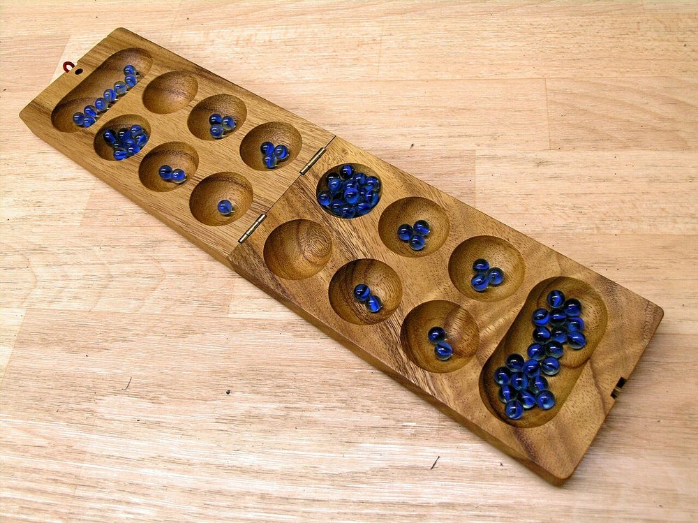
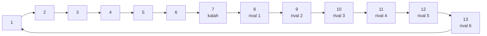

# Kalah

Esta página contiene las secciones
[78.9](index.md#789-kalah-version-1-el-tablero-y-la-siembra) y
[78.10](index.md#7810-kalah-version-2-el-jugador-con-alfa-beta) del
[capítulo 78](index.md): el tablero y la siembra de Kalah, y el jugador
con la poda alfa-beta del [capítulo 41](../capitulo-41-juegos/index.md).
El ejemplo está en `kalah.pl`, en `ejemplos/capitulo-78/`, con sus
pruebas.

## Kalah, versión 1: el tablero y la siembra

Kalah se juega en un tablero con dos filas de seis hoyos y, a la derecha
de cada fila, un hoyo mayor, el **kalah** de su dueño. Los dos jugadores
son sur, abajo, y norte, arriba; al empezar hay seis piedras en cada hoyo
y los kalahs están vacíos. Un jugador **siembra**: saca todas las piedras
de uno de sus hoyos y deja una en cada hoyo siguiente, en sentido
antihorario, incluido su kalah y salteando el del rival. Si la última
piedra cae en su kalah, vuelve a sembrar. Si cae en uno de sus hoyos que
estaba vacío y el hoyo de enfrente tiene piedras, guarda en su kalah las
dos cosas. Cuando los hoyos de un jugador quedan vacíos, cada uno guarda
las piedras de sus hoyos y la partida termina; gana el primero que tiene
más de la mitad de las piedras.



Un tablero de Kalah durante una partida: las dos filas de seis hoyos y,
en los extremos, los dos kalahs. Imagen: Matěj Baťha,
[CC BY-SA 2.5](https://creativecommons.org/licenses/by-sa/2.5), reducida,
vía [Wikimedia Commons](https://commons.wikimedia.org/wiki/File:Kalaha.jpg).

El tablero es `tablero(Mios, Kalah, Suyos, KalahRival)`, visto desde el
jugador que mueve, como en el libro: `Mios` son sus seis hoyos, numerados
desde el más lejano a su kalah, y `Suyos` los del rival, en el mismo
sentido. Para el que siembra, el recorrido es un anillo de trece
casillas: sus seis hoyos, su kalah y los seis hoyos del rival.



`sembrar/4` arma el anillo con `append/3`, cuenta las vueltas completas y
las piedras que sobran, y reparte con `maplist/4`; la casilla de la última
piedra es aritmética:

<!-- ejemplo: capitulo-78/kalah.pl predicado: sembrar/4 recibir/6 -->
```prolog
%!  sembrar(+Hoyo:integer, +Tablero, -Ultimo:integer, -Tablero1) is semidet.
%
%   Tablero1 es Tablero después de sembrar las piedras de Hoyo, uno de los
%   hoyos propios. Ultimo es la casilla del anillo donde cae la última
%   piedra: de 1 a 6 un hoyo propio, 7 el kalah propio, de 8 a 13 un hoyo
%   del rival. Falla si Hoyo está vacío.
sembrar(Hoyo, tablero(Mios, K, Suyos, L), Ultimo,
        tablero(Mios1, K1, Suyos1, L)) :-
    nth1(Hoyo, Mios, Piedras),
    Piedras > 0,
    append(Mios, [K|Suyos], Anillo0),
    Vueltas is Piedras // 13,
    Resto is Piedras mod 13,
    numlist(1, 13, Casillas),
    maplist(recibir(Hoyo, Vueltas, Resto), Casillas, Anillo0, Anillo),
    Ultimo is (Hoyo - 1 + Piedras) mod 13 + 1,
    length(Mios1, 6),
    append(Mios1, [K1|Suyos1], Anillo).

%!  recibir(+Hoyo:integer, +Vueltas:integer, +Resto:integer,
%!          +Casilla:integer, +C0:integer, -C:integer) is det.
%
%   C es lo que queda en Casilla, que tenía C0, después de sembrar desde
%   Hoyo: cada casilla recibe una piedra por cada vuelta completa al
%   anillo, y las Resto casillas siguientes a Hoyo, una más. Hoyo se vacía
%   antes de sembrar.
recibir(Hoyo, Vueltas, Resto, Casilla, C0, C) :-
    D is (Casilla - Hoyo) mod 13,
    (   D =:= 0
    ->  C = Vueltas
    ;   D =< Resto
    ->  C is C0 + Vueltas + 1
    ;   C is C0 + Vueltas
    ).
```

```prolog
?- inicial(kalah(6), k(T, _)), sembrar(1, T, U, T1).
T = tablero([6, 6, 6, 6, 6, 6], 0, [6, 6, 6, 6, 6, 6], 0),
U = 7,
T1 = tablero([0, 7, 7, 7, 7, 7], 1, [6, 6, 6, 6, 6, 6], 0).

?- inicial(kalah(6), k(T, _)), sembrar(4, T, U, T1).
T = tablero([6, 6, 6, 6, 6, 6], 0, [6, 6, 6, 6, 6, 6], 0),
U = 10,
T1 = tablero([6, 6, 6, 0, 7, 7], 1, [7, 7, 7, 6, 6, 6], 0).

?- sembrar(6, tablero([0, 0, 0, 0, 0, 14], 0, [1, 1, 1, 1, 1, 1], 0), U, T).
U = 7,
T = tablero([1, 1, 1, 1, 1, 1], 2, [2, 2, 2, 2, 2, 2], 0).
```

Las seis piedras del hoyo 1 terminan en el kalah, casilla 7; las del hoyo
4 llegan hasta el tercer hoyo del rival, casilla 10. Catorce piedras desde
el hoyo 6 dan una vuelta entera y terminan otra vez en el kalah. El libro
decide si la última piedra cae en el kalah comparando las piedras con
`(7 - M) mod 13`, que vale 7 − M, y no ve este caso: con catorce piedras
en el hoyo 6, su programa no da el turno extra. La captura, el barrido del
final y el turno completo, con las siembras que siguen a las que terminan
en el kalah:

<!-- ejemplo: capitulo-78/kalah.pl predicado: capturar/3 poner/4 barrer/2 vacios/1 terminado/1 turno_completo/3 girar/2 kalahs/4 -->
```prolog
%!  capturar(+Ultimo:integer, +Tablero, -Tablero1) is det.
%
%   Si la última piedra cayó en un hoyo propio que estaba vacío, y el hoyo
%   de enfrente tiene piedras, las dos cosas van al kalah propio. Si no,
%   Tablero1 es Tablero. El hoyo de enfrente del hoyo I es el 7 - I del
%   rival.
capturar(Ultimo, tablero(Mios, K, Suyos, L), Tablero1) :-
    (   Ultimo =< 6,
        nth1(Ultimo, Mios, 1),
        Enfrente is 7 - Ultimo,
        nth1(Enfrente, Suyos, X),
        X > 0
    ->  poner(Ultimo, Mios, 0, Mios1),
        poner(Enfrente, Suyos, 0, Suyos1),
        K1 is K + 1 + X,
        Tablero1 = tablero(Mios1, K1, Suyos1, L)
    ;   Tablero1 = tablero(Mios, K, Suyos, L)
    ).

%!  poner(+I:integer, +Lista:list, +X, -Lista1:list) is det.
%
%   Lista1 es Lista con X en la posición I.
poner(I, Lista, X, Lista1) :-
    nth1(I, Lista, _, Resto),
    nth1(I, Lista1, X, Resto).

%!  barrer(+Tablero, -Tablero1) is det.
%
%   Si los hoyos de uno de los dos jugadores quedaron vacíos, cada uno
%   guarda en su kalah las piedras de sus hoyos. Si no, Tablero1 es
%   Tablero.
barrer(tablero(Mios, K, Suyos, L), Tablero1) :-
    (   ( vacios(Mios) ; vacios(Suyos) )
    ->  sum_list(Mios, A),
        sum_list(Suyos, B),
        K1 is K + A,
        L1 is L + B,
        Tablero1 = tablero([0, 0, 0, 0, 0, 0], K1, [0, 0, 0, 0, 0, 0], L1)
    ;   Tablero1 = tablero(Mios, K, Suyos, L)
    ).

%!  vacios(+Hoyos:list(integer)) is semidet.
%
%   Ningún hoyo de Hoyos tiene piedras.
vacios(Hoyos) :-
    sum_list(Hoyos, 0).

%!  terminado(+Tablero) is semidet.
%
%   Todos los hoyos de Tablero están vacíos: la partida terminó.
terminado(tablero(Mios, _, Suyos, _)) :-
    vacios(Mios),
    vacios(Suyos).

%!  turno_completo(+Tablero, ?Hoyos:list(integer), -Tablero1) is nondet.
%
%   Tablero1 es Tablero después de sembrar los Hoyos, uno tras otro: cada
%   siembra salvo la última termina en el kalah propio, y la última no,
%   o termina la partida. Sin girar el tablero.
turno_completo(Tablero, [Hoyo|Hoyos], Tablero1) :-
    between(1, 6, Hoyo),
    sembrar(Hoyo, Tablero, Ultimo, T1),
    capturar(Ultimo, T1, T2),
    barrer(T2, T3),
    (   Ultimo =:= 7,
        \+ terminado(T3)
    ->  turno_completo(T3, Hoyos, Tablero1)
    ;   Hoyos = [],
        Tablero1 = T3
    ).

%!  girar(?Tablero, ?Tablero1) is det.
%
%   Tablero1 es Tablero visto desde el rival.
girar(tablero(Mios, K, Suyos, L), tablero(Suyos, L, Mios, K)).

%!  kalahs(+Tablero, +Jugador, -Sur:integer, -Norte:integer) is det.
%
%   Sur y Norte son las piedras de los kalahs de sur y de norte, si
%   Tablero está visto desde Jugador.
kalahs(tablero(_, K, _, L), Jugador, Sur, Norte) :-
    (   Jugador == sur
    ->  Sur = K,
        Norte = L
    ;   Sur = L,
        Norte = K
    ).
```

El hoyo de enfrente del hoyo I es el 7 − I del rival. El libro examina la
captura solo cuando la siembra no da la vuelta; aquí la condición es que
el hoyo de la última piedra tenga exactamente esa piedra, y trece piedras,
que vuelven al hoyo de partida vacío, también capturan. Una jugada es la
lista de los hoyos sembrados en el turno:

```prolog
?- capturar(2, tablero([0, 1, 0, 0, 2, 2], 1, [5, 4, 1, 1, 1, 1], 0), T).
T = tablero([0, 0, 0, 0, 2, 2], 3, [5, 4, 1, 1, 0, 1], 0).

?- inicial(kalah(6), k(T, _)), turno_completo(T, [1, 4], T1).
T = tablero([6, 6, 6, 6, 6, 6], 0, [6, 6, 6, 6, 6, 6], 0),
T1 = tablero([0, 7, 7, 0, 8, 8], 2, [7, 7, 7, 7, 6, 6], 0).

?- inicial(kalah(6), k(T, _)), findall(J, turno_completo(T, J, _), Js).
T = tablero([6, 6, 6, 6, 6, 6], 0, [6, 6, 6, 6, 6, 6], 0),
Js = [[1, 2], [1, 3], [1, 4], [1, 5], [1, 6], [2], [3], [4], [...]|...].
```

`[1, 4]` es la jugada de la figura 21.3 del libro: el hoyo 1 termina en el
kalah, y el 4 reparte dos piedras propias, una en el kalah y cuatro en el
rival. La figura dibuja los dos kalahs vacíos después de la jugada; el
kalah del que movió tiene 2 piedras. Desde la posición inicial hay diez
jugadas: el hoyo 1 y después cualquiera de los otros cinco, o uno solo de
los hoyos 2 a 6.

!!! question "Actividad"
    En `tablero([0, 0, 3, 0, 0, 1], 20, [2, 0, 0, 5, 0, 0], 30)`, predecir
    todas las jugadas de `turno_completo/3` y el tablero después de cada
    una, y comprobarlo con `findall/3`.

## Kalah, versión 2: el jugador con alfa-beta

Para la búsqueda del [capítulo 41](../capitulo-41-juegos/index.md), la posición es `k(Tablero, Jugador)`,
con el tablero visto desde el que mueve; sur es max. Una jugada es un
turno completo seguido de girar el tablero. La partida termina cuando un
kalah tiene más de la mitad de las piedras, o todos los hoyos están
vacíos con los kalahs iguales. La evaluación es la del libro, la
diferencia entre los kalahs, y una victoria suma 100:

<!-- ejemplo: capitulo-78/kalah.pl fragmento: es k(Tablero, Jugador): el tablero visto .. premio(min, -100). -->
```prolog
% La posición del capítulo 41 es k(Tablero, Jugador): el tablero visto
% desde Jugador, sur o norte, que es el que mueve. sur es max. El juego es
% kalah(N), con N piedras por hoyo al empezar.

%!  capitulo41:inicial(+Juego, -Posicion) is det.
%
%   En kalah(N), N piedras en cada hoyo, los kalahs vacíos, y mueve sur.
capitulo41:inicial(kalah(N), k(tablero(Hoyos, 0, Hoyos, 0), sur)) :-
    length(Hoyos, 6),
    maplist(=(N), Hoyos).

%!  capitulo41:jugada(+Juego, +Posicion, ?Hoyos, -Siguiente) is nondet.
%
%   En Kalah, una jugada es un turno completo; después se gira el tablero
%   y mueve el rival.
capitulo41:jugada(kalah(_), k(T0, J), Hoyos, k(T, Otro)) :-
    turno_completo(T0, Hoyos, T1),
    girar(T1, T),
    rival(J, Otro).

%!  capitulo41:turno(+Juego, +Posicion, -Lado) is det.
%
%   En Kalah, sur es max y norte es min.
capitulo41:turno(kalah(_), k(_, J), Lado) :-
    lado(J, Lado).

%!  capitulo41:fin(+Juego, +Posicion, -Resultado) is semidet.
%
%   En kalah(N), gana quien tiene más de 6 N piedras en su kalah; con
%   todos los hoyos vacíos y los kalahs iguales, empate. Falla si la
%   partida sigue.
capitulo41:fin(kalah(N), k(T, J), Resultado) :-
    kalahs(T, J, Sur, Norte),
    Mitad is 6 * N,
    (   Sur > Mitad
    ->  Resultado = gana(sur)
    ;   Norte > Mitad
    ->  Resultado = gana(norte)
    ;   terminado(T)
    ->  Resultado = empate
    ).

%!  capitulo41:valor_final(+Resultado, +Posicion, -Valor) is det.
%
%   En Kalah, la diferencia de los kalahs desde sur, más 100 si gana sur
%   o menos 100 si gana norte.
capitulo41:valor_final(gana(J), k(T, Mueve), Valor) :-
    kalahs(T, Mueve, Sur, Norte),
    lado(J, Lado),
    premio(Lado, P),
    Valor is P + Sur - Norte.

%!  capitulo41:evaluar(+Juego, +Posicion, -Valor) is det.
%
%   En Kalah, la diferencia de los kalahs desde sur.
capitulo41:evaluar(kalah(_), k(T, J), Valor) :-
    kalahs(T, J, Sur, Norte),
    Valor is Sur - Norte.

%!  capitulo41:completa(+Juego, +Posicion, +D, +Valor) is semidet.
%
%   En Kalah, profundizar no cambia una búsqueda que encontró una
%   victoria.
capitulo41:completa(kalah(_), _, _, Valor) :-
    abs(Valor) >= 100.

% rival(J, K): K es el rival de J.
rival(sur, norte).
rival(norte, sur).

% lado(J, L): el jugador J es L, max o min.
lado(sur, max).
lado(norte, min).

% premio(L, P): P se suma al valor de una victoria de L.
premio(max, 100).
premio(min, -100).
```

```prolog
?- inicial(kalah(6), P), jugada(kalah(6), P, [1, 4], P1).
P = k(tablero([6, 6, 6, 6, 6, 6], 0, [6, 6, 6, 6, 6, 6], 0), sur),
P1 = k(tablero([7, 7, 7, 7, 6, 6], 0, [0, 7, 7, 0, 8, 8], 2), norte).

?- inicial(kalah(6), P), alfabeta(kalah(6), P, 4, J, V, N).
P = k(tablero([6, 6, 6, 6, 6, 6], 0, [6, 6, 6, 6, 6, 6], 0), sur),
J = [1, 2],
V = 1,
N = 225.
```

Desde la posición inicial, la poda visita 11, 26, 94, 225, 1 008 y 4 446
posiciones con las profundidades 1 a 6, y la de 6 tarda un cuarto de
segundo. El libro juega con profundidad 2. Una prueba verifica que, en
posiciones tomadas de una partida, los valores de `alfabeta/6` coinciden
con los de minimax sin poda. `partida/5` juega con la estrategia
`profundidad(D)`; las partidas entre profundidades distintas, con cada
una de ellas una vez como sur y una vez como norte, dan:

| Sur \ Norte | 1 | 2 | 3 | 4 | 5 |
|---|---|---|---|---|---|
| **1** | — | norte | norte | norte | norte |
| **2** | sur | — | sur | empate | norte |
| **3** | sur | sur | — | sur | norte |
| **4** | norte | norte | sur | — | sur |
| **5** | sur | sur | sur | sur | — |

Contando una victoria como un punto y un empate como medio, en las veinte
partidas la profundidad 1 obtiene 1 punto, la 2 obtiene 4,5, la 3 obtiene
4, la 4 obtiene 3,5 y la 5, 7. Buscar más no es siempre jugar mejor: la
profundidad 4 pierde como sur contra la 1 y contra la 2. La evaluación
solo cuenta lo que ya está en los kalahs, y una búsqueda de profundidad
par termina con la jugada del rival, que ve capturas que el jugador ya no
tiene tiempo de contestar: es el efecto horizonte del
[capítulo 41](../capitulo-41-juegos/evaluacion.md#funciones-de-evaluacion-y-orden-de-las-jugadas).
El [ejercicio 10](index.md#ejercicios) prueba una evaluación que cuenta también
las piedras de cada lado.

La estrategia `tiempo(S)` usa la profundización progresiva del
[capítulo 41](../capitulo-41-juegos/index.md): busca con profundidad 1, 2, 3… hasta que se acaban los segundos, y
juega la jugada de la última búsqueda que terminó.

<!-- ejemplo: capitulo-78/partida.pl predicado: tiempo/4 -->
```prolog
%!  tiempo(+Segundos:number, +Juego, +Posicion, -Jugada) is det.
%
%   Jugada es la que elige profundizar/6 del capítulo 41 en Segundos. Si
%   ni la profundidad 1 termina a tiempo, la primera jugada legal.
tiempo(Segundos, Juego, Posicion, Jugada) :-
    profundizar(Juego, Posicion, Segundos, J, _, _),
    (   J == ninguna
    ->  primera(Juego, Posicion, Jugada)
    ;   Jugada = J
    ).
```

Con un segundo por jugada, en esta computadora, `tiempo(1)` llega a la
profundidad 4, 5 o 6 según la posición, y pierde contra `profundidad(4)` las
dos partidas, como sur y como norte: más profundidad con la misma
evaluación no compensa el horizonte. En la terminal, la persona juega
con sur; escribe los hoyos del turno separados por espacios, y una jugada
que no termina el turno, como `1` sola, cuya última piedra cae en el
kalah, se rechaza:

```text
     6  6  6  6  6  6
  0                    0
     6  6  6  6  6  6
   (1)(2)(3)(4)(5)(6)
Tu jugada: 1
Esa jugada no es válida.
Tu jugada: 1 4
     6  6  7  7  7  7
  0                    2
     0  7  7  0  8  8
   (1)(2)(3)(4)(5)(6)
La computadora juega [1].
```

<!-- ejemplo: capitulo-78/kalah.pl fragmento: %!  partida:pantalla(+Juego .. maplist(number_string, Hoyos, Partes). -->
```prolog
%!  partida:pantalla(+Juego, +Posicion, -Lineas:list(string)) is det.
%
%   Lineas dibujan el tablero visto desde sur: arriba los hoyos de norte,
%   del 6 al 1; a la izquierda el kalah de norte y a la derecha el de sur;
%   abajo los hoyos de sur, del 1 al 6, y sus números.
partida:pantalla(kalah(_), k(T, J), [Arriba, Kalahs, Abajo, Numeros]) :-
    (   J == sur
    ->  tablero(Sur, KS, Norte, KN) = T
    ;   tablero(Norte, KN, Sur, KS) = T
    ),
    reverse(Norte, NorteInvertido),
    fila(NorteInvertido, Arriba),
    format(string(Kalahs), "~t~d~3|~t~d~24|", [KN, KS]),
    fila(Sur, Abajo),
    format(string(Numeros), "~t(~d)~6|~t(~d)~9|~t(~d)~12|~t(~d)~15|\c
                             ~t(~d)~18|~t(~d)~21|", [1, 2, 3, 4, 5, 6]).

%!  fila(+Hoyos:list(integer), -Linea:string) is det.
%
%   Linea muestra los seis Hoyos, cada uno en tres columnas, después de
%   tres columnas para el kalah.
fila(Hoyos, Linea) :-
    format(string(Linea), "~t~d~6|~t~d~9|~t~d~12|~t~d~15|~t~d~18|~t~d~21|",
           Hoyos).

%!  partida:leer_jugada(+Juego, +Posicion, +Linea:string, -Jugada)
%!      is semidet.
%
%   Linea son los números de los hoyos sembrados, separados por espacios:
%   "1 4" es [1, 4]. Falla si alguno no es un número.
partida:leer_jugada(kalah(_), _, Linea, Hoyos) :-
    split_string(Linea, " ", " ", Partes),
    maplist(number_string, Hoyos, Partes).
```
