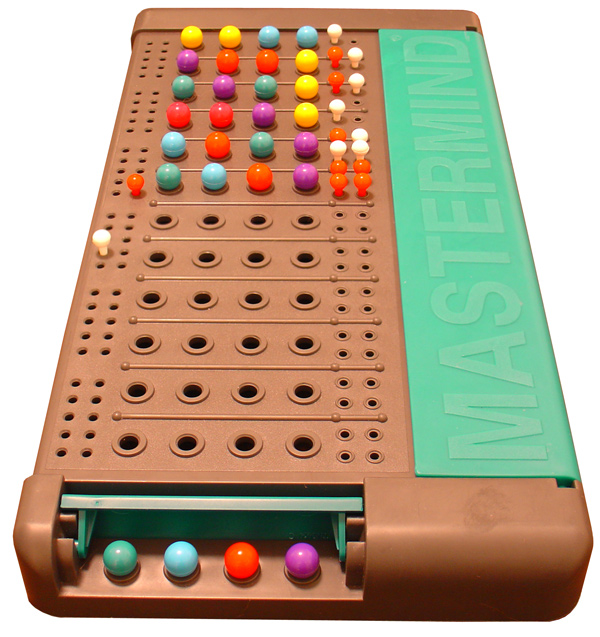
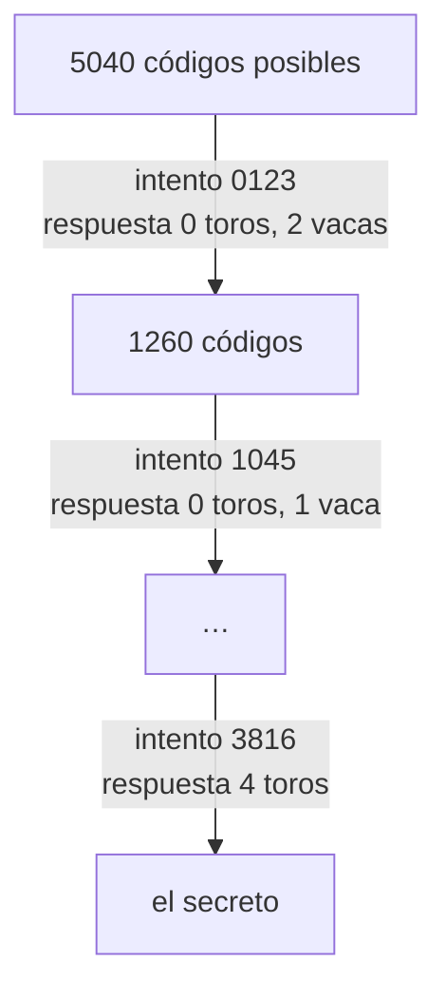

# Mastermind

Esta página contiene las secciones
[78.6](index.md#786-mastermind-version-1-la-jugada-consistente),
[78.7](index.md#787-mastermind-version-2-los-codigos-que-todavia-son-posibles)
y [78.8](index.md#788-mastermind-version-3-restricciones) del
[capítulo 78](index.md): las tres versiones del programa que adivina el
código. Los ejemplos están en `mastermind.pl`, `candidatos.pl` y
`restricciones.pl`, en `ejemplos/capitulo-78/`, con sus pruebas.

## Mastermind, versión 1: la jugada consistente

En la variante de Mastermind que juegan Sterling y Shapiro, con lápiz y
papel, un jugador elige un código secreto de cuatro dígitos distintos. El
otro propone códigos, y para cada uno recibe dos números: los **toros**,
dígitos que están en el código en la misma posición, y las **vacas**,
dígitos que están en el código en otra posición. Gana cuando recibe
cuatro toros.



Una partida del Mastermind comercial: cada fila es un intento de cuatro
colores, con las clavijas de la respuesta a su derecha, y el código oculto
abajo. La variante del capítulo usa dígitos distintos en lugar de colores.
Imagen: ZeroOne,
[CC BY-SA 2.0](https://creativecommons.org/licenses/by-sa/2.0), vía
[Wikimedia Commons](https://commons.wikimedia.org/wiki/File:Mastermind.jpg).

<!-- ejemplo: capitulo-78/mastermind.pl predicado: codigo/1 distintos/3 respuesta/4 toro/4 en/2 -->
```prolog
%!  codigo(-Codigo:list(integer)) is multi.
%
%   Codigo es una lista de cuatro dígitos distintos. Enumera los 5040
%   códigos en orden creciente, de [0, 1, 2, 3] a [9, 8, 7, 6].
codigo(Codigo) :-
    numlist(0, 9, Digitos),
    distintos(4, Digitos, Codigo).

%!  distintos(+N:integer, +Elementos:list, -Lista:list) is nondet.
%
%   Lista son N elementos distintos de Elementos, en el orden en que
%   select/3 los elige.
distintos(0, _, []).
distintos(N, Elementos, [X|Xs]) :-
    N > 0,
    select(X, Elementos, Resto),
    N1 is N - 1,
    distintos(N1, Resto, Xs).

%!  respuesta(+Secreto:list, +Intento:list, -Toros:integer,
%!            -Vacas:integer) is det.
%
%   Toros es la cantidad de posiciones en que Intento coincide con
%   Secreto, y Vacas la de dígitos de Intento que están en Secreto en otra
%   posición.
respuesta(Secreto, Intento, Toros, Vacas) :-
    foldl(toro, Secreto, Intento, 0, Toros),
    include(en(Secreto), Intento, Comunes),
    length(Comunes, C),
    Vacas is C - Toros.

%!  toro(+X, +Y, +T0:integer, -T:integer) is det.
%
%   T es T0 más 1 si X e Y son el mismo dígito.
toro(X, Y, T0, T) :-
    (   X =:= Y
    ->  T is T0 + 1
    ;   T = T0
    ).

%!  en(+Lista:list, +X) is semidet.
%
%   X está en Lista.
en(Lista, X) :-
    memberchk(X, Lista).
```

```prolog
?- respuesta([1, 2, 3, 4], [1, 3, 5, 6], T, V).
T = V, V = 1.

?- respuesta([3, 8, 1, 6], [1, 0, 4, 5], T, V).
T = 0,
V = 1.
```

Los códigos son 10 · 9 · 8 · 7 = 5040, y `codigo/1` los enumera en orden,
de `[0, 1, 2, 3]` a `[9, 8, 7, 6]`. Como los dígitos son distintos, las
vacas son los dígitos comunes menos los toros. La regla para adivinar es
la del libro: recorrer los códigos en orden y proponer siempre el primero
que es **consistente** con todas las respuestas recibidas, es decir, el
que, si fuera el secreto, habría recibido esas mismas respuestas. Un
código inconsistente no puede ser el secreto, y proponerlo sería perder un
intento.

<!-- ejemplo: capitulo-78/mastermind.pl predicado: consistente/2 siguiente/2 adivinar/2 adivinar/3 -->
```prolog
%!  consistente(+Respuestas:list, +Intento:list) is semidet.
%
%   Si Intento fuera el código, cada intento anterior de Respuestas,
%   r(I, T, V), habría recibido T toros y V vacas.
consistente(Respuestas, Intento) :-
    forall(member(r(I, T, V), Respuestas),
           respuesta(Intento, I, T, V)).

%!  siguiente(+Respuestas:list, -Intento:list) is semidet.
%
%   Intento es el primer código consistente con Respuestas. Recorre los
%   códigos desde el primero. Falla si ninguno es consistente: las
%   respuestas se contradicen. Intento debe llegar libre.
siguiente(Respuestas, Intento) :-
    once(( codigo(Intento),
           consistente(Respuestas, Intento) )).

%!  adivinar(+Secreto:list, -Intentos:list) is det.
%
%   Intentos son los intentos de la versión 1 contra Secreto, hasta el
%   que lo acierta, que es el último.
adivinar(Secreto, Intentos) :-
    adivinar(Secreto, [], Intentos).

%!  adivinar(+Secreto:list, +Respuestas:list, -Intentos:list) is det.
%
%   Como adivinar/2, con las Respuestas ya recibidas.
adivinar(Secreto, Respuestas, [Intento|Intentos]) :-
    siguiente(Respuestas, Intento),
    respuesta(Secreto, Intento, T, V),
    (   T =:= 4
    ->  Intentos = []
    ;   adivinar(Secreto, [r(Intento, T, V)|Respuestas], Intentos)
    ).
```

```prolog
?- siguiente([r([0, 1, 2, 3], 0, 1)], I).
I = [1, 4, 5, 6].

?- adivinar([3, 8, 1, 6], Is).
Is = [[0, 1, 2, 3], [1, 0, 4, 5], [2, 3, 5, 6], [2, 4, 3, 7], [3, 8, 0, 6], [3, 8, 1|...]].
```

Las respuestas son términos `r(Intento, Toros, Vacas)` en una lista que
crece con cada intento. El libro las guarda con `assert`, y su generador
de códigos sigue desde donde quedó al reintentar, porque `check/1` falla
hasta recibir cuatro toros: es generar y probar dirigido por la falla.
Aquí cada intento se busca desde el primer código. `medir/4` juega contra
una lista de secretos y cuenta los intentos:

<!-- ejemplo: capitulo-78/mastermind.pl predicado: medir/4 intentos/3 -->
```prolog
%!  medir(:Adivinar, +Secretos:list, -Cuantos:list(pair), -Media:float)
%!      is det.
%
%   Juega con Adivinar, un predicado como adivinar/2, contra cada código
%   de Secretos. Cuantos son pares N-K: K partidas se ganaron con N
%   intentos. Media es la cantidad media de intentos.
medir(Adivinar, Secretos, Cuantos, Media) :-
    maplist(intentos(Adivinar), Secretos, Ns),
    msort(Ns, Ordenados),
    clumped(Ordenados, Cuantos),
    sum_list(Ns, Total),
    length(Ns, Partidas),
    Media is Total / Partidas.

%!  intentos(:Adivinar, +Secreto:list, -N:integer) is det.
%
%   N es la cantidad de intentos que Adivinar necesita contra Secreto.
intentos(Adivinar, Secreto, N) :-
    call(Adivinar, Secreto, Intentos),
    length(Intentos, N).
```

```prolog
?- medir(adivinar, [[0, 1, 2, 3], [3, 8, 1, 6], [9, 8, 7, 6]], Q, M).
Q = [1-1, 6-2],
M = 4.333333333333333.
```

Sobre los 5040 secretos, con la medición de la
[sección 78.8](#mastermind-version-3-restricciones): una partida se
gana con 1 intento, 13 con 2, 108 con 3, 596 con 4, 1 668 con 5, 1 768
con 6, 752 con 7, 129 con 8 y 5 con 9; la media es 5,56. El libro informa
de cuatro a seis intentos de media y un máximo observado de ocho; con este
orden de los códigos, cinco secretos necesitan nueve.

## Mastermind, versión 2: los códigos que todavía son posibles

La versión 1 examina de nuevo, en cada intento, los códigos que ya
descartó. La versión 2 guarda los que todavía son posibles, como el agente
del [capítulo 77](../capitulo-77-proyecto-mundo-wumpus/index.md) guarda
los mundos consistentes: al principio los 5040, y después de cada
respuesta, solo los que la **explican**. El intento siguiente es el
primero de la lista, y como la lista conserva el orden de los códigos, es
el mismo de la versión 1. Para el secreto 3816:



<!-- ejemplo: capitulo-78/candidatos.pl predicado: candidatos/1 filtrar/5 explica/4 quedan/2 descartar/3 adivinar_candidatos/2 adivinar_entre/3 -->
```prolog
%!  candidatos(-Codigos:list) is det.
%
%   Codigos son los 5040 códigos, en orden.
candidatos(Codigos) :-
    findall(C, codigo(C), Codigos).

%!  filtrar(+Codigos0:list, +Intento:list, +Toros:integer, +Vacas:integer,
%!          -Codigos:list) is det.
%
%   Codigos son los de Codigos0 que explican la respuesta: si fueran el
%   secreto, Intento habría recibido Toros toros y Vacas vacas.
filtrar(Codigos0, Intento, Toros, Vacas, Codigos) :-
    include(explica(Intento, Toros, Vacas), Codigos0, Codigos).

%!  explica(+Intento:list, +Toros:integer, +Vacas:integer, +Codigo:list)
%!      is semidet.
%
%   Si Codigo fuera el secreto, Intento recibiría Toros toros y Vacas
%   vacas.
explica(Intento, Toros, Vacas, Codigo) :-
    respuesta(Codigo, Intento, Toros, Vacas).

%!  quedan(+Respuestas:list, -N:integer) is det.
%
%   N es la cantidad de códigos que explican todas las Respuestas, una
%   lista de términos r(Intento, Toros, Vacas).
quedan(Respuestas, N) :-
    candidatos(Codigos0),
    foldl(descartar, Respuestas, Codigos0, Codigos),
    length(Codigos, N).

%!  descartar(+Respuesta, +Codigos0:list, -Codigos:list) is det.
%
%   Codigos son los de Codigos0 que explican Respuesta, r(I, T, V).
descartar(r(I, T, V), Codigos0, Codigos) :-
    filtrar(Codigos0, I, T, V, Codigos).

%!  adivinar_candidatos(+Secreto:list, -Intentos:list) is det.
%
%   Intentos son los intentos contra Secreto, hasta el que lo acierta:
%   los mismos que da adivinar/2 de la versión 1.
adivinar_candidatos(Secreto, Intentos) :-
    candidatos(Codigos),
    adivinar_entre(Codigos, Secreto, Intentos).

%!  adivinar_entre(+Codigos:list, +Secreto:list, -Intentos:list) is det.
%
%   Como adivinar_candidatos/2, con Codigos los que todavía son posibles.
%   El primero es el intento; el resto, filtrado por su respuesta, son los
%   posibles de la jugada siguiente.
adivinar_entre([Intento|Codigos0], Secreto, [Intento|Intentos]) :-
    respuesta(Secreto, Intento, T, V),
    (   T =:= 4
    ->  Intentos = []
    ;   filtrar(Codigos0, Intento, T, V, Codigos),
        adivinar_entre(Codigos, Secreto, Intentos)
    ).
```

```prolog
?- quedan([], N).
N = 5040.

?- quedan([r([0, 1, 2, 3], 0, 1)], N).
N = 1440.

?- quedan([r([0, 1, 2, 3], 0, 1), r([1, 4, 5, 6], 1, 2)], N).
N = 83.

?- adivinar_candidatos([3, 8, 1, 6], Is).
Is = [[0, 1, 2, 3], [1, 0, 4, 5], [2, 3, 5, 6], [2, 4, 3, 7], [3, 8, 0, 6], [3, 8, 1|...]].
```

Una respuesta de cero toros y una vaca al primer intento deja 1440
códigos posibles; una segunda respuesta los reduce a 83. Cada código se
compara con cada respuesta una sola vez, en el momento en que se filtra.
La ganancia, sin embargo, es pequeña: la versión 1 descarta la mayoría de
los códigos con la primera respuesta que examina, que es barata, y la
versión 2 paga una lista de 5040 códigos al principio de cada partida. La
tabla de la [sección 78.8](#mastermind-version-3-restricciones) lo
mide.

Con la lista, la partida contra una persona puede reconocer que sus
respuestas se contradicen: si ningún código las explica, la lista queda
vacía. `jugar/1` lee las respuestas, una por línea, y rechaza las que
ningún intento puede recibir, como tres toros y una vaca:

<!-- ejemplo: capitulo-78/candidatos.pl predicado: jugar/1 preguntar/3 leer_respuesta/2 posible/2 -->
```prolog
%!  jugar(+In) is det.
%
%   Adivina el código que piensa una persona. Las respuestas se leen de
%   In, una por línea: los toros y las vacas, separados por un espacio.
jugar(In) :-
    format("Piensa un código de cuatro dígitos distintos.~n"),
    candidatos(Codigos),
    preguntar(Codigos, 1, In).

%!  preguntar(+Codigos:list, +N:integer, +In) is det.
%
%   Propone el intento número N, el primero de Codigos, y sigue con los
%   que explican la respuesta.
preguntar([], _, _) :-
    format("Tus respuestas se contradicen: ningún código las cumple.~n").
preguntar([Intento|Codigos0], N, In) :-
    atomic_list_concat(Intento, ' ', Texto),
    format("Intento ~d: ~w. ¿Toros y vacas? ", [N, Texto]),
    leer_respuesta(In, Leida),
    (   Leida = fin
    ->  format("Partida abandonada.~n")
    ;   Leida = r(4, 0)
    ->  format("Tu código es ~w: encontrado en ~d intentos.~n", [Texto, N])
    ;   Leida = r(T, V),
        filtrar(Codigos0, Intento, T, V, Codigos),
        N1 is N + 1,
        preguntar(Codigos, N1, In)
    ).

%!  leer_respuesta(+In, -Respuesta) is det.
%
%   Respuesta es r(Toros, Vacas), leída de la primera línea de In que es
%   una respuesta posible, o fin si In se termina antes.
leer_respuesta(In, Respuesta) :-
    read_line_to_string(In, Linea),
    (   Linea == end_of_file
    ->  nl,
        Respuesta = fin
    ;   format("~w~n", [Linea]),
        split_string(Linea, " ", " ", [A, B]),
        number_string(T, A),
        number_string(V, B),
        posible(T, V)
    ->  Respuesta = r(T, V)
    ;   format("Esa respuesta no es posible. ¿Toros y vacas? "),
        leer_respuesta(In, Respuesta)
    ).

%!  posible(+Toros:integer, +Vacas:integer) is semidet.
%
%   Toros y Vacas pueden ser la respuesta a un intento: no son negativos,
%   suman a lo sumo 4, y no son tres toros y una vaca, que obligaría a
%   cambiar de lugar un solo dígito.
posible(T, V) :-
    integer(T),
    integer(V),
    T >= 0,
    V >= 0,
    T + V =< 4,
    T-V \== 3-1.
```

Una partida en la que la persona piensa 4392:

```text
Piensa un código de cuatro dígitos distintos.
Intento 1: 0 1 2 3. ¿Toros y vacas? 0 2
Intento 2: 1 0 4 5. ¿Toros y vacas? 0 1
Intento 3: 2 3 5 6. ¿Toros y vacas? 1 1
Intento 4: 2 4 3 7. ¿Toros y vacas? 0 3
Intento 5: 4 3 8 2. ¿Toros y vacas? 3 0
Intento 6: 4 3 9 2. ¿Toros y vacas? 4 0
Tu código es 4 3 9 2: encontrado en 6 intentos.
```

!!! question "Actividad"
    Predecir cuántos códigos quedan después de la respuesta de cero toros
    y cero vacas al primer intento, y cuál es el segundo intento. Explicar
    por qué después de las respuestas `0 0` a `0 1 2 3` y `0 0` a
    `4 5 6 7` la partida termina con el mensaje de contradicción.
    Comprobarlo con `quedan/2` y con `jugar/1`.

## Mastermind, versión 3: restricciones

La consistencia también se puede escribir como restricciones del
[capítulo 23](../capitulo-23-programacion-con-restricciones/index.md): los
cuatro dígitos del intento son variables entre 0 y 9, todas distintas, y
cada respuesta `r(I, T, V)` exige `T` igualdades con `I` en la misma
posición y `T + V` dígitos en común. Las igualdades se cuentan con
[reificación](../capitulo-23-programacion-con-restricciones/index.md#236-reificacion),
una variable booleana por comparación: cuatro para los toros, dieciséis
para los dígitos comunes. Etiquetar de menor a mayor da el primer código
consistente en el orden de los códigos: otra vez el mismo intento.

<!-- ejemplo: capitulo-78/restricciones.pl predicado: siguiente_clp/2 restringir/2 igual/3 comun/4 igual_a/4 -->
```prolog
%!  siguiente_clp(+Respuestas:list, -Intento:list) is semidet.
%
%   Intento es el primer código consistente con Respuestas, hallado
%   restringiendo y etiquetando. Falla si ninguno es consistente. Intento
%   debe llegar libre.
siguiente_clp(Respuestas, Intento) :-
    Intento = [_, _, _, _],
    Intento ins 0..9,
    all_different(Intento),
    maplist(restringir(Intento), Respuestas),
    once(label(Intento)).

%!  restringir(+Intento:list, +Respuesta) is semidet.
%
%   Impone que Intento, de ser el código, habría recibido Respuesta,
%   r(I, T, V): T posiciones iguales a las de I, y T + V dígitos en común.
restringir(Intento, r(I, T, V)) :-
    maplist(igual, Intento, I, Toros),
    sum(Toros, #=, T),
    foldl(comun(I), Intento, Comunes, []),
    sum(Comunes, #=, T + V).

%!  igual(?X, +Y:integer, -B) is det.
%
%   B es 1 si X es igual a Y, y 0 si no: la reificación de X #= Y.
igual(X, Y, B) :-
    B #<==> (X #= Y).

%!  comun(+I:list, ?X, -Bs0:list, +Bs:list) is det.
%
%   Bs0 son las variables booleanas de X #= Y para cada dígito Y de I,
%   seguidas de Bs: su suma es 1 si X es uno de los dígitos de I.
comun(I, X, Bs0, Bs) :-
    foldl(igual_a(X), I, Bs0, Bs).

%!  igual_a(?X, +Y:integer, -Bs0:list, +Bs:list) is det.
%
%   Bs0 es [B|Bs], con B la reificación de X #= Y.
igual_a(X, Y, [B|Bs], Bs) :-
    igual(X, Y, B).
```

```prolog
?- siguiente_clp([r([0, 1, 2, 3], 0, 1)], I).
I = [1, 4, 5, 6].

?- siguiente_clp([r([0, 1, 2, 3], 4, 0), r([0, 1, 2, 4], 4, 0)], I).
false.
```

`adivinar_clp/2` es `adivinar/2` con `siguiente_clp/2`. Las pruebas
verifican sobre una muestra de 101 secretos que las tres versiones hacen
los mismos intentos. Sobre los 5040, medidas en la misma computadora:

| Versión | Inferencias | Tiempo | Intentos (media; máximo) |
|---|---|---|---|
| 1, generar y probar | 1 346 332 812 | 165 s | 5,56; 9 |
| 2, códigos posibles | 1 167 232 804 | 140 s | 5,56; 9 |
| 3, restricciones | 1 155 291 117 | 204 s | 5,56; 9 |

Las tres cuestan lo mismo dentro de un factor de 1,5, y la de
restricciones, con menos inferencias, es la más lenta: cada inferencia de
`library(clpfd)` propaga restricciones y vale más que una comparación de
listas. Generar y probar, que en las reinas de la
[sección 23.10](../capitulo-23-programacion-con-restricciones/index.md#2310-generar-y-probar-frente-a-restringir-y-etiquetar)
perdía por diez veces, aquí no pierde: hay solo 5040 candidatos, y la
primera respuesta descarta casi todos con una comparación barata. Lo que
el conjunto de la versión 2 sí da es la posibilidad de **elegir** entre
los códigos posibles en lugar de tomar el primero: el
[ejercicio 6](index.md#ejercicios) elige el que deja menos códigos en el peor caso.
