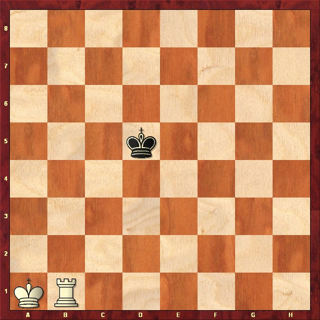
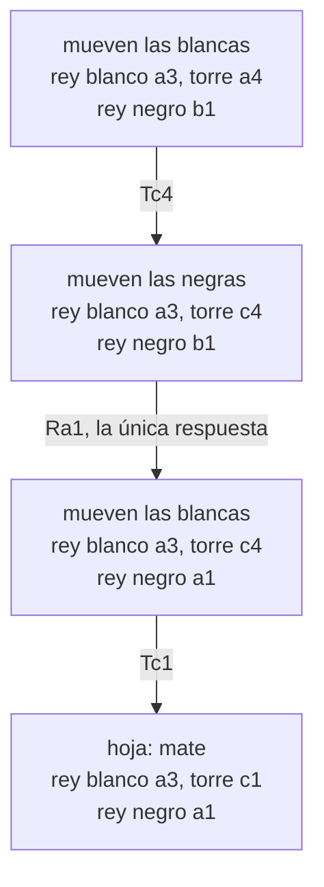

# Capítulo 79 — Proyecto: un lenguaje de consejos para el ajedrez

Un programa que juega con minimax, como los del
[capítulo 41](../capitulo-41-juegos/index.md), reduce cada posición a un
número y elige la jugada que lleva al mejor número que alcanza a ver. En
los finales de ajedrez esa manera de jugar se queda corta: el mate de rey y
torre contra rey está a menudo a quince o más jugadas, mucho más allá de lo
que una búsqueda completa puede recorrer, y una evaluación numérica no
expresa un plan. Un jugador que conoce el final no busca: aplica unas
pocas ideas, cada una con su objetivo («encerrar al rey en un rectángulo
cada vez más chico», «acercar el rey propio sin descuidar la torre») y con
las jugadas que vale la pena considerar para lograrlo.



Un final de rey y torre contra rey: el rey blanco en a1 y la torre en b1,
contra el rey negro en d5. Con el mejor juego de los dos bandos, las
blancas dan mate en 15 jugadas; la tabla de consejos de este capítulo lo
da en 28 contra la defensa más dura. Imagen: Tsor, diagrama hecho con
ChessBase, [CC BY-SA 3.0](https://creativecommons.org/licenses/by-sa/3.0/),
vía [Wikimedia Commons](https://commons.wikimedia.org/wiki/File:Chess-turm-matt-1.PNG);
convertida de PNG a JPEG.

Los **lenguajes de consejos** escriben ese conocimiento como datos. Un
consejo dice qué meta alcanzar, qué condición no perder en el camino y qué
jugadas de cada bando considerar; un intérprete busca, con esas
restricciones, una estrategia que lo cumpla contra cualquier defensa. Una
**tabla de consejos** ordena los consejos por preferencia. Este capítulo
escribe el lenguaje, su intérprete y la tabla de rey y torre contra rey de
Ivan Bratko, y la pone a prueba de dos maneras: jugando, y comparándola con
la **tabla de finales** completa, calculada hacia atrás desde los mates.
Esta es una partida de la tabla, con el consejo que eligió cada jugada:

```text
1. Tc1 Re7          dividir_en_2
2. Tc6 Rd7          dividir_en_2
3. Te6 Rc7          encierro
4. Td6 Rb7          encierro
5. Rd5 Rc7          acercamiento
6. Rc5 Rb7          acercamiento
7. Tc6 Rb8          encierro
8. Rb6 Ra8          mate_en_2
9. Tc8              mate_en_2
mate
```

Las blancas empiezan con el rey en e5 y la torre en a1; el rey negro está
en d7. Primero la torre separa los reyes por la columna c y después por la
fila 6; cada jugada de torre marcada `encierro` reduce el rectángulo en que
está el rey negro; el rey blanco se acerca cuando la torre ya no puede
reducirlo, y en la columna a el consejo `mate_en_2` encuentra el mate.

La fuente principal es la sección «Pattern knowledge and the mechanism of
'advice'» y la siguiente, «A chess endgame program in Advice Language 0»,
del capítulo «Game Playing» de *Prolog Programming for Artificial
Intelligence* de Bratko (Addison-Wesley, 1986): el lenguaje de consejos
reducido a una sola tabla, *Advice Language 0*, su intérprete, la tabla de
dos reglas y seis consejos y la biblioteca de predicados del final. La
definición del árbol forzante y la medida de un consejo por la profundidad
que busca vienen del artículo de Bratko sobre AL1 en IJCAI 1979. La idea de
verificar una estrategia construyendo hacia atrás el conjunto de las
posiciones que gana, y las cifras de rey y torre contra rey con que se
comparan los resultados, vienen del artículo de Max Bramer en el mismo
congreso. La lista completa está en las [Referencias](#referencias). El
código es propio, y también lo son la verificación exhaustiva de la tabla,
las posiciones en que ahoga al rey negro y su corrección.

El capítulo usa los operadores propios y las reglas como datos del
[capítulo 19](../capitulo-19-operadores-y-reglas-como-datos/index.md), un
intérprete que construye la prueba de lo que demuestra, como los del
[capítulo 33](../capitulo-33-introspeccion-y-metainterpretes/index.md), y
la posición ganada como un árbol Y/O del
[capítulo 41](../capitulo-41-juegos/index.md#411-posiciones-jugadas-y-fin-de-partida).
Cada versión es un módulo. Solo las reglas del juego, `reglas.pl`, corren
en SWISH; los demás archivos cargan otros y son `% solo-local`.

## Objetivos del capítulo

Al terminar el capítulo, el lector puede:

- representar las reglas de un final de ajedrez con términos limpios y
  comprobar con pruebas la legalidad de las jugadas, el jaque, el mate y el
  ahogado;
- explicar por qué una búsqueda sin conocimiento no alcanza para dar mate,
  midiendo cuánto crece al pedir una jugada más;
- escribir un consejo con sus cuatro ingredientes y leer el árbol forzante
  que lo prueba;
- escribir el intérprete de un lenguaje de consejos, con una cláusula por
  cada forma de condición y de restricción, independiente del juego;
- calcular una tabla de finales por análisis retrógrado y usarla para
  medir cuánto se aleja la tabla de consejos del juego óptimo;
- verificar una estrategia contra todas las defensas en todas las
  posiciones, encontrar dónde falla y corregirla.

!!! info "Tiempo estimado"
    Leer el capítulo, ejecutar sus ejemplos y hacer las actividades: **2:10 h**.
    Resolver los 5 ejercicios marcados con ★: **1:20 h**.
    Resolver los 12 ejercicios del final: **3:50 h**.

## 79.1 Versión 1: las reglas del final

Una posición es un término `pos(Lado, ReyBlanco, Torre, ReyNegro)`. `Lado`
es el bando que mueve, `blancas` o `negras`, y cada pieza ocupa una
casilla `X-Y`, con la columna y la fila entre 1 y 8: a1 es `1-1`, e5 es
`5-5`. Si las negras capturan la torre, la casilla de la torre se
reemplaza por el átomo `capturada`. Una jugada es `rey(Desde, Hasta)` o
`torre(Desde, Hasta)`. Es el tablero como un sistema de coordenadas, con
cada pieza como un conjunto de desplazamientos, como el caballo de la
[sección 76.7](../capitulo-76-proyecto-robots-laberintos-caballo/index.md#767-version-6-el-caballo-de-una-casilla-a-otra);
aquí con dos bandos y sus reglas de jaque. Las blancas son el bando que
busca el mate; en el lenguaje de consejos serán «nosotros», y las negras,
«ellos».

<!-- ejemplo: capitulo-79/reglas.pl predicado: jugada/3 consulta: jugada(pos(negras, 3-3, 1-8, 1-1), J, P). -->
```prolog
%!  jugada(+Posicion, ?Jugada, -Siguiente) is nondet.
%
%   Jugada es una jugada legal del bando que mueve en Posicion, y Siguiente
%   la posición que resulta. Las blancas mueven primero el rey, con las
%   diagonales primero, y después la torre.
jugada(pos(blancas, RB, T, RN), rey(RB, R1), pos(negras, R1, T, RN)) :-
    vecina(RB, R1),
    R1 \== T,
    distancia(R1, RN, D),
    D > 1.
jugada(pos(blancas, RB, T, RN), torre(T, T1), pos(negras, RB, T1, RN)) :-
    T = TX-TY,
    between(1, 8, I),
    (   T1 = TX-I
    ;   T1 = I-TY
    ),
    T1 \== T,
    T1 \== RB,
    T1 \== RN,
    \+ entre(T, RB, T1).
jugada(pos(negras, RB, T, RN), rey(RN, N1), pos(blancas, RB, T1, N1)) :-
    vecina(RN, N1),
    distancia(RB, N1, D),
    D > 1,
    (   N1 == T
    ->  T1 = capturada
    ;   T1 = T,
        \+ ( T \== capturada, ataca_torre(T, RB, N1) )
    ).
```

Las tres cláusulas son las jugadas del rey blanco, de la torre y del rey
negro. El rey blanco no puede quedar junto al negro ni sobre la torre; la
torre se mueve por su columna o su fila sin saltar al rey blanco; el rey
negro no puede quedar junto al blanco ni en una casilla que la torre
ataca, y si la torre está a su lado y el rey blanco no la defiende, la
captura. `vecina/2` da primero las casillas en diagonal: es el orden en que
el consejo que prefiere las jugadas diagonales del rey las va a probar.
`ataca_torre/3` y `entre/3` resuelven el ataque de la torre con el rey
blanco como única pieza que puede interponerse:

<!-- ejemplo: capitulo-79/reglas.pl predicado: ataca_torre/3 jaque/1 mate/1 ahogado/1 -->
```prolog
%!  ataca_torre(+Torre, +ReyBlanco, +Casilla) is semidet.
%
%   La torre, que no fue capturada, ataca Casilla: está en su columna o en
%   su fila, y el rey blanco no se interpone. El rey negro nunca tapa una
%   casilla que está detrás de él, porque es él quien se mueve.
ataca_torre(TX-TY, ReyBlanco, X-Y) :-
    TX-TY \== X-Y,
    (   TX =:= X
    ;   TY =:= Y
    ),
    !,
    \+ entre(TX-TY, ReyBlanco, X-Y).

%!  jaque(+Posicion) is semidet.
%
%   Mueven las negras y la torre ataca al rey negro.
jaque(pos(negras, ReyBlanco, Torre, ReyNegro)) :-
    Torre \== capturada,
    ataca_torre(Torre, ReyBlanco, ReyNegro).

%!  mate(+Posicion) is semidet.
%
%   Mueven las negras, su rey está en jaque y no tiene ninguna jugada.
mate(Posicion) :-
    jaque(Posicion),
    \+ jugada(Posicion, _, _).

%!  ahogado(+Posicion) is semidet.
%
%   Mueven las negras, su rey no está en jaque y no tiene ninguna jugada:
%   la partida termina en tablas.
ahogado(Posicion) :-
    Posicion = pos(negras, _, _, _),
    \+ jaque(Posicion),
    \+ jugada(Posicion, _, _).
```

`mostrar/1` dibuja una posición con R el rey
blanco, T la torre y r el rey negro; `mostrar(pos(blancas, 5-5, 1-1, 4-7))`
escribe:

```text
8 . . . . . . . .
7 . . . r . . . .
6 . . . . . . . .
5 . . . . R . . .
4 . . . . . . . .
3 . . . . . . . .
2 . . . . . . . .
1 T . . . . . . .
  a b c d e f g h
```

```prolog
?- findall(J, jugada(pos(negras, 3-3, 1-8, 1-1), J, _), Js).
Js = [rey(1-1, 2-1)].

?- mate(pos(negras, 2-3, 8-1, 1-1)).
true.

?- ahogado(pos(negras, 1-3, 2-8, 1-1)).
true.

?- legal(pos(blancas, 3-3, 1-8, 1-1)).
false.
```

La primera posición es la de la partida de la introducción. En la
segunda, el rey negro en a1 está en jaque por la torre de a8 y su única
jugada es b1. En la tercera, el rey blanco en b3 cubre a2 y b2, y la torre
de h1 da jaque por la fila 1: es mate. En la cuarta, el rey blanco en a3
cubre a2 y b2, y la torre de b8 cubre b1 sin dar jaque: el rey negro no
tiene jugadas, y es ahogado, que en ajedrez es tablas. La última posición
no puede darse: mueven las blancas y el rey negro está en jaque.
`legal/1` es lo que las versiones siguientes usan para recorrer todas las
posiciones del final: hay 175 168 con las blancas a mover y la torre en el
tablero.

!!! question "Actividad"
    Predecir cuántas jugadas tienen las blancas en
    `pos(blancas, 1-4, 1-1, 8-8)` y cuántas son de la torre, y
    comprobarlo con `findall/3`. Explicar por qué la torre no llega a a5.

## 79.2 Versión 2: buscar el mate sin conocimiento

Las blancas dan mate en N jugadas si tienen una jugada tras la cual el rey
negro recibe el mate o, si no, todas sus respuestas llevan a posiciones en
que las blancas dan mate en N − 1. Es la posición ganada de la
[sección 41.1](../capitulo-41-juegos/index.md#411-posiciones-jugadas-y-fin-de-partida):
las posiciones de las blancas son nodos O, alcanza con una jugada; las de
las negras, nodos Y, tienen que servir todas. La única diferencia es el
límite de jugadas, y una respuesta que captura la torre cuenta como
fracaso:

<!-- ejemplo: capitulo-79/busqueda.pl predicado: mate_forzado/3 pierde/2 menor_mate/4 -->
```prolog
%!  mate_forzado(+Posicion, +N:integer, -Jugada) is semidet.
%
%   Con las blancas a mover en Posicion, Jugada es la primera de sus
%   jugadas que da mate en a lo sumo N jugadas de las blancas contra
%   cualquier defensa.
mate_forzado(Posicion, N, Jugada) :-
    N >= 1,
    jugada(Posicion, Jugada, Siguiente),
    pierde(Siguiente, N),
    !.

%!  pierde(+Posicion, +N:integer) is semidet.
%
%   Con las negras a mover en Posicion, reciben el mate, ya o en a lo sumo
%   N - 1 jugadas más de las blancas, respondan lo que respondan: ninguna
%   respuesta captura la torre.
pierde(Posicion, N) :-
    (   mate(Posicion)
    ->  true
    ;   N > 1,
        jugada(Posicion, _, _),
        N1 is N - 1,
        forall(jugada(Posicion, _, Siguiente),
               ( Siguiente = pos(_, _, T, _),
                 T \== capturada,
                 mate_forzado(Siguiente, N1, _) ))
    ).

%!  menor_mate(+Posicion, +Maximo:integer, -N:integer, -Jugada) is semidet.
%
%   N es la menor cantidad de jugadas, hasta Maximo, en que las blancas dan
%   mate desde Posicion, y Jugada la primera: profundización iterativa.
menor_mate(Posicion, Maximo, N, Jugada) :-
    between(1, Maximo, N),
    mate_forzado(Posicion, N, Jugada),
    !.
```

```prolog
?- mate_forzado(pos(blancas, 2-3, 4-2, 2-1), 1, J).
J = torre(4-2, 4-1).

?- menor_mate(pos(blancas, 1-3, 1-4, 2-1), 3, N, J).
N = 2,
J = torre(1-4, 3-4).

?- menor_mate(pos(blancas, 1-3, 4-2, 2-1), 3, N, J).
N = 3,
J = rey(1-3, 2-3).

?- menor_mate(pos(blancas, 1-3, 4-2, 2-1), 2, N, J).
false.
```

La búsqueda es correcta y no sabe nada del final. Su costo, medido con
`statistics(inferences, I)` antes y después de `menor_mate/4` en una
posición de cada longitud, tomada de la tabla de finales de la
[sección 79.6](#796-version-6-la-tabla-de-finales):

| Mate en | Inferencias |
|---|---|
| 1 | 270 |
| 2 | 3 605 |
| 3 | 67 441 |
| 4 | 4 529 652 |
| 5 | 106 008 623 |

Cada jugada más multiplica el costo por un factor entre 13 y 67: las
blancas tienen unas veinte jugadas y las negras entre una y ocho. El mate
en 5 tardó unos veinte segundos; desde la posición de la introducción, el
mate óptimo está a 8 jugadas, y el más lejano del final, a 16. Bratko
llama a esto la limitación de los programas basados en minimax: la
búsqueda calcula bien las variantes forzadas cortas y no tiene un plan
para las largas.

## 79.3 Versión 3: el lenguaje de consejos

Un **consejo** tiene cuatro ingredientes, todos desde el punto de vista de
«nosotros», el bando que lo sigue:

- la **meta mejor**, una condición que se quiere alcanzar;
- la **meta a mantener**, una condición que debe cumplirse en todas las
  posiciones del camino;
- las **restricciones de nuestras jugadas**, que eligen cuáles de nuestras
  jugadas legales se consideran;
- las **restricciones de sus jugadas**, que eligen cuáles respuestas del
  rival se consideran.

Un consejo es **satisfacible** en una posición si nuestro bando puede
forzar la meta mejor sin violar nunca la meta a mantener, jugando solo
jugadas permitidas contra cualquiera de las respuestas permitidas al
rival. La prueba de que lo es se llama **árbol forzante**: en cada
posición en que movemos tiene exactamente una jugada, en cada posición en
que mueve el rival tiene todas sus respuestas permitidas, y termina en
hojas que cumplen la meta mejor. Es el árbol solución de un árbol Y/O,
como los de la [sección 71.4](../capitulo-71-proyecto-grafos-o/index.md#714-version-2-el-arbol-solucion-en-profundidad),
con dos podas: la de las restricciones, que deja fuera jugadas, y la de la
meta a mantener, que deja fuera posiciones.

El consejo de dar mate en dos jugadas se escribe así:

<!-- ejemplo: capitulo-79/krk.pl fragmento: consejo(mate_en_2, .. profundidad = 1 y legal). -->
```prolog
consejo(mate_en_2,
        mate,
        no torre_perdida y rey_negro_en_borde,
        profundidad = 0 y legal luego profundidad = 2 y jaque_con_torre,
        profundidad = 1 y legal).
```

La meta mejor es el mate; la meta a mantener, que la torre no se pierda y
el rey negro siga en el borde. Nuestras jugadas: cualquiera legal en la
posición de partida, profundidad 0, y después, en la profundidad 2, solo
jugadas de torre que dan jaque. Sus jugadas: cualquiera legal. La
profundidad se cuenta en jugadas de un bando, desde la raíz del árbol.

Las condiciones se escriben con los operadores `y`, `o` y `no` del
[capítulo 19](../capitulo-19-operadores-y-reglas-como-datos/index.md#195-el-proyecto-los-motivos-de-rechazo-como-reglas),
con las mismas precedencias, y las restricciones de las jugadas agregan
uno: `luego`, que da primero las jugadas de la restricción de la
izquierda y después las de la derecha. Como `=` y `<` tienen precedencia
700, menor que la de `y`, una restricción se escribe sin paréntesis:

```prolog
?- X = (profundidad = 0 y legal luego profundidad = 2 y jaque_con_torre), write_canonical(X), nl.
luego(y(=(profundidad,0),legal),y(=(profundidad,2),jaque_con_torre))
X = (profundidad=0 y legal luego profundidad=2 y jaque_con_torre).
```

El intérprete recibe la tabla como el nombre de un módulo que define cinco
predicados: `regla/2` y `consejo/5`, los datos; `mueve/2`, que dice si en
una posición mueve `nosotros` o `ellos`; `meta/3`, las condiciones
elementales, y `jugadas/4`, las restricciones elementales. Así el
intérprete no sabe nada del ajedrez. Su centro es `forzar/5`:

<!-- ejemplo: capitulo-79/consejos.pl predicado: satisfacible/4 forzar/5 forzar_todas/5 -->
```prolog
%!  satisfacible(+Tabla, +Consejo, +Posicion, -Arbol) is semidet.
%
%   El consejo de nombre Consejo es satisfacible en Posicion, y Arbol es
%   el primer árbol forzante que se encuentra. Posicion es la raíz: tiene
%   profundidad 0, y las metas que comparan se refieren a ella.
satisfacible(Tabla, Consejo, Posicion, Arbol) :-
    Tabla:consejo(Consejo, Mejor, Mantener, Nuestras, Suyas),
    C = c(Tabla, Mejor, Mantener, Nuestras, Suyas),
    once(forzar(C, Posicion, 0, Posicion, Arbol)).

%!  forzar(+C, +Posicion, +Prof:integer, +Raiz, -Arbol) is nondet.
%
%   Arbol es un árbol forzante del consejo C desde Posicion, a Prof
%   jugadas de la Raiz: hoja si la meta mejor ya se cumple; juega(J, A) si
%   movemos, con la jugada J y el árbol A de la posición siguiente;
%   responde(Rs) si mueve el rival, con un par Respuesta-Arbol por cada
%   respuesta permitida. La meta a mantener se cumple en todos los nodos.
forzar(C, Posicion, Prof, Raiz, Arbol) :-
    C = c(Tabla, Mejor, Mantener, Nuestras, Suyas),
    cumple(Tabla, Mantener, Posicion, Raiz),
    (   cumple(Tabla, Mejor, Posicion, Raiz)
    ->  Arbol = hoja
    ;   Tabla:mueve(Posicion, nosotros)
    ->  Prof1 is Prof + 1,
        jugada_con(Tabla, Nuestras, Posicion, Prof, Jugada, Siguiente),
        forzar(C, Siguiente, Prof1, Raiz, A),
        Arbol = juega(Jugada, A)
    ;   Prof1 is Prof + 1,
        findall(J-S,
                jugada_con(Tabla, Suyas, Posicion, Prof, J, S),
                Respuestas),
        Respuestas \== [],
        forzar_todas(Respuestas, C, Prof1, Raiz, Ramas),
        Arbol = responde(Ramas)
    ).

%!  forzar_todas(+Respuestas:list, +C, +Prof:integer, +Raiz, -Ramas:list)
%!      is nondet.
%
%   Ramas tiene un par Jugada-Arbol por cada par Jugada-Posicion de
%   Respuestas, con un árbol forzante desde cada posición.
forzar_todas([], _, _, _, []).
forzar_todas([J-P|JPs], C, Prof, Raiz, [J-A|Ramas]) :-
    forzar(C, P, Prof, Raiz, A),
    forzar_todas(JPs, C, Prof, Raiz, Ramas).
```

El árbol tiene tres formas: `hoja` donde se cumple la meta mejor,
`juega(J, A)` donde movemos, y `responde(Rs)`, con un par
`Respuesta-Arbol` por cada respuesta del rival. La meta a mantener se
comprueba antes que la meta mejor, en cada nodo. Si el rival no tiene
ninguna respuesta permitida y la meta mejor no se cumple, `findall/3` da la
lista vacía y la rama fracasa: no hay nada que forzar. Las condiciones y
las restricciones se interpretan con una cláusula por forma, como el
`prueba/3` de la [sección 19.4](../capitulo-19-operadores-y-reglas-como-datos/index.md#194-el-interprete-y-la-pregunta-como):

<!-- ejemplo: capitulo-79/consejos.pl predicado: cumple/4 jugada_con/6 -->
```prolog
%!  cumple(+Tabla, +Condicion, +Posicion, +Raiz) is semidet.
%
%   Condicion se cumple en Posicion. Una condición es una meta elemental
%   de Tabla o una combinación de condiciones con y, o y no. Raiz es la
%   posición con que empezó la búsqueda, para las metas que comparan.
cumple(Tabla, A y B, P, R) :-
    !,
    cumple(Tabla, A, P, R),
    cumple(Tabla, B, P, R).
cumple(Tabla, A o B, P, R) :-
    !,
    (   cumple(Tabla, A, P, R)
    ->  true
    ;   cumple(Tabla, B, P, R)
    ).
cumple(Tabla, no A, P, R) :-
    !,
    \+ cumple(Tabla, A, P, R).
cumple(Tabla, Meta, P, R) :-
    Tabla:meta(Meta, P, R),
    !.

%!  jugada_con(+Tabla, +Restriccion, +Posicion, +Prof:integer, ?Jugada,
%!             -Siguiente) is nondet.
%
%   Jugada lleva de Posicion a Siguiente y cumple Restriccion. Una
%   restricción es una restricción elemental de Tabla, una condición sobre
%   la profundidad (profundidad = N, profundidad < N), dos restricciones
%   que se cumplen a la vez (y) o dos en orden de preferencia (luego): las
%   jugadas de la primera, después las de la segunda.
jugada_con(Tabla, A y B, P, D, J, S) :-
    !,
    jugada_con(Tabla, A, P, D, J, S),
    jugada_con(Tabla, B, P, D, J, S).
jugada_con(Tabla, A luego B, P, D, J, S) :-
    !,
    (   jugada_con(Tabla, A, P, D, J, S)
    ;   jugada_con(Tabla, B, P, D, J, S)
    ).
jugada_con(_, profundidad = N, _, D, _, _) :-
    !,
    D =:= N.
jugada_con(_, profundidad < N, _, D, _, _) :-
    !,
    D < N.
jugada_con(Tabla, Nombre, P, _, J, S) :-
    Tabla:jugadas(Nombre, P, J, S).
```

`cumple/4` recibe dos posiciones: la actual y la raíz del árbol. Algunas
metas comparan las dos, como «el espacio del rey negro es menor que al
empezar»; las demás ignoran la raíz. Las restricciones de profundidad no
generan jugadas: son filtros que dejan pasar o no a la restricción que las
sigue en la conjunción. El intérprete no llama a `call/1` sobre lo que
viene de los datos: solo conoce las formas compuestas y, para lo
elemental, los predicados `meta/3` y `jugadas/4` de la tabla, como pide el
[Patrón 16](../patrones.md#16-interprete-de-reglas).

```prolog
?- satisfacible(krk, mate_en_2, pos(blancas, 1-3, 1-4, 2-1), A).
A = juega(torre(1-4, 3-4), responde([rey(2-1, 1-1)-juega(torre(3-4, 3-1), hoja)])).

?- satisfacible(krk, encierro, pos(blancas, 1-3, 1-4, 2-1), A).
false.
```

Con el rey blanco en a3, la torre en a4 y el rey negro en b1, el árbol es:
torre a c4; el rey negro solo puede ir a a1; torre a c1, mate.



Cada posición de las blancas tiene una sola flecha, la jugada elegida;
cada posición de las negras, una flecha por cada respuesta permitida, y
aquí hay una sola. Es el
árbol de prueba de la [sección 33.4](../capitulo-33-introspeccion-y-metainterpretes/index.md#334-arboles-de-prueba)
para otro lenguaje: lo que se demuestra no es un objetivo de Prolog sino
que una meta del juego se puede forzar.

!!! question "Actividad"
    Antes de consultarlo, predecir si `mate_en_2` es satisfacible con el
    rey blanco en c3, la torre en b2 y el rey negro en a1, con las blancas
    a mover. Comprobarlo con `satisfacible/4` y explicar el resultado con
    las restricciones del consejo.

La búsqueda de la [sección 79.2](#792-version-2-buscar-el-mate-sin-conocimiento)
es también un consejo: meta mejor `mate`, meta a mantener `no
torre_perdida`, cualquier jugada legal de los dos bandos y un límite de
profundidad. Lo que distingue a un consejo útil son las restricciones: el
[ejercicio 4](#ejercicios) lo escribe y compara las dos búsquedas.

## 79.4 Versión 4: la tabla de rey y torre contra rey

Una **tabla de consejos** es una lista de reglas
`si Condicion entonces Consejos`. En una posición se usa la primera regla
cuya condición se cumple, y de su lista, el primer consejo satisfacible:

<!-- ejemplo: capitulo-79/consejos.pl predicado: estrategia/4 -->
```prolog
%!  estrategia(+Tabla, +Posicion, -Consejo, -Arbol) is semidet.
%
%   Consejo es el primer consejo satisfacible de la primera regla de Tabla
%   cuya condición se cumple en Posicion, y Arbol su árbol forzante. Falla
%   si ningún consejo de esa regla es satisfacible.
estrategia(Tabla, Posicion, Consejo, Arbol) :-
    once(( Tabla:regla(_, si Condicion entonces Consejos),
           cumple(Tabla, Condicion, Posicion, Posicion) )),
    member(Consejo, Consejos),
    satisfacible(Tabla, Consejo, Posicion, Arbol),
    !.
```

La tabla de Bratko para rey y torre contra rey tiene dos reglas. Si el rey
negro está en el borde y los reyes están a menos de cuatro casillas, se
intenta primero el mate en dos; en cualquier otro caso, la regla `resto`
empieza por encerrar:

<!-- ejemplo: capitulo-79/krk.pl predicado: regla/2 -->
```prolog
% regla(Nombre, si Condicion entonces Consejos): en las posiciones en que se
% cumple Condicion, se prueban los Consejos en orden. Se usa la primera
% regla cuya condición se cumple.
regla(borde, si rey_negro_en_borde y reyes_cerca
             entonces [mate_en_2, encierro, acercamiento, mantener_espacio,
                       dividir_en_2, dividir_en_3]).
regla(resto, si verdadero
             entonces [encierro, acercamiento, mantener_espacio,
                       dividir_en_2, dividir_en_3]).
```

Los consejos de la lista van del más ambicioso al más modesto. Sus metas
usan el vocabulario del final, que define la biblioteca de `krk.pl`:

| Meta | Se cumple cuando |
|---|---|
| `espacio_menor` | el rectángulo en que la torre encierra al rey negro es más chico que en la raíz |
| `torre_divide` | la torre separa a los dos reyes por una columna o por una fila |
| `torre_expuesta` | el rey negro puede llegar a la torre antes de que el rey blanco la defienda |
| `acerca_casilla_critica` | el rey blanco está más cerca de la casilla crítica que en la raíz |
| `patron_l` | los reyes están a dos casillas en línea y la torre forma con ellos una L |
| `rey_no_se_aleja` | el rey blanco no está más lejos de la torre que en la raíz |
| `mate`, `ahogado`, `torre_perdida` | las del juego |

El **espacio** es la medida que el encierro reduce: la torre corta el
tablero en cuatro rectángulos por su columna y su fila, y el rey negro
está en uno de ellos. La **casilla crítica** es la vecina en diagonal de la
torre en dirección al rey negro; con el rey blanco allí, la torre queda
defendida y puede avanzar una fila:

<!-- ejemplo: capitulo-79/krk.pl predicado: espacio/2 lado/3 casilla_critica/2 -->
```prolog
%!  espacio(+Posicion, -Espacio:integer) is det.
%
%   Espacio es la cantidad de casillas del rectángulo al que la torre
%   confina al rey negro: el cuadrante, entre la columna y la fila de la
%   torre y los bordes, en que está el rey. Si la torre está en la columna
%   o la fila del rey negro, o fue capturada, no lo confina: 64.
espacio(pos(_, _, T, RN), Espacio) :-
    T = TX-TY,
    RN = NX-NY,
    NX =\= TX,
    NY =\= TY,
    !,
    lado(NX, TX, LX),
    lado(NY, TY, LY),
    Espacio is LX * LY.
espacio(_, 64).

%!  lado(+N:integer, +T:integer, -L:integer) is det.
%
%   L es la cantidad de columnas (o filas) entre la de la torre, T, y el
%   borde del lado en que está N.
lado(N, T, L) :-
    (   N < T
    ->  L is T - 1
    ;   L is 8 - T
    ).

%!  casilla_critica(+Posicion, -Casilla) is det.
%
%   Casilla es la casilla crítica: la vecina diagonal de la torre en
%   dirección al rey negro. Ocuparla con el rey blanco defiende la torre y
%   prepara el encierro siguiente.
casilla_critica(pos(_, _, TX-TY, NX-NY), CX-CY) :-
    (   NX < TX
    ->  CX is TX - 1
    ;   CX is TX + 1
    ),
    (   NY < TY
    ->  CY is TY - 1
    ;   CY is TY + 1
    ).
```

```prolog
?- espacio(pos(blancas, 5-5, 3-6, 4-8), E), casilla_critica(pos(blancas, 5-5, 3-6, 4-8), C).
E = 10,
C = 4-7.
```

Con la torre en c6 y el rey negro en d8, el rey está encerrado entre la
columna d y la h y entre las filas 7 y 8: 5 × 2 = 10 casillas. La casilla
crítica es d7. Los seis consejos completan la tabla:

<!-- ejemplo: capitulo-79/krk.pl fragmento: consejo(encierro, .. profundidad < 4 y legal). -->
```prolog
consejo(encierro,
        espacio_menor y no torre_expuesta y torre_divide y no ahogado,
        no torre_perdida,
        profundidad = 0 y torre,
        ninguna).
consejo(acercamiento,
        acerca_casilla_critica y no torre_expuesta y
            (torre_divide o patron_l) y
            (espacio_mayor_que_2 o no rey_blanco_en_borde),
        no torre_perdida,
        profundidad = 0 y rey_diagonal_primero,
        ninguna).
consejo(mantener_espacio,
        mueven_negras y no torre_expuesta y torre_divide y
            rey_no_se_aleja y
            (espacio_mayor_que_2 o no rey_blanco_en_borde),
        no torre_perdida,
        profundidad = 0 y rey_diagonal_primero,
        ninguna).
consejo(dividir_en_2,
        mueven_negras y torre_divide y no torre_expuesta,
        no torre_perdida,
        profundidad < 3 y legal,
        profundidad < 2 y legal).
consejo(dividir_en_3,
        mueven_negras y torre_divide y no torre_expuesta,
        no torre_perdida,
        profundidad < 5 y legal,
        profundidad < 4 y legal).
```

`encierro` busca una jugada de torre que reduzca el espacio sin dejarla
expuesta ni ahogar al rey. `acercamiento` lleva el rey blanco hacia la
casilla crítica, y `mantener_espacio` hace una jugada de espera del rey
que conserva la división; las dos tienen como restricción de las negras
`ninguna`, que no permite ninguna jugada: la meta mejor tiene que
cumplirse justo después de la jugada blanca. `dividir_en_2` y
`dividir_en_3`, los últimos recursos, buscan en dos o tres jugadas una
posición en que la torre separe a los reyes, con todas las respuestas de
las negras. La tabla elige así en la posición de la introducción:

```prolog
?- estrategia(krk, pos(blancas, 5-5, 1-1, 4-7), C, A).
C = dividir_en_2,
A = juega(torre(1-1, 3-1), responde([rey(4-7, 5-8)-juega(torre(3-1, 3-6), hoja), rey(4-7, 5-7)-juega(torre(3-1, 3-6), hoja), rey(4-7, 4-8)-juega(torre(3-1, 3-6), hoja)])).
```

El rey negro está en d7, lejos del borde: se usa la regla `resto`. Ni
`encierro` ni los dos consejos del rey son satisfacibles, porque la torre
no divide todavía; `dividir_en_2` lo es: torre a c1, y contra cada una de
las tres respuestas, torre a c6. El árbol prevé tres respuestas y no más,
porque las otras casillas del rey negro están junto al rey blanco o en la
columna c.

!!! example "Patrón 81 — Conocimiento como restricciones de la búsqueda"
    **Problema.** Un juego o un problema de búsqueda tiene soluciones
    demasiado profundas para una búsqueda completa, y quien conoce el
    dominio sabe qué metas intermedias perseguir y qué jugadas vale la
    pena considerar.

    **Versión ingenua.** Buscar sin conocimiento, con todas las jugadas de
    los dos bandos hasta la meta final: el mate en 5 jugadas cuesta 106
    millones de inferencias, y el más lejano del final está a 16.

    **Patrón.** Escribir el conocimiento como datos: metas intermedias,
    una condición que debe mantenerse y restricciones sobre las jugadas de
    cada bando, ordenadas por preferencia en una tabla. Un intérprete
    independiente del dominio busca, con esas restricciones, un árbol
    forzante para el primer consejo satisfacible; la búsqueda queda en
    pocas jugadas, y una partida entera de 12 jugadas cuesta 130 409
    inferencias. Las condiciones elementales y las restricciones
    elementales las define el dominio, y el intérprete solo las llama.

    **Cuándo no usarlo.** Cuando la búsqueda completa alcanza, o cuando
    nadie conoce un plan del dominio: una tabla de consejos no es óptima, y
    su corrección hay que verificarla aparte
    ([Patrón 82](../patrones.md#82-verificar-la-estrategia-hacia-atras)).

## 79.5 Versión 5: jugar con la tabla

El ciclo de juego de *Advice Language 0* alterna dos estados: con un árbol
forzante en curso, las blancas juegan lo que el árbol indica, y la
respuesta de las negras elige la rama siguiente; cuando el árbol se
termina, o la respuesta no está en él, se pide a la tabla un árbol nuevo.
Las negras juegan con una **defensa**, un predicado que recibe la posición
y devuelve una respuesta; el programa trae dos, `primera/2`, la primera
jugada legal, y `resistente/2`, la que deja al rey negro más espacio:

<!-- ejemplo: capitulo-79/partida.pl predicado: jugar/7 siguiente_en_arbol/4 rama/3 -->
```prolog
%!  jugar(+Tabla, :Defensa, +Posicion, +Arbol, +N:integer, -Jugadas:list,
%!        -Final) is det.
%
%   Continúa la partida desde Posicion, con Arbol el árbol forzante en
%   curso, consejo(Nombre, A), o ninguno; N es la cantidad de jugadas de
%   las blancas hechas.
jugar(Tabla, Defensa, Posicion, Arbol, N, Jugadas, Final) :-
    (   terminada(Posicion, F)
    ->  Jugadas = [],
        Final = F
    ;   N >= 100
    ->  Jugadas = [],
        Final = limite
    ;   Posicion = pos(blancas, _, _, _)
    ->  (   siguiente_en_arbol(Arbol, Nombre, Jugada, Resto)
        ->  true
        ;   estrategia(Tabla, Posicion, Nombre, juega(Jugada, A))
        ->  Resto = A
        ;   Jugada = ninguna
        ),
        (   Jugada == ninguna
        ->  Jugadas = [],
            Final = sin_consejo
        ;   once(jugada(Posicion, Jugada, Siguiente)),
            N1 is N + 1,
            Jugadas = [blancas(Jugada, Nombre)|Js],
            jugar(Tabla, Defensa, Siguiente, consejo(Nombre, Resto), N1, Js,
                  Final)
        )
    ;   call(Defensa, Posicion, Jugada),
        once(jugada(Posicion, Jugada, Siguiente)),
        rama(Arbol, Jugada, Arbol1),
        Jugadas = [negras(Jugada)|Js],
        jugar(Tabla, Defensa, Siguiente, Arbol1, N, Js, Final)
    ).

%!  siguiente_en_arbol(+Arbol, -Nombre, -Jugada, -Resto) is semidet.
%
%   El árbol en curso indica la Jugada de las blancas, y Resto es lo que
%   queda de él. Falla si no hay árbol en curso o si se terminó.
siguiente_en_arbol(consejo(Nombre, juega(Jugada, Resto)), Nombre, Jugada,
                   Resto).

%!  rama(+Arbol, +Respuesta, -Arbol1) is det.
%
%   Arbol1 es el subárbol que corresponde a la Respuesta de las negras, o
%   ninguno si el árbol se terminó o no la prevé.
rama(consejo(Nombre, responde(Ramas)), Respuesta, consejo(Nombre, A)) :-
    memberchk(Respuesta-A, Ramas),
    !.
rama(_, _, ninguno).
```

`narrar/3` juega la partida y escribe cada jugada de las blancas con la
respuesta de las negras y el consejo que la eligió. La partida de la
introducción es la de la defensa `resistente`; con la otra:

```prolog
?- narrar(krk, primera, pos(blancas, 5-5, 1-1, 4-7)).
1. Tc1 Re8          dividir_en_2
2. Tc6 Rf7          dividir_en_2
3. Td6 Rg8          encierro
4. Te6 Rh7          encierro
5. Tf6 Rg8          encierro
6. Rf5 Rh7          acercamiento
7. Tg6 Rh8          encierro
8. Rg5 Rh7          acercamiento
9. Rf6 Rh8          mantener_espacio
10. Rf7 Rh7         acercamiento
11. Ta6 Rh8         mate_en_2
12. Th6             mate_en_2
mate
true.
```

La defensa `primera` lleva el rey negro hacia el rincón h8, donde tarda
más en recibir el mate que la defensa `resistente`, que busca más
espacio y termina en la columna a. Ninguna de las dos es la mejor
defensa posible.

`medir/3` juega una partida desde cada una de las 27 352 posiciones con
las blancas a mover y el rey negro en el triángulo a1-d1-d4; por las ocho
simetrías del tablero, cualquier otra posición es una de esas vista en un
espejo. Es la misma cuenta que da Bramer en 1979. Las dos mediciones,
`medir(krk, primera, R)` y `medir(krk, resistente, R)`, tardaron entre dos
y tres minutos cada una, y dieron:

```text
primera:     R = r([ahogado-10, mate-27342], 26, 11.97)
resistente:  R = r([ahogado-10, mate-27342], 27, 13.29)
```

La tabla da mate en 27 342 partidas, en 12 a 13 jugadas de media y nunca
más de 27, contra las dos defensas. En las otras diez, la partida termina
en **ahogado**: tablas, en una posición que se gana. Las diez tienen el
rey negro en a1 y la torre en b2; la [sección 79.7](#797-version-7-verificar-la-tabla)
explica por qué. Las dos defensas son solo dos de las muchas posibles, y
una partida por posición no prueba nada sobre las demás: para eso hace
falta otra herramienta.

## 79.6 Versión 6: la tabla de finales

Una **tabla de finales** da, para cada posición, cuántas jugadas faltan
para el mate con el mejor juego de los dos bandos. Se calcula **hacia
atrás**, por análisis retrógrado: las posiciones de mate son las de 0
jugadas; una posición de las blancas da mate en K si tiene una jugada a
una posición de las negras que lo recibe en menos de K; una de las negras
lo recibe en K si todas sus jugadas llevan a posiciones de las blancas que
lo dan en K o menos, y ninguna captura la torre. Se repite con K + 1 hasta
que ninguna posición cambia.

Las posiciones se reducen por simetría: `normal/2` aplica la primera de
las ocho simetrías del tablero que lleva el rey negro al triángulo
a1-d1-d4, y `codigo/2` convierte la posición en un entero, para que la
base de datos la encuentre por el primer argumento. Antes de retroceder,
cada posición se registra con los códigos de sus sucesoras, de modo que
cada pasada solo consulta hechos:

<!-- ejemplo: capitulo-79/finales.pl predicado: calcular/0 registrar/1 retroceder/1 -->
```prolog
%!  calcular is det.
%
%   Calcula la tabla de finales: borra la anterior, registra cada posición
%   con los códigos de sus sucesoras, marca los mates y retrocede una
%   jugada por vez hasta que ninguna posición cambia.
calcular :-
    retractall(gana(_, _)),
    retractall(pierde(_, _)),
    retractall(nodo(_, _, _)),
    forall(( member(Lado, [blancas, negras]),
             posiciones(Lado, Ps),
             member(P, Ps) ),
           registrar(P)),
    forall(( nodo(negras, C, []),
             decodificar(negras, C, P),
             jaque(P) ),
           assertz(pierde(C, 0))),
    retroceder(1).

%!  registrar(+Posicion) is det.
%
%   Agrega el hecho nodo(Lado, C, Sucesoras): C es el código de Posicion y
%   Sucesoras, los códigos de las posiciones normales a las que llevan sus
%   jugadas; captura, si una jugada captura la torre.
registrar(P) :-
    P = pos(Lado, _, _, _),
    codigo(P, C),
    findall(C1,
            ( jugada(P, _, S),
              sucesora(S, C1) ),
            Cs0),
    sort(Cs0, Cs),
    assertz(nodo(Lado, C, Cs)).

%!  retroceder(+K:integer) is det.
%
%   Marca las posiciones de las blancas que ganan en K y las de las negras
%   que pierden en K, y sigue con K + 1 mientras alguna cambie.
retroceder(K) :-
    findall(C,
            ( nodo(blancas, C, Cs),
              \+ gana(C, _),
              once(( member(C1, Cs), pierde(C1, _) )) ),
            Ganan),
    forall(member(C, Ganan), assertz(gana(C, K))),
    findall(C,
            ( nodo(negras, C, Cs),
              Cs \== [],
              \+ pierde(C, _),
              \+ memberchk(captura, Cs),
              forall(member(C1, Cs), gana(C1, _)) ),
            Pierden),
    forall(member(C, Pierden), assertz(pierde(C, K))),
    (   Ganan == [],
        Pierden == []
    ->  true
    ;   K1 is K + 1,
        retroceder(K1)
    ).
```

```text
?- time(calcular), resumen(R).
% 42,184,522 inferences, 7.578 CPU in 7.700 seconds (98% CPU, 5566617 Lips)
R = r(27352, 34968, 3495, 16).
```

27 352 posiciones con las blancas a mover y 34 968 con las negras; 3 495
de estas son tablas, porque las negras pueden capturar la torre o están
ahogadas, y todas las de las blancas se ganan. El mate más lejano está a
16 jugadas. Son exactamente las cifras de Bramer, y las 16 jugadas de
Bratko. Con la tabla calculada, `mate_en/2` responde por cualquier
posición:

```text
?- calcular, mate_en(pos(blancas, 5-5, 1-1, 4-7), K).
K = 8.

?- calcular, mate_en(pos(blancas, 1-1, 4-4, 3-3), K), mejor_jugada(pos(blancas, 1-1, 4-4, 3-3), J).
K = 14,
J = torre(4-4, 4-1).
```

Las dos partidas de la [sección 79.5](#795-version-5-jugar-con-la-tabla)
dieron mate en 9 y 12 jugadas donde el óptimo es 8. `finales.pl` exporta también `optima/2`, la defensa que elige la
respuesta que más demora el mate según la tabla de finales. Contra ella,
`medir(krk, optima, R)` tardó tres minutos y medio:

```text
R = r([ahogado-10, mate-27342], 31, 15.08)
```

La tabla de consejos tarda 15 jugadas de media y hasta 31 contra la
defensa óptima, donde el juego óptimo de las blancas nunca pasa de 16. Es
el precio de no buscar: la tabla no es óptima, y Bratko lo dice; lo que
promete es dar mate siempre, bien por debajo de las 50 jugadas.

!!! question "Actividad"
    Predecir si `normal/2` deja igual `pos(blancas, 4-5, 8-1, 5-7)` o la
    transforma, y en qué. Comprobarlo, y comprobar con `mate_en/2` que
    la posición y su forma normal dan el mismo número.

## 79.7 Versión 7: verificar la tabla

Las partidas de la [sección 79.5](#795-version-5-jugar-con-la-tabla) prueban la tabla contra dos defensas,
una partida por posición. La versión 7 aplica el método de Bramer: el
conjunto de las posiciones desde las que el programa da mate contra
**cualquier** defensa, construido hacia atrás desde los mates, con un
árbol forzante entero como paso. Sobre las 175 168 posiciones con las
blancas a mover, la tabla de Bratko asegura el mate en 175 120, en a lo
sumo 34 jugadas; en las otras 48, un árbol termina en ahogado. La página
[Verificar la tabla de consejos](verificacion.md#verificar-la-tabla)
desarrolla la versión, con dos de esas posiciones jugada por jugada y los
consejos que las producen.

!!! example "Patrón 82 — Verificar la estrategia hacia atrás"
    **Problema.** Hay que saber si una estrategia gana desde todas las
    posiciones contra cualquier defensa, y las partidas de prueba solo
    examinan las respuestas que alguna defensa elige.

    **Versión ingenua.** Jugar una partida por posición con unas pocas
    defensas: en las 27 352 posiciones normales, dos defensas encuentran
    10 ahogados, y las otras 38 posiciones en que la tabla ahoga quedan
    ocultas.

    **Patrón.** Construir hacia atrás, desde las posiciones terminales
    ganadas, el conjunto de las posiciones desde las que la estrategia
    gana contra todas las respuestas: una posición entra cuando todas sus
    salidas son victorias o posiciones que ya entraron. Si la estrategia
    tiene memoria, el paso es todo lo que juega sin volver a decidir, como
    un árbol forzante entero. Las posiciones que nunca entran son sus
    errores, y las pasadas dan también la partida más larga. Sobre las
    175 168 posiciones del final, `verificar/2` tarda dos minutos y medio
    y encuentra las 48.

    **Cuándo no usarlo.** Cuando el espacio de posiciones no cabe en
    memoria o no se puede enumerar: entonces solo queda probar la
    estrategia con partidas o demostrar su corrección.

## 79.8 Versión 8: la tabla corregida

La corrección agrega `no ahogado` a la meta a mantener de todos los
consejos, en un módulo que carga la tabla original sin copiarla. Con ella,
la verificación asegura el mate en las 175 168 posiciones, en a lo sumo 34
jugadas: [La tabla corregida](verificacion.md#la-tabla-corregida).

!!! success "Criterios de calidad"
    | Criterio | En este capítulo |
    |---|---|
    | C1 | cada predicado declara modos y determinación; `forzar/5` es `nondet` porque da un árbol por cada estrategia, y `satisfacible/4` toma el primero con `once/1` |
    | C2 | `jugada/3` con la jugada libre enumera las jugadas legales y con la jugada ligada la comprueba (pruebas `escape` y `captura`); los predicados que necesitan la posición ligada, como `estrategia/4`, lo declaran con `+` |
    | C4 | `partida/5` es `det`: las jugadas elegidas se ejecutan con `once/1`, y las pruebas no encuentran alternativas pendientes |
    | C6 | las reglas, el intérprete y la tabla no escriben ni modifican la base de datos; solo `mostrar/1` y `narrar/3` escriben, y solo `calcular/0`, `verificar/2` y `verificar_desde/3` guardan resultados con `assertz/1`; la posición, la jugada y el árbol forzante son términos con un functor por forma |
    | C7 | 99 pruebas en ocho archivos; `finales.plt` reproduce las cifras de Bramer y `verificar.plt` comprueba la posición del ahogado y su corrección |

## Ejercicios

Las soluciones están en [la página de soluciones](soluciones.md). La dificultad
va de 1 (se resuelve consultando el capítulo) a 3 (requiere elaboración propia).
Los marcados con ★ son los que no conviene saltear: cubren lo que el capítulo
tiene de propio. Los ejercicios que piden código se resuelven en archivos
que cargan los del capítulo, sin modificarlos.

1. ★ **(1)** Con el rey blanco en e5, la torre en c6 y el rey negro en
   f8, predecir el espacio, la casilla crítica y si la torre divide a los
   reyes. Comprobarlo con `espacio/2`, `casilla_critica/2` y `cumple/4`.
2. **(1)** Escribir la forma canónica de la meta mejor de
   `acercamiento` y explicar por qué hacen falta los paréntesis alrededor
   de las dos disyunciones. Comprobarlo con `write_canonical/1`.
3. ★ **(2)** Predecir el árbol de `mate_en_2` con el rey blanco en c3, la
   torre en d2 y el rey negro en a1, y comprobarlo con `satisfacible/4`.
   ¿Cuántas respuestas de las negras tiene el árbol, y por qué?
4. ★ **(2)** Escribir la búsqueda de la [sección 79.2](#792-version-2-buscar-el-mate-sin-conocimiento)
   como un consejo para el mate en tres jugadas, `mate_en_3`, en una tabla
   propia que carga la
   biblioteca de `krk.pl`. Comprobar que coincide con `mate_forzado/3` en
   las tres posiciones de la sección, y comparar las inferencias.
5. **(2)** Escribir `por_que(Tabla, Posicion)`, que escribe la regla que
   se aplica y, para cada consejo de su lista hasta el elegido, si es
   satisfacible, a la manera de la pregunta «¿cómo?» de la
   [sección 19.4](../capitulo-19-operadores-y-reglas-como-datos/index.md#194-el-interprete-y-la-pregunta-como).
6. **(2)** Escribir una defensa `azar(Semilla, Posicion, Jugada)` que
   elige una respuesta legal con un paso del generador congruencial del
   [capítulo 77](../capitulo-77-proyecto-mundo-wumpus/index.md), aplicado
   a la semilla más el código de la posición. Medir la tabla corregida con
   `azar(7)` y con `primera` sobre las posiciones normales con el rey negro
   en d4.
7. ★ **(2)** Jugar la tabla corregida contra la defensa `optima/2` desde
   la posición de la introducción y desde la de a1, d4 y c3. Comparar las
   jugadas con el óptimo de la tabla de finales y con lo que asegura la
   verificación.
8. **(3)** Una política sin memoria pide un árbol nuevo en cada jugada y
   juega solo su primera jugada. Escribir su verificación sobre las
   posiciones normales y mostrar que deja posiciones sin asegurar que la
   tabla con memoria asegura. Explicar por qué.
9. ★ **(2)** Quitar `no torre_expuesta` de la meta mejor de `encierro`,
   en una tabla propia que carga la de `krk.pl`, y predecir si la tabla
   puede llegar a perder la torre. Comprobarlo con `salidas/3` sobre las
   27 352 posiciones normales, y explicar el resultado con la meta a
   mantener.
10. **(2)** Contar, con la tabla de finales, cuántas posiciones de las
    blancas dan mate en K jugadas para cada K de 1 a 16, y decir en qué K
    hay más.
11. **(3)** Corregir la tabla de otra manera: agregar `no ahogado` solo a
    la meta mejor de los tres consejos que ahogan. Verificar la nueva
    tabla desde las 48 posiciones y comparar con la corrección de la
    [sección 79.8](#798-version-8-la-tabla-corregida).
12. **(2)** Escribir `historia(Tabla, Defensa, Posicion, Hs)`: la lista de
    los consejos que dieron un árbol nuevo durante la partida, sin las
    jugadas que siguieron un árbol en curso. ¿Cuántos árboles pide la
    partida de la introducción?

## Resumen

| | |
|---|---|
| **consejo** | meta mejor, meta a mantener y restricciones de las jugadas de los dos bandos |
| **árbol forzante** | una jugada nuestra en cada posición en que movemos, todas las respuestas permitidas del rival, hojas que cumplen la meta mejor; la prueba de que un consejo es satisfacible |
| **tabla de consejos** | reglas `si Condicion entonces Consejos`: la primera regla que se cumple y su primer consejo satisfacible |
| **tabla de finales** | el número de jugadas hasta el mate con juego óptimo, calculado hacia atrás desde los mates |
| **verificación de una estrategia** | el conjunto de las posiciones que gana contra cualquier defensa, construido hacia atrás; las que quedan fuera son sus errores |
| `jugada/3`, `jaque/1`, `mate/1`, `ahogado/1`, `legal/1` | las reglas del final |
| `mate_forzado/3`, `menor_mate/4` | el mate buscado sin conocimiento |
| `estrategia/4`, `satisfacible/4`, `cumple/4`, `jugada_con/6` | el intérprete de consejos |
| `meta/3`, `jugadas/4`, `espacio/2`, `casilla_critica/2` | la biblioteca del final |
| `partida/5`, `narrar/3`, `medir/3` | jugar con la tabla |
| `calcular/0`, `mate_en/2`, `normal/2`, `optima/2` | la tabla de finales |
| `salidas/3`, `verificar/2`, `verificar_desde/3` | la verificación |
| **[Patrón 81](../patrones.md#81-conocimiento-como-restricciones-de-la-busqueda)** | conocimiento como restricciones de la búsqueda |
| **[Patrón 82](../patrones.md#82-verificar-la-estrategia-hacia-atras)** | verificar la estrategia hacia atrás |

## Temas que se retoman

| Tema | Se retoma en |
|---|---|
| La tabla de finales como un punto fijo calculado de abajo hacia arriba, como la evaluación de un programa Datalog | [capítulo 85](../capitulo-85-proyecto-motor-datalog/index.md) |

## Referencias

- Ivan Bratko, *Prolog Programming for Artificial Intelligence*,
  Addison-Wesley, 1986 — capítulo «Game Playing», secciones
  «Minimax-based programs: refinements and limitations», «Pattern
  knowledge and the mechanism of 'advice'» y «A chess endgame program in
  Advice Language 0» (figuras 15.6, 15.7 y 15.10). Sin edición en línea de
  acceso libre. El capítulo toma de allí los cuatro ingredientes de un
  consejo, el árbol forzante, *Advice Language 0* con su ciclo de juego,
  la tabla de dos reglas y seis consejos para rey y torre contra rey, y el
  vocabulario de su biblioteca (espacio, casilla crítica, patrón en L,
  torre expuesta), reescritos con otra representación de la posición y del
  árbol.
- Ivan Bratko, «Implementing Search Heuristics Using the AL1
  Advice-Taking System», *Proceedings of the Sixth International Joint
  Conference on Artificial Intelligence*, Tokio, 1979, pp. 95–97.
  [Actas en el sitio de IJCAI (volumen 1, autores A–M)](https://www.ijcai.org/Proceedings/79-1/Papers/004.pdf).
  El capítulo toma la definición del árbol forzante como el árbol solución
  de un árbol Y/O y la medida de un consejo por la profundidad que busca.
- Max A. Bramer, «Testing Correctness of Strategies in Game-Playing
  Programs», en las mismas actas, pp. 91–94, en el mismo archivo. El
  capítulo toma la verificación de una estrategia construyendo hacia
  atrás el conjunto de las posiciones que gana, y las cifras de rey y
  torre contra rey: 27 352 y 34 968 posiciones, 3 495 tablas y el mate
  óptimo en a lo sumo 32 jugadas de un bando.
- Las fuentes que esos textos citan para las mismas ideas, sin edición en
  línea de acceso libre: Donald Michie, «An advice-taking system for
  computer chess», *Computer Bulletin* 2(10), 1976 (los lenguajes de
  consejos); Ivan Bratko, «Proving correctness of strategies in the AL1
  assertional language», *Information Processing Letters* 7(5), 1978 (la
  prueba formal de la tabla de rey y torre); Ivan Bratko y Donald Michie,
  «An advice program for a complex chess programming task», *The Computer
  Journal* 23(4), 1980; Barbara J. Huberman, *A Program to Play Chess End
  Games*, Stanford University, informe CS-106, 1968 (el árbol forzante);
  Maarten van Emden, «Chess end-game advice: a case study in computer
  utilisation of knowledge», *Machine Intelligence 10*, 1982 (la misma
  tabla en Prolog).

El código del capítulo es propio, escrito para el curso: ninguno de los
programas de las fuentes se copió. La verificación exhaustiva de la tabla
con su programa de juego, las 48 posiciones en que la tabla de Bratko
ahoga al rey negro y la corrección que las elimina son resultados de este
capítulo.
