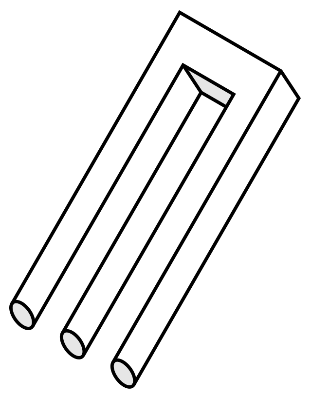
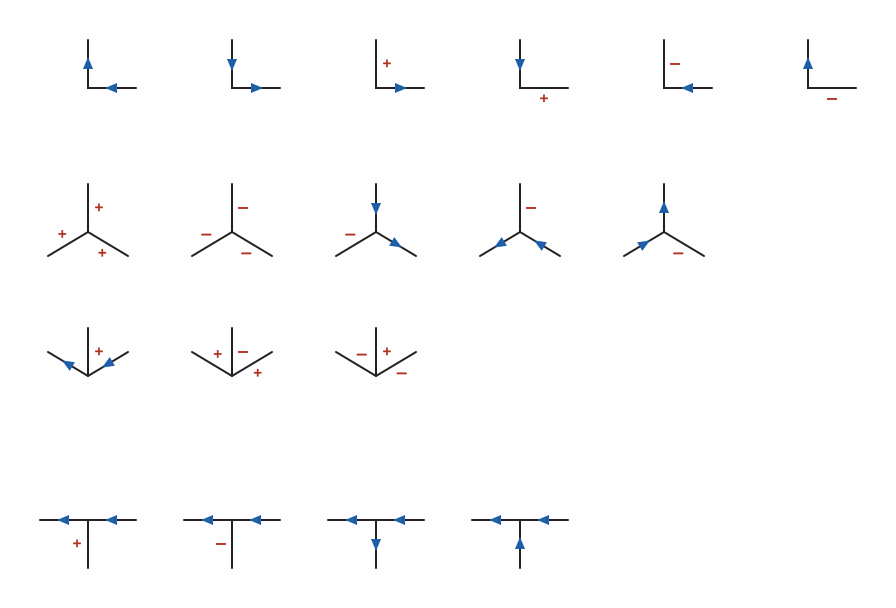
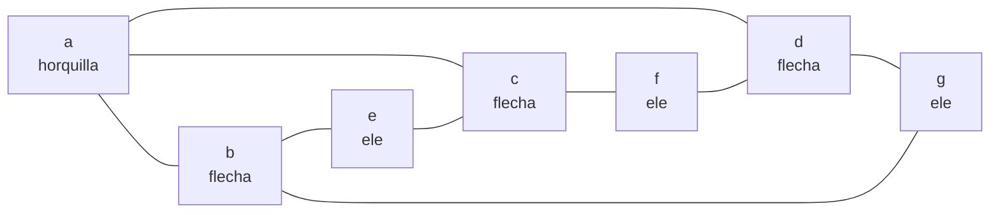
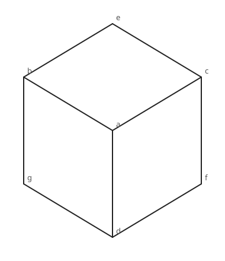
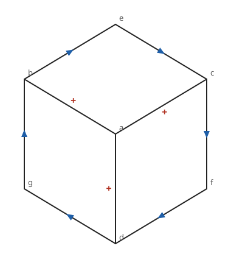
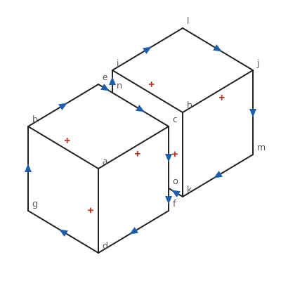
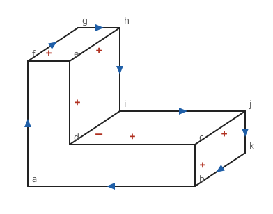
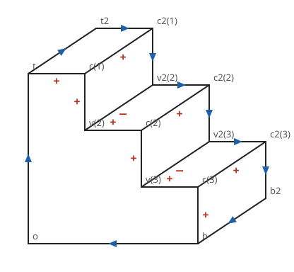
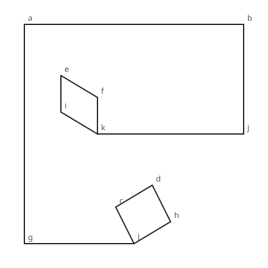

# Capítulo 80 — Proyecto: el etiquetado de Waltz

Un dibujo de líneas, como el de un cubo hecho con nueve trazos, no dice qué
representa cada trazo. Una línea puede ser una arista que sobresale, como
la de la esquina de una mesa; una arista hundida, como la del rincón entre
una caja y el piso; o el borde de un cuerpo que tapa lo que está detrás.
Quien mira el dibujo decide sin esfuerzo, y casi siempre ve una sola
escena. Un programa tiene que deducirlo, y a veces la deducción termina en
que el dibujo no corresponde a ningún objeto:



El *poiuyt*, también llamado *blivet* o tridente imposible. Cada parte del
dibujo, mirada sola, es la imagen de un objeto posible; el dibujo entero no
lo es. Imagen: AnonMoos,
[dominio público](https://commons.wikimedia.org/wiki/Template:PD-self), vía
[Wikimedia Commons](https://commons.wikimedia.org/wiki/File:Poiuyt.svg).

A principios de los años setenta, David Huffman y Maxwell Clowes mostraron,
cada uno por su lado, que en un mundo de poliedros el problema se reduce a
una cuestión combinatoria. Cada línea recibe una de cuatro **etiquetas**, y
en cada punto donde se juntan líneas, una **unión**, solo unas pocas
combinaciones de etiquetas son físicamente posibles: dieciocho en total. Un
dibujo se **interpreta** dando a cada línea una etiqueta de modo que todas
sus uniones queden en el catálogo; si no hay manera, el objeto es
imposible. David Waltz agregó en su tesis de 1972 la idea que lleva su
nombre: antes de buscar, descartar en cada unión las combinaciones que
ninguna unión vecina admite, y repetirlo hasta que no cambie nada. Con
frecuencia ese **filtrado** deja una sola combinación por unión, y el
dibujo queda interpretado sin buscar.

El proyecto parte de una propuesta de Clocksin y Mellish, en la lista de
proyectos avanzados de *Programming in Prolog*: expresar en Prolog la
interpretación de un dibujo, con los rasgos del dibujo representados por
variables y el dibujo como un conjunto de restricciones que esas variables
cumplen. El catálogo de uniones y el filtrado son los de Huffman, Clowes y
Waltz; el capítulo «Line-Diagram Labeling by Constraint Satisfaction» de
*Paradigms of Artificial Intelligence Programming*, de Peter Norvig, sirvió para comprobar la tabla de uniones y
las cifras de sus ejemplos. La lista completa, con lo que se toma de cada
fuente, está en [Referencias](#referencias). El código es propio.

El capítulo continúa el
[capítulo 23](../capitulo-23-programacion-con-restricciones/index.md): allí
las restricciones eran aritméticas, sobre enteros, y `library(clpfd)` las
propagaba; aquí las restricciones son tablas de combinaciones, y el
programa las propaga primero con la unificación, después con un filtrado
escrito a mano y al final otra vez con `clpfd`, para comparar.

## Objetivos del capítulo

Al terminar el capítulo, el lector puede:

- representar un problema de interpretación como variables con dominios
  finitos y restricciones dadas por tablas de combinaciones permitidas;
- calcular las uniones de un dibujo a partir de sus coordenadas, con
  aritmética entera, y recorrer el contorno exterior de un grafo plano;
- resolver el problema de cuatro maneras —generar y probar, unificación con
  vuelta atrás, filtrado de Waltz y `tuples_in/2` de `clpfd`— y comprobar
  que encuentran las mismas interpretaciones;
- explicar con mediciones por qué el orden de las elecciones decide el
  costo de la vuelta atrás, y por qué el filtrado lo vuelve casi lineal en
  dibujos grandes;
- reconocer los límites del método: dibujos ambiguos, que quedan con varias
  interpretaciones, y objetos imposibles que el filtrado solo no descubre.

!!! info "Tiempo estimado"
    Leer el capítulo, ejecutar sus ejemplos y hacer las actividades: **1:55 h**.
    Resolver los 5 ejercicios marcados con ★: **1:35 h**.
    Resolver los 11 ejercicios del final: **3:30 h**.

## 80.1 Líneas, uniones y etiquetas

El mundo del problema es el de Huffman y Clowes: poliedros cuyos vértices
son **triedros**, es decir, en cada vértice se juntan exactamente tres
caras, como en la esquina de un cubo; sin sombras ni grietas; y vistos
desde un punto **general**, de modo que ninguna alineación del dibujo es
casual. En ese mundo, cada línea del dibujo es la imagen de una de tres
clases de arista:

| Etiqueta | En el programa | Significado |
|---|---|---|
| + | `mas` | arista **convexa**: las dos caras que se ven forman un ángulo hacia afuera, como en la esquina de una mesa |
| − | `menos` | arista **cóncava**: las dos caras forman un rincón, como entre una caja y el piso |
| flecha | `der` o `izq` | **contorno**: una cara tapa lo que está detrás; al recorrer la línea en el sentido de la flecha, el cuerpo queda a la derecha |

El contorno lleva un sentido, y el programa no dibuja flechas: una línea
de contorno se etiqueta desde una de sus puntas, mirando a lo largo de la
línea. `der` dice que el cuerpo queda a la derecha y `izq`, a la izquierda.
Desde la otra punta la misma línea se ve al revés, así que `der` e `izq`
se intercambian, y `mas` y `menos` no cambian:

<!-- ejemplo: capitulo-80/catalogo.pl predicado: inversa/2 -->
```prolog
% inversa(E, F): una línea con la etiqueta E vista desde una punta tiene la
% etiqueta F vista desde la otra.
inversa(mas, mas).
inversa(menos, menos).
inversa(der, izq).
inversa(izq, der).
```

Las uniones son de cuatro tipos según su forma. Una **ele** junta dos
líneas. Una **horquilla** junta tres líneas sin que ningún ángulo entre
ellas supere los 180 grados, como el centro de un cubo. Una **flecha**
junta tres líneas con un ángulo mayor que 180: dos aletas y, entre ellas,
el astil. Una **te** junta tres líneas, dos de ellas alineadas: la barra,
que es el borde de un cuerpo, y el pie, una línea que desaparece detrás de
él. Las líneas de cada unión se nombran en el sentido de las agujas del
reloj, con un punto de partida fijo por tipo, y el catálogo dice qué
etiquetas puede tener cada una:

<!-- ejemplo: capitulo-80/catalogo.pl predicado: union_posible/2 -->
```prolog
% union_posible(Tipo, Etiquetas): una unión de Tipo puede tener sus líneas,
% en el orden del encabezado, con esas Etiquetas. Son las 18 del catálogo.
union_posible(ele, [der, izq]).
union_posible(ele, [izq, der]).
union_posible(ele, [mas, der]).
union_posible(ele, [izq, mas]).
union_posible(ele, [menos, izq]).
union_posible(ele, [der, menos]).
union_posible(horquilla, [mas, mas, mas]).
union_posible(horquilla, [menos, menos, menos]).
union_posible(horquilla, [izq, der, menos]).
union_posible(horquilla, [menos, izq, der]).
union_posible(horquilla, [der, menos, izq]).
union_posible(flecha, [der, mas, izq]).
union_posible(flecha, [mas, menos, mas]).
union_posible(flecha, [menos, mas, menos]).
union_posible(te, [der, izq, mas]).
union_posible(te, [der, izq, menos]).
union_posible(te, [der, izq, der]).
union_posible(te, [der, izq, izq]).
```



Las 18 uniones del catálogo, dibujadas por el programa de la
[sección 80.8](#808-version-6-dibujar-las-interpretaciones): seis eles,
cinco horquillas, tres flechas y cuatro tes. Cada línea lleva su etiqueta
vista desde la unión; una punta de flecha deja el cuerpo a la derecha.

Una unión de tres líneas podría tener 4³ = 64 combinaciones de etiquetas,
y una ele, 16; el catálogo admite 5, 3 o 4 de las primeras y 6 de las
segundas. La restricción es fuerte, y de ahí sale todo el método: en una
flecha, el astil nunca es un contorno; en una te, la barra siempre lo es,
con el cuerpo del lado opuesto al pie.

```prolog
?- union_posible(flecha, Es).
Es = [der, mas, izq] ;
Es = [mas, menos, mas] ;
Es = [menos, mas, menos].

?- cantidad(Tipo, N).
Tipo = ele,
N = 6 ;
Tipo = horquilla,
N = 5 ;
Tipo = flecha,
N = 3 ;
Tipo = te,
N = 4.
```

El cubo de la figura de la [sección 80.3](#803-version-1-del-dibujo-a-sus-uniones)
tiene siete uniones y nueve líneas. Visto como problema, cada unión es una
restricción sobre las líneas que la tocan, y dos uniones están
relacionadas cuando comparten una línea:



Las 4⁹ = 262 144 combinaciones de etiquetas del cubo se reducen a cuatro
interpretaciones: el cubo flota delante del fondo, está apoyado en el piso,
está pegado a una pared a la derecha o a una pared a la izquierda. Si se
agrega la condición de que el dibujo entero esté delante del fondo, queda
una sola. Las secciones siguientes llegan a ese resultado de cinco maneras.

## 80.2 El programa terminado

| Versión | Archivo | Agrega | Lo que no puede hacer todavía |
|---|---|---|---|
| 1 | `dibujo.pl` | las uniones, sus tipos y el contorno, calculados con las coordenadas | etiquetar |
| 2 | `generar.pl` | generar y probar: correcto y completo | terminar en un dibujo de quince líneas |
| 3 | `restricciones.pl` | cada unión como restricción; la unificación descarta en cuanto hay contradicción | evitar que un mal orden repita trabajo |
| 4 | `waltz.pl` | el filtrado de Waltz y la búsqueda con filtrado | — |
| 5 | `tablas.pl` | las uniones como tablas de `library(clpfd)` | — |
| 6 | `svg.pl` | el dibujo de cada interpretación | — |

`catalogo.pl` tiene las 18 uniones y `figuras.pl` los dibujos: `cubo`;
`bloques`, dos cubos, uno delante del otro; `escalon`, un bloque en forma
de ele; `poiuyt`; y `escalera(N)`, una escalera de N escalones generada
con N, para medir cómo crece el costo. `comparar.pl` carga las versiones 2
a 5 y las compara. Solo `catalogo.pl` y `figuras.pl` corren en SWISH: los
demás cargan otros archivos.

## 80.3 Versión 1: del dibujo a sus uniones

Un dibujo es un conjunto de puntos con coordenadas enteras, con el eje y
hacia arriba, y de segmentos entre ellos: `punto(cubo, a, 0, 0)`,
`segmento(cubo, a, b)`. Cuando un cuerpo tapa una línea, el dibujo la
corta donde desaparece, y ese punto es una te sobre el borde del cuerpo
que tapa.



Las uniones no se escriben a mano: se calculan. `vecinos/3` ordena las
líneas de un punto en el sentido de las agujas del reloj, de mayor a menor
ángulo, y `giro/5` compara dos de ellas con el producto vectorial, en
aritmética entera, sin errores de redondeo:

<!-- ejemplo: capitulo-80/dibujo.pl predicado: vecinos/3 giro/5 -->
```prolog
%!  vecinos(+F, +P, -Vs:list) is det.
%
%   Vs son los puntos unidos a P por una línea, en el sentido de las agujas
%   del reloj: de mayor a menor ángulo.
vecinos(F, P, Vs) :-
    coordenadas(F, P, X, Y),
    findall(Angulo-Q,
            ( conectados(F, P, Q),
              coordenadas(F, Q, XQ, YQ),
              Angulo is atan2(YQ - Y, XQ - X) ),
            Pares),
    sort(1, @>=, Pares, Ordenados),
    pairs_values(Ordenados, Vs).

%!  giro(+F, +P, +Q, +R, -Giro) is det.
%
%   Giro es el producto vectorial de los vectores de P a Q y de P a R:
%   negativo si R está a menos de 180 grados de Q en el sentido de las
%   agujas del reloj, positivo si está a más, y cero si están alineados.
giro(F, P, Q, R, Giro) :-
    vector(F, P, Q, X1-Y1),
    vector(F, P, R, X2-Y2),
    Giro is X1 * Y2 - Y1 * X2.
```

Con eso, el tipo de unión sale de los ángulos entre líneas consecutivas.
Dos líneas opuestas son la barra de una te; un ángulo mayor que 180 grados
hace una flecha, cuya primera aleta es la que sigue a ese ángulo; tres
ángulos menores, una horquilla. En una ele, la lista se rota para que el
ángulo de la primera línea a la segunda sea el menor:

<!-- ejemplo: capitulo-80/dibujo.pl predicado: tipo_segun/6 -->
```prolog
%!  tipo_segun(+N:integer, +Vs:list, +F, +P, -Tipo, -Lineas:list)
%!      is semidet.
%
%   Clasifica una unión de N líneas.
tipo_segun(2, [Q, R], F, P, ele, Lineas) :-
    giro(F, P, Q, R, G),
    G =\= 0,
    (   G < 0
    ->  Lineas = [Q, R]
    ;   Lineas = [R, Q]
    ).
tipo_segun(3, [Q1, Q2, Q3], F, P, Tipo, Lineas) :-
    rotaciones([Q1, Q2, Q3], Rs),
    (   member([A, B, C], Rs),
        opuestos(F, P, A, B)
    ->  Tipo = te,
        Lineas = [A, B, C]
    ;   member([A, B, C], Rs),
        giro(F, P, C, A, G),
        G > 0
    ->  Tipo = flecha,
        Lineas = [A, B, C]
    ;   Tipo = horquilla,
        Lineas = [Q1, Q2, Q3]
    ).
```

```prolog
?- member(P, [a, b, e]), union(cubo, P, Tipo, Lineas).
P = a,
Tipo = horquilla,
Lineas = [b, c, d] ;
P = b,
Tipo = flecha,
Lineas = [e, a, g] ;
P = e,
Tipo = ele,
Lineas = [c, b].

?- union(bloques, n, Tipo, Lineas).
Tipo = te,
Lineas = [c, e, i].
```

La unión `b` es una flecha cuyas aletas, `e` y `g`, son lados del
hexágono, y cuyo astil va al centro. `n` es una te: la barra une `c` y `e`,
en el borde del cubo de adelante, y el pie sube hacia `i`, una arista del
cubo de atrás que desaparece detrás del primero.

El segundo cálculo es el **contorno exterior**. La condición de borde de
Waltz dice que la escena está delante del fondo: cada línea del contorno
es un contorno con el cuerpo adentro. Recorrer el borde de una cara de un
dibujo plano es sencillo cuando cada punto conoce el orden de sus líneas:
al llegar a un punto desde un vecino, se sale por la línea que sigue a la
de llegada en el sentido de las agujas del reloj, y la cara recorrida
queda siempre a la izquierda. Si se empieza por el punto de más a la
izquierda y por su línea más alta, la cara de la izquierda es el fondo:

<!-- ejemplo: capitulo-80/dibujo.pl predicado: contorno/2 recorrer/6 -->
```prolog
%!  contorno(+F, -Ciclo:list) is det.
%
%   Ciclo son los puntos del borde exterior del dibujo F, recorrido en el
%   sentido de las agujas del reloj: el fondo queda a la izquierda y el
%   dibujo a la derecha. Empieza en el punto de más a la izquierda (el de
%   más abajo, si hay varios) y sigue por la línea más alta.
contorno(F, [P|Ciclo]) :-
    findall(X-Y-Q, punto(F, Q, X, Y), Ps),
    sort(Ps, [_-_-P|_]),
    vecinos(F, P, [Q|_]),
    recorrer(F, P, Q, P, Q, Ciclo).

%!  recorrer(+F, +U, +V, +P0, +Q0, -Ciclo:list) is det.
%
%   Ciclo son los puntos desde V hasta volver a recorrer la línea P0-Q0.
%   Al llegar a V desde U, sigue por la línea que viene después de U en el
%   sentido de las agujas del reloj, la que deja el fondo a la izquierda.
recorrer(F, U, V, P0, Q0, Ciclo) :-
    vecinos(F, V, Vs),
    siguiente(Vs, U, W),
    (   V == P0,
        W == Q0
    ->  Ciclo = []
    ;   Ciclo = [V|Resto],
        recorrer(F, V, W, P0, Q0, Resto)
    ).
```

```prolog
?- contorno(cubo, C).
C = [g, b, e, c, f, d].

?- fijas(cubo, borde, Fs).
Fs = [b-e-der, b-g-izq, c-e-izq, c-f-der, d-f-izq, d-g-der].
```

El contorno recorre el hexágono en el sentido de las agujas del reloj, con
el cubo a la derecha, y `fijas/3` traduce cada tramo a la etiqueta de su
línea vista desde la primera punta en el orden de los átomos: de `b` a `e`
el cuerpo queda a la derecha, `der`; de `g` a `b` también, pero la línea
se guarda como `b-g`, y vista desde `b` el cuerpo queda a la izquierda,
`izq`.

Por último, `problema/4` prepara lo que las versiones siguientes etiquetan:
una variable por línea, ligada si la condición de borde la fija, y cada
unión con sus líneas convertidas en **vistas**: `directa(E)` si la unión es
la primera punta de la línea, `inversa(E)` si es la segunda. `vista/2`
traduce de una a otra:

<!-- ejemplo: capitulo-80/dibujo.pl predicado: problema/4 vista/2 -->
```prolog
%!  problema(+F, +Modo, -Lineas:list, -Uniones:list) is semidet.
%
%   Lineas son pares Linea-E con una variable E por línea, ligada si el
%   Modo la fija; Uniones son términos u(P, Tipo, Vistas), donde cada vista
%   es directa(E) o inversa(E) según desde qué punta ve la unión a la
%   línea. Falla si el Modo fija dos etiquetas distintas a una línea.
problema(F, Modo, Lineas, Uniones) :-
    lineas(F, Ls),
    pairs_keys_values(Lineas, Ls, _),
    fijas(F, Modo, Fijas),
    maplist(fijar(Lineas), Fijas),
    uniones(F, Us),
    maplist(con_vistas(Lineas), Us, Uniones).

%!  vista(?Vista, ?Local) is nondet.
%
%   Local es la etiqueta de la línea vista desde la unión: la misma de la
%   línea si la vista es directa, la inversa si no.
vista(directa(E), E).
vista(inversa(E), Local) :-
    inversa(Local, E).
```

!!! question "Actividad"
    Predecir el tipo de las uniones `d` e `i` del dibujo `escalon` (la
    figura está en la [sección 80.8](#808-version-6-dibujar-las-interpretaciones))
    y el orden en que `union/4` da sus líneas. Comprobarlo. Después,
    sabiendo que el astil de una flecha es convexo o cóncavo y nunca un
    contorno, predecir la etiqueta de la línea de `d` a `i` en la
    interpretación con borde.

## 80.4 Versión 2: generar y probar

La versión más directa da una etiqueta a cada línea, de todas las maneras
posibles, y se queda con las combinaciones en las que cada unión está en
el catálogo:

<!-- ejemplo: capitulo-80/generar.pl predicado: etiquetar_gyp/3 union_valida/1 -->
```prolog
%!  etiquetar_gyp(+F, +Modo, -Lineas:list) is nondet.
%
%   Lineas es una interpretación del dibujo F, como pares Linea-Etiqueta:
%   primero se da una etiqueta a cada línea, después se prueba cada unión.
etiquetar_gyp(F, Modo, Lineas) :-
    problema(F, Modo, Lineas, Uniones),
    pairs_values(Lineas, Es),
    maplist(etiqueta, Es),
    maplist(union_valida, Uniones).

%!  union_valida(+U) is semidet.
%
%   Las etiquetas de las líneas de U, vistas desde la unión, forman una de
%   las uniones posibles de su tipo.
union_valida(u(_, Tipo, Vistas)) :-
    maplist(vista, Vistas, Locales),
    union_posible(Tipo, Locales),
    !.
```

`maplist(etiqueta, Es)` genera; `maplist(union_valida, Uniones)` prueba.
Las vistas de cada unión comparten las variables de las líneas, así que
una misma etiqueta se lee desde las dos puntas, invertida desde la
segunda. El corte de `union_valida/1` solo descarta la búsqueda de una
segunda entrada del catálogo con las mismas etiquetas, que no existe.

```prolog
?- interpretaciones_gyp(cubo, sin_borde, N).
N = 4.

?- interpretaciones_gyp(cubo, borde, N).
N = 1.
```

<!-- contexto: capitulo-80/waltz.pl -->
```prolog
?- escribir_interpretaciones(cubo, sin_borde).
1: ab=mas ac=mas ad=mas be=der bg=izq ce=izq cf=der df=izq dg=der
2: ab=mas ac=mas ad=mas be=der bg=izq ce=izq cf=der df=menos dg=menos
3: ab=mas ac=mas ad=mas be=der bg=izq ce=menos cf=menos df=izq dg=der
4: ab=mas ac=mas ad=mas be=menos bg=menos ce=izq cf=der df=izq dg=der
true.
```

Son las cuatro interpretaciones que Norvig enumera para el mismo dibujo:
la primera es el cubo que flota; en la segunda, las dos aristas de abajo,
`df` y `dg`, son cóncavas, y el cubo está apoyado en el piso; en la
tercera, las de la derecha lo pegan a una pared; en la cuarta, las de la
izquierda. En las cuatro las tres aristas del centro son convexas.

El costo es el de la [plantilla 15](../plantillas.md#15-generar-y-probar):
el cubo tiene nueve líneas, 4⁹ = 262 144 combinaciones, y contar sus
interpretaciones sin borde cuesta 3 842 924 inferencias. El bloque en
forma de ele tiene quince líneas, 4¹⁵, más de mil millones de
combinaciones: unas 4 096 veces más trabajo, que no termina en minutos.

**Lo que falta.** Una combinación se prueba entera aunque las dos primeras
líneas ya contradigan una unión. Hace falta descubrir la contradicción en
cuanto aparece.

## 80.5 Versión 3: cada unión es una restricción

La propuesta de Clocksin y Mellish es tratar el dibujo como un conjunto
de restricciones sobre las variables de las líneas. Una restricción de
unión es la lista de sus combinaciones posibles, y satisfacerla es
**elegir** una y unificarla con las vistas de la unión:

<!-- ejemplo: capitulo-80/restricciones.pl predicado: etiquetar_por_uniones/4 elegir/1 -->
```prolog
%!  etiquetar_por_uniones(+F, +Modo, +Orden, -Lineas:list) is nondet.
%
%   Lineas es una interpretación del dibujo F. Elige una combinación del
%   catálogo para cada unión, en el Orden dado: alfabetico o vecindad.
etiquetar_por_uniones(F, Modo, Orden, Lineas) :-
    problema(F, Modo, Lineas, Uniones0),
    ordenar(Orden, F, Uniones0, Uniones),
    maplist(elegir, Uniones).

%!  elegir(+U) is nondet.
%
%   Elige para la unión U una combinación de su tipo y la unifica con las
%   variables de sus líneas.
elegir(u(_, Tipo, Vistas)) :-
    union_posible(Tipo, Locales),
    maplist(vista, Vistas, Locales).
```

No hay nada que propagar a mano: la unificación lo hace. Cuando una unión
elige su combinación, las variables de sus líneas quedan ligadas, y la
unión siguiente que comparte una de esas líneas solo puede elegir
combinaciones que unifiquen con la etiqueta ya puesta. Una contradicción
hace fallar `elegir/1` en el momento en que aparece, y la vuelta atrás
prueba la combinación siguiente de la unión anterior.

!!! example "Patrón 83 — Restricción como tabla"
    **Problema.** Varias variables de dominio finito deben tomar, juntas,
    una de unas pocas combinaciones permitidas, que no se describen con
    una fórmula sino enumerándolas, como las uniones del catálogo de
    Huffman y Clowes.

    **Versión ingenua.** Dar un valor a cada variable por separado y
    comprobar después que cada grupo forma una combinación permitida: es
    generar y probar, que en el cubo cuesta 3 842 924 inferencias y en el
    bloque en forma de ele, de quince líneas, no termina en minutos.

    **Patrón.** Escribir la restricción como una tabla de filas, hechos
    como `union_posible/2`, y satisfacerla eligiendo una fila y
    unificándola con las variables del grupo, como `elegir/1`. Las
    variables compartidas entre grupos propagan cada elección por
    unificación, y una contradicción falla en cuanto aparece: el cubo
    cuesta 2 089 inferencias. Con `library(clpfd)`, la misma tabla se
    pasa a `tuples_in/2`, que además poda los dominios antes de elegir.

    **Cuándo no usarlo.** Cuando las combinaciones permitidas son
    demasiadas para enumerarlas, o siguen una regla aritmética: entonces
    la restricción se escribe como fórmula, con `#=` y las demás
    restricciones del [capítulo 23](../capitulo-23-programacion-con-restricciones/index.md).
    Y cuando el orden de las elecciones no sigue las variables compartidas:
    la tabla sola no evita que la vuelta atrás repita trabajo ([Patrón 84](../patrones.md#84-filtrar-antes-de-buscar)).

```prolog
?- interpretaciones_por_uniones(bloques, sin_borde, vecindad, N).
N = 15.

?- interpretaciones_por_uniones(bloques, borde, vecindad, N).
N = 1.

?- interpretaciones_por_uniones(poiuyt, sin_borde, vecindad, N).
N = 0.
```

Los dos cubos, sin la condición de borde, admiten quince
interpretaciones; con ella, una. El poiuyt no admite ninguna: es un
objeto imposible.

El costo depende del **orden** en que se eligen las uniones. Si una unión
se elige cuando ninguna de sus líneas tiene etiqueta todavía, todas sus
combinaciones pasan, y la contradicción, si la hay, se descubre más tarde,
después de haber combinado esa elección con las de otras uniones.
`ordenar/4` con `vecindad` elige primero una unión y después, cada vez, la
primera de las restantes que comparte una línea con alguna ya elegida:

<!-- ejemplo: capitulo-80/restricciones.pl predicado: vecindad/4 -->
```prolog
%!  vecindad(+Restantes:list, +F, +Elegidas:list, -Orden:list) is det.
%
%   Orden son las Restantes en el orden en que se agregan: cada vez, la
%   primera de ellas unida a una de las Elegidas, o la primera de todas si
%   ninguna lo está.
vecindad([], _, _, []).
vecindad([R|Rs], F, Elegidas, [U|Orden]) :-
    Restantes = [R|Rs],
    (   select(U, Restantes, Otras),
        unida(F, U, Elegidas)
    ->  true
    ;   Restantes = [U|Otras]
    ),
    vecindad(Otras, F, [U|Elegidas], Orden).
```

Las inferencias, medidas con `call_time/2` después de una primera
ejecución, para contar todas las interpretaciones:

| Dibujo | Modo | Orden alfabético | Orden por vecindad |
|---|---|---:|---:|
| `cubo` | sin borde | 2 089 | 2 181 |
| `poiuyt` | sin borde | 490 770 | 6 195 |
| `escalera(5)` | sin borde | 181 582 | 20 411 |
| `escalera(10)` | sin borde | 595 475 850 | 342 022 |
| `escalera(10)` | borde | 36 442 708 | 36 792 |
| `escalera(20)` | sin borde | — | 315 261 953 |

En el cubo los dos órdenes coinciden casi, porque los nombres de los
puntos ya siguen las líneas. En la escalera, cuyos puntos se llaman `c(1)`,
`c(2)`, …, `v(2)`, …, el orden alfabético elige primero todas las
esquinas convexas, que no comparten líneas entre sí: diez escalones
cuestan casi seiscientos millones de inferencias. La vecindad lo arregla
en parte, pero sin la condición de borde también se vuelve exponencial:
de diez a veinte escalones, el costo se multiplica por mil.

**Lo que falta.** La vuelta atrás es **cronológica**: cuando una unión no
tiene combinación posible, se cambia la elección de la unión anterior,
aunque la causa esté en otra, mucho antes. Sin borde, las líneas del
contorno admiten varias etiquetas, y una elección del principio se
contradice recién en el otro extremo de la escalera; entre tanto, todas
las combinaciones intermedias se rehacen una y otra vez.

!!! question "Actividad"
    Antes de ejecutarlo, predecir si `etiquetar_por_uniones/4` con orden
    `alfabetico` en el dibujo `poiuyt` y la condición de borde cuesta más o
    menos que sin ella, y por qué. Comprobarlo con `medir/5` de
    `comparar.pl`.

## 80.6 Versión 4: el filtrado de Waltz

Waltz razona sobre **conjuntos** de combinaciones en lugar de elegir una.
Cada unión tiene su **dominio**: la lista de las combinaciones del
catálogo que todavía son posibles, cada una ya traducida a pares
`Linea-Etiqueta` con la etiqueta vista desde la primera punta de la línea.
Dos uniones vecinas J y K comparten una línea L. Una combinación de K que
da a L una etiqueta que **ninguna** combinación de J le da no puede formar
parte de ninguna interpretación, y se descarta. Eso es `revisar/5`:

<!-- ejemplo: capitulo-80/waltz.pl predicado: revisar/5 da_etiqueta/3 -->
```prolog
%!  revisar(+J, +K, +D0, -D, -Reducido) is det.
%
%   D es D0 sin las combinaciones de K que dan a la línea J-K una etiqueta
%   que ninguna combinación de J le da. Reducido es si(N), con N el nuevo
%   tamaño, o no si no se quitó ninguna.
revisar(J, K, D0, D, Reducido) :-
    linea(J, K, L),
    get_assoc(J, D0, CsJ),
    get_assoc(K, D0, CsK),
    findall(E, ( member(C, CsJ), memberchk(L-E, C) ), Es0),
    sort(Es0, Es),
    include(da_etiqueta(L, Es), CsK, Quedan),
    length(CsK, Antes),
    length(Quedan, Despues),
    (   Despues < Antes
    ->  put_assoc(K, D0, Quedan, D),
        Reducido = si(Despues)
    ;   D = D0,
        Reducido = no
    ).

%!  da_etiqueta(+L, +Es:list, +C:list) is semidet.
%
%   La combinación C da a la línea L una de las etiquetas Es.
da_etiqueta(L, Es, C) :-
    memberchk(L-E, C),
    memberchk(E, Es).
```

Cuando el dominio de K se reduce, las vecinas de K pueden perder a su vez
combinaciones, así que K entra en una **cola** de uniones por revisar.
`propagar/5` toma la primera unión de la cola, revisa contra ella el
dominio de cada vecina, agrega al final las que cambiaron, y sigue hasta
vaciar la cola. Si un dominio queda vacío, falla: el dibujo no tiene
interpretación. Los dominios se guardan en un árbol AVL de `library(assoc)`,
del [capítulo 22](../capitulo-22-estructuras-de-datos-de-la-biblioteca/index.md),
y los pasos se anotan en una lista diferencia, del
[capítulo 34](../capitulo-34-estructuras-incompletas-y-listas-diferencia/index.md):

<!-- ejemplo: capitulo-80/waltz.pl predicado: propagar/5 revisar_vecinas/8 -->
```prolog
%!  propagar(+Cola:list, +Vecinos, +D0, -D, -Pasos:list) is semidet.
%
%   D son los dominios D0 filtrados a partir de las uniones de la Cola.
%   Pasos registra cada reducción como K-N: la unión y el tamaño en que
%   quedó su dominio. Falla si un dominio queda vacío.
propagar([], _, D, D, []).
propagar([J|Cola0], Vecinos, D0, D, Pasos) :-
    get_assoc(J, Vecinos, Ks),
    revisar_vecinas(Ks, J, D0, D1, Cola0, Cola, Pasos, Pasos1),
    propagar(Cola, Vecinos, D1, D, Pasos1).

%!  revisar_vecinas(+Ks:list, +J, +D0, -D, +Cola0, -Cola, -Pasos, ?Resto)
%!      is semidet.
%
%   Revisa el dominio de cada vecina K de J contra el de J. Cada vecina
%   cuyo dominio se reduce se agrega al final de la cola, si no estaba, y
%   su reducción se anota en la lista diferencia Pasos-Resto.
revisar_vecinas([], _, D, D, Cola, Cola, Pasos, Pasos).
revisar_vecinas([K|Ks], J, D0, D, Cola0, Cola, Pasos, Resto) :-
    revisar(J, K, D0, D1, Reducido),
    (   Reducido = si(N)
    ->  N > 0,
        Pasos = [K-N|Pasos1],
        (   memberchk(K, Cola0)
        ->  Cola1 = Cola0
        ;   append(Cola0, [K], Cola1)
        )
    ;   Pasos1 = Pasos,
        Cola1 = Cola0
    ),
    revisar_vecinas(Ks, J, D1, D, Cola1, Cola, Pasos1, Resto).
```

La cola tiene primero todas las uniones; después, solo las que cambiaron.
El filtrado termina siempre: una unión vuelve a la cola únicamente cuando
pierde una combinación, y hay a lo sumo seis por unión. Los tamaños de los
dominios del cubo, antes y después de filtrar:

```prolog
?- tamanos(cubo, sin_borde, inicial, Ts).
Ts = [a-5, b-3, c-3, d-3, e-6, f-6, g-6].

?- tamanos(cubo, sin_borde, filtrado, Ts).
Ts = [a-1, b-2, c-2, d-2, e-3, f-3, g-3].

?- tamanos(cubo, borde, filtrado, Ts).
Ts = [a-1, b-1, c-1, d-1, e-1, f-1, g-1].
```

Sin borde, el filtrado deja una sola combinación en el centro, `a`: las
tres aristas que salen de él son convexas, en las cuatro
interpretaciones. Las demás uniones quedan ambiguas: de 5 · 3³ · 6³ =
29 160 combinaciones se pasa a 2³ · 3³ = 216. Con la condición de borde,
el filtrado solo resuelve el dibujo: cada unión queda con una combinación,
y no hay nada que buscar. Son las mismas cifras que imprime el programa de
Norvig para el mismo cubo.

Cuando el filtrado deja uniones ambiguas, hace falta buscar. `buscar/3`
elige la unión ambigua de dominio más chico, le fija una de sus
combinaciones y filtra otra vez desde ella; cuando todos los dominios
tienen una sola combinación, su unión es la interpretación:

<!-- ejemplo: capitulo-80/waltz.pl predicado: buscar/3 ambigua/2 -->
```prolog
%!  buscar(+Vecinos, +D, -Lineas:list) is nondet.
%
%   Si todos los dominios de D tienen una sola combinación, Lineas es su
%   unión. Si no, elige una combinación de la unión ambigua de dominio más
%   chico, filtra desde ella y sigue.
buscar(Vecinos, D, Lineas) :-
    assoc_to_list(D, Ps),
    (   ambigua(Ps, J)
    ->  get_assoc(J, D, Cs),
        member(C, Cs),
        put_assoc(J, D, [C], D1),
        propagar([J], Vecinos, D1, D2, _),
        buscar(Vecinos, D2, Lineas)
    ;   pairs_values(Ps, Unicas),
        append(Unicas, Combinaciones),
        append(Combinaciones, Pares),
        sort(Pares, Lineas)
    ).

%!  ambigua(+Ps:list, -J) is semidet.
%
%   J es la unión con más de una combinación y el dominio más chico de los
%   pares P-Cs. Falla si no hay ninguna.
ambigua(Ps, J) :-
    findall(N-P, ( member(P-Cs, Ps), length(Cs, N), N > 1 ), Ns),
    sort(Ns, [_-J|_]).
```

Elegir primero la unión con menos combinaciones es el `ff` (*first fail*)
del [capítulo 23](../capitulo-23-programacion-con-restricciones/index.md#233-etiquetar),
y filtrar después de cada elección hace que una contradicción se descubra
en la unión donde aparece, no después de haber combinado elecciones que no
tienen nada que ver con ella. Las inferencias para contar todas las
interpretaciones:

| Dibujo | Modo | Vecindad (versión 3) | Waltz |
|---|---|---:|---:|
| `cubo` | sin borde | 2 181 | 7 579 |
| `poiuyt` | sin borde | 6 195 | 7 733 |
| `escalera(5)` | sin borde | 20 411 | 25 803 |
| `escalera(10)` | sin borde | 342 022 | 51 471 |
| `escalera(20)` | sin borde | 315 261 953 | 104 489 |
| `escalera(40)` | sin borde | — | 216 357 |
| `escalera(20)` | borde | 170 857 | 63 551 |
| `escalera(40)` | borde | — | 137 603 |

En los dibujos chicos el filtrado cuesta más que la unificación, porque
maneja listas de combinaciones donde la versión 3 solo liga variables. En
la escalera, el costo del filtrado crece en proporción al tamaño: duplicar
los escalones duplica las inferencias.

El poiuyt muestra el límite del filtrado:

<!-- contexto: capitulo-80/waltz.pl -->
```prolog
?- escribir_tamanos(poiuyt, sin_borde, inicial).
a:6 b:6 c:6 d:6 e:6 f:6 g:6 h:6 i:6 j:6 k:3 l:3
true.

?- escribir_tamanos(poiuyt, sin_borde, filtrado).
a:5 b:5 c:2 d:3 e:3 f:2 g:4 h:4 i:4 j:4 k:3 l:3
true.

?- interpretaciones_waltz(poiuyt, sin_borde, N).
N = 0.
```

El filtrado no vacía ningún dominio: quedan 2 073 600 combinaciones, y
cada par de uniones vecinas tiene combinaciones compatibles. La
imposibilidad aparece recién en la búsqueda, cuando las elecciones de una
punta del dibujo se encuentran con las de la otra. El filtrado compara las
uniones **de a pares**; una contradicción que solo se ve mirando varias a
la vez queda para la búsqueda. Norvig observa lo mismo con su programa, y
que esa es también la causa de la ilusión: cada parte del poiuyt, mirada
sola, es posible.

!!! example "Patrón 84 — Filtrar antes de buscar"
    **Problema.** Un problema de restricciones entre grupos de variables
    que comparten algunas de ellas tiene muchas combinaciones, y una
    búsqueda con vuelta atrás descubre una contradicción lejos de la
    elección que la causó.

    **Versión ingenua.** Elegir una combinación por grupo, en algún orden,
    y volver atrás cuando un grupo no tiene combinación posible: la
    versión 3 cuesta 342 022 inferencias en la escalera de diez escalones
    sin borde y 315 261 953 en la de veinte.

    **Patrón.** Dar a cada grupo su dominio de combinaciones posibles y
    quitar de cada uno las que ningún grupo vecino admite, con una cola de
    los grupos cuyo dominio cambió, hasta que la cola se vacía
    (`propagar/5`). Si queda ambigüedad, elegir en el grupo de dominio más
    chico y volver a filtrar después de cada elección (`buscar/3`). La
    escalera de veinte escalones cuesta 104 489 inferencias, y duplicar el
    tamaño duplica el costo.

    **Cuándo no usarlo.** Cuando el problema es chico y la unificación ya
    poda bien: en el cubo, el filtrado cuesta 7 579 inferencias contra
    2 181 de la versión 3. Y no tomar un filtrado sin dominios vacíos como
    prueba de que hay solución: el poiuyt pasa el filtrado con 2 073 600
    combinaciones y no tiene ninguna interpretación; la búsqueda sigue
    siendo necesaria.

## 80.7 Versión 5: las uniones como tablas de `clpfd`

`library(clpfd)` tiene una restricción para el caso: `tuples_in(Tuplas,
Filas)` exige que cada lista de variables de `Tuplas` sea igual a alguna de
las `Filas`. Las etiquetas pasan a ser enteros, del 1 al 4, y cada unión
es una tabla, con las filas del catálogo traducidas a las etiquetas vistas
desde la primera punta de cada línea:

<!-- ejemplo: capitulo-80/tablas.pl predicado: modelo_clpfd/3 tabla/2 -->
```prolog
%!  modelo_clpfd(+F, +Modo, -Pares:list) is semidet.
%
%   Pares son pares Linea-V, con V la variable entera de cada línea del
%   dibujo F, después de plantear todas las restricciones. Falla si la
%   propagación ya descubre que no hay interpretación.
modelo_clpfd(F, Modo, Pares) :-
    lineas(F, Ls),
    pairs_keys_values(Pares, Ls, Vs),
    Vs ins 1..4,
    fijas(F, Modo, Fijas),
    maplist(fijar_codigo(Pares), Fijas),
    uniones(F, Us),
    maplist(tabla(Pares), Us).

%!  tabla(+Pares:list, +U) is semidet.
%
%   Plantea la restricción de la unión U = u(P, Tipo, Ks): las variables de
%   sus líneas forman una fila de la tabla de su tipo.
tabla(Pares, u(P, Tipo, Ks)) :-
    maplist(variable_de_linea(Pares, P), Ks, Vs),
    findall(Fila,
            ( union_posible(Tipo, Locales),
              maplist(codigo_global(P), Ks, Locales, Fila) ),
            Filas),
    tuples_in([Vs], Filas).
```

`tuples_in/2` quita de cada variable los valores que no aparecen en
ninguna fila compatible con los dominios de las demás variables de la
tabla, y vuelve a hacerlo cada vez que un dominio cambia. Es el filtrado
de Waltz hecho por la biblioteca, sobre la tabla del [Patrón 83](../patrones.md#83-restriccion-como-tabla): el
[Patrón 84](../patrones.md#84-filtrar-antes-de-buscar) sin escribirlo. Las etiquetas que quedan posibles para
cada línea del cubo, sin etiquetar nada:

```prolog
?- escribir_posibles(cubo, sin_borde).
ab: [mas]
ac: [mas]
ad: [mas]
be: [menos,der]
bg: [menos,izq]
ce: [menos,izq]
cf: [menos,der]
df: [menos,izq]
dg: [menos,der]
true.
```

Las tres aristas del centro, convexas; cada línea del contorno, cóncava o
de contorno con el cuerpo adentro. `posibles_waltz/3`, en `comparar.pl`,
calcula lo mismo con los dominios del filtrado de la versión 4, y las
pruebas de ese archivo comprueban que los dos coinciden en todos los
dibujos, con borde y sin él; y que las versiones 2 a 5 encuentran las
mismas interpretaciones. El modelo sigue el
[Patrón 27](../patrones.md#27-modelar-restringir-etiquetar): las
variables con sus dominios, las restricciones, y el etiquetado al final,
con `labeling([ff], Vs)`. Cuesta un poco más que el filtrado propio,
9 748 inferencias contra 7 579 en el cubo y 109 433 contra 104 489 en la
escalera de veinte escalones, y crece igual que él.

## 80.8 Versión 6: dibujar las interpretaciones

Una interpretación se entiende mejor dibujada. `svg/4` escribe el dibujo
como un documento SVG: las coordenadas del dibujo tienen el eje y hacia
arriba y las del SVG hacia abajo, así que la y se invierte; cada línea
lleva su marca en el centro: un signo, o una punta de flecha que deja el
cuerpo a la derecha.

<!-- ejemplo: capitulo-80/svg.pl predicado: marca_de/5 punta/4 -->
```prolog
%!  marca_de(+E, +XM, +YM, +DX, +DY) is det.
%
%   Escribe la marca de E en el centro (XM, YM) de una línea de dirección
%   unitaria (DX, DY), que va de la primera punta a la segunda.
marca_de(mas, XM, YM, DX, DY) :-
    signo("+", XM, YM, DX, DY).
marca_de(menos, XM, YM, DX, DY) :-
    signo("−", XM, YM, DX, DY).
marca_de(der, XM, YM, DX, DY) :-
    punta(XM, YM, DX, DY).
marca_de(izq, XM, YM, DX, DY) :-
    MX is -DX,
    MY is -DY,
    punta(XM, YM, MX, MY).

%!  punta(+XM, +YM, +DX, +DY) is det.
%
%   Escribe una punta de flecha centrada en (XM, YM) que apunta en la
%   dirección (DX, DY).
punta(XM, YM, DX, DY) :-
    XA is XM + DX * 7,
    YA is YM + DY * 7,
    XB is XM - DX * 5 - DY * 5,
    YB is YM - DY * 5 + DX * 5,
    XC is XM - DX * 5 + DY * 5,
    YC is YM - DY * 5 - DX * 5,
    format('  <polygon points="~1f,~1f ~1f,~1f ~1f,~1f" fill="#1f5fa8"/>~n',
           [XA, YA, XB, YB, XC, YC]).
```

`generar_figuras/1` escribió todas las figuras del capítulo, el catálogo
incluido. Las interpretaciones con borde de los cuatro dibujos posibles:









En los dos cubos, `n` y `o` son tes: la barra es el contorno del cubo de
adelante, con su cuerpo del lado opuesto al pie, y el pie es un contorno
del cubo de atrás que sigue por detrás. En el bloque en forma de ele y en
la escalera, las aristas de los rincones son cóncavas: el filtrado las
deduce del contorno, sin que nadie las marque.

El poiuyt del programa tiene las mismas uniones, con sus líneas en el
mismo orden, que el de la figura 17.10 de Norvig, y por eso las mismas
restricciones y los mismos dominios después de filtrar. No tiene sus
proporciones: tiene las de un dibujo cualquiera que cumple esos giros.



!!! success "Criterios de calidad"
    | Criterio | En este capítulo |
    |---|---|
    | C1 | cada predicado declara modos y determinación; `coordenadas/4` toma la primera posición de un punto con `once/1` y lo dice en su encabezado |
    | C2 | representaciones limpias: una unión es `u(P, Tipo, Lineas)`, una vista `directa(E)` o `inversa(E)`, un dominio una lista de combinaciones; ninguna se distingue con pruebas de tipo |
    | C4 | los predicados `det` no dejan alternativas pendientes: los que se llaman con el primer argumento ligado pero distinguen sus cláusulas por otro reciben ese argumento primero (`propagar/5`, `vecindad/4`, `fijas_segun/3`) |
    | C6 | el núcleo es puro: el filtrado devuelve dominios nuevos en lugar de modificar hechos, y los predicados que escriben (`escribir_tamanos/3`, `svg/4`) solo dan formato a lo que el núcleo calculó |
    | C7 | 124 pruebas en nueve archivos; `comparar.plt` comprueba que las cuatro versiones que terminan encuentran las mismas interpretaciones en todos los dibujos |

## Ejercicios

Las soluciones están en [la página de soluciones](soluciones.md). La dificultad
va de 1 (se resuelve consultando el capítulo) a 3 (requiere elaboración propia).
Los marcados con ★ son los que no conviene saltear: cubren lo que el capítulo
tiene de propio. Los ejercicios que piden código se resuelven en archivos
que cargan los del capítulo, sin modificarlos.

1. ★ **(1)** Con la figura del cubo etiquetado a la vista, predecir qué
   etiquetas deja el filtrado sin borde en la línea de `b` a `e` y en la de
   `a` a `b`, y por qué la segunda no depende de la condición de borde.
   Comprobarlo con `escribir_posibles/2`.
2. **(1)** Escribir `posibles_en(Tipo, I, Es)`: Es son las etiquetas que la
   línea I de una unión de Tipo puede tener en alguna entrada del
   catálogo. Comprobar que el astil de una flecha nunca es un contorno y
   que el pie de una te puede tener cualquier etiqueta.
3. ★ **(2)** Escribir `combinaciones(F, Modo, Momento, N)`: N es el
   producto de los tamaños de los dominios del dibujo F, antes o después
   del filtrado. Comprobar las cifras de Norvig: 29 160 y 216 para el cubo
   sin borde, 544 195 584 y 2 073 600 para el poiuyt.
4. ★ **(2)** Escribir `etiquetar_apoyado(F, Apoyadas, Lineas)`: las
   interpretaciones del dibujo F, sin la condición de borde, en las que las
   líneas de la lista Apoyadas son cóncavas porque el objeto se apoya ahí.
   Comprobar que el cubo apoyado en la línea `d-g` tiene una sola
   interpretación, y decir cuál de las cuatro es.
5. **(2)** Agregar a las figuras, desde otro archivo, un dibujo
   `dos_cubos` con dos cubos separados que no se tapan. Predecir cuántas
   interpretaciones tiene sin borde y con borde, y comprobarlo. Si la
   cifra con borde no es la esperada, explicar qué parte del dibujo
   recorre `contorno/2`.
6. ★ **(2)** Escribir `ambiguas(F, Modo, Ls)`: las líneas del dibujo F que
   tienen etiquetas distintas en distintas interpretaciones. Aplicarlo al
   cubo y a los dos cubos sin borde, y explicar el resultado del segundo.
7. **(2)** Escribir `etiquetar_por_catalogo/3`, la versión 3 con un orden
   que elige primero las uniones con menos entradas en el catálogo (flechas,
   después tes, horquillas y eles), y medirlo contra `vecindad` en
   `escalera(N)` sin borde, con N = 2, 4 y 6. Explicar el resultado.
8. ★ **(3)** Medir con `medir/5` las versiones `vecindad` y `waltz` en
   `escalera(N)` sin borde, para N de 2 a 12. Decir cómo crece cada una, y
   explicar con un ejemplo concreto qué trabajo repite la vuelta atrás
   cronológica de la versión 3.
9. **(2)** Escribir `pasos(F, Modo, N, Revisiones)`: N es la cantidad de
   reducciones de dominio que hace el filtrado del dibujo F, y Revisiones
   la cantidad de veces que una unión sale de la cola. Compararlas en el
   cubo con borde y sin él.
10. **(3)** Dibujar un prisma triangular apoyado sobre una de sus caras
    rectangulares, visto desde arriba y de costado: escribir sus puntos y
    segmentos, comprobar el tipo de cada unión y contar sus
    interpretaciones con borde y sin él.
11. **(2)** En un catálogo cambiado, la flecha de contorno se escribe
    `[mas, der, izq]` en lugar de `[der, mas, izq]`. Predecir cuántas
    interpretaciones tiene entonces el cubo con borde y explicar por qué el
    orden de las líneas es parte del catálogo. Comprobarlo con una copia de
    las restricciones que use el catálogo cambiado.

## Resumen

| | |
|---|---|
| **etiqueta de línea** | convexa (`mas`), cóncava (`menos`) o contorno, con el cuerpo a la derecha (`der`) o a la izquierda (`izq`) vista desde una punta |
| **catálogo de Huffman y Clowes** | las 18 combinaciones posibles en las cuatro clases de unión de un mundo de vértices triedros |
| **interpretación** | una etiqueta por línea con todas las uniones en el catálogo; ninguna, objeto imposible; varias, dibujo ambiguo |
| **condición de borde** | el contorno exterior es un contorno con el cuerpo adentro; se obtiene recorriendo la cara exterior del dibujo |
| **restricción por unificación** | elegir una entrada del catálogo liga las variables de las líneas; la unión siguiente solo acepta lo que unifica |
| **vuelta atrás cronológica** | se cambia la última elección aunque la causa del fallo esté en otra; con un mal orden repite trabajo exponencialmente |
| **filtrado de Waltz** | quitar de una unión las combinaciones que ninguna vecina admite, con una cola de uniones cambiadas, hasta un punto fijo |
| **búsqueda con filtrado** | elegir en la unión ambigua de dominio más chico y filtrar otra vez después de cada elección |
| `tuples_in/2` | `library(clpfd)`: una lista de variables es igual a una de las filas de una tabla; propaga como el filtrado |
| **[Patrón 83](../patrones.md#83-restriccion-como-tabla)** | restricción como tabla |
| **[Patrón 84](../patrones.md#84-filtrar-antes-de-buscar)** | filtrar antes de buscar |
| `union/4`, `contorno/2`, `fijas/3`, `problema/4` | las uniones, el contorno y las variables de un dibujo |
| `etiquetar_gyp/3`, `etiquetar_por_uniones/4` | generar y probar; cada unión como restricción |
| `filtrar/3`, `etiquetar_waltz/3`, `tamanos/4` | el filtrado de Waltz y la búsqueda |
| `modelo_clpfd/3`, `posibles_clpfd/3` | las uniones como tablas de `clpfd` |
| `svg/4`, `generar_figuras/1` | el dibujo de las interpretaciones |

## Temas que se retoman

| Tema | Se retoma en |
|---|---|
| Un punto fijo calculado propagando solo lo que cambió, como la cola del filtrado: la evaluación semi-ingenua de Datalog | [capítulo 85](../capitulo-85-proyecto-motor-datalog/index.md) |

## Referencias

- William F. Clocksin y Christopher S. Mellish, *Programming in Prolog*,
  5.ª edición, Springer, 2003 — capítulo «Projects in Prolog», apartado
  «Advanced Projects», proyecto 9. Sin edición en línea legal
  conocida. El capítulo toma la propuesta: interpretar un dibujo de líneas
  representando sus rasgos con variables, de modo que el dibujo sea un
  conjunto de restricciones sobre ellas; es la versión 3.
- David A. Huffman, «Impossible Objects as Nonsense Sentences», en
  B. Meltzer y D. Michie (eds.), *Machine Intelligence 6*, Edinburgh
  University Press, 1971, pp. 295–323; y Maxwell B. Clowes, «On Seeing
  Things», *Artificial Intelligence* 2(1), 1971, pp. 79–116. Sin edición en
  línea abierta encontrada; se citan a través de Norvig y Sloman. El
  capítulo toma las tres clases de arista, los cuatro tipos de unión, el
  catálogo de 18 uniones del mundo de vértices triedros y la idea de que un
  dibujo sin etiquetado posible es el de un objeto imposible.
- David L. Waltz, *Generating Semantic Descriptions from Drawings of
  Scenes with Shadows*, tesis doctoral, informe técnico AI-TR-271, MIT
  Artificial Intelligence Laboratory, 1972.
  [Edición en línea en el repositorio del MIT](https://hdl.handle.net/1721.1/6911).
  Publicada como «Understanding Line Drawings of Scenes with Shadows» en
  P. H. Winston (ed.), *The Psychology of Computer Vision*, McGraw-Hill,
  1975. Extiende el catálogo a sombras y grietas e introduce el filtrado.
  El capítulo toma el filtrado de la versión 4 y la condición de borde.
- Peter Norvig, *Paradigms of Artificial Intelligence Programming*, Morgan
  Kaufmann, 1992 — capítulo «Line-Diagram Labeling by Constraint
  Satisfaction». [Edición en línea del autor, con licencia MIT](https://github.com/norvig/paip-lisp/blob/main/docs/chapter17.md).
  El capítulo toma la convención de las etiquetas de contorno vistas desde
  una punta, la comprobación de la tabla de 18 uniones, las cuatro
  interpretaciones del cubo y su número de combinaciones antes y después
  del filtrado, y la estructura de uniones del poiuyt de su figura 17.10.
- Aaron Sloman, «TEACH WALTZ», archivo de enseñanza del sistema Poplog,
  Universidad de Birmingham, 1981, revisado en 1994.
  [Edición en línea](https://poplog.fricas.org/bham/teachpop/waltz.txt).
  El capítulo toma la presentación del filtrado como eliminación entre
  pares de uniones vecinas hasta que no cambie nada, y su observación de
  que el filtrado repetido deja a menudo una sola interpretación.
- Neil C. Rowe, *Artificial Intelligence through Prolog*, Prentice Hall,
  1988 — apartados «Reasoning about possibilities» y
  «Formalization of pure relaxation», aprobado para su distribución
  pública. [Edición en línea del autor](https://faculty.nps.edu/ncrowe/book/chap13.html).
  El capítulo toma el nombre de *relajación* para el razonamiento sobre
  listas de posibilidades, con una agenda de variables activas como la
  cola de uniones del filtrado.
- Alan K. Mackworth, «Consistency in Networks of Relations», *Artificial
  Intelligence* 8(1), 1977, pp. 99–118. Sin edición en línea abierta
  encontrada. Generaliza el filtrado de Waltz como **consistencia de
  arcos** de una red de restricciones, el nombre con que lo propaga
  `tuples_in/2`.

El código del capítulo es propio, escrito para el curso: ninguna de las
fuentes da un programa en Prolog para el problema. El cálculo de las
uniones a partir de las coordenadas, el recorrido del contorno, las cinco
versiones medidas sobre los mismos dibujos, la escalera generada y el
dibujo en SVG no tienen equivalente en ellas.
