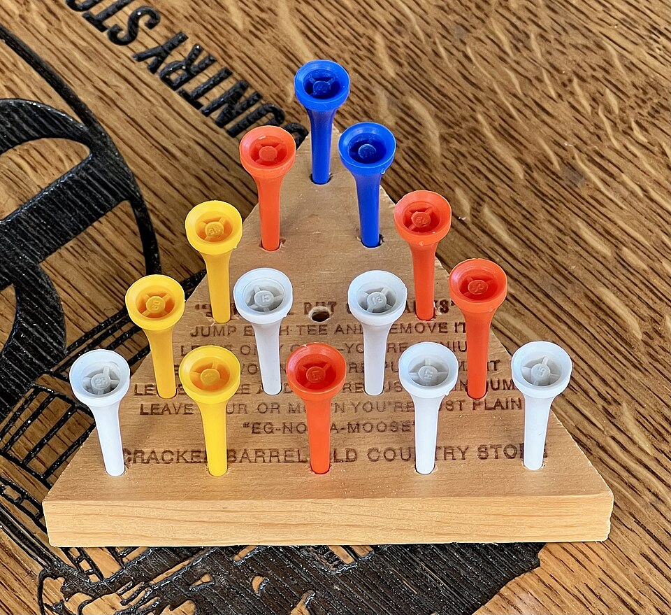

# Capítulo 81 — Proyecto: una colección de problemas

Los capítulos de proyectos anteriores hacen crecer un solo programa. Este
reúne cinco problemas pequeños, tomados de tres libros, cada uno con una
decisión de representación que lo resuelve casi por completo: el
**triángulo de clavijas**, un rompecabezas de saltos sobre un tablero de
quince agujeros; las **moléculas**, grafos con rótulos en los que se
buscan grupos de átomos; una **colección de estampillas** que se ve, se
vende y se compra por patrón; las **reglas de tránsito** de un semáforo,
cuyo orden decide la prioridad; los **marcos**, que agrupan lo que se sabe
de un objeto y lo heredan de los más generales; y dos **canciones** con
estructura, una que se acumula y otra que cuenta.

Varios de ellos tienen el mismo tropiezo: una misma cosa aparece muchas
veces. Una posición del triángulo y su imagen en un espejo son la misma
posición para el juego; un anillo de seis carbonos se puede escribir de
doce maneras, y un grupo metilo, con sus tres hidrógenos en seis órdenes.
Una búsqueda que no lo sabe repite el trabajo, y una consulta que no lo
sabe repite las respuestas. El capítulo elige en cada caso un
representante de la clase, como el
[capítulo 75](../capitulo-75-proyecto-rompecabezas-simetrias/index.md)
eligió la forma canónica de un tablero.

```text
    o              o              o
   o o            · o            · o
  o o o   -->    · o o   -->    o · ·
 · o o o        o o o o        o o o o
o o o o o      o o o o o      o o o o o
```

El triángulo, con el agujero 7 vacío, después de los saltos `s(2, 4, 7)`
y `s(6, 5, 4)` —de la casilla 2 sobre la 4 a la 7, de la 6 sobre la 5 a
la 4—: cada salto quita una clavija, y se gana cuando queda una sola.

El triángulo y las moléculas vienen del capítulo «Artificial Intelligence
Techniques» de *Prolog Programming in Depth*, de Michael Covington,
Donald Nute y André Vellino; la colección de estampillas y las rimas, de
*Prolog Techniques*, de Attila Csenki; las reglas de tránsito y los
marcos, de *Artificial Intelligence through Prolog*, de Neil Rowe. Todos
los programas se reescribieron para el curso y se ejecutaron los de los
libros para comparar: tres de ellos no responden lo que dice su texto. La
lista completa de las fuentes está en las [Referencias](#referencias).

El capítulo cumple dos anuncios: el del
[capítulo 75](../capitulo-75-proyecto-rompecabezas-simetrias/index.md)
(las simetrías del tablero en el registro de visitados de una búsqueda,
en el rompecabezas del triángulo de clavijas) y el del
[capítulo 76](../capitulo-76-proyecto-robots-laberintos-caballo/index.md)
(problemas pequeños resueltos como búsqueda en un espacio de estados).
Carga sin copiarlas las búsquedas del
[capítulo 40](../capitulo-40-busqueda-y-planificacion/index.md), a través
del puente del
[capítulo 76](../capitulo-76-proyecto-robots-laberintos-caballo/index.md),
y usa la expansión al cargar del
[capítulo 35](../capitulo-35-transformacion-de-programas-y-compilacion/index.md),
la base de datos dinámica del
[capítulo 20](../capitulo-20-base-de-datos-dinamica/index.md) y las
restricciones del
[capítulo 23](../capitulo-23-programacion-con-restricciones/index.md).

## Objetivos del capítulo

Al terminar el capítulo, el lector puede:

- representar un tablero como un término con un argumento por casilla y
  sus movimientos como pares de términos que comparten variables,
  generados al cargar a partir de la geometría;
- describir un problema para las búsquedas del
  [capítulo 40](../capitulo-40-busqueda-y-planificacion/index.md) y medir
  lo que ahorra el registro de visitados aun cuando no hay ciclos;
- guardar en el registro de visitados una forma por clase de simetría, y
  reconstruir después el camino en el tablero real;
- buscar estructuras en un grafo con rótulos dando una sola respuesta por
  estructura, y deducir información que el grafo no guarda con
  restricciones;
- separar en un programa con base de datos dinámica el núcleo, que
  relaciona un estado con el siguiente, de la capa que lo lee y lo
  guarda;
- escribir reglas con prioridad y reglas por omisión, y examinarlas sobre
  todas las situaciones posibles;
- organizar hechos en marcos con herencia sin cortes rojos ni reglas que
  se llamen mutuamente sin terminar.

!!! info "Tiempo estimado"
    Leer el capítulo, ejecutar sus ejemplos y hacer las actividades: **1:30 h**.
    Resolver los 5 ejercicios marcados con ★: **1:20 h**.
    Resolver los 12 ejercicios del final: **3:30 h**.

## 81.1 La colección

| Problema | Fuente | Archivo | Lo que muestra |
|---|---|---|---|
| El triángulo de clavijas | Covington, apartado 8.4 | `triangulo.pl` | movimientos como unificación; búsqueda con registro de visitados; simetrías |
| Moléculas | Covington, apartado 8.6 | `moleculas.pl` | estructuras en un grafo; una respuesta por estructura; valencias como restricciones |
| Estampillas | Csenki, apartado 3.1.6 | `estampillas.pl` | patrones; base de datos dinámica; el núcleo como relación entre estados |
| Reglas de tránsito | Rowe, apartado 4.11 | `transito.pl` | el orden de las reglas como prioridad; reglas por omisión |
| Marcos | Rowe, «Abstraction of facts» | `marcos.pl` | herencia de valores, de ranuras y de unidades |
| Rimas | Csenki, «Exploratory Code Development» | `rimas.pl` | una estructura recursiva vista desde su último caso |

El triángulo ocupa las secciones
[81.2](#812-el-triangulo-version-1-el-tablero-y-los-saltos) a
[81.4](#814-version-3-las-simetrias-en-el-registro-de-visitados), en tres
versiones, y las estampillas la
[81.6](#816-una-coleccion-de-estampillas), en dos. Las moléculas, las
reglas de tránsito, los marcos y las rimas están en páginas aparte,
enlazadas desde las secciones [81.5](#815-moleculas),
[81.7](#817-reglas-de-transito), [81.8](#818-marcos) y
[81.9](#819-rimas). `triangulo.pl` es un módulo que carga el puente del
[capítulo 76](../capitulo-76-proyecto-robots-laberintos-caballo/index.md),
así que es `% solo-local`; los demás archivos corren en SWISH.

## 81.2 El triángulo, versión 1: el tablero y los saltos



El rompecabezas del triángulo de clavijas en la mesa de un restaurante:
catorce clavijas y un agujero vacío, el del medio de la tercera fila, que
en la numeración del capítulo es el 5. Imagen: TaurusEmerald,
[CC BY-SA 4.0](https://creativecommons.org/licenses/by-sa/4.0), vía
[Wikimedia Commons](https://commons.wikimedia.org/wiki/File:Cracker_Barrel_Peg_Solitaire.jpg).

El tablero tiene quince agujeros en cinco filas. Al empezar, todos tienen
clavija salvo uno. Un **salto** lleva una clavija por encima de una
vecina, en línea recta, hasta un agujero vacío, y quita la clavija
saltada; se gana cuando queda una sola. Como cada salto quita una
clavija, toda solución tiene trece saltos. Los agujeros se numeran por
filas:

```text
        1
      2   3
    4   5   6
  7   8   9  10
11  12  13  14  15
```

El agujero `N` es el `C`-ésimo de la fila `F`, y tres agujeros están en
línea si se pasa de uno al siguiente con el mismo paso: a lo largo de la
fila, o hacia abajo por uno de los dos lados del triángulo.

<!-- ejemplo: capitulo-81/triangulo.pl predicado: casilla/3 direccion/2 linea/3 -->
```prolog
%!  casilla(?N:integer, ?F:integer, ?C:integer) is nondet.
%
%   El agujero N, de 1 a 15, es el C-ésimo de la fila F, de 1 a 5,
%   contando desde la izquierda.
casilla(N, F, C) :-
    between(1, 5, F),
    between(1, F, C),
    N is F * (F - 1) // 2 + C.

% direccion(DF, DC): un paso en línea recta suma DF a la fila y DC a la
% posición en la fila: a lo largo de la fila, o hacia abajo por uno de
% los dos lados.
direccion(0, 1).
direccion(1, 0).
direccion(1, 1).

%!  linea(?A:integer, ?B:integer, ?C:integer) is nondet.
%
%   A, B y C son tres agujeros seguidos en línea recta, en ese orden, de
%   arriba hacia abajo o de izquierda a derecha.
linea(A, B, C) :-
    casilla(A, F, K),
    direccion(DF, DK),
    F1 is F + DF,
    K1 is K + DK,
    F2 is F1 + DF,
    K2 is K1 + DK,
    casilla(B, F1, K1),
    casilla(C, F2, K2).
```

```prolog
?- casilla(8, F, C).
F = 4,
C = 2 ;
false.

?- findall(A-B-C, linea(A, B, C), Ls), length(Ls, N).
Ls = [1-2-4, 1-3-6, 2-4-7, 2-5-9, 3-5-8, 3-6-10, 4-5-6, 4-7-11, 4-8-13, 5-8-12, 5-9-14, 6-9-13, 6-10-15, 7-8-9, 8-9-10, 11-12-13, 12-13-14, 13-14-15],
N = 18.
```

Las dieciocho líneas dan treinta y seis saltos, uno en cada sentido.

### Los saltos como unificación

Una posición es un término `t/15` con un argumento por agujero: 1 si
tiene clavija y 0 si está vacío. La representación de los saltos es la
que Covington atribuye a Richard O'Keefe: cada salto es un hecho
`salto(S, Antes, Despues)` cuyos dos términos tienen fijos los tres
agujeros que el salto toca y **comparten las variables** de los otros
doce. Saltar es una unificación: `Antes` unifica con la posición actual
solo si el salto es posible, y `Despues` queda ligado a la posición que
resulta, con los doce agujeros copiados por las variables compartidas.

```prolog
?- salto(s(4, 2, 1), A, D).
A = t(0, 1, _A, 1, _B, _C, _D, _E, _F, _G, _H, _I, _J, _K, _L),
D = t(1, 0, _A, 0, _B, _C, _D, _E, _F, _G, _H, _I, _J, _K, _L).
```

En el libro, las treinta y seis cláusulas están escritas a mano. Aquí se
calculan al cargar el archivo, como el
[capítulo 74](../capitulo-74-proyecto-cubo-rubik/index.md) calcula los
giros del cubo ([Patrón 49](../patrones.md#49-expandir-al-cargar)):
`term_expansion/2` reemplaza el término `generar_triangulo` por los
hechos, construidos con la geometría. Así los hechos son exactamente los
de las líneas, sin errores de copia, y las simetrías de la versión 3 se
generan del mismo modo.

<!-- ejemplo: capitulo-81/triangulo.pl fragmento: term_expansion(generar_triangulo, Hechos) :- .. generar_triangulo. -->
```prolog
term_expansion(generar_triangulo, Hechos) :-
    findall(salto(s(De, Sobre, Hasta), Antes, Despues),
            ( ( linea(De, Sobre, Hasta)
              ; linea(Hasta, Sobre, De)
              ),
              salto_calculado(De, Sobre, Hasta, Antes, Despues) ),
            Saltos),
    findall(simetria(S, Antes, Despues),
            ( permutacion(S, _, _),
              simetria_calculada(S, Antes, Despues) ),
            Simetrias),
    append(Saltos, Simetrias, Hechos).

%!  salto_calculado(+De:integer, +Sobre:integer, +Hasta:integer, -Antes,
%!                  -Despues) is det.
%
%   Antes y Despues son dos términos t/15 que comparten las variables de
%   los agujeros que no son De, Sobre ni Hasta: Antes tiene clavijas en De
%   y en Sobre y Hasta vacío; Despues, al revés.
salto_calculado(De, Sobre, Hasta, Antes, Despues) :-
    numlist(1, 15, Ns),
    maplist(agujero(De, Sobre, Hasta), Ns, As, Ds),
    Antes =.. [t|As],
    Despues =.. [t|Ds].

%!  agujero(+De:integer, +Sobre:integer, +Hasta:integer, +N:integer, -A,
%!          -D) is det.
%
%   A y D son el contenido del agujero N antes y después del salto: fijos
%   en los tres agujeros del salto, la misma variable en los demás.
agujero(De, Sobre, Hasta, N, A, D) :-
    (   ( N =:= De ; N =:= Sobre )
    ->  A = 1,
        D = 0
    ;   N =:= Hasta
    ->  A = 0,
        D = 1
    ;   A = D
    ).

%!  simetria_calculada(+S, -Antes, -Despues) is det.
%
%   Antes y Despues son dos términos t/15 con las mismas variables: lo que
%   Antes tiene en el agujero N, Despues lo tiene en la imagen de N por S.
simetria_calculada(S, Antes, Despues) :-
    findall(N1, ( between(1, 15, N), imagen(S, N, N1) ), Destinos),
    length(Vs, 15),
    Antes =.. [t|Vs],
    pairs_keys_values(Pares, Destinos, Vs),
    keysort(Pares, Ordenados),
    pairs_values(Ordenados, Ws),
    Despues =.. [t|Ws].

generar_triangulo.
```

`agujero/6` decide qué pasa con cada agujero: en los tres del salto,
valores fijos; en los demás, `A = D` une las dos variables nuevas en una
sola, que aparece en los dos términos. Es el
[Patrón 74](../patrones.md#74-transformacion-como-par-de-terminos): una
transformación como un par de términos que comparten variables.

### La posición de partida y la búsqueda

<!-- ejemplo: capitulo-81/triangulo.pl predicado: inicio/2 lleno_salvo/3 clavijas/2 resolver/2 -->
```prolog
%!  inicio(+Vacio:integer, -T) is det.
%
%   T es la posición de partida con el agujero Vacio sin clavija.
inicio(Vacio, T) :-
    numlist(1, 15, Ns),
    maplist(lleno_salvo(Vacio), Ns, As),
    T =.. [t|As].

%!  lleno_salvo(+Vacio:integer, +N:integer, -A:integer) is det.
%
%   A es 0 si N es el agujero Vacio, y 1 si no.
lleno_salvo(Vacio, N, A) :-
    (   N =:= Vacio
    ->  A = 0
    ;   A = 1
    ).

%!  clavijas(+T, -K:integer) is det.
%
%   K es la cantidad de clavijas de la posición T.
clavijas(T, K) :-
    T =.. [t|As],
    sum_list(As, K).

%!  resolver(+T, -Saltos:list) is nondet.
%
%   Saltos lleva de la posición T a una posición con una sola clavija.
resolver(T, []) :-
    clavijas(T, 1).
resolver(T0, [S|Ss]) :-
    salto(S, T0, T),
    resolver(T, Ss).
```

`resolver/2` es la búsqueda de Covington: la vuelta atrás de Prolog
prueba los saltos en el orden de los hechos, y una posición con una sola
clavija termina la lista. Desde el agujero 1 vacío hay dos saltos
posibles, imágenes uno del otro por el espejo que pasa por el vértice:

```prolog
?- inicio(1, T), findall(S, salto(S, T, _), Ss).
T = t(0, 1, 1, 1, 1, 1, 1, 1, 1, 1, 1, 1, 1, 1, 1),
Ss = [s(4, 2, 1), s(6, 3, 1)].

?- inicio(1, T), once(resolver(T, Saltos)).
T = t(0, 1, 1, 1, 1, 1, 1, 1, 1, 1, 1, 1, 1, 1, 1),
Saltos = [s(4, 2, 1), s(9, 5, 2), s(11, 7, 4), s(2, 4, 7), s(12, 8, 5), s(3, 5, 8), s(7, 8, 9), s(10, 6, 3), s(1, 3, 6), s(14, 13, 12), s(6, 9, 13), s(12, 13, 14), s(15, 14, 13)].
```

`jugar/3` repite una lista de saltos y devuelve las posiciones por las
que pasa, y `dibujar/1` escribe una posición. El dibujo se calcula en
`filas/2`, que devuelve las cinco líneas de texto, y `dibujar/1` solo las
escribe ([Patrón 51](../patrones.md#51-modelo-de-pantalla)):

<!-- ejemplo: capitulo-81/triangulo.pl predicado: jugar/3 filas/2 fila/2 simbolo/2 dibujar/1 -->
```prolog
%!  jugar(+Saltos:list, +T0, -Ts:list) is semidet.
%
%   Ts son las posiciones por las que pasa la partida que empieza en T0 y
%   hace Saltos, empezando por T0. La lista va primero para que la
%   indexación distinga las dos cláusulas. Falla si algún salto no es legal.
%   Desde una posición, cada salto lleva a una sola posición: once/1 no
%   pierde respuestas.
jugar([], T, [T]).
jugar([S|Ss], T0, [T0|Ts]) :-
    once(salto(S, T0, T)),
    jugar(Ss, T, Ts).

%!  filas(+T, -Filas:list) is det.
%
%   Filas son las cinco líneas de texto que dibujan la posición T: o es
%   una clavija y · un agujero vacío.
filas(T, Filas) :-
    findall(Fila, fila(T, Fila), Filas).

%!  fila(+T, -Fila:string) is nondet.
%
%   Fila es el dibujo de una de las filas de T, de arriba hacia abajo.
fila(T, Fila) :-
    between(1, 5, F),
    findall(Simbolo,
            ( casilla(N, F, _),
              arg(N, T, A),
              simbolo(A, Simbolo) ),
            Simbolos),
    atomic_list_concat(Simbolos, ' ', Agujeros),
    Margen is 5 - F,
    format(string(Fila), "~*c~w", [Margen, 0'\s, Agujeros]).

% simbolo(A, S): el agujero con contenido A se dibuja con S.
simbolo(0, '·').
simbolo(1, o).

%!  dibujar(+T) is det.
%
%   Escribe el dibujo de la posición T.
dibujar(T) :-
    filas(T, Filas),
    forall(member(Fila, Filas), format("~w~n", [Fila])).
```

```prolog
?- inicio(1, T), dibujar(T).
    ·
   o o
  o o o
 o o o o
o o o o o
T = t(0, 1, 1, 1, 1, 1, 1, 1, 1, 1, 1, 1, 1, 1, 1).
```

!!! question "Actividad"
    Predecir cuántos saltos hay desde la posición con el agujero 4 vacío y
    cuáles son, mirando el dibujo de los agujeros. Comprobarlo con
    `inicio(4, T), findall(S, salto(S, T, _), Ss)`.

La búsqueda de Prolog encuentra una solución en 0,1 segundos. Contar
todas cuesta más: `aggregate_all(count, resolver(T, _), N)` da 29 760
soluciones desde el agujero 1 vacío en 13 segundos, 14 880 desde el 2,
85 258 desde el 4 y 1 550 desde el 5. Los quince agujeros de partida se
reducen a esos cuatro casos: los demás son sus imágenes por las simetrías
del triángulo, que la versión 3 calcula.

## 81.3 Versión 2: el triángulo como búsqueda del capítulo 40

Covington observa que su búsqueda no necesita controlar posiciones
repetidas, porque cada salto quita una clavija y ninguna posición se
puede volver a alcanzar después: no hay ciclos. Es cierto, pero hay
**transposiciones**: dos saltos que no se tocan se pueden hacer en
cualquier orden, y los dos órdenes llegan a la misma posición. Una
búsqueda sin memoria explora de nuevo, cada vez, todo lo que hay debajo
de esa posición.

Para medirlo, el triángulo se describe como un problema para
`buscar/5` del [capítulo 40](../capitulo-40-busqueda-y-planificacion/index.md),
que recuerda las posiciones vistas
([sección 40.3](../capitulo-40-busqueda-y-planificacion/index.md#403-ciclos-y-visitados)),
y para el bucle de la
[sección 40.2](../capitulo-40-busqueda-y-planificacion/index.md#402-una-sola-busqueda-varias-estrategias),
que no recuerda nada. `triangulo.pl` carga el puente del
[capítulo 76](../capitulo-76-proyecto-robots-laberintos-caballo/index.md#761-las-busquedas-del-capitulo-40-para-otros-modulos)
y define en su propio módulo los tres predicados de la interfaz
([Patrón 77](../patrones.md#77-problema-de-otro-modulo)); el problema se
escribe `triangulo:todas(Vacio)`:

<!-- ejemplo: capitulo-81/triangulo.pl fragmento: inicial(todas(Vacio), T) :- .. buscar(Estrategia, triangulo:todas(Vacio), Saltos, _, Expandidos). -->
```prolog
inicial(todas(Vacio), T) :-
    inicio(Vacio, T).
inicial(formas(Vacio), F) :-
    inicio(Vacio, T),
    forma(T, F).

%!  meta(+Problema, +T) is semidet.
%
%   T tiene una sola clavija.
meta(_, T) :-
    clavijas(T, 1).

%!  sucesor(+Problema, +T0, -Accion, -T, -Costo:integer) is nondet.
%
%   Con todas(_), Accion es un salto que lleva de T0 a T. Con formas(_),
%   T es la forma de la posición que deja un salto desde la forma T0, y
%   Accion es T: la acción nombra la clase de la posición siguiente.
sucesor(todas(_), T0, S, T, 1) :-
    salto(S, T0, T).
sucesor(formas(_), F0, F, F, 1) :-
    salto(_, F0, T),
    forma(T, F).

%!  jugar_todas(+Estrategia, +Vacio:integer, -Saltos:list,
%!              -Expandidos:integer) is semidet.
%
%   Saltos resuelve el triángulo que empieza con el agujero Vacio, buscado
%   con buscar/5 y Estrategia sobre las posiciones; Expandidos es la
%   cantidad de posiciones que la búsqueda expandió.
jugar_todas(Estrategia, Vacio, Saltos, Expandidos) :-
    buscar(Estrategia, triangulo:todas(Vacio), Saltos, _, Expandidos).
```

`inicial/2`, `meta/2` y `sucesor/5` tienen también cláusulas para el
problema `formas(Vacio)`, que es la versión 3. Con la búsqueda en
profundidad, `buscar/5` encuentra la misma solución que `resolver/2`,
porque prueba los saltos en el mismo orden:

```prolog
?- jugar_todas(profundidad, 1, Saltos, K).
Saltos = [s(4, 2, 1), s(9, 5, 2), s(11, 7, 4), s(2, 4, 7), s(12, 8, 5), s(3, 5, 8), s(7, 8, 9), s(10, 6, 3), s(1, 3, 6), s(14, 13, 12), s(6, 9, 13), s(12, 13, 14), s(15, 14, 13)],
K = 487.

?- buscar_sin_visitados(profundidad, triangulo:todas(1), Saltos, C, K).
Saltos = [s(4, 2, 1), s(9, 5, 2), s(11, 7, 4), s(2, 4, 7), s(12, 8, 5), s(3, 5, 8), s(7, 8, 9), s(10, 6, 3), s(1, 3, 6), s(14, 13, 12), s(6, 9, 13), s(12, 13, 14), s(15, 14, 13)],
C = 13,
K = 11311.
```

Hasta la primera solución, la búsqueda sin registro expande 11 311
posiciones y la que recuerda, 487. En anchura la diferencia es mayor,
porque una búsqueda en anchura recorre todas las posiciones de menos de
trece saltos antes de llegar a una de una clavija:

| Vacío al empezar | Profundidad, sin registro | Profundidad, con registro | Anchura, sin registro | Anchura, con registro |
|---|---|---|---|---|
| 1 | 11 311 | 487 | 1 263 419 | 3 012 |
| 2 | 7 374 | 476 | 656 205 | 2 373 |
| 4 | 281 | 110 | 2 506 875 | 4 232 |
| 5 | 19 388 | 570 | 322 323 | 1 650 |

La columna de la anchura con registro es casi la cantidad de posiciones
distintas que se pueden alcanzar: desde el agujero 1, unas tres mil. La
búsqueda sin registro las visita, en total, más de un millón de veces,
una por cada orden de los saltos que lleva a cada una. La ausencia de
ciclos asegura que la búsqueda termina, pero no que no repita trabajo.

## 81.4 Versión 3: las simetrías en el registro de visitados

Girar el triángulo un tercio de vuelta, o reflejarlo sobre una de sus
tres alturas, no cambia las reglas: una línea sigue siendo una línea, y
la imagen de una posición resoluble es resoluble. Hay seis simetrías: la
identidad, los giros de un tercio y de dos tercios de vuelta, y los tres
espejos. Dos posiciones que son imágenes una de otra son, para el juego,
la misma, y el registro de visitados puede guardar una sola de ellas.

Las simetrías se describen con tres **coordenadas** por agujero: su
distancia, en pasos, al lado izquierdo, al lado derecho y a la base. Las
tres suman 4, y cada simetría del triángulo **permuta** las tres
coordenadas: el giro las rota y cada espejo intercambia dos. Las
permutaciones son a su vez pares de términos que comparten variables:

<!-- ejemplo: capitulo-81/triangulo.pl predicado: coordenadas/2 permutacion/3 imagen/3 -->
```prolog
%!  coordenadas(?N:integer, ?Coordenadas:list) is nondet.
%
%   Coordenadas es [X, Y, Z]: la distancia del agujero N al lado
%   izquierdo, al lado derecho y a la base, en pasos. Las tres suman 4.
coordenadas(N, [X, Y, Z]) :-
    casilla(N, F, C),
    X is C - 1,
    Y is F - C,
    Z is 5 - F.

% permutacion(S, Antes, Despues): la simetría S del triángulo permuta las
% tres coordenadas de cada agujero así. giro es un tercio de vuelta en el
% sentido de las agujas del reloj; espejo1, espejo11 y espejo15 reflejan
% el triángulo sobre la altura que pasa por ese vértice.
permutacion(identidad, [X, Y, Z], [X, Y, Z]).
permutacion(giro, [X, Y, Z], [Z, X, Y]).
permutacion(giro2, [X, Y, Z], [Y, Z, X]).
permutacion(espejo1, [X, Y, Z], [Y, X, Z]).
permutacion(espejo11, [X, Y, Z], [Z, Y, X]).
permutacion(espejo15, [X, Y, Z], [X, Z, Y]).

%!  imagen(?S, ?N:integer, ?N1:integer) is nondet.
%
%   La simetría S lleva el agujero N al agujero N1.
imagen(S, N, N1) :-
    permutacion(S, P, P1),
    coordenadas(N, P),
    coordenadas(N1, P1).
```

```prolog
?- imagen(giro, 1, N).
N = 15 ;
false.

?- findall(S, imagen(S, 1, 1), Ss).
Ss = [identidad, espejo1].
```

`giro` lleva el vértice de arriba al de abajo a la derecha: es un tercio
de vuelta en el sentido de las agujas del reloj. El vértice 1 queda fijo
solo con la identidad y con el espejo que pasa por él. Las seis
simetrías se generan al cargar junto con los saltos, con
`simetria_calculada/3` (en el bloque de `term_expansion/2` de la
[sección 81.2](#812-el-triangulo-version-1-el-tablero-y-los-saltos)),
como hechos `simetria(S, Antes, Despues)`: lo que `Antes` tiene en el
agujero `N`, `Despues` lo tiene en la imagen de `N`.

```prolog
?- simetria(giro, A, D).
A = t(_A, _B, _C, _D, _E, _F, _G, _H, _I, _J, _K, _L, _M, _N, _O),
D = t(_K, _L, _G, _M, _H, _D, _N, _I, _E, _B, _O, _J, _F, _C, _A).
```

La **forma** de una posición es la menor de sus seis imágenes en el
orden estándar, como en el
[Patrón 76](../patrones.md#76-forma-canonica-de-la-clase) del
[capítulo 75](../capitulo-75-proyecto-rompecabezas-simetrias/index.md#756-version-5-las-simetrias-del-tablero).
Las quince posiciones de partida tienen cuatro formas, las de los
agujeros 1, 2, 4 y 5: un vértice, un agujero junto a un vértice, el
medio de un lado y uno de los tres de adentro. Como el orden estándar
compara los argumentos de izquierda a derecha, la forma deja el agujero
vacío lo más adelante posible:

```prolog
?- inicio(6, T), forma(T, F), dibujar(F).
    o
   o o
  · o o
 o o o o
o o o o o
T = t(1, 1, 1, 1, 1, 0, 1, 1, 1, 1, 1, 1, 1, 1, 1),
F = t(1, 1, 1, 0, 1, 1, 1, 1, 1, 1, 1, 1, 1, 1, 1).
```

El problema `formas(Vacio)` recorre formas en lugar de posiciones: su
estado inicial es la forma de la posición de partida, y cada sucesor es
la forma de la posición que deja un salto. Como `buscar/5` guarda en el
registro los estados, el registro guarda una forma por clase, sin
cambiar nada del [capítulo 40](../capitulo-40-busqueda-y-planificacion/index.md). Un salto en una forma no es un salto en
el tablero real, así que la acción del problema es la forma siguiente, y
`en_el_tablero/3` reconstruye después los saltos reales: en cada paso,
el primer salto desde la posición real que deja una posición de esa
forma.

<!-- ejemplo: capitulo-81/triangulo.pl predicado: forma/2 jugar_formas/4 en_el_tablero/3 -->
```prolog
%!  forma(+T, -F) is det.
%
%   F es la forma de la posición T: la menor, en el orden estándar, de sus
%   seis imágenes por las simetrías del triángulo.
forma(T, F) :-
    findall(I, simetria(_, T, I), Imagenes),
    min_member(F, Imagenes).

%!  jugar_formas(+Estrategia, +Vacio:integer, -Saltos:list,
%!               -Expandidos:integer) is semidet.
%
%   Como jugar_todas/4, pero la búsqueda recorre formas: Expandidos cuenta
%   clases de posiciones. Saltos son los saltos en el tablero real.
jugar_formas(Estrategia, Vacio, Saltos, Expandidos) :-
    buscar(Estrategia, triangulo:formas(Vacio), Formas, _, Expandidos),
    inicio(Vacio, T),
    en_el_tablero(Formas, T, Saltos).

%!  en_el_tablero(+Formas:list, +T0, -Saltos:list) is semidet.
%
%   Saltos lleva de T0 por posiciones cuyas formas son, en orden, las de
%   Formas: en cada paso, el primer salto que deja una posición de la
%   forma pedida.
en_el_tablero([], _, []).
en_el_tablero([F|Fs], T0, [S|Ss]) :-
    once(( salto(S, T0, T),
           forma(T, F) )),
    en_el_tablero(Fs, T, Ss).
```

```prolog
?- jugar_formas(profundidad, 1, Saltos, K).
Saltos = [s(4, 2, 1), s(9, 5, 2), s(11, 7, 4), s(12, 8, 5), s(14, 13, 12), s(2, 4, 7), s(3, 5, 8), s(7, 8, 9), s(10, 6, 3), s(1, 3, 6), s(6, 9, 13), s(12, 13, 14), s(15, 14, 13)],
K = 390.
```

La solución es otra, porque en cada paso las formas se exploran en otro
orden, y es una solución del tablero real: las pruebas la repiten con
`jugar/3` y comprueban que queda una clavija.

| Vacío al empezar | Profundidad, posiciones | Profundidad, formas | Anchura, posiciones | Anchura, formas |
|---|---|---|---|---|
| 1 | 487 | 390 | 3 012 | 1 541 |
| 2 | 476 | 390 | 2 373 | 1 553 |
| 4 | 110 | 57 | 4 232 | 2 165 |
| 5 | 570 | 84 | 1 650 | 848 |

Con seis simetrías podría esperarse un registro seis veces menor, pero
el recorrido completo, en anchura, se reduce a la mitad. La razón está
en la posición de partida: con el agujero 1 vacío, solo la identidad y
el espejo que pasa por el vértice 1 la dejan igual. Las imágenes de una
posición alcanzable por los giros son posiciones que se alcanzan desde
los otros vértices vacíos, que esta búsqueda no visita; lo que el
registro junta son los pares de posiciones simétricas por ese espejo. La
ganancia de una simetría depende de cuántas imágenes de cada estado están
en el espacio que se recorre. El
[ejercicio 4](#ejercicios) la aprovecha por completo: cuenta las
soluciones de los quince comienzos a la vez, con una tabla por forma.

!!! example "Patrón 85 — Estado canónico en el sucesor"
    **Problema.** Un espacio de estados tiene simetrías, y una búsqueda
    con registro de visitados expande por separado estados que son
    imágenes uno de otro, como las posiciones del triángulo que un
    espejo intercambia: el registro compara términos y no reconoce dos
    posiciones simétricas como el mismo estado.

    **Versión ingenua.** No tratar las simetrías, como el problema
    `todas(Vacio)`, que en anchura con el agujero 1 vacío expande 3 012
    posiciones; o cambiar la búsqueda, para que compare cada estado
    nuevo con las imágenes de los visitados, y escribir así una
    búsqueda propia para cada problema con simetrías.

    **Patrón.** Dejar la búsqueda sin cambios y llevar la simetría al
    problema: `inicial/2` y `sucesor/5` de `formas(Vacio)` devuelven la
    forma canónica del estado, calculada por `forma/2`, y el registro
    de visitados de `buscar/5` junta las posiciones simétricas sin
    saber que existen: 1 541 formas en lugar de 3 012 posiciones. Un
    paso entre formas no es un movimiento del tablero real, así que la
    acción nombra la forma siguiente, y `en_el_tablero/3` reconstruye
    después los saltos reales, uno por paso, desde la posición de
    partida. Es la forma canónica del
    [Patrón 76](../patrones.md#76-forma-canonica-de-la-clase) puesta en
    los estados del
    [Patrón 25](../patrones.md#25-busqueda-en-un-espacio-de-estados-con-visitados).

    **Cuándo no usarlo.** Cuando el costo de un paso, la meta o la
    heurística dependen de la posición real y no solo de su clase: la
    búsqueda sobre formas ya no los ve. Cuando pocas imágenes de cada
    estado están en el espacio que se recorre: `forma/2` calcula seis
    imágenes por sucesor, y con el agujero 1 vacío el recorrido en
    anchura se reduce a la mitad, no a un sexto. Y cuando no hay un modo barato de volver de
    las clases a los movimientos: sin `en_el_tablero/3`, la solución
    es una secuencia de formas que no se puede jugar.

!!! question "Actividad"
    Con el agujero 5 vacío, la búsqueda en profundidad pasa de 570
    posiciones a 84 formas, una reducción mucho mayor que en los otros
    casos. Encontrar cuáles de las seis simetrías dejan igual la posición
    de partida con el agujero 5 vacío, y relacionarlo con la medición.

## 81.5 Moléculas

La página [Moléculas](moleculas.md) escribe la búsqueda de grupos de
átomos de Covington sobre una molécula representada como grafo: el
metilo, el hidroxilo, el grupo nitro y los anillos de carbonos. Las
consultas del libro dan el metilo del 3-clorotolueno seis veces y su
anillo doce; con los átomos intercambiables en orden y una escritura
canónica de los ciclos, dan una respuesta por estructura. La versión 3
deduce qué enlaces son dobles a partir de la valencia de cada elemento,
con las restricciones del
[capítulo 23](../capitulo-23-programacion-con-restricciones/index.md):
encuentra las dos estructuras de Kekulé del anillo y ninguna para el
TNT, cuyo grupo nitro necesita cargas que el modelo no tiene.

## 81.6 Una colección de estampillas

La página [Una colección de estampillas](estampillas.md) escribe el
álbum de Csenki: un sello es `sello(Pais, Serie, Anio, Valor)`, cada
hecho `album/1` guarda una serie en orden de valor, y un **patrón**, un
sello con variables, elige los sellos con los que unifica sin quedar
ligado. La versión 1 vende y compra cambiando la base de datos en medio
del cálculo; el `sell/1` del libro, ejecutado, solo vende cuando el
primer sello de la serie cumple el patrón. La versión 2 escribe vender y
comprar como relaciones puras entre un álbum, una lista de series, y el
siguiente, y deja la base de datos en una capa de un solo predicado,
`operar/1`. Es el
[Patrón 86](../patrones.md#86-el-estado-como-valor-la-base-de-datos-como-capa),
el estado como valor y la base de datos como capa: las relaciones se
prueban con álbumes escritos en la prueba, sin guardar ni restaurar la
base de datos.

## 81.7 Reglas de tránsito

La página [Reglas de tránsito y marcos](transito-y-marcos.md) escribe
las reglas de Rowe para los semáforos de California: qué puede hacer un
auto o un peatón ante las luces que ve, con el orden de las reglas como
prioridad y dos reglas por omisión. Ejecutadas, las reglas del libro dan
para el ejemplo del peatón una respuesta distinta de la que el texto
anuncia, y aplican la regla por omisión aunque haya un consejo
específico; la versión 2 la limita a cuando no lo hay, y la tabla de
todas las luces solas comprueba el resultado.

## 81.8 Marcos

La misma [página](transito-y-marcos.md#marcos) escribe los marcos de
Rowe: ranuras llenas y vacías, herencia de valores por `es_un` y
`parte_de`, herencia de ranuras y de unidades, intensión y extensión, y
la edad calculada a partir del año de fabricación. Las reglas del libro
tienen un corte que pierde valores y dos reglas que se llaman una a la
otra sin terminar; las del capítulo no.

## 81.9 Rimas

La página [Rimas](rimas.md) sigue el desarrollo exploratorio de Csenki
con dos canciones: «La casa que construyó Juan», cuyas estrofas son los
sufijos de la última, y «Un elefante se balanceaba», que cuenta sin fin,
con los números en letras y la concordancia del verbo.

!!! success "Criterios de calidad"
    | Criterio | En este capítulo |
    |---|---|
    | C1 | cada predicado declara modos y determinación; `accion_v1/3` y `tiene_valor/3` aclaran qué argumento debe llegar instanciado o libre, porque se usa dentro de `\+` o después de un si-entonces-sino |
    | C2 | representaciones limpias: `t/15`, `s(De, Sobre, Hasta)`, `sello/4`, `luz/2` en una lista de observaciones, `valor/3` guardado en un solo sentido |
    | C3 | `triangulo.pl` se resuelve con las búsquedas del [capítulo 40](../capitulo-40-busqueda-y-planificacion/index.md) sin cambiarlas; los saltos y las simetrías se generan de la geometría |
    | C4 | `jugar/3`, `en_el_tablero/3`, `insertar/3` y `con_punto/2` llevan la lista como primer argumento para que la indexación no deje alternativas; `forma/2`, `coleccion/2` y `tiene_unidades/3` son deterministas |
    | C6 | `filas/2` calcula el dibujo y `dibujar/1` lo escribe; `vender/3` y `comprar/3` son puros, y solo `operar/1`, `vender/1` y `comprar/1` tocan la base de datos |
    | C7 | 128 pruebas en seis archivos, y 35 más para las soluciones; las cantidades de posiciones expandidas y de respuestas repetidas están en las pruebas |

## Ejercicios

Las soluciones están en [la página de soluciones](soluciones.md). La dificultad
va de 1 (se resuelve consultando el capítulo) a 3 (requiere elaboración propia).
Los marcados con ★ son los que no conviene saltear: cubren lo que el capítulo
tiene de propio. Los ejercicios que piden código se resuelven en archivos
que cargan los del capítulo, sin modificarlos.

1. ★ **(1)** Predecir cuántos saltos hay desde la posición con el
   agujero 5 vacío y cuáles son, y cuál es la forma de esa posición.
   Comprobarlo con `salto/3` y `forma/2`.
2. ★ **(2)** Covington propone terminar con la última clavija en el
   agujero que estaba vacío al empezar. Escribir `terminar_en(+Vacio,
   -Saltos, -Expandidos)` con `buscar/5`, describiendo un problema nuevo
   en `user`, y decir desde cuáles de los agujeros 1, 2, 4 y 5 es
   posible. ¿Por qué este problema no puede usar el problema `formas/1`
   tal como está?
3. **(2)** Otra variante del libro: dejar ocho clavijas sin ningún salto
   posible. Escribir `bloqueo(+Vacio, +K, -Saltos)` y `mayor_bloqueo(+Vacio,
   -K)`, la mayor cantidad de clavijas que pueden quedar bloqueadas, y
   calcularla para los cuatro comienzos.
4. ★ **(2)** Escribir `cuenta_desde(+Vacio, -N)`, la cantidad de
   soluciones desde un comienzo, con una tabla del
   [capítulo 39](../capitulo-39-tabulacion/index.md) sobre las formas
   de las posiciones. Comparar el tiempo con el de
   `aggregate_all(count, resolver(T, _), N)`, y calcular el total de
   soluciones de los quince comienzos.
5. **(3)** Resolver el triángulo de diez agujeros, en cuatro filas.
   Escribir los saltos con otra representación, conjuntos ordenados de
   los agujeros con clavija, y decidir desde qué agujeros tiene solución.
6. ★ **(2)** Agregar a `molecula/3` el naftaleno, dos anillos de seis
   carbonos que comparten un enlace, con ocho hidrógenos. Predecir, antes
   de ejecutar, cuántas respuestas dan `anillo(naftaleno, 6, A)`,
   `anillo(naftaleno, 10, A)` y `ordenes(naftaleno, O)`, y explicar la del
   anillo de diez.
7. **(2)** Escribir `valor_total(?Patron, -Total)`, la suma de los
   valores de los sellos que unifican con un patrón, y `por_pais(-Pares)`,
   el valor del álbum por país.
8. **(1)** Predecir qué series quedan en el álbum después de
   `vender(sello(_, _, 1885, _))`, y qué haría el `sell/1` del libro con
   el mismo pedido.
9. ★ **(2)** Escribir `conflictos(+Quien, -C)`: las situaciones con dos
   luces para los autos, de tipos distintos, en las que `accion/3`
   permite a la vez detenerse y una acción que avanza. Contarlas, y
   contar en cuántas `decision/3` elige avanzar. ¿Qué dice eso del orden
   de las reglas?
10. **(2)** Rowe anuncia que el peatón que ve la silueta intermitente
    puede cruzar cediendo el paso. Escribir `peaton_v3/2` y `accion_v3/3`,
    sin modificar `transito.pl`, para que el ejemplo dé esa respuesta.
11. **(2)** Rowe llama herencia de partes a que un auto tenga sistema de
    propulsión porque lo tiene todo vehículo. Escribir `partes(+Objeto,
    -Partes)`, con las partes propias y las de las clases más generales.
12. **(2)** Traducir la canción de Csenki «One man went to mow»: escribir
    `estrofa_segar(+N, -Lineas)`, cuyo tercer verso cuenta hacia atrás,
    «Tres hombres, dos hombres, un hombre y su perro», con un esqueleto
    `[N, …, 1]`.

## Resumen

| | |
|---|---|
| **salto como unificación** | un hecho cuyos dos términos fijan los agujeros que el salto toca y comparten las variables de los demás |
| **transposición** | dos órdenes de los mismos movimientos que llegan al mismo estado; sin ciclos, sigue repitiendo trabajo |
| **coordenadas del triángulo** | las distancias a los tres lados; las simetrías las permutan |
| **forma de una posición** | la menor de sus seis imágenes; el registro de visitados guarda una por clase |
| **acción como forma siguiente** | el problema sobre formas devuelve las clases, y los saltos reales se reconstruyen después |
| **patrón** | un término con variables que elige los objetos con los que unifica, sin quedar ligado |
| **núcleo y capa** | la relación entre un estado y el siguiente, y el código que lee y guarda el estado |
| **[Patrón 85](../patrones.md#85-estado-canonico-en-el-sucesor)** | estado canónico en el sucesor |
| **[Patrón 86](../patrones.md#86-el-estado-como-valor-la-base-de-datos-como-capa)** | el estado como valor, la base de datos como capa |
| **[Patrón 87](../patrones.md#87-valor-propio-o-heredado-sin-corte-rojo)** | valor propio o heredado sin corte rojo |
| `casilla/3`, `linea/3`, `salto/3`, `inicio/2`, `clavijas/2`, `resolver/2`, `jugar/3`, `filas/2` | el triángulo, versión 1 |
| `jugar_todas/4` | el triángulo como problema del [capítulo 40](../capitulo-40-busqueda-y-planificacion/index.md) |
| `coordenadas/2`, `permutacion/3`, `imagen/3`, `simetria/3`, `forma/2`, `jugar_formas/4`, `en_el_tablero/3` | las simetrías |
| `coleccion/2`, `coleccion/3`, `quitar_todos/3`, `vender/1`, `insertar/3`, `comprar/1` | las estampillas, versión 1 |
| `album_actual/1`, `vender/3`, `comprar/3`, `operar/1` | las estampillas, versión 2 |

## Temas que se retoman

| Tema | Se retoma en |
|---|---|
| La herencia de los marcos por `es_un` y `parte_de` como reglas recursivas evaluadas de abajo hacia arriba por un motor Datalog | [capítulo 85](../capitulo-85-proyecto-motor-datalog/index.md) |

## Referencias

- Michael A. Covington, Donald Nute y André Vellino, *Prolog Programming
  in Depth*, Prentice Hall, 1997 — capítulo «Artificial Intelligence
  Techniques», apartados «The triangle puzzle» (8.4, con el listado
  TRIANGLE.PL) y «Examining molecules» (8.6, con CHEM.PL).
  [Edición en línea](https://www.covingtoninnovations.com/books/PPID.pdf).
  El capítulo toma el rompecabezas, la representación de las posiciones
  con un argumento por agujero y la de los saltos como hechos que
  comparten variables, que el libro atribuye a Richard O'Keefe en una
  discusión por correo electrónico; la observación de que no hay
  posiciones repetidas por ciclos; las variantes de los
  [ejercicios 2, 3 y 5](#ejercicios); la molécula como grafo con
  rótulos, el 3-clorotolueno con su numeración, las consultas del
  metilo, del anillo de seis, del anillo metilado y del hidroxilo, y el
  difenilo, el grupo nitro, el TNT y la hidroxilamina de sus ejercicios.
- Attila Csenki, *Prolog Techniques*, Ventus Publishing (Bookboon), 2009
  — apartado «Miniproject: Modelling a Stamp Collection» (3.1.6) y
  capítulo «Exploratory Code Development».
  [Página de la editorial, copia de archivo](https://web.archive.org/web/20220123025207/https://bookboon.com/en/prolog-techniques-applications-of-prolog-ebook?mediaType=ebook).
  El capítulo toma el álbum de estampillas, sus datos y sus cinco
  operaciones; la rima acumulativa construida a partir de su última
  estrofa, con un esqueleto de letras como primer experimento; la
  canción que cuenta sin fin, los números en letras, y la canción del
  [ejercicio 12](#ejercicios). Csenki toma la rima de J. Mulherin,
  *Popular Nursery Rhymes* (Grosset & Dunlap, 1983), y el desarrollo
  incremental de I. Sommerville, *Software Engineering*; ninguno de los
  dos tiene edición en línea de acceso libre.
- Neil C. Rowe, *Artificial Intelligence through Prolog*, Prentice-Hall,
  1988 — capítulo «Definitions and inferences», apartados «A longer
  example: some traffic laws» y «Running the traffic lights program»
  ([edición en línea](https://faculty.nps.edu/ncrowe/book/chap4.html)),
  y capítulo «Abstraction of facts»
  ([edición en línea](https://faculty.nps.edu/ncrowe/book/chap12.html));
  el libro completo está en el
  [archivo de la Naval Postgraduate School](https://hdl.handle.net/10945/36984).
  El capítulo toma las reglas de los semáforos, escritas por Rowe a
  partir del *California Driver's Handbook* de 1985, sus dos ejemplos y
  el orden de las reglas como prioridad; el ejemplo de los marcos de los
  autos, la representación con valores, ranuras, unidades y valores
  posibles, la lista de las ranuras que heredan por cada relación, la
  intensión y la extensión, y la edad calculada con el año 1987.
- *SWI-Prolog Reference Manual*, secciones de `term_expansion/2`, de la
  tabulación y de `library(clpfd)`:
  [manual en línea](https://www.swi-prolog.org/pldoc/doc_for?object=manual).

El código del capítulo es propio, escrito para el curso: los saltos y
las simetrías se generan en lugar de escribirse, los programas de los
libros se reescribieron con otra representación (los enlaces de una
molécula guardados una vez, la situación del semáforo como argumento, el
álbum como valor), y se corrigieron las diferencias encontradas al
ejecutarlos; el registro de visitados con formas, las respuestas únicas,
los órdenes de enlace, la versión 2 de las reglas de tránsito y las dos
canciones en castellano no tienen equivalente en las fuentes.
