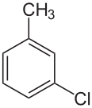

# Moléculas

Esta página contiene la
[sección 81.5](index.md#815-moleculas) del [capítulo 81](index.md): la
búsqueda de grupos de átomos en una molécula, en tres versiones. El
ejemplo está en `moleculas.pl`, en `ejemplos/capitulo-81/`, con sus
pruebas, y corre en SWISH.

## Moléculas, versión 1: estructuras en un grafo

Una fórmula estructural es un grafo: los nodos son los átomos, rotulados
con su elemento, y las aristas son los enlaces. Buscar un grupo de átomos
en una molécula, como un grupo metilo o un anillo de carbonos, es buscar
un subgrafo con una forma dada, y es la misma clase de búsqueda que
encontrar un camino en un laberinto.



El 3-clorotolueno, el ejemplo de Covington: un anillo de seis carbonos con
un metilo (CH₃) en un carbono y un cloro dos lugares más allá. Los vértices
del hexágono son carbonos, y los hidrógenos del anillo no se dibujan.
Imagen: NEUROtiker, dominio público, vía
[Wikimedia Commons](https://commons.wikimedia.org/wiki/File:M-Chlortoluol.svg).

Covington guarda cada átomo con la lista de sus vecinos, de modo que cada
enlace aparece dos veces. Aquí cada molécula es un solo hecho, con los
átomos agrupados por elemento y cada enlace una sola vez; `enlazados/3` lo
recorre en los dos sentidos. Los nombres de los átomos son los del libro:
el anillo es `c1`, `c2`, `c5`, `c7`, `c6`, `c4`, y el metilo es `c3`.

<!-- ejemplo: capitulo-81/moleculas.pl fragmento: molecula(clorotolueno, .. c1-h1, c5-h4, c6-h6, c7-h7, c2-cl1 ]). -->
```prolog
molecula(clorotolueno,
         [ carbono-[c1, c2, c3, c4, c5, c6, c7],
           hidrogeno-[h1, h2, h3, h4, h5, h6, h7],
           cloro-[cl1]
         ],
         [ c1-c2, c2-c5, c5-c7, c7-c6, c6-c4, c4-c1,
           c4-c3, c3-h2, c3-h3, c3-h5,
           c1-h1, c5-h4, c6-h6, c7-h7, c2-cl1 ]).
```

El archivo tiene además el fenol, el metanol, el difenilo, el TNT
(trinitrotolueno) y la hidroxilamina, los de los ejercicios del libro.

<!-- ejemplo: capitulo-81/moleculas.pl predicado: elemento/3 enlazados/3 -->
```prolog
%!  elemento(?M, ?A, ?E) is nondet.
%
%   El átomo A de la molécula M es del elemento E.
elemento(M, A, E) :-
    molecula(M, Atomos, _),
    member(E-As, Atomos),
    member(A, As).

%!  enlazados(?M, ?A, ?B) is nondet.
%
%   Los átomos A y B de la molécula M están enlazados.
enlazados(M, A, B) :-
    molecula(M, _, Enlaces),
    (   member(A-B, Enlaces)
    ;   member(B-A, Enlaces)
    ).
```

```prolog
?- findall(V, enlazados(clorotolueno, c2, V), Vs).
Vs = [c5, cl1, c1].
```

Un **metilo** es un carbono con tres hidrógenos. La consulta de Covington
elige el carbono, después tres hidrógenos enlazados con él, y pide que
sean distintos:

<!-- ejemplo: capitulo-81/moleculas.pl predicado: metilo_v1/2 -->
```prolog
%!  metilo_v1(?M, ?C) is nondet.
%
%   El carbono C de la molécula M tiene tres hidrógenos: es el centro de un
%   grupo metilo. Da una respuesta por cada orden de los tres hidrógenos.
metilo_v1(M, C) :-
    elemento(M, C, carbono),
    enlazados(M, C, H1),
    elemento(M, H1, hidrogeno),
    enlazados(M, C, H2),
    elemento(M, H2, hidrogeno),
    H1 \== H2,
    enlazados(M, C, H3),
    elemento(M, H3, hidrogeno),
    H3 \== H1,
    H3 \== H2.
```

```prolog
?- findall(C, metilo_v1(clorotolueno, C), Cs).
Cs = [c3, c3, c3, c3, c3, c3].
```

El metilo aparece seis veces, una por cada orden en que se pueden elegir
sus tres hidrógenos: `H1`, `H2` y `H3` recorren `h2`, `h3` y `h5` en sus
3! = 6 permutaciones, y cada una es una demostración distinta. Con el
anillo pasa lo mismo, en mayor escala:

<!-- ejemplo: capitulo-81/moleculas.pl predicado: anillo_v1/2 -->
```prolog
%!  anillo_v1(?M, ?Anillo:list) is nondet.
%
%   Anillo son seis carbonos de M, distintos, cada uno enlazado con el
%   siguiente y el último con el primero. Da una respuesta por cada
%   carbono de partida y cada sentido de recorrido.
anillo_v1(M, [A1, A2, A3, A4, A5, A6]) :-
    elemento(M, A1, carbono),
    enlazados(M, A1, A2),
    elemento(M, A2, carbono),
    enlazados(M, A2, A3),
    A3 \== A1,
    elemento(M, A3, carbono),
    enlazados(M, A3, A4),
    \+ memberchk(A4, [A1, A2, A3]),
    elemento(M, A4, carbono),
    enlazados(M, A4, A5),
    \+ memberchk(A5, [A1, A2, A3, A4]),
    elemento(M, A5, carbono),
    enlazados(M, A5, A6),
    \+ memberchk(A6, [A1, A2, A3, A4, A5]),
    elemento(M, A6, carbono),
    enlazados(M, A6, A1).
```

```prolog
?- aggregate_all(count, anillo_v1(clorotolueno, A), N).
N = 12.
```

Un ciclo de seis átomos se puede escribir empezando por cualquiera de
ellos y recorriéndolo en cualquiera de los dos sentidos: doce
escrituras de un solo anillo. Covington arma el anillo metilado a partir
de los dos, y las repeticiones se multiplican:

```prolog
?- aggregate_all(count, (anillo_v1(clorotolueno, R), member(A, R), enlazados(clorotolueno, A, C), metilo_v1(clorotolueno, C)), N).
N = 72.
```

El último grupo del libro es el **hidroxilo**, un oxígeno enlazado con un
hidrógeno, que el 3-clorotolueno no tiene:

<!-- ejemplo: capitulo-81/moleculas.pl predicado: hidroxilo/2 -->
```prolog
%!  hidroxilo(?M, ?O) is nondet.
%
%   El oxígeno O de la molécula M está enlazado con un hidrógeno: es el
%   centro de un grupo hidroxilo.
hidroxilo(M, O) :-
    elemento(M, O, oxigeno),
    enlazados(M, O, H),
    elemento(M, H, hidrogeno).
```

```prolog
?- hidroxilo(M, O).
M = fenol,
O = o1 ;
M = metanol,
O = o1 ;
M = hidroxilamina,
O = o1 ;
false.
```

!!! question "Actividad"
    El difenilo tiene dos anillos de seis carbonos unidos por un enlace.
    Predecir cuántas respuestas da `anillo_v1(difenilo, A)`, y cuántas
    `anillo_metilado` de Covington. Comprobarlo con
    `aggregate_all(count, …)`.

## Moléculas, versión 2: una respuesta por estructura

Las respuestas repetidas son las imágenes de una misma estructura por las
permutaciones de sus átomos intercambiables, el mismo fenómeno que las
simetrías del triángulo de la
[sección 81.4](index.md#814-version-3-las-simetrias-en-el-registro-de-visitados).
Se quitan eligiendo una escritura por clase
([Patrón 76](../patrones.md#76-forma-canonica-de-la-clase)): los tres
hidrógenos del metilo, en orden creciente; el anillo, empezando por su
menor átomo y en el sentido en que el segundo es menor que el último.
Elegir la escritura dentro de la búsqueda, con `@<` en lugar de `\==`, no
genera las otras y las descarta después: las poda.

<!-- ejemplo: capitulo-81/moleculas.pl predicado: metilo/2 anillo/3 cadena/5 anillo_metilado/2 -->
```prolog
%!  metilo(?M, ?C) is nondet.
%
%   Como metilo_v1/2, con los tres hidrógenos en orden: una respuesta
%   por grupo.
metilo(M, C) :-
    elemento(M, C, carbono),
    enlazados(M, C, H1),
    elemento(M, H1, hidrogeno),
    enlazados(M, C, H2),
    elemento(M, H2, hidrogeno),
    H1 @< H2,
    enlazados(M, C, H3),
    elemento(M, H3, hidrogeno),
    H2 @< H3.

%!  anillo(?M, +N:integer, -Anillo:list) is nondet.
%
%   Anillo es un ciclo de N carbonos de M, con N de 3 en adelante, escrito
%   de una sola manera: empieza por el menor átomo, y el segundo es menor
%   que el último.
anillo(M, N, [A|As]) :-
    elemento(M, A, carbono),
    N1 is N - 1,
    cadena(M, N1, A, [A], As),
    last(As, Z),
    enlazados(M, Z, A),
    As = [B|_],
    B @< Z,
    forall(member(X, As), A @< X).

%!  cadena(+M, +K:integer, +A, +Vistos:list, -Cadena:list) is nondet.
%
%   Cadena son K carbonos de M, fuera de Vistos y distintos entre sí, el
%   primero enlazado con A y cada uno con el siguiente.
cadena(_, 0, _, _, []).
cadena(M, K, A, Vistos, [B|Bs]) :-
    K > 0,
    enlazados(M, A, B),
    elemento(M, B, carbono),
    \+ memberchk(B, Vistos),
    K1 is K - 1,
    cadena(M, K1, B, [B|Vistos], Bs).

%!  anillo_metilado(?M, -Estructura:list) is nondet.
%
%   Estructura es [C|Anillo]: C es un metilo enlazado con un carbono del
%   anillo de seis Anillo.
anillo_metilado(M, [C|Anillo]) :-
    anillo(M, 6, Anillo),
    member(A, Anillo),
    enlazados(M, A, C),
    metilo(M, C).
```

`anillo/3` busca ciclos de cualquier largo: una cadena de `N - 1`
carbonos distintos que empieza en un vecino del primero y termina en
otro. La condición `B @< Z` elige el sentido, y la de que el primero sea
el menor, el comienzo:

```prolog
?- metilo(clorotolueno, C).
C = c3 ;
false.

?- anillo(clorotolueno, 6, A).
A = [c1, c2, c5, c7, c6, c4] ;
false.

?- anillo_metilado(clorotolueno, E).
E = [c3, c1, c2, c5, c7, c6, c4] ;
false.

?- findall(M-C, metilo(M, C), Ms).
Ms = [clorotolueno-c3, metanol-c1, tnt-c7].
```

El grupo **nitro** del ejercicio 8.6.2 del libro es un nitrógeno con dos
oxígenos que no están enlazados con nada más. La hidroxilamina tiene un
nitrógeno y un oxígeno enlazados, pero el oxígeno tiene además un
hidrógeno, así que no es un grupo nitro:

<!-- ejemplo: capitulo-81/moleculas.pl predicado: nitro/2 -->
```prolog
%!  nitro(?M, ?N) is nondet.
%
%   El nitrógeno N de la molécula M tiene dos oxígenos que no están
%   enlazados con ningún otro átomo: es el centro de un grupo nitro.
nitro(M, N) :-
    elemento(M, N, nitrogeno),
    enlazados(M, N, O1),
    elemento(M, O1, oxigeno),
    enlazados(M, N, O2),
    elemento(M, O2, oxigeno),
    O1 @< O2,
    \+ ( enlazados(M, O1, X), X \== N ),
    \+ ( enlazados(M, O2, X), X \== N ).
```

```prolog
?- nitro(tnt, N).
N = n1 ;
N = n2 ;
N = n3 ;
false.

?- nitro(hidroxilamina, N).
false.
```

La **fórmula molecular** cuenta los átomos de cada elemento. El orden de
Hill, el de los catálogos de química, pone primero el carbono y el
hidrógeno y después los demás símbolos en orden alfabético, salvo que no
haya carbono: entonces todos van en orden alfabético.

<!-- ejemplo: capitulo-81/moleculas.pl predicado: simbolo/2 formula/2 termino/2 -->
```prolog
% simbolo(Elemento, Simbolo): el símbolo químico del elemento.
simbolo(carbono, 'C').
simbolo(hidrogeno, 'H').
simbolo(nitrogeno, 'N').
simbolo(oxigeno, 'O').
simbolo(cloro, 'Cl').

%!  formula(+M, -Formula:atom) is det.
%
%   Formula es la fórmula molecular de M en el orden de Hill: primero el
%   carbono y el hidrógeno, después los demás símbolos en orden
%   alfabético; sin carbono, todos en orden alfabético. Un elemento con un
%   solo átomo no lleva número.
formula(M, Formula) :-
    molecula(M, Atomos, _),
    findall(S-K,
            ( member(E-As, Atomos),
              simbolo(E, S),
              length(As, K) ),
            Cuentas0),
    keysort(Cuentas0, Cuentas1),
    (   selectchk('C'-C, Cuentas1, Cuentas2)
    ->  (   selectchk('H'-H, Cuentas2, Cuentas3)
        ->  Cuentas = ['C'-C, 'H'-H|Cuentas3]
        ;   Cuentas = ['C'-C|Cuentas2]
        )
    ;   Cuentas = Cuentas1
    ),
    maplist(termino, Cuentas, Terminos),
    atomic_list_concat(Terminos, Formula).

%!  termino(+Cuenta, -Termino:atom) is det.
%
%   Termino es el símbolo de Cuenta, S-K, seguido de K si K no es 1.
termino(S-K, T) :-
    (   K =:= 1
    ->  T = S
    ;   atom_concat(S, K, T)
    ).
```

```prolog
?- formula(tnt, F).
F = 'C7H5N3O6'.

?- formula(hidroxilamina, F).
F = 'H3NO'.
```

## Moléculas, versión 3: los enlaces dobles

El grafo no dice qué enlaces son dobles. Covington observa que, con
suficiente química, Prolog podría deducirlo, y basta con una regla: cada
átomo forma tantos enlaces como su **valencia** —4 el carbono, 1 el
hidrógeno y el cloro, 2 el oxígeno, 3 el nitrógeno—, contando dos por un
enlace doble y tres por uno triple. Es un problema de restricciones del
[capítulo 23](../capitulo-23-programacion-con-restricciones/index.md):
una variable de 1 a 3 por enlace, y una suma por átomo.

<!-- ejemplo: capitulo-81/moleculas.pl predicado: valencia/2 ordenes/2 orden/3 valencia_cumplida/2 del_atomo/3 dobles/2 -->
```prolog
% valencia(Elemento, V): cada átomo del elemento forma V enlaces, contando
% dos por un enlace doble y tres por uno triple.
valencia(carbono, 4).
valencia(hidrogeno, 1).
valencia(nitrogeno, 3).
valencia(oxigeno, 2).
valencia(cloro, 1).

%!  ordenes(+M, -Ordenes:list) is nondet.
%
%   Ordenes da a cada enlace A-B de M su orden: una lista de A-B-O, con O
%   1, 2 o 3, en la que los órdenes de los enlaces de cada átomo suman su
%   valencia. Una respuesta por cada asignación posible.
ordenes(M, Ordenes) :-
    molecula(M, _, Enlaces),
    length(Enlaces, N),
    length(Os, N),
    Os ins 1..3,
    maplist(orden, Enlaces, Os, Ordenes),
    findall(A-E, elemento(M, A, E), Atomos),
    maplist(valencia_cumplida(Ordenes), Atomos),
    label(Os).

%!  orden(+Enlace, +O, -EnlaceConOrden) is det.
%
%   EnlaceConOrden es el enlace A-B con su orden O: A-B-O.
orden(A-B, O, A-B-O).

%!  valencia_cumplida(+Ordenes:list, +Atomo) is semidet.
%
%   Para Atomo, A-E, los órdenes de los enlaces de A en Ordenes suman la
%   valencia de E: impone esa restricción.
valencia_cumplida(Ordenes, A-E) :-
    valencia(E, V),
    del_atomo(Ordenes, A, Os),
    sum(Os, #=, V).

%!  del_atomo(+Ordenes:list, +A, -Os:list) is det.
%
%   Os son los órdenes, todavía variables, de los enlaces de A en Ordenes.
%   No se usa findall/3, que copiaría las variables y las separaría de
%   sus restricciones.
del_atomo([], _, []).
del_atomo([X-Y-O|Ordenes], A, Os) :-
    (   ( X == A ; Y == A )
    ->  Os = [O|Os1]
    ;   Os = Os1
    ),
    del_atomo(Ordenes, A, Os1).

%!  dobles(+M, -Dobles:list) is nondet.
%
%   Dobles son los enlaces dobles de una asignación de órdenes de M.
dobles(M, Dobles) :-
    ordenes(M, Ordenes),
    findall(A-B, member(A-B-2, Ordenes), Dobles).
```

`del_atomo/3` recorre la lista de los enlaces en lugar de usar
`findall/3`: `findall/3` copiaría las variables de los órdenes y las
restricciones quedarían sobre las copias, sin efecto sobre los órdenes
que `label/1` enumera.

```prolog
?- dobles(clorotolueno, D).
D = [c2-c5, c7-c6, c4-c1] ;
D = [c1-c2, c5-c7, c6-c4].

?- aggregate_all(count, ordenes(difenilo, _), N).
N = 4.

?- ordenes(tnt, O).
false.
```

Las dos respuestas para el clorotolueno son las dos **estructuras de
Kekulé** del anillo: tres enlaces dobles alternados, en una u otra
posición. El difenilo tiene dos anillos y 2 × 2 = 4. El TNT no tiene
ninguna: en un grupo nitro, el nitrógeno forma cuatro enlaces y uno de
los oxígenos uno solo, con cargas eléctricas opuestas que el modelo no
representa. La respuesta `false` no dice que la molécula no exista, sino
que la regla de la valencia fija no alcanza para describirla.
