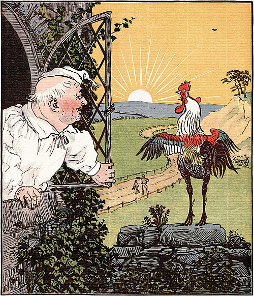

# Rimas

Esta página contiene la [sección 81.9](index.md#819-rimas) del
[capítulo 81](index.md): dos canciones cuya letra tiene una estructura
que un programa puede producir. El ejemplo está en `rimas.pl`, en
`ejemplos/capitulo-81/`, con sus pruebas, y corre en SWISH.

Csenki usa estas canciones para mostrar una manera de desarrollar un
predicado recursivo: identificar la estructura a mano, experimentar en el
intérprete con datos de juguete, escribir una versión preliminar y
refinarla. Lo que importa del método es el orden: primero el esqueleto
de la recursión, con letras en lugar de versos, y después los detalles.

## Rimas, versión 1: la casa que construyó Juan

«This is the house that Jack built» es una rima tradicional inglesa
acumulativa: cada estrofa presenta un personaje nuevo y repite todos los
anteriores, hasta la casa del primer verso. La traducción del curso
empieza así:

```text
Esta es la casa que construyó Juan.

Esta es la malta
que estaba en la casa que construyó Juan.

Esta es la rata
que se comió la malta
que estaba en la casa que construyó Juan.
```

{ width="300" }

Una ilustración de la rima, de Randolph Caldecott, 1887. Imagen: dominio
público, vía
[Wikimedia Commons](https://commons.wikimedia.org/wiki/File:Randolph_Caldecott_illustration2.jpg).

La última estrofa contiene a todas las demás: cada estrofa es un final de
la última. Csenki lo explora primero con letras en lugar de versos, y la
lista de las estrofas resulta ser la de los **sufijos** de la última,
del más corto al más largo. `append/3` los da todos, en el orden inverso:

<!-- ejemplo: capitulo-81/rimas.pl predicado: sufijos/2 -->
```prolog
%!  sufijos(+Lista:list, -Sufijos:list) is det.
%
%   Sufijos son los sufijos no vacíos de Lista, del más corto al más
%   largo.
sufijos(Lista, Sufijos) :-
    findall(S, ( append(_, S, Lista), S \== [] ), Sufijos0),
    reverse(Sufijos0, Sufijos).
```

```prolog
?- sufijos([f, e, d, c, b, a], Ss).
Ss = [[a], [b, a], [c, b, a], [d, c, b, a], [e, d, c, b, a], [f, e, d, c, b, a]].
```

Con el esqueleto resuelto, falta cada verso. Un eslabón de la cadena es
`e(Articulo, Nombre, Enlace)`: el personaje y la manera de nombrar al
siguiente, un verbo con su preposición. El primer verso de una estrofa
presenta al personaje con «Este es» o «Esta es» según el artículo, y cada
verso siguiente une el verbo del eslabón anterior con el personaje que
sigue, contrayendo *a el* en *al*:

<!-- ejemplo: capitulo-81/rimas.pl predicado: cadena/1 estrofa/2 versos/3 presentacion/2 contraccion/3 con_punto/2 con_punto/3 rima/1 estrofa_n/2 -->
```prolog
% cadena(Eslabones): los personajes de la última estrofa, del primero al
% último.
cadena([ e(el, "granjero que siembra su trigo", v("que tenía", a)),
         e(el, "gallo que cantaba a la mañana", v("que despertó", a)),
         e(el, "cura de cabeza rapada", v("que casó", a)),
         e(el, "hombre de ropa rasgada", v("que besó", a)),
         e(la, "doncella desamparada", v("que ordeñó", a)),
         e(la, "vaca de cuerno torcido", v("que corneó", a)),
         e(el, "perro", v("que asustó", a)),
         e(el, "gato", v("que mató", a)),
         e(la, "rata", v("que se comió", ninguna)),
         e(la, "malta", v("que estaba en", ninguna)),
         e(la, "casa que construyó Juan", fin)
       ]).

%!  estrofa(+Eslabones:list, -Lineas:list) is det.
%
%   Lineas son los versos de la estrofa que presenta al primero de
%   Eslabones y recorre los demás.
estrofa([e(Articulo, Nombre, Enlace)|Es], Lineas) :-
    presentacion(Articulo, Presenta),
    format(string(Primera), "~w ~w ~w", [Presenta, Articulo, Nombre]),
    versos(Enlace, Es, Resto),
    con_punto([Primera|Resto], Lineas).

%!  versos(+Enlace, +Eslabones:list, -Lineas:list) is det.
%
%   Lineas son los versos que nombran a cada eslabón de Eslabones con el
%   enlace del anterior; Enlace es el del eslabón que los precede.
versos(_, [], []).
versos(v(Verbo, Prep), [e(Articulo, Nombre, Enlace)|Es], [Linea|Lineas]) :-
    contraccion(Prep, Articulo, Union),
    format(string(Linea), "~w ~w ~w", [Verbo, Union, Nombre]),
    versos(Enlace, Es, Lineas).

% presentacion(Articulo, Palabras): cómo empieza la estrofa según el
% género del primer personaje.
presentacion(el, "Este es").
presentacion(la, "Esta es").

%!  contraccion(+Preposicion, +Articulo, -Union:atom) is det.
%
%   Union es la preposición seguida del artículo: a y el se contraen en
%   al; sin preposición (ninguna), Union es el artículo.
contraccion(Prep, Articulo, Union) :-
    (   Prep == ninguna
    ->  Union = Articulo
    ;   Prep == a,
        Articulo == el
    ->  Union = al
    ;   atomic_list_concat([Prep, Articulo], ' ', Union)
    ).

%!  con_punto(+Lineas0:list, -Lineas:list) is det.
%
%   Lineas es Lineas0 con un punto al final del último verso.
con_punto([L0|Ls0], Lineas) :-
    con_punto(Ls0, L0, Lineas).

%!  con_punto(+Siguientes:list, +L0:string, -Lineas:list) is det.
%
%   Lineas es [L0|Siguientes] con un punto al final del último verso. El
%   verso actual va aparte, para que la indexación por el primer
%   argumento distinga si es el último.
con_punto([], L0, [L]) :-
    string_concat(L0, ".", L).
con_punto([L1|Ls0], L0, [L0|Ls]) :-
    con_punto(Ls0, L1, Ls).

%!  rima(-Estrofas:list) is det.
%
%   Estrofas son las estrofas de la rima, cada una una lista de versos,
%   de la más corta a la más larga.
rima(Estrofas) :-
    cadena(Cadena),
    sufijos(Cadena, Sufijos),
    maplist(estrofa, Sufijos, Estrofas).

%!  estrofa_n(+N:integer, -Lineas:list) is semidet.
%
%   Lineas son los versos de la estrofa N de la rima, de 1 a 11.
estrofa_n(N, Lineas) :-
    rima(Estrofas),
    nth1(N, Estrofas, Lineas).
```

`con_punto/3` lleva el verso actual aparte de la lista de los que siguen,
para que la cláusula del último se distinga por el primer argumento y no
quede una alternativa pendiente.

```prolog
?- estrofa_n(3, Ls).
Ls = ["Esta es la rata", "que se comió la malta", "que estaba en la casa que construyó Juan."].

?- contraccion(a, el, U).
U = al.
```

!!! question "Actividad"
    Escribir a mano los versos de la estrofa 5 antes de pedirla con
    `estrofa_n(5, Ls)`, y verificar cuántas contracciones *al* tiene.

## Rimas, versión 2: un elefante se balanceaba

La segunda canción de Csenki, «One man went to mow», no tiene una última
estrofa: cuenta sin fin. Su equivalente en castellano es «Un elefante se
balanceaba», en el que la estrofa N nombra N elefantes. El esqueleto es
ahora un número que crece, y lo que cambia de una estrofa a otra es la
gramática: el número en letras y la concordancia del verbo.

<!-- ejemplo: capitulo-81/rimas.pl predicado: unidad/2 decena/2 en_letras/2 ante_sustantivo/2 -->
```prolog
% unidad(N, Palabra): los números del 1 al 29 que tienen nombre propio.
unidad(1, "uno").
unidad(2, "dos").
unidad(3, "tres").
unidad(4, "cuatro").
unidad(5, "cinco").
unidad(6, "seis").
unidad(7, "siete").
unidad(8, "ocho").
unidad(9, "nueve").
unidad(10, "diez").
unidad(11, "once").
unidad(12, "doce").
unidad(13, "trece").
unidad(14, "catorce").
unidad(15, "quince").
unidad(16, "dieciséis").
unidad(17, "diecisiete").
unidad(18, "dieciocho").
unidad(19, "diecinueve").
unidad(20, "veinte").
unidad(21, "veintiuno").
unidad(22, "veintidós").
unidad(23, "veintitrés").
unidad(24, "veinticuatro").
unidad(25, "veinticinco").
unidad(26, "veintiséis").
unidad(27, "veintisiete").
unidad(28, "veintiocho").
unidad(29, "veintinueve").

% decena(D, Palabra): el nombre de las decenas desde el 30.
decena(3, "treinta").
decena(4, "cuarenta").
decena(5, "cincuenta").
decena(6, "sesenta").
decena(7, "setenta").
decena(8, "ochenta").
decena(9, "noventa").

%!  en_letras(+N:integer, -Palabras:string) is semidet.
%
%   Palabras es el número N, de 1 a 99, escrito en letras. Falla fuera de
%   ese intervalo.
en_letras(N, Palabras) :-
    (   unidad(N, P)
    ->  Palabras = P
    ;   N >= 30,
        N =< 99,
        D is N // 10,
        U is N mod 10,
        decena(D, PD),
        (   U =:= 0
        ->  Palabras = PD
        ;   unidad(U, PU),
            format(string(Palabras), "~w y ~w", [PD, PU])
        )
    ).

%!  ante_sustantivo(+N:integer, -Palabras:string) is semidet.
%
%   Palabras es N en letras como se dice delante de un sustantivo
%   masculino: uno pierde la última vocal (un, veintiún, treinta y un).
ante_sustantivo(N, Palabras) :-
    en_letras(N, P),
    (   string_concat(Raiz, "uno", P)
    ->  (   Raiz == "veinti"
        ->  Palabras = "veintiún"
        ;   string_concat(Raiz, "un", Palabras)
        )
    ;   Palabras = P
    ).
```

`ante_sustantivo/2` aplica la **apócope** de *uno* delante de un
sustantivo masculino: «un elefante», «veintiún elefantes», «treinta y un
elefantes». El acento de *veintiún* hace que no baste con quitar la
última letra:

```prolog
?- en_letras(21, P).
P = "veintiuno".

?- ante_sustantivo(21, P).
P = "veintiún".
```

<!-- ejemplo: capitulo-81/rimas.pl predicado: estrofa_elefantes/2 numero_gramatical/2 formas/5 mayuscula_inicial/2 cancion/1 -->
```prolog
%!  estrofa_elefantes(+N:integer, -Lineas:list) is semidet.
%
%   Lineas son los cuatro versos de la estrofa N, con N de 1 a 99.
estrofa_elefantes(N, [L1, L2, L3, L4]) :-
    ante_sustantivo(N, Numero0),
    mayuscula_inicial(Numero0, Numero),
    numero_gramatical(N, Num),
    formas(Num, Elefantes, Balanceaba, Veia, Fue),
    format(string(L1), "~w ~w se ~w", [Numero, Elefantes, Balanceaba]),
    L2 = "sobre la tela de una araña;",
    format(string(L3), "como ~w que resistía", [Veia]),
    format(string(L4), "~w a llamar a otro elefante.", [Fue]).

%!  numero_gramatical(+N:integer, -Num) is det.
%
%   Num es singular si N es 1 y plural si no.
numero_gramatical(N, Num) :-
    (   N =:= 1
    ->  Num = singular
    ;   Num = plural
    ).

% formas(Num, Elefantes, Balanceaba, Veia, Fue): las palabras de la
% estrofa que concuerdan con la cantidad de elefantes.
formas(singular, "elefante", "balanceaba", "veía", "fue").
formas(plural, "elefantes", "balanceaban", "veían", "fueron").

%!  mayuscula_inicial(+Texto:string, -Texto1:string) is det.
%
%   Texto1 es Texto con la primera letra en mayúscula.
mayuscula_inicial(Texto, Texto1) :-
    sub_string(Texto, 0, 1, _, Primera),
    sub_string(Texto, 1, _, 0, Resto),
    string_upper(Primera, Mayuscula),
    string_concat(Mayuscula, Resto, Texto1).

%!  cancion(-Estrofa:list) is nondet.
%
%   Estrofa es una estrofa de la canción: la primera, la segunda y así,
%   al pedir otra respuesta, hasta la 99.
cancion(Estrofa) :-
    between(1, 99, N),
    estrofa_elefantes(N, Estrofa).
```

```prolog
?- estrofa_elefantes(2, Ls).
Ls = ["Dos elefantes se balanceaban", "sobre la tela de una araña;", "como veían que resistía", "fueron a llamar a otro elefante."].
```

`cancion/1` da las estrofas una por una al pedir otra respuesta, como
el `song/0` de Csenki las escribe hasta que se interrumpe el programa;
aquí termina en la estrofa 99, donde terminan los números que
`en_letras/2` sabe escribir.
