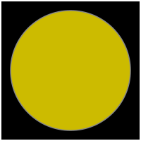
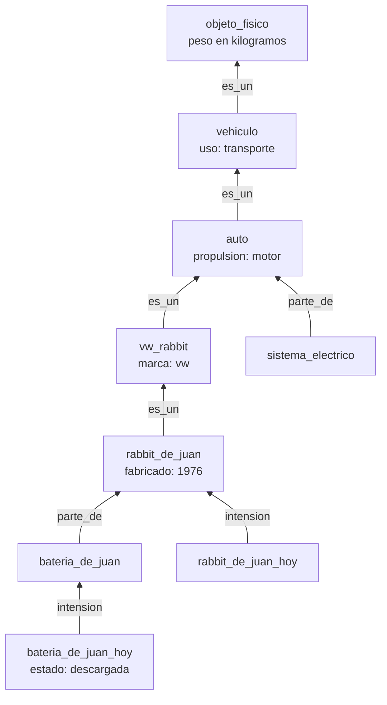

# Reglas de tránsito y marcos

Esta página contiene las secciones
[81.7](index.md#817-reglas-de-transito) y [81.8](index.md#818-marcos)
del [capítulo 81](index.md): dos programas de *Artificial Intelligence
through Prolog*, de Neil Rowe, que representan conocimiento con reglas.
Los ejemplos están en `transito.pl` y `marcos.pl`, en
`ejemplos/capitulo-81/`, con sus pruebas, y corren en SWISH.

## Reglas de tránsito, versión 1: las reglas de Rowe

Rowe traduce a reglas los párrafos del manual de conducir de California
de 1985 sobre los semáforos: qué significa cada luz para un auto y para
un peatón. El programa responde qué acciones son legales en una
situación, y el orden de las reglas da la prioridad: la primera respuesta
es la recomendada.

{ width="80" } { width="80" }

El primer ejemplo de Rowe: un auto que se acerca a un cruce ve la luz
amarilla fija y la flecha verde a la izquierda, y tiene espacio para
frenar. Imágenes: Mliu92, a partir del manual de señales de tránsito de
los Estados Unidos,
[CC BY-SA 4.0](https://creativecommons.org/licenses/by-sa/4.0), vía
Wikimedia Commons
([luz amarilla](https://commons.wikimedia.org/wiki/File:MUTCD_4D-2_(Circular_Yellow).svg),
[flecha verde](https://commons.wikimedia.org/wiki/File:MUTCD_4D-2_(Green_Arrow_LEFT).svg)).

En el libro, la situación son hechos de la base de datos —`light/2`,
`safe_stop_possible`, `clockwise_cross`— que otro programa borraría y
volvería a escribir cada segundo. Aquí la situación es una lista de
observaciones que se pasa como argumento, y las reglas se prueban con
cualquier situación sin tocar la base de datos:

<!-- ejemplo: capitulo-81/transito.pl predicado: luz/3 puede_frenar/1 cruce_horario/1 alto_peaton/2 paso_peaton/2 senales_peaton/1 verde_de_frente/1 -->
```prolog
%!  luz(+Situacion:list, ?Tipo, ?Estado) is nondet.
%
%   En Situacion se ve la luz Tipo en Estado.
luz(Situacion, Tipo, Estado) :-
    member(luz(Tipo, Estado), Situacion).

%!  puede_frenar(+Situacion:list) is semidet.
%
%   En Situacion el auto puede detenerse a tiempo y sin peligro.
puede_frenar(Situacion) :-
    memberchk(puede_frenar, Situacion).

%!  cruce_horario(+Situacion:list) is semidet.
%
%   En Situacion el peatón cruza en el sentido de las agujas del reloj.
cruce_horario(Situacion) :-
    memberchk(cruce_horario, Situacion).

%!  alto_peaton(+Situacion:list, ?Estado) is nondet.
%
%   Se ve una señal que detiene al peatón, en Estado: «espere», «no
%   cruce» o la mano levantada.
alto_peaton(Situacion, Estado) :-
    member(Tipo, [espere, no_cruce, mano]),
    luz(Situacion, Tipo, Estado).

%!  paso_peaton(+Situacion:list, ?Estado) is nondet.
%
%   Se ve una señal que deja pasar al peatón, en Estado: «cruce» o la
%   silueta que camina.
paso_peaton(Situacion, Estado) :-
    member(Tipo, [cruce, silueta]),
    luz(Situacion, Tipo, Estado).

%!  senales_peaton(+Situacion:list) is semidet.
%
%   El cruce tiene señales para peatones.
senales_peaton(Situacion) :-
    (   alto_peaton(Situacion, _)
    ;   paso_peaton(Situacion, _)
    ),
    !.

%!  verde_de_frente(+Situacion:list) is semidet.
%
%   El peatón tiene de frente una flecha verde: la de la derecha si no
%   cruza en el sentido de las agujas del reloj, la de la izquierda si
%   cruza en ese sentido.
verde_de_frente(Situacion) :-
    (   cruce_horario(Situacion)
    ->  luz(Situacion, flecha_verde, izquierda)
    ;   luz(Situacion, flecha_verde, derecha)
    ),
    !.
```

Las reglas para el auto empiezan por las flechas, que mandan sobre las
otras luces, y en cada grupo ponen primero la de detenerse, por si una
falla del semáforo enciende dos luces. Las del peatón miran sus propias
señales, o la flecha verde que tiene de frente: un peatón no cruza
contra una flecha verde que habilita a los autos a girar hacia él.

<!-- ejemplo: capitulo-81/transito.pl predicado: auto/2 peaton/2 accion_v1/3 -->
```prolog
%!  auto(+Situacion:list, ?Accion) is nondet.
%
%   Una regla que mira las luces dice que Accion es legal para un auto en
%   Situacion. Primero las flechas, que mandan sobre las otras luces; en
%   cada grupo, primero detenerse, por si hay más de una luz encendida.
auto(S, detenerse) :-
    luz(S, flecha_amarilla, _),
    puede_frenar(S).
auto(S, ceder_y_girar_izquierda) :-
    luz(S, flecha_amarilla, izquierda),
    \+ puede_frenar(S).
auto(S, ceder_y_girar_derecha) :-
    luz(S, flecha_amarilla, derecha),
    \+ puede_frenar(S).
auto(S, ceder_y_girar_izquierda) :-
    luz(S, flecha_verde, izquierda).
auto(S, ceder_y_girar_derecha) :-
    luz(S, flecha_verde, derecha).
auto(S, detenerse) :-
    luz(S, rojo, fija).
auto(S, detenerse_y_avanzar) :-
    luz(S, rojo, intermitente).
auto(S, detenerse) :-
    luz(S, amarillo, fija),
    puede_frenar(S).
auto(S, ceder_y_avanzar) :-
    luz(S, amarillo, fija),
    \+ puede_frenar(S).
auto(S, ceder_y_avanzar) :-
    luz(S, verde, fija).
auto(S, avanzar_despacio) :-
    luz(S, amarillo, intermitente).
auto(S, detenerse) :-
    luz(S, flecha_roja, _).

%!  peaton(+Situacion:list, ?Accion) is nondet.
%
%   Una regla que mira las señales de peatones, o la flecha que el peatón
%   tiene de frente, dice que Accion es legal para él en Situacion.
peaton(S, detenerse) :-
    alto_peaton(S, fija).
peaton(S, detenerse) :-
    \+ senales_peaton(S),
    verde_de_frente(S).
peaton(S, detenerse) :-
    alto_peaton(S, intermitente),
    puede_frenar(S).
peaton(S, ceder_y_avanzar) :-
    alto_peaton(S, intermitente),
    \+ puede_frenar(S).
peaton(S, ceder_y_avanzar) :-
    paso_peaton(S, fija).

%!  accion_v1(+Situacion:list, +Quien, ?Accion) is nondet.
%
%   Accion es legal para Quien, auto o peaton, en Situacion, con las dos
%   reglas por omisión de Rowe: el peatón sin señales ni flecha de frente
%   hace lo que haría un auto, y cualquiera avanza si no tiene que
%   detenerse. Las respuestas salen en orden de prioridad. Quien debe
%   llegar instanciado: la última regla lo usa dentro de \+.
accion_v1(S, auto, A) :-
    auto(S, A).
accion_v1(S, peaton, A) :-
    peaton(S, A).
accion_v1(S, peaton, A) :-
    \+ senales_peaton(S),
    \+ verde_de_frente(S),
    accion_v1(S, auto, A).
accion_v1(S, Quien, avanzar) :-
    \+ accion_v1(S, Quien, detenerse),
    \+ accion_v1(S, Quien, detenerse_y_avanzar).
```

Las dos últimas cláusulas de `accion_v1/3` son las **reglas por
omisión**: el peatón sin señales ni flecha de frente hace lo que haría un
auto, y cualquiera puede avanzar si no tiene que detenerse. La última usa
`Quien` dentro de `\+`, así que `Quien` debe llegar instanciado.

```prolog
?- accion_v1([puede_frenar, luz(amarillo, fija), luz(flecha_verde, izquierda)], auto, A).
A = ceder_y_girar_izquierda ;
A = detenerse ;
false.
```

Es lo que dice el libro: girar a la izquierda cediendo el paso, o
detenerse; avanzar no, porque detenerse es legal. El segundo ejemplo de
Rowe es un peatón que cruza en el sentido de las agujas del reloj, con la
luz verde y la silueta que camina, intermitente. El texto anuncia
`yield_and_go`, cruzar cediendo el paso; el programa del libro, ejecutado,
responde `go`, y esta versión lo mismo:

```prolog
?- accion_v1([cruce_horario, luz(verde, fija), luz(silueta, intermitente)], peaton, A).
A = avanzar.
```

La regla que daría `ceder_y_avanzar` pide la señal de paso fija, y la del
ejemplo es intermitente; el texto describe la regla que el autor tenía en
mente, no la que escribió. El
[ejercicio 10](index.md#ejercicios) la corrige.

!!! question "Actividad"
    Predecir las respuestas de `accion_v1([luz(verde, fija)], peaton, A)`
    siguiendo las cláusulas en orden, y explicar por qué una de ellas
    aparece dos veces.

## Reglas de tránsito, versión 2: lo que se hace por omisión

Rowe define las reglas por omisión como consejos débiles, que solo se
usan cuando no hay uno más específico. La regla que permite avanzar no
lo cumple: se aplica cada vez que detenerse no es legal, aunque otra
regla ya haya dicho qué hacer.

```prolog
?- accion_v1([luz(amarillo, intermitente)], auto, A).
A = avanzar_despacio ;
A = avanzar.
```

Con la luz amarilla intermitente, el manual pide avanzar despacio, y el
programa permite además avanzar sin más. La versión 2 escribe la
condición del texto: si alguna regla específica da una acción, esas son
las acciones; si no, se aplica la omisión. `decision/3` es la primera
acción, la que el orden de las reglas recomienda.

<!-- ejemplo: capitulo-81/transito.pl predicado: especifica/3 accion/3 decision/3 -->
```prolog
%!  especifica(+Situacion:list, ?Quien, ?Accion) is nondet.
%
%   Accion es legal para Quien en Situacion según una regla que mira las
%   luces.
especifica(S, auto, A) :-
    auto(S, A).
especifica(S, peaton, A) :-
    peaton(S, A).

%!  accion(+Situacion:list, +Quien, ?Accion) is nondet.
%
%   Accion es legal para Quien en Situacion: lo que dicen las reglas
%   específicas; si ninguna dice nada, el peatón sin señales ni flecha de
%   frente hace lo que haría un auto, y en cualquier otro caso se avanza.
accion(S, Quien, A) :-
    (   especifica(S, Quien, _)
    ->  especifica(S, Quien, A)
    ;   Quien == peaton,
        \+ senales_peaton(S),
        \+ verde_de_frente(S)
    ->  accion(S, auto, A)
    ;   A = avanzar
    ).

%!  decision(+Situacion:list, +Quien, -Accion) is semidet.
%
%   Accion es la acción recomendada a Quien en Situacion: la primera
%   legal, en el orden de prioridad de las reglas.
decision(S, Quien, A) :-
    once(accion(S, Quien, A)).
```

```prolog
?- accion([luz(amarillo, intermitente)], auto, A).
A = avanzar_despacio ;
false.

?- accion([luz(verde, fija)], peaton, A).
A = ceder_y_avanzar ;
false.

?- decision([puede_frenar, luz(amarillo, fija), luz(flecha_verde, izquierda)], auto, A).
A = ceder_y_girar_izquierda.
```

Como la situación es un argumento, las reglas se pueden examinar en
todas las situaciones de un conjunto. `tabla/2` las calcula para cada
luz de los autos encendida sola, con y sin espacio para frenar:

<!-- ejemplo: capitulo-81/transito.pl predicado: vehicular/2 tabla/2 situacion/3 -->
```prolog
% vehicular(Tipo, Estado): una luz para los autos y uno de sus estados.
vehicular(Tipo, Estado) :-
    member(Tipo, [rojo, amarillo, verde]),
    member(Estado, [fija, intermitente]).
vehicular(Tipo, Estado) :-
    member(Tipo, [flecha_roja, flecha_amarilla, flecha_verde]),
    member(Estado, [izquierda, derecha]).

%!  tabla(+Quien, -Filas:list) is det.
%
%   Filas tiene una fila Luz-Frenar-Acciones por cada luz para los autos,
%   sola, con Frenar si o no según el auto pueda detenerse, y Acciones las
%   acciones legales para Quien, en orden de prioridad.
tabla(Quien, Filas) :-
    findall(luz(T, E)-F-As,
            ( vehicular(T, E),
              member(F, [si, no]),
              situacion(luz(T, E), F, S),
              findall(A, accion(S, Quien, A), As) ),
            Filas).

%!  situacion(+Luz, +Frenar, -Situacion:list) is det.
%
%   Situacion tiene solo Luz, y puede_frenar si Frenar es si.
situacion(Luz, si, [Luz, puede_frenar]).
situacion(Luz, no, [Luz]).
```

| Luz | Puede frenar | No puede frenar |
|---|---|---|
| roja fija | detenerse | detenerse |
| roja intermitente | detenerse y avanzar | detenerse y avanzar |
| amarilla fija | detenerse | ceder y avanzar |
| amarilla intermitente | avanzar despacio | avanzar despacio |
| verde fija | ceder y avanzar | ceder y avanzar |
| verde intermitente | avanzar | avanzar |
| flecha roja | detenerse | detenerse |
| flecha amarilla | detenerse | ceder y girar |
| flecha verde | ceder y girar | ceder y girar |

Cada luz sola da una sola acción, y las pruebas lo comprueban sobre las
24 filas. La verde intermitente, que el manual no menciona, cae en la
omisión. Con dos luces encendidas a la vez aparecen los conflictos que el
orden de las reglas resuelve; el
[ejercicio 9](index.md#ejercicios) los cuenta.

## Marcos

Un **marco** reúne lo que se sabe de un objeto o de una clase de objetos.
Cada dato es una **ranura** con un valor: `valor(Objeto, Ranura, Valor)`.
Un marco puede declarar una ranura sin llenarla, `ranura(Objeto,
Ranura)`, para decir que todo objeto de esa clase tiene ese dato aunque
el marco no sepa cuál es: todo vehículo tiene propietario, pero el
vehículo en general no tiene uno. Los marcos se enlazan con relaciones
que también son ranuras: `es_un` lleva a una clase más general,
`parte_de` al todo del que el objeto es parte, e `intension` al concepto
del que el objeto es un caso en un momento dado. El ejemplo de Rowe es
el de los autos, con Juan en lugar de Joe:



`rabbit_de_juan` es el auto de Juan como objeto que dura;
`rabbit_de_juan_hoy` es ese auto en el momento actual, la **extensión**
de la que `rabbit_de_juan` es la **intensión**. La batería descargada es
un dato del momento: lo tiene `bateria_de_juan_hoy`, no la batería en
general.

<!-- ejemplo: capitulo-81/marcos.pl fragmento: valor(vehiculo, es_un, objeto_fisico). .. anio_actual(1987). -->
```prolog
valor(vehiculo, es_un, objeto_fisico).
valor(vehiculo, uso, transporte).
valor(sistema_de_propulsion, parte_de, vehiculo).
valor(auto, es_un, vehiculo).
valor(auto, propulsion, motor_de_combustion_interna).
valor(auto, extension, autos_en_circulacion).
valor(sistema_electrico, parte_de, auto).
valor(bateria, parte_de, sistema_electrico).
valor(arranque, parte_de, sistema_electrico).
valor(vw_rabbit, es_un, auto).
valor(vw_rabbit, marca, vw).
valor(vw_rabbit, modelo, rabbit).
valor(autos_en_circulacion, intension, auto).
valor(rabbit_de_juan, es_un, vw_rabbit).
valor(rabbit_de_juan, extension, rabbit_de_juan_hoy).
valor(rabbit_de_juan, propietario, juan).
valor(rabbit_de_juan, fabricado, 1976).
valor(rabbit_de_juan_hoy, subconjunto, autos_en_circulacion).
valor(rabbit_de_juan_hoy, intension, rabbit_de_juan).
valor(bateria_de_juan, extension, bateria_de_juan_hoy).
valor(bateria_de_juan, parte_de, rabbit_de_juan).
valor(bateria_de_juan_hoy, intension, bateria_de_juan).
valor(bateria_de_juan_hoy, contenida_en, rabbit_de_juan_hoy).
valor(bateria_de_juan_hoy, estado, descargada).
valor(auto_de_ana, es_un, auto).
valor(auto_de_ana, marca, fiat).

% ranura(Objeto, Ranura): el marco Objeto tiene la ranura Ranura, todavía
% sin llenar.
ranura(objeto_fisico, peso).
ranura(objeto_fisico, nombre).
ranura(objeto_fisico, uso).
ranura(vehiculo, propietario).
ranura(vehiculo, concesionarios).
ranura(vehiculo, fabricado).
ranura(vehiculo, edad).
ranura(vehiculo, propulsion).
ranura(auto, marca).
ranura(auto, modelo).

% unidades(Objeto, Ranura, Unidades): los valores de la ranura se miden
% en Unidades.
unidades(objeto_fisico, peso, kilogramos).
unidades(vehiculo, edad, anios).
unidades(vehiculo, fabricado, anios).

% valores_posibles(Objeto, Ranura, Valores): la ranura solo admite los
% valores de la lista.
valores_posibles(auto, marca, [gm, ford, chrysler, amc, vw, toyota, nissan,
                               bmw]).

% hereda(Ranura, Relacion): la ranura toma su valor del marco al que lleva
% la relación, si el marco no tiene uno propio.
hereda(uso, es_un).
hereda(propulsion, es_un).
hereda(concesionarios, es_un).
hereda(fabricado, es_un).
hereda(edad, es_un).
hereda(marca, es_un).
hereda(modelo, es_un).
hereda(propietario, parte_de).
hereda(concesionarios, parte_de).
hereda(fabricado, parte_de).
hereda(edad, parte_de).
hereda(marca, parte_de).
hereda(modelo, parte_de).

% anio_actual(A): el año en que se calculan las edades: el del libro.
anio_actual(1987).
```

`hereda/2` dice qué ranuras se heredan por qué relación: el uso, la marca
o el año de fabricación pasan de una clase a sus casos por `es_un`, y el
propietario y el año de fabricación pasan de un auto a sus partes por
`parte_de`. El peso no se hereda: cada objeto pesa lo suyo.

### Valores propios y heredados

Un valor **propio** está guardado en el marco o se deriva de otro valor
guardado. Rowe guarda `tiene_parte` y `parte_de` en los dos sentidos y
agrega dos reglas que derivan cada uno del otro; ejecutadas, se llaman
una a la otra sin fin cada vez que el dato no está, y una consulta tan
simple como la edad de un auto genérico no termina. Aquí las partes se
guardan solo con `parte_de`, y `tiene_parte` se deriva solo de los
hechos. La edad se calcula a partir del año de fabricación, con el año
del libro, 1987, para reproducir sus respuestas.

<!-- ejemplo: capitulo-81/marcos.pl predicado: propio/3 tiene_valor/3 -->
```prolog
%!  propio(?Objeto, ?Ranura, ?Valor) is nondet.
%
%   El marco Objeto tiene Valor en Ranura sin heredarlo: guardado, o
%   derivado de otro valor guardado (tiene_parte de parte_de, la edad del
%   año de fabricación).
propio(O, R, V) :-
    valor(O, R, V).
propio(O, tiene_parte, P) :-
    valor(P, parte_de, O).
propio(O, edad, E) :-
    valor(O, fabricado, A),
    anio_actual(Hoy),
    E is Hoy - A.

%!  tiene_valor(+Objeto, +Ranura, -Valor) is nondet.
%
%   Valor es el valor de Ranura en el marco Objeto: los propios, si los
%   hay; si no, los heredados por las relaciones que Ranura admite, y los
%   del concepto del que Objeto es la extensión. Valor debe llegar libre:
%   con un valor propio distinto, el heredado no se examina.
tiene_valor(O, R, V) :-
    (   propio(O, R, _)
    ->  propio(O, R, V)
    ;   hereda(R, Relacion),
        valor(O, Relacion, Superior),
        tiene_valor(Superior, R, V)
    ;   valor(O, intension, I),
        tiene_valor(I, R, V)
    ).
```

`tiene_valor/3` busca primero los valores propios y, si no hay ninguno,
los heredados: un valor propio reemplaza al de la clase, que es como se
escriben las excepciones. La versión del libro lo hace con un corte
después del primer valor propio, con dos efectos: una ranura con varios
valores propios da solo el primero, y con el valor ya instanciado, si el
propio es distinto, el corte no llega a ejecutarse y la consulta acepta
el valor heredado. El si-entonces-sino decide con la existencia de algún
valor propio, sin mirar cuál, y los devuelve todos:

```prolog
?- tiene_valor(rabbit_de_juan_hoy, uso, U).
U = transporte ;
false.

?- tiene_valor(bateria_de_juan_hoy, edad, E).
E = 11 ;
false.

?- tiene_valor(sistema_electrico, tiene_parte, P).
P = bateria ;
P = arranque ;
false.

?- tiene_valor(auto, parte_de, P).
false.
```

La edad de la batería de hoy sale de su intensión, la batería de Juan,
que la hereda por `parte_de` del auto de Juan, fabricado en 1976: 11
años en 1987, la respuesta del libro.

!!! example "Patrón 87 — Valor propio o heredado sin corte rojo"
    **Problema.** Un predicado da los valores de un caso particular, si
    los tiene, y si no los de uno más general, como `tiene_valor/3`, que
    da los valores propios de una ranura o, a falta de ellos, los
    heredados por `es_un`, `parte_de` o `intension`. El valor particular
    reemplaza al general: así se escriben las excepciones.

    **Versión ingenua.** La de Rowe: una cláusula para los valores
    propios que termina en un corte, y después las cláusulas de la
    herencia. El corte es rojo y pierde respuestas: una ranura con
    varios valores propios da solo el primero, y escrito así,
    `tiene_valor(sistema_electrico, tiene_parte, P)` da `bateria` y no
    `arranque`. Con el valor ya instanciado y distinto del propio, el
    corte no llega a ejecutarse, y la consulta acepta el heredado.

    **Patrón.** Un si-entonces-sino cuya condición pregunta si hay algún
    valor propio sin ligar cuál, `propio(O, R, _)`, y cuya rama entonces
    vuelve a llamar a `propio(O, R, V)` para devolverlos todos; la rama
    sino da los heredados. La condición se compromete con la clase de
    respuesta, no con una respuesta. Es el condicional del
    [Patrón 5](../patrones.md#5-casos-con-condicional) con una condición
    que no comparte variables con la salida.

    **Cuándo no usarlo.** Cuando lo propio y lo heredado se acumulan en
    lugar de reemplazarse, como las ranuras de `tiene_ranura/2`, que es
    una disyunción. Cuando se quiere un solo valor, el del marco más
    cercano: entonces la condición liga el valor y la rama lo devuelve,
    como en `tiene_unidades/3`. Y cuando derivar un valor propio es
    caro: la condición deriva el primero y la rama vuelve a derivarlo;
    conviene reunir los propios una vez con `findall/3` y decidir por la
    lista vacía.

### Ranuras, unidades y valores posibles

La herencia de **ranuras** es otra: no pasa un valor, sino la existencia
del dato. El auto de Juan tiene una ranura `peso` porque todo objeto
físico la tiene, aunque nadie sepa cuánto pesa. Las **unidades** de una
ranura se heredan de la clase más cercana que las declare, y los
**valores posibles** de una clase permiten revisar los casos:

<!-- ejemplo: capitulo-81/marcos.pl predicado: tiene_ranura/2 ranuras/2 tiene_unidades/3 fuera_de_lo_posible/3 es_un_de/2 -->
```prolog
%!  tiene_ranura(+Objeto, ?Ranura) is nondet.
%
%   El marco Objeto tiene la ranura Ranura, llena o no: propia, de una
%   clase más general por es_un, o del concepto del que es la extensión.
%   Puede dar la misma ranura más de una vez.
tiene_ranura(O, R) :-
    (   ranura(O, R)
    ;   valor(O, R, _)
    ;   valor(O, es_un, Superior),
        tiene_ranura(Superior, R)
    ;   valor(O, intension, I),
        tiene_ranura(I, R)
    ).

%!  ranuras(+Objeto, -Ranuras:list) is det.
%
%   Ranuras son las ranuras del marco Objeto, sin repetir y en orden.
ranuras(O, Ranuras) :-
    (   setof(R, tiene_ranura(O, R), Ranuras)
    ->  true
    ;   Ranuras = []
    ).

%!  tiene_unidades(+Objeto, +Ranura, -Unidades) is semidet.
%
%   Los valores de Ranura en Objeto se miden en Unidades: lo dice el marco
%   o el más cercano de los más generales.
tiene_unidades(O, R, U) :-
    (   unidades(O, R, U0)
    ->  U = U0
    ;   valor(O, es_un, Superior)
    ->  tiene_unidades(Superior, R, U)
    ;   valor(O, intension, I),
        tiene_unidades(I, R, U)
    ).

%!  fuera_de_lo_posible(+Objeto, -Ranura, -Valor) is nondet.
%
%   Valor, el valor de Ranura en Objeto, no está entre los valores
%   posibles que un marco más general admite para Ranura.
fuera_de_lo_posible(O, R, V) :-
    valores_posibles(Clase, R, Posibles),
    es_un_de(O, Clase),
    tiene_valor(O, R, V),
    \+ memberchk(V, Posibles).

%!  es_un_de(+Objeto, ?Clase) is nondet.
%
%   Clase es Objeto o una clase más general, por es_un.
es_un_de(O, O).
es_un_de(O, Clase) :-
    valor(O, es_un, Superior),
    es_un_de(Superior, Clase).
```

```prolog
?- ranuras(rabbit_de_juan, Rs).
Rs = [concesionarios, edad, es_un, extension, fabricado, marca, modelo, nombre, peso, propietario, propulsion, uso].

?- tiene_unidades(rabbit_de_juan_hoy, edad, U).
U = anios.

?- fuera_de_lo_posible(auto_de_ana, R, V).
R = marca,
V = fiat ;
false.
```

El auto de Ana declara una marca que la lista de valores posibles de los
autos, la del libro, no tiene. La herencia de las **partes** —un auto
tiene sistema de propulsión porque lo tiene todo vehículo— es la tercera
clase de herencia que distingue Rowe, y la escribe el
[ejercicio 11](index.md#ejercicios).
