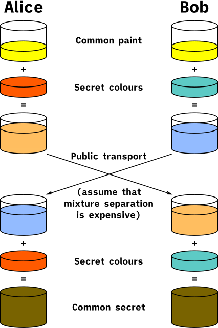

# El canal cifrado

Esta página contiene la sección
[82.8](index.md#828-version-6-un-secreto-acordado-y-un-canal-cifrado) del
[capítulo 82](index.md): el acuerdo de un secreto entre dos partes que
nunca se vieron, la derivación de claves y un canal cifrado y
autenticado. El ejemplo está en `acuerdo.pl`, en `ejemplos/capitulo-82/`,
con sus pruebas.

## Canal, versión 6: un secreto acordado y un canal cifrado

Las versiones anteriores protegen la integridad y la autenticidad, pero
todo lo que viaja se lee: la contraseña de `POST /sesion`, la ficha, las
inscripciones. Para cifrar con un algoritmo simétrico, las dos partes
necesitan la misma clave, y no pueden enviarla por el canal que
justamente quieren proteger. Whitfield Diffie y Martin Hellman publicaron
en 1976 la solución: un intercambio en el que cada parte publica un valor
y las dos llegan a un secreto que quien escucha el canal no puede
calcular.



La analogía de los colores: los dos parten de un color público, cada uno
agrega en secreto el suyo, intercambian las mezclas, y cada uno agrega su
color secreto a la mezcla que recibe; los dos obtienen el mismo color, y
separar una mezcla en sus componentes es tan difícil como calcular un
logaritmo discreto. Imagen: esquema original de A. J. Han Vinck, versión
SVG de Flugaal, de dominio público, vía
[Wikimedia Commons](https://commons.wikimedia.org/wiki/File:Diffie-Hellman_Key_Exchange.svg).

Con números, el color público es un primo P y un generador G; el secreto
de A es un exponente X, y publica G^X mod P; el de B es Y, y publica
G^Y mod P. A eleva lo que recibe a X, y B a Y: los dos obtienen
G^(X·Y) mod P. Quien escucha conoce G^X y G^Y, y para llegar al secreto
tendría que despejar X de G^X mod P, el **logaritmo discreto**, para el
que no se conoce un método eficiente con un P de 2048 bits.

<!-- ejemplo: capitulo-82/acuerdo.pl predicado: grupo/3 secreto_aleatorio/1 publico/3 compartido/4 -->
```prolog
%!  grupo(?Nombre, -P:integer, -G:integer) is nondet.
%
%   P es el primo y G el generador del grupo Nombre: juguete, el ejemplo
%   de P = 23 y G = 5, o rfc3526_14, el grupo de 2048 bits del RFC 3526.
grupo(juguete, 23, 5).
grupo(rfc3526_14, P, 2) :-
    atomic_list_concat(
        [ '0xffffffffffffffffc90fdaa22168c234c4c6628b80dc1cd1',
          '29024e088a67cc74020bbea63b139b22514a08798e3404dd',
          'ef9519b3cd3a431b302b0a6df25f14374fe1356d6d51c245',
          'e485b576625e7ec6f44c42e9a637ed6b0bff5cb6f406b7ed',
          'ee386bfb5a899fa5ae9f24117c4b1fe649286651ece45b3d',
          'c2007cb8a163bf0598da48361c55d39a69163fa8fd24cf5f',
          '83655d23dca3ad961c62f356208552bb9ed529077096966d',
          '670c354e4abc9804f1746c08ca18217c32905e462e36ce3b',
          'e39e772c180e86039b2783a2ec07a28fb5c55df06f4c52c9',
          'de2bcbf6955817183995497cea956ae515d2261898fa0510',
          '15728e5a8aacaa68ffffffffffffffff' ], Hex),
    atom_number(Hex, P).

%!  secreto_aleatorio(-X:integer) is det.
%
%   X es un exponente secreto de 256 bits, de crypto_n_random_bytes/2.
secreto_aleatorio(X) :-
    crypto_n_random_bytes(32, Bytes),
    foldl([B, N0, N]>>(N is N0 * 256 + B), Bytes, 0, X).

%!  publico(+Grupo, +X:integer, -A:integer) is det.
%
%   A es G^X mod P, lo que publica quien eligió el exponente secreto X.
publico(Grupo, X, A) :-
    grupo(Grupo, P, G),
    !,
    A is powm(G, X, P).

%!  compartido(+Grupo, +X:integer, +B:integer, -S:integer) is semidet.
%
%   S es B^X mod P: el secreto acordado, para quien eligió X y recibió B.
%   Falla si B no está entre 2 y P-2, un valor que fijaría S.
compartido(Grupo, X, B, S) :-
    grupo(Grupo, P, _),
    !,
    B > 1,
    B < P - 1,
    S is powm(B, X, P).
```

El grupo `juguete` es el ejemplo de la Wikipedia, con P = 23 y G = 5:

```prolog
?- grupo(juguete, P, G), publico(juguete, 6, A), publico(juguete, 15, B).
P = 23,
G = 5,
A = 8,
B = 19.

?- compartido(juguete, 6, 19, S1), compartido(juguete, 15, 8, S2).
S1 = S2, S2 = 2.
```

El grupo `rfc3526_14` es el de 2048 bits del RFC 3526, que define P a
partir de los dígitos de π. Es un **primo seguro**: (P−1)/2 también es
primo, lo que deja sin subgrupos pequeños donde el secreto quedaría
atrapado. Las pruebas lo comprueban con `primo/1` de la
[versión 4](firmas.md#firmas-version-4-rsa-con-enteros). `compartido/4`
rechaza los valores públicos 1 y P−1, cuyas potencias son siempre 1 o
±1: un atacante que los inyectara fijaría el secreto.

**Las claves de sesión.** El secreto acordado es un número de 2048 bits,
no una clave: tiene estructura, y se usaría para dos cosas. HKDF, la
función de derivación del RFC 5869, convierte ese material en claves de
la longitud pedida, y la opción `info/1` deriva claves independientes del
mismo material, como muestra Triska:

<!-- ejemplo: capitulo-82/acuerdo.pl predicado: claves_de_sesion/2 acordar/3 derivar/3 -->
```prolog
%!  claves_de_sesion(+S:integer, -Claves) is det.
%
%   Claves es claves(Kc, Ka), dos claves de 32 bytes en hexadecimal
%   derivadas del secreto acordado S con HKDF-SHA256: Kc para cifrar y Ka
%   para autenticar. La etiqueta info/1 las hace independientes.
claves_de_sesion(S, claves(Kc, Ka)) :-
    format(atom(Material), "~16r", [S]),
    derivar(Material, cifrado, Kc),
    derivar(Material, autenticacion, Ka).

%!  acordar(+Grupo, -ClavesA, -ClavesB) is det.
%
%   Simula el acuerdo completo entre A y B en Grupo: cada uno elige su
%   exponente secreto, publica su valor, calcula el secreto con el valor
%   del otro y deriva sus claves de sesión. ClavesA y ClavesB son las
%   claves a las que llega cada uno; por el canal pasan solo los valores
%   públicos.
acordar(Grupo, ClavesA, ClavesB) :-
    secreto_aleatorio(X),
    secreto_aleatorio(Y),
    publico(Grupo, X, A),
    publico(Grupo, Y, B),
    compartido(Grupo, X, B, SA),
    compartido(Grupo, Y, A, SB),
    claves_de_sesion(SA, ClavesA),
    claves_de_sesion(SB, ClavesB).

%!  derivar(+Material, +Etiqueta, -Clave:atom) is det.
%
%   Clave son 32 bytes de HKDF-SHA256 sobre Material con Etiqueta.
derivar(Material, Etiqueta, Clave) :-
    crypto_data_hkdf(Material, 32, Bytes,
                     [info(Etiqueta), algorithm(sha256)]),
    hex_bytes(Clave, Bytes).
```

```prolog
?- claves_de_sesion(2, Claves).
Claves = claves('9cba5824692c1384d0e24548ac7e1f088e03e392d8a6d1de4cf028dca5cd61a6', '738a4be267e5aec3590a9ea2bcf950c872704871c6279fadd93c7423c63317d9').

?- acordar(rfc3526_14, CA, CB).
CA = CB, CB = claves(e878ef3050ba3eb99de9783bf6f6818545377e42d68ab0c614762f04d48f302d, '907cebae8c80cd45f97f404135f86bba34d668ecd46e70d227b30f949996a915').
```

`acordar/3` hace las dos partes: elige dos exponentes de 256 bits,
intercambia los valores públicos y deriva las claves de cada lado. Las
claves cambian en cada consulta, y son siempre las mismas para A y
para B. Las cuatro potencias módulo un primo de 2048 bits, con
exponentes de 256 bits, tardan unos milisegundos.

**El cifrado.** El cifrado del capítulo es un **cifrado de flujo**: una
sucesión de bytes que parecen aleatorios, calculada a partir de la clave
y de un número de un solo uso (*nonce*), se combina con el texto por o
exclusivo. Cada bloque de 32 bytes del flujo es el HMAC de la clave de
cifrado sobre el nonce y un contador:

<!-- ejemplo: capitulo-82/acuerdo.pl predicado: flujo/4 bloque/4 cifrar/4 -->
```prolog
%!  flujo(+Kc, +Nonce, +Largo:integer, -Bytes:list) is det.
%
%   Bytes son los primeros Largo bytes del flujo de la clave Kc y Nonce:
%   los bloques HMAC-SHA256(Kc, Nonce:0), HMAC-SHA256(Kc, Nonce:1), …,
%   de 32 bytes cada uno, uno detrás de otro.
flujo(Kc, Nonce, Largo, Bytes) :-
    Bloques is (Largo + 31) // 32,
    Ultimo is Bloques - 1,
    findall(Bs, ( between(0, Ultimo, I),
                  bloque(Kc, Nonce, I, Bs) ), Listas),
    append(Listas, Todos),
    length(Bytes, Largo),
    append(Bytes, _, Todos).

%!  bloque(+Kc, +Nonce, +I:integer, -Bytes:list) is det.
%
%   Bytes son los 32 bytes del bloque I del flujo.
bloque(Kc, Nonce, I, Bytes) :-
    format(atom(Datos), "~w:~d", [Nonce, I]),
    crypto_data_hash(Datos, Hex, [algorithm(sha256), hmac(Kc)]),
    hex_bytes(Hex, Bytes).

%!  cifrar(+Kc, +Nonce, +Bytes0:list, -Bytes:list) is det.
%
%   Bytes es el o exclusivo de Bytes0 con el flujo de Kc y Nonce. La misma
%   operación cifra y descifra.
cifrar(Kc, Nonce, Bytes0, Bytes) :-
    length(Bytes0, Largo),
    flujo(Kc, Nonce, Largo, Flujo),
    maplist([A, B, C]>>(C is A xor B), Bytes0, Flujo, Bytes).
```

```prolog
?- flujo(clave, abc, 8, Bs).
Bs = [29, 131, 212, 34, 62, 240, 76, 142].
```

Como A xor F xor F es A, la misma operación cifra y descifra. El nonce es
imprescindible: con la misma clave y el mismo nonce, el flujo se repite,
y el o exclusivo de dos cifrados es el de los dos textos, sin la clave.
`sellar/3` genera un nonce aleatorio para cada mensaje, cifra, y calcula
el HMAC de la clave de autenticación sobre el nonce y el cifrado;
`abrir/3` comprueba ese código antes de descifrar:

<!-- ejemplo: capitulo-82/acuerdo.pl predicado: sellar/3 texto_bytes/2 mac_mensaje/4 abrir/3 -->
```prolog
%!  sellar(+Claves, +Texto, -Mensaje) is det.
%
%   Mensaje es mensaje(Nonce, Cifrado, Mac): Texto en UTF-8, cifrado con un
%   nonce aleatorio de 12 bytes, y el HMAC del nonce y el cifrado. Nonce,
%   Cifrado y Mac van en hexadecimal.
sellar(claves(Kc, Ka), Texto, mensaje(Nonce, Cifrado, Mac)) :-
    crypto_n_random_bytes(12, Ns),
    hex_bytes(Nonce, Ns),
    texto_bytes(Texto, Bytes0),
    cifrar(Kc, Nonce, Bytes0, Bytes),
    hex_bytes(Cifrado, Bytes),
    mac_mensaje(Ka, Nonce, Cifrado, Mac).

%!  texto_bytes(+Texto, -Bytes:list) is det.
%
%   Bytes son los bytes de Texto en UTF-8.
texto_bytes(Texto, Bytes) :-
    atom_codes(Texto, Codigos),
    phrase(utf8_codes(Codigos), Bytes).

%!  mac_mensaje(+Ka, +Nonce, +Cifrado, -Mac:atom) is det.
%
%   Mac es el HMAC-SHA256 con la clave Ka de Nonce:Cifrado.
mac_mensaje(Ka, Nonce, Cifrado, Mac) :-
    format(atom(Datos), "~w:~w", [Nonce, Cifrado]),
    crypto_data_hash(Datos, M, [algorithm(sha256), hmac(Ka)]),
    atom_string(Mac, M).

%!  abrir(+Claves, +Mensaje, -Texto:string) is semidet.
%
%   Texto es el texto de Mensaje, si su Mac corresponde al nonce y al
%   cifrado. El Mac se comprueba antes de descifrar; si no corresponde,
%   el mensaje fue alterado y abrir/3 falla sin descifrar nada.
abrir(claves(Kc, Ka), mensaje(Nonce, Cifrado, Mac), Texto) :-
    mac_mensaje(Ka, Nonce, Cifrado, Esperado),
    iguales(Mac, Esperado),
    hex_bytes(Cifrado, Bytes),
    cifrar(Kc, Nonce, Bytes, Bytes0),
    phrase(utf8_codes(Codigos), Bytes0),
    string_codes(Texto, Codigos).
```

**Lo que se pierde sin autenticación.** Un cifrado de flujo esconde el
texto, pero no impide modificarlo: cambiar un bit del cifrado cambia el
mismo bit del texto descifrado. Quien sabe que el mensaje dice «Pagar 100
pesos a Ana» y que el importe empieza en el byte 6 combina el cifrado con
`100` xor `900` en esa posición, sin conocer ninguna clave. Es el ejemplo
de Triska del mensaje que cambia de destinatario, con un importe:

<!-- ejemplo: capitulo-82/acuerdo.pl predicado: abrir_sin_mac/3 alterar/5 -->
```prolog
%!  abrir_sin_mac(+Claves, +Mensaje, -Texto:string) is det.
%
%   Texto es el descifrado de Mensaje sin comprobar su Mac: lo que haría un
%   canal que solo cifra. Está para mostrar qué se pierde; no se usa para
%   abrir mensajes.
abrir_sin_mac(claves(Kc, _), mensaje(Nonce, Cifrado, _), Texto) :-
    hex_bytes(Cifrado, Bytes),
    cifrar(Kc, Nonce, Bytes, Bytes0),
    phrase(utf8_codes(Codigos), Bytes0),
    string_codes(Texto, Codigos).

%!  alterar(+Mensaje0, +Posicion:integer, +Viejo, +Nuevo, -Mensaje)
%!      is det.
%
%   Mensaje es Mensaje0 con el cifrado cambiado para que, al descifrarlo,
%   el texto Viejo que empieza en el byte Posicion (desde 0) se lea Nuevo,
%   de igual cantidad de bytes. Lo hace quien conoce esa parte del texto, sin
%   conocer las claves: el o exclusivo con Viejo y Nuevo. El Mac queda el
%   de Mensaje0.
alterar(mensaje(Nonce, Cifrado0, Mac), Posicion, Viejo, Nuevo,
        mensaje(Nonce, Cifrado, Mac)) :-
    hex_bytes(Cifrado0, Bytes0),
    texto_bytes(Viejo, V),
    texto_bytes(Nuevo, N),
    maplist([A, B, C]>>(C is A xor B), V, N, Delta),
    length(Antes, Posicion),
    append(Antes, Resto0, Bytes0),
    length(Delta, K),
    length(Medio0, K),
    append(Medio0, Despues, Resto0),
    maplist([A, B, C]>>(C is A xor B), Medio0, Delta, Medio),
    append([Antes, Medio, Despues], Bytes),
    hex_bytes(Cifrado, Bytes).
```

```prolog
?- claves_de_sesion(2, C), sellar(C, "Pagar 100 pesos a Ana", M0), alterar(M0, 6, '100', '900', M1), abrir_sin_mac(C, M1, T).
C = claves('9cba5824692c1384d0e24548ac7e1f088e03e392d8a6d1de4cf028dca5cd61a6', '738a4be267e5aec3590a9ea2bcf950c872704871c6279fadd93c7423c63317d9'),
M0 = mensaje('986e3d764498d5429d9a20bb', '8dd2b2bd97d50008a3a373bdadf28d4d2d8dd631dd', b90c1ba3f847127c5a75bfb67afa20c6a58059b0d38e638e6b969fa577f31fab),
M1 = mensaje('986e3d764498d5429d9a20bb', '8dd2b2bd97d50808a3a373bdadf28d4d2d8dd631dd', b90c1ba3f847127c5a75bfb67afa20c6a58059b0d38e638e6b969fa577f31fab),
T = "Pagar 900 pesos a Ana".

?- claves_de_sesion(2, C), sellar(C, "Pagar 100 pesos a Ana", M0), alterar(M0, 6, '100', '900', M1), abrir(C, M1, T).
false.
```

Los dos cifrados difieren en un solo dígito hexadecimal, el `0` que pasó a
`8`: `1` xor `9` es 8. Sin el código de autenticación, el destinatario
lee 900 pesos; con él, `abrir/3` falla antes de descifrar, porque el
código del mensaje alterado ya no corresponde, y fabricar el correcto
requiere la clave de autenticación. El orden importa: el código se
calcula sobre el cifrado, no sobre el texto, y se comprueba primero, de
modo que un mensaje alterado nunca llega a descifrarse: es el [Patrón 89](../patrones.md#89-comprobar-antes-de-usar),
que la versión 5 aplica a la entrega firmada.

### El cifrado de la biblioteca

El cifrado de flujo con HMAC muestra las piezas, pero un programa real usa
un **cifrado autenticado** estándar, que hace las dos cosas en una
operación probada: ChaCha20-Poly1305, el que usa Triska, o AES-GCM.
`crypto_data_encrypt/6` los ofrece, con una clave de 32 bytes, un nonce
de 12 y la opción `tag/1`, que devuelve los 16 bytes del código de
autenticación; `crypto_data_decrypt/6` recibe el mismo código y falla si
el mensaje fue alterado.

En la instalación de SWI-Prolog 9.2.9 para Windows con la que se escribió
el curso, `crypto_data_encrypt/6` cifra con los dos algoritmos, pero
`crypto_data_decrypt/6` termina el proceso de `swipl` en lugar de
devolver el texto, y `ecdsa_sign/4` también lo termina. Por eso el
capítulo no ejecuta esos predicados y escribe su propio canal. La
biblioteca tampoco tiene Ed25519 ni X25519, las firmas y el acuerdo
sobre la curva 25519 que usa Triska con Scryer Prolog; el
[ejercicio 10](index.md#ejercicios) hace el acuerdo sobre la curva
`prime256v1` con `crypto_curve_scalar_mult/4`.

!!! question "Actividad"
    Predecir qué pasa si `sellar/3` usara siempre el mismo nonce y se
    sellaran «Pagar 100 pesos a Ana» y «Pagar 500 pesos a Ana»: qué se
    obtiene combinando por o exclusivo los dos cifrados, y qué parte de
    los textos revela. Comprobarlo con `cifrar/4` y un nonce fijo.
