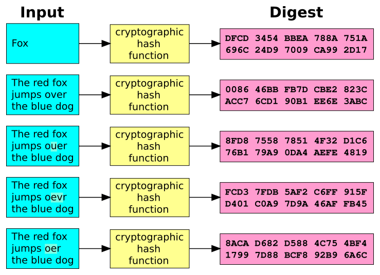
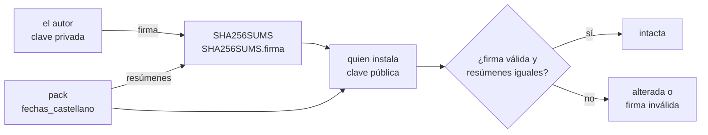

# Capítulo 82 — Proyecto: criptografía

El servicio de *Inscripciones* del
[capítulo 30](../capitulo-30-servicios-web-rest/index.md) acepta una
inscripción de cualquiera que conozca un legajo, y el pack del
[capítulo 31](../capitulo-31-ejecutables-y-distribucion/index.md) llega a
quien lo instala sin nada que pruebe que es el que su autor publicó. Este
capítulo resuelve los dos problemas con las herramientas de la
criptografía, y las arma en el orden en que cada una corrige lo que la
anterior no alcanza: un **resumen** detecta que un archivo cambió; una
**contraseña** bien guardada identifica a un alumno sin que la tabla de
contraseñas sirva a quien la robe; un **código de autenticación** con un
secreto convierte el resultado de esa identificación en una ficha que el
servicio comprueba en cada pedido; una **firma** con una clave pública
permite que cualquiera compruebe quién publicó el pack; y un **acuerdo de
claves** da a dos partes que nunca se vieron un secreto común con el que
cifrar lo que se dicen.

```text
$ curl -X POST -H "Content-Type: application/json" \
       -d '{"legajo": 104, "clave": "123456"}' http://localhost:8083/sesion
{
  "ficha":"104.1791208938.e821dd2b89ce8411a8fe80ca4674197333ace160c515fd839f1d23491f1c5564"
}
```

El punto de partida es el capítulo «Cryptography with Prolog» de *The
Power of Prolog*, de Markus Triska, que presenta los resúmenes, el
almacenamiento de contraseñas, las firmas digitales, el cifrado simétrico
autenticado y la derivación de claves con `library(crypto)` de Scryer
Prolog. El capítulo usa la biblioteca del mismo nombre de SWI-Prolog, que
comparte buena parte de esa interfaz, y escribe con enteros lo que en la
biblioteca queda oculto: RSA y el intercambio de Diffie y Hellman, con la
aritmética de precisión arbitraria que Triska señala como una de las
ventajas de Prolog para este tema. La lista completa de las fuentes, con
lo que se toma de cada una, está en las [Referencias](#referencias).

El código del capítulo es didáctico. Los algoritmos de la biblioteca
(SHA-256, HMAC, PBKDF2, RSA con relleno, HKDF) son los que se usan en la
práctica; los que el capítulo escribe a mano (RSA sin relleno, el cifrado
de flujo de la versión 6) existen para mostrar por qué la biblioteca hace
lo que hace, y no para proteger datos.

## Objetivos del capítulo

Al terminar el capítulo, el lector puede:

- distinguir la integridad, la autenticidad y la confidencialidad de unos
  datos, y elegir la herramienta que da cada una;
- calcular resúmenes SHA-256 de textos y archivos, y verificar un
  directorio contra un manifiesto;
- guardar contraseñas con sal y costo, y medir lo que eso cuesta a un
  atacante que prueba un diccionario o todas las combinaciones;
- emitir y validar fichas firmadas con HMAC en un servicio HTTP;
- generar claves RSA con enteros, cifrar y firmar con ellas, y mostrar las
  dos debilidades de RSA sin relleno;
- firmar un manifiesto con `library(crypto)` y comprobar una entrega con
  la clave pública de su autor;
- acordar un secreto con Diffie y Hellman, derivar claves con HKDF y
  detectar con un código de autenticación un mensaje cifrado alterado.

!!! info "Tiempo estimado"
    Leer el capítulo, ejecutar sus ejemplos y hacer las actividades: **1:50 h**.
    Resolver los 5 ejercicios marcados con ★: **1:20 h**.
    Resolver los 11 ejercicios del final: **3:30 h**.

## 82.1 Tres propiedades de los datos

Triska ordena la criptografía práctica por lo que garantiza de unos datos:

| Propiedad | La pregunta | La herramienta | Versión |
|---|---|---|---|
| **integridad** | ¿los datos son los mismos que se guardaron o se enviaron? | un resumen criptográfico | 1 |
| **autenticidad** | ¿los preparó quien dice haberlos preparado? | un código de autenticación (con un secreto compartido) o una firma (con un par de claves) | 3, 4 y 5 |
| **confidencialidad** | ¿solo los lee quien debe leerlos? | un cifrado, con una clave acordada | 6 |

Las contraseñas de la versión 2 son un caso aparte: lo que se guarda es un
resumen, pero uno pensado para que adivinar la contraseña cueste caro.

Un **resumen criptográfico** (*hash*) convierte unos datos de cualquier
longitud en una cadena de longitud fija, de manera que es inviable
encontrar otros datos con el mismo resumen o volver del resumen a los
datos. SHA-256, el algoritmo del capítulo, produce 256 bits, que se
escriben como 64 dígitos hexadecimales. La figura muestra tres textos
parecidos y sus resúmenes: el cambio de una letra cambia todo el resumen.



Una función de resumen criptográfico aplicada a textos parecidos: «Fox» y
cuatro frases que difieren en una palabra o en una letra dan resúmenes sin
relación entre sí. Imagen: Jorge Stolfi, de dominio público, vía
[Wikimedia Commons](https://commons.wikimedia.org/wiki/File:Cryptographic_Hash_Function.svg).

Una instancia pequeña del problema completo: el autor del pack
`fechas_castellano` publica, junto a sus tres archivos, un manifiesto con
el resumen de cada uno y la firma del manifiesto. Quien lo instala tiene
la clave pública del autor, recibida antes y por otro medio. Si alguien
agrega una línea a `prolog/fechas_castellano.pl` en el camino, el resumen
de ese archivo deja de coincidir con el del manifiesto; si además cambia
el manifiesto, la firma deja de verificar; y para firmar un manifiesto
nuevo necesita la clave privada, que nunca salió de la máquina del autor.



Lo difícil no es la matemática, que la biblioteca resuelve, sino el uso:
cada herramienta garantiza una propiedad precisa y nada más, y los errores
habituales consisten en esperar de una lo que solo da otra. Un resumen sin
firma no prueba nada si el atacante puede reemplazar los dos; una
contraseña guardada como un resumen simple cae con un diccionario; RSA sin
relleno se puede falsificar; un cifrado sin autenticación se puede alterar
sin que se note. Cada versión del capítulo muestra uno de esos fallos con
una consulta antes de corregirlo.

## 82.2 El programa terminado

| Versión | Archivo | Agrega | Lo que no puede hacer todavía |
|---|---|---|---|
| 1 | `resumenes.pl` | resúmenes de textos y archivos; el manifiesto del pack del [capítulo 31](../capitulo-31-ejecutables-y-distribucion/index.md) y su verificación | impedir que quien cambia un archivo cambie también el manifiesto |
| 2 | `claves.pl` | contraseñas con resumen simple y sus dos ataques; registros con sal y costo | autorizar un pedido sin volver a pedir la contraseña |
| 3 | `fichas.pl`, `acceso.pl` | fichas con HMAC; dos rutas nuevas en el servicio del [capítulo 30](../capitulo-30-servicios-web-rest/index.md) | que alguien sin el secreto compruebe una ficha |
| 4 | `rsa.pl` | RSA con enteros: primos, claves, cifrado y firma | firmar sin las dos debilidades de RSA sin relleno |
| 5 | `firmas.pl` | firmas de `library(crypto)`; un llavero; la entrega firmada | mantener en secreto lo que se transmite |
| 6 | `acuerdo.pl` | Diffie y Hellman; HKDF; un canal cifrado y autenticado | — |

Todos los archivos están en `ejemplos/capitulo-82/`. `rsa.pl` y
`fichas.pl` se ejecutan en SWISH; los demás leen archivos, abren un puerto
o cargan otros módulos, y son `% solo-local`.

## 82.3 Versión 1: resúmenes y manifiestos

`resumen/2` calcula el SHA-256 de un texto con `crypto_data_hash/3`, que
recibe el algoritmo como opción. Si no se le pasa, la biblioteca usa el
que considera seguro en su versión, que hoy es el mismo; nombrarlo hace
que el resumen no cambie si cambia esa elección.

<!-- ejemplo: capitulo-82/resumenes.pl predicado: resumen/2 resumen_archivo/2 -->
```prolog
%!  resumen(+Datos, -Hex:atom) is det.
%!  resumen(+Datos, +Hex:atom) is semidet.
%
%   Hex es el resumen SHA-256 de Datos, un texto (átomo, cadena o lista de
%   códigos) tomado en UTF-8, como 64 dígitos hexadecimales. El resumen se
%   calcula en una variable nueva y después se unifica, porque
%   crypto_data_hash/3, si recibe un resumen instanciado distinto del que
%   calcula, da un error en lugar de fallar.
resumen(Datos, Hex) :-
    crypto_data_hash(Datos, H, [algorithm(sha256)]),
    Hex = H.

%!  resumen_archivo(+Archivo, -Hex:atom) is det.
%!  resumen_archivo(+Archivo, +Hex:atom) is semidet.
%
%   Hex es el resumen SHA-256 de los bytes de Archivo. La opción
%   encoding(octet) es imprescindible: sin ella, crypto_file_hash/3 toma
%   cada byte leído como un carácter y lo codifica en UTF-8, y el resumen
%   de un archivo con bytes mayores que 127 no es el de sus bytes.
resumen_archivo(Archivo, Hex) :-
    crypto_file_hash(Archivo, H, [algorithm(sha256), encoding(octet)]),
    Hex = H.
```

Los dos encabezados registran dos comportamientos de la biblioteca que
las pruebas pusieron en evidencia. El de `resumen_archivo/2`, la opción
`encoding(octet)`: sin ella, `crypto_file_hash/3` lee los bytes del
archivo como caracteres y los vuelve a codificar en UTF-8, y el resumen
de un archivo con letras acentuadas, como `pack.pl`, no coincide con el
que calcula la orden `sha256sum`; la prueba `como_sha256sum` compara los
tres resúmenes del pack con los de esa orden. El de `resumen/2`, por qué
el resultado se calcula en una variable nueva: con el segundo argumento instanciado, `crypto_data_hash/3` compara
lo que calcula con lo que recibe, y si no coinciden da un error de dominio
en lugar de fallar. `resumen/2` es estable, en el sentido de la
[sección 14.5](../capitulo-14-estilo-y-documentacion/index.md#145-orden-de-los-argumentos-y-estabilidad):
con el resumen ligado, falla.

!!! example "Patrón 88 — Calcular y después comparar"
    **Problema.** Un predicado obtiene su salida de un predicado de
    biblioteca que, con esa salida ya ligada, no falla cuando el valor no
    corresponde sino que da un error. El predicado propio hereda ese
    comportamiento, y el modo `+` que su encabezado declara no se cumple.

    **Versión ingenua.** Pasar el argumento de salida directamente a la
    biblioteca, con `crypto_data_hash(Datos, Hex, [algorithm(sha256)])`
    como cuerpo de `resumen/2`. Con `Hex` ligado a un resumen que no
    corresponde, la consulta termina con
    `domain_error(hex_encoding, Hex)` en lugar de responder `false.`

    **Patrón.** Llamar a la biblioteca con una variable nueva y unificar
    el resultado con la salida en la última meta: `Hex = H` en
    `resumen/2` y `resumen_archivo/2`, `Mac = M` en `mac/3`. La
    biblioteca trabaja siempre en el único modo que admite, y la
    comparación queda a cargo de la unificación, que falla. Es el
    movimiento del
    [Patrón 3](../patrones.md#3-salida-despues-del-compromiso) aplicado a
    una llamada que da error en lugar de a un corte; la prueba
    `resumen_instanciado_distinto`, con `[fail]`, es la que pide el
    [Patrón 2](../patrones.md#2-encabezado-que-se-cumple) para el modo
    `resumen(+Datos, +Hex) is semidet`.

    **Cuándo no usarlo.** Cuando la biblioteca ya es estable con la salida
    ligada, como `atom_length/2`: la variable intermedia no agrega nada.
    Y cuando el argumento ligado es una entrada que guía a la biblioteca:
    `length(L, 2)` da una sola respuesta, pero `length(L, N0), N0 = 2`
    enumera longitudes y, al pedir otra respuesta, no termina.

```prolog
?- resumen("Inscripciones", H).
H = '74ddd0834edc80a8fec50015ba366220ac700ab3439cbb2ed62041ba8f6f9816'.

?- resumen("inscripciones", H).
H = '21e14a39ae707f70b8da34bb558e3a2c68b5e5df3c45842a54c53d6b87723041'.
```

Cambiar la primera letra cambió todo el resumen. `bits_distintos/3` cuenta
cuántos de los 256 bits cambiaron: el o exclusivo de los dos números tiene
un 1 en cada bit distinto, y `popcount` los cuenta.

<!-- ejemplo: capitulo-82/resumenes.pl predicado: bits_distintos/3 hex_entero/2 -->
```prolog
%!  bits_distintos(+Hex1:atom, +Hex2:atom, -N:integer) is det.
%
%   N es la cantidad de bits en que difieren dos resúmenes de igual
%   longitud: la cantidad de unos del o exclusivo de los dos números.
bits_distintos(Hex1, Hex2, N) :-
    hex_entero(Hex1, A),
    hex_entero(Hex2, B),
    N is popcount(A xor B).

%!  hex_entero(+Hex:atom, -N:integer) is det.
%
%   N es el entero que escriben los dígitos hexadecimales de Hex.
hex_entero(Hex, N) :-
    atom_concat('0x', Hex, Texto),
    atom_number(Texto, N).
```

```prolog
?- resumen("Inscripciones", H1), resumen("inscripciones", H2), bits_distintos(H1, H2, N).
H1 = '74ddd0834edc80a8fec50015ba366220ac700ab3439cbb2ed62041ba8f6f9816',
H2 = '21e14a39ae707f70b8da34bb558e3a2c68b5e5df3c45842a54c53d6b87723041',
N = 134.
```

Cambia más o menos la mitad, como se espera de una función cuyos bits de
salida no guardan relación visible con los de entrada; es lo que se llama
el **efecto avalancha**.

**El manifiesto.** El pack del
[capítulo 31](../capitulo-31-ejecutables-y-distribucion/index.md#316-versiones-y-packs)
es un directorio con tres archivos. El archivo define el alias
`paquete31`, como los alias de `library(…)`, para nombrar el directorio
sin escribir su ruta: `paquete31(fechas_castellano)`. `archivos/2`
recorre el directorio, y `manifiesto/2` calcula el resumen de cada
archivo:

<!-- ejemplo: capitulo-82/resumenes.pl predicado: directorio/2 archivos/2 archivo_bajo/3 manifiesto/2 entrada/3 -->
```prolog
%!  directorio(+Dir0, -Dir:atom) is det.
%
%   Dir es la ruta absoluta del directorio Dir0, una ruta o un alias como
%   paquete31(fechas_castellano).
directorio(Dir0, Dir) :-
    absolute_file_name(Dir0, Dir, [file_type(directory)]).

%!  archivos(+Dir, -Rutas:list(atom)) is det.
%
%   Rutas son los archivos que hay debajo de Dir, una ruta o un alias, en
%   cualquier nivel, con la ruta relativa a Dir y separada por /, en orden
%   alfabético.
archivos(Dir0, Rutas) :-
    directorio(Dir0, Dir),
    findall(R, archivo_bajo(Dir, '', R), Rs),
    sort(Rs, Rutas).

%!  archivo_bajo(+Dir, +Prefijo:atom, -Ruta:atom) is nondet.
%
%   Ruta es un archivo debajo de Dir, con Prefijo delante.
archivo_bajo(Dir, Prefijo, Ruta) :-
    directory_files(Dir, Nombres),
    member(Nombre, Nombres),
    \+ memberchk(Nombre, ['.', '..']),
    directory_file_path(Dir, Nombre, Camino),
    atom_concat(Prefijo, Nombre, Relativa),
    (   exists_directory(Camino)
    ->  atom_concat(Relativa, '/', Prefijo1),
        archivo_bajo(Camino, Prefijo1, Ruta)
    ;   Ruta = Relativa
    ).

%!  manifiesto(+Dir, -Entradas:list) is det.
%
%   Entradas son los pares Ruta-Hex de los archivos de Dir, en el orden de
%   archivos/2, con el resumen SHA-256 de cada uno.
manifiesto(Dir0, Entradas) :-
    directorio(Dir0, Dir),
    archivos(Dir, Rutas),
    maplist(entrada(Dir), Rutas, Entradas).

%!  entrada(+Dir, +Ruta:atom, -Entrada:pair) is det.
%
%   Entrada es Ruta-Hex, con Hex el resumen del archivo Ruta de Dir.
entrada(Dir, Ruta, Ruta-Hex) :-
    directory_file_path(Dir, Ruta, Camino),
    resumen_archivo(Camino, Hex).
```

```prolog
?- manifiesto(paquete31(fechas_castellano), Es).
Es = ['pack.pl'-'12184a89ee8bf395c29c202bb95ef2098731418153c487b130b8ed36dd70b9b2', 'prolog/fechas_castellano.pl'-'37e03fb3c85f072f62dea0f58cbf1c2252929fbdfa8e6cf1424588731a81259e', 'prolog/fechas_castellano.plt'-'6860f571afc3653a260e7deadcb7989813d015a347895c9545285b798a16edbf'].
```

El manifiesto se escribe en el formato de la orden `sha256sum` de los
sistemas Unix —el resumen, dos espacios y la ruta—, de modo que esa orden
lo puede verificar también. `manifiesto_texto/2` lo escribe y
`texto_manifiesto/2` lo lee, con una gramática que exige 64 dígitos
hexadecimales al principio de cada línea:

<!-- ejemplo: capitulo-82/resumenes.pl predicado: manifiesto_texto/2 texto_manifiesto/2 lineas//1 linea//2 digitos_hex//1 -->
```prolog
%!  manifiesto_texto(+Entradas:list, -Texto:string) is det.
%
%   Texto es el manifiesto en el formato de sha256sum: una línea por
%   archivo, con el resumen, dos espacios y la ruta.
manifiesto_texto(Entradas, Texto) :-
    with_output_to(string(Texto),
                   forall(member(Ruta-Hex, Entradas),
                          format("~w  ~w~n", [Hex, Ruta]))).

%!  texto_manifiesto(+Texto, -Entradas:list) is semidet.
%
%   Entradas son los pares Ruta-Hex que escribe Texto, en el formato de
%   sha256sum. Falla si alguna línea no tiene ese formato.
texto_manifiesto(Texto, Entradas) :-
    string_codes(Texto, Codigos),
    phrase(lineas(Entradas), Codigos).

%!  lineas(-Entradas:list)// is semidet.
%
%   Las líneas de un manifiesto, cada una terminada en un fin de línea.
lineas([Ruta-Hex|Es]) -->
    linea(Ruta, Hex),
    !,
    lineas(Es).
lineas([]) -->
    [].

%!  linea(-Ruta:atom, -Hex:atom)// is semidet.
%
%   Una línea: 64 dígitos hexadecimales, dos espacios, la ruta y el fin
%   de línea.
linea(Ruta, Hex) -->
    digitos_hex(Ds),
    { length(Ds, 64), atom_codes(Hex, Ds) },
    "  ",
    string_without("\n", Cs),
    { Cs \== [], atom_codes(Ruta, Cs) },
    "\n".

%!  digitos_hex(-Codigos:list)// is det.
%
%   Los dígitos hexadecimales que siguen, todos los que haya.
digitos_hex([C|Cs]) -->
    [C],
    { code_type(C, xdigit(_)) },
    !,
    digitos_hex(Cs).
digitos_hex([]) -->
    [].
```

```text
12184a89ee8bf395c29c202bb95ef2098731418153c487b130b8ed36dd70b9b2  pack.pl
37e03fb3c85f072f62dea0f58cbf1c2252929fbdfa8e6cf1424588731a81259e  prolog/fechas_castellano.pl
6860f571afc3653a260e7deadcb7989813d015a347895c9545285b798a16edbf  prolog/fechas_castellano.plt
```

**La verificación.** `verificar/3` compara el directorio actual con un
manifiesto y clasifica cada ruta de las dos listas: igual, distinta, que
falta o que sobra. `intacto/2` exige que todas sean iguales.

<!-- ejemplo: capitulo-82/resumenes.pl predicado: verificar/3 estado/4 intacto/2 -->
```prolog
%!  verificar(+Dir, +Entradas:list, -Informe:list) is det.
%
%   Informe compara los archivos de Dir con el manifiesto Entradas: un
%   término por ruta, en orden alfabético, igual(R) o distinto(R) para los
%   archivos que están en los dos, falta(R) para los del manifiesto que no
%   están en Dir y sobra(R) para los de Dir que no están en el manifiesto.
verificar(Dir, Entradas, Informe) :-
    manifiesto(Dir, Actual),
    pairs_keys(Entradas, Esperadas),
    pairs_keys(Actual, Presentes),
    list_to_ord_set(Esperadas, E),
    list_to_ord_set(Presentes, P),
    ord_union(E, P, Todas),
    maplist(estado(Entradas, Actual), Todas, Informe).

%!  estado(+Entradas:list, +Actual:list, +Ruta:atom, -Estado) is det.
%
%   Estado es igual(Ruta), distinto(Ruta), falta(Ruta) o sobra(Ruta).
estado(Entradas, Actual, Ruta, Estado) :-
    (   memberchk(Ruta-H1, Entradas)
    ->  (   memberchk(Ruta-H2, Actual)
        ->  (   H1 == H2
            ->  Estado = igual(Ruta)
            ;   Estado = distinto(Ruta)
            )
        ;   Estado = falta(Ruta)
        )
    ;   Estado = sobra(Ruta)
    ).

%!  intacto(+Dir, +Entradas:list) is semidet.
%
%   Los archivos de Dir son exactamente los del manifiesto Entradas, y
%   cada uno tiene el resumen que el manifiesto registra.
intacto(Dir, Entradas) :-
    verificar(Dir, Entradas, Informe),
    forall(member(E, Informe), E = igual(_)).
```

Las pruebas copian el pack a un directorio temporal y lo alteran. Agregar
una línea de comentario a un archivo da:

```text
[igual('pack.pl'), distinto('prolog/fechas_castellano.pl'), igual('prolog/fechas_castellano.plt')]
```

y borrar `pack.pl` y agregar otro archivo da `falta('pack.pl')` y
`sobra(…)`. El manifiesto detecta cualquier cambio en los archivos, pero
no en sí mismo: quien puede modificar el pack en el camino entre el autor
y quien lo instala puede también recalcular el manifiesto, y la
verificación resulta exitosa. El resumen garantiza la integridad respecto
de una referencia; que la referencia sea la del autor es un problema de
autenticidad, que resuelven las versiones 3 a 5.

!!! question "Actividad"
    Predecir cuántos bits distintos tienen los resúmenes de `abc` y de
    `abd`, y si `resumen(abc, H)` deja alternativas pendientes. Comprobarlo
    con `bits_distintos/3`.

## 82.4 Versión 2: las contraseñas

El servicio va a pedir a cada alumno una contraseña. Guardarla tal cual
expone a todos los alumnos el día en que alguien lee la tabla, y la
primera idea, guardar su resumen, es la versión ingenua: el servicio
calcula el resumen de la contraseña que recibe y lo compara con el
guardado, sin necesitar la contraseña original.

<!-- ejemplo: capitulo-82/claves.pl predicado: usuario/2 diccionario/1 huella_simple/2 tabla_simple/1 -->
```prolog
% usuario(Legajo, Clave): la contraseña que eligió el alumno Legajo. Un
% servicio real no tiene esta tabla; aquí la usan las pruebas y el ataque.
usuario(101, '123456').
usuario(102, tango).
usuario(103, 'Vq7#mz!Lr2').
usuario(104, '123456').
usuario(105, sol).
usuario(106, inscripciones).

% diccionario(Claves): contraseñas frecuentes, en el orden en que un
% atacante las prueba.
diccionario(['123456', password, '12345678', qwerty, admin, tango,
             futbol, inscripciones, river, boca]).

%!  huella_simple(+Clave, -Hex:atom) is det.
%
%   Hex es el resumen SHA-256 de Clave, sin sal ni iteraciones.
huella_simple(Clave, Hex) :-
    resumen(Clave, Hex).

%!  tabla_simple(-Tabla:list) is det.
%
%   Tabla son los pares Legajo-Hex de la versión ingenua: el resumen de la
%   contraseña de cada usuario.
tabla_simple(Tabla) :-
    findall(L-H, ( usuario(L, C), huella_simple(C, H) ), Tabla).
```

```prolog
?- tabla_simple(T).
T = [101-'8d969eef6ecad3c29a3a629280e686cf0c3f5d5a86aff3ca12020c923adc6c92', 102-'7063d51d1b2da165eee042de5d33cc27281ea80e1a291488c903b7fb5fc31da7', 103-a708c6df5075cd6ed9a14d265db5c4805ac5e1a0cc936bdb555855519b767749, 104-'8d969eef6ecad3c29a3a629280e686cf0c3f5d5a86aff3ca12020c923adc6c92', 105-'8db59feb4d217f26c79d6e76eea6ff80398e8b823e376bb783be870a96cab9e7', 106-'21e14a39ae707f70b8da34bb558e3a2c68b5e5df3c45842a54c53d6b87723041'].
```

La tabla ya muestra un problema: los legajos 101 y 104 tienen el mismo
resumen, y por lo tanto la misma contraseña. Y el resumen de la contraseña
del 106 es el de `"inscripciones"` de la sección anterior. Quien obtiene
la tabla no necesita invertir SHA-256: le alcanza con calcular el resumen
de cada contraseña probable y buscarlo.

**El ataque de diccionario.** `atacar_diccionario/2` calcula una sola vez
el resumen de cada palabra del diccionario y lo busca en toda la tabla:

<!-- ejemplo: capitulo-82/claves.pl predicado: atacar_diccionario/2 -->
```prolog
%!  atacar_diccionario(+Tabla:list, -Halladas:list) is det.
%
%   Halladas son los pares Legajo-Clave de Tabla cuya contraseña está en
%   el diccionario: el resumen de cada palabra se calcula una sola vez y
%   se compara con todos los de la tabla.
atacar_diccionario(Tabla, Halladas) :-
    diccionario(Palabras),
    findall(H-P, ( member(P, Palabras), huella_simple(P, H) ), Resumenes),
    findall(L-P, ( member(L-H, Tabla), memberchk(H-P, Resumenes) ),
            Halladas).
```

```prolog
?- tabla_simple(T), atacar_diccionario(T, H).
T = [101-'8d969eef6ecad3c29a3a629280e686cf0c3f5d5a86aff3ca12020c923adc6c92', 102-'7063d51d1b2da165eee042de5d33cc27281ea80e1a291488c903b7fb5fc31da7', 103-a708c6df5075cd6ed9a14d265db5c4805ac5e1a0cc936bdb555855519b767749, 104-'8d969eef6ecad3c29a3a629280e686cf0c3f5d5a86aff3ca12020c923adc6c92', 105-'8db59feb4d217f26c79d6e76eea6ff80398e8b823e376bb783be870a96cab9e7', 106-'21e14a39ae707f70b8da34bb558e3a2c68b5e5df3c45842a54c53d6b87723041'],
H = [101-'123456', 102-tango, 104-'123456', 106-inscripciones].
```

Cuatro de seis contraseñas caen con un diccionario de diez palabras. Los
diccionarios reales tienen millones, ordenadas por frecuencia de uso.

**La fuerza bruta.** Una contraseña corta que no está en ningún
diccionario cae probando todas las combinaciones. Triska señala que la
búsqueda de Prolog sirve para experimentar con estos ataques:
`clave_corta/2` genera todas las palabras de un largo dado, en orden, con
`length/2` y una letra por posición, y `fuerza_bruta/3` toma la primera
cuyo resumen coincide.

<!-- ejemplo: capitulo-82/claves.pl predicado: clave_corta/2 minuscula/1 fuerza_bruta/3 -->
```prolog
%!  clave_corta(+Largo:integer, -Clave:atom) is nondet.
%
%   Clave es una palabra de Largo letras minúsculas, de la a a la z; las
%   enumera todas, en orden alfabético.
clave_corta(Largo, Clave) :-
    length(Codigos, Largo),
    maplist(minuscula, Codigos),
    atom_codes(Clave, Codigos).

%!  minuscula(-Codigo:integer) is multi.
%
%   Codigo es el de una letra minúscula de la a a la z.
minuscula(C) :-
    between(0'a, 0'z, C).

%!  fuerza_bruta(+Hex:atom, +Largo:integer, -Clave:atom) is semidet.
%
%   Clave es la primera palabra de Largo minúsculas cuyo resumen simple es
%   Hex. Prueba las 26^Largo palabras hasta encontrarla.
fuerza_bruta(Hex, Largo, Clave) :-
    once(( clave_corta(Largo, Clave),
           huella_simple(Clave, Hex) )).
```

```prolog
?- huella_simple(sol, Hex), time(fuerza_bruta(Hex, 3, C)).
% 3,689,451 inferences, 0.703 CPU in 0.699 seconds (101% CPU, 5247219 Lips)
Hex = '8db59feb4d217f26c79d6e76eea6ff80398e8b823e376bb783be870a96cab9e7',
C = sol.
```

Las 17 576 palabras de tres letras se prueban en menos de un segundo, unos
50 microsegundos por intento. Las 456 976 de cuatro letras llevaron 24
segundos en la misma máquina, y cada letra más multiplica el tiempo
por 26. SHA-256 está diseñado para ser rápido, y para guardar contraseñas eso
es un defecto.

**Sal y costo.** Las dos correcciones están en `crypto_password_hash/3`.
La **sal** son 16 bytes aleatorios que se combinan con la contraseña antes
de calcular el resumen, distintos para cada registro: dos alumnos con la
misma contraseña tienen registros distintos, y un resumen precalculado no
sirve para ninguno. El **costo** es la cantidad de iteraciones, 2^Costo,
del algoritmo PBKDF2-SHA512, que aplica el resumen una y otra vez: cada
intento del atacante cuesta lo mismo que todas esas iteraciones.

<!-- ejemplo: capitulo-82/claves.pl predicado: registrar/3 comprobar/2 atacar_registro/3 -->
```prolog
%!  registrar(+Clave, +Costo:integer, -Registro:atom) is det.
%
%   Registro guarda Clave con PBKDF2-SHA512, una sal aleatoria de 16 bytes
%   y 2^Costo iteraciones. Lleva el algoritmo, las iteraciones y la sal,
%   todo lo necesario para comprobarla después.
registrar(Clave, Costo, Registro) :-
    crypto_password_hash(Clave, Registro,
                         [algorithm('pbkdf2-sha512'), cost(Costo)]).

%!  comprobar(+Clave, +Registro:atom) is semidet.
%
%   Clave es la contraseña guardada en Registro: se recalcula con la sal y
%   las iteraciones del registro, y se compara.
comprobar(Clave, Registro) :-
    crypto_password_hash(Clave, Registro).

%!  atacar_registro(+Registro:atom, +Palabras:list, -Clave) is semidet.
%
%   Clave es la primera de Palabras que comprobar/2 acepta para Registro.
atacar_registro(Registro, Palabras, Clave) :-
    member(Clave, Palabras),
    comprobar(Clave, Registro),
    !.
```

```prolog
?- registrar(tango, 17, R1), registrar(tango, 17, R2).
R1 = '$pbkdf2-sha512$t=131072$0WQ9wazRagUCeEFAV+62UQ$o+G4r4+EyleDvKW6wYf42Sy/mxCzz5bzJWrc/EkCgVsMUyTzM6u+djeKwUQU76pZ3nJzcpDPJ8SZIkGbLmGw7A',
R2 = '$pbkdf2-sha512$t=131072$T95q0QGhMUvMgkNbT+N2jw$dF4qNQ/0iDgTosBksDCbNVeUkPA+SOfi9dcJoV5oI727VxyWmWpWu/vwsPhLuiB4SDmQ+UyCr8ky+u0CtJ/YWQ'.
```

Cada consulta da registros distintos, porque la sal es aleatoria. El
registro lleva, separados por `$`, el algoritmo, las 131 072 iteraciones,
la sal y el resumen, en Base64: todo lo que hace falta para comprobar una
contraseña, sin la contraseña. `comprobar/2` es `crypto_password_hash/2`
con el registro instanciado, que recalcula con los datos del registro:

```prolog
?- registrar(tango, 17, R), time(comprobar(tango, R)).
% 465 inferences, 0.172 CPU in 0.191 seconds (90% CPU, 2705 Lips)
R = '$pbkdf2-sha512$t=131072$tntAguM/tEuWNkC0PHWDhg$ImEaIXmnq2eubmNZOy09GT3MpdmafbBKfYPmkqv3mXicyto8jQval1unJ5ztWQmDfJ68XzUWKTsm51QkGIe0uw'.

?- registrar(tango, 17, R), comprobar(tanga, R).
false.
```

Una comprobación tarda alrededor de 0,2 segundos. Para el alumno que
inicia una sesión, es una demora imperceptible; para el atacante, las
17 576 palabras de tres letras pasan de menos de un segundo a una hora, y
las de cuatro letras, de 24 segundos a un día, para **cada** registro,
porque la sal impide reutilizar el trabajo. El costo 17 es el valor por
omisión de la biblioteca; el servicio de la versión 3 usa 12, para que
sus pruebas sean rápidas.

!!! question "Actividad"
    Predecir si `atacar_registro/3` encuentra la contraseña del legajo 103
    con el diccionario, y cuánto tarda con costo 12 si no la encuentra.
    Comprobarlo.

## 82.5 Versión 3: fichas de sesión

Con contraseñas bien guardadas, el servicio puede identificar a un alumno.
Pero pedir la contraseña en cada pedido obliga al cliente a guardarla y al
servicio a pagar el costo de la comprobación cada vez. La solución
habitual es la **ficha de sesión**: el servicio comprueba la contraseña
una vez y entrega un texto que el cliente presenta en los pedidos
siguientes. La ficha tiene que ser imposible de fabricar o de modificar
para quien no es el servicio.

Un **código de autenticación de mensajes** (*MAC*) es un resumen que
depende de los datos y de una clave secreta. HMAC, definido en el RFC
2104, lo construye con un algoritmo de resumen: `crypto_data_hash/3` lo
calcula con la opción `hmac(Clave)`. Sin la clave no se puede calcular el
código de unos datos nuevos, ni el de unos datos modificados.

<!-- ejemplo: capitulo-82/fichas.pl predicado: mac/3 nuevo_secreto/1 -->
```prolog
%!  mac(+Secreto, +Datos, -Mac:atom) is det.
%
%   Mac es el HMAC-SHA256 de Datos con la clave Secreto, en hexadecimal.
mac(Secreto, Datos, Mac) :-
    crypto_data_hash(Datos, M, [algorithm(sha256), hmac(Secreto)]),
    Mac = M.

%!  nuevo_secreto(-Secreto:atom) is det.
%
%   Secreto son 32 bytes aleatorios, criptográficamente fuertes, escritos
%   en hexadecimal.
nuevo_secreto(Secreto) :-
    crypto_n_random_bytes(32, Bytes),
    hex_bytes(Secreto, Bytes).
```

```prolog
?- mac(secreto, "101.1800000000", M).
M = '6f39660ece43ac33223f8b8ea46d5fec656aa355b82fe417f247a8c708e1845e'.

?- mac(otro, "101.1800000000", M).
M = '6d8df0434e264d1d69963801e90969d21faa48300a0f324ef245843910ade305'.
```

La ficha es `Legajo.Vence.Mac`: el alumno, el instante en que deja de
valer, en segundos desde 1970, y el código de los dos primeros campos.
`validar/4` separa los campos, recalcula el código y lo compara, y
después exige que la ficha no haya vencido:

<!-- ejemplo: capitulo-82/fichas.pl predicado: emitir/4 validar/4 -->
```prolog
%!  emitir(+Secreto, +Legajo:integer, +Vence:integer, -Ficha:atom) is det.
%
%   Ficha autoriza al alumno Legajo hasta el instante Vence, en segundos
%   desde 1970: es Legajo.Vence.Mac, con Mac el HMAC de Legajo.Vence.
emitir(Secreto, Legajo, Vence, Ficha) :-
    format(atom(Datos), "~d.~d", [Legajo, Vence]),
    mac(Secreto, Datos, Mac),
    atomic_list_concat([Datos, Mac], '.', Ficha).

%!  validar(+Secreto, +Ficha, +Ahora:number, -Legajo:integer) is semidet.
%
%   Ficha tiene la forma Legajo.Vence.Mac, Mac es el HMAC de Legajo.Vence
%   con Secreto y Ahora es anterior a Vence. Falla con una ficha alterada,
%   firmada con otro secreto, vencida o mal formada.
validar(Secreto, Ficha, Ahora, Legajo) :-
    atomic_list_concat([L, V, Mac], '.', Ficha),
    atom_number(L, Legajo0),
    integer(Legajo0),
    atom_number(V, Vence),
    integer(Vence),
    atomic_list_concat([L, V], '.', Datos),
    mac(Secreto, Datos, Esperado),
    iguales(Mac, Esperado),
    Ahora < Vence,
    Legajo = Legajo0.
```

```prolog
?- emitir(secreto, 101, 1800000000, F), validar(secreto, F, 1700000000, L).
F = '101.1800000000.6f39660ece43ac33223f8b8ea46d5fec656aa355b82fe417f247a8c708e1845e',
L = 101.

?- validar(secreto, '102.1800000000.6f39660ece43ac33223f8b8ea46d5fec656aa355b82fe417f247a8c708e1845e', 1700000000, L).
false.
```

Cambiar el legajo de la ficha de 101 a 102 la invalida: el código ya no
corresponde a los datos, y calcular el correcto requiere el secreto. Lo
mismo pasa si se extiende el vencimiento.

**La comparación.** `iguales/2` compara los dos códigos de un modo
especial. La comparación habitual, `==/2`, termina en el primer carácter
distinto, y un atacante que mide con precisión cuánto tarda el servicio
en rechazar una ficha puede averiguar cuántos caracteres de su código
coinciden con el correcto, y adivinarlo carácter por carácter. `iguales/2`
examina siempre todos los caracteres:

<!-- ejemplo: capitulo-82/fichas.pl predicado: iguales/2 diferencia/4 -->
```prolog
%!  iguales(+A:atom, +B:atom) is semidet.
%
%   A y B tienen los mismos caracteres. Si tienen la misma longitud, la
%   comparación examina todos los caracteres aunque el primero ya difiera:
%   acumula el o exclusivo de cada par y al final exige que sea 0, de modo
%   que lo que tarda no depende de dónde está la primera diferencia.
iguales(A, B) :-
    atom_codes(A, Cs),
    atom_codes(B, Ds),
    same_length(Cs, Ds),
    foldl(diferencia, Cs, Ds, 0, D),
    D =:= 0.

%!  diferencia(+C:integer, +D:integer, +Acc0:integer, -Acc:integer) is det.
%
%   Acc acumula en Acc0 los bits en que difieren los códigos C y D.
diferencia(C, D, Acc0, Acc) :-
    Acc is Acc0 \/ (C xor D).
```

**El servicio.** `acceso.pl` carga sin cambios el servicio del
[capítulo 30](../capitulo-30-servicios-web-rest/index.md#309-el-proyecto-inscripciones-como-servicio)
y le agrega dos rutas: `POST /sesion` recibe el legajo y la contraseña y
responde con una ficha, y `POST /mis-inscripciones` recibe la materia e
inscribe al alumno de la ficha que llega en la cabecera `Authorization`.
Las credenciales son registros de `registrar/3`, escritos como hechos:

```prolog
credencial(102, '$pbkdf2-sha512$t=4096$5rTH5Mc88Jdic5TNexrvMA$mMGzXZa63QaMEDC3EmPl39xoRvyV8XUp7GwtHL56EWrp+A1644QgfW6xoaYgbsr4aL385+F7gz57iXujRQqOSw').
```

El secreto de las fichas se genera cuando se carga el módulo, con
`nuevo_secreto/1`, y no se escribe en ningún archivo. La lógica de la
sesión queda en dos predicados puros respecto del pedido HTTP:

<!-- ejemplo: capitulo-82/acceso.pl predicado: iniciar_sesion/4 ficha_del_pedido/3 -->
```prolog
%!  iniciar_sesion(+Legajo:integer, +Clave, +Ahora:number, -Ficha:atom)
%!      is semidet.
%
%   Ficha autoriza a Legajo durante una hora desde Ahora, si Clave es su
%   contraseña. Falla si el legajo no tiene credencial o la clave no es la
%   suya.
iniciar_sesion(Legajo, Clave, Ahora, Ficha) :-
    credencial(Legajo, Registro),
    comprobar(Clave, Registro),
    secreto(Secreto),
    duracion(D),
    Vence is truncate(Ahora) + D,
    emitir(Secreto, Legajo, Vence, Ficha).

%!  ficha_del_pedido(+Pedido:list, +Ahora:number, -Legajo:integer)
%!      is semidet.
%
%   Pedido lleva la cabecera Authorization: Bearer con una ficha válida
%   en el instante Ahora, y Legajo es el alumno que la ficha autoriza.
ficha_del_pedido(Pedido, Ahora, Legajo) :-
    memberchk(authorization(Valor), Pedido),
    atom_concat('Bearer ', Ficha, Valor),
    secreto(Secreto),
    validar(Secreto, Ficha, Ahora, Legajo).
```

```prolog
?- iniciar_sesion(102, tango, 1700000000, F).
F = '102.1700003600.e851546354fe556f611879c46a5b12fd89909e3de1d9d1670d6e4130ec53120e'.

?- iniciar_sesion(102, tanga, 1700000000, F).
false.
```

La ficha cambia cada vez que se carga el módulo, porque cambia el
secreto. Los manejadores leen el cuerpo, llaman a esos predicados y
responden; el de la inscripción usa `resultado_json/3` del módulo `api`,
el mismo que convierte la respuesta de `inscribir/3` en la ruta
`POST /inscripciones`. El legajo sale de la ficha y no del cuerpo: con
una ficha propia, un alumno solo puede inscribirse a sí mismo.

<!-- ejemplo: capitulo-82/acceso.pl predicado: sesion/1 mis_inscripciones/1 -->
```prolog
%!  sesion(+Pedido) is det.
%
%   POST /sesion con {"legajo": L, "clave": C}: responde 200 con la ficha
%   si la clave es la del alumno, y 401 en cualquier otro caso, sin decir
%   si falló el legajo o la clave.
sesion(Pedido) :-
    http_read_json_dict(Pedido, Datos, [value_string_as(atom)]),
    get_time(Ahora),
    (   _{legajo: Legajo, clave: Clave} :< Datos,
        integer(Legajo),
        iniciar_sesion(Legajo, Clave, Ahora, Ficha)
    ->  reply_json_dict(_{ficha: Ficha})
    ;   reply_json_dict(_{error: "credenciales incorrectas"},
                        [status(401)])
    ).

%!  mis_inscripciones(+Pedido) is det.
%
%   POST /mis-inscripciones con {"materia": M}: inscribe en M al alumno
%   de la ficha, con los códigos de POST /inscripciones; 401 si el pedido
%   no trae una ficha válida.
mis_inscripciones(Pedido) :-
    get_time(Ahora),
    (   ficha_del_pedido(Pedido, Ahora, Legajo)
    ->  http_read_json_dict(Pedido, Datos, [value_string_as(atom)]),
        (   _{materia: Materia} :< Datos
        ->  inscribir(Legajo, Materia, Respuesta),
            api:resultado_json(Respuesta, Resultado, Codigo),
            reply_json_dict(Resultado, [status(Codigo)])
        ;   reply_json_dict(_{error: "pedido incompleto"}, [status(400)])
        )
    ;   reply_json_dict(_{error: "ficha ausente, alterada o vencida"},
                        [status(401)])
    ).
```

Con el servicio en el puerto 8083 (`iniciar_api(8083)`), la contraseña
equivocada no da ficha, y la correcta da la de la introducción del
capítulo; guardada en la variable `F` de la terminal, autoriza la
inscripción, y con el legajo cambiado deja de valer:

```text
$ curl -X POST -H "Content-Type: application/json" \
       -d '{"legajo": 104, "clave": "tango"}' http://localhost:8083/sesion
{"error":"credenciales incorrectas"}
$ F=104.1791208938.e821dd2b89ce8411a8fe80ca4674197333ace160c515fd839f1d23491f1c5564
$ curl -X POST -H "Content-Type: application/json" -H "Authorization: Bearer $F" \
       -d '{"materia": "ssl"}' http://localhost:8083/mis-inscripciones
{"aceptada":true}
$ curl -X POST -H "Content-Type: application/json" -H "Authorization: Bearer 101.${F#104.}" \
       -d '{"materia": "ssl"}' http://localhost:8083/mis-inscripciones
{"error":"ficha ausente, alterada o vencida"}
```

La primera y la última respuesta llevan el código 401; `${F#104.}` es la
ficha sin su primer campo. Las pruebas de
`acceso.plt` hacen esos pedidos con `http_post/4`, como las del
[capítulo 30](../capitulo-30-servicios-web-rest/index.md#306-probar-un-servidor).

**El límite del secreto compartido.** El HMAC sirve porque quien emite la
ficha y quien la comprueba son el mismo servicio. Si fueran dos, los dos
necesitarían el secreto, y cualquiera de ellos podría fabricar fichas a
nombre del otro. Para el pack del
[capítulo 31](../capitulo-31-ejecutables-y-distribucion/index.md) es peor:
los que comprueban son todos los que lo instalan, y repartirles el secreto
equivale a publicarlo. Hace falta un esquema con dos claves distintas, una
para firmar y otra para verificar.

## 82.6 Versión 4: RSA con enteros

La página [Firmas](firmas.md#firmas-version-4-rsa-con-enteros)
escribe el esquema de clave pública de Rivest, Shamir y Adleman con la
aritmética de enteros de precisión arbitraria: la prueba de primalidad
de Miller y Rabin, el algoritmo de Euclides extendido para el inverso
modular, las claves, el cifrado y la firma, y dos debilidades de RSA
usado así, sin relleno: el cifrado es determinista, y el producto de dos
firmas es la firma del producto de los mensajes.

## 82.7 Versión 5: la entrega firmada

La [versión 5](firmas.md#firmas-version-5-la-entrega-firmada) firma con
`rsa_sign/4` de `library(crypto)`, que no firma el mensaje sino un bloque
con el formato de PKCS #1 v1.5 construido a partir de su resumen; la
página lo muestra elevando una firma de la biblioteca al exponente
público, como `verificar/3` de la versión 4. Las claves se guardan en un
llavero con un nombre, y quien verifica guarda solo la pública y compara
su huella con la que publica el autor. El autor publica el manifiesto del
pack del [capítulo 31](../capitulo-31-ejecutables-y-distribucion/index.md)
con su firma, y `comprobar_entrega/4` responde `intacta`,
`alterada(Cambios)` o `firma_invalida`: un tercero con su propio par de
claves ya no puede hacer pasar un pack modificado por el del autor.

## 82.8 Versión 6: un secreto acordado y un canal cifrado

La página [El canal cifrado](canal.md#canal-version-6-un-secreto-acordado-y-un-canal-cifrado)
completa la tercera propiedad, la confidencialidad. Dos partes acuerdan
un secreto por un canal que cualquiera escucha, con el intercambio de
Diffie y Hellman sobre el grupo de 2048 bits del RFC 3526; derivan de él
dos claves con HKDF; y se envían mensajes cifrados con un flujo de bytes
y autenticados con HMAC. Un mensaje cifrado y no autenticado se puede
alterar sin conocer la clave: «Pagar 100 pesos a Ana» se convierte en
«Pagar 900 pesos a Ana»; con el código de autenticación, la alteración se
detecta antes de descifrar.

!!! success "Criterios de calidad"
    | Criterio | En este capítulo |
    |---|---|
    | C1 | cada predicado declara modos y determinación; `resumen/2` y `resumen_archivo/2` declaran también el modo con el resumen ligado, y `privada/2` y `firmar_texto/3` que fallan sin clave privada |
    | C2 | `validar/4` falla con cualquier ficha mal formada, en lugar de dar un error; `compartido/4` rechaza los valores públicos que fijarían el secreto |
    | C3 | `resumen/2`, `mac/3` y `euclides/5` calculan en una variable nueva y unifican después ([Patrón 88](../patrones.md#88-calcular-y-despues-comparar)): `crypto_data_hash/3` da un error con la salida ligada, y la primera versión de `euclides/5` dividía por cero |
    | C4 | `iguales/2`, `verificar/3` y `comprobar_entrega/4` deciden con si-entonces-sino; `fuerza_bruta/3` usa `once/1` |
    | C6 | el núcleo de las sesiones, `iniciar_sesion/4` y `ficha_del_pedido/3`, recibe el instante como argumento; solo los manejadores leen el reloj y el pedido HTTP |
    | C7 | 116 pruebas en siete archivos, y 15 más sobre las soluciones: los resúmenes y el HMAC contra valores de referencia (FIPS 180-2, RFC 4231 y el módulo `hmac` de Python), la primalidad contra la división por tentativa y los números de Carmichael, el primo del grupo 14 como primo seguro, y cada alteración detectada |

## Ejercicios

Las soluciones están en [la página de soluciones](soluciones.md). La dificultad
va de 1 (se resuelve consultando el capítulo) a 3 (requiere elaboración propia).
Los marcados con ★ son los que no conviene saltear: cubren lo que el capítulo
tiene de propio. Los ejercicios que piden código se resuelven en archivos
que cargan los del capítulo, sin modificarlos.

1. ★ **(1)** Predecir qué responde cada una de estas consultas —un
   resultado, `false.` o un error— y comprobarlo:
   `crypto_data_hash(abc, H, [algorithm(sha256)])`; la misma con `H`
   ligado al resumen de `abd`; `resumen(abd, H)` con `H` ligado al resumen
   de `abc`; y `validar(secreto, 'a.b.c', 0, L)`.
2. **(1)** Calcular con `bits_distintos/3` los bits distintos entre los
   resúmenes de los textos `"0"` a `"9"` tomados de a pares consecutivos,
   y su media. Explicar por qué se espera un valor cercano a 128.
3. ★ **(2)** Escribir `entregas_distintas(+Dir1, +Dir2, -Informe)`, que
   compare dos versiones de un directorio por sus manifiestos, sin leer
   dos veces ningún archivo, con los términos de `verificar/3`. Probarlo
   con el pack y una copia modificada.
4. **(2)** Escribir `fuerza_bruta_registro(+Registro, +Largo, -Clave)`,
   la fuerza bruta de `fuerza_bruta/3` contra un registro de
   `registrar/3`. Medir con costo 4 las palabras de dos letras y estimar,
   a partir de la medición, cuánto tardaría con costo 17 y tres letras.
5. ★ **(2)** Agregar a las fichas un campo más, el **alcance**:
   `Legajo.Alcance.Vence.Mac`, donde Alcance es `lectura` o `inscripcion`.
   Escribir `emitir_con_alcance/5` y `validar_con_alcance/5`, y probar que
   cambiar el alcance de una ficha la invalida.
6. **(2)** Escribir `inverso_lineal(+A, +M, -X)`, el inverso modular por
   búsqueda (`between/3` hasta encontrar `A*X mod M =:= 1`), y comparar
   con `time/1` su costo y el de `inverso/3` para `inverso(65537, Fi, D)`
   con Fi de 16, 20 y 24 bits. Estimar cuánto tardaría con un Fi de 2048
   bits.
7. ★ **(2)** El **teorema chino del resto** permite descifrar con dos
   potencias de la mitad de tamaño. Escribir `privada_crt(+P, +Q, +D,
   -Clave)`, que calcule una vez `DP`, `DQ` y el inverso de Q módulo P,
   como `clave_desde_primos/4`, y `descifrar_crt(+C, +Clave, -M)`, y
   comprobar que da lo mismo que `descifrar/3`. Medir los dos con 1000
   descifrados y claves de 1024 bits.
8. **(3)** El ataque de Wiener: si el exponente privado D es pequeño,
   las fracciones continuas de E/N lo revelan. Escribir `wiener(+Publica,
   -D)` y probarlo con una clave construida con un D de 60 bits y primos
   de 256 bits. ¿Por qué `claves_aleatorias/3` no corre ese riesgo?
9. ★ **(2)** Escribir `firmar_archivo(+Nombre, +Archivo, -Firma)` y
   `verificar_archivo(+Nombre, +Archivo, +Firma)`, que firmen el resumen
   del archivo (no su texto), y comprobar que la firma de un archivo y la
   de su contenido leído como texto coinciden.
10. **(2)** Repetir el acuerdo de la versión 6 sobre la curva elíptica
    `prime256v1`, con `crypto_name_curve/2`, `crypto_curve_generator/2`
    y `crypto_curve_scalar_mult/4` en lugar de `powm`, y derivar las
    claves de sesión de la coordenada x del punto común.
11. **(3)** Un atacante en medio del canal intercepta los valores públicos
    de A y de B y los reemplaza por los suyos. Escribir
    `acordar_con_intermediario/4`, que devuelva las claves de A, de B y
    las dos del intermediario, y mostrar que el intermediario lee y
    reenvía un mensaje sellado sin que `abrir/3` lo detecte. Proponer cómo
    impedirlo con las firmas de la versión 5.

## Resumen

| | |
|---|---|
| **resumen criptográfico** | una cadena de longitud fija calculada de los datos, de la que es inviable volver a los datos o encontrar otros con el mismo resumen |
| **manifiesto** | la lista de los archivos de un directorio con el resumen de cada uno |
| **sal** | bytes aleatorios combinados con la contraseña, distintos en cada registro |
| **costo** | la cantidad de iteraciones del resumen de una contraseña, que encarece cada intento |
| **código de autenticación (HMAC)** | un resumen que depende de los datos y de un secreto |
| **ficha de sesión** | un texto que el servicio entrega al comprobar la contraseña y comprueba en cada pedido |
| **comparación en tiempo constante** | la que examina todos los caracteres, para no revelar con la demora dónde está la primera diferencia |
| **firma digital** | un valor que solo produce el dueño de la clave privada y que cualquiera comprueba con la pública |
| **relleno** | el formato fijo que recibe el resumen antes de firmarlo o el mensaje antes de cifrarlo |
| **huella de una clave** | unos pocos dígitos del resumen de la clave pública, para compararla por otro canal |
| **acuerdo de claves** | el intercambio con el que dos partes llegan al mismo secreto por un canal público |
| **cifrar y después autenticar** | el código de autenticación se calcula sobre el texto cifrado y se comprueba antes de descifrar |
| **[Patrón 88](../patrones.md#88-calcular-y-despues-comparar)** | calcular y después comparar |
| **[Patrón 89](../patrones.md#89-comprobar-antes-de-usar)** | comprobar antes de usar |
| `crypto_data_hash/3`, `crypto_file_hash/3` | el resumen de un texto y el de un archivo; con `hmac(Clave)`, el HMAC |
| `crypto_password_hash/2,3` | el registro de una contraseña con PBKDF2 o bcrypt, y su comprobación |
| `crypto_n_random_bytes/2`, `hex_bytes/2` | bytes aleatorios criptográficos; la conversión entre bytes y hexadecimal |
| `crypto_generate_prime/3`, `rsa_sign/4`, `rsa_verify/4` | los primos de una clave RSA, la firma y su verificación |
| `crypto_data_hkdf/4` | la derivación de claves a partir de un secreto |
| `powm`, `popcount`, `lsb`, `msb` | la potencia modular y tres funciones de bits, en `is/2` |
| `resumen/2`, `bits_distintos/3`, `manifiesto/2`, `verificar/3`, `intacto/2` | la versión 1 |
| `tabla_simple/1`, `atacar_diccionario/2`, `fuerza_bruta/3`, `registrar/3`, `comprobar/2` | la versión 2 |
| `mac/3`, `emitir/4`, `validar/4`, `iguales/2`, `iniciar_sesion/4`, `ficha_del_pedido/3` | la versión 3 |
| `generar/2`, `importar/2`, `huella/2`, `firmar_texto/3`, `verificar_texto/3`, `bloque_firmado/3`, `publicar/3`, `comprobar_entrega/4` | la versión 5 |

## Temas que se retoman

| Tema | Se retoma en |
|---|---|
| Los registros de un servicio, donde los inicios de sesión rechazados con 401 aparecen como anomalías | [capítulo 84](../capitulo-84-proyecto-analisis-registros/index.md) |

## Referencias

- Markus Triska, *The Power of Prolog*, capítulo «Cryptography with
  Prolog». [Edición en línea](https://www.metalevel.at/prolog/cryptography).
  El capítulo toma de allí el orden de los temas por la propiedad que
  garantizan (integridad, autenticidad, confidencialidad); el uso de
  `crypto_data_hash/3` con el algoritmo nombrado; el almacenamiento de
  contraseñas con sal y un resumen lento, y la observación de que la
  búsqueda de Prolog sirve para experimentar con ataques de fuerza bruta;
  la idea de firmar para establecer la autenticidad de un resumen de
  referencia; el ejemplo del mensaje cifrado y alterado sin autenticación;
  la derivación de claves con HKDF y la etiqueta `info/1`, y el acuerdo de
  claves de Diffie y Hellman seguido de HKDF. Triska trabaja con Scryer
  Prolog: la `library(crypto)` de SWI-Prolog 9.2.9 no tiene Ed25519 ni
  X25519, y el capítulo los reemplaza por RSA y por el grupo de 2048 bits
  del RFC 3526; ChaCha20-Poly1305 está disponible a través de
  `crypto_data_encrypt/6`, y la
  [página del canal cifrado](canal.md#el-cifrado-de-la-biblioteca) explica
  por qué el capítulo no lo ejecuta.
  Triska remite a Jonathan Katz y Yehuda Lindell, *Introduction to Modern
  Cryptography*, 2.ª edición, CRC Press, 2014, sin edición en línea de
  acceso libre, y a Bruno Blanchet, «An Efficient Cryptographic Protocol
  Verifier Based on Prolog Rules», *14th IEEE Computer Security
  Foundations Workshop*, 2001,
  [edición en línea](https://doi.org/10.1109/CSFW.2001.930138), para la
  verificación de protocolos en Prolog.
- Ronald L. Rivest, Adi Shamir y Leonard Adleman, «A method for obtaining
  digital signatures and public-key cryptosystems», *Communications of
  the ACM*, volumen 21, número 2, 1978, páginas 120–126.
  [Edición en línea](https://doi.org/10.1145/359340.359342). El capítulo
  toma las claves, el cifrado y la firma de la versión 4.
- Whitfield Diffie y Martin E. Hellman, «New directions in cryptography»,
  *IEEE Transactions on Information Theory*, volumen 22, número 6, 1976,
  páginas 644–654. [Edición en línea](https://doi.org/10.1109/TIT.1976.1055638).
  El capítulo toma el acuerdo de claves de la versión 6.
- Michael O. Rabin, «Probabilistic algorithm for testing primality»,
  *Journal of Number Theory*, volumen 12, número 1, 1980, páginas
  128–138. [Edición en línea](https://doi.org/10.1016/0022-314X(80)90084-0).
  La prueba de primalidad de `primo/1`, sobre la de Gary L. Miller de
  1976.
- RFC 2104, «HMAC: Keyed-Hashing for Message Authentication», 1997
  ([en línea](https://www.rfc-editor.org/rfc/rfc2104)); RFC 4231, los
  valores de prueba de HMAC-SHA256, 2005
  ([en línea](https://www.rfc-editor.org/rfc/rfc4231)); RFC 3526, los
  grupos de Diffie y Hellman de 1536 a 8192 bits, 2003
  ([en línea](https://www.rfc-editor.org/rfc/rfc3526)); RFC 5869, HKDF,
  2010 ([en línea](https://www.rfc-editor.org/rfc/rfc5869)); RFC 8017,
  PKCS #1 versión 2.2, el formato de las firmas RSA, 2016
  ([en línea](https://www.rfc-editor.org/rfc/rfc8017)); RFC 8018, PKCS #5
  versión 2.1, PBKDF2, 2017
  ([en línea](https://www.rfc-editor.org/rfc/rfc8018)). El capítulo toma
  de ellos los algoritmos que implementa la biblioteca, el primo del
  grupo 14, el formato del bloque firmado que lee `relleno_pkcs1/2` y los
  valores de referencia de las pruebas.
- *SWI-Prolog Reference Manual*, la documentación de `library(crypto)`,
  `library(http/http_server)` y las funciones aritméticas `powm`,
  `popcount`, `lsb` y `msb`:
  [manual en línea](https://www.swi-prolog.org/pldoc/doc/_SWI_/library/ext/ssl/crypto.pl).

El código del capítulo es propio, escrito para el curso. De Triska se
toman las ideas y la interfaz de la biblioteca, pero ningún programa: los
ejemplos de su capítulo usan predicados de Scryer Prolog que SWI-Prolog
no tiene, y los de este capítulo (el manifiesto, los ataques, las fichas,
RSA con enteros, el llavero, la entrega firmada y el canal) no tienen
equivalente en la fuente.
