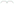

# Las curvas

Esta página contiene las secciones
[83.6](index.md#836-las-curvas-version-1-la-cicloide-y-sus-numeros),
[83.7](index.md#837-las-curvas-version-2-cualquier-curva-varios-formatos) y
[83.8](index.md#838-las-curvas-version-3-un-archivo-de-especificaciones)
del [capítulo 83](index.md): el generador de texto que dibuja curvas
paramétricas. Los ejemplos están en `cicloide.pl`, `curvas.pl` y
`curvas_programa.pl`, en `ejemplos/capitulo-83/`, con sus pruebas.

## Las curvas, versión 1: la cicloide y sus números

El problema está planteado en la
[sección 83.1](index.md#831-dos-herramientas-de-texto): un disco de radio
$r$ rueda sobre una recta, y un punto a distancia $a$ de su centro
describe una cicloide. `cicloide/4` es la fórmula, con el ángulo en
radianes; Csenki lo mide en grados y aproxima $\pi$ con 3.1415926, y
SWI-Prolog tiene la constante `pi`. `malla/4` divide un intervalo en
partes iguales, y `puntos_cicloide/5` calcula la curva en esa malla:

<!-- ejemplo: capitulo-83/cicloide.pl predicado: cicloide/4 malla/4 valor/5 puntos_cicloide/5 -->
```prolog
%!  cicloide(+R:number, +A:number, +Fi:number, -Punto:pair) is det.
%
%   Punto es X-Y, la posición del punto a distancia A del centro de un
%   disco de radio R que rodó hasta girar Fi radianes.
cicloide(R, A, Fi, X-Y) :-
    X is R * Fi - A * sin(Fi),
    Y is R - A * cos(Fi).

%!  malla(+Desde:number, +Hasta:number, +N:integer, -Valores:list) is det.
%
%   Valores son los N + 1 extremos de los N intervalos iguales en que se
%   divide el intervalo de Desde a Hasta: el primero es Desde, el último
%   es Hasta.
malla(Desde, Hasta, N, Valores) :-
    must_be(positive_integer, N),
    numlist(0, N, Is),
    maplist(valor(Desde, Hasta, N), Is, Valores).

%!  valor(+Desde:number, +Hasta:number, +N:integer, +I:integer,
%!        -V:number) is det.
%
%   V es el extremo I de la malla de N intervalos de Desde a Hasta.
valor(Desde, Hasta, N, I, V) :-
    V is Desde + (Hasta - Desde) * I / N.

%!  puntos_cicloide(+R:number, +A:number, +Vueltas:number, +N:integer,
%!                  -Puntos:list(pair)) is det.
%
%   Puntos son los N + 1 puntos de la cicloide de R y A en la malla de N
%   intervalos de las Vueltas vueltas del disco.
puntos_cicloide(R, A, Vueltas, N, Puntos) :-
    Hasta is 2 * pi * Vueltas,
    malla(0, Hasta, N, Angulos),
    maplist(cicloide(R, A), Angulos, Puntos).
```

```prolog
?- malla(0, 1, 4, Valores).
Valores = [0, 0.25, 0.5, 0.75, 1].

?- cicloide(5, 8, 0, P).
P = 0.0- -3.0.
```

Los extremos de la malla se calculan cada uno desde `Desde`, con
`Desde + (Hasta - Desde) * I / N`, y no sumando `N` veces el ancho de un
intervalo: así el último es exactamente `Hasta`, sin el error que se
acumularía en las sumas. La curva cerrada de un círculo, por ejemplo,
termina en el mismo punto en que empieza. Csenki construye la malla con
un acumulador desde el final; `numlist/3` y `maplist/3` dan lo mismo sin
recursión propia.

El texto se genera con una gramática, como el
[Patrón 20](../patrones.md#20-una-gramatica-para-analizar-y-generar) del
[capítulo 21](../capitulo-21-gramaticas-dcg/index.md) lo permite, usada
solo en el sentido de generar: los no terminales reciben los datos y
producen los códigos. El comando de LaTeX es `\drawline` del paquete
epic, que une los puntos que siguen, cada uno entre paréntesis:

<!-- ejemplo: capitulo-83/cicloide.pl predicado: comando/3 comando_drawline//2 pares//1 par//1 -->
```prolog
%!  comando(+Nombre:atom, +Puntos:list(pair), -Texto:string) is det.
%
%   Texto es la definición del comando de LaTeX \Nombre, que une Puntos
%   con \drawline.
comando(Nombre, Puntos, Texto) :-
    phrase(comando_drawline(Nombre, Puntos), Codigos),
    string_codes(Texto, Codigos).

%!  comando_drawline(+Nombre:atom, +Puntos:list(pair))// is det.
%
%   \newcommand{\Nombre}{\drawline(X1,Y1)(X2,Y2)...}.
comando_drawline(Nombre, Puntos) -->
    "\\newcommand{\\", atom(Nombre), "}{\\drawline",
    pares(Puntos),
    "}".

%!  pares(+Puntos:list(pair))// is det.
%
%   Los puntos, cada uno entre paréntesis, sin separador.
pares([]) -->
    [].
pares([P|Ps]) -->
    par(P),
    pares(Ps).

%!  par(+Punto:pair)// is det.
%
%   (X,Y), con cuatro decimales.
par(X-Y) -->
    "(", decimal(X), ",", decimal(Y), ")".
```

```prolog
?- definir_cicloide(curva, 5, 5, 1, 4, Texto).
Texto = "\\newcommand{\\curva}{\\drawline(0.0000,0.0000)(2.8540,5.0000)(15.7080,10.0000)(28.5619,5.0000)(31.4159,0.0000)}".
```

Cuatro segmentos dibujan una vuelta de la cicloide común de radio 5:
desde el origen, sube hasta la altura 10, el diámetro, y vuelve a la
recta a una distancia $2\pi r$. La respuesta muestra cada `\` doble,
porque el toplevel escribe la cadena entre comillas; el texto tiene una
sola.

**Los números.** Csenki arma el texto con `concat_atom/2`, que escribe
cada número como lo escribe `write/1`. Un número muy chico sale en
notación exponencial, y eso pasa con los valores que deberían ser cero y
no lo son por el redondeo, como el coseno de $\pi/2$:

```prolog
?- X is 1/800000.
X = 1.25e-6.
```

LaTeX no lee `1.25e-6` como un número, y el documento no compila. Csenki
corrige esos números a mano en el editor, y en un ejercicio los escribe
con `sformat/3`, hoy obsoleto. Aquí, `decimal//1` los escribe con
`format/3` y la directiva `~4f`, cuatro decimales fijos, sobre una lista
de códigos:

<!-- ejemplo: capitulo-83/cicloide.pl predicado: decimal//1 codigos//1 -->
```prolog
%!  decimal(+X:number)// is det.
%
%   X con cuatro decimales fijos, sin notación exponencial. X se redondea
%   antes de escribirlo, para que un número negativo muy chico se escriba
%   0.0000 y no -0.0000.
decimal(X) -->
    { Redondeado is round(X * 10000) / 10000,
      format(codes(Codigos), "~4f", [Redondeado])
    },
    codigos(Codigos).

%!  codigos(+Codigos:list(integer))// is det.
%
%   Los códigos de la lista Codigos, en orden.
codigos([]) -->
    [].
codigos([C|Cs]) -->
    [C],
    codigos(Cs).
```

```prolog
?- format("~w ~4f~n", [1.25e-6, 1.25e-6]).
1.25e-6 0.0000
true.

?- format("~4f~n", [-0.00001]).
-0.0000
true.
```

La segunda consulta muestra por qué hace falta el redondeo antes de
escribir: un valor negativo muy chico, como el seno de $2\pi$ calculado,
saldría `-0.0000`. LaTeX lo acepta, pero las pruebas que comparan texto
fallarían según el signo de un error de redondeo. Redondeado a cuatro
decimales, el valor es el entero 0, y se escribe `0.0000`.

`codigos//1` agrega una lista de códigos al texto. Una variable en el
cuerpo de una regla, en lugar de `codigos(Codigos)`, haría lo mismo,
porque la traducción de la gramática la convierte en una llamada a
`phrase/3`; pero el sandbox de SWISH no acepta llamar a una meta que no
conoce antes de ejecutar, y con `codigos//1` el archivo se ejecuta en
SWISH.

!!! question "Actividad"
    Calcular `definir_cicloide(c, 5, 8, 1, N, T)` con `N` igual a 4, 8 y
    100, pegar cada definición en un documento de LaTeX con
    `\usepackage{epic}`, y usarla dentro de un entorno `picture`. Predecir
    antes con cuántos segmentos se ve el lazo de la cicloide alargada.

## Las curvas, versión 2: cualquier curva, varios formatos

Csenki generaliza el programa a cualquier curva pasando el nombre del
predicado que la calcula y la lista de sus parámetros, y llamándolo con
`apply/2`, que SWI-Prolog conserva solo por compatibilidad. La versión 2
representa cada curva con un término que dice su clase y sus
parámetros, y `punto/3` tiene una cláusula por clase:

<!-- ejemplo: capitulo-83/curvas.pl predicado: punto/3 curva/1 -->
```prolog
%!  punto(+Curva, +T:number, -Punto:pair) is det.
%
%   Punto es X-Y, el punto de Curva para el valor T de su parámetro. T
%   puede ser una expresión aritmética, como pi/2.
punto(cicloide(R, A), T, X-Y) :-
    X is R * T - A * sin(T),
    Y is R - A * cos(T).
punto(circulo(Cx, Cy, R), T, X-Y) :-
    X is Cx + R * cos(T),
    Y is Cy + R * sin(T).
punto(espiral(K), T, X-Y) :-
    X is exp(K * T) * cos(T),
    Y is exp(K * T) * sin(T).

%!  curva(+Curva) is semidet.
%
%   Curva es una curva que punto/3 conoce, con parámetros numéricos.
curva(Curva) :-
    compound(Curva),
    Curva =.. [_|Parametros],
    maplist(number, Parametros),
    clause(punto(Curva, _, _), _),
    !.
```

```prolog
?- punto(circulo(2, 3, 10), 0, P).
P = 12.0-3.0.

?- curva(espiral(0.1)).
true.

?- curva(circulo(0, 0, r)).
false.
```

La espiral logarítmica es la de Csenki: el radio crece como $e^{kt}$, y
$k = \cot\alpha$, con $\alpha$ el ángulo constante con que la curva
corta cada recta que sale del origen; los 85° de su ejemplo dan
$k \approx 0{,}0875$. `curva/1` decide si un término es una curva que
`punto/3` sabe calcular sin calcular ningún punto: examina con
`clause/2` si hay una cláusula cuya cabeza unifica, después de verificar
que todos los parámetros son números. `punto/3` está declarado
`multifile`, así que otro archivo agrega una clase con una cláusula
`curvas:punto(…)`, como en el
[Patrón 79](../patrones.md#79-clausulas-para-un-modulo-cargado), y
`curva/1` la reconoce sin cambios.

Los formatos son tres, cada uno una regla de `definicion//3`: epic, con
el `\drawline` de la versión 1; TikZ, el paquete de dibujo más usado hoy
en LaTeX, con `\draw` y los puntos unidos por `--`; y SVG, el formato de
dibujo de la web, con una polilínea:

<!-- ejemplo: capitulo-83/curvas.pl predicado: definicion//3 tikz_resto//1 svg_pares//1 -->
```prolog
%!  definicion(+Formato, +Nombre:atom, +Puntos:list(pair))// is det.
%
%   La definición de una curva. En epic y en tikz, un comando de LaTeX
%   \Nombre; en svg, una polilínea con el identificador Nombre, con Y hacia
%   arriba, como en las otras dos.
definicion(epic, Nombre, Puntos) -->
    comando_drawline(Nombre, Puntos).
definicion(tikz, Nombre, [P|Ps]) -->
    "\\newcommand{\\", atom(Nombre), "}{\\draw ",
    tikz_par(P),
    tikz_resto(Ps),
    ";}".
definicion(svg, Nombre, Puntos) -->
    "<polyline id=\"", atom(Nombre), "\" points=\"",
    svg_pares(Puntos),
    "\"/>".

%!  tikz_resto(+Puntos:list(pair))// is det.
%
%   Cada punto precedido por --, el segmento desde el anterior.
tikz_resto([]) -->
    [].
tikz_resto([P|Ps]) -->
    " -- ",
    tikz_par(P),
    tikz_resto(Ps).

%!  svg_pares(+Puntos:list(pair))// is det.
%
%   X,-Y para cada punto, separados por un espacio: en SVG el eje Y
%   apunta hacia abajo.
svg_pares([]) -->
    [].
svg_pares([X-Y|Ps]) -->
    { Abajo is -Y },
    decimal(X), ",", decimal(Abajo),
    (   { Ps == [] }
    ->  []
    ;   " ",
        svg_pares(Ps)
    ).
```

```prolog
?- definir(tikz, c, circulo(0, 0, 1), 0, 2*pi, 4, T).
T = "\\newcommand{\\c}{\\draw (1.0000,0.0000) -- (0.0000,1.0000) -- (-1.0000,0.0000) -- (0.0000,-1.0000) -- (1.0000,0.0000);}".

?- definir(svg, c, circulo(0, 0, 1), 0, 2*pi, 4, T).
T = "<polyline id=\"c\" points=\"1.0000,0.0000 0.0000,-1.0000 -1.0000,0.0000 0.0000,1.0000 1.0000,0.0000\"/>".
```

Un círculo con cuatro segmentos es un cuadrado apoyado en un vértice. En
SVG el eje Y apunta hacia abajo, y `svg_pares//1` cambia el signo de
cada Y para que el dibujo no salga invertido. `definir/7` calcula los
puntos con `muestra/5` y escribe la definición con `definicion/4`, y los
dos predicados no se conocen: los puntos no saben nada del formato, y el
formato no sabe nada de la curva. Agregar un formato es agregar una regla
a `definicion//3`, y agregar una curva, una cláusula a `punto/3`.

Un archivo completo es más que una lista de definiciones: `documento/3`
recibe una lista de partes, `comentario(Texto)` o
`curva(Nombre, Puntos)`, y escribe un archivo de LaTeX, con una línea por
parte y los comentarios con `%` delante, o un dibujo SVG completo. El
dibujo necesita su tamaño: `caja/2` calcula el rectángulo que contiene
todos los puntos, con un margen, y el grosor de las líneas es una
fracción de su lado mayor, porque el dibujo está en las unidades de las
curvas. Cada curva lleva un color de una lista de cuatro.

## Las curvas, versión 3: un archivo de especificaciones

Para dibujar varias curvas, Csenki escribe un archivo con una llamada a
su predicado generador por línea, y comentarios que pasan a la salida:
como empiezan con `%`, en el archivo de LaTeX son comentarios. Su
programa lee cada línea, la convierte en un término con `term_to_atom/2`
y la ejecuta con `apply/2`. Ejecutar lo que se lee hace que el archivo
pueda hacer cualquier cosa que haga un programa:
`archivos/peligro.curvas` tiene una especificación válida y, en la
línea 3, la meta `delete_file('examen.tex')`, que ese diseño ejecutaría.

`curvas_programa.pl` lee el archivo con `read_term/3`, que entrega cada
término como dato, junto con los comentarios que lo preceden y la línea
en que empieza. El archivo de las tres cicloides es este:

```prolog
% Las tres clases de cicloide: un disco de radio 1 rueda dos vueltas.
% Cicloide común: el punto está en el borde del disco.
curva(comun, cicloide(1, 1), 0, 4*pi, 120).
% Cicloide acortada: el punto está dentro del disco.
curva(acortada, cicloide(1, 0.5), 0, 4*pi, 120).
% Cicloide alargada: el punto está fuera del disco.
curva(alargada, cicloide(1, 1.6), 0, 4*pi, 120).
```

Cada término tiene que ser `curva(Nombre, Curva, Desde, Hasta, N)`, y se
verifica antes de calcular nada:

<!-- ejemplo: capitulo-83/curvas_programa.pl predicado: especificacion/3 verificar/2 valida/1 -->
```prolog
%!  especificacion(+Termino, +Linea:integer, -Parte) is det.
%
%   Parte es curva(Nombre, Puntos), la curva que especifica Termino, leído
%   en la línea Linea: curva(Nombre, Curva, Desde, Hasta, N). Lanza
%   error(especificacion(Linea, Problema), _) si Termino no es una
%   especificación válida: el nombre tiene que ser un átomo de letras, como
%   los de los comandos de LaTeX; la curva, una que curva/1 acepte; Desde y
%   Hasta, expresiones aritméticas sin variables; N, un entero positivo.
especificacion(Termino, Linea, curva(Nombre, Puntos)) :-
    (   Termino = curva(Nombre, Curva, Desde, Hasta, N)
    ->  true
    ;   throw(error(especificacion(Linea, termino(Termino)), _))
    ),
    verificar(Linea, nombre(Nombre)),
    verificar(Linea, curva(Curva)),
    verificar(Linea, extremo(Desde)),
    verificar(Linea, extremo(Hasta)),
    verificar(Linea, intervalos(N)),
    muestra(Curva, Desde, Hasta, N, Puntos).

%!  verificar(+Linea:integer, +Condicion) is det.
%
%   Condicion se cumple; si no, lanza
%   error(especificacion(Linea, Condicion), _).
verificar(Linea, Condicion) :-
    (   valida(Condicion)
    ->  true
    ;   throw(error(especificacion(Linea, Condicion), _))
    ).

%!  valida(+Condicion) is semidet.
%
%   Condicion se cumple: nombre(Nombre), curva(Curva), extremo(Expresion)
%   o intervalos(N).
valida(nombre(Nombre)) :-
    atom(Nombre),
    atom_codes(Nombre, Codigos),
    Codigos \== [],
    forall(member(C, Codigos), letra(C)).
valida(curva(Curva)) :-
    curva(Curva).
valida(extremo(Expresion)) :-
    ground(Expresion),
    catch(_ is Expresion, error(_, _), fail).
valida(intervalos(N)) :-
    integer(N),
    N > 0.
```

El nombre tiene que ser de letras sin acento porque es el nombre de un
comando de LaTeX, y LaTeX no acepta dígitos en ellos: `\c1` es el comando
`\c` seguido de un 1. Lo que el programa no verifica es que el nombre no
exista ya en LaTeX: `\newcommand` rechaza `\c`, que es el comando de la
cedilla, y los ejemplos de la versión 2 lo usan solo para mostrar el
texto. Los extremos son expresiones aritméticas sin variables, como
`4*pi`; evaluarlas con `is/2` solo calcula, así que es
seguro. La meta de `peligro.curvas` no es un término `curva/5`, y es un
error con su línea:

```prolog
?- catch(especificacion(delete_file('examen.tex'), 3, _), error(E, _), true).
E = especificacion(3, termino(delete_file('examen.tex'))).
```

`leer_partes/3` recorre el archivo, junta los comentarios y las curvas en
el orden en que aparecen, y rechaza un nombre repetido, que LaTeX
también rechazaría al definir el mismo comando dos veces:

<!-- ejemplo: capitulo-83/curvas_programa.pl predicado: leer_partes/3 comentarios/3 comentario/2 -->
```prolog
%!  leer_partes(+In, +Vistos:list(atom), -Partes:list) is det.
%
%   Partes son los comentarios y las curvas que quedan en In. Vistos son
%   los nombres de las curvas ya leídas; un nombre repetido es un error.
leer_partes(In, Vistos, Partes) :-
    read_term(In, Termino, [comments(Comentarios), term_position(Posicion)]),
    stream_position_data(line_count, Posicion, Linea),
    comentarios(Comentarios, Partes, Resto),
    (   Termino == end_of_file
    ->  Resto = []
    ;   especificacion(Termino, Linea, Parte),
        Parte = curva(Nombre, _),
        (   memberchk(Nombre, Vistos)
        ->  throw(error(especificacion(Linea, nombre_repetido(Nombre)), _))
        ;   true
        ),
        Resto = [Parte|Resto1],
        leer_partes(In, [Nombre|Vistos], Resto1)
    ).

%!  comentarios(+Comentarios:list, -Partes:list, ?Resto:list) is det.
%
%   Partes es la lista de los comentarios de línea de Comentarios, pares
%   Posicion-Cadena de read_term/3, seguida de Resto: un
%   comentario(Texto) por línea, sin el % ni los blancos del principio.
%   read_term/3 junta en una cadena las líneas de comentario seguidas. Los
%   comentarios de bloque no se copian.
comentarios([], Resto, Resto).
comentarios([_-Cadena|Cs], Partes, Resto) :-
    (   string_concat("%", _, Cadena)
    ->  split_string(Cadena, "\n", "\r", Lineas),
        maplist(comentario, Lineas, Propias),
        append(Propias, Partes1, Partes)
    ;   Partes = Partes1
    ),
    comentarios(Cs, Partes1, Resto).

%!  comentario(+Linea:string, -Parte) is det.
%
%   Parte es comentario(Texto), con Texto la línea de comentario Linea sin
%   el % ni los blancos del principio.
comentario(Linea, comentario(Texto)) :-
    split_string(Linea, "", "% ", [Texto]).
```

`read_term/3` devuelve los comentarios como pares de una posición y una
cadena, y junta en una sola cadena las líneas de comentario seguidas:
`comentarios/3` las separa, para que cada una sea una parte. El programa
calcula el texto completo antes de abrir el archivo de salida, así que un
error en la última especificación no deja un archivo a medio escribir.
El formato sale de la opción `-t` o, sin ella, del nombre de la salida:

```text
$ swipl curvas_programa.pl archivos/cicloides.curvas cicloides.svg
$ swipl curvas_programa.pl -t epic archivos/cicloides.curvas cicloides.tex
$ swipl curvas_programa.pl archivos/peligro.curvas peligro.tex
ERROR: línea 3: delete_file('examen.tex') no es curva(Nombre, Curva, Desde, Hasta, N)
```

El primer comando escribe este dibujo, que se incluye aquí tal como sale
del programa:



Las tres cicloides de `archivos/cicloides.curvas`: común (azul), acortada
(roja) y alargada (verde). Dibujo generado por `curvas_programa.pl`; una
prueba de `curvas_programa.plt` verifica que el archivo es la salida del
programa.

!!! example "Patrón 91 — Especificación como dato"
    **Problema.** Un programa recibe sus instrucciones en un archivo
    escrito con la sintaxis de Prolog, como las curvas que tiene que
    dibujar. Si los términos se ejecutan, el archivo puede hacer todo lo
    que hace un programa, y un término equivocado produce un error que no
    dice en qué línea está.

    **Versión ingenua.** El programa de Csenki: cada línea se convierte en
    término con `term_to_atom/2` y se ejecuta con `apply/2`. Con
    `archivos/peligro.curvas`, ese diseño ejecuta la meta
    `delete_file('examen.tex')` de la línea 3.

    **Patrón.** Leer cada término con `read_term/3`, que lo entrega como
    dato junto con la línea en que empieza; unificarlo con las formas que
    el lenguaje acepta, aquí solo
    `curva(Nombre, Curva, Desde, Hasta, N)`; y verificar cada campo con
    una condición con nombre, como hace `especificacion/3` con
    `verificar/2`. Una forma desconocida o una condición que no se cumple
    lanzan `error(especificacion(Linea, Problema), _)`, y el programa
    informa la línea y lo que falló. El término nunca se llama: los
    extremos se evalúan con `is/2` solo si son cerrados, y `curva/1`
    examina las cláusulas de `punto/3` con `clause/2`, sin ejecutarlas.
    Es el [Patrón 31](../patrones.md#31-validar-al-entrar) en el borde
    del programa, con las condiciones del lenguaje de especificación en
    lugar de los tipos de un argumento, y una forma del
    [Patrón 37](../patrones.md#37-convertir-en-el-borde) en la que el
    formato ajeno ya son términos: la tentación es ejecutarlos en lugar
    de convertirlos en partes limpias, `curva(Nombre, Puntos)` y
    `comentario(Texto)`.

    **Cuándo no usarlo.** Cuando el archivo es parte del programa, escrito
    por quien lo escribe y cargado como código: verificarlo como dato
    repite el trabajo del compilador. Cuando las especificaciones
    necesitan reglas o variables compartidas, las formas aceptadas crecen
    hasta ser un lenguaje con su propio intérprete. Y la verificación de
    la forma no acota el costo de lo que se calcula después: un extremo
    `2**(10**9)` es una expresión cerrada y válida, y el desborde de
    punto flotante aparece en `muestra/5`, sin número de línea.

!!! question "Actividad"
    Copiar `archivos/cicloides.curvas` con otro nombre y agregarle una
    línea con `curva(circulo, circulo(0, 0, 1), 0, 2*pi, 36).`; en otra
    copia, una con `curva(Circulo, circulo(0, 0, 1), 0, 2*pi, 36).`.
    Predecir qué escribe el programa con cada copia, y comprobarlo.
