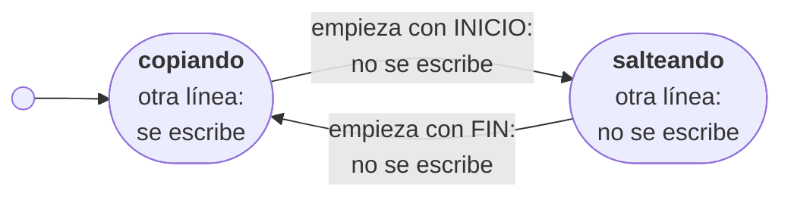

# Capítulo 83 — Proyecto: procesamiento de textos

Los programas de la terminal que trabajan con texto, como `grep`, `sort`
o `sed`, tienen una forma común: leen un texto, de un archivo o de la
entrada estándar, lo transforman y escriben el resultado, que puede ir a
un archivo o a otro programa. Este capítulo escribe dos herramientas de
esa clase en Prolog. La primera es un **filtro de marcas**: quita de un
texto las secciones encerradas entre dos líneas de marca, como las
soluciones de un examen escrito en LaTeX, para obtener la versión que
reciben los alumnos:

```text
$ swipl cribar_programa.pl -i '\solstart' -f '\solend' examen_soluciones.tex examen.tex
```

La segunda **genera texto**: calcula los puntos de una curva paramétrica,
como la cicloide que describe un punto de una rueda, y escribe el comando
de LaTeX, o el dibujo SVG, que la traza con segmentos. En las dos, el
núcleo es una relación pura, que se prueba sin archivos; la lectura, la
escritura y los argumentos quedan en el borde, como en los
[capítulos 27](../capitulo-27-archivos-streams-y-formatos/index.md) y
[28](../capitulo-28-programas-de-linea-de-comandos/index.md).

Los dos problemas vienen del capítulo «Text Processing» de *Applications
of Prolog* de Attila Csenki, que los usa para preparar sus exámenes y las
figuras de su libro. El capítulo los reescribe con los predicados actuales
de SWI-Prolog, y corrige tres cosas del original: el estado del filtro deja
la base de datos y pasa a un argumento, una marca mal puesta deja de
perder texto sin aviso, y el archivo que describe las curvas se lee como
datos en lugar de ejecutarse. La lista completa de las fuentes, con lo que
se toma de cada una, está en las [Referencias](#referencias).

El capítulo cumple el anuncio del
[capítulo 56](../capitulo-56-proyecto-ordenes-castellano/index.md):
herramientas de texto al estilo de los programas de la terminal. Usa las
gramáticas del [capítulo 21](../capitulo-21-gramaticas-dcg/index.md) para
generar texto, el [Patrón 36](../patrones.md#36-leer-procesar-escribir)
para leer y escribir archivos y el
[Patrón 38](../patrones.md#38-programa-de-linea-de-comandos) para los
programas. Los programas y los módulos que cargan otros son
`% solo-local`; los núcleos del filtro y de la cicloide se ejecutan en
SWISH.

## Objetivos del capítulo

Al terminar el capítulo, el lector puede:

- escribir un filtro de texto como un autómata: una relación que, para
  cada estado y cada línea, da el estado siguiente y lo que se escribe;
- llevar el estado de un recorrido en un argumento en lugar de la base de
  datos, y usar el mismo paso sobre una lista y sobre un stream;
- convertir en errores, con el número de línea, los datos mal formados
  que un filtro ingenuo procesa sin aviso;
- escribir un programa de línea de comandos que funciona como filtro en
  una tubería y no deja archivos a medio escribir;
- generar texto con una gramática, y escribir números en un formato que
  otro programa acepta;
- separar el cálculo de los datos del formato en que se escriben, y leer
  un archivo de especificaciones como datos verificados, sin ejecutarlo.

!!! info "Tiempo estimado"
    Leer el capítulo, ejecutar sus ejemplos y hacer las actividades: **1:05 h**.
    Resolver los 5 ejercicios marcados con ★: **1:05 h**.
    Resolver los 10 ejercicios del final: **2:40 h**.

## 83.1 Dos herramientas de texto

**El filtro.** Un examen se escribe una sola vez, con la solución de cada
pregunta debajo del enunciado, entre dos líneas de marca. El archivo
`examen_soluciones.tex`, en `ejemplos/capitulo-83/archivos/`, tiene dos
preguntas:

```latex
\begin{enumerate}
\item Escribir \texttt{abuelo/2} a partir de \texttt{padre/2}.
\solstart
\begin{verbatim}
abuelo(A, N) :- padre(A, P), padre(P, N).
\end{verbatim}
\solend
\item ¿Cuántas respuestas tiene \texttt{member(X, [a, b, a])}?
\solstart
Tres: \texttt{X = a}, \texttt{X = b} y otra vez \texttt{X = a}.
\solend
\end{enumerate}
```

Compilado así, el examen muestra cada solución; es la versión para quien
corrige. La versión para los alumnos es el mismo archivo sin las líneas
que van desde cada `\solstart` hasta el `\solend` siguiente, las marcas
incluidas. Una marca cuenta solo **al principio de la línea**: las líneas
del encabezado que definen los dos comandos,
`\newcommand{\solstart}{…}`, no abren ninguna sección.

El resultado de cada línea depende de las anteriores: la misma línea se
copia o se quita según haya o no una sección abierta. El filtro es un
autómata de dos estados; dentro de cada uno está lo que ocurre con una
línea que no es una marca:



Dos situaciones quedan fuera del dibujo, y son las que hacen falta para
que el filtro sea confiable: una marca de fin con el autómata copiando, y
el final del texto con el autómata salteando. La primera es un `\solstart`
olvidado, que dejaría la solución en el examen de los alumnos; la
segunda, un `\solend` olvidado, que borraría el resto del examen. El
programa de Csenki no distingue ninguna de las dos.

**El generador.** Para dibujar una curva en un documento de LaTeX sin un
programa de dibujo, se calculan puntos de la curva, suficientemente
cercanos, y se los une con segmentos. El ejemplo es la **cicloide**: la
curva que describe un punto fijo a un disco que rueda sobre una recta.
Si el punto está en el borde del disco, la cicloide es común; si está
dentro, acortada; si está fuera, alargada, y entonces forma lazos:


Las tres clases de cicloide, con el disco que rueda sobre la recta y el
punto que describe la curva. Imagen: Kmhkmh,
[CC BY 4.0](https://creativecommons.org/licenses/by/4.0), vía
[Wikimedia Commons](https://commons.wikimedia.org/wiki/File:Tipos_de_cicloide.svg).

Con un disco de radio $r$ que giró un ángulo $\varphi$, en radianes, el
punto a distancia $a$ del centro está en

$$x = r\varphi - a\sin\varphi, \qquad y = r - a\cos\varphi.$$

El programa recibe $r$, $a$, las vueltas del disco y la cantidad de
segmentos, y escribe un comando de LaTeX que traza la curva:
`\newcommand{\curva}{\drawline(0.0000,0.0000)(2.8540,5.0000)…}`. Los
números tienen que estar escritos como LaTeX los lee, y Prolog no siempre
los escribe así. La [página de las curvas](curvas.md) desarrolla el
generador; las secciones [83.6](#836-las-curvas-version-1-la-cicloide-y-sus-numeros)
a [83.8](#838-las-curvas-version-3-un-archivo-de-especificaciones) lo
resumen.

## 83.2 El programa terminado

| Versión | Archivo | Agrega | Lo que no puede hacer todavía |
|---|---|---|---|
| Filtro 1 | `cribar.pl` | el autómata como relación `paso/6`, sobre una lista de líneas | avisar de una marca mal puesta |
| Filtro 2 | `cribar_seguro.pl` | las líneas numeradas y tres errores con su línea | leer de un archivo o de la terminal |
| Filtro 3 | `cribar_programa.pl` | el mismo paso sobre un stream; el programa de línea de comandos | — |
| Curvas 1 | `cicloide.pl` | la cicloide, la malla y `\drawline` generado con una gramática | dibujar otras curvas, en otros formatos |
| Curvas 2 | `curvas.pl` | `punto/3` con una cláusula por clase de curva; los formatos epic, TikZ y SVG | describir varias curvas en un archivo |
| Curvas 3 | `curvas_programa.pl` | el archivo de especificaciones, leído como datos y verificado | — |

`cribar_programa.pl` carga `cribar_seguro.pl`, y `curvas.pl` carga
`cicloide.pl`: cada versión usa la anterior sin copiarla. La figura de las
cicloides de la [sección 83.8](curvas.md#las-curvas-version-3-un-archivo-de-especificaciones)
es la salida de `curvas_programa.pl`, y una prueba verifica que el
archivo de la figura es lo que el programa escribe.

## 83.3 El filtro, versión 1: el estado como argumento

En el programa de Csenki, el estado del autómata está en la base de
datos: un hecho dinámico `switch(on)` o `switch(off)`, que se cambia con
`retractall/1` y `assert/1` al leer una marca. Cada línea se lee del
archivo de entrada actual, con `get_char/1`, y se escribe en el de salida
actual. El filtro no puede probarse sin crear archivos, y su resultado
depende de un hecho que quedó de la ejecución anterior.

La versión 1 lleva el estado en un argumento. Un texto es una lista de
líneas, cadenas sin el salto de línea final, y `paso/6` es la tabla del
autómata: dado el estado y la línea, da el estado siguiente y la lista de
lo que se escribe, vacía o con la línea:

<!-- ejemplo: capitulo-83/cribar.pl predicado: paso/6 empieza/2 -->
```prolog
%!  paso(+Estado, +Linea:string, +Inicio:string, +Fin:string,
%!       -Estado1, -Salida:list(string)) is det.
%
%   Leída Linea en Estado, el recorrido pasa a Estado1 y escribe Salida:
%   la lista con Linea, o la lista vacía. Los estados son copiando y
%   salteando.
paso(copiando, Linea, Inicio, _, Estado1, Salida) :-
    (   empieza(Linea, Inicio)
    ->  Estado1 = salteando,
        Salida = []
    ;   Estado1 = copiando,
        Salida = [Linea]
    ).
paso(salteando, Linea, _, Fin, Estado1, []) :-
    (   empieza(Linea, Fin)
    ->  Estado1 = copiando
    ;   Estado1 = salteando
    ).

%!  empieza(+Linea:string, +Marca:string) is semidet.
%
%   Linea empieza con Marca.
empieza(Linea, Marca) :-
    string_concat(Marca, _, Linea).
```

`empieza/2` usa `string_concat/3` con el primer y el tercer argumento
instanciados: la consulta tiene una sola respuesta posible, sin
alternativas pendientes. `cribar/4` recorre la lista desde el estado
`copiando` y junta lo que cada paso escribe:

<!-- ejemplo: capitulo-83/cribar.pl predicado: cribar/4 cribar/5 -->
```prolog
%!  cribar(+Lineas:list(string), +Inicio:string, +Fin:string,
%!         -Quedan:list(string)) is det.
%
%   Quedan son las líneas de Lineas que no están entre una línea que
%   empieza con Inicio y la siguiente que empieza con Fin; las dos líneas
%   de las marcas también se quitan.
cribar(Lineas, Inicio, Fin, Quedan) :-
    cribar(Lineas, copiando, Inicio, Fin, Quedan).

%!  cribar(+Lineas:list(string), +Estado, +Inicio:string, +Fin:string,
%!         -Quedan:list(string)) is det.
%
%   Como cribar/4, con el recorrido en Estado al llegar a la primera línea.
cribar([], _, _, _, []).
cribar([Linea|Lineas], Estado, Inicio, Fin, Quedan) :-
    paso(Estado, Linea, Inicio, Fin, Estado1, Salida),
    append(Salida, Resto, Quedan),
    cribar(Lineas, Estado1, Inicio, Fin, Resto).
```

```prolog
?- cribar(["a", "INICIO", "b", "FIN", "c"], "INICIO", "FIN", Quedan).
Quedan = ["a", "c"].

?- paso(copiando, "INICIO x", "INICIO", "FIN", Estado, Salida).
Estado = salteando,
Salida = [].
```

`append(Salida, Resto, Quedan)` agrega cero o una línea delante del
resto: con `Salida` instanciada, `append/3` tiene una sola respuesta. El
recorrido es determinista, y cada paso puede probarse aislado, con una
consulta como la segunda.

!!! example "Patrón 90 — El autómata como relación de paso"
    **Problema.** Un programa procesa una secuencia de líneas, y lo que
    hace con cada una depende de las anteriores. Si el estado, la lectura
    y la escritura quedan en el mismo predicado, el programa no se prueba
    sin archivos, y su resultado depende de lo que dejó la ejecución
    anterior.

    **Versión ingenua.** El programa de Csenki: el estado es un hecho
    dinámico `switch/1`, que se cambia con `retractall/1` y `assert/1`,
    cada línea se lee con `get_char/1` del archivo de entrada actual y se
    escribe en el de salida actual.

    **Patrón.** El autómata es una relación pura
    `paso(Estado, Entrada, Estado1, Salida)`, `det`, que da el estado
    siguiente y lo que se escribe como una lista, vacía o con la línea, en
    lugar de escribirlo: `paso/6`, y `paso/7` con el número de línea. Un
    recorrido aparte lo aplica a la fuente de las líneas: `cribar/5` a una
    lista, en las pruebas, y `cribar_stream/6`, en la
    [sección 83.5](#835-el-filtro-version-3-un-programa-para-la-terminal),
    a un stream, con el mismo `paso/7`. Cada transición se prueba con una
    consulta. La [sección 46.2](../capitulo-46-proyecto-metodos-numericos/index.md#462-la-ecuacion-como-termino-y-el-ciclo-de-iteracion)
    separa el ciclo del paso al revés: `iterar/4` queda fijo y el paso
    cambia con el método; aquí el paso queda fijo y el recorrido cambia
    con la fuente. Del
    [Patrón 63](../patrones.md#63-estado-como-resultado-no-como-falla)
    toma que el paso es `det` y devuelve el estado como resultado; agrega
    que la salida también es un resultado, de modo que el paso no hace
    entrada ni salida.

    **Cuándo no usarlo.** Cuando lo que se hace con una línea no depende
    de las anteriores: no hay estado, y basta con `include/3` o
    `maplist/3` sobre las líneas. Y cuando la decisión sobre una línea
    depende de las que siguen, como un bloque cuyo sentido se conoce al
    cerrarlo: un paso que consume una sola entrada tendría que guardar
    las líneas pendientes en el estado, y una gramática del
    [capítulo 21](../capitulo-21-gramaticas-dcg/index.md) sobre el texto
    completo lo expresa de modo más directo.

Las pruebas de `cribar.pl` registran también lo que la versión 1 hace mal.
Una marca de inicio sin su fin quita todo lo que sigue, y una marca de
fin sin inicio se copia como cualquier otra línea:

```prolog
?- cribar(["a", "INICIO", "b", "c"], "INICIO", "FIN", Quedan).
Quedan = ["a"].

?- cribar(["a", "FIN", "b"], "INICIO", "FIN", Quedan).
Quedan = ["a", "FIN", "b"].
```

En un examen, la primera consulta es un `\solend` olvidado: las
preguntas que siguen desaparecen de la versión de los alumnos. La segunda
es un `\solstart` olvidado: la solución queda impresa, junto con la marca.
En ninguno de los dos casos el filtro avisa.

!!! question "Actividad"
    Predecir el resultado de
    `cribar(["a", "INICIO", "INICIO", "b", "FIN", "c"], "INICIO", "FIN", Q)`:
    una marca de inicio dentro de una sección abierta. Comprobarlo, y
    explicar con `paso/6` por qué la segunda marca no cambia nada.

## 83.4 El filtro, versión 2: marcas que no cierran

Para avisar dónde está el problema, el filtro tiene que saber en qué
línea está, y el estado `salteando` tiene que recordar en qué línea se
abrió la sección. `cribar_seguro.pl` es un módulo con la misma
interfaz, `cribar/4`, y un paso con el número de línea:

<!-- ejemplo: capitulo-83/cribar_seguro.pl predicado: paso/7 final/1 -->
```prolog
%!  paso(+Estado, +N:integer, +Linea:string, +Inicio:string, +Fin:string,
%!       -Estado1, -Salida:list(string)) is det.
%
%   Leída la línea N, Linea, en Estado, el recorrido pasa a Estado1 y
%   escribe Salida, la lista con Linea o la lista vacía. Los estados son
%   copiando y salteando(N0), con N0 la línea de la marca de inicio. Lanza
%   error(marcas(fin_sin_inicio(N)), _) con una marca de fin fuera de una
%   sección, y error(marcas(inicio_anidado(N, N0)), _) con una marca de
%   inicio dentro de la sección abierta en la línea N0. Si las dos marcas
%   son iguales, dentro de una sección la línea se toma como fin.
paso(copiando, N, Linea, Inicio, Fin, Estado1, Salida) :-
    (   empieza(Linea, Inicio)
    ->  Estado1 = salteando(N),
        Salida = []
    ;   empieza(Linea, Fin)
    ->  throw(error(marcas(fin_sin_inicio(N)), _))
    ;   Estado1 = copiando,
        Salida = [Linea]
    ).
paso(salteando(N0), N, Linea, Inicio, Fin, Estado1, []) :-
    (   empieza(Linea, Fin)
    ->  Estado1 = copiando
    ;   empieza(Linea, Inicio)
    ->  throw(error(marcas(inicio_anidado(N, N0)), _))
    ;   Estado1 = salteando(N0)
    ).

%!  final(+Estado) is det.
%
%   El texto puede terminar en Estado. Lanza
%   error(marcas(inicio_sin_fin(N0)), _) si termina dentro de la sección
%   abierta en la línea N0.
final(copiando).
final(salteando(N0)) :-
    throw(error(marcas(inicio_sin_fin(N0)), _)).
```

Los dos casos que el diagrama de la [sección 83.1](#831-dos-herramientas-de-texto)
dejaba fuera son ahora errores, y hay un tercero: una marca de inicio
dentro de una sección abierta, que en un examen es casi siempre el
`\solend` de la sección anterior que falta. Si las dos marcas son
iguales, dentro de una sección la línea se toma como fin, porque esa
pregunta va primero: una sola marca, como `%%`, abre y cierra secciones
alternadamente. El recorrido es el de la versión 1 con un contador, y al
terminar la lista llama a `final/1`:

```prolog
?- catch(cribar(["a", "INICIO", "b"], "INICIO", "FIN", Q), error(E, _), true).
E = marcas(inicio_sin_fin(2)).

?- cribar(["a", "%%", "b", "%%", "c"], "%%", "%%", Quedan).
Quedan = ["a", "c"].
```

El error es `error(marcas(Problema), _)`, con la forma de los errores de
SWI-Prolog que el [capítulo 25](../capitulo-25-errores-y-excepciones/index.md)
presentó, y el módulo define su texto con `prolog:message//1`. Así, quien
lo use desde un programa solo tiene que capturarlo y escribirlo con
`print_message/2`:

```text
ERROR: línea 7: marca de inicio dentro de la sección abierta en la línea 4
```

Es el error de `examen_roto.tex`, un examen al que le falta el `\solend`
de la primera solución: sin el aviso, la pregunta 2, en la línea 6,
habría desaparecido del examen de los alumnos.

## 83.5 El filtro, versión 3: un programa para la terminal

Csenki usa el filtro desde la terminal con un script de shell, que
escribe los cuatro argumentos en un archivo temporal y ejecuta SWI-Prolog
con una meta que lee ese archivo. Con `library(main)`, del
[capítulo 28](../capitulo-28-programas-de-linea-de-comandos/index.md), el
archivo temporal no hace falta: `argv_options/3` lee las marcas como
opciones de tipo `string`, y los archivos como argumentos posicionales.
`cribar_programa.pl` sigue el
[Patrón 38](../patrones.md#38-programa-de-linea-de-comandos); su ayuda
resume cómo se usa, y su primera línea nombra el ejecutable de
SWI-Prolog de la máquina:

```text
$ swipl cribar_programa.pl --help
Usage:  C:\Program Files\swipl\bin\swipl.exe cribar_programa.pl -i INICIO -f FIN [entrada [salida]]

Options:
-h, -?, --help             Show this help message and exit
-i STRING, --inicio=STRING Texto con el que empieza la línea que abre una
                           sección
-f STRING, --fin=STRING    Texto con el que empieza la línea que la cierra
```

Sin archivos, el programa lee la entrada estándar y escribe en la salida
estándar, como un filtro de la terminal; con un archivo, lo lee; con dos,
escribe el segundo. Las tres formas usan el mismo recorrido, que lee una
línea, da un paso con `paso/7` de la versión 2 y escribe lo que el paso
devuelve:

<!-- ejemplo: capitulo-83/cribar_programa.pl predicado: cribar_stream/4 cribar_stream/6 -->
```prolog
%!  cribar_stream(+In, +Out, +Inicio:string, +Fin:string) is det.
%
%   Lee las líneas de In y escribe en Out las que quedan fuera de las
%   secciones, de a una, con paso/7.
cribar_stream(In, Out, Inicio, Fin) :-
    cribar_stream(In, Out, 1, copiando, Inicio, Fin).

%!  cribar_stream(+In, +Out, +N:integer, +Estado, +Inicio:string,
%!                +Fin:string) is det.
%
%   Como cribar_stream/4, con la próxima línea de In numerada N y el
%   recorrido en Estado.
cribar_stream(In, Out, N, Estado, Inicio, Fin) :-
    read_line_to_string(In, Linea),
    (   Linea == end_of_file
    ->  final(Estado)
    ;   paso(Estado, N, Linea, Inicio, Fin, Estado1, Salida),
        forall(member(L, Salida), format(Out, "~w~n", [L])),
        N1 is N + 1,
        cribar_stream(In, Out, N1, Estado1, Inicio, Fin)
    ).
```

`read_line_to_string/2` lee una línea sin el salto final, y quita también
el `\r` de los archivos escritos en Windows, como explicó la
[sección 27.2](../capitulo-27-archivos-streams-y-formatos/index.md#272-leer-terminos-y-lineas).
El recorrido no guarda las líneas: la memoria que usa no depende del
largo del texto. Con un texto de 1,2 millones de líneas, 29 MB, y
`swipl --stack-limit=64m`, la versión 2, que necesita la lista completa,
agota la pila al dividir el texto en líneas; la versión 3 lo filtra en
6,8 segundos, y la pila de términos no pasa de 65 KB. Es el [Patrón 90](../patrones.md#90-el-automata-como-relacion-de-paso):
el paso de la versión 2 no cambia, y cambia el recorrido.

`cribar_cadena/4` hace el mismo recorrido sobre una cadena, con
`open_string/2`, y es lo que usan las pruebas que no necesitan archivos:

```prolog
?- cribar_cadena("a\nINICIO\nb\nFIN\nc\n", "INICIO", "FIN", Salida).
Salida = "a\nc\n".
```

Elegir la entrada y la salida es tarea de `cribar_archivos/3`. Con dos
archivos, el filtro toma dos precauciones que un programa de la terminal
necesita:

<!-- ejemplo: capitulo-83/cribar_programa.pl predicado: cribar_archivos/3 cribar_hacia/4 -->
```prolog
%!  cribar_archivos(+Archivos:list, +Inicio:string, +Fin:string) is det.
%
%   Filtra la entrada que nombra Archivos hacia la salida que nombra: la
%   entrada y la salida estándar si Archivos es [], un archivo y la salida
%   estándar si es [Entrada], dos archivos si es [Entrada, Salida]. Lanza
%   uso(Problema) si hay más archivos, o si la salida es la entrada.
cribar_archivos([], Inicio, Fin) :-
    cribar_stream(user_input, user_output, Inicio, Fin).
cribar_archivos([Entrada], Inicio, Fin) :-
    setup_call_cleanup(open(Entrada, read, In, [encoding(utf8)]),
                       cribar_stream(In, user_output, Inicio, Fin),
                       close(In)).
cribar_archivos([Entrada, Salida], Inicio, Fin) :-
    (   exists_file(Salida),
        same_file(Entrada, Salida)
    ->  throw(uso(misma_salida(Salida)))
    ;   true
    ),
    setup_call_cleanup(open(Entrada, read, In, [encoding(utf8)]),
                       cribar_hacia(In, Salida, Inicio, Fin),
                       close(In)).
cribar_archivos([_, _, _|_], _, _) :-
    throw(uso(demasiados_archivos)).

%!  cribar_hacia(+In, +Salida, +Inicio:string, +Fin:string) is det.
%
%   Filtra el stream In hacia el archivo Salida, que se reemplaza. Si se
%   produce un error, borra Salida antes de relanzarlo, para no dejar un
%   archivo a medio escribir.
cribar_hacia(In, Salida, Inicio, Fin) :-
    catch(setup_call_cleanup(open(Salida, write, Out, [encoding(utf8)]),
                             cribar_stream(In, Out, Inicio, Fin),
                             close(Out)),
          Error,
          ( delete_file(Salida),
            throw(Error) )).
```

La primera: si la salida es el mismo archivo que la entrada, el programa
se niega, porque abrir la salida para escribir vaciaría la entrada antes
de leerla. `same_file/2` compara los archivos y no los nombres, así que
reconoce `examen.tex` y `./examen.tex` como el mismo. La segunda: si se
produce un error a mitad del texto, el archivo de salida se borra, para
que no quede un examen a medio escribir que parece completo. Con la
salida estándar, en cambio, lo escrito hasta el error ya pasó al programa
siguiente de la tubería; ese programa recibe el código de salida y decide
qué hacer, como con cualquier filtro de la terminal.

```text
$ cat examen_soluciones.tex | swipl cribar_programa.pl -i '\solstart' -f '\solend' | grep -c item
2
$ swipl cribar_programa.pl -i '\solstart' -f '\solend' examen_roto.tex examen.tex
ERROR: línea 7: marca de inicio dentro de la sección abierta en la línea 4
$ echo $?
2
$ ls examen.tex
ls: cannot access 'examen.tex': No such file or directory
```

Las comillas simples de la terminal pasan `\solstart` tal como está; en
PowerShell también. El programa de Csenki pedía escribir `\\solstart`, y
`\.` para el punto, porque los argumentos se leían como átomos de Prolog.

Las pruebas de `cribar_programa.plt` ejecutan el programa en otro
proceso, como las del [capítulo 28](../capitulo-28-programas-de-linea-de-comandos/index.md),
con `process_create/3`: le escriben el texto en la entrada estándar,
leen la salida y la salida de errores, y comparan el código de salida.
Verifican los tres usos, los dos errores de uso, el archivo inexistente,
y que después de un error el archivo de salida no existe.

!!! question "Actividad"
    Ejecutar `swipl cribar_programa.pl -i 2 -f 2` con la entrada
    `1`, `2`, `3`, una línea cada uno, escrita en la terminal o con
    `printf '1\n2\n3\n' |` delante. Predecir antes qué escribe en la
    salida estándar, qué en la de errores y con qué código termina.

## 83.6 Las curvas, versión 1: la cicloide y sus números

La [versión 1](curvas.md#las-curvas-version-1-la-cicloide-y-sus-numeros)
calcula los puntos de la cicloide en una malla de valores del ángulo, y
escribe el comando `\drawline` del paquete epic de LaTeX con una
gramática del [capítulo 21](../capitulo-21-gramaticas-dcg/index.md) usada
para generar. Los números se escriben con cuatro decimales fijos: Prolog
escribe en notación exponencial los números muy chicos, como el
`6.1e-16` que da `10 * cos(pi/2)`, y LaTeX no lee esa notación.

## 83.7 Las curvas, versión 2: cualquier curva, varios formatos

La [versión 2](curvas.md#las-curvas-version-2-cualquier-curva-varios-formatos)
representa cada curva como un término, `cicloide(R, A)`,
`circulo(Cx, Cy, R)` o `espiral(K)`, con una cláusula de `punto/3` por
clase. Los puntos se escriben en tres formatos, epic, TikZ y SVG, cada
uno una gramática; los puntos no saben nada del formato, y el formato no
sabe nada de la curva.

## 83.8 Las curvas, versión 3: un archivo de especificaciones

La [versión 3](curvas.md#las-curvas-version-3-un-archivo-de-especificaciones)
lee varias curvas de un archivo, con sus comentarios, y escribe el
archivo de LaTeX o el dibujo SVG completo. Csenki ejecuta cada línea del
archivo como una meta; aquí cada término se lee como dato, se verifica y
se rechaza con su número de línea si no es una especificación válida.

!!! success "Criterios de calidad"
    | Criterio | En este capítulo |
    |---|---|
    | C1 | cada predicado declara modos y determinación; `final/1` y `paso/7` documentan los errores que lanzan |
    | C2 | representaciones limpias: el estado `copiando` o `salteando(N0)`, la curva como término, la parte `comentario(Texto)` o `curva(Nombre, Puntos)`; ningún hecho dinámico |
    | C3 | el mismo `paso/7` sirve a la lista y al stream; `punto/3` es `multifile`, y una clase de curva nueva es una cláusula en otro archivo |
    | C4 | `paso/6`, `paso/7` y `formato/3` deciden con si-entonces-sino; las gramáticas de generación no dejan alternativas |
    | C6 | `cribar/4`, `muestra/5` y `documento/3` no usan archivos; solo `main/1`, `cribar_archivos/3` y `curvas_archivos/2` abren streams |
    | C7 | 88 pruebas en seis archivos; las de los programas los ejecutan en otro proceso, y una verifica que la figura del capítulo es la salida del programa |

## Ejercicios

Las soluciones están en [la página de soluciones](soluciones.md). La dificultad
va de 1 (se resuelve consultando el capítulo) a 3 (requiere elaboración propia).
Los marcados con ★ son los que no conviene saltear: cubren lo que el capítulo
tiene de propio. Los ejercicios que piden código se resuelven en archivos
que cargan los del capítulo, sin modificarlos.

1. ★ **(1)** Predecir lo que responden `cribar/4` de la versión 1 y
   `cribar/4` de la versión 2 con las marcas `"INICIO"` y `"FIN"` y cada
   una de estas listas: `["FIN", "a"]`, `["a", "INICIO"]`,
   `["INICIO", "FIN", "INICIO", "FIN"]` y `[" INICIO", "a", "FIN"]`.
   Comprobarlo.
2. ★ **(2)** Csenki propone el filtro inverso: conservar solo el texto de
   las secciones, por ejemplo para extraer todas las figuras de un
   documento. Escribir `conservar(+Lineas, +Inicio, +Fin, -Quedan)` con
   `paso/7` de la versión 2, sin escribir otro autómata: una línea queda
   si el estado es `salteando(_)` antes y después del paso. Las marcas no
   quedan, y las marcas mal puestas siguen siendo errores.
3. **(2)** Las marcas de un archivo con sangría, como `␣␣\solstart`, no
   se reconocen. Escribir `cribar_sangria/4`, que reconoce una marca
   precedida por espacios o tabulaciones y escribe las líneas copiadas sin
   cambiarlas. ¿Hace falta otro `paso/7`?
4. ★ **(2)** Escribir `secciones(+Lineas, +Inicio, +Fin, -Rangos)`:
   Rangos es la lista de los pares `Desde-Hasta`, los números de la línea
   de inicio y la de fin de cada sección. Usar `paso/7`, y comprobarlo con
   las líneas de `examen_soluciones.tex`.
5. **(3)** Escribir `cribar_pares(+Lineas, +Pares, -Quedan)`, con Pares
   una lista de pares `Inicio-Fin`, por ejemplo las soluciones y las notas
   para quien corrige. Una sección de un par no puede abrirse dentro de
   una sección de otro, y los errores dicen la línea, como en la
   versión 2.
6. ★ **(1)** Predecir lo que escribe `decimal//1` con `2.00005`,
   `-0.00004`, `1.0e10` y `12`. Comprobarlo con `phrase/2`, y explicar el
   resultado del primero.
7. **(2)** La curva de Lissajous es $x = \sin(at + \delta)$,
   $y = \sin(bt)$. Agregarla como clase `lissajous(A, B, Delta)` con una
   cláusula de `punto/3` en un archivo propio, gracias a que `punto/3` es
   `multifile`, y comprobar que `curva/1` la acepta y que `definir/7` la
   escribe.
8. ★ **(2)** La hipocicloide es la curva de un punto de un disco de radio
   $r$ que rueda por dentro de una circunferencia de radio $R$, a
   distancia $d$ del centro del disco:
   $x = (R - r)\cos t + d\cos\frac{(R - r)t}{r}$,
   $y = (R - r)\sin t - d\sin\frac{(R - r)t}{r}$. Agregarla como clase
   `hipocicloide(R, Rd, D)`, escribir un archivo de especificaciones con
   las de $R = 5$, $r = 3$ y $d = 3$, $d = 1$ y $d = 5$ entre 0 y $6\pi$, y
   dibujarlas en SVG.
9. **(1)** Predecir el mensaje de `curvas_programa.pl` con cada una de
   estas líneas en un archivo de especificaciones:
   `curva(c1, circulo(0, 0, 1), 0, 1, 8).`,
   `curva(c, circulo(0, 0, R), 0, 1, 8).`,
   `curva(c, circulo(0, 0, 1), 0, 1, 8.0).` y `curva(c, recta, 0, 1, 8).`
   Comprobarlo.
10. **(2)** Escribir `datos(+Partes, -Texto)`, otro formato: una línea
    `X Y` por punto, con cuatro decimales, y una línea vacía entre dos
    curvas, como lo leen programas de gráficos como gnuplot. Los
    comentarios se escriben con `#` delante.

## Resumen

| | |
|---|---|
| **filtro** | un programa que lee un texto, lo transforma y escribe el resultado, de un archivo o de la entrada estándar a un archivo o a la salida estándar |
| **autómata del filtro** | los estados `copiando` y `salteando`, y una relación que da, para cada estado y cada línea, el estado siguiente y lo que se escribe |
| **estado en un argumento** | el recorrido lleva el estado de una línea a la siguiente como argumento, sin hechos dinámicos, y cada paso se prueba aislado |
| **error con número de línea** | un dato mal formado que el filtro detiene y nombra, en lugar de procesarlo sin aviso |
| **cicloide** | la curva de un punto fijo a un disco que rueda sobre una recta: común, acortada o alargada |
| **malla** | los extremos de los intervalos iguales en que se divide el intervalo del parámetro |
| **especificación como dato** | un término leído de un archivo que se verifica y se usa, y nunca se ejecuta |
| **[Patrón 90](../patrones.md#90-el-automata-como-relacion-de-paso)** | el autómata como relación de paso |
| **[Patrón 91](../patrones.md#91-especificacion-como-dato)** | especificación como dato |
| `cribar/4`, `paso/6`, `empieza/2` | el filtro, versión 1 |
| `paso/7`, `final/1` | el filtro, versión 2: el paso con el número de línea y el final del texto |
| `cribar_stream/4`, `cribar_cadena/4`, `cribar_archivos/3`, `cribar_hacia/4` | el filtro, versión 3 |
| `cicloide/4`, `malla/4`, `puntos_cicloide/5`, `definir_cicloide/6`, `comando/3`, `decimal//1` | las curvas, versión 1 |
| `punto/3`, `curva/1`, `muestra/5`, `definir/7`, `definicion/4`, `documento/3` | las curvas, versión 2 |
| `leer_especificaciones/2`, `especificacion/3`, `comentarios/3` | las curvas, versión 3 |
| `same_file/2` | si dos nombres designan el mismo archivo |
| `open_string/2` | un stream de lectura sobre una cadena |
| `format(codes(Codigos), …)` | escribe con formato en una lista de códigos |
| `print_message_lines/3` | escribe en un stream las líneas de un mensaje; en las pruebas |

## Temas que se retoman

| Tema | Se retoma en |
|---|---|
| Analizar los registros de un sistema: leer líneas, extraer campos y separar lo normal de lo anómalo | [capítulo 84](../capitulo-84-proyecto-analisis-registros/index.md) |

## Referencias

- Attila Csenki, *Applications of Prolog*, Ventus Publishing (Bookboon),
  2009 — capítulo «Text Processing» (apartados «Text Removal», con
  «Using a Linux Shell Script» y «Application: Removing Model
  Solutions», «Text Generation and Drawing with LaTeX» y los ejercicios
  4.1 a 4.7) y sus soluciones en el apéndice «Solutions of Selected
  Exercises». Sin edición en línea de acceso libre verificada. El
  capítulo toma de allí los dos problemas y su contexto: quitar las
  soluciones de un examen escrito en LaTeX, y dibujar curvas
  paramétricas en LaTeX con `\drawline` del paquete epic; la regla de
  que una marca cuenta solo al principio de la línea y de que las
  líneas de marca se quitan; la cicloide, sus tres clases y sus
  ecuaciones; la malla de intervalos iguales; el problema de la
  notación exponencial y su solución con un formato de decimales fijos;
  la generalización al círculo y a la espiral logarítmica con
  $k = \cot\alpha$; el archivo de especificaciones con comentarios que
  pasan a la salida; el uso de los dos programas desde la terminal; y el
  filtro inverso del [ejercicio 2](#ejercicios).
- Mark Weiser, «Program slicing», *IEEE Transactions on Software
  Engineering*, volumen 10, número 4, 1984, páginas 352–357.
  [Página de la editorial](https://doi.org/10.1109/TSE.1984.5010248)
  (el texto completo no es de acceso libre). Csenki lo cita para
  describir su filtro como un rebanador estático primitivo: un programa
  que extrae de un texto la parte que interesa según un criterio fijo.
  El capítulo no toma de él ningún algoritmo.
- El paquete epic de LaTeX, [en CTAN](https://ctan.org/pkg/epic), que
  Csenki usa por su comando `\drawline`, y el paquete PGF/TikZ,
  [en CTAN](https://ctan.org/pkg/pgf), cuyo `\draw` es el segundo
  formato de la [versión 2](curvas.md#las-curvas-version-2-cualquier-curva-varios-formatos).
  Csenki remite para epic a *The LaTeX Companion* de Goossens,
  Mittelbach y Samarin (Addison-Wesley, 1994).
- W3C, *Scalable Vector Graphics (SVG) 2*, elemento
  [`polyline`](https://www.w3.org/TR/SVG2/shapes.html#PolylineElement):
  el tercer formato, con el eje Y hacia abajo y el atributo `viewBox`.
- Las definiciones de la [cicloide](https://es.wikipedia.org/wiki/Cicloide)
  y de la [espiral logarítmica](https://es.wikipedia.org/wiki/Espiral_logar%C3%ADtmica),
  en Wikipedia en español. Csenki remite para la cicloide al cálculo de
  variaciones de Gelfand y Fomin (Prentice-Hall, 1963) y a manuales de
  fórmulas, y para la espiral, al de Bartsch (Academic Press, 1974).
- *SWI-Prolog Reference Manual*, en línea:
  [`read_term/2`](https://www.swi-prolog.org/pldoc/man?predicate=read_term/2)
  con las opciones `comments` y `term_position`,
  [`format/2`](https://www.swi-prolog.org/pldoc/man?predicate=format/2)
  y [`library(main)`](https://www.swi-prolog.org/pldoc/man?section=optparse)
  con `argv_options/3`.

El código del capítulo es propio, escrito para el curso: los programas de
Csenki se reescribieron con otra representación (líneas como cadenas, el
estado como argumento, las curvas como términos, la especificación como
dato) y con predicados actuales en lugar de `see/1`, `tell/1`,
`concat_atom/2`, `sformat/3` y `apply/2`; los errores de las marcas, el
recorrido sobre un stream, los formatos TikZ y SVG y la verificación de
las especificaciones no tienen equivalente en la fuente.
