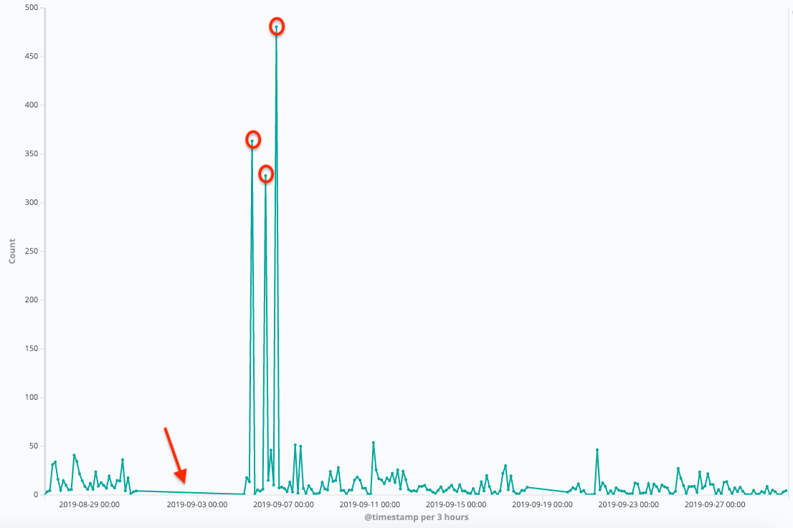
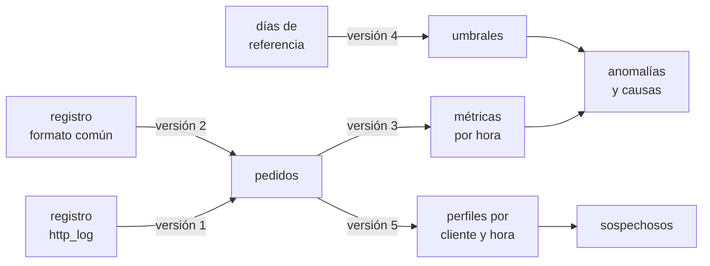
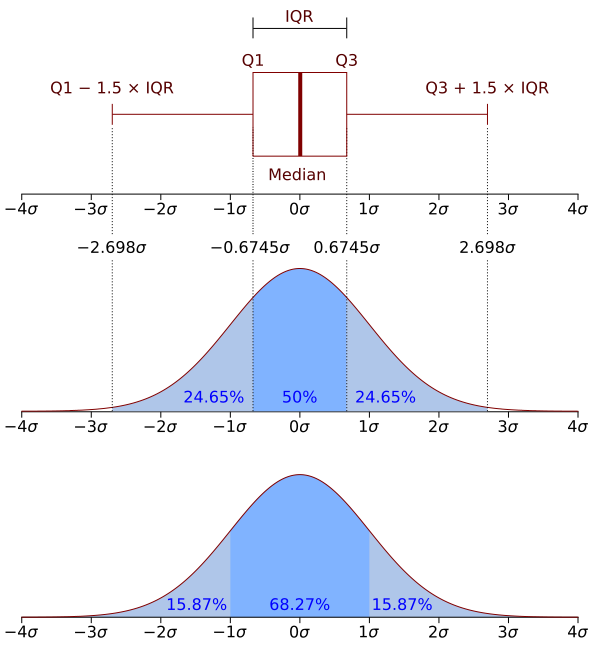

# Capítulo 84 — Proyecto: análisis de registros

Un servicio web anota cada pedido que recibe en un **registro**: quién lo
hizo, cuándo, qué pidió y qué se le respondió. El registro sirve para
responder preguntas que nadie hizo de antemano: si algún pedido quedó sin
respuesta, a qué hora hay más tráfico, quién está probando contraseñas.
El servicio de *Inscripciones* de los
[capítulos 30](../capitulo-30-servicios-web-rest/index.md#309-el-proyecto-inscripciones-como-servicio)
y [82](../capitulo-82-proyecto-criptografia/index.md#825-version-3-fichas-de-sesion),
con `library(http/http_log)` activada, escribe por cada pedido dos
términos de Prolog: uno al llegar y otro al responder.

```text
/*Thu Oct 01 10:21:11 2026*/ request(94, 1790860871.002, [peer(ip(203,0,113,7)),method(post),request_uri('/sesion'),path('/sesion'),http_version(1-1),host(localhost),port(8083)]).
completed(94, 0.043267, 36, 401, ok).
```

El pedido 94 llegó a las 10:21:11 del 1 de octubre desde 203.0.113.7,
intentó iniciar una sesión y recibió el código 401: la contraseña no era
la correcta. Un 401 aislado es un alumno que escribió mal su contraseña;
sesenta en cuatro minutos desde el mismo cliente son un intento de
adivinarla. Este capítulo escribe un programa que lee registros de cuatro
días del servicio, los resume por hora y por cliente, y separa lo normal
de lo anómalo con **umbrales** que no se escriben a mano: se ajustan con
los datos de días anteriores o se aprenden de incidentes ya investigados.
Cada anomalía se informa con su causa:

```text
10 h  fallos 62 > 14.38       203.0.113.7, 60 pedidos
12 h  cpu 2.86 > 0.98         /sesion, 2.49 s
17 h  pedidos 0 < 10.55       sin tráfico
```



Pedidos a un servidor web por tramos de tres horas durante un mes. Los
tres picos, marcados, y el tramo sin pedidos, señalado con la flecha, son
las dos clases de anomalía que busca el capítulo: demasiada actividad y
ninguna. Imagen: Sal Borrelli,
[CC BY-SA 4.0](https://creativecommons.org/licenses/by-sa/4.0), vía
[Wikimedia Commons](https://commons.wikimedia.org/wiki/File:Anomalous_Web_Traffic.png).

El punto de partida es el capítulo «Prolog Business Cases» de *The Power
of Prolog* de Markus Triska, que propone escribir el registro del
servidor como hechos, cargarlo y consultarlo, y generar informes con
reglas sobre datos que no cambian. Los modelos que deciden qué es anómalo
vienen del artículo «An Intrusion-Detection Model» de Dorothy Denning
(1987): un límite fijo, o la media de lo observado más algunos desvíos. El
modelo robusto, con la mediana, es el que recomienda el manual de
estadística del NIST. La lista completa de las fuentes, con lo que se toma
de cada una, está en las [Referencias](#referencias).

El capítulo cumple tres anuncios. El del
[capítulo 69](../capitulo-69-proyecto-perceptron/index.md): umbrales
ajustados a partir de datos para separar lo normal de lo anómalo, que
aquí aprende el mismo perceptrón. El del
[capítulo 83](../capitulo-83-proyecto-procesamiento-textos/index.md):
leer las líneas de un registro, extraer sus campos y separar lo normal de
lo anómalo, con el paso por línea de su filtro. Y el del
[capítulo 82](../capitulo-82-proyecto-criptografia/index.md): los inicios
de sesión rechazados con 401 que su servicio responde aparecen aquí como
anomalías. Usa las gramáticas del
[capítulo 21](../capitulo-21-gramaticas-dcg/index.md), los pares y los
`assoc` del [capítulo 22](../capitulo-22-estructuras-de-datos-de-la-biblioteca/index.md),
la lectura de términos y de líneas del
[capítulo 27](../capitulo-27-archivos-streams-y-formatos/index.md) y los
hilos del [capítulo 37](../capitulo-37-concurrencia-y-paralelismo/index.md).
Todos los archivos son `% solo-local`: leen archivos, y la versión 5 carga
los programas del [capítulo 69](../capitulo-69-proyecto-perceptron/index.md).

## Objetivos del capítulo

Al terminar el capítulo, el lector puede:

- cargar un registro escrito como hechos de Prolog y consultarlo, y
  reconocer cuándo la carga como programa da respuestas falsas;
- leer un registro como datos, término por término o línea por línea,
  con un paso que acumula estado y no se detiene ante una línea
  defectuosa;
- escribir una gramática para un formato de texto de otro programa, y
  comparar lo que leen dos lectores del mismo día;
- resumir eventos en métricas por período, incluidos los períodos sin
  eventos, y escribir informes con `format/2`;
- expresar las anomalías como reglas sobre las métricas y un argumento de
  límites, y buscar la causa de cada una;
- ajustar límites con la media y el desvío y con la mediana y la MAD, y
  explicar por qué el primero se desplaza con los mismos valores que debe
  detectar;
- entrenar el perceptrón del
  [capítulo 69](../capitulo-69-proyecto-perceptron/index.md) con perfiles
  marcados, y leer sus pesos como un límite sobre dos rasgos;
- calcular resúmenes que se combinan, en paralelo, y distinguir los que no
  se combinan sin guardar los valores.

!!! info "Tiempo estimado"
    Leer el capítulo, ejecutar sus ejemplos y hacer las actividades: **1:40 h**.
    Resolver los 5 ejercicios marcados con ★: **1:10 h**.
    Resolver los 11 ejercicios del final: **3:00 h**.

## 84.1 El problema: cuatro días del servicio

Los datos del capítulo son los registros de cuatro días del servicio,
del lunes 28 de septiembre al jueves 1 de octubre de 2026, de 8 a 20 horas
en Buenos Aires. Están en `ejemplos/capitulo-84/archivos/`, uno por día, y
el último día también en el **formato común** de los servidores web, una
línea de texto por pedido. Los escribe `generar.pl`, que simula las
sesiones de los alumnos con un generador de números de semilla fija:
inicios de sesión, a veces con la contraseña mal escrita, y consultas
de materias, promedios e inscripciones. Sobre ese tráfico, el generador
agrega lo que un servicio real recibe de vez en cuando; el capítulo no lo
dice de antemano, porque encontrarlo es el problema.

Un registro de `http_log` tiene tres clases de términos:

| Término | Se escribe | Contiene |
|---|---|---|
| `request(Id, Instante, Campos)` | al llegar el pedido | el número del pedido en la corrida del servidor, el instante Unix y los campos del pedido: `peer(ip(A, B, C, D))`, `method(M)`, `path(Ruta)`, … |
| `completed(Id, Cpu, Bytes, Codigo, Estado)` | al responderlo | el tiempo de CPU que usó, en segundos, los bytes de la respuesta y el código HTTP |
| `server(Motivo, Instante)` | al arrancar y al detener el servidor | `started` o `stopped` |

El programa responde cuatro preguntas, de la más simple a la más
difícil: qué pedidos quedaron sin respuesta; cuántos pedidos, fallos y
segundos de CPU hay en cada hora; cuáles de esas horas son anómalas y
por qué; y qué clientes, aunque no muevan los totales de la hora, se
comportan como atacantes. El recorrido de los datos es siempre el mismo:



## 84.2 El programa terminado

| Versión | Archivo | Agrega | Lo que no puede hacer todavía |
|---|---|---|---|
| 1 | `registro.pl` | el registro cargado como programa; el registro leído como datos, con los rearranques | leer otros formatos |
| 2 | `comun.pl` | el formato común, con una gramática y un paso por línea | resumir |
| 3 | `informes.pl` | métricas por hora, umbrales fijos, causas e informes | saber de dónde salen los límites |
| 4 | `umbrales.pl` | umbrales ajustados con la media y el desvío o con la mediana y la MAD | ver a un atacante lento entre los alumnos |
| 5 | `aprendido.pl` | perfiles por cliente y hora; un límite aprendido con el perceptrón | — |
| 6 | `paralelo.pl` | resúmenes de cada día que se combinan, leídos en paralelo | — |

Cada versión carga la anterior con `reexport/1`, de modo que sus
predicados quedan a la vista de quien carga la nueva. Con la versión 4,
los umbrales ajustados con los tres primeros días encuentran en el
cuarto las tres horas del principio del capítulo, entre otras; con la
versión 5, los dos atacantes del cuarto día:

```text
?- umbrales_de_referencia(mediana_mad(3.5), _U), informe_anomalias(registros('2026-10-01.log'), _U).
10 h  pedidos 98 > 62.45      203.0.113.7, 60 pedidos
10 h  fallos 62 > 14.38       203.0.113.7, 60 pedidos
10 h  cpu 3.17 > 0.98         /sesion, 3.11 s
12 h  cpu 2.86 > 0.98         /sesion, 2.49 s
14 h  fallos 24 > 14.38       198.51.100.61, 17 pedidos
14 h  cpu 1.32 > 0.98         /sesion, 1.29 s
17 h  pedidos 0 < 10.55       sin tráfico
18 h  pedidos 0 < 10.55       sin tráfico
```

## 84.3 Versión 1: el registro como hechos

La página [Lectura](lectura.md#version-1-el-registro-como-hechos) carga
el registro como programa, como propone Triska, y muestra su límite: los
números de pedido vuelven a empezar cuando el servidor arranca, y la regla
que junta pedido y respuesta por número da 465 pares el jueves, donde hay
419 pedidos respondidos. Después lo lee como datos, término por término,
con un paso que lleva los pedidos abiertos en un `assoc` y cierra la
corrida en cada `server/2`. El resultado es una lista de
`pedido(Instante, Ip, Metodo, Ruta, Codigo, Cpu)`, la representación de
todas las versiones siguientes, y la de los pedidos sin respuesta: el
jueves, uno, del cliente 10.1.0.58 a las 16:55.

## 84.4 Versión 2: el formato común

La [versión 2](lectura.md#version-2-el-formato-comun) lee el mismo día en
el formato común de los servidores web, una línea de texto por pedido,
con una gramática y el paso por línea del filtro del
[capítulo 83](../capitulo-83-proyecto-procesamiento-textos/index.md#835-el-filtro-version-3-un-programa-para-la-terminal).
Una línea defectuosa no detiene la lectura: queda como dato, con su
número. El jueves hay dos, un cliente que habla TLS con el puerto HTTP y
la línea que la caída cortó, y los dos lectores coinciden en todo lo
demás.

## 84.5 Versión 3: métricas por hora e informes

Un pedido aislado dice poco; lo que tiene sentido comparar son totales
por período. Denning llama **métrica** a una cantidad acumulada en un
período, y distingue tres clases: un contador de eventos (los inicios de
sesión rechazados en una hora), un temporizador (el tiempo entre dos
eventos) y una medida de recursos (el tiempo de CPU usado en una hora).
`medir/2` calcula cuatro métricas sobre los pedidos de una hora, y
`metricas/2` agrupa los pedidos de un día por hora con los pares de la
[sección 22.4](../capitulo-22-estructuras-de-datos-de-la-biblioteca/index.md#224-pares-y-keysort2):

<!-- ejemplo: capitulo-84/informes.pl predicado: hora/2 metricas/2 metricas_de_la_hora/3 medir/2 metrica/3 -->
```prolog
%!  hora(+Instante:number, -Hora:integer) is det.
%
%   Hora es la hora del Instante en Buenos Aires, UTC-3: el último
%   argumento de stamp_date_time/3 son los segundos al oeste de UTC.
hora(Instante, Hora) :-
    stamp_date_time(Instante, date(_, _, _, Hora, _, _, _, _, _), 10800).

%!  metricas(+Pedidos:list, -Horas:list) is det.
%
%   Horas tiene un elemento hora(H, Metricas) por cada hora de servicio,
%   con las métricas de medir/2 sobre los Pedidos que llegaron en esa
%   hora; una hora sin pedidos tiene todas las métricas en cero.
metricas(Pedidos, Horas) :-
    map_list_to_pairs(hora_del_pedido, Pedidos, Pares),
    keysort(Pares, Ordenados),
    group_pairs_by_key(Ordenados, Grupos),
    horas_de_servicio(Desde, Hasta),
    numlist(Desde, Hasta, Hs),
    maplist(metricas_de_la_hora(Grupos), Hs, Horas).

% metricas_de_la_hora(Grupos, H, hora(H, Ms)): las métricas de la hora H.
metricas_de_la_hora(Grupos, H, hora(H, Metricas)) :-
    (   memberchk(H-Pedidos, Grupos)
    ->  true
    ;   Pedidos = []
    ),
    medir(Pedidos, Metricas).

%!  medir(+Pedidos:list, -Metricas) is det.
%
%   Metricas es m(N, Fallos, NoEncontradas, Cpu): la cantidad de Pedidos,
%   los inicios de sesión rechazados, los pedidos con código 404 y el
%   tiempo de CPU sumado, en segundos, de los pedidos que lo registran.
medir(Pedidos, m(N, Fallos, NoEncontradas, Cpu)) :-
    length(Pedidos, N),
    aggregate_all(count,
                  member(pedido(_, _, post, '/sesion', 401, _), Pedidos),
                  Fallos),
    aggregate_all(count,
                  member(pedido(_, _, _, _, 404, _), Pedidos),
                  NoEncontradas),
    aggregate_all(sum(C),
                  ( member(pedido(_, _, _, _, _, C), Pedidos),
                    number(C) ),
                  Cpu).

%!  metrica(?Nombre, +Metricas, -Valor:number) is nondet.
%
%   Valor es la métrica Nombre de Metricas: pedidos, fallos,
%   no_encontradas o cpu.
metrica(pedidos, m(N, _, _, _), N).
metrica(fallos, m(_, F, _, _), F).
metrica(no_encontradas, m(_, _, X, _), X).
metrica(cpu, m(_, _, _, C), C).
```

`metricas/2` recorre las doce horas de servicio, no las horas que
aparecen en los pedidos. Una hora sin pedidos está en la lista, con todas
sus métricas en cero. Denning lo advierte: si los períodos sin eventos no
se cuentan, los valores observados quedan sesgados hacia arriba, y un
período sin actividad, que puede ser la anomalía, no se ve.

```prolog
?- hora_del_dia(registros('2026-10-01.log'), 10, M).
M = m(98, 62, 0, 3.173641000000001).
```

Los informes siguen la idea de Triska: los datos no cambian, y cada
informe es un predicado nuevo sobre ellos. `escribir_metricas/1` escribe
la tabla con las columnas de `format/2`: `~t` rellena y `~N|` fija la
columna donde termina el campo, así que los números quedan alineados a
la derecha.

<!-- ejemplo: capitulo-84/informes.pl predicado: escribir_metricas/1 informe/1 -->
```prolog
%!  escribir_metricas(+Horas:list) is det.
%
%   Escribe una tabla con las métricas de cada hora.
escribir_metricas(Horas) :-
    format("hora  pedidos  fallos  404    cpu~n"),
    forall(member(hora(H, m(N, F, X, C)), Horas),
           format("~t~d~2| h~t~d~13|~t~d~21|~t~d~26|~t~2f~33|~n",
                  [H, N, F, X, C])).

%!  informe(+Archivo) is det.
%
%   Escribe la tabla de las métricas por hora del registro Archivo.
informe(Archivo) :-
    leer_registro(Archivo, Pedidos),
    metricas(Pedidos, Horas),
    escribir_metricas(Horas).
```

```text
?- informe(registros('2026-10-01.log')).
hora  pedidos  fallos  404    cpu
 8 h       30       3    0   0.37
 9 h       30       0    0   0.23
10 h       98      62    0   3.17
11 h       29       5    0   0.46
12 h       25       2    0   2.86
13 h       43       6    0   0.57
14 h       46      24    0   1.32
15 h       59       8    0   0.74
16 h       36       5    0   0.46
17 h        0       0    0   0.00
18 h        0       0    0   0.00
19 h       23       1    0   0.16
true.
```

### Anomalías con límites fijos

El modelo más simple de Denning es el **operacional**: un valor es
anómalo si pasa un límite fijo, que la experiencia asocia con un
problema. Su ejemplo es el de las contraseñas: más de 10 fallos en un
período breve, «digamos», sugieren un intento de intrusión. Los límites
son una lista de pares `Metrica-Limite`, y una anomalía es una hora en la
que alguna métrica queda fuera de su límite:

<!-- ejemplo: capitulo-84/informes.pl predicado: umbrales_fijos/1 anomalia/3 fuera/2 -->
```prolog
%!  umbrales_fijos(-Umbrales:list) is det.
%
%   Los límites de cada métrica, escritos a mano: Metrica-mayor(L) si los
%   valores mayores que L son anómalos, Metrica-menor(L) si lo son los
%   menores.
umbrales_fijos([ fallos-mayor(10),
                 no_encontradas-mayor(5),
                 pedidos-menor(5),
                 cpu-mayor(1.5)
               ]).

%!  anomalia(+Umbrales:list, +Horas:list, -Anomalia) is nondet.
%
%   Anomalia es anomalia(H, Metrica, Valor, Limite): en la hora H, la
%   Metrica vale Valor, fuera del Limite que le da Umbrales.
anomalia(Umbrales, Horas, anomalia(H, Metrica, Valor, Limite)) :-
    member(hora(H, Metricas), Horas),
    member(Metrica-Limite, Umbrales),
    metrica(Metrica, Metricas, Valor),
    fuera(Limite, Valor).

% fuera(Limite, Valor): Valor pasa el Limite.
fuera(mayor(L), V) :-
    V > L.
fuera(menor(L), V) :-
    V < L.
```

Una anomalía dice qué hora y qué métrica, pero no por qué. Las reglas de
`causa/3` la explican con los pedidos de esa hora: el cliente con más
fallos, la ruta que más CPU usó. Son las reglas de actividad de Denning,
que se disparan con un registro de anomalía y lo relacionan con una
intrusión posible. `causa/3` despacha por la métrica a `causa/5`, cuyo
primer argumento la indexa, para no dejar alternativas pendientes:

<!-- ejemplo: capitulo-84/informes.pl predicado: causa/3 causa/5 causa_pedidos/4 mayor_cliente/5 anomalias/3 -->
```prolog
%!  causa(+Pedidos:list, +Anomalia, -Causa) is semidet.
%
%   Causa explica la Anomalia con los Pedidos del día: para los fallos, las
%   rutas inexistentes y el exceso de pedidos, cliente(Ip, K), el cliente
%   con más pedidos de esa clase en la hora, K; para el tiempo de CPU,
%   ruta(R, Segundos), la ruta que más tiempo usó; para una hora con pocos
%   pedidos, sin_trafico.
causa(Pedidos, anomalia(H, Metrica, _, Limite), Causa) :-
    causa(Metrica, Limite, Pedidos, H, Causa).

% causa(Metrica, Limite, Pedidos, H, Causa): causa/3 para la Metrica.
causa(fallos, _, Pedidos, H, cliente(Ip, K)) :-
    mayor_cliente(Pedidos, H, pedido(_, _, post, '/sesion', 401, _), Ip, K).
causa(no_encontradas, _, Pedidos, H, cliente(Ip, K)) :-
    mayor_cliente(Pedidos, H, pedido(_, _, _, _, 404, _), Ip, K).
causa(cpu, _, Pedidos, H, ruta(Ruta, Segundos)) :-
    findall(R-C,
            ( member(pedido(I, _, _, R, _, C), Pedidos),
              number(C),
              hora(I, H) ),
            Pares),
    keysort(Pares, Ordenados),
    group_pairs_by_key(Ordenados, Grupos),
    maplist(sumar_grupo, Grupos, Sumas),
    transpose_pairs(Sumas, PorSegundos),
    last(PorSegundos, Segundos-Ruta).
causa(pedidos, Limite, Pedidos, H, Causa) :-
    causa_pedidos(Limite, Pedidos, H, Causa).

% causa_pedidos(Limite, Pedidos, H, Causa): causa/3 para los pedidos.
causa_pedidos(mayor(_), Pedidos, H, cliente(Ip, K)) :-
    mayor_cliente(Pedidos, H, pedido(_, _, _, _, _, _), Ip, K).
causa_pedidos(menor(_), _, _, sin_trafico).

% mayor_cliente(Pedidos, H, Patron, Ip, K): Ip es el cliente con más
% pedidos que unifican con Patron en la hora H, K pedidos. Falla si no hay
% ninguno.
mayor_cliente(Pedidos, H, Patron, Ip, K) :-
    findall(I,
            ( member(Patron, Pedidos),
              Patron = pedido(Instante, I, _, _, _, _),
              hora(Instante, H) ),
            Ips),
    msort(Ips, Ordenadas),
    clumped(Ordenadas, Cuentas),
    transpose_pairs(Cuentas, PorCuenta),
    last(PorCuenta, K-Ip).

%!  anomalias(+Pedidos:list, +Umbrales:list, -Registros:list) is det.
%
%   Registros son las anomalías de los Pedidos de un día con los
%   Umbrales, cada una con su causa: anomalia(H, M, V, L)-Causa, en el
%   orden de las horas. Una anomalía sin causa conocida lleva desconocida.
anomalias(Pedidos, Umbrales, Registros) :-
    metricas(Pedidos, Horas),
    findall(A-C,
            ( anomalia(Umbrales, Horas, A),
              (   causa(Pedidos, A, C0)
              ->  C = C0
              ;   C = desconocida
              ) ),
            Registros).
```

`escribir_anomalias/1` escribe una línea por anomalía, e
`informe_anomalias/2` lee un día y las escribe. Con los límites fijos, el
jueves:

```text
?- umbrales_fijos(_U), informe_anomalias(registros('2026-10-01.log'), _U).
10 h  fallos 62 > 10          203.0.113.7, 60 pedidos
10 h  cpu 3.17 > 1.50         /sesion, 3.11 s
12 h  cpu 2.86 > 1.50         /sesion, 2.49 s
14 h  fallos 24 > 10          198.51.100.61, 17 pedidos
17 h  pedidos 0 < 5           sin tráfico
18 h  pedidos 0 < 5           sin tráfico
```

A las 10, 203.0.113.7 probó 60 contraseñas; a las 14, 198.51.100.61 probó
17; entre las 17 y las 19 el servidor estuvo caído. Las dos horas de
fallos son también horas de mucha CPU, y la causa es la misma:
`/sesion` calcula el resumen de la contraseña con PBKDF2, que el
[capítulo 82](../capitulo-82-proyecto-criptografia/index.md#824-version-2-las-contrasenas)
eligió costoso a propósito, y cada intento le cuesta al servidor 45
milésimas de segundo. La hora de las 12 es distinta: tiene pocos pedidos y
mucha CPU, y `/sesion` es la ruta que más usó solo porque es la más cara;
todos los pedidos de esa hora tardaron nueve veces lo normal. El
miércoles, los límites encuentran un cliente que pidió diez rutas
inexistentes, como `/wp-login.php` y `/.env`, en dos minutos:

```text
?- umbrales_fijos(_U), informe_anomalias(registros('2026-09-30.log'), _U).
11 h  no_encontradas 10 > 5   203.0.113.50, 10 pedidos
```

Los límites fijos tienen dos problemas. El primero es de dónde salen: el
10 de Denning es un ejemplo, y 1,5 segundos de CPU por hora dependen de la
máquina; con un servidor el doble de rápido, el límite deja de detectar
la hora lenta. El segundo es lo que no ven. El miércoles, entre las 16 y
las 17, un cliente probó ocho contraseñas, cinco en una hora y tres en la
siguiente, y esas horas tienen 10 fallos cada una: justo en el límite, sin
pasarlo.

!!! example "Patrón 92 — Límites como argumento"
    **Problema.** Una regla decide si el valor de una métrica es anómalo
    comparándolo con un límite, y los límites tienen varios orígenes: se
    escriben a mano, se ajustan con días anteriores o con el mismo día
    que se examina, o se aprenden de incidentes ya investigados. La
    regla, y las que buscan la causa, son las mismas para todos.

    **Versión ingenua.** Escribir el límite dentro de la regla, como
    `Fallos > 10`, o un predicado de anomalías por cada origen de los
    límites: cambiar de límite obliga a reescribir la regla, y comparar
    dos orígenes sobre el mismo día obliga a mantener dos copias.

    **Patrón.** Las reglas reciben las métricas y un argumento con los
    límites, una lista de pares `Metrica-mayor(L)` o `Metrica-menor(L)`:
    `anomalia/3` toma un par de la lista y `fuera/2` lo aplica. La lista
    dice también qué métricas se examinan, y quien la produce queda
    afuera de las reglas: `umbrales_fijos/1` aquí, y
    `umbrales_de_referencia/2` y `umbrales_del_dia/3` en la
    [sección 84.6](#846-version-4-umbrales-ajustados-a-partir-de-los-datos).
    `anomalias/3` e `informe_anomalias/2` las usan sin cambios, y el
    jueves se examina con los tres juegos de límites, una consulta cada
    uno. Los pesos del perceptrón de la versión 5 no caben en la forma
    `mayor(L)`, porque son una recta sobre dos métricas, pero siguen la
    misma idea: `sospechosos/3` los recibe como argumento. Es pariente
    del [Patrón 64](../patrones.md#64-superioridad-como-parametro), en
    el que una lista argumento da el criterio que resuelve los conflictos
    entre reglas, y del
    [Patrón 69](../patrones.md#69-descripcion-del-mundo-como-parametro),
    en el que el algoritmo es fijo y lo que varía son los datos sobre los
    que razona: aquí lo que varía es la frontera entre lo normal y lo
    anómalo.

    **Cuándo no usarlo.** Cuando el límite es uno solo y lo fija una
    especificación que no cambia, como un tiempo de respuesta acordado:
    el argumento agrega una indirección sin beneficio. Y cuando el límite
    depende del período, como un tráfico normal distinto a las 8 y a las
    15: una sola lista para todas las horas no lo expresa, y los pares
    necesitan la hora en la clave, o el argumento pasa a ser un predicado
    que da el límite de cada hora.

!!! question "Actividad"
    Predecir qué anomalías informa `informe_anomalias/2` el martes,
    `registros('2026-09-29.log')`, con los límites fijos. Comprobarlo, y
    explicar con `hora_del_dia/3` por qué la hora de la CPU queda tan cerca
    de su límite.

## 84.6 Versión 4: umbrales ajustados a partir de los datos

El segundo modelo de Denning es el de la **media y el desvío**: lo normal
se aprende de las observaciones, y un valor es anómalo si se aleja de la
media más de D desvíos estándar. Por la desigualdad de Chebyshev, que no
supone nada sobre la distribución de los valores, la probabilidad de un
valor normal fuera de ese intervalo es a lo sumo 1/D²: con D = 3, un
11 %. Si los valores siguen una distribución normal, es mucho menor, un
0,3 %:



Una distribución normal vista de dos maneras: abajo, la densidad, con
el 68,27 % de los valores a menos de un desvío de la media y casi todos a
menos de tres; arriba, el diagrama de caja, construido con la mediana y
los cuartiles, que no dependen de los valores extremos. Imagen: Jhguch
(Wikipedia en inglés), obra derivada de Chen-Pan Liao,
[CC BY-SA 2.5](https://creativecommons.org/licenses/by-sa/2.5), vía
[Wikimedia Commons](https://commons.wikimedia.org/wiki/File:Boxplot_vs_PDF.svg).

La media y el desvío se calculan con tres cantidades: la cantidad de
valores, su suma y la suma de sus cuadrados, que son lo que Denning guarda
en cada perfil. El desvío es la raíz de la media de los cuadrados menos el
cuadrado de la media. El otro modelo usa la **mediana**, el valor del
medio, y la **desviación absoluta mediana** (MAD), la mediana de las
distancias de cada valor a la mediana. El manual de estadística del NIST,
siguiendo a Iglewicz y Hoaglin, recomienda el **puntaje z modificado**,
0,6745 (x − mediana) / MAD, y considerar posibles atípicos los valores
cuyo puntaje pasa de 3,5 en valor absoluto. La constante 0,6745 hace que,
con datos normales, la MAD dividida por ella estime el desvío.

<!-- ejemplo: capitulo-84/umbrales.pl predicado: media_desvio/3 mediana/2 mad/3 ajustar/3 -->
```prolog
%!  media_desvio(+Valores:list(number), -Media:float, -Desvio:float) is det.
%
%   Media es la media de los Valores y Desvio su desvío estándar, la raíz
%   de la media de los cuadrados menos el cuadrado de la media. Valores no
%   es vacía.
media_desvio(Valores, Media, Desvio) :-
    length(Valores, N),
    sum_list(Valores, Suma),
    foldl(sumar_cuadrado, Valores, 0, Cuadrados),
    Media is Suma / N,
    Desvio is sqrt(max(0, Cuadrados / N - Media ** 2)).

%!  mediana(+Valores:list(number), -Mediana:number) is det.
%
%   Mediana es el valor del medio de los Valores ordenados, o la media de
%   los dos del medio si son una cantidad par. Valores no es vacía.
mediana(Valores, Mediana) :-
    msort(Valores, Ordenados),
    length(Ordenados, N),
    (   N mod 2 =:= 1
    ->  K is N // 2,
        nth0(K, Ordenados, Mediana)
    ;   K is N // 2 - 1,
        nth0(K, Ordenados, A),
        K1 is K + 1,
        nth0(K1, Ordenados, B),
        Mediana is (A + B) / 2
    ).

%!  mad(+Valores:list(number), -Mediana:number, -Mad:number) is det.
%
%   Mediana es la mediana de los Valores, y Mad la mediana de las
%   distancias de cada valor a ella: la desviación absoluta mediana.
mad(Valores, Mediana, Mad) :-
    mediana(Valores, Mediana),
    maplist(distancia(Mediana), Valores, Distancias),
    mediana(Distancias, Mad).

%!  ajustar(+Modelo, +Valores:list(number), -Intervalo) is det.
%
%   Intervalo es entre(Inferior, Superior): los valores normales según el
%   Modelo, ajustado con los Valores. Con media_desvio(D), la media más o
%   menos D desvíos; con mediana_mad(Z), los valores cuyo puntaje z
%   modificado no pasa de Z en valor absoluto, es decir, la mediana más o
%   menos Z · Mad / 0.6745.
ajustar(media_desvio(D), Valores, entre(Inferior, Superior)) :-
    media_desvio(Valores, Media, Desvio),
    Inferior is Media - D * Desvio,
    Superior is Media + D * Desvio.
ajustar(mediana_mad(Z), Valores, entre(Inferior, Superior)) :-
    mad(Valores, Mediana, Mad),
    Ancho is Z * Mad / 0.6745,
    Inferior is Mediana - Ancho,
    Superior is Mediana + Ancho.
```

La diferencia entre los dos modelos aparece con un solo valor extremo.
En `[1, 1, 2, 2, 4, 6, 900]`, la mediana es 2 y la MAD es 1, como si el 900
fuera un 9; la media pasa a 131 y el desvío a 314, y con ellos ningún
valor, ni siquiera el 900, está a más de tres desvíos:

```prolog
?- mad([1, 1, 2, 2, 4, 6, 900], Me, Ma), media_desvio([1, 1, 2, 2, 4, 6, 900], Mu, D).
Me = 2,
Ma = 1,
Mu = 130.85714285714286,
D = 314.0056544401839.
```

Los días de referencia son los tres primeros. Sus 36 horas dan, para los
fallos, una media de 4,6 con un desvío de 4,8, y una mediana de 4 con una
MAD de 2:

<!-- ejemplo: capitulo-84/umbrales.pl predicado: dias_de_referencia/1 referencia/1 valores/3 valores_de_referencia/2 umbrales/3 umbrales_de_referencia/2 umbrales_del_dia/3 -->
```prolog
% dias_de_referencia(Archivos): los registros con los que se ajustan los
% umbrales.
dias_de_referencia([ registros('2026-09-28.log'),
                     registros('2026-09-29.log'),
                     registros('2026-09-30.log')
                   ]).

%!  referencia(-Horas:list) is det.
%
%   Horas son las métricas por hora de todos los días de referencia, una
%   lista de hora(H, Metricas) por día, concatenadas.
referencia(Horas) :-
    dias_de_referencia(Archivos),
    maplist(horas_del_dia, Archivos, Listas),
    append(Listas, Horas).

%!  valores(+Metrica, +Horas:list, -Valores:list(number)) is det.
%
%   Valores son los de la Metrica en cada una de las Horas.
valores(Metrica, Horas, Valores) :-
    maplist(valor(Metrica), Horas, Valores).

%!  valores_de_referencia(+Metrica, -Valores:list(number)) is det.
%
%   Valores son los de la Metrica en las horas de los días de referencia.
valores_de_referencia(Metrica, Valores) :-
    referencia(Horas),
    valores(Metrica, Horas, Valores).

%!  umbrales(+Modelo, +Horas:list, -Umbrales:list) is det.
%
%   Umbrales son los límites, con la forma de los de la versión 3, para
%   los pedidos, los fallos y el tiempo de CPU, ajustados con el Modelo a
%   las métricas de las Horas. Los pedidos tienen límite inferior y
%   superior; las otras dos, solo superior, porque un valor bajo no es
%   anómalo.
umbrales(Modelo, Horas, [ pedidos-menor(PI), pedidos-mayor(PS),
                          fallos-mayor(FS), cpu-mayor(CS) ]) :-
    valores(pedidos, Horas, Ps),
    ajustar(Modelo, Ps, entre(PI, PS)),
    valores(fallos, Horas, Fs),
    ajustar(Modelo, Fs, entre(_, FS)),
    valores(cpu, Horas, Cs),
    ajustar(Modelo, Cs, entre(_, CS)).

%!  umbrales_de_referencia(+Modelo, -Umbrales:list) is det.
%
%   Umbrales son los de umbrales/3 ajustados con el Modelo a las horas de
%   los días de referencia.
umbrales_de_referencia(Modelo, Umbrales) :-
    referencia(Horas),
    umbrales(Modelo, Horas, Umbrales).

%!  umbrales_del_dia(+Modelo, +Archivo, -Umbrales:list) is det.
%
%   Umbrales son los de umbrales/3 ajustados con el Modelo a las horas del
%   mismo registro Archivo que se va a examinar.
umbrales_del_dia(Modelo, Archivo, Umbrales) :-
    leer_registro(Archivo, Pedidos),
    metricas(Pedidos, Horas),
    umbrales(Modelo, Horas, Umbrales).
```

```prolog
?- valores_de_referencia(fallos, Vs), media_desvio(Vs, M, D), mad(Vs, Me, Ma).
Vs = [5, 5, 3, 6, 8, 7, 3, 9, 6|...],
M = 4.611111111111111,
D = 4.832056025347676,
Me = 4,
Ma = 2.

?- umbrales_de_referencia(media_desvio(3), U).
U = [pedidos-menor(3.429179336810968), pedidos-mayor(70.57082066318904), fallos-mayor(19.107279187154138), cpu-mayor(1.1859522595036043)].

?- umbrales_de_referencia(mediana_mad(3.5), U).
U = [pedidos-menor(10.554855448480357), pedidos-mayor(62.44514455151965), fallos-mayor(14.378057820607857), cpu-mayor(0.9787626460340991)].
```

`umbrales/3` devuelve la misma lista de pares que `umbrales_fijos/1`, y
`anomalias/3` de la versión 3 la usa sin cambios: los límites eran un
argumento, el [Patrón 92](../patrones.md#92-limites-como-argumento). Los
pedidos tienen límite inferior y superior, porque muy pocos también es
anómalo; los fallos y la CPU, solo superior. Los dos modelos,
ajustados con los días de referencia, encuentran en el jueves todo lo que
encontraban los límites fijos, y dos anomalías más: el exceso de pedidos
de las 10, que es el mismo ataque, y la CPU de las 14, que pasa del nuevo
límite. El informe con la mediana es el de la
[sección 84.2](#842-el-programa-terminado); el de la media da las mismas
ocho líneas, con otros límites.

### Ajustar con los datos que se examinan

Los días de referencia no siempre están: un servicio nuevo, o uno cuyo
tráfico cambió, solo tiene los datos del día que se quiere examinar. Con
la media y el desvío del mismo jueves, los valores anómalos entran en el
cálculo del límite:

```prolog
?- umbrales_del_dia(media_desvio(3), registros('2026-10-01.log'), U).
U = [pedidos-menor(-40.13789681884034), pedidos-mayor(109.97123015217366), fallos-mayor(60.62743589163029), cpu-mayor(3.933368894530561)].
```

Los 62 fallos de las 10 llevan la media a casi 10 y el desvío a más de 16:
el límite de los fallos sube a 60,6, y el ataque de las 10 queda apenas
por encima. El de las 14, la hora lenta y la caída desaparecen del
informe:

```text
?- umbrales_del_dia(media_desvio(3), registros('2026-10-01.log'), _U), informe_anomalias(registros('2026-10-01.log'), _U).
10 h  fallos 62 > 60.63       203.0.113.7, 60 pedidos
```

Es el **enmascaramiento**: un atípico grande infla el desvío y esconde a
los atípicos menores, y a sí mismo si fuera un poco más chico. La mediana
y la MAD del mismo día casi no se mueven, porque los valores extremos son
unos pocos de doce:

```text
?- umbrales_del_dia(mediana_mad(3.5), registros('2026-10-01.log'), _U), informe_anomalias(registros('2026-10-01.log'), _U).
10 h  pedidos 98 > 81.89      203.0.113.7, 60 pedidos
10 h  fallos 62 > 22.16       203.0.113.7, 60 pedidos
10 h  cpu 3.17 > 1.94         /sesion, 3.11 s
12 h  cpu 2.86 > 1.94         /sesion, 2.49 s
14 h  fallos 24 > 22.16       198.51.100.61, 17 pedidos
```

Lo único que pierde es la caída: con dos horas en cero de doce, el límite
inferior de los pedidos queda por debajo de cero. Los modelos robustos
toleran atípicos mientras sean menos de la mitad; un día con media
jornada sin servicio ya no tiene un «normal» del que alejarse. Y la MAD
tiene un caso degenerado: si más de la mitad de los valores son iguales,
es 0, y el intervalo se reduce a un punto. Les pasa a los pedidos a rutas
inexistentes, que en los días de referencia son 0 en 35 horas de 36; el
[ejercicio 5](#ejercicios) lo resuelve.

!!! example "Patrón 93 — Ajuste robusto"
    **Problema.** Los límites de lo normal se ajustan con valores
    observados, y entre esos valores puede haber los mismos atípicos que
    los límites deben detectar: los ataques ya ocurridos en los días de
    referencia, o todos los del día cuando el ajuste usa el mismo día que
    se examina.

    **Versión ingenua.** El modelo de la media y el desvío,
    `ajustar(media_desvio(D), …)`: un solo valor extremo desplaza la media
    e infla el desvío. En `[1, 1, 2, 2, 4, 6, 900]`, el desvío es 314 y ni
    el 900 queda a más de tres desvíos; ajustado con el mismo jueves, el
    límite de los fallos sube a 60,6, y de las ocho anomalías que
    encuentran los límites de referencia queda una.

    **Patrón.** Ajustar con la mediana y la MAD, que un atípico no
    desplaza mientras los atípicos sean menos de la mitad:
    `ajustar(mediana_mad(Z), …)` calcula las dos con `mad/3` y da la
    mediana más o menos Z · MAD / 0,6745, con el 3,5 del NIST. Con el
    mismo jueves, encuentra cinco anomalías y pierde solo la caída. Si
    más de la mitad de los valores son iguales, la MAD es 0 y el
    intervalo se reduce a un punto, como el `entre(0.0, 0.0)` de las rutas
    inexistentes de los días de referencia; hace falta una dispersión
    mínima, la MAD o un mínimo, la que sea mayor. Con un mínimo de 1, la
    resolución de un contador, `ajustar_con_minimo/4` del
    [ejercicio 5](#ejercicios) pone el límite en 5,2.

    **Cuándo no usarlo.** Cuando los valores anómalos son la mitad o más,
    como un día con media jornada sin servicio: ningún ajuste con esos
    datos tiene un normal del que alejarse, y los límites salen de otros
    días. Y cuando los valores llegan de a uno o se resumen por partes: la
    media y el desvío se actualizan con tres números, la cantidad, la suma
    y la suma de los cuadrados, mientras que la mediana necesita todos los
    valores o su histograma, como en la
    [sección 84.8](#848-version-6-muchos-dias-en-paralelo).

!!! question "Actividad"
    Calcular a mano, con los valores de `valores_de_referencia/2`, el
    límite superior de los fallos con `mediana_mad(3.5)`, y predecir si el
    martes, con 28 fallos a las 15, lo pasa. Comprobarlo con
    `umbrales_de_referencia/2` y `informe_anomalias/2`.

## 84.7 Versión 5: un umbral aprendido

El ataque lento del miércoles no se ve con los umbrales de la versión 4,
que suman a todos los clientes. La página
[Un umbral aprendido](aprendido.md#version-5-un-umbral-aprendido) arma,
como propone Denning, un **perfil** por cliente y por hora,
`perfil(Ip, H, N, F)`: N pedidos, F de ellos inicios de sesión
rechazados. Los perfiles de los días de referencia, marcados con los
atacantes ya investigados, son ejemplos del perceptrón del
[capítulo 69](../capitulo-69-proyecto-perceptron/index.md). Un límite
sobre los fallos solos no alcanza; en ocho épocas, el perceptrón aprende
los pesos `[-18, -56, 70]`, que marcan un perfil cuando los fallos son al
menos el 80 % de los pedidos. Con ellos aparecen el atacante lento del
miércoles y los dos del jueves, y ningún alumno, aunque el jueves no
estuvo entre los datos del entrenamiento.

## 84.8 Versión 6: muchos días en paralelo

La página [Muchos días en paralelo](paralelo.md#version-6-muchos-dias-en-paralelo)
resume cada día en un término que se combina con el de otro día, el
[Patrón 94](../patrones.md#94-resumen-que-se-combina): la cantidad, la
suma y la suma de los cuadrados, que dan la media y el desvío, y el histograma, que da la mediana y la MAD. Los días
se leen en hilos, con `concurrent_maplist/3` del
[capítulo 37](../capitulo-37-concurrencia-y-paralelismo/paralelismo.md#paralelismo-de-datos),
y los umbrales que salen del resumen combinado son los de la versión 4.

!!! success "Criterios de calidad"
    | Criterio | En este capítulo |
    |---|---|
    | C1 | cada predicado declara modos y determinación; `cargar_hechos/2` explica el aviso que desactiva, y `hora_del_dia/3` falla fuera de las horas de servicio |
    | C2 | representaciones limpias: `pedido/6` con `sin_medir` cuando falta el dato, `m/4`, `perfil/4`, `r/4`, los límites `mayor(L)` y `menor(L)`, las causas `cliente/2`, `ruta/2` y `sin_trafico` |
    | C3 | los límites son un argumento: los fijos, los ajustados y los del mismo día pasan por el mismo `anomalias/3`; cada versión carga la anterior con `reexport/1`, y la 5 carga el perceptrón del [capítulo 69](../capitulo-69-proyecto-perceptron/index.md) sin copiarlo |
    | C4 | `paso/4`, `paso_comun/3`, `causa/5` y `mezclar/6` deciden por el primer argumento o con si-entonces-sino; el mes se busca en una tabla indexada |
    | C6 | el núcleo trabaja con listas de pedidos; solo los lectores abren archivos, y solo `escribir_metricas/1` y `escribir_anomalias/1` escriben |
    | C7 | 93 pruebas en siete archivos, y 26 sobre las soluciones; una verifica que los archivos de datos son lo que el generador escribe, otra que los dos lectores coinciden, y otras que el resumen combinado da los umbrales de la versión 4 |

## Ejercicios

Las soluciones están en [la página de soluciones](soluciones.md). La dificultad
va de 1 (se resuelve consultando el capítulo) a 3 (requiere elaboración propia).
Los marcados con ★ son los que no conviene saltear: cubren lo que el capítulo
tiene de propio. Los ejercicios que piden código se resuelven en archivos
que cargan los del capítulo, sin modificarlos.

1. ★ **(1)** Con el registro del jueves cargado por `cargar_hechos/2`,
   predecir cuántas respuestas tiene `par_hechos(M, 5, C)` y cuántas
   `sin_respuesta_hechos(M, 397)`. Comprobarlo. Construir después, con
   `paso/4` y una lista de términos escrita a mano, un caso en que
   `sin_respuesta_hechos/2` no encuentra un pedido pendiente que
   `leer_registro/3` sí encuentra.
2. ★ **(2)** Escribir `por_recurso(+Archivo, -Filas)`: una fila
   `fila(Recurso, Pedidos, Cpu)` por recurso del registro, el primer
   segmento de la ruta (`/alumnos` para `/alumnos/123`), con la cantidad
   de pedidos y el tiempo de CPU medio, ordenadas de más a menos pedidos, y
   `escribir_por_recurso/1`, que las escribe en una tabla alineada como la
   de `escribir_metricas/1`. Aplicarlo al jueves.
3. **(2)** El formato combinado agrega al formato común dos campos entre
   comillas: la página de la que viene el pedido y el programa del
   cliente. Escribir `linea_combinada//1`, que reconozca las dos formas y
   dé el mismo `pedido/6`, y comprobar que acepta
   `1.2.3.4 - - [01/Oct/2026:08:00:00 -0300] "GET /a HTTP/1.1" 200 9 "-" "curl/8.0"`.
4. ★ **(2)** Denning advierte que los períodos sin eventos deben contarse.
   Escribir `metricas_presentes/2`, como `metricas/2` pero solo con las
   horas que aparecen en los pedidos, y buscar las anomalías del jueves
   con ella y los umbrales de referencia de `mediana_mad(3.5)`. Decir qué
   anomalías desaparecen y por qué.
5. ★ **(2)** En los días de referencia, los pedidos a rutas inexistentes
   son 0 en 35 horas y 10 en una. Calcular el intervalo de
   `mediana_mad(3.5)` para esa métrica, y explicar por qué no sirve.
   Escribir `ajustar_con_minimo(+Z, +Minimo, +Valores, -Intervalo)`, que
   use la MAD o `Minimo`, la que sea mayor, y elegir un mínimo que separe
   la hora del miércoles de las otras.
6. **(2)** Escribir `ajustar_cuantil(+P, +Valores, -Limite)`: el valor que
   deja por debajo una fracción P de los valores ordenados. Calcular el
   límite de los fallos con P = 0.95 en los días de referencia, y comparar
   el informe del jueves con el de la mediana.
7. ★ **(1)** Predecir la clase que dan los pesos `[-18, -56, 70]` a los
   perfiles `[1, 1]`, `[4, 4]`, `[12, 10]` y `[40, 31]`, y la recta que
   separa las clases en el plano de los pedidos y los fallos. Comprobarlo
   con `salida/3`.
8. **(2)** Escribir `perfiles_diarios/2`, con un perfil por cliente y por
   día en lugar de por hora, entrenar el perceptrón con ellos y comparar
   los pesos y los sospechosos del miércoles y del jueves con los de la
   [sección 84.7](#847-version-5-un-umbral-aprendido).
9. **(2)** Medir `resumir_en_serie/3` y `resumir_en_paralelo/3` con la
   lista de los cuatro días repetida diez veces. Explicar el resultado, y
   por qué el resumen da 480 horas aunque haya solo 48 distintas.
10. **(3)** Denning sugiere pesar más las observaciones recientes. Escribir
    `ajustar_ponderado(+D, +Alfa, +Valores, -Intervalo)`, con la media y
    el desvío exponencialmente ponderados: cada valor nuevo pesa Alfa y lo
    anterior 1 − Alfa. Aplicarlo a los fallos de los días de referencia,
    en orden, con Alfa = 0.1, y explicar qué pasa con el límite después
    del ataque del martes.
11. **(1)** Denning distingue el ataque que prueba muchas contraseñas
    contra una cuenta del que prueba una contraseña contra muchas
    cuentas. Explicar por qué los registros del capítulo no permiten
    distinguirlos, y qué campo debería registrar el servicio para que
    `causa/3` lo hiciera.

## Resumen

| | |
|---|---|
| **registro** | la serie de eventos que un sistema anota, uno por pedido o por acción, en el orden en que ocurren |
| **corrida** | lo que el servidor anota entre un arranque y el siguiente; los números de pedido valen dentro de ella |
| **formato común** | una línea de texto por pedido respondido: cliente, identidades, fecha, pedido, código y bytes |
| **métrica** | una cantidad acumulada en un período: un contador de eventos o una medida de recursos |
| **modelo operacional** | un valor es anómalo si pasa un límite fijo |
| **modelo de media y desvío** | un valor es anómalo si se aleja de la media más de D desvíos |
| **MAD** | la mediana de las distancias a la mediana; con el puntaje z modificado, un modelo que los atípicos no desplazan |
| **enmascaramiento** | un atípico grande infla el desvío y esconde a los atípicos menores |
| **perfil** | las métricas de un sujeto, aquí un cliente, en un período |
| **resumen combinable** | un término que resume un conjunto y se combina con el de otro sin volver a los valores |
| **[Patrón 92](../patrones.md#92-limites-como-argumento)** | límites como argumento |
| **[Patrón 93](../patrones.md#93-ajuste-robusto)** | ajuste robusto |
| **[Patrón 94](../patrones.md#94-resumen-que-se-combina)** | resumen que se combina |
| `cargar_hechos/2`, `par_hechos/3`, `sin_respuesta_hechos/2` | el registro cargado como programa |
| `leer_registro/3`, `leer_registro/2`, `paso/4`, `cerrar/2`, `contar_registro/3` | el registro leído como datos, versión 1 |
| `linea//1`, `paso_comun/3`, `leer_comun/3`, `comparar/4`, `diferencias/4` | el formato común, versión 2 |
| `metricas/2`, `medir/2`, `anomalias/3`, `causa/3`, `informe/1`, `informe_anomalias/2` | métricas, anomalías e informes, versión 3 |
| `media_desvio/3`, `mad/3`, `ajustar/3`, `umbrales/3` | los umbrales ajustados, versión 4 |
| `perfiles/2`, `ejemplos_de_referencia/1`, `aprendizaje/2`, `sospechosos/3` | el umbral aprendido, versión 5 |
| `resumir/3`, `combinar/3`, `resumir_en_paralelo/3`, `ajustar_resumen/3` | los resúmenes combinables, versión 6 |
| `style_check/1` | activa o desactiva un aviso del compilador, como el de las cláusulas discontinuas |
| `date_time_stamp/2` | convierte una fecha con su zona horaria en un instante Unix |

## Temas que se retoman

| Tema | Se retoma en |
|---|---|
| Reglas sobre hechos evaluadas de abajo hacia arriba, como los informes sobre datos que no cambian | [capítulo 85](../capitulo-85-proyecto-motor-datalog/index.md) |

## Referencias

- Markus Triska, *The Power of Prolog*, capítulo «Prolog Business Cases»,
  secciones «Analyzing events and anomalies» y «Rule-based reporting».
  [Edición en línea](https://www.metalevel.at/prolog/business). El
  capítulo toma de allí el registro de `library(http/http_log)` como una
  serie de hechos, la consulta de los pedidos sin respuesta, la idea de
  convertir cualquier otro formato en hechos, y los informes como reglas
  sobre datos que no cambian, escritos con las columnas de `format/2`. La
  carga como programa y su problema con los rearranques del servidor no
  están en la fuente.
- Dorothy E. Denning, «An Intrusion-Detection Model», *IEEE Transactions
  on Software Engineering*, volumen SE-13, número 2, 1987, páginas
  222–232. [Copia de la autora](https://faculty.nps.edu/dedennin/publications/IDS%20model.pdf).
  El capítulo toma de allí las métricas por período (contadores de
  eventos y medidas de recursos), los modelos operacional y de media y
  desvío, con el límite de diez contraseñas fallidas de su ejemplo y la
  cota de Chebyshev; la advertencia de contar los períodos sin eventos; el
  perfil por sujeto y el modelo multivariado, que motivan la versión 5;
  los registros de anomalía y las reglas que buscan su causa; la
  traducción de cada formato a uno uniforme con un filtro; y la cantidad,
  la suma y la suma de cuadrados como los parámetros de un perfil, que la
  versión 6 combina. La fórmula del desvío del artículo divide la suma de
  cuadrados por n + 1; el capítulo divide por n.
- NIST/SEMATECH, *e-Handbook of Statistical Methods*, sección 1.3.5.17,
  «Detection of Outliers».
  [Edición en línea, de dominio público](https://www.itl.nist.gov/div898/handbook/eda/section3/eda35h.htm).
  El capítulo toma de allí el puntaje z modificado con la mediana y la MAD
  y el límite de 3,5, que el manual atribuye a Boris Iglewicz y David
  Hoaglin, *How to Detect and Handle Outliers*, ASQC Quality Press, 1993,
  sin edición en línea de acceso libre.
- Attila Csenki, *Prolog Techniques*, Ventus Publishing (Bookboon), 2009
  — apartado 1.6, «Case Study: The Perceptron Training Algorithm».
  [Página de la editorial, copia de archivo](https://web.archive.org/web/20220123025207/https://bookboon.com/en/prolog-techniques-applications-of-prolog-ebook?mediaType=ebook).
  El capítulo lo toma a través del
  [capítulo 69](../capitulo-69-proyecto-perceptron/index.md), cuyo
  programa la versión 5 carga sin cambios.
- Attila Csenki, *Applications of Prolog*, Ventus Publishing (Bookboon),
  2009 — capítulo «Text Processing».
  [Página de la editorial, copia de archivo](https://web.archive.org/web/20260216182045/https://bookboon.com/en/applications-of-prolog-ebook).
  La editorial ya no ofrece el libro;
  [Google Libros](https://books.google.com/books?id=copBGLD4LKwC) muestra
  páginas seleccionadas. El capítulo lo toma a través del
  [capítulo 83](../capitulo-83-proyecto-procesamiento-textos/index.md),
  del que viene la forma del paso por línea.
- W3C, «Logging in W3C httpd», sección «Common Logfile Format»:
  [documentación en línea](https://www.w3.org/Daemon/User/Config/Logging.html#common-logfile-format);
  y Apache Software Foundation, *Apache HTTP Server Documentation*,
  «Log Files», sección «Common Log Format»:
  [documentación en línea](https://httpd.apache.org/docs/2.4/logs.html#common).
  De allí vienen los campos de la versión 2, la forma de la fecha y el
  guion para un dato que falta.
- *SWI-Prolog Reference Manual* y la documentación de
  `library(http/http_log)`:
  [manual en línea](https://www.swi-prolog.org/pldoc/man?section=httplog).
  El formato de `request/3`, `completed/5` y `server/2` se verificó con un
  servidor de prueba en SWI-Prolog 9.2.9.

El código del capítulo es propio, escrito para el curso, y los datos son
simulados por `generar.pl`: ninguna dirección pertenece a un cliente
real, y las de los atacantes son de los bloques reservados para
documentación. Las fuentes dan las ideas y los modelos; los lectores, la
gramática, las métricas, las reglas de causa, el ajuste de los umbrales,
los perfiles y los resúmenes combinables no tienen equivalente en ellas.
