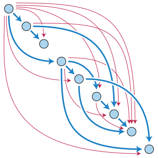
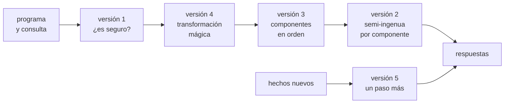
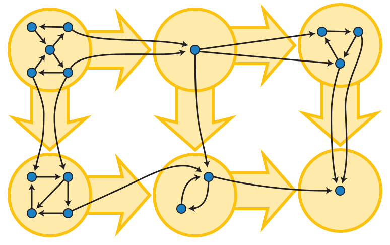

# Capítulo 85 — Proyecto: un motor Datalog

Una **base de datos deductiva** guarda hechos y reglas, y responde
consultas sobre todo lo que las reglas permiten deducir de los hechos. Su
lenguaje habitual es **Datalog**: cláusulas de Horn como las de Prolog,
sin términos compuestos, con negación permitida solo en capas. Como
lenguaje de consulta, Datalog promete lo que promete SQL: toda consulta
termina, aunque las reglas sean recursivas y los datos tengan ciclos. Prolog
no cumple esa promesa con las mismas cláusulas; la regla
`camino(X, Y) :- camino(X, Z), arco(Z, Y)` no termina con ninguna consulta.
El [capítulo 38](../capitulo-38-semantica-de-los-programas-logicos/index.md)
definió lo que esas cláusulas significan, el modelo mínimo, y lo calculó
de abajo hacia arriba sobre una lista de átomos; este capítulo construye
con esa idea un motor: un programa que recibe un programa Datalog y una
consulta, y devuelve las respuestas con un costo que no crece con lo que
la consulta no necesita.



La relación `camino/2` sobre un grafo es su **clausura transitiva**: los
arcos azules son los hechos `arco/2`, y los rojos, los pares que las
reglas agregan, uno por cada vértice que se alcanza desde otro. Imagen:
David Eppstein,
[CC0 1.0](https://creativecommons.org/publicdomain/zero/1.0/deed.es), vía
[Wikimedia Commons](https://commons.wikimedia.org/wiki/File:Transitive_Closure.svg).

El motor crece en cinco versiones. La primera decide qué programas se
pueden evaluar; la segunda guarda los átomos en relaciones indexadas y
evalúa con el método semi-ingenuo; la tercera separa el programa en las
componentes de su grafo de dependencias, para evaluar la negación por
capas; la cuarta reescribe el programa para cada consulta con la
**transformación mágica**; la quinta agrega hechos a un modelo ya
calculado sin recalcularlo. Dos páginas aplican el motor a programas de
otros capítulos: [Aplicaciones](aplicaciones.md) evalúa las reglas de
seguridad del mundo del Wumpus, la herencia de los marcos y las anomalías
de un día de registros, y
[La tabla de un juego](finales.md) calcula hacia atrás quién gana cada
posición de un juego, como la tabla de finales de ajedrez.

El proyecto parte del capítulo «Query-answering in Deductive Databases»
de *Logic, Programming and Prolog* de Ulf Nilsson y Jan Małuszyński, que
presenta la evaluación ingenua, la semi-ingenua y la transformación
mágica, y del capítulo «Tabling and Datalog Programming» de *Programming
in Tabled Prolog* de David S. Warren, que resuelve los mismos programas
con tablas. La lista completa de las fuentes, con lo que se toma de cada
una, está en las [Referencias](#referencias); el código es propio.

El capítulo cumple los anuncios de los capítulos
[38](../capitulo-38-semantica-de-los-programas-logicos/index.md) (un
motor con evaluación semi-ingenua y transformación mágica),
[39](../capitulo-39-tabulacion/index.md) (el motor comparado con las
tablas), [42](../capitulo-42-prolog-y-sql/index.md) (la evaluación
semi-ingenua de las consultas recursivas),
[58](../capitulo-58-proyecto-interpretacion-abstracta/index.md) (la
evaluación de abajo hacia arriba como un menor punto fijo),
[59](../capitulo-59-proyecto-analisis-programas/index.md) (las
componentes del grafo de dependencias para evaluar por estratos),
[61](../capitulo-61-proyecto-maquina-prolog/index.md) (una evaluación sin
resolvente ni puntos de elección),
[62](../capitulo-62-proyecto-demostrador-teoremas/index.md) (la saturación
restringida a cláusulas de Horn sin funciones),
[64](../capitulo-64-proyecto-algoritmo-rete/index.md) (propagar solo lo
que cambió, como la red Rete),
[84](../capitulo-84-proyecto-analisis-registros/index.md) (reglas sobre
hechos que no cambian, como los informes de los registros),
[77](../capitulo-77-proyecto-mundo-wumpus/index.md) (las reglas de
seguridad del Wumpus evaluadas por el motor),
[79](../capitulo-79-proyecto-lenguaje-consejos-ajedrez/index.md) (la
tabla de finales como un punto fijo de abajo hacia arriba),
[80](../capitulo-80-proyecto-etiquetado-waltz/index.md) (la cola del
filtrado de Waltz) y
[81](../capitulo-81-proyecto-coleccion-problemas/index.md) (la herencia de
los marcos evaluada de abajo hacia arriba). Carga sin copiarlos los
evaluadores del [capítulo 38](../capitulo-38-semantica-de-los-programas-logicos/index.md),
para compararse con ellos, y usa `library(assoc)` y `library(ugraphs)`.
Todos los archivos son `% solo-local`, porque son módulos que cargan
otros, salvo `retrogrado.pl`, que corre en SWISH.

## Objetivos del capítulo

Al terminar el capítulo, el lector puede:

- decidir si un programa es Datalog seguro, y explicar por qué cada
  condición hace falta para evaluarlo de abajo hacia arriba;
- escribir una evaluación semi-ingenua que cuenta cada derivación una sola
  vez, sobre relaciones indexadas por predicado y por primer argumento;
- calcular las componentes fuertemente conexas del grafo de dependencias
  de un programa, ordenarlas para la evaluación y reconocer las que hacen
  que la negación no tenga un significado claro;
- transformar un programa para una consulta con predicados mágicos, y
  predecir cuándo la transformación reduce el trabajo y cuándo no;
- relacionar los hechos mágicos con las tablas del
  [capítulo 39](../capitulo-39-tabulacion/index.md), y la evaluación
  semi-ingenua con la red Rete y con la cola del filtrado de Waltz;
- mantener un modelo cuando llegan hechos nuevos, y decir por qué la
  negación lo impide.

!!! info "Tiempo estimado"
    Leer el capítulo, ejecutar sus ejemplos y hacer las actividades: **1:45 h**.
    Resolver los 5 ejercicios marcados con ★: **1:05 h**.
    Resolver los 11 ejercicios del final: **3:30 h**.

## 85.1 Consultas que siempre terminan

El ejemplo 15.1 de Nilsson y Małuszyński es el más pequeño que muestra el
problema. Dos personas se deben mutuamente, `edge(a, b)` y `edge(b, a)`, y
`path/2` es la clausura transitiva, con la recursión a la izquierda:

```prolog
edge(a, b).
edge(b, a).
path(X, Y) :- edge(X, Y).
path(X, Y) :- path(X, Z), edge(Z, Y).
```

Prolog no termina con `path(a, Y)`: después de las dos respuestas, la
segunda cláusula se llama a sí misma sin consumir nada. El significado
del programa, en cambio, es finito: el modelo mínimo tiene los dos arcos y
los cuatro caminos, y se alcanza en tres pasos aplicando las reglas a lo
que ya se sabe, como en la
[sección 38.6](../capitulo-38-semantica-de-los-programas-logicos/index.md#386-evaluacion-de-abajo-hacia-arriba):

| Paso | Átomos nuevos | De dónde salen |
|---|---|---|
| 0 | `edge(a, b)`, `edge(b, a)` | los hechos |
| 1 | `path(a, b)`, `path(b, a)` | la primera regla, con cada arco |
| 2 | `path(a, a)`, `path(b, b)` | la segunda, con un camino del paso 1 y un arco |
| 3 | ninguno | la segunda vuelve a dar `path(a, b)` y `path(b, a)` |

Las respuestas a `path(a, Y)` son los átomos del modelo que unifican con
la consulta: `Y = a` e `Y = b`. Un motor Datalog tiene que resolver cuatro
problemas que el ejemplo oculta. El primero es **qué programas aceptar**:
con un término compuesto, `nat(s(X)) :- nat(X)`, el modelo es infinito, y
con una variable que ningún hecho liga, `p(X) :- \+ q(X)`, también. El
segundo es **no repetir trabajo**: en el paso 3 la segunda regla vuelve a
combinar los caminos del paso 1, que ya habían dado todo lo que podían.
El tercero es **la negación**: un predicado negado se puede consultar
solo cuando su relación está completa. El cuarto es **la consulta**: de
abajo hacia arriba se calcula el modelo entero, aunque se pregunte por
los caminos que salen de un solo nodo.



La evaluación de abajo hacia arriba no tiene resolvente, ni puntos de
elección, ni vuelta atrás, que son las tres estructuras de la máquina del
[capítulo 61](../capitulo-61-proyecto-maquina-prolog/index.md#612-la-resolvente-como-una-lista-de-metas):
cada paso es una función de un conjunto de átomos en otro mayor. Es la
saturación por niveles del
[capítulo 62](../capitulo-62-proyecto-demostrador-teoremas/index.md),
restringida a cláusulas de Horn sin funciones, donde termina siempre; y
el modelo que alcanza es el menor punto fijo de la función, como los
estados alcanzables que la tabla del
[capítulo 58](../capitulo-58-proyecto-interpretacion-abstracta/index.md#584-signos-un-interprete-abstracto-tabulado)
calcula al completarse.

## 85.2 El programa terminado

| Versión | Archivo | Agrega | Lo que no puede hacer todavía |
|---|---|---|---|
| 1 | `seguro.pl` | los programas que se aceptan: sin funciones, con las variables ligadas | evaluar |
| 2 | `motor.pl` | relaciones indexadas; la evaluación semi-ingenua de un grupo de reglas | la negación |
| 3 | `estratos.pl` | las componentes del grafo de dependencias, en orden; la negación por capas | preguntar por una parte del modelo |
| 4 | `magia.pl` | las consultas; la transformación mágica | agregar un hecho sin recalcular |
| 5 | `incremental.pl` | los hechos que llegan después | quitar hechos; la negación |
| — | `datalog.pl` | las cinco versiones juntas, los programas del capítulo por nombre | — |
| — | `costos.pl` | las mediciones que el capítulo imprime, con sus pruebas | — |
| — | `semantica38.pl` | los evaluadores del [capítulo 38](../capitulo-38-semantica-de-los-programas-logicos/index.md), para comparar | — |
| — | `tablas.pl` | las tablas de SWI-Prolog frente a los hechos mágicos | — |
| — | `wumpus.pl`, `marcos.pl`, `metricas.pl`, `retrogrado.pl` | las aplicaciones | — |

Un programa es, como en el
[capítulo 38](../capitulo-38-semantica-de-los-programas-logicos/index.md),
una lista de cláusulas `Cabeza :- Cuerpo`, con el cuerpo `true` en los
hechos: un programa pasa de los evaluadores de ese capítulo al motor sin
cambios. `semantica38.pl` da acceso a esos evaluadores, y `datalog.pl`
agrega a `clausulas/2` dos programas, `nilsson`, el del ejemplo anterior,
y `fila(N)`, los N arcos en fila de `cadena(N)` con la recursión de
`camino/2` a la derecha. Lo hace con el
[patrón 79](../patrones.md#79-clausulas-para-un-modulo-cargado): agrega
cláusulas a `capitulo38:generado/2`, que el
[capítulo 38](../capitulo-38-semantica-de-los-programas-logicos/index.md)
declara `multifile`. Las formas que reciben el nombre del programa son
`modelo/3`, `consulta/4` y `consulta_magica/4`:

<!-- contexto: capitulo-85/datalog.pl -->
```prolog
?- modelo(nilsson, M, C).
M = [edge(a, b), edge(b, a), path(a, a), path(a, b), path(b, a), path(b, b)],
C = costo(3, 6).

?- consulta(nilsson, path(a, Y), Rs, C).
Rs = [path(a, a), path(a, b)],
C = costo(3, 6).
```

El costo `costo(Pasos, Derivaciones)` cuenta los pasos de la evaluación y
las cabezas que derivan las reglas, repetidas incluidas, como en la
[sección 38.6](../capitulo-38-semantica-de-los-programas-logicos/index.md#386-evaluacion-de-abajo-hacia-arriba);
los hechos no se cuentan, porque entran en la base sin derivarse.

## 85.3 Versión 1: los programas que el motor acepta

Un programa **Datalog** no tiene términos compuestos: los argumentos son
constantes y variables. Con esa restricción, la base de Herbrand es
finita, y la evaluación de abajo hacia arriba termina. Hace falta además
que cada regla sea **segura**: que cada variable de la cabeza aparezca en
un literal positivo del cuerpo, y que cada variable de un literal negado,
de una comparación o de la expresión de `is/2` esté ligada por un literal
anterior. La cláusula `p(X) :- \+ q(X)` dice que `p(X)` vale para todo lo
que no es `q`: el motor tendría que enumerar el universo entero. `seguro.pl`
recorre cada cuerpo de izquierda a derecha, con el conjunto de las
variables ligadas en cada punto:

<!-- ejemplo: capitulo-85/seguro.pl predicado: problemas/2 problemas_clausula/2 -->
```prolog
%!  problemas(+Clausulas:list, -Problemas:list) is det.
%
%   Problemas son, en el orden de las cláusulas, los motivos por los que
%   Clausulas no es un programa Datalog seguro: funcion(T), un argumento
%   compuesto; cabeza_libre(C), una cabeza con una variable que ningún
%   literal positivo liga; y negacion_libre(L), comparacion_libre(L) o
%   aritmetica_libre(L), un literal que se evalúa con variables libres.
problemas(Clausulas, Problemas) :-
    maplist(problemas_clausula, Clausulas, PorClausula),
    append(PorClausula, Problemas).

%!  problemas_clausula(+Clausula, -Problemas:list) is det.
%
%   Problemas son los de una sola cláusula Cabeza :- Cuerpo: primero los
%   argumentos compuestos, después los literales del cuerpo que se
%   evaluarían con variables libres, y al final la cabeza.
problemas_clausula(Cabeza :- Cuerpo, Problemas) :-
    literales(Cuerpo, Ls),
    findall(funcion(T),
            ( member(L, [Cabeza|Ls]),
              argumento_compuesto(L, T) ),
            Fs),
    recorrer(Ls, [], Ligadas, Ns),
    term_variables(Cabeza, Vs0),
    sort(Vs0, Vs),
    (   ord_subset(Vs, Ligadas)
    ->  Cs = []
    ;   Cs = [cabeza_libre(Cabeza)]
    ),
    append([Fs, Ns, Cs], Problemas).
```

<!-- ejemplo: capitulo-85/seguro.pl predicado: recorrer/4 literal/5 exigir/5 -->
```prolog
%!  recorrer(+Literales:list, +Ligadas0:list, -Ligadas:list,
%!           -Problemas:list) is det.
%
%   Recorre los literales de izquierda a derecha. Ligadas son las variables
%   ligadas al final, como conjunto ordenado, empezando por Ligadas0; un
%   literal positivo liga las suyas, e is/2 su lado izquierdo. Problemas
%   son los literales que se evaluarían con una variable libre.
recorrer([], Ligadas, Ligadas, []).
recorrer([L|Ls], Ligadas0, Ligadas, Problemas) :-
    literal(L, Ligadas0, Ligadas1, Problemas, Resto),
    recorrer(Ls, Ligadas1, Ligadas, Resto).

%!  literal(+L, +Ligadas0:list, -Ligadas:list, -Problemas:list, ?Resto)
%!      is det.
%
%   Problemas es la lista diferencia Problemas-Resto con el problema de L,
%   si lo tiene, con las variables Ligadas0; Ligadas agrega las que L liga.
literal(L, Ligadas0, Ligadas, Problemas, Resto) :-
    (   L = (\+ A)
    ->  Ligadas = Ligadas0,
        exigir(A, Ligadas0, negacion_libre(L), Problemas, Resto)
    ;   L = (X is E)
    ->  exigir(E, Ligadas0, aritmetica_libre(L), Problemas, Resto),
        ligar(X, Ligadas0, Ligadas)
    ;   comparacion(L)
    ->  Ligadas = Ligadas0,
        exigir(L, Ligadas0, comparacion_libre(L), Problemas, Resto)
    ;   Problemas = Resto,
        ligar(L, Ligadas0, Ligadas)
    ).

%!  exigir(+T, +Ligadas:list, +Problema, -Problemas:list, ?Resto) is det.
%
%   Problemas es [Problema|Resto] si T tiene una variable que no está en
%   Ligadas, y Resto si no.
exigir(T, Ligadas, Problema, Problemas, Resto) :-
    term_variables(T, Vs0),
    sort(Vs0, Vs),
    (   ord_subset(Vs, Ligadas)
    ->  Problemas = Resto
    ;   Problemas = [Problema|Resto]
    ).
```

`literal/5` deja el problema de cada literal en una lista diferencia,
`Problemas-Resto`, como los pasos del filtrado de Waltz en el
[capítulo 80](../capitulo-80-proyecto-etiquetado-waltz/index.md): el
recorrido arma la lista en el orden de los literales sin concatenar. Las
variables ligadas son un conjunto ordenado de variables, que
`ord_subset/2` compara sin unificarlas.

<!-- contexto: capitulo-85/datalog.pl -->
```prolog
?- problemas([(p(X) :- q(X)), (r(Y) :- \+ q(Y)), (s(f(Z)) :- q(Z)), (t(U, V) :- q(U))], Ps).
Ps = [negacion_libre(\+q(Y)), cabeza_libre(r(Y)), funcion(f(_)), cabeza_libre(t(U, V))].

?- seguro([(u(Y) :- q(X), Y is X + 1)]).
true.

?- seguro([(u(Y) :- Y is X + 1, q(X))]).
false.
```

La primera cláusula es segura. La segunda tiene dos problemas: la
negación se evaluaría con `Y` libre, y la cabeza tiene una variable que
ningún literal positivo liga. La tercera tiene un término compuesto, y la
cuarta, una variable de la cabeza que el cuerpo no menciona. El orden de
los literales importa: `is/2` liga su lado izquierdo, pero solo si el
derecho ya está ligado. Nilsson y Małuszyński admiten conjuntos de átomos
con variables, y los comparan por renombramiento; el motor del capítulo
exige átomos sin variables, que se comparan con `==` y se guardan en
conjuntos ordenados.

!!! question "Actividad"
    Predecir qué responde `problemas/2` con las cláusulas
    `(par(X) :- X > 0, n(X), 0 =:= X mod 2)` y
    `(hijo(X, Y) :- padre(Y, X), \+ adoptivo(X, Z))`, y comprobarlo.
    ¿Cómo se corrige cada una?

## 85.4 Versión 2: relaciones indexadas y la evaluación semi-ingenua

El evaluador de la
[sección 38.6](../capitulo-38-semantica-de-los-programas-logicos/index.md#386-evaluacion-de-abajo-hacia-arriba)
guarda el modelo en una sola lista ordenada, y busca cada literal del
cuerpo con `member/2` en toda la lista: un `arco(Z, Y)` recorre también
todos los caminos. `motor.pl` guarda los átomos en una **base**: un árbol
de `library(assoc)` que lleva cada predicado a su relación, y cada
relación, otro árbol, lleva el primer argumento a la lista ordenada de los
átomos que lo tienen. Un literal con el primer argumento ligado consulta
una sola lista:

<!-- ejemplo: capitulo-85/motor.pl predicado: indice/3 contiene/2 en_base/2 -->
```prolog
%!  indice(+Atomo, -Indicador, -Clave) is det.
%
%   Indicador es Nombre/Aridad, el predicado de Atomo, y Clave, su primer
%   argumento, o [] si no tiene argumentos.
indice(A, Nombre/Aridad, Clave) :-
    functor(A, Nombre, Aridad),
    (   Aridad =:= 0
    ->  Clave = []
    ;   arg(1, A, Clave)
    ).

%!  contiene(+Base, +Atomo) is semidet.
%
%   Atomo, sin variables, está en Base.
contiene(Base, A) :-
    indice(A, Ind, Clave),
    get_assoc(Ind, Base, R),
    get_assoc(Clave, R, As),
    ord_memberchk(A, As).

%!  en_base(?Atomo, +Base) is nondet.
%
%   Atomo, que llega con su predicado conocido, unifica con un átomo de
%   Base. Con el primer argumento ligado, recorre solo los átomos que lo
%   tienen.
en_base(A, Base) :-
    indice(A, Ind, Clave),
    get_assoc(Ind, Base, R),
    (   ground(Clave)
    ->  get_assoc(Clave, R, As)
    ;   assoc_to_values(R, Listas),
        member(As, Listas)
    ),
    member(A, As).
```

```prolog
?- base([r(a, 2), r(a, 3), r(b, 4), s(a, 5)], B), findall(Y, en_base(r(a, Y), B), Ys).
B = t(r/2, t(a, [r(a, 2), r(a, 3)], >, t, t(b, [r(b, 4)], -, t, t)), >, t, t(s/2, t(a, [s(a, 5)], -, t, t), -, t, t)),
Ys = [2, 3].
```

La estructura del árbol queda a la vista: `r/2` tiene dos claves, `a` y
`b`, y `s/2` una. `cumplir/2` evalúa una lista de literales sobre una
base: un átomo, buscándolo con `en_base/2`; `\+ A`, comprobando que `A` no
está; una comparación o `is/2`, ejecutándola.

<!-- ejemplo: capitulo-85/motor.pl predicado: cumplir/2 literal/2 -->
```prolog
%!  cumplir(+Literales:list, +Base) is nondet.
%
%   Cada uno de Literales es verdadero en Base, de izquierda a derecha:
%   un átomo, si unifica con uno de Base; \+ A, si A no está; una
%   comparación o is/2, si se cumple. Una respuesta por cada forma.
cumplir([], _).
cumplir([L|Ls], Base) :-
    literal(L, Base),
    cumplir(Ls, Base).

%!  literal(+L, +Base) is nondet.
%
%   El literal L es verdadero en Base.
literal(L, Base) :-
    (   L = (\+ A)
    ->  \+ contiene(Base, A)
    ;   L = (X is E)
    ->  X is E
    ;   comparacion(L)
    ->  call(L)
    ;   en_base(L, Base)
    ).
```

### Cada derivación una sola vez

La evaluación **semi-ingenua** de Nilsson y Małuszyński (su figura 15.2)
usa en cada paso solo las derivaciones que toman al menos un átomo de los
**nuevos** del paso anterior, que es donde puede aparecer algo que no se
conocía. La versión del
[capítulo 38](../capitulo-38-semantica-de-los-programas-logicos/index.md)
toma de los nuevos un literal y los demás de la base completa, así que
una derivación que usa dos átomos nuevos se cuenta dos veces; su
[ejercicio 14](../capitulo-38-semantica-de-los-programas-logicos/soluciones.md#14)
escribe la forma estricta. El motor usa la estricta desde el principio:
si el literal elegido está en la posición i, los literales de antes se
buscan en la base **vieja**, la del paso anterior, y los de después en la
**actual**. Una derivación se cuenta en la primera posición que usa un
átomo nuevo.

`variantes/3` prepara una variante de cada regla por cada posición del
cuerpo con un literal positivo de un predicado del grupo que se evalúa.
El literal elegido se busca primero, porque los nuevos son pocos; por eso
los de antes se reordenan, del más cercano al más lejano, para que cada
uno reciba las variables que ligan los anteriores, y las negaciones y las
comparaciones van al final, con sus variables ya ligadas:

<!-- ejemplo: capitulo-85/motor.pl predicado: variantes/3 bloque/6 iterar/7 -->
```prolog
%!  variantes(+Reglas:list, +Predicados:list, -Variantes:list) is det.
%
%   Variantes son los términos v(Cabeza, Literal, Antes, Despues): uno por
%   cada regla y cada posición de su cuerpo con un literal positivo de uno
%   de los Predicados, con los literales de antes y de después. El literal
%   elegido se evalúa primero, así que los de antes se reordenan: los
%   átomos positivos, del más cercano al más lejano, para que cada uno
%   reciba las variables que ligan los anteriores, y después los demás,
%   en su orden, con sus variables ya ligadas.
variantes(Reglas, Predicados, Variantes) :-
    findall(v(H, L, Antes, Despues),
            ( member(r(H, Ls), Reglas),
              append(Antes0, [L|Despues], Ls),
              positivo(L),
              indice(L, Ind, _),
              memberchk(Ind, Predicados),
              partition(positivo, Antes0, Positivos, Otros),
              reverse(Positivos, Cercanos),
              append(Cercanos, Otros, Antes) ),
            Variantes).

%!  bloque(+Reglas:list, +Predicados:list, +Base0, -Base, +Costo0, -Costo)
%!      is det.
%
%   Base agrega a Base0 todo lo que las Reglas derivan hasta el punto fijo.
%   Predicados son los del grupo, los que pueden cambiar mientras se
%   evalúa. Costo es costo(Pasos, Derivaciones) sumado a Costo0: los pasos
%   y las cabezas derivadas, contando las repetidas.
bloque(Reglas, Predicados, Base0, Base, Costo0, Costo) :-
    findall(H, ( member(r(H, Ls), Reglas), cumplir(Ls, Base0) ), Hs),
    sumar(Costo0, Hs, Costo1),
    agregar(Hs, Base0, Base1, Nuevos),
    variantes(Reglas, Predicados, Variantes),
    iterar(Variantes, Base0, Base1, Nuevos, Base, Costo1, Costo).

%!  iterar(+Variantes:list, +Vieja, +Actual, +Nuevos:list, -Base,
%!         +Costo0, -Costo) is det.
%
%   Sigue la evaluación: Nuevos son los átomos que Actual tiene y Vieja
%   no. Cada paso deriva con las Variantes tomando el literal elegido de
%   Nuevos, los anteriores de Vieja y los posteriores de Actual, hasta que
%   no hay átomos nuevos. Sin variantes, el grupo no es recursivo, y el
%   primer paso alcanzó.
iterar(Variantes, Vieja, Actual, Nuevos, Base, Costo0, Costo) :-
    (   ( Nuevos == [] ; Variantes == [] )
    ->  Base = Actual,
        Costo = Costo0
    ;   base(Nuevos, Delta),
        findall(H,
                ( member(v(H, L, Antes, Despues), Variantes),
                  en_base(L, Delta),
                  cumplir(Antes, Vieja),
                  cumplir(Despues, Actual) ),
                Hs),
        sumar(Costo0, Hs, Costo1),
        agregar(Hs, Actual, Siguiente, Nuevos1),
        iterar(Variantes, Actual, Siguiente, Nuevos1, Base, Costo1, Costo)
    ).
```

`bloque/6` hace el primer paso con la base entera y sigue con
`iterar/7`, que lleva la base vieja, la actual y los átomos nuevos hasta
que no aparece ninguno. Un grupo sin variantes no es recursivo, y el
primer paso le alcanza. `semi_ingenua/3` evalúa un programa sin negación
como un solo grupo:

<!-- contexto: capitulo-85/datalog.pl -->
```prolog
?- clausulas(nilsson, Cs), semi_ingenua(Cs, M, C).
Cs = [(edge(a, b):-true), (edge(b, a):-true), (path(_A, _B):-edge(_A, _B)), (path(_A, _B):-path(_A, _C), edge(_C, _B))],
M = [edge(a, b), edge(b, a), path(a, a), path(a, b), path(b, a), path(b, b)],
C = costo(3, 6).
```

Son los tres pasos de la tabla de la
[sección 85.1](#851-consultas-que-siempre-terminan), y las seis
derivaciones son las dos de cada paso: en el tercero, los caminos
`path(a, a)` y `path(b, b)` dan otra vez `path(a, b)` y `path(b, a)`, que
ya estaban, y la evaluación se detiene. El mismo programa en fila del
[capítulo 38](../capitulo-38-semantica-de-los-programas-logicos/index.md),
con 40 arcos, da el mismo modelo que `semi_ingenua_de/4` con un tercio de
las inferencias:

```text
?- clausulas(cadena(40), Cs), time(semi_ingenua(Cs, M, C)).
% 154,818 inferences, 0.016 CPU in 0.019 seconds (82% CPU, 9908352 Lips)
C = costo(41, 820).

?- clausulas(cadena(40), Cs), time(semi_ingenua_de(Cs, [], M, C)).
% 483,968 inferences, 0.047 CPU in 0.049 seconds (96% CPU, 10324651 Lips)
C = costo(42, 860).
```

Las dos consultas imprimen también `Cs` y `M`, que se omiten. La prueba
`costos:cadena_40` verifica los dos costos con su valor exacto, y
`costos:cadena_40_inferencias`, las inferencias dentro de un 10 %, porque
cambian de una versión de SWI-Prolog a otra. Las demás cifras medidas del
capítulo y de sus páginas tienen también su prueba en `costos.plt`.

Las 820 derivaciones son exactamente los 820 caminos: cada uno se deriva
una vez. El evaluador del
[capítulo 38](../capitulo-38-semantica-de-los-programas-logicos/index.md)
cuenta además los 40 hechos, que deriva en su primer paso. La diferencia
de inferencias crece con el modelo, porque cada `arco(Z, Y)` de ese
evaluador recorre todos los átomos, y en el motor, solo los arcos que
salen de `Z`.

La idea de la versión 2 es el patrón 95:

!!! example "Patrón 95 — Propagar solo lo nuevo"
    **Problema.** Un cálculo se repite hasta un punto fijo: cada paso
    agrega hechos, posiciones o etiquetas que se deducen de los que ya hay,
    y termina cuando un paso no agrega nada.

    **Versión ingenua.** En cada paso, volver a combinar todo lo conocido:
    la evaluación ingenua de la
    [sección 38.6](../capitulo-38-semantica-de-los-programas-logicos/index.md#386-evaluacion-de-abajo-hacia-arriba)
    o las rondas de la tabla de finales del
    [capítulo 79](../capitulo-79-proyecto-lenguaje-consejos-ajedrez/index.md),
    que vuelven a derivar en cada paso lo que derivaron los anteriores.

    **Patrón.** Llevar aparte lo que el paso anterior agregó, los
    **nuevos**, y hacer que cada paso parta de ellos: una derivación toma
    al menos un elemento nuevo, los anteriores al elegido de lo que ya se
    sabía y los posteriores de lo actual, para contarse una sola vez
    (`iterar/7`). Lo que necesita «todos» en lugar de «alguno» se lleva
    con una cuenta que baja con cada novedad (`retrogrado/3`). El cálculo
    termina cuando no hay nuevos. En la fila de 40 arcos, cada camino se
    deriva una vez: 820 derivaciones, contra 860 del evaluador del
    [capítulo 38](../capitulo-38-semantica-de-los-programas-logicos/index.md).

    **Cuándo no usarlo.** Cuando un paso puede **quitar** lo que otro
    agregó: con una negación, o con hechos que se borran, partir de lo
    nuevo deja conclusiones que ya no valen, y hace falta otro algoritmo
    (DRed) o recalcular. Y cuando el cálculo tiene uno o dos pasos, como
    una regla que no es recursiva: llevar los nuevos aparte no ahorra
    nada.

!!! question "Actividad"
    Predecir `costo(Pasos, Derivaciones)` de `semi_ingenua/3` con
    `cadena(10)`, y con el programa de `cadena(10)` más el arco
    `arco(10, 0)`, que cierra un ciclo. Comprobarlo, y explicar por qué el
    segundo tiene más pasos.

## 85.5 Versión 3: las componentes y la negación

El [capítulo 38](../capitulo-38-semantica-de-los-programas-logicos/negacion.md#estratificacion)
asignó a cada predicado un estrato, subiéndolo en rondas, y evaluó juntos
todos los predicados de cada estrato. El
[capítulo 59](../capitulo-59-proyecto-analisis-programas/index.md#592-lo-que-el-grafo-dice-del-programa)
calculó las **componentes fuertemente conexas** de un grafo de llamadas:
los grupos de predicados que se alcanzan unos a otros. Las dos ideas se
combinan. Si cada componente se contrae a un solo vértice, el grafo que
queda, la **condensación**, no tiene ciclos, y un orden topológico suyo
es un orden de evaluación: cada componente se evalúa después de aquellas
de las que depende, con su propio punto fijo.



Un grafo dirigido, en azul, y su condensación, en amarillo: cada vértice
amarillo es una componente fuertemente conexa del grafo azul, y el grafo
amarillo no tiene ciclos. Imagen: David Eppstein,
[CC0 1.0](https://creativecommons.org/publicdomain/zero/1.0/deed.es), vía
[Wikimedia Commons](https://commons.wikimedia.org/wiki/File:Graph_Condensation.svg).

`estratos.pl` construye el grafo de dependencias con los predicados
definidos por reglas, porque los demás son hechos y ya están completos, y
usa `library(ugraphs)` como el
[capítulo 59](../capitulo-59-proyecto-analisis-programas/index.md): la
componente de P son los predicados que P alcanza y que alcanzan a P en la
clausura transitiva, y `top_sort/2` ordena la condensación:

<!-- ejemplo: capitulo-85/estratos.pl predicado: componentes_reglas/2 componente_de/3 -->
```prolog
%!  componentes_reglas(+Reglas:list, -Componentes:list(list)) is det.
%
%   Componentes, como en componentes/2, sobre las reglas r(Cabeza,
%   Literales). Dos predicados están en la misma componente si cada uno
%   alcanza al otro en la clausura transitiva del grafo; el grafo de las
%   componentes no tiene ciclos, y top_sort/2 lo ordena.
componentes_reglas(Reglas, Componentes) :-
    definidos(Reglas, Ps),
    aristas(Reglas, Aristas),
    findall(P-Q, member(P-Q-_, Aristas), Arcos),
    vertices_edges_to_ugraph(Ps, Arcos, Grafo),
    transitive_closure(Grafo, Clausura),
    maplist(componente_de(Clausura), Ps, Cs0),
    sort(Cs0, Cs),
    findall(CP-CQ,
            ( member(P-Q, Arcos),
              member(CP, Cs), ord_memberchk(P, CP),
              member(CQ, Cs), ord_memberchk(Q, CQ),
              CP \== CQ ),
            Arcos2),
    vertices_edges_to_ugraph(Cs, Arcos2, Condensado),
    top_sort(Condensado, Orden),
    reverse(Orden, Componentes).

%!  componente_de(+Clausura, +P, -Componente:list) is det.
%
%   Componente son, ordenados, P y los predicados que P alcanza y que lo
%   alcanzan en la Clausura.
componente_de(Clausura, P, Componente) :-
    neighbours(P, Clausura, SP),
    findall(Q,
            ( member(Q, SP),
              neighbours(Q, Clausura, SQ),
              ord_memberchk(P, SQ) ),
            Qs),
    sort([P|Qs], Componente).
```

`top_sort/2` pone cada vértice antes que sus sucesores, y un arco de P a Q
dice que P usa Q: el orden de evaluación es el inverso. Un programa es
estratificado si ningún literal negado usa un predicado de su misma
componente; `ciclos_negativos/2` da esos arcos, y `evaluar/3` los informa
en un error en lugar de calcular un modelo que no significa nada:

<!-- ejemplo: capitulo-85/estratos.pl predicado: evaluar_base/3 evaluar_componente/4 -->
```prolog
%!  evaluar_base(+Clausulas:list, -Base, -Costo) is det.
%
%   Como evaluar/3, con el modelo en una base de motor.pl.
evaluar_base(Clausulas, Base, Costo) :-
    problemas(Clausulas, Problemas),
    (   Problemas = [P|_]
    ->  domain_error(datalog_seguro, P)
    ;   true
    ),
    ciclos_negativos(Clausulas, Pares),
    (   Pares == []
    ->  true
    ;   domain_error(programa_estratificado, Pares)
    ),
    separar(Clausulas, Hechos, Reglas),
    componentes_reglas(Reglas, Componentes),
    base(Hechos, Base0),
    foldl(evaluar_componente(Reglas), Componentes,
          Base0-costo(0, 0), Base-Costo).

%!  evaluar_componente(+Reglas:list, +Componente:list, +Estado0, -Estado)
%!      is det.
%
%   Estado0 es Base0-Costo0; Estado agrega lo que derivan hasta el punto
%   fijo las reglas de los predicados de Componente.
evaluar_componente(Reglas, Componente, Base0-Costo0, Base-Costo) :-
    include(de_componente(Componente), Reglas, DeLaComponente),
    bloque(DeLaComponente, Componente, Base0, Base, Costo0, Costo).
```

<!-- contexto: capitulo-85/datalog.pl -->
```prolog
?- clausulas(circular, Cs), componentes(Cs, Ks), ciclos_negativos(Cs, Ps).
Cs = [(p:- \+q), (q:- \+p), (r:- \+r), (s:- \+t)],
Ks = [[s/0], [r/0], [p/0, q/0]],
Ps = [p/0-q/0, q/0-p/0, r/0-r/0].

?- clausulas(circular, Cs), catch(evaluar(Cs, M, C), error(E, _), true).
Cs = [(p:- \+q), (q:- \+p), (r:- \+r), (s:- \+t)],
E = domain_error(programa_estratificado, [p/0-q/0, q/0-p/0, r/0-r/0]).
```

En el programa `circular` de la
[sección 38.3](../capitulo-38-semantica-de-los-programas-logicos/resolucion.md#un-predicado-definido-por-su-propia-negacion),
`p` y `q` forman una componente, y `r` otra, de un solo predicado que
depende de sí mismo; `s` usa negado a `t`, que no tiene reglas, y está
bien definido. Con el sistema experto de la
[sección 38.7](../capitulo-38-semantica-de-los-programas-logicos/index.md#387-las-reglas-del-sistema-experto),
la diferencia entre los dos métodos se ve en el tamaño de los grupos:

```prolog
?- clausulas(base(original), Cs), componentes(Cs, Ks), length(Ks, N), estratos_de(Cs, [_-E0|_]), length(E0, N0).
Cs = [(mamifero:-tiene_pelo), (mamifero:-da_leche), (ave:-tiene_plumas), (ave:-vuela, pone_huevos), (carnivoro:-mamifero, come_carne), (ungulado:-mamifero, tiene_cascos), (guepardo:-carnivoro, ..., ...), (tigre:- ..., ...), (... :- ...)|...],
Ks = [[mamifero/0], [carnivoro/0], [ave/0], [ungulado/0], [tigre/0], [pinguino/0], [jirafa/0], [... / ...], [...]|...],
N = 10,
E0 = [ave/0, carnivoro/0, cebra/0, color_leonado/0, come_carne/0, cuello_largo/0, da_leche/0, guepardo/0, ... / ...|...],
N0 = 21.
```

El método por rondas pone 21 predicados en el estrato 0 y los evalúa
juntos hasta el punto fijo; las componentes son 10, una por predicado
definido por reglas, ninguna recursiva, y cada una se resuelve en un solo
paso, con las reglas de su predicado. El resultado es el mismo modelo
estándar: las pruebas de `estratos.plt` lo comparan con
`modelo_estandar_de/2` en cinco programas del
[capítulo 38](../capitulo-38-semantica-de-los-programas-logicos/index.md).

Warren llega a las mismas componentes desde la tabulación: su
`auto_table` construye el grafo de llamadas y tabula lo necesario para
romper sus ciclos, y su ejemplo de negación estratificada, el de los
términos que se reducen hasta una componente final, tiene tres estratos
que el [ejercicio 7](#ejercicios) calcula con el motor.

!!! question "Actividad"
    Predecir las componentes, su orden y el modelo de
    `[(s :- true), (r :- s), (p :- \+ q), (q :- \+ r)]`. Comprobarlo con
    `componentes/2` y `evaluar/3`, y explicar por qué el costo tiene tres
    pasos y dos derivaciones.

## 85.6 Versión 4: las consultas y la transformación mágica

La consulta `camino(0, Y)` sobre los 40 arcos en fila necesita los 40
caminos que salen de 0, y la evaluación calcula los 820. La página
[La transformación mágica](magia.md) escribe la transformación de
Nilsson y Małuszyński en la forma de los **conjuntos mágicos**: cada
predicado se adorna con los argumentos que llegan ligados, `b`, o libres,
`f`; un predicado mágico, como `m_camino_bf`, guarda los valores con que
se lo llamaría de arriba hacia abajo; cada regla exige el hecho mágico de
su cabeza, y la consulta aporta la semilla, `m_camino_bf(0)`. Los
predicados usados negados se evalúan completos, con sus reglas
originales, y el programa transformado sigue siendo estratificado. La
transformación no siempre reduce el trabajo; depende de la dirección de
la recursión y de qué argumento está ligado:

| Programa | Consulta | Modelo entero | Con magia |
|---|---|---|---|
| `cadena(40)`: `camino(X, Z), arco(Z, Y)` | `camino(0, Y)` | 820 | 41 |
| `cadena(40)` | `camino(X, 40)` | 820 | 862 |
| `fila(40)`: `arco(X, Z), camino(Z, Y)` | `camino(0, Y)` | 820 | 860 |
| `fila(40)` | `camino(X, 40)` | 820 | 158 |

Las cuatro filas las verifica la prueba `costos:tabla_magia`. La misma
página compara los hechos mágicos con las tablas del
[capítulo 39](../capitulo-39-tabulacion/index.md), sobre el ejemplo de
Warren de las personas que se deben dinero en un ciclo de 100: cada tabla
de SWI-Prolog corresponde a un hecho mágico, y cada respuesta guardada, a
un átomo adornado, una tabla con cien respuestas con la recursión a la
izquierda y cien tablas con diez mil con la recursión a la derecha. La
tabulación avanza una llamada por vez; el motor, un conjunto de átomos
por paso.

## 85.7 Versión 5: los hechos que llegan después

Un modelo calculado es un punto fijo: aplicar las reglas no agrega nada.
Si llega un hecho nuevo, todo lo que hay que derivar usa ese hecho o algo
derivado de él, y eso es exactamente lo que hace un paso semi-ingenuo
tomando como nuevos los hechos que llegan. `incremental.pl` guarda en un
**estado** las variantes de todas las reglas, una por cada literal
positivo, y la base:

<!-- ejemplo: capitulo-85/incremental.pl predicado: iniciar/3 agregar_hechos/4 -->
```prolog
%!  iniciar(+Clausulas:list, -Estado, -Costo) is det.
%
%   Estado tiene las reglas de Clausulas, un programa Datalog seguro sin
%   negación, y su modelo mínimo, calculado agregando los hechos a la base
%   vacía con agregar_hechos/4. Costo, el de ese cálculo. Error de dominio
%   si el programa no es seguro o tiene una negación.
iniciar(Clausulas, Estado, Costo) :-
    exigir_definido(Clausulas),
    separar(Clausulas, Hechos, Reglas),
    findall(Ind,
            ( member(r(_, Ls), Reglas),
              member(L, Ls),
              functor(L, Nombre, Aridad),
              Ind = Nombre/Aridad ),
            Is),
    sort(Is, Predicados),
    variantes(Reglas, Predicados, Variantes),
    empty_assoc(Vacia),
    agregar_hechos(Hechos, estado(Variantes, Vacia), Estado, Costo).

%!  agregar_hechos(+Hechos:list, +Estado0, -Estado, -Costo) is det.
%
%   Estado tiene la base de Estado0 con los Hechos, sin variables, y todo
%   lo que se deriva de ellos, hasta el punto fijo. Costo es costo(Pasos,
%   Derivaciones) de los pasos semi-ingenuos que hicieron falta.
agregar_hechos(Hechos, estado(Variantes, Base0),
               estado(Variantes, Base), Costo) :-
    agregar(Hechos, Base0, Base1, Nuevos),
    iterar(Variantes, Base0, Base1, Nuevos, Base, costo(0, 0), Costo).
```

La evaluación inicial es el mismo caso: agregar todos los hechos a la base
vacía; la consulta siguiente parte de los 40 arcos y agrega uno.

<!-- contexto: capitulo-85/datalog.pl -->
```prolog
?- agregar_a(cadena(40), [arco(40, 41)], C, M), length(M, N).
C = costo(2, 41),
M = [arco(0, 1), arco(1, 2), arco(2, 3), arco(3, 4), arco(4, 5), arco(5, 6), arco(6, 7), arco(7, 8), arco(..., ...)|...],
N = 902.
```

`agregar_a/4`, de `datalog.pl`, inicia el estado con el programa por su
nombre y le agrega los hechos.

El arco nuevo produce 41 caminos en dos pasos: `camino(40, 41)` y, con
cada `camino(I, 40)` de la base vieja, `camino(I, 41)`; el segundo paso
no encuentra arcos que salgan de 41, y termina. Recalcular el modelo de 41
arcos desde cero costaría 861 derivaciones (prueba `costos:agregar`).

**La red Rete del [capítulo 64](../capitulo-64-proyecto-algoritmo-rete/index.md#644-version-3-tokens-y-uniones)
hace lo mismo con otra organización.** Un hecho que entra en la memoria
de trabajo recorre la red y se une con lo que las memorias beta guardan
de los hechos anteriores; solo produce las instanciaciones que lo usan.
La red guarda las uniones parciales entre ciclos, y propaga un hecho por
vez; el motor no guarda uniones parciales, las recalcula en cada paso con
los índices de la base, y propaga un conjunto de hechos por paso. Las dos
cosas son la misma idea: **propagar solo lo que cambió**. Es también la
idea de la cola del filtrado de Waltz, en la
[sección 80.6](../capitulo-80-proyecto-etiquetado-waltz/index.md#806-version-4-el-filtrado-de-waltz):
una unión vuelve a la cola solo cuando su dominio cambió, y el filtrado
termina cuando la cola se vacía, como el motor termina cuando no hay
átomos nuevos. El filtrado quita combinaciones de dominios finitos, y el
motor agrega átomos de una base finita; los dos terminan porque cada
paso cambia algo en un solo sentido, y hay una cantidad finita de cosas
que cambiar.

La red Rete tiene algo que el motor no tiene: los hechos que **salen**. La
negación del [capítulo 64](../capitulo-64-proyecto-algoritmo-rete/index.md#645-version-4-la-negacion)
lleva una cuenta por token, y un hecho que sale quita lo que su entrada
había agregado. El paso semi-ingenuo solo agrega, y con una negación un
hecho nuevo puede invalidar algo ya derivado: en el mundo del Wumpus, una
brisa nueva quita la conclusión `sin_pozo` de las celdas vecinas. Por
eso `iniciar/3` rechaza los programas con negación:

<!-- contexto: capitulo-85/datalog.pl -->
```prolog
?- catch(iniciar([(p(X) :- r(X), \+ q(X))], _, _), error(E, _), true).
E = domain_error(programa_sin_negacion, \+q(_)).
```

Mantener un modelo con negación, o con hechos que se borran, pide otro
algoritmo: el más conocido, DRed, de Ashish Gupta, Inderpal Singh Mumick
y V. S. Subrahmanian, borra primero de más, todo lo que tenía una
derivación que usaba lo borrado, y vuelve a derivar lo que tiene otra.
El [ejercicio 8](#ejercicios) compara el costo de recalcular desde cero.

## 85.8 Aplicaciones: el Wumpus, los marcos y los registros

La página [Aplicaciones](aplicaciones.md) evalúa con el motor dos
programas de otros capítulos. Las reglas de seguridad del agente del
[capítulo 77](../capitulo-77-proyecto-mundo-wumpus/enfoques.md#el-mismo-conocimiento-seis-inferencias)
dan las mismas celdas seguras que con el evaluador del
[capítulo 38](../capitulo-38-semantica-de-los-programas-logicos/index.md),
con un tercio menos de inferencias. La herencia de los marcos del
[capítulo 81](../capitulo-81-proyecto-coleccion-problemas/transito-y-marcos.md#marcos),
con las dos reglas de Rowe que se llaman una a la otra, termina de abajo
hacia arriba y da los mismos valores que el intérprete de ese capítulo.
Las métricas por hora de los registros del
[capítulo 84](../capitulo-84-proyecto-analisis-registros/index.md),
escritas como hechos, dan con reglas las mismas anomalías que sus
informes, y además las rachas de horas anómalas seguidas.

## 85.9 La tabla de un juego

La página [La tabla de un juego](finales.md) calcula hacia atrás quién
gana cada posición de un juego, como la tabla de finales de la
[sección 79.6](../capitulo-79-proyecto-lenguaje-consejos-ajedrez/index.md#796-version-6-la-tabla-de-finales).
El programa no es estratificado, y el motor no lo acepta; pero la tabla
se puede calcular con la misma idea que la evaluación semi-ingenua,
partiendo en cada ronda solo de las posiciones que recibieron valor en la
anterior, y el costo pasa de 750 747 arcos examinados a 2 997 (prueba
`costos:restar_1000`).

!!! success "Criterios de calidad"
    | Criterio | En este capítulo |
    |---|---|
    | C1 | cada predicado declara modos y determinación; `en_base/2` y `cumplir/2` son `nondet` y solo se usan dentro de `findall/3`; los evaluadores son `det` |
    | C2 | representaciones limpias: cláusulas `Cabeza :- Cuerpo`, reglas `r(Cabeza, Literales)`, variantes `v/4`, costos `costo/2`, problemas `funcion/1`, `cabeza_libre/1` y otros |
    | C3 | el motor recibe los programas de los capítulos [38](../capitulo-38-semantica-de-los-programas-logicos/index.md), [77](../capitulo-77-proyecto-mundo-wumpus/index.md) y [81](../capitulo-81-proyecto-coleccion-problemas/index.md), y los datos del [84](../capitulo-84-proyecto-analisis-registros/index.md), sin cambios; los programas nuevos se agregan a `generado/2` con el [patrón 79](../patrones.md#79-clausulas-para-un-modulo-cargado) |
    | C5 | un programa que no es seguro o no es estratificado produce un error de dominio que nombra el problema, nunca un modelo incorrecto |
    | C6 | todo el motor es puro: las bases son árboles que se pasan de un paso al otro, y la versión 5 devuelve un estado nuevo |
    | C7 | 134 pruebas en trece archivos, y 25 más sobre las soluciones; `costos.plt` verifica cada cifra medida que el capítulo imprime, las inferencias dentro de un 10 %; el motor se compara con los evaluadores del [capítulo 38](../capitulo-38-semantica-de-los-programas-logicos/index.md), las respuestas mágicas con las del modelo entero, los hechos mágicos con las tablas, y las aplicaciones con los programas de sus capítulos |

## Ejercicios

Las soluciones están en [la página de soluciones](soluciones.md). La dificultad
va de 1 (se resuelve consultando el capítulo) a 3 (requiere elaboración propia).
Los marcados con ★ son los que no conviene saltear: cubren lo que el capítulo
tiene de propio. Los ejercicios que piden código se resuelven en archivos
que cargan los del capítulo, sin modificarlos.

1. ★ **(1)** Predecir qué responde `problemas/2` con el ejercicio 15.1 de
   Nilsson y Małuszyński, `(expr(X, Z) :- expr(X, [+|Y]), expr(Y, Z))` y
   `(expr([id|Y], Y) :- true)`, y explicar por qué la evaluación de abajo
   hacia arriba no termina con él. ¿Qué hace Prolog con la consulta
   `expr([id, +, id], X)`?
2. ★ **(1)** Predecir las componentes, en su orden, y los ciclos
   negativos del programa `(a :- \+ b)`, `(b :- c)`, `(c :- \+ d)`,
   `(d :- e)`, `(e :- d)`, `(f :- a, \+ f)`. Comprobarlo con
   `componentes/2` y `ciclos_negativos/2`.
3. **(2)** Nilsson y Małuszyński abren su capítulo con
   `married(X, Y) :- married(Y, X)` y el hecho `married(adam, anne)`.
   Escribir el programa como datos, predecir el costo de `evaluar/3` y
   las respuestas de `married(anne, X)` con `respuestas_magicas/4`, y
   explicar por qué Prolog no encuentra ninguna respuesta si la regla va
   primero.
4. **(3)** Escribir `suplementario(+Clausula, +K, -Clausulas)`, la
   transformación con predicados suplementarios de Nilsson y Małuszyński:
   la regla `A0 :- A1, …, An` se reemplaza por `S1 :- A1`,
   `S2 :- S1, A2`, …, y `A0 :- Sn-1, An`, donde cada Si lleva las
   variables de A1, …, Ai que todavía hacen falta, las de la cabeza y las
   de los literales siguientes, y K distingue los nombres. Aplicarla a
   dos programas y comparar las derivaciones y las inferencias con las
   del original: `sd/2` del ejercicio 5, y la regla de Warren
   `franja_del_anio(Anio, F) :- alumno(A, Anio), inscripto(A, M),
   horario(M, F)`, con 1 000 alumnos repartidos en cuatro años, cada uno
   inscripto en las cinco materias de su año, y 50 franjas por materia.
   Explicar por qué la transformación pierde en un caso y gana en el
   otro.
5. ★ **(2)** El programa `sd/2` de Nilsson y Małuszyński dice que dos
   nodos de un árbol están a la misma profundidad:
   `sd(X, X)` para cada nodo, y `sd(X, Y) :- child(X, Z), child(Y, W),
   sd(Z, W)`. Escribirlo con los diez hechos `child/2` de su ejercicio
   15.2, calcular `sd(d, X)` con el modelo entero y con la transformación
   mágica, y comparar los costos y el programa transformado.
6. **(2)** Escribir el programa de las personas que se deben dinero con
   `evita/2` recursivo a la izquierda sobre un **camino** de 100 personas,
   sin el arco de la 100 a la 1, y medir las tablas y los hechos mágicos
   de `evita(1, Y)` y de `evita(50, Y)`.
7. ★ **(2)** Escribir como programa Datalog el ejemplo de negación
   estratificada de Warren: `reachable/2`, la clausura de `reduce/2`;
   `reducible(X)`, si X alcanza un nodo que no lo alcanza a él; y
   `fully_reduce(X, Y)`, si X alcanza a Y y Y no es reducible. Calcular
   las componentes y las respuestas de `fully_reduce(a, Y)` con los doce
   hechos `reduce/2` de su texto.
8. **(2)** Escribir `quitar_hechos(+Clausulas, +Hechos, -Modelo, -Costo)`,
   que quita hechos y recalcula el modelo desde cero. Quitar `arco(20,
   21)` de `cadena(40)`, y comparar ese costo con el de volver a agregar
   el arco con `agregar_hechos/4`.
9. **(2)** Calcular con `respuestas_magicas/4` si la celda (2, 2) es
   segura en la situación de la figura 7.4 de Russell y Norvig, y
   comparar las derivaciones con las del modelo entero. Explicar por qué
   la diferencia es pequeña.
10. ★ **(2)** En el juego de restar con las jugadas 1, 3 y 4, predecir
    las posiciones perdedoras entre 0 y 20, y comprobarlo con
    `retrogrado/3`. Comparar los arcos examinados con los de `rondas/3`
    para 1 000 fichas.
11. **(3)** Escribir `evaluar_ingenuo/3`, la evaluación ingenua por
    componentes sobre la base indexada, y comparar sus derivaciones con
    las de `evaluar/3` en `cadena(40)` y en `grafo`, comprobando que los
    modelos son iguales.

## Resumen

| | |
|---|---|
| **Datalog** | cláusulas de Horn sin términos compuestos, con negación estratificada; toda consulta termina |
| **regla segura** | cada variable de la cabeza aparece en un literal positivo, y cada variable de un literal negado o de una comparación está ligada antes |
| **base indexada** | los átomos agrupados por predicado y por primer argumento |
| **evaluación semi-ingenua estricta** | cada derivación toma de los átomos nuevos su primer literal nuevo, los anteriores de la base vieja y los posteriores de la actual |
| **componentes del grafo de dependencias** | grupos de predicados que dependen unos de otros; su condensación no tiene ciclos y da el orden de evaluación |
| **adorno** | una letra por argumento, `b` ligado o `f` libre, según lo que ligan la cabeza y los literales anteriores |
| **transformación mágica** | cada regla exige que su cabeza haya sido llamada; las reglas mágicas dicen con qué se llama cada literal; la consulta es la semilla |
| **evaluación incremental** | un paso semi-ingenuo con los hechos que llegan como nuevos; solo sin negación |
| `problemas/2`, `seguro/1` | los motivos por los que un programa no es Datalog seguro |
| `base/2`, `agregar/4`, `contiene/2`, `en_base/2`, `atomos/2` | la base indexada |
| `separar/3`, `cumplir/2`, `variantes/3`, `bloque/6`, `iterar/7`, `semi_ingenua/3` | la evaluación semi-ingenua |
| `dependencias/2`, `componentes/2`, `ciclos_negativos/2`, `evaluar/3` | las componentes y la negación |
| `adorno/3`, `magico/3`, `respuestas/4`, `respuestas_magicas/4` | las consultas y la transformación mágica |
| `iniciar/3`, `agregar_hechos/4`, `modelo_estado/2` | los hechos que llegan después |
| `modelo/3`, `consulta/4`, `consulta_magica/4`, `mostrar_magico/2` | las formas que reciben el nombre del programa |
| `top_sort/2` | un orden topológico de un grafo sin ciclos de `library(ugraphs)` |
| **[Patrón 95](../patrones.md#95-propagar-solo-lo-nuevo)** | propagar solo lo nuevo |
| **[Patrón 96](../patrones.md#96-la-consulta-como-semilla)** | la consulta como semilla |

## Temas que se retoman

| Tema | Se retoma en |
|---|---|
| Consultas en un lenguaje como SQL, compiladas en metas de Prolog sobre un catálogo de tablas | [capítulo 86](../capitulo-86-proyecto-mini-sql-prolog/index.md) |

## Referencias

- Ulf Nilsson y Jan Małuszyński, *Logic, Programming and Prolog*, 2.ª
  edición, John Wiley & Sons, 1995 — capítulo «Query-answering in
  Deductive Databases», apartados «Naive Evaluation», «Semi-naive
  Evaluation», «Magic Transformation» y «Optimizations», con sus
  ejercicios, y las notas bibliográficas del capítulo.
  [Edición en línea de los autores](https://www.ida.liu.se/~ulfni53/lpp/).
  El capítulo toma de allí el orden de la exposición, el ejemplo de los
  caminos con su traza, el teorema de equivalencia de la evaluación
  semi-ingenua con la ingenua, la definición de la transformación mágica
  y su lectura («es llamado si»), los teoremas de corrección y
  completitud, que cita sin demostrar, la observación sobre el orden del
  paso de información, y los programas `married/2` y `sd/2` y los
  predicados suplementarios de los ejercicios.
- David S. Warren, *Programming in Tabled Prolog*, borrador, Stony Brook
  University, 1999 — capítulo «Introduction to Prolog», sección
  «Deductive Databases»; capítulo «Tabling and Datalog Programming»; y
  sección «Stratified Negation» del capítulo «Negation in XSB».
  [Edición en línea del autor, en el archivo web](https://web.archive.org/web/20240628211257/https://www3.cs.stonybrook.edu/~warren/xsbbook/book.html).
  El capítulo toma de allí el ejemplo de las personas que se deben dinero
  sobre un ciclo, el análisis de la cantidad de tablas según la dirección
  de la recursión, que `tablas.pl` reproduce, la distinción entre la base
  extensional y la intensional, el grafo de llamadas de `auto_table`, y el
  programa de los términos que se reducen del [ejercicio 7](#ejercicios).
- François Bancilhon, David Maier, Yehoshua Sagiv y Jeffrey D. Ullman,
  «Magic sets and other strange ways to implement logic programs»,
  *Proceedings of the 5th ACM Symposium on Principles of Database
  Systems*, 1986. [Edición en línea](https://doi.org/10.1145/6012.15399).
  Es el origen de los conjuntos mágicos con adornos, la forma de la
  transformación que el motor implementa; Nilsson y Małuszyński lo citan
  junto con las plantillas mágicas de Raghu Ramakrishnan (1988) y la
  formalización del paso de información de Catriel Beeri y Raghu
  Ramakrishnan, «On the power of magic», 1987.
- François Bry, «Query evaluation in recursive databases: bottom-up and
  top-down reconciled», *Data & Knowledge Engineering* 5, 1990,
  páginas 289–312. Citado por Nilsson y Małuszyński como la
  demostración de la correspondencia entre la evaluación de los
  programas mágicos y la tabulación, que la
  [sección 85.6](#856-version-4-las-consultas-y-la-transformacion-magica)
  observa contando tablas y hechos mágicos.
- Ashish Gupta, Inderpal Singh Mumick y V. S. Subrahmanian, «Maintaining
  views incrementally», *Proceedings of the 1993 ACM SIGMOD International
  Conference on Management of Data*, 1993.
  [Edición en línea](https://doi.org/10.1145/170035.170066). Es el
  algoritmo DRed, nombrado en la
  [sección 85.7](#857-version-5-los-hechos-que-llegan-despues) como la
  manera de mantener un modelo con negación o con hechos borrados.
- *SWI-Prolog Reference Manual*, secciones de `library(assoc)`,
  `library(ugraphs)` y de la tabulación:
  [manual en línea](https://www.swi-prolog.org/pldoc/doc_for?object=manual).
- David Eppstein, imágenes «Transitive Closure.svg» y «Graph
  Condensation.svg», Wikimedia Commons, CC0 1.0.

El código del capítulo es propio, escrito para el curso: las fuentes dan
los algoritmos en pseudocódigo y en notación de conjuntos, sin programas;
la base indexada, la evaluación estricta con el reordenamiento de los
literales, las componentes con `library(ugraphs)`, los adornos con la
negación evaluada completa, la versión incremental y las mediciones no
tienen equivalente en ellas.
