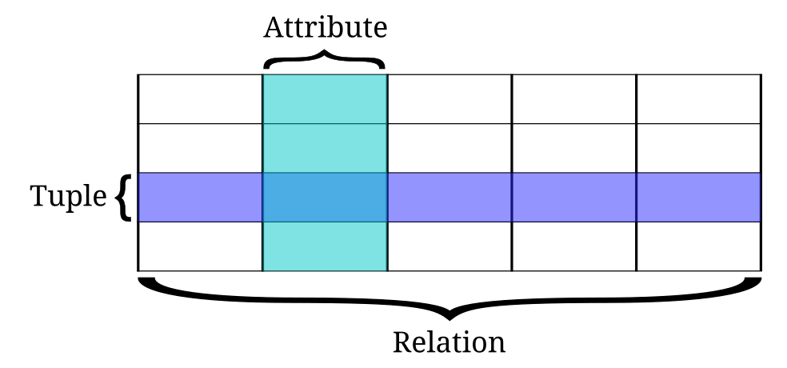
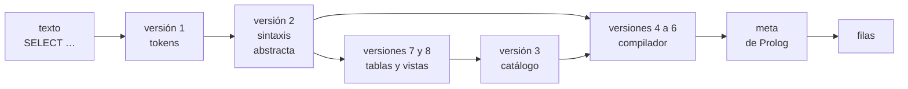

# Capítulo 86 — Proyecto: un mini-SQL en Prolog

El [capítulo 42](../capitulo-42-prolog-y-sql/index.md) tradujo a mano
consultas de SQL a metas de Prolog: una tabla es un predicado, una fila es
un hecho, una selección es una regla con una constante en el lugar de una
variable. Este capítulo hace que esa traducción la haga un programa. El
**mini-SQL** recibe sentencias de un subconjunto de SQL como texto
—`SELECT`, `INSERT`, `UPDATE`, `DELETE`, `CREATE TABLE`, `CREATE VIEW`—,
las analiza, verifica que las tablas y las columnas existan y que los
tipos concuerden, las traduce a metas de Prolog sobre los hechos de las
tablas de *Inscripciones*, y las ejecuta.



Los términos del modelo relacional: una **relación** es una tabla, una
**tupla** es una de sus filas y un **atributo** es una de sus columnas;
todos los valores de un atributo pertenecen a un mismo dominio. En
Prolog, la relación es un predicado, la tupla un hecho y el atributo una
posición de argumento. Imagen: Booyabazooka, dominio público, vía
[Wikimedia Commons](https://commons.wikimedia.org/wiki/File:Relational_database_terms.svg),
sin los rótulos en hindi del original.



El proyecto parte del apartado 8.2, «Prolog and Relational Data Bases»,
de *Prolog for Programmers* de Feliks Kluźniak y Stanisław Szpakowicz,
que traduce las operaciones del álgebra relacional a cláusulas y presenta
**Toy-Sequel**, un intérprete de un lenguaje parecido a SQL escrito en
Prolog: un escáner, un compilador de comandos que produce metas, un
catálogo de relaciones y una tabla de símbolos. El mini-SQL sigue esa
arquitectura con la sintaxis de SQL, para poder comparar sus resultados
con los de SQLite, y corrige un error de su compilador. La lista completa
de las fuentes está en las [Referencias](#referencias); el código es
propio.

El capítulo cumple los anuncios de los capítulos
[42](../capitulo-42-prolog-y-sql/index.md) (un intérprete de un
subconjunto de SQL escrito en Prolog) y
[85](../capitulo-85-proyecto-motor-datalog/index.md) (consultas en un
lenguaje como SQL, compiladas en metas de Prolog sobre un catálogo de
tablas). Usa las dos etapas de análisis del lenguaje de comandos del
[capítulo 21](../capitulo-21-gramaticas-dcg/index.md#2110-el-proyecto-un-lenguaje-de-comandos),
el programa como dato del
[capítulo 33](../capitulo-33-introspeccion-y-metainterpretes/index.md)
y la idea de la evaluación parcial del
[capítulo 35](../capitulo-35-transformacion-de-programas-y-compilacion/index.md#354-evaluacion-parcial):
resolver al compilar lo que no depende de los datos. Carga sin copiarlo
el módulo `base` del [capítulo 42](../capitulo-42-prolog-y-sql/index.md), con sus tablas y su esquema como
hechos. Todos los archivos son `% solo-local`, porque son módulos que
cargan otros.

## Objetivos del capítulo

Al terminar el capítulo, el lector puede:

- separar el análisis de un lenguaje en una etapa léxica y una
  sintáctica, y dar mensajes de error que señalen dónde falla el texto;
- describir las relaciones de una base en un catálogo con un generador y
  un marco de columnas, y resolver los nombres de columna con una tabla de
  símbolos por niveles;
- compilar una consulta en una meta de Prolog, y resolver al compilar las
  igualdades que se pueden resolver unificando, sabiendo dónde eso es
  correcto y dónde no;
- compilar la lógica de tres valores de SQL en metas de Prolog, con una
  meta para lo verdadero y otra para lo falso;
- ejecutar actualizaciones que ven el estado anterior entero y que
  cambian todas las filas o ninguna;
- comparar el resultado del intérprete con el de SQLite, y explicar
  cada diferencia entre Prolog y SQL que el
  [capítulo 42](../capitulo-42-prolog-y-sql/index.md) señaló.

!!! info "Tiempo estimado"
    Leer el capítulo, ejecutar sus ejemplos y hacer las actividades: **1:50 h**.
    Resolver los 5 ejercicios marcados con ★: **1:05 h**.
    Resolver los 11 ejercicios del final: **3:00 h**.

## 86.1 Un lenguaje de consultas sobre hechos

Las cuatro tablas académicas de *Inscripciones* son hechos del módulo
`base` del [capítulo 42](../capitulo-42-prolog-y-sql/index.md#421-tablas-filas-y-hechos):
`alumno/4`, `materia/3`, `correlativa/2` e `inscripcion/3`. La consulta
«el nombre y la nota de cada alumno inscripto en Análisis 1» se escribe
en SQL así:

```sql
SELECT a.nombre, i.nota
FROM alumnos a, inscripciones i
WHERE a.legajo = i.legajo AND i.materia = 'am1';
```

y el [capítulo 42](../capitulo-42-prolog-y-sql/index.md#422-el-algebra-relacional-en-clausulas)
la escribió en Prolog como una conjunción de dos llamadas que comparten
la variable del legajo. El mini-SQL produce esa meta a partir del texto:
`alumnos a` y `inscripciones i` dan un generador cada una; las dos
igualdades no se ejecutan, sino que se resuelven al compilar: la primera
une las variables del legajo, la segunda pone la constante `am1` en la
llamada a `inscripcion/3`.

```prolog
consulta([A, B]) :-
    base:alumno(C, A, _, _),
    base:inscripcion(C, am1, B).
```

Las filas son las soluciones: `[ana, 8]`, `[bruno, 4]`, `[carla, 7]`,
`[elena, null]` y `[facundo, 6]`, las mismas que da SQLite con la misma
sentencia sobre las mismas filas.

La traducción es directa en este ejemplo, pero no en general. El texto
hay que separarlo en palabras, números, cadenas y símbolos, y analizarlo
con una gramática que dé mensajes de error útiles. Los nombres de las
columnas hay que encontrarlos en las tablas del `FROM`, que pueden tener
alias, y en las de las consultas que contienen a una subconsulta. Las
igualdades que se resuelven al compilar ahorran casi todo el trabajo,
pero solo son correctas en una conjunción de primer nivel. SQL tiene un
tercer valor de verdad, «desconocido», para las comparaciones con `NULL`,
que Prolog no tiene. Los agregados necesitan la columna entera, no una
fila por vez. Y una actualización tiene que ver la tabla como estaba
antes de empezar, y cambiar todas las filas o ninguna.

## 86.2 El programa terminado

| Versión | Archivo | Agrega | Lo que no puede hacer todavía |
|---|---|---|---|
| 1 | `lexico.pl` | los tokens: nombres, cadenas, enteros y símbolos | analizar una sentencia |
| 2 | `sintaxis.pl` | la sintaxis abstracta de cada sentencia; errores con la posición | saber qué tablas existen |
| 3 | `catalogo.pl` | las relaciones con su generador y su marco; la tabla de símbolos | traducir |
| 4 | `ingenuo.pl` | el compilador de Toy-Sequel: generadores, filtro, igualdades unificadas | `OR`, `NOT` y `NULL` correctos |
| 5 | `consultas.pl` | condiciones en dos polaridades; `NULL`; `IN`, `EXISTS` y subconsultas | agregar, ordenar |
| 6 | `consultas.pl` | `DISTINCT`, `GROUP BY`, `HAVING`, `ORDER BY`, `LIMIT`, `UNION`, `INTERSECT`, `EXCEPT` | cambiar las tablas |
| 7 | `modificaciones.pl` | `CREATE TABLE`, `DROP TABLE`, `INSERT`, `DELETE`, `UPDATE` | relaciones calculadas |
| 8 | `vistas.pl` | `CREATE VIEW`, compilada en una cláusula | consultas recursivas |
| — | `minisql.pl` | `sql/2`, `sql/1`, `guion/2` y la sesión `sesion/0` | — |
| — | `comparacion.pl` | los pares SQL del [capítulo 42](../capitulo-42-prolog-y-sql/index.md) frente a SQLite | — |
| — | `costos.pl` | las mediciones que el capítulo imprime, con sus pruebas | — |

`sql/2`, de `minisql.pl`, ejecuta una sentencia y da su resultado como
un término; `sql/1` lo escribe como una tabla, con `NULL` donde el valor
es `null`; `mostrar_traduccion/1` escribe la meta en que se traduce una
consulta, como una cláusula de `consulta/1` cuyo argumento es la fila:

<!-- contexto: capitulo-86/minisql.pl -->
```prolog
?- sql("SELECT nombre, carrera FROM alumnos WHERE ingreso = 2023", R).
R = filas([nombre, carrera], [[ana, sistemas], [carla, civil]]).

?- sql("SELECT a.nombre, i.nota FROM alumnos a, inscripciones i WHERE a.legajo = i.legajo AND i.materia = 'am1'").
nombre   nota
-------  ----
ana      8
bruno    4
carla    7
elena    NULL
facundo  6
true.
```

```prolog
% mostrar_traduccion("SELECT a.nombre, i.nota FROM alumnos a, inscripciones i WHERE a.legajo = i.legajo AND i.materia = 'am1'").
consulta([A, B]) :-
    base:alumno(C, A, _, _),
    base:inscripcion(C, am1, B).
```

## 86.3 Versión 1: el analizador léxico

Toy-Sequel procesa un comando en tres fases: lo lee hasta el punto, lo
pasa por un escáner escrito como gramática, y entrega la lista de tokens
al compilador de comandos. El escáner clasifica los tokens en nombres,
cadenas, enteros y caracteres sueltos. `lexico.pl` hace lo mismo con la
notación de `library(dcg/basics)`, como `palabras//1` del
[capítulo 21](../capitulo-21-gramaticas-dcg/index.md#2110-el-proyecto-un-lenguaje-de-comandos):
`n(Nombre)` para una palabra, `s(Atomo)` para una cadena, `i(Entero)` para
un número, y el átomo del símbolo para los demás. Las palabras se pasan a
minúsculas, porque SQL no distingue mayúsculas en las palabras clave ni
en los nombres de tablas y columnas.

La página [El analizador léxico](lexico.md) muestra `tokens/2` y los no
terminales de cada clase de token, `token//1`, `cadena//1` y `simbolo//1`.

Una cadena admite una comilla escrita dos veces, como en SQL, y `!=` es
otra forma de `<>`. El signo menos es siempre un símbolo, nunca parte de
un número: `x-5` son tres tokens, y la gramática decide si es una resta.
Los comentarios de línea, de `--` hasta el final, se descartan con los
blancos.

<!-- contexto: capitulo-86/lexico.pl -->
```prolog
?- tokens("SELECT nombre FROM alumnos WHERE ingreso >= 2024", Ts).
Ts = [n(select), n(nombre), n(from), n(alumnos), n(where), n(ingreso), >=, i(2024)].

?- tokens("WHERE nombre <> 'O''Brien' -- un comentario", Ts).
Ts = [n(where), n(nombre), <>, s('O\'Brien')].

?- catch(tokens("a # b", Ts), E, true).
E = error(sql(caracter(#)), _).
```

Los errores del mini-SQL tienen todos la forma `error(sql(Motivo), _)`:
el motivo es un término que nombra el problema, y `sql/1` lo escribe.

## 86.4 Versión 2: la gramática de las sentencias

El compilador de comandos de Toy-Sequel es una gramática que produce
directamente la meta de Prolog: once partes, una por comando. La
gramática de `sintaxis.pl` produce en cambio la **sintaxis abstracta** de
la sentencia, un término, y la traducción es una etapa aparte. Así el
mismo término sirve a los dos compiladores del capítulo, el de la
[versión 4](#866-version-4-el-compilador-de-toy-sequel) y el de la
[versión 5](#867-version-5-condiciones-de-tres-valores), y a las vistas,
que guardan una consulta compilada.

Una consulta es `consulta(Cuerpo, Orden, Limite)`, y su cuerpo, una
`seleccion(Distinto, Items, Desde, Donde, Grupo, Teniendo)` o una
operación de conjuntos entre dos. Las condiciones son `y/2`, `o/2`,
`no/1`, `comparar/3`, `es_nulo/1`, `en/2` y `existe/1`; las expresiones,
`ent/1`, `cad/1`, `nulo`, `columna/1` y `columna/2`, los operadores
aritméticos, `agregado/3` y `subconsulta/1`. La precedencia de `OR`,
`AND` y `NOT` es la de SQL, de menor a mayor, y cada nivel tiene su no
terminal:

<!-- ejemplo: capitulo-86/sintaxis.pl predicado: condicion//1 resto_o//2 conjuncion_sql//1 resto_y//2 negacion//1 -->
```prolog
%!  condicion(-C)// is nondet.
%
%   Una condición: o/2, y/2, no/1, comparar/3, es_nulo/1, en/2, existe/1.
condicion(C) -->
    conjuncion_sql(A),
    resto_o(A, C).

%!  resto_o(+A, -C)// is nondet.
%
%   Las disyunciones que siguen a A, asociadas a izquierda.
resto_o(A, C) -->
    k(or), conjuncion_sql(B),
    resto_o(o(A, B), C).
resto_o(A, A) -->
    [].

%!  conjuncion_sql(-C)// is nondet.
%
%   Una o más negaciones unidas por AND.
conjuncion_sql(C) -->
    negacion(A),
    resto_y(A, C).

%!  resto_y(+A, -C)// is nondet.
%
%   Las conjunciones que siguen a A, asociadas a izquierda.
resto_y(A, C) -->
    k(and), negacion(B),
    resto_y(y(A, B), C).
resto_y(A, A) -->
    [].

%!  negacion(-C)// is nondet.
%
%   NOT seguido de una negación, o un predicado.
negacion(no(C)) -->
    k(not), negacion(C).
negacion(C) -->
    predicado(C).
```

`resto_o//2` y `resto_y//2` asocian a izquierda con un acumulador, la
forma del [capítulo 21](../capitulo-21-gramaticas-dcg/index.md#217-recursion-a-izquierda)
para una gramática que no puede tener recursión a izquierda. Una
selección reúne las partes de la sentencia, y las condiciones de los
`JOIN … ON` se agregan a la de `WHERE`: `a JOIN b ON c` es lo mismo que
`a, b` con `c` en la conjunción.

<!-- ejemplo: capitulo-86/sintaxis.pl predicado: nucleo//1 -->
```prolog
%!  nucleo(-S)// is nondet.
%
%   seleccion(Distinto, Items, Desde, Donde, Grupo, Teniendo). Las
%   condiciones ON de los JOIN se agregan a la de WHERE.
nucleo(seleccion(D, Items, Desde, Donde, Grupo, Teniendo)) -->
    k(select), distinto(D), items(Items),
    k(from), desde(Desde, Ons),
    donde(C),
    { append(Ons, [C], Cs),
      conjuncion(Cs, Donde) },
    grupo(Grupo),
    teniendo(Teniendo).
```

<!-- contexto: capitulo-86/sintaxis.pl -->
```prolog
?- analizar("SELECT nombre FROM alumnos WHERE carrera = 'civil'", S).
S = consulta(seleccion(no, [item(columna(nombre), sin_alias)], [desde(alumnos, alumnos)], comparar(=, columna(carrera), cad(civil)), [], cierto), [], sin_limite).

?- analizar("SELECT nombre FROM alumnos WHERE NOT ingreso = 2023 OR carrera = 'civil' AND ingreso > 2024", consulta(seleccion(_, _, _, C, _, _), _, _)).
C = o(no(comparar(=, columna(ingreso), ent(2023))), y(comparar(=, columna(carrera), cad(civil)), comparar(>, columna(ingreso), ent(2024)))).
```

**Los errores de sintaxis.** Una gramática que falla no dice dónde: la
vuelta atrás prueba todas las alternativas y, al final, `phrase/2`
falla. Toy-Sequel muestra el token problemático y los que le siguen. El
mini-SQL pasa todos los tokens por un único terminal, `t//1`, que anota
el punto más lejano al que llegó alguna alternativa; el error nombra los
tokens que empiezan ahí. La página
[Los errores de sintaxis y de tipos](errores.md) lo muestra.

## 86.5 Versión 3: el catálogo y la tabla de símbolos

Toy-Sequel guarda cada relación en un procedimiento de tres argumentos,
`'r e l'/3`: el nombre, un **generador** —la llamada que da las tuplas—
y un **marco**, la lista de los atributos con su nombre, su tipo y la
variable que ocupan en el generador. `catalogo.pl` guarda lo mismo en
`relacion/4`, con la clase de la relación (tabla o vista) y con la
admisión de `NULL` de cada columna. Al cargarse, describe las cuatro
tablas del [capítulo 42](../capitulo-42-prolog-y-sql/restricciones.md#claves-restricciones-y-actualizaciones)
a partir de su esquema como hechos, sin copiar ninguna fila: el
generador de `alumnos` es `base:alumno/4`.

<!-- ejemplo: capitulo-86/catalogo.pl predicado: describir_tabla/3 columna_de/4 -->
```prolog
%!  describir_tabla(+T, +Predicado, +Columnas:list) is det.
%
%   Agrega al catálogo la tabla T del capítulo 42, guardada en
%   base:Predicado, con sus columnas Nombre-Tipo, su clave y sus rangos.
describir_tabla(T, Predicado, Columnas) :-
    maplist(columna_de(T), Columnas, Cols, Variables),
    Cabeza =.. [Predicado|Variables],
    assertz(relacion(T, tabla, base:Cabeza, Cols)),
    forall(base:clave(T, Cs), assertz(restriccion(T, clave(Cs)))),
    forall(base:rango(T, C, Min, Max),
           assertz(restriccion(T, rango(C, Min, Max)))).

%!  columna_de(+T, +NombreTipo, -Col, -Variable) is det.
%
%   Col es la descripción de la columna Nombre-Tipo de T, con Variable.
columna_de(T, Nombre-Tipo, col(Nombre, Tipo, Nulo, V), V) :-
    (   base:admite_nulo(T, Nombre)
    ->  Nulo = nulo
    ;   Nulo = no_nulo
    ).
```

<!-- contexto: capitulo-86/catalogo.pl -->
```prolog
?- relacion(materias, Clase, Generador, Columnas).
Clase = tabla,
Generador = base:materia(_A, _B, _C),
Columnas = [col(codigo, texto, no_nulo, _A), col(nombre, texto, no_nulo, _B), col(anio, entero, no_nulo, _C)].
```

Una cláusula del catálogo tiene variables, y cada consulta de
`relacion/4` da una copia nueva de ellas: dos apariciones de la misma
tabla en un `FROM`, como `empleados e, empleados j`, reciben generadores
independientes. Las tablas que se crean después viven en el módulo
`relaciones`; Toy-Sequel agrega un blanco delante del nombre de cada
relación para que no choque con otros procedimientos, y un módulo cumple
esa función sin cambiar el nombre.

**La tabla de símbolos.** `marcos/3` da el generador y el marco de cada
tabla de un `FROM`, con su alias. La tabla de símbolos es una lista de
niveles: el primero es el de la consulta que se compila, y los
siguientes, los de las consultas que la contienen. `buscar_columna/4`
busca un nombre desde el nivel actual hacia afuera:

<!-- ejemplo: capitulo-86/catalogo.pl predicado: buscar_columna/4 buscar/5 candidatas/3 -->
```prolog
%!  buscar_columna(+Ref, +Pila:list, -Col, -Nivel:integer) is det.
%
%   Col es la columna col(Nombre, Tipo, Nulo, Variable) a la que se refiere
%   Ref, columna(C) o columna(Alias, C), en la tabla de símbolos Pila: una
%   lista de niveles, el de la consulta actual primero y después los de
%   las consultas que la contienen; cada nivel es la lista de los marcos
%   de su FROM. Nivel es 0 si la columna es de la consulta actual. Un
%   nombre sin calificar debe estar en un solo marco de su nivel.
buscar_columna(Ref, Pila, Col, Nivel) :-
    buscar(Pila, 0, Ref, Col, Nivel).

%!  buscar(+Pila:list, +N:integer, +Ref, -Col, -Nivel:integer) is det.
%
%   Busca Ref desde el nivel N de Pila hacia afuera.
buscar([], _, Ref, _, _) :-
    nombre_ref(Ref, Nombre),
    throw(error(sql(columna_desconocida(Nombre)), _)).
buscar([Marcos|Pila], N, Ref, Col, Nivel) :-
    candidatas(Ref, Marcos, Cols),
    (   Cols = [Col]
    ->  Nivel = N
    ;   Cols = [_, _|_]
    ->  nombre_ref(Ref, Nombre),
        throw(error(sql(columna_ambigua(Nombre)), _))
    ;   N1 is N + 1,
        buscar(Pila, N1, Ref, Col, Nivel)
    ).

%!  candidatas(+Ref, +Marcos:list, -Cols:list) is det.
%
%   Cols son las columnas de Marcos que Ref puede nombrar. Una columna
%   calificada con un alias de este nivel que no está en su marco es un
%   error.
candidatas(columna(A, C), Marcos, Cols) :-
    (   memberchk(marco(A, Cs), Marcos)
    ->  (   memberchk(col(C, T, Nulo, V), Cs)
        ->  Cols = [col(C, T, Nulo, V)]
        ;   nombre_ref(columna(A, C), Nombre),
            throw(error(sql(columna_desconocida(Nombre)), _))
        )
    ;   Cols = []
    ).
candidatas(columna(C), Marcos, Cols) :-
    con_columna(Marcos, C, Cols).
```

```prolog
?- marcos([desde(alumnos, a), desde(inscripciones, i)], Gs, Ms), buscar_columna(columna(nombre), [Ms], Col, Nivel).
Gs = [base:alumno(_A, _B, _C, _D), base:inscripcion(_E, _F, _G)],
Ms = [marco(a, [col(legajo, entero, no_nulo, _A), col(nombre, texto, no_nulo, _B), col(carrera, texto, no_nulo, _C), col(ingreso, entero, no_nulo, _D)]), marco(i, [col(legajo, entero, no_nulo, _E), col(materia, texto, no_nulo, _F), col(nota, entero, nulo, _G)])],
Col = col(nombre, texto, no_nulo, _B),
Nivel = 0.

?- catch((marcos([desde(alumnos, a), desde(inscripciones, i)], _, Ms), buscar_columna(columna(legajo), [Ms], _, _)), E, true).
E = error(sql(columna_ambigua(legajo)), _).

?- findall(Col-Nivel, ( marcos([desde(alumnos, a)], _, Afuera), marcos([desde(materias, m)], _, Adentro), buscar_columna(columna(legajo), [Adentro, Afuera], Col, Nivel) ), Rs).
Rs = [col(legajo, entero, no_nulo, _)-1].
```

La primera respuesta muestra lo que hace el catálogo: la columna
`nombre` es la variable `_B`, la misma que ocupa el segundo argumento del
generador de `alumnos`. Compilar una referencia a una columna es
encontrar esa variable. Toy-Sequel resuelve un nombre sin calificar con
la relación de más a la izquierda que lo tiene; SQL lo rechaza si es
ambiguo, y `buscar/5` hace lo mismo. Un nombre que no está en el nivel
actual se busca en los de afuera: es una columna de la consulta que
contiene a la subconsulta, `Nivel = 1`. `con_columna/3` recorre los
marcos con `memberchk/2` y no con `findall/3`, porque `findall/3`
copiaría las variables y la columna encontrada dejaría de ser la del
generador.

## 86.6 Versión 4: el compilador de Toy-Sequel

`ingenuo.pl` traduce un `SELECT` sin agregados ni subconsultas como lo
hace Toy-Sequel: los generadores del `FROM` en orden, y después el filtro
de `WHERE`, una meta que se ejecuta con las variables de las columnas ya
ligadas. El producto de las tablas son los generadores en sucesión, y la
condición los restringe. Las igualdades reciben un trato especial, que
Kluźniak y Szpakowicz describen así: se procesan al compilar, uniendo las
variables, de modo que en los generadores aparecen menos variables
distintas.

<!-- ejemplo: capitulo-86/ingenuo.pl predicado: filtro/3 -->
```prolog
%!  filtro(+Condicion, +Pila:list, -Meta) is det.
%
%   Meta es la condición de WHERE con las metas de Prolog: la conjunción,
%   la disyunción y \+. Una igualdad se resuelve al compilar.
filtro(cierto, _, true).
filtro(y(A, B), Pila, Meta) :-
    filtro(A, Pila, MA),
    filtro(B, Pila, MB),
    conjuncion([MA, MB], Meta).
filtro(o(A, B), Pila, (MA ; MB)) :-
    filtro(A, Pila, MA),
    filtro(B, Pila, MB).
filtro(no(A), Pila, \+ MA) :-
    filtro(A, Pila, MA).
filtro(comparar(Op, E1, E2), Pila, Meta) :-
    valor(E1, Pila, V1, Tipo),
    valor(E2, Pila, V2, _),
    (   Op == (=)
    ->  (   V1 = V2
        ->  Meta = true
        ;   Meta = fail
        )
    ;   once(comparacion(Tipo, Op, Predicado)),
        Meta =.. [Predicado, V1, V2]
    ).
```

<!-- contexto: capitulo-86/ingenuo.pl -->
```prolog
?- traducir_ingenuo("SELECT nombre FROM alumnos WHERE carrera = 'civil'", Fila, Meta).
Fila = [_A],
Meta = base:alumno(_, _A, civil, _).
```

La igualdad desapareció: la constante `civil` está en la llamada, y el
filtro es `true`. Es la selección «mejor todavía» de Kluźniak y
Szpakowicz, sustituir la constante en lugar de comparar, y la evaluación
parcial del [capítulo 35](../capitulo-35-transformacion-de-programas-y-compilacion/index.md#354-evaluacion-parcial):
lo que no depende de los datos se hace una sola vez. La ganancia es
grande en una reunión. La consulta de la
[sección 86.1](#861-un-lenguaje-de-consultas-sobre-hechos), escrita con
`NOT (a.legajo <> i.legajo)` en lugar de `a.legajo = i.legajo`, da las
mismas filas, pero el compilador de la versión 5 no puede resolver esa
igualdad al compilar, y la meta recorre el producto entero:

<!-- contexto: capitulo-86/costos.pl -->
```prolog
% mostrar_traduccion("SELECT a.nombre, i.nota FROM alumnos a, inscripciones i WHERE NOT (a.legajo <> i.legajo) AND NOT (i.materia <> 'am1')").
consulta([A, B]) :-
    base:alumno(C, A, _, _),
    base:inscripcion(D, E, B),
    C=:=D,
    E==am1.
```

```prolog
?- inferencias("SELECT a.nombre, i.nota FROM alumnos a, inscripciones i WHERE a.legajo = i.legajo AND i.materia = 'am1'", N1), inferencias("SELECT a.nombre, i.nota FROM alumnos a, inscripciones i WHERE NOT (a.legajo <> i.legajo) AND NOT (i.materia <> 'am1')", N2).
N1 = 22,
N2 = 158.
```

Con siete alumnos y diecisiete inscripciones, la diferencia es de siete
veces. Crece con el producto: `numeros(300)`, de `costos.pl`, crea una
tabla con los enteros de 1 a 300, y su reunión consigo misma por la
igualdad cuesta 910 inferencias con la igualdad resuelta al compilar y
270 610 sin ella, trescientas veces más (prueba `costos:reunion_numeros`;
las dos de la tabla de alumnos, `costos:reunion_inscripciones`). Con la
igualdad unificada, el segundo generador se llama con el primer argumento
ligado, y el índice de SWI-Prolog encuentra la fila sin recorrer la
tabla.

**El error de Toy-Sequel.** La igualdad al compilar es correcta en una
conjunción: si la condición entera exige `carrera = 'civil'`, solo
interesan las filas con esa constante. Bajo `OR` o bajo `NOT` deja de
serlo. Toy-Sequel la aplica en cualquier lugar de la condición, y la
segunda igualdad sobre la misma columna, que ya tiene la constante
`civil`, no se puede unificar con `industrial`: se compila como `fail`.

```prolog
?- consulta_ingenua("SELECT nombre FROM alumnos WHERE carrera = 'civil' OR carrera = 'industrial'", Fs).
Fs = [[carla], [elena]].

?- traducir_ingenuo("SELECT nombre FROM alumnos WHERE NOT carrera = 'civil'", Fila, Meta).
Fila = [_A],
Meta = (base:alumno(_, _A, civil, _), \+true).
```

La primera consulta pierde a los dos alumnos de industrial, y la
segunda no da ninguna fila, cuando SQLite da cinco: el generador solo
recorre los alumnos de civil, y el filtro `\+ true` los rechaza a todos.
La prosa de Kluźniak y Szpakowicz no pone ninguna condición a la
igualdad al compilar, y la primera cláusula de su procedimiento de
comparaciones la hace sin examinar el contexto; el resto del listado no
se puede leer en la conversión del libro que usa el curso para saber si `not` y `or` la
evitan.

Falta además `NULL`. Una comparación de Prolog con el átomo `null` lanza
un error, como mostró la
[sección 42.4](../capitulo-42-prolog-y-sql/index.md#424-donde-difieren-bolsas-conjuntos-y-null):

```prolog
?- catch(consulta_ingenua("SELECT legajo FROM inscripciones WHERE nota > 5", Fs), E, true).
E = error(type_error(evaluable, null/0), context(system:(>)/2, _)).
```

!!! question "Actividad"
    Predecir qué da `consulta_ingenua/2` con
    `WHERE carrera = 'civil' AND NOT ingreso = 2023`, y qué daría SQL.
    Comprobarlo. ¿Qué igualdad es correcta resolver al compilar y cuál no?

## 86.7 Versión 5: condiciones de tres valores

En SQL, una condición es verdadera, falsa o desconocida, y `WHERE` deja
pasar solo las filas en que es verdadera. `NOT` cambia verdadera por
falsa y falsa por verdadera, y deja la desconocida como está. Por eso
`NOT (nota >= 6)` no es «lo que no cumple `nota >= 6`»: una inscripción
sin nota no cumple ninguna de las dos.

`consultas.pl` compila cada condición en **dos metas**, según una
polaridad: con `verdadera`, la meta se cumple cuando la condición es
verdadera; con `falsa`, cuando es falsa. La tercera posibilidad es la
que no cumple ninguna de las dos. `NOT` no genera ninguna meta: compila
su argumento con la polaridad opuesta. La conjunción verdadera es la
conjunción de las verdaderas, y la falsa, la disyunción de las falsas;
la disyunción, al revés. Una comparación verdadera exige que los dos
valores no sean `NULL` y que se cumpla el operador; una falsa, que no
sean `NULL` y que se cumpla el operador contrario. `NOT` desaparece de
la meta, empujado hacia las comparaciones como en las leyes de De
Morgan.

<!-- ejemplo: capitulo-86/consultas.pl predicado: condicion/5 opuesta/2 negar/2 -->
```prolog
%!  condicion(+C, +Contexto, +Pila:list, +Polaridad, -Meta) is det.
%
%   Meta se cumple cuando la condición C es verdadera, si Polaridad es
%   verdadera, o cuando es falsa, si Polaridad es falsa. Si C es
%   desconocida, no se cumple ninguna de las dos.
condicion(cierto, _, _, Pol, Meta) :-
    (   Pol == verdadera
    ->  Meta = true
    ;   Meta = fail
    ).
condicion(prueba(G), _, _, verdadera, G).
condicion(y(A, B), Contexto, Pila, Pol, Meta) :-
    condicion(A, Contexto, Pila, Pol, MA),
    condicion(B, Contexto, Pila, Pol, MB),
    (   Pol == verdadera
    ->  conjuncion([MA, MB], Meta)
    ;   Meta = (MA ; MB)
    ).
condicion(o(A, B), Contexto, Pila, Pol, Meta) :-
    condicion(A, Contexto, Pila, Pol, MA),
    condicion(B, Contexto, Pila, Pol, MB),
    (   Pol == verdadera
    ->  Meta = (MA ; MB)
    ;   conjuncion([MA, MB], Meta)
    ).
condicion(no(A), Contexto, Pila, Pol, Meta) :-
    opuesta(Pol, Pol1),
    condicion(A, Contexto, Pila, Pol1, Meta).
condicion(comparar(Op, E1, E2), Contexto, Pila, Pol, Meta) :-
    expresion(E1, Contexto, Pila, V1, T1, N1, M1),
    expresion(E2, Contexto, Pila, V2, T2, N2, M2),
    compatibles(T1, T2, Clase),
    (   Clase == nulo
    ->  Meta = fail
    ;   (   Pol == verdadera
        ->  Op1 = Op
        ;   negar(Op, Op1)
        ),
        prueba(Clase, Op1, V1, V2, Prueba),
        no_nulos([V1-N1, V2-N2], Controles),
        append([[M1, M2], Controles, [Prueba]], Metas),
        conjuncion(Metas, Meta)
    ).
condicion(es_nulo(E), Contexto, Pila, Pol, Meta) :-
    expresion(E, Contexto, Pila, V, _, Nulo, M),
    (   Nulo == no_nulo
    ->  (   Pol == verdadera
        ->  Meta = fail
        ;   Meta = M
        )
    ;   Pol == verdadera
    ->  conjuncion([M, V == null], Meta)
    ;   conjuncion([M, V \== null], Meta)
    ).
condicion(en(E, Conjunto), Contexto, Pila, Pol, Meta) :-
    pertenece(Conjunto, E, Contexto, Pila, Pol, Meta).
condicion(existe(Q), _, Pila, Pol, Meta) :-
    compilar_consulta(Q, Pila, MQ, _, _),
    (   Pol == verdadera
    ->  Meta = once(MQ)
    ;   Meta = (\+ MQ)
    ).

%!  opuesta(?Pol, ?Opuesta) is det.
%
%   verdadera y falsa son opuestas.
opuesta(verdadera, falsa).
opuesta(falsa, verdadera).

%!  negar(+Op, -Negado) is det.
%
%   El operador de comparación que es verdadero cuando Op es falso.
negar(=, <>).
negar(<>, =).
negar(<, >=).
negar(>=, <).
negar(>, <=).
negar(<=, >).
```

<!-- ejemplo: capitulo-86/consultas.pl predicado: no_nulos/2 -->
```prolog
%!  no_nulos(+Pares:list, -Controles:list) is det.
%
%   Controles tiene V \== null para cada V-Nulo de Pares que puede ser
%   NULL; un valor constante o de una columna NOT NULL no lo necesita.
no_nulos([], []).
no_nulos([V-Nulo|Ps], Controles) :-
    (   ( Nulo == no_nulo ; nonvar(V) )
    ->  Controles = Resto
    ;   Controles = [V \== null|Resto]
    ),
    no_nulos(Ps, Resto).
```

El control de `NULL` aparece solo donde hace falta: una constante no es
`NULL`, y una columna declarada `NOT NULL` tampoco. El catálogo sabe
cuáles son, y el compilador las aprovecha:

<!-- contexto: capitulo-86/consultas.pl -->
```prolog
% mostrar_traduccion("SELECT legajo, materia FROM inscripciones WHERE NOT (nota >= 6)").
consulta([A, B]) :-
    base:inscripcion(A, B, C),
    C\==null,
    C<6.
```

```prolog
% mostrar_traduccion("SELECT nombre FROM alumnos WHERE NOT (carrera = 'civil' OR ingreso > 2024)").
consulta([A]) :-
    base:alumno(_, A, B, C),
    B\==civil,
    C=<2024.
```

```prolog
?- filas("SELECT COUNT(*) FROM inscripciones WHERE nota >= 6", _, A), filas("SELECT COUNT(*) FROM inscripciones WHERE NOT (nota >= 6)", _, B), filas("SELECT COUNT(*) FROM inscripciones WHERE nota IS NULL", _, C).
A = [[10]],
B = [[4]],
C = [[3]].
```

Las diez aprobadas, las cuatro reprobadas y las tres sin nota suman las
diecisiete inscripciones: son los números de SQLite de la
[sección 42.4](../capitulo-42-prolog-y-sql/index.md#424-donde-difieren-bolsas-conjuntos-y-null),
donde la versión en Prolog escrita a mano daba siete del lado de la
negación. El compilador escribe el `integer(N)` que aquel capítulo tuvo
que recordar.

La compilación con dos polaridades es el patrón 97:

!!! example "Patrón 97 — Una condición, dos metas"
    **Problema.** Una condición se compila en una meta de Prolog, pero
    tiene más resultados que la meta: en SQL es verdadera, falsa o
    desconocida, y la falla de una meta no distingue la falsa de la
    desconocida.

    **Versión ingenua.** Compilar cada condición en una sola meta y la
    negación en `\+` de esa meta, como `filtro/3` de la
    [versión 4](#866-version-4-el-compilador-de-toy-sequel). `\+` cuenta
    como falsa toda condición que no se prueba: `NOT (nota >= 6)` deja
    pasar también las inscripciones sin nota, y la versión escrita a mano
    de la
    [sección 42.4](../capitulo-42-prolog-y-sql/index.md#424-donde-difieren-bolsas-conjuntos-y-null)
    da siete inscripciones en lugar de cuatro.

    **Patrón.** Compilar cada condición con una **polaridad**, `verdadera`
    o `falsa`, en la meta que se cumple cuando la condición tiene ese
    valor (`condicion/5`). La negación no genera meta: compila su
    argumento con la polaridad opuesta (`opuesta/2`). La conjunción falsa
    es la disyunción de las falsas, y la disyunción falsa, la conjunción;
    una comparación falsa usa el operador contrario (`negar/2`) y exige,
    como la verdadera, que sus valores no sean `NULL`. El tercer valor no
    necesita meta propia: es el que no cumple ninguna de las dos. La
    negación queda empujada hasta las comparaciones, y solo las
    subconsultas falsas, `NOT EXISTS` y `NOT IN`, conservan un `\+`. Como el
    [Patrón 63](../patrones.md#63-estado-como-resultado-no-como-falla),
    la falsedad pasa a ser algo que se prueba, y no la falla de una meta.

    **Cuándo no usarlo.** Cuando la lógica tiene dos valores y el mundo
    es cerrado, como en un lenguaje de consultas sobre hechos sin `NULL`:
    `\+` de la meta verdadera ya es la falsa, y la segunda polaridad
    duplica el compilador sin cambiar ninguna respuesta.

**Dónde se resuelven las igualdades.** `igualdades/3` aplica la
optimización de Toy-Sequel solo donde es correcta: en la conjunción de
primer nivel de `WHERE`, entre dos columnas del mismo tipo o entre una
columna y una constante, y siempre que una de las columnas sea de la
consulta que se compila. Si alguna de las columnas unificadas admite
`NULL`, deja en la condición una prueba `V \== null`, porque en SQL
`NULL = NULL` no es verdadero.

<!-- ejemplo: capitulo-86/consultas.pl predicado: igualdades/3 igualdad/3 unificable/2 -->
```prolog
%!  igualdades(+Condicion, +Pila:list, -Resto) is det.
%
%   Resuelve al compilar, unificando, las igualdades de la conjunción de
%   primer nivel de Condicion entre dos columnas del mismo tipo o entre
%   una columna y una constante, con al menos una columna de la consulta
%   actual. Resto es la condición que queda, con prueba(V \== null) si una
%   de las columnas unificadas puede ser NULL.
igualdades(Condicion, Pila, Resto) :-
    conjuntos(Condicion, Cs),
    maplist(igualdad(Pila), Cs, Restos),
    append(Restos, Quedan),
    reconstruir(Quedan, Resto).

%!  igualdad(+Pila:list, +C, -Quedan:list) is det.
%
%   Si C es una igualdad que se puede resolver al compilar, la resuelve y
%   Quedan son los controles de NULL que hacen falta; si no, Quedan = [C].
igualdad(Pila, C, Quedan) :-
    C = comparar(=, E1, E2),
    simple(E1, Pila, V1, T1, N1, L1),
    simple(E2, Pila, V2, T2, N2, L2),
    unificable(L1, L2),
    compatibles(T1, T2, _),
    T1 == T2,
    V1 = V2,
    !,
    (   ( N1 == nulo ; N2 == nulo ),
        var(V1)
    ->  Quedan = [prueba(V1 \== null)]
    ;   Quedan = []
    ).
igualdad(_, C, [C]).

%!  unificable(+L1, +L2) is semidet.
%
%   Una igualdad entre lugares L1 y L2 se puede resolver unificando: una
%   columna de la consulta actual con otra columna o con una constante.
unificable(0, _) :-
    !.
unificable(_, 0).
```

```prolog
?- filas("SELECT nombre FROM alumnos WHERE carrera = 'civil' OR carrera = 'industrial'", Ns, Fs).
Ns = [nombre],
Fs = [[carla], [elena], [facundo], [gabriela]].

?- filas("SELECT nombre FROM alumnos WHERE NOT carrera = 'civil'", Ns, Fs).
Ns = [nombre],
Fs = [[ana], [bruno], [diego], [facundo], [gabriela]].
```

La restricción de `igualdades/3` es el patrón 98:

!!! example "Patrón 98 — La igualdad se unifica solo en la conjunción positiva"
    **Problema.** Un compilador de consultas traduce las igualdades entre
    columnas, o entre una columna y una constante. Compilarlas como
    comparaciones que se ejecutan después de los generadores recorre el
    producto de las tablas; unificarlas al compilar liga los argumentos
    de los generadores, y el índice encuentra las filas sin recorrerlas.

    **Versión ingenua.** Unificar toda igualdad, en cualquier lugar de la
    condición, como `filtro/3` de Toy-Sequel. Bajo `OR`, la segunda
    igualdad sobre la misma columna ya no unifica y se compila como
    `fail`: `carrera = 'civil' OR carrera = 'industrial'` pierde a los
    alumnos de industrial. Bajo `NOT`, el generador queda restringido a
    las filas que la negación rechaza, y `NOT carrera = 'civil'` no da
    ninguna fila.

    **Patrón.** Resolver al compilar solo las igualdades de la conjunción
    de primer nivel de la condición (`igualdades/3`), que toda fila de la
    respuesta tiene que cumplir, entre valores del mismo tipo y con una
    columna de la consulta que se compila (`unificable/2`). Las que están
    bajo `OR` o bajo `NOT` se compilan como comparaciones. Si una de las
    columnas unificadas admite `NULL`, queda en la condición el control
    `V \== null`. Es la evaluación parcial del
    [Patrón 50](../patrones.md#50-especializar-el-interprete) restringida
    al contexto en que es correcta: la reunión de `numeros(300)` consigo
    misma cuesta 910 inferencias en lugar de 270 610.

    **Cuándo no usarlo.** Cuando la igualdad del lenguaje no es la
    unificación: un entero y un real, `1` y `1.0`, son iguales en SQL y
    no unifican, y dos textos comparados sin distinguir mayúsculas
    tampoco; unificar daría menos filas. Por eso `igualdad/3` exige el
    mismo tipo en las dos columnas. Y cuando las dos columnas son de una
    consulta de afuera: la unificación, hecha al compilar la
    subconsulta, valdría para toda la consulta de afuera, también donde
    la subconsulta está negada; `unificable/2` exige por eso una columna
    de la consulta actual.

Las condiciones que quedan forman el filtro, que se prueba con `once/1`:
una fila pasa o no pasa, aunque la condición se cumpla de dos formas,
como en `OR` cuando las dos ramas son verdaderas. Un filtro hecho solo
de comparaciones no deja alternativas y se escribe sin `once/1`.

**Subconsultas.** Una subconsulta se compila con la tabla de símbolos de
la consulta que la contiene, con un nivel más: una columna de afuera es
una variable que el generador de afuera ya ligó cuando la subconsulta se
ejecuta, y la correlación no necesita nada más. `NOT EXISTS` es la
negación de la meta de la subconsulta, y `x IN (…)` es verdadera si algún
valor es igual a `x`, y falsa si `x` no es `NULL`, ninguno es igual y
ninguno es `NULL`. La página [Las subconsultas](subconsultas.md) muestra
las traducciones.

**Los tipos.** `expresion/7` da el tipo de cada expresión, y
`compatibles/3` rechaza una comparación entre un número y un texto
antes de ejecutar nada: es la interfaz restringida que Kluźniak y
Szpakowicz recomiendan poner entre el usuario y Prolog, que verifica los
tipos y la integridad antes de traducir
([Los errores de sintaxis y de tipos](errores.md#los-errores-de-tipos)).

!!! question "Actividad"
    Predecir la meta de `SELECT legajo FROM inscripciones WHERE NOT (nota
    < 4 OR nota > 8)` y cuántas filas da. Comprobarlo con
    `mostrar_traduccion/1` y `filas/3`.

## 86.8 Versión 6: el resultado entero

Hasta aquí, cada fila del resultado sale de una solución de la meta, una
por vez, sin construir el resultado: es el bucle de falla con que
Toy-Sequel muestra las tuplas. Kluźniak y Szpakowicz observan que un
agregado no puede funcionar así: necesita la columna entera, y la
obtienen con `bagof/3`. Lo mismo vale para `DISTINCT`, `ORDER BY`,
`LIMIT` y las operaciones de conjuntos. La versión 6 junta las filas con
`findall/3`, las procesa y las entrega de nuevo de a una con `member/2`,
de modo que toda consulta compilada conserva la misma forma: una meta que
da una fila por solución. La página [El resultado entero](resultado.md)
presenta los grupos, los agregados con `NULL`, el orden estable con
`NULL` primero, el límite y las operaciones de conjuntos:

```prolog
?- filas("SELECT carrera, COUNT(*) AS n FROM alumnos GROUP BY carrera HAVING COUNT(*) >= 2 ORDER BY n DESC, carrera", Ns, Fs).
Ns = [carrera, n],
Fs = [[sistemas, 3], [civil, 2], [industrial, 2]].
```

## 86.9 Versión 7: las sentencias que cambian las tablas

`modificaciones.pl` ejecuta `CREATE TABLE`, `DROP TABLE`, `INSERT`,
`DELETE` y `UPDATE`. `CREATE TABLE` agrega una relación al catálogo y
declara su predicado dinámico en el módulo `relaciones`. Las otras tres
sentencias calculan primero, sobre el estado anterior, todas las filas
que la tabla tendrá después; verifican los tipos, `NOT NULL`, los rangos
y la clave primaria; y solo entonces reemplazan las filas de la tabla.
Una sentencia cambia todas las filas o ninguna, y una subconsulta de su
condición ve la tabla como estaba antes de empezar, como exige SQL;
Toy-Sequel, en cambio, retira y agrega cada tupla dentro del bucle de
falla. La página [Las sentencias que cambian las tablas](modificaciones.md)
muestra la actualización, las restricciones y la conversación de
Kluźniak y Szpakowicz con Toy-Sequel, reproducida en el mini-SQL con los
mismos resultados que su libro.

## 86.10 Versión 8: las vistas

Kluźniak y Szpakowicz llaman vista a una relación que se calcula en lugar
de guardarse, y proponen las vistas definidas como la primera extensión
de Toy-Sequel. `vistas.pl` compila la consulta de `CREATE VIEW` una sola
vez y la guarda como una cláusula del módulo `relaciones`, cuya cabeza
lleva los valores de una fila; para quien la usa en un `FROM`, su
generador no se distingue del de una tabla. La página
[Las vistas](vistas.md) muestra la cláusula que resulta, que es la regla
`aprobada/3` del [capítulo 42](../capitulo-42-prolog-y-sql/index.md#422-el-algebra-relacional-en-clausulas),
y su relación con las reglas de Datalog del
[capítulo 85](../capitulo-85-proyecto-motor-datalog/index.md).

## 86.11 El mini-SQL frente al SQL del capítulo 42

La página [El mini-SQL frente a SQLite](sqlite.md) ejecuta en el mini-SQL
las sentencias de las 42 verificaciones de los ejercicios del
[capítulo 42](../capitulo-42-prolog-y-sql/index.md#ejercicios) que su
subconjunto admite, y compara las filas con las de SQLite 3.50: coinciden
las 42 (prueba `comparacion:resumen`), incluidas las cinco en que la
traducción directa a Prolog del [capítulo 42](../capitulo-42-prolog-y-sql/index.md) da otras filas que SQL. La
página resume, diferencia por diferencia, qué hace el Prolog escrito a
mano y qué hace el mini-SQL.

!!! success "Criterios de calidad"
    | Criterio | En este capítulo |
    |---|---|
    | C1 | cada predicado declara modos y determinación; las gramáticas son `nondet` y solo se llaman dentro de una condición de `->` o con `phrase/2` en `analizar_tokens/2`, que es `det`; los compiladores y las sentencias son `det` y lanzan `error(sql(Motivo), _)` |
    | C2 | representaciones limpias: tokens `n/1`, `s/1`, `i/1`; sintaxis abstracta `consulta/3`, `seleccion/6`, `y/2`, `o/2`, `no/1`, `comparar/3`; columnas `col/4`; marcos `marco/2` |
    | C3 | las tablas son las del [capítulo 42](../capitulo-42-prolog-y-sql/index.md), cargadas sin copiarlas; los resultados se comparan con los de SQLite en 42 pares |
    | C5 | toda sentencia incorrecta produce un error que la nombra antes de ejecutar nada; una actualización que viola una restricción no cambia ninguna fila |
    | C6 | el análisis y la compilación son puros; los efectos están en `modificaciones.pl` y `vistas.pl`, y cada uno reemplaza el estado entero o no lo toca |
    | C7 | 168 pruebas en diez archivos y 17 más sobre las soluciones; `costos.plt` verifica las cuatro cifras de inferencias dentro de un 10 %, y `comparacion.plt` cada par frente a SQLite |

## Ejercicios

Las soluciones están en [la página de soluciones](soluciones.md). La dificultad
va de 1 (se resuelve consultando el capítulo) a 3 (requiere elaboración propia).
Los marcados con ★ son los que no conviene saltear: cubren lo que el capítulo
tiene de propio. Los ejercicios que piden código se resuelven en archivos
que cargan los del capítulo, sin modificarlos.

1. ★ **(1)** Predecir los tokens de
   `SELECT x-1, 'it''s' FROM t WHERE a != b;` y comprobarlo con
   `tokens/2`.
2. ★ **(1)** Predecir las filas que dan `consulta_ingenua/2` y `filas/3`
   con `SELECT nombre FROM alumnos WHERE NOT (carrera = 'civil' OR
   carrera = 'sistemas')`, y explicar la diferencia con la meta de cada
   compilador.
3. ★ **(2)** Predecir cuántas inscripciones dan `nota <> 4`,
   `NOT (nota <> 4)` y `nota IS NULL`, y explicar por qué suman las
   diecisiete. Comprobarlo con `filas/3`.
4. **(2)** Escribir `columnas_usadas(+Texto, -Columnas)`, que da las
   columnas que nombra un `SELECT` de un solo nivel como pares
   `Tabla-Columna`, resolviendo los alias y los nombres sin calificar con
   la tabla de símbolos.
5. ★ **(2)** Escribir `actualizar_tupla(+Texto, -N)`, que ejecuta un
   `UPDATE` como Toy-Sequel: retira y agrega cada tupla dentro del
   recorrido. Con la tabla `s(n, x)` y las filas `a 1000`, `b 1100` y
   `c 1200`, comparar el resultado de `UPDATE s SET x = x + 200 WHERE
   x = (SELECT MAX(x) FROM s) - 100` con el de `sql/2` y con el de SQLite,
   que deja `c` en 1 200, y explicar la diferencia.
6. **(2)** Kluźniak y Szpakowicz proponen como optimización llamar
   primero a la relación cuyo argumento la consulta fija. Escribir
   `traducir_ordenado(+Texto, -Fila-Meta)`, que ordena los generadores de
   más a menos argumentos ligados al compilar, y medir las inferencias de
   `SELECT i.materia, i.nota FROM inscripciones i, alumnos a WHERE
   a.nombre = 'ana' AND a.legajo = i.legajo` con los dos órdenes.
7. **(2)** Escribir `insertar_verificado(+Texto, -Resultado)`, que
   ejecuta un `INSERT` y verifica después las referencias del esquema
   del [capítulo 42](../capitulo-42-prolog-y-sql/restricciones.md#claves-restricciones-y-actualizaciones)
   con `violacion/1`; si alguna no se cumple, repone el estado anterior y
   lanza el error.
8. **(3)** Escribir `recursiva(+Tabla, +Crear, +Base, +Paso, -Rondas)`,
   que calcula una consulta recursiva en una tabla: la crea, la llena con
   el `SELECT` Base y repite `INSERT INTO Tabla Paso EXCEPT SELECT * FROM
   Tabla` hasta que no agrega nada. Calcular los requisitos de `bd`, el
   par 35 del [capítulo 42](../capitulo-42-prolog-y-sql/recursion.md#consultas-recursivas),
   y relacionar las rondas con la evaluación de abajo hacia arriba.
9. **(2)** El mini-SQL no tiene `LEFT JOIN`. Escribir con una vista y
   `UNION ALL` el par 19 del [capítulo 42](../capitulo-42-prolog-y-sql/index.md), la cantidad de inscriptos de
   cada materia incluidas las que no tienen ninguno, y comprobar que da
   las filas de SQLite.
10. ★ **(2)** Predecir la meta y las filas de `SELECT nombre FROM alumnos
    WHERE ingreso NOT IN (SELECT nota FROM inscripciones)`. Comprobarlo,
    y explicar el papel de cada una de las dos negaciones.
11. **(1)** Explicar por qué `SELECT COUNT(*) FROM inscripciones WHERE
    nota = nota` da 14 y no 17, y predecir la meta de su traducción.

## Resumen

| | |
|---|---|
| **analizador léxico** | separa el texto en tokens; la gramática trabaja sobre tokens, no sobre caracteres |
| **sintaxis abstracta** | el término que representa una sentencia, independiente de su texto y de su traducción |
| **punto más lejano** | el resto de la entrada más corto que alcanzó alguna alternativa; ahí está el error |
| **catálogo** | cada relación con su generador y su marco de columnas, que comparten variables |
| **tabla de símbolos** | los marcos de cada nivel de consulta; un nombre se busca desde adentro hacia afuera |
| **igualdad al compilar** | unificar dos columnas o una columna y una constante; correcto solo en la conjunción de primer nivel |
| **lógica de tres valores** | verdadera, falsa o desconocida; cada condición se compila en una meta por polaridad |
| **instantánea** | una actualización calcula todas las filas nuevas sobre el estado anterior |
| **vista** | una relación calculada; su generador no se distingue del de una tabla |
| `tokens/2` | los tokens de un texto |
| `analizar/2`, `analizar_tokens/2` | la sintaxis abstracta de una sentencia |
| `relacion/4`, `restriccion/2`, `marcos/3`, `buscar_columna/4` | el catálogo y la tabla de símbolos |
| `traducir_ingenuo/3`, `consulta_ingenua/2` | el compilador de Toy-Sequel |
| `compilar_consulta/5`, `condicion/5`, `expresion/7`, `igualdades/3` | el compilador |
| `traducir/3`, `filas/3`, `mostrar_traduccion/1` | una consulta traducida, ejecutada o escrita |
| `modificar/2`, `vista/2` | las sentencias que cambian las tablas y las vistas |
| `sql/2`, `sql/1`, `guion/2`, `sesion/0` | el intérprete |
| `coincide/1`, `resumen/2` | la comparación con SQLite |
| **[Patrón 97](../patrones.md#97-una-condicion-dos-metas)** | una condición, dos metas |
| **[Patrón 98](../patrones.md#98-la-igualdad-se-unifica-solo-en-la-conjuncion-positiva)** | la igualdad se unifica solo en la conjunción positiva |
| **[Patrón 99](../patrones.md#99-el-error-en-el-punto-mas-lejano)** | el error en el punto más lejano |
| **[Patrón 100](../patrones.md#100-calcular-el-estado-nuevo-antes-de-cambiar)** | calcular el estado nuevo antes de cambiar |

## Temas que se retoman

| Tema | Se retoma en |
|---|---|
| Preguntas en castellano traducidas a consultas sobre las tablas de *Inscripciones* | [capítulo 87](../capitulo-87-proyecto-preguntas-en-castellano/index.md) |

## Referencias

- Feliks Kluźniak y Stanisław Szpakowicz, *Prolog for Programmers*,
  Academic Press, 1985 — «Two Case Studies», apartado 8.2,
  «Prolog and Relational Data Bases», con el listado 8.4, «Toy-Sequel
  Interpreter». Sin edición en línea de acceso libre verificada. El
  capítulo toma de allí la traducción de la selección, la proyección y
  la reunión a cláusulas, la selección por sustitución de la constante,
  la observación de que un agregado necesita la columna entera, la
  definición de vista y la indistinción de su generador, la conveniencia
  de una interfaz que verifique tipos e integridad antes de traducir, y
  de Toy-Sequel la arquitectura en tres fases, la clasificación de los
  tokens, el catálogo con generador y marco, la tabla de símbolos como
  pila de marcos, el filtro después de los generadores, la igualdad
  resuelta al compilar, las vistas definidas y el orden de los
  generadores como extensiones, y la conversación de la
  [sección 86.9](#869-version-7-las-sentencias-que-cambian-las-tablas).
- E. F. Codd, «A Relational Model of Data for Large Shared Data Banks»,
  *Communications of the ACM* 13(6), 1970, páginas 377–387.
  [Edición de la ACM](https://doi.org/10.1145/362384.362685). Es el
  origen del modelo relacional; Kluźniak y Szpakowicz lo citan.
- Donald D. Chamberlin y otros, «SEQUEL 2: A Unified Approach to Data
  Definition, Manipulation, and Control», *IBM Journal of Research and
  Development* 20(6), 1976.
  [Edición de IBM](https://doi.org/10.1147/rd.206.0560). Es el lenguaje
  del que Toy-Sequel toma su nombre y su forma, antecesor del SQL que el
  mini-SQL implementa.
- David H. D. Warren, «Efficient Processing of Interactive Relational
  Database Queries Expressed in Logic», *Proceedings of the 7th
  International Conference on Very Large Data Bases*, 1981. Sin edición
  en línea de acceso libre verificada. Citado por Kluźniak y Szpakowicz
  por la optimización de las consultas en lógica, el orden de los
  generadores del [ejercicio 6](#ejercicios).
- David H. D. Warren y Fernando C. N. Pereira, «An Efficient Easily
  Adaptable System for Interpreting Natural Language Queries», *American
  Journal of Computational Linguistics* 8(3–4), 1982.
  [ACL Anthology](https://aclanthology.org/J82-3002/). Es Chat-80, que
  traduce preguntas en inglés a metas de Prolog parecidas a las que
  produce Toy-Sequel; Kluźniak y Szpakowicz lo citan, y el
  [capítulo 87](../capitulo-87-proyecto-preguntas-en-castellano/index.md)
  retoma la idea en castellano.
- *SQLite Documentation*, «NULL Handling in SQLite Versus Other Database
  Engines» y «SELECT».
  [NULL](https://www.sqlite.org/nulls.html) y
  [SELECT](https://www.sqlite.org/lang_select.html). De allí vienen el
  lugar de `NULL` en `ORDER BY`, los agregados de ninguna fila y la
  división entera que el mini-SQL imita.
- Booyabazooka, imagen «Relational database terms.svg», Wikimedia
  Commons, dominio público.

El código del capítulo es propio, escrito para el curso: el listado de
Toy-Sequel se tomó como descripción de la arquitectura, no se copió, y el
mini-SQL usa la sintaxis de SQL; la lógica de tres valores, la igualdad
al compilar restringida a la conjunción, las subconsultas, los
agregados, las actualizaciones sobre la instantánea y la comparación con
SQLite no tienen equivalente en la fuente.
