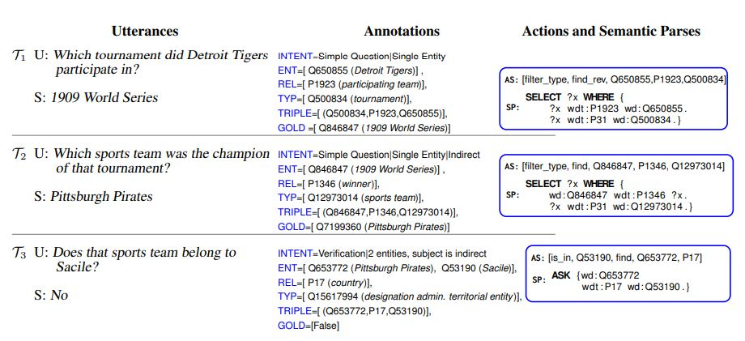
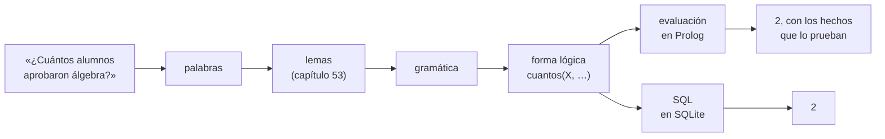

# Capítulo 87 — Proyecto: preguntas en castellano

Una **interfaz en lenguaje natural** para una base de datos responde
preguntas escritas como las escribe una persona: «¿quién cursa lógica?»,
«¿cuántos aprobaron álgebra?», «¿todos los alumnos de civil cursan
análisis 1?». Quien pregunta no necesita conocer el esquema de las tablas,
ni SQL, ni Prolog. El programa tiene que reconocer las palabras aunque
aparezcan flexionadas, construir el significado de la pregunta, buscar la
respuesta en la base y, en un programa que se precie, decir por qué la
respuesta es esa. Este capítulo construye esa interfaz sobre la base de
*Inscripciones* del [capítulo 42](../capitulo-42-prolog-y-sql/index.md),
y traduce cada pregunta, además, a una sentencia SQL que da el mismo
resultado en SQLite.



Un sistema actual de preguntas sobre una base de conocimiento: cada
pregunta del usuario (U) se convierte en una secuencia de acciones y en
una consulta formal, aquí en SPARQL, que la base ejecuta. El capítulo hace
lo mismo con una forma lógica en Prolog y con SQL. Imagen: Laura
Perez-Beltrachini, Parag Jain, Emilio Monti y Mirella Lapata (Universidad
de Edimburgo y Amazon Alexa), del artículo que presenta el conjunto de
datos SPICE,
[CC BY-SA 4.0](https://creativecommons.org/licenses/by-sa/4.0/deed.es), vía
[Wikimedia Commons](https://commons.wikimedia.org/wiki/File:Question_Answer_Semantic_Parsing.jpg).

El programa crece en cinco versiones. La primera busca palabras clave y
llena plantillas, y muestra por qué no alcanza. La segunda es una
gramática que produce la **forma lógica** de la pregunta, con
cuantificadores, sobre palabras reducidas a su lema por el analizador
morfológico del [capítulo 53](../capitulo-53-proyecto-morfologia-castellano/index.md).
La tercera evalúa la forma lógica con un intérprete que construye el
árbol de prueba, como los del
[capítulo 33](../capitulo-33-introspeccion-y-metainterpretes/index.md), y
explica tanto un «sí» como un «no». La cuarta traduce la forma lógica a
SQL, con `NOT EXISTS` para la negación y `WITH RECURSIVE` para las
correlativas, y la ejecuta contra la base SQLite del
[capítulo 42](../capitulo-42-prolog-y-sql/index.md). La quinta reúne todo
en un programa con un bucle de preguntas, una página web y un servicio
con hilos. Un último apartado agrega una clase de pregunta nueva, el
horario de una materia, sin modificar ninguna de las anteriores.

El proyecto parte del apartado 5.2, «A Simple Dialogue Program», de
*Prolog and Natural-Language Analysis* de Fernando Pereira y Stuart
Shieber, que presenta `talk`, un programa que analiza una oración, la
convierte en una cláusula y responde con las soluciones de `setof/3`; y
del apartado 4.1 del mismo libro, que construye las formas lógicas de
los sintagmas cuantificados. Toma de Chat-80, el sistema de David Warren y
Fernando Pereira, la traducción de los determinantes a la lógica de
primer orden, y de los sistemas de consulta en castellano de Veronica
Dahl, los tipos de los argumentos y las presuposiciones. La lista
completa de las fuentes, con lo que se toma de cada una, está en las
[Referencias](#referencias); el código es propio.

El capítulo cumple los anuncios de los capítulos
[33](../capitulo-33-introspeccion-y-metainterpretes/index.md) (las explicaciones de las respuestas),
[36](../capitulo-36-interfaces-de-usuario/index.md) (las preguntas desde una interfaz),
[37](../capitulo-37-concurrencia-y-paralelismo/index.md) (desde un servicio con hilos),
[39](../capitulo-39-tabulacion/index.md) (evaluadas con tablas),
[42](../capitulo-42-prolog-y-sql/index.md) (traducidas a SQL y ejecutadas contra `base.pl`),
[44](../capitulo-44-proyecto-aventura-de-texto/index.md),
[55](../capitulo-55-proyecto-dialogos-plantillas/index.md) y
[56](../capitulo-56-proyecto-ordenes-castellano/index.md) (preguntas sobre una base de datos,
traducidas a formas lógicas), [53](../capitulo-53-proyecto-morfologia-castellano/index.md) (las
formas de los nombres y los verbos reducidas a su lema con `forma/2`),
[54](../capitulo-54-proyecto-traduccion-castellanoingles/index.md) (una gramática que produce formas
lógicas como interlingua para consultar una base) y
[73](../capitulo-73-proyecto-horarios-inscripciones/index.md) (el horario de una materia). Carga sin
copiarlos `base.pl` y `sqlite.pl` del [capítulo 42](../capitulo-42-prolog-y-sql/index.md), el
analizador del [capítulo 53](../capitulo-53-proyecto-morfologia-castellano/index.md) y `oferta.pl`
del [capítulo 73](../capitulo-73-proyecto-horarios-inscripciones/index.md). Todos los archivos son
`% solo-local`, porque son módulos que cargan otros; las pruebas que ejecutan SQL necesitan, además,
el controlador ODBC de SQLite de la [sección
42.7](../capitulo-42-prolog-y-sql/odbc.md#la-base-en-sqlite).

## Objetivos del capítulo

Al terminar el capítulo, el lector puede:

- explicar por qué una búsqueda de palabras clave responde mal las
  preguntas con negaciones, modificadores o cuantificadores;
- escribir una gramática que construye la forma lógica de una pregunta,
  con los sintagmas nominales como funciones sobre la propiedad que el
  resto de la oración les aplica;
- usar los tipos de los argumentos y la concordancia para descartar los
  análisis que no tienen sentido;
- evaluar una forma lógica con un intérprete que devuelve el árbol de
  prueba, y explicar por qué una pregunta de sí o no da «no»;
- traducir una forma lógica a SQL, con la negación como `NOT EXISTS` y la
  recursión como `WITH RECURSIVE`, y comparar las dos evaluaciones;
- extender un programa en módulos con una clase nueva de pregunta sin
  modificar los módulos.

!!! info "Tiempo estimado"
    Leer el capítulo, ejecutar sus ejemplos y hacer las actividades: **1:50 h**.
    Resolver los 5 ejercicios marcados con ★: **1:05 h**.
    Resolver los 11 ejercicios del final: **3:15 h**.

## 87.1 Preguntas sobre *Inscripciones*

La base del [capítulo 42](../capitulo-42-prolog-y-sql/index.md) tiene
siete alumnos, siete materias, siete correlativas y diecisiete
inscripciones. Una pregunta típica es «¿cuántos alumnos aprobaron
álgebra?». La respuesta se obtiene en cuatro pasos:

1. **Las palabras.** El texto se separa en
   `["cuántos", "alumnos", "aprobaron", "álgebra"]`.
2. **Los lemas y los nombres.** «alumnos» es el plural de *alumno*,
   «aprobaron» es la tercera persona del plural del pretérito de
   *aprobar*, y «álgebra» es el nombre de la materia `alg`.
3. **La forma lógica.** La pregunta pide cuántos X cumplen dos
   condiciones: `cuantos(X, y(alumno(X), aprobar(X, alg)))`.
4. **La evaluación.** Las inscripciones en `alg` son las de los legajos
   101 (nota 9), 102 (2), 103 (5) y 104 (7). Aprueban, con 6 o más, ana y
   diego: la respuesta es 2, y la prueban `inscripcion(101, alg, 9)` e
   `inscripcion(104, alg, 7)`.



Pereira y Shieber describen así su programa `talk`: analizar la oración y
construir a la vez su forma lógica; convertirla en una cláusula de Horn,
si se puede; y agregarla a la base, si es una afirmación, o ejecutarla como
consulta, si es una pregunta. La respuesta a una pregunta son las
soluciones de `setof/3`, o `[no]` si no hay ninguna, y una oración que no
se analiza recibe la respuesta `error('too difficult')`. Las respuestas
son **extensionales**: «¿qué escribió Bertrand?» se responde con los
libros que se prueba que escribió, nunca con «todos los libros». Este
capítulo conserva esas tres fases y esa respuesta extensional, y se
limita a las preguntas, como los sistemas de consulta de bases de datos
que los autores citan.

Lo que hace difícil el problema aparece en cuanto las preguntas dejan de
ser las del ejemplo. Las palabras llegan flexionadas («aprobó»,
«aprueba», «aprobaron») y con tildes o sin ellas. «¿Quién no aprobó
álgebra?» tiene las mismas palabras importantes que «¿quién aprobó
álgebra?». «De sistemas» y «que cursan paradigmas» restringen el conjunto
del que se habla. «Todos» y «algún» son cuantificadores, y su alcance hay
que construirlo. El castellano admite el sujeto después del verbo:
en «¿qué materias cursa ana?», ana es el sujeto. Y las correlativas de las
correlativas forman una relación recursiva que, escrita con la recursión
a la izquierda, no termina sin tablas.

## 87.2 El programa terminado

| Versión | Archivo | Agrega | Lo que no puede hacer todavía |
|---|---|---|---|
| 1 | `claves.pl` | la clase de respuesta, el verbo y los nombres propios, por palabras clave; una plantilla por clase | leer la negación, los modificadores y los cuantificadores |
| — | `palabras.pl`, `lemas.pl`, `nombres.pl` | las palabras de una pregunta; su lema, con el [capítulo 53](../capitulo-53-proyecto-morfologia-castellano/index.md) y una tabla; los nombres propios de la base | — |
| 2 | `gramatica.pl` | la forma lógica, con cuantificadores, tipos y concordancia | responder |
| 3 | `evaluar.pl` | la evaluación, el árbol de prueba, por qué no, las presuposiciones; las correlativas con una tabla | dar la sentencia SQL |
| 4 | `sql.pl`, `consulta_sql.pl` | la traducción a SQL y su ejecución con ODBC | conversar |
| 5 | `preguntas.pl`, `servicio.pl` | las respuestas en castellano, el bucle, la página web y el servicio con hilos | — |
| — | `horario.pl` | una clase de pregunta más: el horario del [capítulo 73](../capitulo-73-proyecto-horarios-inscripciones/index.md) | — |
| — | `costos.pl` | las mediciones que el capítulo imprime, con sus pruebas | — |

El programa completo se carga con `preguntas.pl`. `preguntar/1` escribe la
respuesta y los hechos de la base que la prueban, y `sql/1` escribe la
sentencia SQL de la misma pregunta:

<!-- contexto: capitulo-87/preguntas.pl -->
```prolog
?- preguntar("¿Cuántos aprobaron álgebra?").
2
  ana: inscripcion(101, alg, 9), 9 >= 6
  diego: inscripcion(104, alg, 7), 7 >= 6
true.

?- sql("¿Cuántos aprobaron álgebra?").
SELECT COUNT(DISTINCT t1.legajo)
FROM alumnos t1, inscripciones t2
WHERE t2.legajo = t1.legajo
  AND t2.materia = 'alg'
  AND t2.nota >= 6
true.
```

SQLite responde 2 a esa sentencia, sobre la base del
[capítulo 42](../capitulo-42-prolog-y-sql/index.md). Una pregunta de sí o
no que da «no» se explica con el hecho que falta o que no alcanza:

```prolog
?- preguntar("¿Bruno aprueba álgebra?").
No
  inscripcion(102, alg, 2), y 2 < 6
true.
```

## 87.3 Versión 1: palabras clave

La forma más simple de responder una pregunta es reconocer en ella unas
pocas palabras y llenar una plantilla, como los programas de diálogo del
[capítulo 55](../capitulo-55-proyecto-dialogos-plantillas/index.md). La
versión 1 reduce la pregunta a tres datos: la **clase de respuesta**
(«quién» y «qué» piden una lista, «cuántos» un número, y una pregunta sin
palabra interrogativa pide sí o no), el **verbo**, reconocido por el
comienzo de la palabra («curs», «aprob», «necesit»), y los **nombres
propios** que menciona. Una plantilla por clase consulta la base:

<!-- ejemplo: capitulo-87/claves.pl predicado: plantilla/4 respuestas/3 -->
```prolog
%!  plantilla(+Clase, +Verbo, +Entidades:list, -Respuesta) is semidet.
%
%   Respuesta responde la plantilla de Clase con Verbo y Entidades. Con una
%   materia y una lista o un número, la pregunta es por los alumnos; con
%   un alumno, por las materias; sí o no necesita un alumno y una materia.
plantilla(lista, Verbo, Entidades, lista(Nombres)) :-
    respuestas(Verbo, Entidades, Claves),
    maplist(nombre_de, Claves, Nombres).
plantilla(numero, Verbo, Entidades, numero(N)) :-
    respuestas(Verbo, Entidades, Claves),
    length(Claves, N).
plantilla(si_no, Verbo, Entidades, Respuesta) :-
    memberchk(alumno-Legajo, Entidades),
    memberchk(materia-Materia, Entidades),
    (   relacion(Verbo, Legajo, Materia)
    ->  Respuesta = si
    ;   Respuesta = no
    ).

%!  respuestas(+Verbo, +Entidades:list, -Claves:list) is semidet.
%
%   Claves son, ordenadas, las entidades que cumplen Verbo con la primera
%   entidad que se menciona: los alumnos de una materia, las materias de
%   un alumno, o los requisitos de una materia.
respuestas(Verbo, [Tipo-Entidad|_], Claves) :-
    (   Tipo == materia, Verbo \== necesitar
    ->  findall(L, relacion(Verbo, L, Entidad), Ls)
    ;   findall(M, relacion(Verbo, Entidad, M), Ls)
    ),
    sort(Ls, Claves).
```

Con las preguntas para las que fue pensada, la versión responde bien:

<!-- contexto: capitulo-87/claves.pl -->
```prolog
?- responder_claves("¿Quién cursa lógica?", R).
R = lista(["ana", "bruno", "diego", "facundo"]).

?- responder_claves("¿Cuántos aprobaron álgebra?", R).
R = numero(2).
```

Con las demás, responde mal sin advertirlo:

```prolog
?- responder_claves("¿Quién no aprobó álgebra?", R).
R = lista(["ana", "diego"]).

?- responder_claves("¿Cuántos alumnos de sistemas aprobaron álgebra?", R).
R = numero(0).

?- datos_clave("¿Cuántos alumnos de sistemas aprobaron álgebra?", C, V, Es).
C = numero,
V = aprobar,
Es = [carrera-sistemas, materia-alg].

?- responder_claves("¿Qué necesita bases de datos?", R).
R = lista(["paradigmas", "sintaxis"]).

?- responder_claves("¿Quién aprueba lógica?", R).
false.
```

Cada error tiene una causa distinta. La negación no es una palabra clave,
y «¿quién no aprobó álgebra?» da los que aprobaron. La plantilla toma la
primera entidad que la pregunta nombra, y en la segunda pregunta es la
carrera, de modo que cuenta las materias que «sistemas» aprobó: ninguna;
la respuesta correcta es 2, porque ana y diego son de sistemas. Las
correlativas de bases de datos son, de forma directa, paradigmas y
sintaxis, pero bases de datos también necesita lógica y álgebra, que son
correlativas de esas dos. Y «aprueba» no empieza con «aprob». Ninguno de
estos errores se arregla agregando palabras clave: la negación tiene un
alcance, «de sistemas» modifica a «alumnos» y no al verbo, y la
recursión de las correlativas no es una palabra. Hace falta la estructura
de la pregunta.

!!! question "Actividad"
    Predecir qué responde `responder_claves/2` a «¿Cuántas materias aprobó
    ana?» y a «¿Bruno aprobó lógica?». Comprobarlo, y escribir otra
    pregunta que la versión 1 responda mal por una causa distinta de las
    cuatro anteriores.

## 87.4 Las palabras de la pregunta

Antes de la gramática, tres módulos preparan las palabras, y la página
[Las palabras de la pregunta](palabras.md#las-palabras-los-lemas-y-los-nombres)
los presenta. `palabras.pl` separa el texto en palabras en minúsculas,
sin signos de puntuación. `lemas.pl` carga el analizador morfológico del
[capítulo 53](../capitulo-53-proyecto-morfologia-castellano/index.md),
agrega a su léxico los verbos *cursar*, *aprobar* y *necesitar* y los
nombres *alumno*, *materia* y *carrera*, y tabula `analisis/2`, de modo
que cada palabra se analiza una sola vez en la sesión:

<!-- contexto: capitulo-87/lemas.pl -->
```prolog
?- analisis("aprobaron", A).
A = verbo("aprobar", preterito, 3, plural).
```

La primera vez, analizar «¿Cuántos alumnos de sistemas aprobaron
álgebra?» cuesta unas 279 000 inferencias, casi todas del analizador
morfológico; la segunda, unas 500 (prueba `costos:una_pregunta`).
`nombres.pl` reconoce los nombres propios a partir de la base: los
alumnos y las carreras por su nombre, y las materias por su nombre
escrito, con tildes y espacios, sin distinguir tildes al comparar. La
forma lógica usa las claves de la base, el legajo y el código, y no los
nombres, porque dos alumnos pueden llamarse igual.

## 87.5 Versión 2: la gramática y la forma lógica

**La forma lógica.** La pregunta se representa con los cuantificadores
del [capítulo 54](../capitulo-54-proyecto-traduccion-castellanoingles/index.md#548-version-6-una-interlingua-con-cuantificadores),
`todo(X, R, A)` y `alguno(X, R, A)`, donde R es la **restricción** («los
alumnos de civil») y A el **alcance** («cursan análisis 1»), con
`y(A, B)` para la conjunción y `no(F)` para la negación. Los predicados
son los de la base, con los lemas castellanos: `alumno/1`, `materia/1`,
`carrera/2`, `cursar/2`, `aprobar/2` y `necesitar/2`. Una pregunta es una
de tres formas:

| Pregunta | Forma lógica |
|---|---|
| «¿quién cursa lógica?» | `cual(X, y(alumno(X), cursar(X, log)))` |
| «¿cuántos aprobaron álgebra?» | `cuantos(X, y(alumno(X), aprobar(X, alg)))` |
| «¿ana aprobó lógica?» | `si_no(aprobar(101, log))` |
| «¿todos los alumnos de civil cursan análisis 1?» | `si_no(todo(X, y(alumno(X), carrera(X, civil)), cursar(X, am1)))` |
| «¿ningún alumno aprobó sintaxis?» | `si_no(no(alguno(X, alumno(X), aprobar(X, ssl))))` |

Es la traducción de Chat-80. Warren y Pereira traducen «a» y «some» con
`exists(X, R & S)`, «no» con `\+exists(X, R & S)`, «every» con
`\+exists(X, R & \+S)`, «which» con `answer(X) <= R & S` y «how many» con
`answer(N) <= numberof(X, R & S, N)`. `cual/2` es su `answer/1`,
`cuantos/2` su `numberof/3`, y `todo/3` se evaluará como su doble
negación. Pereira y Shieber escriben las preguntas de `talk` del mismo
modo, como una condición seguida de `answer(X)`.

**Los sintagmas nominales.** La dificultad está en el sujeto. En «todo
alumno aprueba», el verbo aporta `aprobar(X, …)`, pero la fórmula
completa empieza con el cuantificador, que aporta el sujeto. Pereira y
Shieber (apartado 4.1.4) adoptan la solución de Montague: el sintagma
nominal es una función que recibe la propiedad que el resto de la
oración dice de él, `X^P`, y devuelve la fórmula. En Prolog, la función es
el término `(X^P)^F`, y aplicarla es unificar. Un nombre propio aplica la
propiedad a su constante; un determinante la pone como alcance de su
cuantificador:

<!-- ejemplo: capitulo-87/gramatica.pl predicado: oracion//1 sn//3 -->
```prolog
%!  oracion(?F)// is nondet.
%
%   Una oración con sujeto y predicado cuya fórmula es F: el sujeto
%   recibe la propiedad del predicado.
oracion(F) -->
    sn(Numero, Tipo, (X^P)^F),
    sv(Numero, Tipo, X^P).

%!  sn(?Numero, ?Tipo, ?SN)// is nondet.
%
%   Un sintagma nominal de Numero, que nombra algo de Tipo. SN es
%   (X^P)^F: aplicado a la propiedad X^P, da la fórmula F.
sn(singular, Tipo, (E^P)^P) -->
    nombre_propio(Tipo, E),
    { Tipo \== carrera }.
sn(plural, Tipo, (X^P)^todo(X, R, P)) -->
    todos(Genero),
    nucleo(plural, Genero, Tipo, X^R).
sn(singular, Tipo, (X^P)^alguno(X, R, P)) -->
    alguno(Genero),
    nucleo(singular, Genero, Tipo, X^R).
sn(singular, Tipo, (X^P)^no(alguno(X, R, P))) -->
    ninguno(Genero),
    nucleo(singular, Genero, Tipo, X^R).
```

`sn(singular, Tipo, (E^P)^P)` es el «relativamente poco intuitivo»
`(shrdlu^S)^S` de Pereira y Shieber: la posición de la variable la ocupa
la constante, porque la aplicación ya está hecha por unificación. El
predicado verbal es la propiedad: el verbo transitivo aplica el objeto a
la propiedad «el sujeto X hace Lema con Y».

<!-- ejemplo: capitulo-87/gramatica.pl predicado: sv//3 verbo//4 verbo_tipos/3 -->
```prolog
%!  sv(?Numero, ?Tipo, ?P)// is nondet.
%
%   Un sintagma verbal en Numero cuyo sujeto es de Tipo. P es X^F, la
%   propiedad que el predicado dice de X. El átomo del verbo se arma
%   antes de analizar el objeto, que lo recibe ya construido.
sv(Numero, Tipo, X^no(F)) -->
    palabra("no"),
    sv(Numero, Tipo, X^F).
sv(Numero, Tipo, X^F) -->
    verbo(Numero, Lema, Tipo, TipoO),
    { A =.. [Lema, X, Y] },
    sn(_, TipoO, (Y^A)^F).

%!  verbo(?Numero, ?Lema, ?TipoS, ?TipoO)// is nondet.
%
%   Una forma de tercera persona de un verbo transitivo cuyo sujeto es de
%   TipoS y su objeto de TipoO.
verbo(Numero, Lema, TipoS, TipoO) -->
    [Palabra],
    { analisis(Palabra, verbo(LemaS, _, 3, Numero)),
      atom_string(Lema, LemaS),
      verbo_tipos(Lema, TipoS, TipoO) }.

% verbo_tipos(Lema, TipoS, TipoO): el sujeto de Lema es de TipoS y su
% objeto de TipoO.
verbo_tipos(cursar, alumno, materia).
verbo_tipos(aprobar, alumno, materia).
verbo_tipos(necesitar, materia, materia).
```

El orden de `sv//3`, el átomo antes que el objeto, es el patrón 101:

!!! example "Patrón 101 — Construir la propiedad antes de aplicarla"
    **Problema.** En una gramática que construye la forma lógica mientras
    analiza, el significado de un sintagma depende de otro: el
    cuantificador del sujeto necesita la propiedad que el predicado dice
    de él, y el objeto, el átomo del verbo del que es argumento.

    **Versión ingenua.** Analizar primero y construir la forma lógica
    después, en una segunda pasada sobre el árbol sintáctico que
    reordena los cuantificadores; o hacer que cada sintagma nominal dé
    solo su variable, y agregar su cuantificador desde afuera, donde ya
    no se sabe cuál es su alcance.

    **Patrón.** Representar lo que falta como una **propiedad**, el
    término `X^P`, y pasarla al sintagma que la aplica: un sintagma
    nominal es `(X^P)^F`, y aplicarlo es unificar. Un nombre propio pone
    su constante en lugar de X; un determinante pone P como alcance de
    su cuantificador. `sv//3` arma el átomo del verbo con `=..` **antes**
    de analizar el objeto, que recibe `(Y^A)^F` con la propiedad ya
    construida. Construida antes, la propiedad es un término que el
    sintagma puede examinar y copiar: la coordinación del
    [ejercicio 11](soluciones.md#11) la aplica una vez a cada nombre, lo
    que no se puede hacer con una variable. Como en el
    [Patrón 75](../patrones.md#75-dos-representaciones-unidas-por-un-hecho-que-comparte-las-variables),
    las variables compartidas unen las dos partes sin ningún paso de
    conversión.

    **Cuándo no usarlo.** Cuando la propiedad no se puede construir
    antes de que se aplique: en `oracion//1` el sujeto se analiza antes
    que el verbo, y recibe `X^P` con P todavía libre. La aplicación por
    unificación sigue funcionando, pero nada que examine la propiedad:
    «¿Ana y diego cursan lógica?» no se analiza. Ahí hace falta un
    término que represente la aplicación pendiente, como los árboles de
    cuantificadores del apartado 4.1.6 de Pereira y Shieber. Y cuando el
    significado de un sintagma no depende de ningún otro, como en las
    plantillas de la [versión 1](#873-version-1-palabras-clave).

**Los tipos.** Cada verbo declara el tipo de su sujeto y de su objeto, y
cada nombre propio y cada nombre común tienen el suyo. Es la propuesta de
Veronica Dahl para sus sistemas de consulta en castellano: los tipos
descartan durante el análisis, por unificación, las lecturas que no
tienen sentido, y evitan consultar la base con preguntas absurdas. Chat-80
hace lo mismo con los tipos de las plantillas de su diccionario.

**Las preguntas.** Una pregunta con «quién» es un sintagma verbal cuyo
sujeto es un alumno. Una con «qué» o «cuántos» puede llevar un núcleo
nominal, «qué materias», «cuántos alumnos de sistemas», y lo que sigue es
el sintagma verbal, si lo interrogado es el sujeto, o el verbo con su
sujeto pospuesto, si es el objeto: «¿qué materias cursa ana?». Una
pregunta sin palabra interrogativa es una oración.

<!-- ejemplo: capitulo-87/gramatica.pl predicado: pregunta//1 resto_interrogativo//3 -->
```prolog
%!  pregunta(?Forma)// is nondet.
%
%   Una pregunta con forma lógica Forma: con «quién», con «qué» o
%   «cuántos» seguidos o no de un nombre, o de sí o no.
pregunta(cual(X, y(alumno(X), F))) -->
    quien(Numero),
    sv(Numero, alumno, X^F).
pregunta(Forma) -->
    interrogativo(Clase, Genero),
    nucleo(Numero, Genero, Tipo, X^R),
    resto_interrogativo(Numero, Tipo, X^F),
    { forma_pregunta(Clase, X, y(R, F), Forma) }.
pregunta(Forma) -->
    interrogativo(Clase, _),
    resto_interrogativo(_, Tipo, X^F),
    { restriccion(Tipo, X, R),
      forma_pregunta(Clase, X, y(R, F), Forma) }.
pregunta(si_no(F)) -->
    oracion(F).

%!  resto_interrogativo(?Numero, ?Tipo, ?P)// is nondet.
%
%   Lo que sigue a la palabra interrogativa: el verbo con su sujeto, si
%   lo interrogado es el objeto, o el sintagma verbal, si es el sujeto. P
%   es X^F, la propiedad que se pregunta de X, de Tipo.
resto_interrogativo(_, Tipo, X^F) -->
    verbo(NumeroV, Lema, TipoS, Tipo),
    { A =.. [Lema, Y, X] },
    sn(NumeroV, TipoS, (Y^A)^F).
resto_interrogativo(Numero, Tipo, X^F) -->
    sv(Numero, Tipo, X^F).
```

Los modificadores del núcleo son dos: «de» con el nombre de una carrera,
solo después de un nombre de alumnos, y una relativa, «que» con un
sintagma verbal del que el núcleo es el sujeto:

<!-- ejemplo: capitulo-87/gramatica.pl predicado: nucleo//4 de_carrera//4 relativa//5 -->
```prolog
%!  nucleo(?Numero, ?Genero, ?Tipo, ?P)// is nondet.
%
%   Un nombre común con sus modificadores: «alumnos de sistemas»,
%   «materias que cursa ana». P es X^R, lo que el núcleo dice de X.
nucleo(Numero, Genero, Tipo, X^R) -->
    nombre_comun(Numero, Genero, Tipo, X^R0),
    de_carrera(Tipo, X, R0, R1),
    relativa(Numero, Tipo, X, R1, R).

%!  de_carrera(?Tipo, ?X, ?R0, ?R)// is nondet.
%
%   «de sistemas» después de un nombre de alumnos agrega la carrera a R0;
%   sin ese complemento, R es R0.
de_carrera(alumno, X, R0, y(R0, carrera(X, C))) -->
    palabra("de"),
    nombre_propio(carrera, C).
de_carrera(_, _, R, R) -->
    [].

%!  relativa(?Numero, ?Tipo, ?X, ?R0, ?R)// is nondet.
%
%   «que» y un sintagma verbal del que X es el sujeto agregan una
%   condición a R0; sin relativa, R es R0.
relativa(Numero, Tipo, X, R0, y(R0, F)) -->
    palabra("que"),
    sv(Numero, Tipo, X^F).
relativa(_, _, _, R, R) -->
    [].
```

<!-- contexto: capitulo-87/gramatica.pl -->
```prolog
?- analizar("¿Cuántos aprobaron álgebra?", F).
F = cuantos(_A, y(alumno(_A), aprobar(_A, alg))).

?- analizar("¿Qué materias cursa ana?", F).
F = cual(_A, y(materia(_A), cursar(101, _A))).

?- analizar("¿Todos los alumnos de civil cursan análisis 1?", F).
F = si_no(todo(_A, y(alumno(_A), carrera(_A, civil)), cursar(_A, am1))).
```

En «¿qué materias cursa ana?», la lectura con «materias» como sujeto no
llega a formarse por dos motivos: el verbo está en singular y «materias»
en plural, y el sujeto de *cursar* es un alumno. Basta uno de los dos:

```prolog
?- lecturas("¿Qué materias cursan ana?", Fs).
Fs = [].
```

**La ambigüedad.** Cuando ni la concordancia ni los tipos deciden, la
pregunta tiene dos lecturas. En «¿qué necesita bases de datos?», «qué»
puede ser el objeto (lo que bases de datos necesita) o el sujeto (lo que
necesita bases de datos): las dos son materias, y «qué» no tiene número.

```prolog
?- lecturas("¿Qué necesita bases de datos?", Fs).
Fs = [cual(_A, y(materia(_A), necesitar(bd, _A))), cual(_B, y(materia(_B), necesitar(_B, bd)))].
```

`analizar/2` se queda con la primera, porque la gramática prueba el
objeto antes que el sujeto, y en castellano esa es la lectura habitual.
Chat-80 tampoco pregunta: resuelve el alcance de los cuantificadores con
reglas sobre el orden de las palabras. La segunda lectura es la que
responde «¿qué materias necesitan bases de datos?», con el verbo en
plural.

!!! question "Actividad"
    Predecir la forma lógica de «¿Qué alumnos que cursan paradigmas
    aprobaron lógica?» y de «¿Ningún alumno de civil aprobó álgebra?».
    Comprobarlas con `analizar/2`, y explicar por qué «¿Cuántas alumnos
    aprobaron lógica?» no tiene ninguna.

## 87.6 Versión 3: evaluar y explicar

Pereira y Shieber convierten la forma lógica en una cláusula de Horn con
`clausify/3` y la ejecutan con `setof/3`. La conversión es parcial: «who
wrote every book?» da `all(B, book(B) => wrote(X, B)) => answer(X)`, que
no es una cláusula de Horn, y la respuesta es «too difficult». La versión
3 no convierte la forma lógica: la **interpreta**, con un metaintérprete
como los del [capítulo 33](../capitulo-33-introspeccion-y-metainterpretes/index.md#334-arboles-de-prueba),
que devuelve además el árbol de prueba. `todo/3` es la doble negación de
Chat-80: no hay un caso de la restricción que no cumpla el alcance.

<!-- ejemplo: capitulo-87/evaluar.pl predicado: probar/2 definicion/2 -->
```prolog
%!  probar(+F, -Arbol) is nondet.
%
%   F se cumple en la base, con la prueba Arbol: una respuesta por cada
%   prueba. Las variables de F que quedan ligadas son las que la prueba
%   instancia.
probar(y(A, B), y(TA, TB)) :-
    probar(A, TA),
    probar(B, TB).
probar(alguno(_, R, A), alguno(T)) :-
    once(probar(y(R, A), T)).
probar(no(A), no_se_prueba(A, Motivo)) :-
    \+ probar(A, _),
    por_que_no(A, Motivo).
probar(todo(X, R, A), todos(Casos)) :-
    \+ ( probar(R, _), \+ probar(A, _) ),
    findall(X-T, ( probar(R, _), once(probar(A, T)) ), Casos0),
    sort(1, @<, Casos0, Casos).
probar(Atomo, prueba(Atomo, Hechos)) :-
    definicion(Atomo, Hechos).

%!  definicion(?Atomo, -Hechos:list) is nondet.
%
%   Hechos son los hechos de la base, y las comparaciones, que prueban
%   Atomo, un predicado de la forma lógica.
definicion(alumno(L), [alumno(L, N, C, I)]) :-
    alumno(L, N, C, I).
definicion(materia(M), [materia(M, N, A)]) :-
    materia(M, N, A).
definicion(carrera(L, C), [alumno(L, N, C, I)]) :-
    alumno(L, N, C, I).
definicion(cursar(L, M), [inscripcion(L, M, N)]) :-
    inscripcion(L, M, N).
definicion(aprobar(L, M), [inscripcion(L, M, N), N >= 6]) :-
    aprobada(L, M, N).
definicion(necesitar(M, R), Cadena) :-
    pasos(M, R, _),
    cadena(M, R, Cadena).
```

`definicion/2` dice qué hechos de la base prueban cada predicado de la
forma lógica: es el diccionario que Warren y Pereira separan de la
gramática, la única parte del programa que depende de la base. Las hojas
del árbol son esos hechos. `evaluar/2` responde y `explicar/2` da, para
cada respuesta, su primera prueba:

<!-- contexto: capitulo-87/evaluar.pl -->
```prolog
?- evaluar(cuantos(X, y(alumno(X), aprobar(X, alg))), R).
R = numero(2).

?- explicar(si_no(aprobar(102, alg)), E).
E = falla(no_alcanza(inscripcion(102, alg, 2), 2<6)).
```

**Por qué no.** Una falla no tiene árbol. `por_que_no/2` la explica como
`explicacion/3` del sistema experto de la
[sección 33.7](../capitulo-33-introspeccion-y-metainterpretes/index.md#337-el-sistema-experto-explica):
en una conjunción, baja por la primera condición que falla; en `todo/3`,
busca el primer caso de la restricción que no cumple el alcance, un
**contraejemplo**; en `alguno/3`, explica por qué falla cada caso. En un
predicado de la base, dice qué falta: la inscripción no existe, o existe
y su nota no alcanza o todavía no tiene nota.

<!-- ejemplo: capitulo-87/evaluar.pl predicado: por_que_no/2 por_que_no_conectiva/2 motivo/2 -->
```prolog
%!  por_que_no(+F, -Motivo) is det.
%
%   Motivo explica por qué F, que no se prueba, falla: en una conjunción,
%   la primera condición que falla con la primera prueba de las
%   anteriores; en todo/3, el primer caso de la restricción que no cumple
%   el alcance; en alguno/3, por qué falla cada caso de la restricción.
por_que_no(F, Motivo) :-
    (   conectiva(F)
    ->  por_que_no_conectiva(F, Motivo)
    ;   motivo(F, Motivo)
    ).

%!  por_que_no_conectiva(+F, -Motivo) is det.
%
%   Motivo explica por qué falla F, una fórmula compuesta.
por_que_no_conectiva(y(A, B), Motivo) :-
    (   once(probar(A, _))
    ->  por_que_no(B, Motivo)
    ;   por_que_no(A, Motivo)
    ).
por_que_no_conectiva(todo(X, R, A), contraejemplo(X, Motivo)) :-
    once(( probar(R, _), \+ probar(A, _) )),
    por_que_no(A, Motivo).
por_que_no_conectiva(alguno(X, R, A), ninguno(Casos)) :-
    findall(X-M, ( probar(R, _), por_que_no(A, M) ), Casos0),
    sort(1, @<, Casos0, Casos).
por_que_no_conectiva(no(A), se_prueba(Arbol)) :-
    once(probar(A, Arbol)).

%!  motivo(+Atomo, -Motivo) is det.
%
%   Motivo dice qué falta en la base para probar Atomo: aprobar/2 con una
%   inscripción cuya nota no alcanza o falta; cualquier otro predicado,
%   sin hechos que lo prueben.
motivo(aprobar(L, M), Motivo) :-
    inscripcion(L, M, N),
    !,
    (   N == null
    ->  Motivo = sin_nota(inscripcion(L, M, N))
    ;   Motivo = no_alcanza(inscripcion(L, M, N), N < 6)
    ).
motivo(Atomo, sin_hechos(Atomo)).
```

La negación de una pregunta usa el mismo motivo: un alumno está entre
los que «no aprobaron álgebra» porque su nota no alcanza o porque no hay
ningún hecho que lo pruebe. Es el supuesto de mundo cerrado de la
[sección 42.4](../capitulo-42-prolog-y-sql/index.md#424-donde-difieren-bolsas-conjuntos-y-null):
elena y gabriela no están inscriptas en álgebra, y para la base no la
aprobaron.

<!-- contexto: capitulo-87/preguntas.pl -->
```prolog
?- preguntar("¿Quién no aprobó álgebra?").
bruno, carla, elena, facundo y gabriela
  bruno: inscripcion(102, alg, 2), y 2 < 6
  carla: inscripcion(103, alg, 5), y 5 < 6
  elena: ningún hecho prueba aprobar(105, alg)
  facundo: ningún hecho prueba aprobar(106, alg)
  gabriela: ningún hecho prueba aprobar(107, alg)
true.

?- preguntar("¿Todos los alumnos de sistemas aprobaron álgebra?").
No
  bruno: inscripcion(102, alg, 2), y 2 < 6
true.
```

**Las presuposiciones.** «¿Todos los alumnos que cursan bases de datos
aprobaron lógica?» tiene, en lógica, la respuesta «sí»: nadie cursa bases
de datos, y una afirmación sobre todos los elementos de un conjunto vacío
es verdadera. Para quien pregunta, «sí» es engañoso. Dahl observa que una
pregunta así no es verdadera ni falsa sino que no tiene sentido: su
**presuposición**, que hay alumnos que cursan bases de datos, no se
cumple. Sus sistemas usan una lógica con un tercer valor para eso. La
versión 3 verifica la presuposición de «todos» antes de evaluar:

```prolog
?- preguntar("¿Todos los alumnos que cursan bases de datos aprobaron lógica?").
La pregunta supone que hay casos, y no hay ninguno
true.
```

Chat-80 toma la decisión contraria, y la justifica: ignora las
presuposiciones, y a «Which ocean borders the United States?» responde con
los tres océanos sin comentar que la pregunta suponía uno.

**Las correlativas, con una tabla.** «¿Qué necesita bases de datos?» pide
las correlativas de bases de datos, las de esas, y así hasta el final de
la cadena. `necesitar/2` se define con `pasos/3`, escrita con la
recursión a la izquierda y tabulada con la subsunción de respuestas `min`
de la [sección 39.3](../capitulo-39-tabulacion/index.md#393-subsuncion-de-respuestas),
y la explicación de cada requisito es una cadena de las más cortas, que
da `cadena/3`. La página [Las correlativas, con una tabla](correlativas.md)
muestra las dos definiciones y sus respuestas:

<!-- contexto: capitulo-87/evaluar.pl -->
```prolog
?- setof(R-N, pasos(bd, R, N), Ps).
Ps = [alg-2, log-2, pp-1, ssl-1].
```

!!! question "Actividad"
    Predecir la respuesta y la explicación de «¿Algún alumno de industrial
    aprobó lógica?» y de «¿Ningún alumno aprobó sintaxis?». Comprobarlas
    con `preguntar/1`.

## 87.7 Versión 4: la forma lógica en SQL

La forma lógica es un lenguaje de consulta, y se traduce a otro. Cada
predicado corresponde a una tabla: `alumno/1` y `carrera/2` a `alumnos`,
`cursar/2` y `aprobar/2` a `inscripciones`, `materia/1` a `materias`, y
`necesitar/2` a una tabla recursiva que la sentencia define con
`WITH RECURSIVE`. Una variable compartida es una reunión, una constante es
una selección, `no/1` es `NOT EXISTS` y `todo/3` es la doble negación:

<!-- contexto: capitulo-87/preguntas.pl -->
```prolog
?- sql("¿Quién no aprobó álgebra?").
SELECT DISTINCT t1.legajo, t1.nombre
FROM alumnos t1
WHERE NOT EXISTS (SELECT 1 FROM inscripciones t2 WHERE t2.legajo = t1.legajo AND t2.materia = 'alg' AND t2.nota >= 6)
ORDER BY t1.legajo
true.
```

La página [La forma lógica en SQL](sql.md#la-traduccion) explica el
traductor, `sql.pl`, y la página
[La sentencia en SQLite](sql.md#la-sentencia-en-sqlite) ejecuta las
sentencias contra la base del
[capítulo 42](../capitulo-42-prolog-y-sql/index.md) con ODBC y las compara
con la evaluación en Prolog. Las quince preguntas de ejemplo sin
presuposición dan en SQLite la misma respuesta que en Prolog. La que
tiene una presuposición, no: SQL responde «sí», porque `NOT EXISTS` sobre
un conjunto vacío es verdadero, y no tiene un tercer valor para «la
pregunta no tiene sentido».

## 87.8 Versión 5: el programa, el bucle y el servicio

`preguntas.pl` reúne las versiones. `responder/3` analiza, evalúa y
explica; `preguntar/1` escribe la respuesta en castellano y los hechos de
cada prueba, sin los que solo dicen que algo es un alumno o una materia.
Si la gramática no analiza la pregunta, la respuesta es la de `talk`
cuando una oración es «too difficult»:

```prolog
?- preguntar("¿Quién enseña lógica?").
La pregunta no se puede analizar
true.
```

`conversar/0` es el bucle del apartado 5.3 de Pereira y Shieber, que lee
una oración, la responde y vuelve a empezar. Lee una pregunta por línea,
con `read_line_to_string/2`, hasta una línea vacía o el fin de la entrada.
Recibe los dos flujos como argumentos, de modo que las pruebas le dan un
texto con `open_string/2` en lugar del teclado:

<!-- ejemplo: capitulo-87/preguntas.pl predicado: conversar/2 -->
```prolog
%!  conversar(+Entrada, +Salida) is det.
%
%   Lee preguntas de Entrada, una por línea, y escribe en Salida la
%   respuesta de cada una, después de la indicación «> ».
conversar(Entrada, Salida) :-
    format(Salida, "> ", []),
    flush_output(Salida),
    read_line_to_string(Entrada, Linea),
    (   ( Linea == end_of_file ; Linea == "" )
    ->  true
    ;   with_output_to(Salida, preguntar(Linea)),
        conversar(Entrada, Salida)
    ).
```

```text
?- conversar.
> ¿Ana aprobó lógica?
Sí
  inscripcion(101, log, 10), 10 >= 6
> ¿Cuántos aprobaron álgebra?
2
  ana: inscripcion(101, alg, 9), 9 >= 6
  diego: inscripcion(104, alg, 7), 7 >= 6
>
true.
```

La página [Las preguntas como servicio](servicio.md#las-preguntas-como-servicio)
pone el mismo programa detrás de un servidor HTTP con varios hilos, como
el de la [sección 37.6](../capitulo-37-concurrencia-y-paralelismo/index.md#376-los-hilos-del-servidor-http),
con una ruta que responde en JSON y una página con un formulario, armada
con `html//1` como las de la
[sección 36.6](../capitulo-36-interfaces-de-usuario/index.md#366-paginas-web-sobre-los-servicios).

## 87.9 Una pregunta más: el horario de una materia

«¿Cuándo se cursa lógica?» no pide alumnos ni materias, sino las clases de
la semana del horario de ejemplo del
[capítulo 73](../capitulo-73-proyecto-horarios-inscripciones/index.md).
La página [El horario de una materia](horario.md#una-pregunta-mas) la
agrega sin modificar ninguno de los módulos anteriores, con el
[Patrón 79](../patrones.md#79-clausulas-para-un-modulo-cargado): los
predicados que una versión nueva extiende están declarados `multifile`, y
`horario.pl` les agrega una cláusula cada uno. La pregunta no tiene
sentencia SQL, porque el horario no es una tabla de la base del
[capítulo 42](../capitulo-42-prolog-y-sql/index.md).

!!! success "Criterios de calidad"
    | Criterio | En este capítulo |
    |---|---|
    | C1 | cada predicado declara modos y determinación; la gramática es `nondet` y `analizar/2` toma la primera lectura con `once/1`; `evaluar/2`, `explicar/2`, `por_que_no/2`, `preguntar/1` y `sql/2` no dejan alternativas |
    | C2 | representaciones limpias: la forma lógica con `cual/2`, `cuantos/2`, `si_no/1`, `todo/3`, `alguno/3`, `y/2` y `no/1`; los árboles con `prueba/2`; los motivos de una falla con `no_alcanza/2`, `sin_nota/1` y `sin_hechos/1` |
    | C3 | los módulos de los capítulos [42](../capitulo-42-prolog-y-sql/index.md), [53](../capitulo-53-proyecto-morfologia-castellano/index.md) y [73](../capitulo-73-proyecto-horarios-inscripciones/index.md) se cargan sin cambios; la pregunta del horario y los ejercicios agregan cláusulas a predicados `multifile` |
    | C5 | una pregunta que no se analiza tiene su respuesta, y una que no tiene traducción a SQL hace fallar a `sql/2`; ninguna da un resultado incorrecto |
    | C6 | el análisis, la evaluación y la traducción son puros; los efectos están en `preguntar/1`, en el bucle y en los manejadores del servidor |
    | C7 | 120 pruebas en doce archivos, 24 más sobre las soluciones, y 4 más con el controlador ODBC; `costos.plt` verifica las inferencias dentro de un 10 %; `consulta_sql.plt` compara la respuesta de SQLite con la de Prolog en cada pregunta del capítulo; el servidor se prueba con las dieciséis preguntas a la vez |

## Ejercicios

Las soluciones están en [la página de soluciones](soluciones.md). La dificultad
va de 1 (se resuelve consultando el capítulo) a 3 (requiere elaboración propia).
Los marcados con ★ son los que no conviene saltear: cubren lo que el capítulo
tiene de propio. Los ejercicios que piden código se resuelven en archivos
que cargan los del capítulo, sin modificarlos, agregando cláusulas a sus
predicados `multifile` cuando hace falta.

1. ★ **(1)** Predecir la forma lógica y la respuesta de «¿Quiénes cursan
   análisis 2?» y de «¿Cuántas materias cursa carla?». Comprobarlas con
   `analizar/2` y `preguntar/1`.
2. ★ **(1)** Predecir qué responden la versión 1 y la versión 5 a
   «¿Quién no cursa lógica?», y explicar la diferencia. ¿Qué supuesto
   hace la versión 5 sobre los alumnos que no tienen ninguna inscripción?
3. **(1)** Escribir tres preguntas sobre *Inscripciones* que la
   gramática no analiza, cada una por un motivo distinto, y decir qué
   regla falta en cada caso.
4. ★ **(2)** Agregar el verbo «desaprobar»: un alumno desaprobó una
   materia si está inscripto y su nota es menor que 6. Agregar el lema
   al léxico, los tipos del verbo, la definición de
   `desaprobar/2` para `evaluar.pl` y su tabla para `sql.pl`, y
   comprobar «¿Quién desaprobó álgebra?» en Prolog y en SQL.
5. **(2)** «¿Qué alumnos de sistemas cursan paradigmas?» da una
   sentencia con dos veces la tabla `alumnos`. Explicar por qué, y
   escribir `simplificar(+Forma, -Simple)`, que reemplaza
   `y(alumno(X), carrera(X, C))` por `carrera(X, C)`. Comparar las dos
   sentencias y las dos respuestas.
6. ★ **(2)** Escribir `por_que_no_esta(+Texto, +Nombre, -Motivo)`, que
   explica por qué el alumno o la materia Nombre no está en la respuesta
   de una pregunta con «quién», «qué» o «cuántos». Aplicarlo a elena en
   «¿Quién aprobó análisis 1?» y a ana en «¿Quién no aprobó lógica?».
7. ★ **(2)** Escribir `pasos_sin_tabla/3`, la misma definición que
   `pasos/3` sin la tabla, y explicar qué ocurre con `pasos_sin_tabla(bd,
   R, N)`, usando `call_with_inference_limit/3`. Agregar luego, dentro de
   `snapshot/1`, la correlativa `correlativa(log, bd)`, que cierra un
   ciclo, y comprobar que `pasos/3` termina. ¿Qué hay que hacer antes de
   consultar `pasos/3` después del cambio?
8. **(2)** Escribir `responder_lecturas(+Texto, -Respuestas)`, que
   responde cada lectura de una pregunta ambigua, como pares
   Forma-Respuesta. Aplicarlo a «¿Qué necesita bases de datos?» y a
   «¿Qué necesita lógica?».
9. **(2)** Escribir `conversar_por_que(+Entrada, +Salida)`, un bucle que
   escribe solo la respuesta de cada pregunta y, si la línea siguiente
   es «¿por qué?», escribe la explicación de la última pregunta.
10. **(3)** Escribir `sql_presuposicion(+Forma, -SQL)`, una traducción
    de las preguntas de sí o no que da `NULL` cuando una pregunta con
    «todos» no tiene casos, y 1 o 0 en los demás casos. Comprobar en
    SQLite las preguntas 10, 14 y 16 de `ejemplo/2`.
11. **(3)** Agregar la coordinación de nombres propios: «¿Quién cursa
    lógica y álgebra?» pide los alumnos que cursan las dos. Escribir una
    cláusula de `sn//3` que aplica la propiedad a cada nombre y une las
    dos fórmulas con `y/2`. Explicar por qué `copy_term/2` sobre la
    propiedad entera da una respuesta incorrecta en «¿Qué materias
    cursan ana y diego?», y cómo se evita.

## Resumen

| | |
|---|---|
| **interfaz en lenguaje natural** | un programa que responde preguntas escritas en castellano sobre una base de datos |
| **forma lógica** | el significado de la pregunta como una fórmula: qué se pide (una lista, una cantidad, sí o no) y la condición, con cuantificadores, conjunción y negación |
| **restricción y alcance** | las dos partes de un cuantificador: los casos de los que se habla y lo que se dice de ellos |
| **sintagma nominal como función** | `(X^P)^F`: recibe la propiedad que el resto de la oración dice de X y devuelve la fórmula (Montague) |
| **tipos de los argumentos** | el tipo del sujeto y del objeto de cada verbo, que descarta las lecturas sin sentido durante el análisis |
| **presuposición** | lo que una pregunta da por cierto: «todos los alumnos que…» supone que hay alguno |
| **respuesta extensional** | la respuesta como la lista de las entidades que la base prueba |
| `palabras/2`, `sin_tildes/2` | las palabras de una pregunta, y una palabra sin tildes |
| `analisis/2`, `nombre_propio//2`, `nombre_de/2` | los lemas, tabulados, y los nombres propios de la base |
| `responder_claves/2`, `datos_clave/4` | la versión 1: palabras clave y plantillas |
| `analizar/2`, `lecturas/2`, `sn//3`, `sv//3` | la versión 2: la gramática |
| `probar/2`, `evaluar/2`, `explicar/2`, `por_que_no/2`, `hojas/2`, `pasos/3`, `cadena/3` | la versión 3: la evaluación y las explicaciones |
| `sql/2`, `sql_atomo/4`, `ejecutar_sql/3`, `responder_sql/3` | la versión 4: la traducción a SQL y su ejecución |
| `responder/3`, `preguntar/1`, `sql/1`, `conversar/0`, `conversar/2` | la versión 5: el programa completo y el bucle |
| `respuesta_json/2`, `cuerpo_pagina/2`, `preguntar_servicio/3`, `muchas_preguntas/3` | el servicio y la página web |
| `clases_de/2` | el horario de una materia, del [capítulo 73](../capitulo-73-proyecto-horarios-inscripciones/index.md) |
| `string_lower/2` | un texto con todas sus letras en minúscula |
| `read_line_to_string/2` | lee una línea de un flujo, sin el salto de línea; `end_of_file` al final |
| `open_string/2` | abre un texto como un flujo de entrada; en las pruebas del bucle |
| `uri_encoded/3` | codifica un texto para ponerlo en una dirección |
| `write_term/2` | escribe un término con opciones; `spacing(next_argument)` pone un espacio después de cada coma de los argumentos |
| **[Patrón 101](../patrones.md#101-construir-la-propiedad-antes-de-aplicarla)** | construir la propiedad antes de aplicarla |
| **[Patrón 102](../patrones.md#102-tabla-para-lo-que-la-gramatica-prueba-varias-veces)** | tabla para lo que la gramática prueba varias veces |
| **[Patrón 103](../patrones.md#103-una-forma-logica-dos-evaluadores)** | una forma lógica, dos evaluadores |

## Temas que se retoman

Es el último capítulo del curso. Los temas que quedan abiertos, y los
caminos para seguir, están en el [Cierre del curso](#cierre-del-curso).

## Cierre del curso

La parte I, del [capítulo 1](../capitulo-01-la-primera-hora/index.md) al
[12](../capitulo-12-prolog-y-la-logica/index.md), presentó el lenguaje:
hechos, reglas y consultas, la unificación, la forma en que Prolog busca
las respuestas, la recursión, las listas, la aritmética, el corte y la
negación como falla, y la relación de todo eso con la lógica. La parte
II, del [capítulo 13](../capitulo-13-el-entorno-de-trabajo/index.md) al
[31](../capitulo-31-ejecutables-y-distribucion/index.md), llevó esos
programas a la práctica profesional: estilo y documentación, pruebas,
todas las soluciones, orden superior, gramáticas, restricciones,
módulos, archivos, servicios y ejecutables, con *Inscripciones* como
proyecto común. La parte III, del
[capítulo 32](../capitulo-32-inspeccion-de-terminos/index.md) al
[42](../capitulo-42-prolog-y-sql/index.md), trató los programas como
datos, las interfaces y los hilos, la semántica y la tabulación, la
búsqueda, los juegos y la relación con SQL. La parte IV, del
[capítulo 43](../capitulo-43-proyecto-resolver-ecuaciones/index.md) a
este, construyó programas completos con todo lo anterior: resolver
ecuaciones, una aventura de texto, un compilador, autómatas, la
morfología y la traducción del castellano, una máquina de Prolog, un
demostrador de teoremas, juegos y búsquedas, un motor Datalog, un
intérprete de SQL en el
[capítulo 86](../capitulo-86-proyecto-mini-sql-prolog/index.md), y este
programa que responde preguntas.

Este último proyecto reúne varias de esas técnicas en un solo programa:
una gramática con argumentos que construyen un término, un analizador
morfológico cargado de otro capítulo, un metaintérprete que explica, una
tabla con subsunción de respuestas, la traducción de un lenguaje a otro,
y el mismo núcleo puro detrás de un bucle, de una página y de un servidor
con hilos. Ninguna de esas piezas es nueva en este capítulo; lo nuevo es
que encajan sin modificarse, porque cada una se escribió como una
relación con sus modos declarados y sus pruebas.

Lo que sigue depende del interés de cada lector. El análisis del lenguaje
natural continúa en los libros de Pereira y Shieber y de Covington, y en
Chat-80, cuyo código está publicado. La programación con restricciones y
con tablas tiene en SWI-Prolog bibliotecas mucho más amplias que lo que el
curso mostró, y las bases de datos deductivas continúan en los sistemas
Datalog actuales. Las [Lecturas complementarias](../lecturas.md#para-profundizar)
reúnen textos para cada uno de esos caminos, y la práctica más útil es la
de siempre: escribir programas, con sus pruebas, para problemas propios.

## Referencias

- Fernando C. N. Pereira y Stuart M. Shieber, *Prolog and
  Natural-Language Analysis*, CSLI, 1987; reedición digital de Microtome
  Publishing, 2002 — apartado 5.2, «A Simple Dialogue Program»
  (apartados 5.2.1 a 5.2.4), apartado 5.3, «User Interaction», apartado
  4.1.4, «Quantified Noun Phrases», y el listado del programa `talk` en
  el apéndice A.2. [Edición digital de Microtome](http://www.mtome.com/Publications/PNLA/pnla-digital.html).
  El capítulo toma de allí las tres fases del programa, la forma de las
  preguntas como condición y respuesta, la respuesta extensional, la
  respuesta para una oración que no se analiza, la técnica de Montague
  para los sintagmas nominales ([sección 87.5](#875-version-2-la-gramatica-y-la-forma-logica))
  y el bucle de lectura ([sección 87.8](#878-version-5-el-programa-el-bucle-y-el-servicio)).
- David H. D. Warren y Fernando C. N. Pereira, «An Efficient Easily
  Adaptable System for Interpreting Natural Language Queries»,
  *American Journal of Computational Linguistics* 8 (3–4), 1982,
  páginas 110–122. [ACL Anthology](https://aclanthology.org/J82-3002/).
  Describe Chat-80. El capítulo toma la traducción de los determinantes
  a la lógica de primer orden, con «every» como doble negación y «how
  many» como `numberof/3`; la separación entre el diccionario, que
  depende de la base, y la gramática; y la decisión opuesta sobre las
  presuposiciones ([secciones 87.5](#875-version-2-la-gramatica-y-la-forma-logica)
  y [87.6](#876-version-3-evaluar-y-explicar)). Su planificación de las
  consultas, que reordena las metas según el tamaño de las relaciones,
  se describe en David H. D. Warren, «Efficient processing of
  interactive relational database queries expressed in logic», VLDB,
  1981, que el artículo cita.
- Veronica Dahl, «Translating Spanish into Logic through Logic»,
  *American Journal of Computational Linguistics* 7 (3), 1981, páginas
  149–164. [ACL Anthology](https://aclanthology.org/J81-3002/). Los
  sistemas de consulta de bases de datos en castellano, escritos en
  Prolog en la Universidad de Buenos Aires desde 1976, de los que partió
  Chat-80. El capítulo toma los tipos de los argumentos que descartan
  las lecturas sin sentido y la presuposición de una pregunta con
  «todos» ([sección 87.6](#876-version-3-evaluar-y-explicar)).
- William A. Woods, *Semantics and Quantification in Natural Language
  Question Answering*, informe 3687, Bolt Beranek and Newman, 1977.
  [Copia en Wikimedia Commons, dominio público](https://commons.wikimedia.org/wiki/File:Semantics_and_Quantification_in_Natural_Language_Question_Answering,_November_1977.pdf).
  Lo citan Pereira y Shieber y Warren y Pereira como el origen de las
  formas lógicas con cuantificadores para responder preguntas, en el
  sistema LUNAR.
- Alain Colmerauer, «Metamorphosis grammars», en L. Bolc (ed.),
  *Natural Language Communication with Computers*, Springer, 1978. Sin
  edición en línea de acceso libre verificada. Las gramáticas de las que
  vienen las DCG, con un programa de diálogo comparable a `talk`, según
  Pereira y Shieber; sus cuantificadores de tres ramas son el
  antecedente de `todo/3` y `alguno/3`.
- Laura Perez-Beltrachini, Parag Jain, Emilio Monti y Mirella Lapata,
  «Semantic Parsing for Conversational Question Answering over Knowledge
  Graphs», 2023. [arXiv:2301.12217](https://arxiv.org/abs/2301.12217).
  La figura del comienzo del capítulo, CC BY-SA 4.0, vía Wikimedia
  Commons.

El código del capítulo es propio, escrito para el curso: las fuentes dan
el programa `talk` en inglés y para afirmaciones y preguntas, y las
traducciones de Chat-80 y de Dahl sin programas; la gramática castellana
con tipos y concordancia, el analizador del
[capítulo 53](../capitulo-53-proyecto-morfologia-castellano/index.md)
reutilizado, la evaluación con explicaciones, la tabla de las
correlativas, la traducción a SQL y el servicio no tienen equivalente en
ellas.
